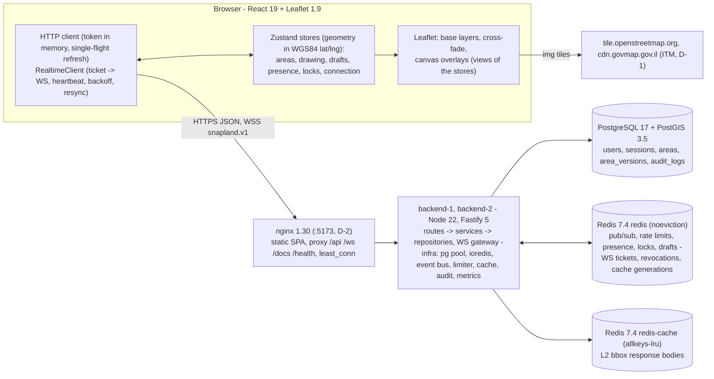
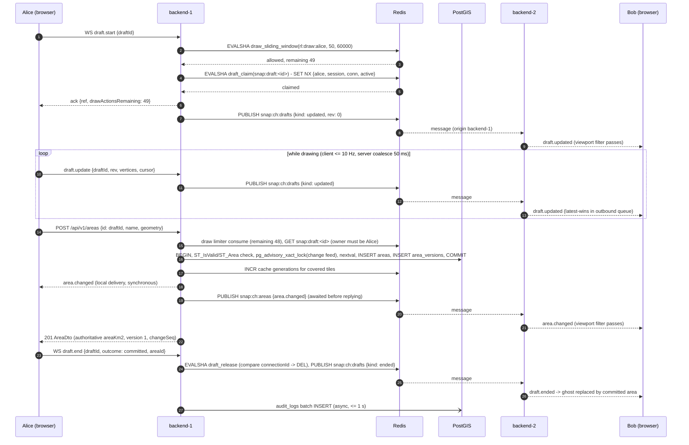
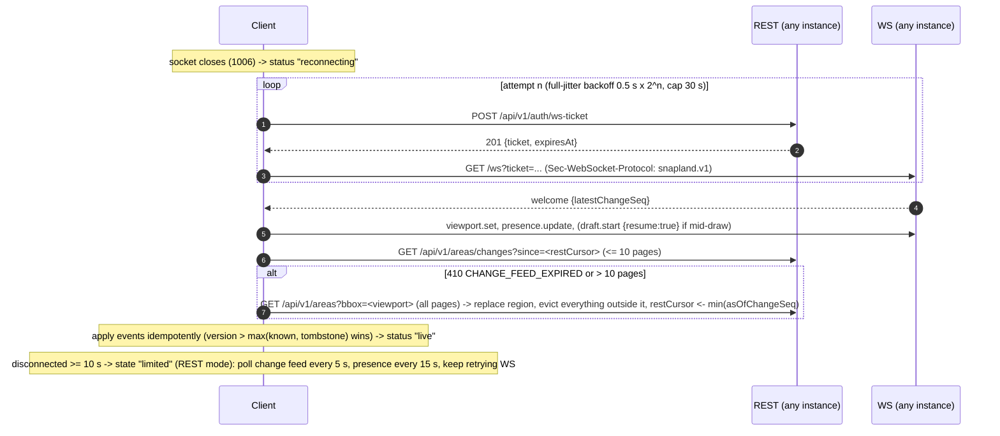
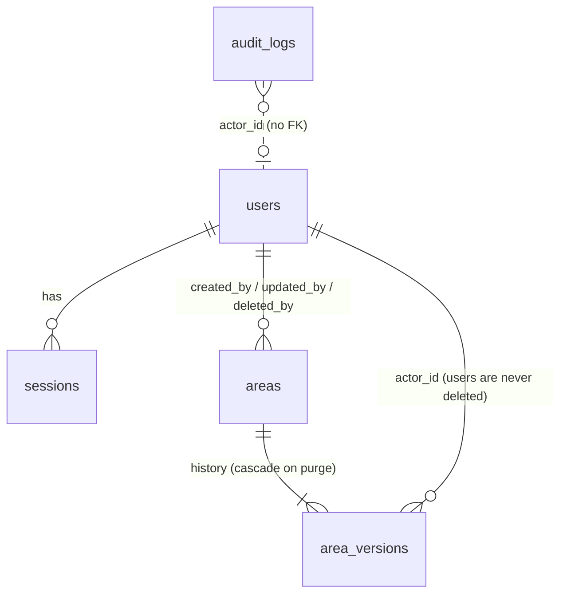

# Snapland - Technical Specification

| | |
|---|---|
| Status | Approved design, rewritten on 2026-09-29 as a concise reference. The build plan, the QA review maps and the T9 change log are kept, unmaintained, in [`docs/archive/spec-history-2026-09.md`](archive/spec-history-2026-09.md). |
| Owner | team-lead |
| Assignment | [`instractions.md`](../instractions.md) |
| Decisions | [User decisions](#user-decisions) below, [`docs/adr/`](adr/) (index in section 15) |
| Reference data | [`docs/fixtures/geodesic-area-fixtures.json`](fixtures/geodesic-area-fixtures.json) |
| UX / UI design | [`docs/design/UX.md`](design/UX.md) (flows, copy, test ids; gap resolutions in section 16), [`docs/design/UI.md`](design/UI.md) v2 "Studio" with [`tokens.css`](design/tokens.css) (every visual value) and [`contrast-check.mjs`](design/contrast-check.mjs) |
| API reference | Swagger UI at `/docs`; [`docs/openapi.json`](openapi.json) is generated from the same schemas (section 12.1) |

This document is the **single source of truth** for module boundaries, contracts (REST, WebSocket, Redis, SQL), conventions and the definition of done. When code and spec disagree, one of them is changed deliberately in the same change set; drift is a defect. The SPEC states rules and the reasons for them; the migrations, `.env.example`, `backend/src/config/env.ts`, the shared schemas and the OpenAPI document hold the details it points to.

Normative words: **MUST / MUST NOT / SHOULD / MAY** as in RFC 2119.

## User decisions

Product-owner decisions win over any other statement in this SPEC or in an ADR. There is no D-3.

| Id | Decision | Where |
|---|---|---|
| D-1 | **The default aerial source is GovMap's 2022 ITM cache** (2026-09-27). *Aerial* (the required satellite view: radio option *Aerial*, the `L` shortcut, `layer-switch-aerial`) activates base-layer id `govmap-itm`, the GovMap orthophoto from the legacy EPSG:2039 cache `https://cdn.govmap.gov.il/LPD0BBK2022/L{LL}/R{row}/C{col}.jpg`: no Referer needed, imagery from about 2022, attribution `תצלום אוויר © GovMap / המרכז למיפוי ישראל`. The product owner chose not to send GovMap's Referer. The required Map <-> Aerial switch is therefore the cross-CRS path of section 8.4. Item 3 of the original decision (keep the 2025 proxy, off by default) is superseded by D-7. | section 8.3, ADR-0009 |
| D-2 | **The app runs in Docker at http://localhost:5173** (2026-09-27). `docker compose up -d --build` publishes the nginx edge, which serves the built frontend and proxies `/api`, `/ws`, `/docs` and `/health`, on host port 5173 (`HTTP_HOST_PORT`). The Vite dev server uses 5174 (`strictPort`) so both can run at once; `CORS_ORIGINS` allows both. Done means: from a clean checkout (after `node scripts/setup-env.mjs`) every default service is healthy and http://localhost:5173 serves sign-up and sign-in, drawing, real-time updates across both backend replicas, and the Map <-> Aerial switch. | section 11 |
| D-4 | The web app adopts the **Studio** look and layout: a docked frame (title bar, tool rail, options bar, inspector, status bar) around the map, self-hosted IBM Plex type and tabular mono values. | section 8.6; block below |
| D-5 | **Dark theme is the default.** A *Theme* switch in the user menu (*Dark* / *Light*, UX C-30) selects the light ("paper") variant. The choice is per browser in `localStorage` key `snapland.theme` (`"light"` or `"dark"`), read in a try/catch that falls back to dark; the OS `prefers-color-scheme` is **not** followed. | section 8.6; block below |
| D-6 | The **collaborator palette** becomes the Studio neon set, in a fixed order. `USER_PALETTE` mirrors `tokens.css`; migration 0009 remaps every stored `users.color` from old slot *i* to new slot *i*, so hash-based assignment stays stable. | section 5.2, section 6.2; block below |
| D-7 | **The GovMap 2025 Web-Mercator tile proxy is deleted** (2026-09-29): the backend `tiles` module and its route `/api/v1/tiles/govmap/*`, the nginx tiles location, cache zone and volume, the `tiles` rate-limit scope, the `snapland_tile_*` metrics, and the `GOVMAP_*`/`TILE_*` settings. *Aerial* keeps the D-1 ITM cache, which the browser loads directly (CSP `img-src` keeps `https://cdn.govmap.gov.il`). The frontend follow-up removed the SPA's proxy branch and `/api/v1/config` `tiles`. | section 8.3; supersedes D-1 item 3 and ADR-0007's proxy |
| D-8 | **A username may be an email address** (2026-09-29). `LIMITS.usernamePattern` accepts a handle (`^[A-Za-z0-9_.-]{3,32}$`) or an ASCII email address (<= 128 characters, dotted domain); migration 0010 relaxes `users_username_format_ck` to the same pattern, and its Down fails while email usernames exist. Uniqueness and sign-in stay case-insensitive through `users_username_lower_uq`. Other users never receive the email: presence and `UserRef` carry `displayName` only, which the SPA defaults to the part before `@`. | section 5.2, section 6.2 |

### User decisions D-4...D-6 (Studio redesign)

Recorded 2026-09-28 from the approved brief
[`docs/superpowers/specs/2026-09-28-studio-redesign-design.md`](superpowers/specs/2026-09-28-studio-redesign-design.md): the product
owner chose concept 1, Studio ([`docs/design/concepts/1-studio/`](design/concepts/1-studio/)). Rationale and consequences:
[ADR-0010](adr/0010-studio-redesign.md). Visual values, sizes and component specs: [`UI.md`](design/UI.md) v2 and
[`tokens.css`](design/tokens.css), which win over the concept frames where they differ (UI.md section 2.7, section 16).

| Id | Decision | Where in this SPEC |
|---|---|---|
| D-4 | The web app adopts the **Studio** look and layout: a docked frame (title bar, tool rail, options bar, inspector, status bar) around the map, self-hosted IBM Plex type and tabular mono values. | section 8.6 *Layout*, *Fonts*; section 4.1 (font packages); section 10.7.6 (CSP unchanged) |
| D-5 | **Dark theme is the default.** A *Theme* switch in the user menu (*Dark* / *Light*, UX C-30) selects the light ("paper") variant. The choice is per browser in `localStorage` key `snapland.theme` (`"light"` or `"dark"`), read in a try/catch that falls back to dark; the OS `prefers-color-scheme` is **not** followed. | section 8.6 *Theme* |
| D-6 | The **collaborator palette** becomes the Studio neon set, in a fixed order. `USER_PALETTE` mirrors `tokens.css`; migration 0009 remaps every stored `users.color` from old slot *i* to new slot *i*, so hash-based assignment stays stable. | section 6.2, section 5.2, section 5.4, section 7.5 examples |

**What D-4...D-6 do not change** (normative): behaviour and flows; every REST and WebSocket contract (no endpoint, schema, message,
status or error code changes; `color` stays a lowercase `#rrggbb` from `USER_PALETTE`); the `data-testid` registry of UX.md section 12
(existing ids keep their elements and meaning, and new elements get ids only once UX.md appends them); the keyboard map; the
accessibility rules; UX timings; and the UX acceptance criteria. UX-AC ids stay stable; criteria for the theme switch and its
persistence are **appended** after the last existing id. The Measure tool stays out of scope. The regression gate for "no behaviour
change" is the existing unit, integration and E2E suites, whose assertions change only where they hard-code a palette colour (moved
slot for slot).

**UI.md v2 and UX.md v2 disagree in places**; the existing precedence (section 8.6: UX.md owns flows, controls, roles, copy, keyboard map,
accessibility and test ids; UI.md owns visual values) settles them, and UI.md styles whatever UX.md specifies. Known cases: the theme
control is UX C-30's `theme-switch` group of two `menuitemradio` items `theme-option-dark` / `theme-option-light` with
`html[data-theme]` always set (not UI.md's single `menuitemcheckbox` `theme-toggle`); History is a disclosure section with
`history-tab[aria-expanded]` (UX section 10 1.3.1, UX-AC-118), not a Details | History tablist; the tool-rail ids are the ones UX-AC-116 names.

**Breakpoint ruling (team lead, 2026-09-28):** docked inspector >= 1200 px (`INSPECTOR_DOCK_MIN_PX`), overlay inspector at 600-1199 px,
phone frame and bottom sheet below 600 px (`SHEET_MAX_PX` = 599), as UX.md v2 section 3.2/section 11 and UX-AC-121/122 specify. This follows the
approved brief ("below 1200 px the inspector becomes an overlay") and the chosen concept; UI.md v2's 900 px split (section 4.1, section 16 V5) and
the `tokens.css` sizes keyed to 900 px are to be re-aligned to 600 by the UI owner. The Activity section (UX C-31, UX-AC-119) is
confirmed **[M]**: it is part of the approved brief and is client-only (built from events the client already receives, no new endpoint).

---

## 0. Glossary

| Term | Meaning |
|---|---|
| **Area** | A persisted polygon with metadata (name, description, computed km², perimeter). Row in `areas`. |
| **Version** | Integer from 1, incremented on every committed mutation of an area (update, delete, restore); each version is an immutable row in `area_versions`. |
| **changeSeq** | Global, monotonically increasing `bigint` of every committed area mutation (sequence `area_change_seq`); the cursor of the change feed and of reconnect-resync. |
| **Draft** | An in-progress polygon a user is drawing (or an existing area being vertex-edited). Ephemeral: memory and Redis pub/sub only, never PostgreSQL. |
| **Drawing action** | The unit that the "50 per minute per user" limit counts (section 10.1). |
| **Instance** | One backend process (`backend-1`, `backend-2` in compose). |
| **Viewport / interest** | The bbox + zoom a WebSocket connection declared with `viewport.set`; the server only sends spatial events that intersect it. |
| **LOD** | Level of detail: zoom-dependent simplification tolerance, coordinate precision and sub-pixel culling of bbox queries. |
| **Soft lock** | Advisory, TTL-bound "user X is editing area Y" marker in Redis, broadcast over WebSocket; never enforced by REST. |
| **Base layer** | The map background. Ids (UI state, persisted preference, `map[data-base-layer]`, E2E hook): `map` (label *Map*, OpenStreetMap) and `govmap-itm` (label *Aerial*, the GovMap 2022 ITM cache, D-1). `aerial` (Esri World Imagery) is only what *Aerial* shows in a build with `VITE_ENABLE_ITM_LAYER=false`. `osm` is only the name of the tile-layer object. |
| **Transport validation** | The zod schema Fastify or the WS dispatcher applies before any handler: JSON shape, types, size caps. Failure -> 400 `VALIDATION_FAILED` (REST) / `error VALIDATION_FAILED` (WS). |
| **Domain validation** | Rules evaluated by services and shared validators after transport validation (geometry section 9, preconditions, permissions). Failure -> 422 / 428 / 403 / 409 with a specific code (section 3.5). |
| **Tombstone (client)** | `areaId → deletedVersion` remembered after a delete, so a late, older event cannot resurrect the area (section 7.12). |
| **Active session** | `revoked_at IS NULL AND now() < expires_at AND now() < absolute_expires_at`, and the user is not disabled (the one definition, section 6.2). |
| **Draft registry** | Redis record `snap:draft:<draftId>` proving which user, session and connection own a live draft (section 7.6). |
| **Draft keepalive** | `draft.touch`: a free, never-relayed WS message sent every `REALTIME.draftTouchIntervalMs` (20 s) while a draft is open and quiet, so a pause never loses the draft to idle expiry (section 7.6). |
| **Page budget** | Upper bound on the stored positions (`vertex_count`) of one bbox page, `LIMITS.bboxPagePositionBudget` (150,000 ~ 3.6 MB of GeoJSON at 7 dp); a page may hold fewer than `limit` items and still carry a `nextCursor` (section 5.5). |

---

## 1. Requirement traceability

Every bullet of `instractions.md` maps to a design section, a primary implementation file and a primary proof (a test or a command); each suite's header lists what else it asserts. `B/` = `backend/`, `F/` = `frontend/`, `S/` = `packages/shared/`, `IT/` = `backend/test/integration/`, `E2E/` = `e2e/tests/`. Groups: 1.1 core requirements, 1.2 database, 1.3 security and reliability, 1.4 map integration, 1.5 real-time drawing, 1.6 technical challenges and advanced backend, 1.7 stack constraints, 1.8 submission deliverables.

| # | Group | Requirement (instractions.md) | Design | Implementation | Proof |
|---|---|---|---|---|---|
| R0 | 1.1 | Intro: "draw and **analyze** areas" | section 8.5 | `F/src/state/selectors.ts` | `F/src/state/selectors.test.ts` |
| R1 | 1.1 | WebSocket server for real-time updates | section 7 | `B/src/modules/realtime/gateway.ts` | `IT/realtime/gateway.int.test.ts` |
| R2 | 1.1 | Save drawn areas with metadata (name, size) | section 6.3 | `B/src/modules/areas/areas.service.ts` | `IT/areas/areas-crud.int.test.ts` |
| R3 | 1.1 | Retrieve all areas within the map bounds | section 5.5, section 6.3 | `B/src/modules/areas/areas-query.service.ts` | `IT/areas/areas-bbox.int.test.ts` |
| R4 | 1.1 | Authentication and session management | section 6.2, ADR-0006 | `B/src/modules/auth/auth.service.ts` | `IT/auth/auth-flow.int.test.ts` |
| R5 | 1.1 | Area versioning and edit history | section 5.2, section 6.3 | `B/src/modules/areas/areas.repository.ts` | `IT/areas/areas-versions.int.test.ts` |
| R6 | 1.1 | Area size in km² | section 8.5 | `S/src/geo/geodesic.ts` + PostGIS `ST_Area(geography)` | `S/src/geo/geodesic.test.ts` |
| R7 | 1.1 | Concurrent drawing by many users | section 7.6, section 10.3 | `B/src/modules/realtime/drafts.ts` | `IT/realtime/drafts.int.test.ts` |
| R8 | 1.1 | Rate limit: 50 drawing actions / min / user | section 10.1, ADR-0008 | `B/src/infra/ratelimit/redis-draw-limiter.ts` | `IT/platform/draw-rate-limit.int.test.ts` |
| R9 | 1.1 | Spatial indexing for bounds queries | section 5.3 | `B/migrations/0004_areas.sql` | `IT/foundation/migrations.int.test.ts` |
| R10 | 1.1 | Caching layer for geographic data | section 10.2 | `B/src/infra/cache/redis-area-cache.ts` | `IT/platform/area-cache.int.test.ts` |
| R11 | 1.1 | Conflict resolution for simultaneous edits | section 10.3, ADR-0005 | `B/src/modules/areas/merge.ts` | `IT/areas/areas-concurrency.int.test.ts` |
| R12 | 1.1 | Validate coordinates, prevent invalid shapes | section 9 | `S/src/geo/validate.ts` | `IT/areas/areas-validation.int.test.ts` |
| R13 | 1.1 | Log all user actions (audit trail and analytics) | section 10.4 | `B/src/infra/audit/buffered-writer.ts` | `IT/platform/audit.int.test.ts` |
| R14 | 1.1 | Graceful degradation when WebSocket fails | section 10.6, section 7.12 | `F/src/realtime/RealtimeClient.ts` | `F/src/realtime/RealtimeClient.test.ts` |
| R15 | 1.1 | Health check endpoints | section 10.9 | `B/src/modules/health/health.service.ts` | `IT/foundation/health.int.test.ts` |
| R16 | 1.2 | Efficient schema for geospatial data | section 5.1, section 5.2, ADR-0003 | `B/migrations/` | `IT/foundation/migrations.int.test.ts` |
| R17 | 1.2 | Database migrations | section 5.4 | `B/src/scripts/migrate.ts` | `IT/foundation/migrations.int.test.ts` |
| R18 | 1.2 | Indexing for spatial queries | section 5.3 | `B/migrations/0004_areas.sql` | `IT/foundation/migrations.int.test.ts` |
| R19 | 1.2 | Large datasets (10,000+ polygons per region) | section 5.5 | `B/src/modules/areas/page-budget.ts`, `S/src/geo/lod.ts` | `IT/areas/areas-bbox.int.test.ts` |
| R20 | 1.2 | Soft deletes and data retention | section 5.6 | `B/src/modules/retention/retention.service.ts` | `IT/platform/retention.int.test.ts` |
| R21 | 1.3 | Input sanitization and validation (+ output encoding) | section 10.7.1 | `S/src/text/sanitize.ts` | `S/src/text/sanitize.test.ts` |
| R22 | 1.3 | CORS configuration | section 10.7.2 | `B/src/infra/http/security.ts` | `IT/foundation/security.int.test.ts` |
| R23 | 1.3 | Error logging and monitoring | section 3.5, section 3.6, section 10.8 | `B/src/infra/http/problem.ts` | `IT/foundation/errors.int.test.ts` |
| R24 | 1.3 | Request timeout handling | section 10.7.3 | `B/src/infra/http/request-timeout.ts` | `IT/foundation/timeouts.int.test.ts` |
| R25 | 1.3 | WebSocket connections secured with tokens | section 7.2 | `B/src/modules/realtime/upgrade-auth.ts` | `IT/realtime/ws-auth.int.test.ts` |
| R26 | 1.4 | Leaflet with OSM (default) + GovMap aerial | section 8.3, ADR-0009 | `F/src/map/baseLayers.ts` | `E2E/layer-switch.spec.ts` |
| R27 | 1.4 | Smooth layer transition | section 8.4 | `F/src/map/crossfade.ts` | `F/src/map/crossfade.test.ts` |
| R28 | 1.4 | Drawn elements stay in place across switches | section 8.4 | `F/src/map/crs.ts` | `E2E/layer-switch.spec.ts` |
| R29 | 1.5 | Draw polygons on both map types | section 8.6 | `F/src/workspace/drawingFlow.ts` | `E2E/layer-switch.spec.ts` |
| R30 | 1.5 | Show other users' drawing in real time | section 7.6 | `F/src/map/RemoteDraftsLayer.ts` | `E2E/two-users-realtime.spec.ts` |
| R31 | 1.5 | Area shown while drawing | section 8.5 | `F/src/state/drawingReducer.ts` | `F/src/state/drawingReducer.test.ts` |
| R32 | 1.5 | Drawing accuracy across layer switches | section 8.4 | `F/src/map/crs.ts` | `E2E/layer-switch.spec.ts` |
| R33 | 1.5 | Show active users viewing / drawing | section 7.7 | `B/src/modules/realtime/presence.ts` | `IT/realtime/presence.int.test.ts` |
| R34 | 1.6 | Coordinate transformations between projections | section 8.1, section 8.2, section 8.4 | `F/src/map/itm.ts` | `F/src/map/itm.test.ts` |
| R35 | 1.6 | Drawing state across layer switches | section 8.4 | `F/src/state/drawingStore.ts` | `E2E/layer-switch.spec.ts` |
| R36 | 1.6 | Optimized WebSocket messages | section 7.8 | `B/src/modules/realtime/outbound-queue.ts` | `B/src/modules/realtime/outbound-queue.test.ts` |
| R37 | 1.6 | Area accounts for Earth's curvature | section 8.5 | `S/src/geo/geodesic.ts` | `S/src/geo/geodesic.test.ts` |
| R38 | 1.6 | Database connection pooling | section 5.7 | `B/src/infra/db/pool.ts` | `IT/foundation/db-pool.int.test.ts` |
| R39 | 1.6 | Message queuing for high-volume WS traffic | section 10.11 | `B/src/modules/realtime/outbound-queue.ts` | `IT/realtime/backpressure.int.test.ts` |
| R40 | 1.6 | Horizontal scaling (several instances) | section 10.10, ADR-0004 | `docker-compose.yml` (`backend-1`, `backend-2`) | `IT/system/cross-instance-rest-ws.int.test.ts` |
| R41 | 1.6 | Telemetry and performance metrics | section 10.8 | `B/src/infra/metrics/metrics.ts` | `IT/foundation/metrics.int.test.ts` |
| R42 | 1.7 | Backend language with WebSocket support | section 4 | Node 22 + TypeScript + Fastify 5 + ws | `npm run build` |
| R43 | 1.7 | PostgreSQL + PostGIS (or justify) | section 4, ADR-0003 | `postgis/postgis:17-3.5-alpine` | `IT/foundation/migrations.int.test.ts` |
| R44 | 1.7 | Modern framework + Leaflet.js | section 4, section 8.6 | React 19 + Leaflet 1.9 (`F/src/map/MapView.tsx`) | `npm run build` |
| R45 | 1.7 | No third-party plugins for collaboration | section 3.4 | `scripts/check-banned-deps.mjs` | `npm run check:deps` |
| S1 | 1.8 | Repository with the complete source | repository | `node scripts/check-publishable.mjs` | `npm run verify` |
| S2 | 1.8 | Database schema and migration files | section 5 | `B/migrations/*.sql` | `IT/foundation/migrations.int.test.ts` |
| S3 | 1.8 | README: setup, decisions, performance, security, limitations, scaling, testing | README | `README.md` | `grep '^## ' README.md` |
| S4 | 1.8 | Docker + docker compose | section 11 | `docker-compose.yml`, `backend/Dockerfile`, `docker/nginx/Dockerfile` | `docker compose up -d --build` (all healthy) |
| S5 | 1.8 | Unit tests for critical backend functionality | section 12.2, section 12.4 | colocated `B/src/**/*.test.ts` | `npm run verify` (unit coverage gate) |
| S6 | 1.8 | API documentation (OpenAPI / Swagger) | section 6 | `B/src/infra/http/openapi.ts` -> `/docs`, `docs/openapi.json` | `IT/foundation/openapi.int.test.ts` |
| S7 | 1.8 | Performance benchmarking results | section 12.5 | `docs/BENCHMARKS.md` | `docs/benchmarks/*.txt` (raw k6 and EXPLAIN output) |
| S8 | 1.8 | Load testing considerations | section 12.5, README | `loadtest/bbox.js` (k6) | `docs/BENCHMARKS.md` section 4-section 7 |


---

## 2. Architecture overview

### 2.1 Components



- **Commands over REST, events over WebSocket** (ADR-0004): every durable mutation goes through one REST write path; the socket carries committed-change events, ephemeral drafts, presence, soft locks and heartbeats. The app stays usable without WebSocket.
- **Stateless backend instances**: durable state in PostgreSQL, shared ephemeral state in Redis; any instance serves any request or socket, with no sticky sessions. Each serves Prometheus metrics on its internal `/metrics` (section 10.8).
- **Server-authoritative geometry and area**: the client previews the geodesic area with the same algorithm as PostGIS (geographiclib, Karney); they agree to ~1e-12 on identical coordinates.

### 2.2 Draw -> save -> broadcast across two instances

Alice's WebSocket lives on `backend-1`, Bob's on `backend-2`. Alice's REST calls may land on either instance.



### 2.3 Reconnect & resync (WebSocket failure)



---

## 3. Repository layout & conventions ("clean best practices")

### 3.1 Layout

npm-workspaces monorepo, ESM everywhere, Node >= 22.13, exact pins and one committed lockfile (ADR-0001).

```text
scripts/          repo tooling in plain .mjs (§3.8): setup-env, check-banned-deps (R45), check-publishable
docker/           nginx/{Dockerfile, nginx.conf, snippets/}; postgres/init/ (pg_stat_statements)
packages/shared/  @snapland/shared: contracts for both sides, no I/O — constants, errors, text/sanitize, geo/ (geodesic,
                  normalize, validate, segments, bbox, tiles, webmercator, lod), schemas/ (REST), protocol/ (WS)
backend/          @snapland/backend: migrations/ (SQL, §5.4); src/main.ts (process entry), app.ts (buildApp), container.ts
                  (composition root), config/env.ts (the only process.env reader), infra/ (adapters, no business rules),
                  modules/{health,meta,auth,areas,realtime,admin,retention}, scripts/; test/{setup,helpers,integration}
frontend/         @snapland/frontend: React 19 + Vite 8 + Leaflet 1.9 (§8.6)
e2e/, loadtest/   Playwright specs against the compose stack; the k6 load test (§12.5)
docs/             SPEC.md, adr/, fixtures/, openapi.json (generated), design/, archive/
```

### 3.2 Layering rules (enforced in review)

`routes` (transport: zod schemas, auth hooks, DTO mapping, HTTP status) -> `service` (domain: business rules, transactions, merge, events, audit) -> `repository` (parameterised named SQL, typed rows, no business decisions).
- `*.routes.ts` never import `pg`, repositories or SQL; they call services and map results through `*.mapper.ts`.
- `*.service.ts` owns transactions (`db.withTransaction`), publishes events **after commit** and records audit events. Services never see `FastifyRequest`: they get an `ActorContext` built by `infra/http/request-context.ts`, which truncates the User-Agent to 512 code points (never rejecting it) and keeps the IP only if `net.isIP()` accepts it.
- `*.repository.ts` holds every statement of its module as a named constant with `$n` placeholders; values are never concatenated into SQL. Outside repositories, SQL appears only in `infra/db/**`, `infra/directory/queries.ts` and the audit writer's batch insert.
- Pure functions (merge planning, LOD math, interest checks, queue policies) live in their own files with unit tests.
- Modules talk only through the `Container` or each other's `index.ts`. Cross-module reads go through the read ports `container.sessions`, `.users`, `.areasReader` and `.drafts`; a module's repository queries only its own tables.
- `packages/shared` ships no I/O and no Node- or DOM-only APIs.

### 3.3 Composition root and module contracts

`backend/src/container.ts` is the only place that wires implementations: config -> logger -> metrics (a `Registry` of its own) -> pg pool -> Redis clients (`cmd`, `sub`, optional `cache`) -> key builders -> event bus -> draw limiter (`RedisDrawRateLimiter`, with its in-process fallback), area cache (`RedisAreaQueryCache`) and audit writer (`BufferedAuditWriter`, wrapped by the request-audit tracker) -> audit coalescer -> access tokens, WS tickets, revocations -> read ports -> draft registry. `createContainer(config, overrides)` is synchronous; tests may override only the bus, the draw limiter, the audit logger and the logger. `container.close()` runs the section 10.12 order and is idempotent.

Each module's `index.ts` exports one factory returning `{ name, register(app), start?(), stop?() }`; `app.ts` registers them in a fixed order, `start()` runs after `listen()` and `stop()` in reverse. **No process-global state**: each container owns its metric registry (served by its own `/metrics`), pool, Redis clients (named `snapland-<role>-<instanceId>`) and `.unref()`'d timers, so several app instances run in one test process; signal and crash handlers live only in `main.ts`, and a startup failure logs `fatal` and exits 1. **Decorations**: `app.authenticate` (Bearer token + Redis revocation mark -> `request.auth`), `app.requireRole('admin')` (reads the **current** role and `disabled` flag; mounted at `preValidation`, so a non-admin always gets 403, never a 400 that reveals validation rules), `app.drawRateLimit(kind)` (section 10.1), `request.actor()`, `rateLimitRoute(scope)` (section 6), and `config: { auditAction }` for the generic audit hook (section 10.4).

### 3.4 TypeScript, lint, format

- `tsconfig.base.json` is `strict` with `noUncheckedIndexedAccess`, `noPropertyAccessFromIndexSignature` and `verbatimModuleSyntax` (`exactOptionalPropertyTypes` stays off: friction with zod and Fastify types). **Live types**: the shared package's `@snapland/source` export condition points at its source for type-checking, ESLint, `tsx`, Vite and Vitest; production builds resolve the compiled `dist`.
- ESLint `strictTypeChecked`, `--max-warnings=0`, no `any`. Security rules: `process.env` only in `backend/src/config/env.ts` and `frontend/src/config.ts` (plus tests, configs, scripts); no HTML sinks outside `frontend/src/map/safe-dom.ts` (section 10.7.1).
- **R45**: `scripts/check-banned-deps.mjs` walks `npm ls --all --json` and fails on any collaboration or drawing plugin (Yjs, socket.io, ShareDB, Automerge, Liveblocks, leaflet-draw, Geoman, ...); it runs in `npm run verify`.
- Prettier (width 110, single quotes); `docs/**` is excluded, `README.md` is formatted.

### 3.5 Error model (RFC 9457 problem details)

Every non-2xx response is `application/problem+json` `{ type: "urn:snapland:problem:<kebab-code>", title, status, code, detail, instance, requestId, errors?[] }` plus documented extensions, except 304 and the **408** that Node itself writes when a request is not received within `HTTP_REQUEST_TIMEOUT_MS`. 5xx bodies carry a generic `detail` with the request id; stack traces, SQL, driver messages and hostnames never appear in a response (they are logged with `err`). `infra/http/problem.ts` is the single error handler: zod errors -> `VALIDATION_FAILED`, **always 400** (domain rules never live in transport schemas, section 9.2); body too large -> 413; wrong media type -> 415; pg `23514` on `areas_geom_valid_ck` -> `INVALID_GEOMETRY`; pg `57014` -> `REQUEST_TIMEOUT`; pg connection failures -> `DEPENDENCY_UNAVAILABLE`; anything else -> `INTERNAL_ERROR`. Catalogue (`packages/shared/src/errors.ts`):

| Code | HTTP | Meaning / extensions |
|---|---|---|
| `VALIDATION_FAILED` | 400 | Schema validation failed. `errors[]` with `path`, `code`, `message`. |
| `INVALID_CURSOR` | 400 | Cursor malformed or issued for different query parameters. |
| `INVALID_BBOX` | 400 | Raised by `areas/bbox-params.ts`: not 4 finite numbers, west >= east, south >= north, out of range, or wider/taller than `LIMITS.bboxMaxSpanPx` at the zoom (section 5.5). |
| `UNAUTHENTICATED` | 401 | Missing or malformed Authorization header. |
| `TOKEN_INVALID` | 401 | Signature, issuer, audience or algorithm check failed. |
| `TOKEN_EXPIRED` | 401 | Access token expired -> the client refreshes. |
| `INVALID_CREDENTIALS` | 401 | Unknown user or wrong password (identical response for both). |
| `REFRESH_TOKEN_INVALID` | 401 | Unknown or expired refresh cookie. |
| `REFRESH_TOKEN_REUSED` | 401 | Rotated token presented again -> session revoked. |
| `SESSION_REVOKED` | 401 | Session revoked (logout elsewhere, admin). |
| `ACCOUNT_DISABLED` | 403 | `users.disabled_at` set. |
| `FORBIDDEN` | 403 | Authenticated but not allowed (e.g. deleting someone else's area). |
| `ORIGIN_NOT_ALLOWED` | 403 | CORS/WS origin not in the allowlist. |
| `NOT_FOUND` | 404 | Route not found. |
| `AREA_NOT_FOUND` | 404 | No such area (or soft-deleted without `includeDeleted`). |
| `VERSION_NOT_FOUND` | 404 | No such area version. |
| `USERNAME_TAKEN` | 409 | Registration conflict. |
| `VERSION_CONFLICT` | 409 | Unmergeable concurrent edit. `baseVersion`, `currentVersion`, `conflictingFields`, `serverChangedFields`, `current` (AreaDto). |
| `AREA_DELETED` | 409 | Mutation against a soft-deleted area. `current` (with `deletedAt`), `deletedAt`, `deletedBy`. |
| `AREA_NOT_DELETED` | 409 | Restore of a live area. `current`, so a retried restore is recognised as success (SG-15). |
| `AREA_ID_CONFLICT` | 409 | Client-supplied id exists with other content or owner, or is another user's live draft id (section 6.3). |
| `CHANGE_FEED_EXPIRED` | 410 | `since` older than the retention watermark -> full reload. `watermark`. |
| `PAYLOAD_TOO_LARGE` | 413 | Body > `BODY_LIMIT_BYTES`. |
| `UNSUPPORTED_MEDIA_TYPE` | 415 | Non-JSON body. |
| `INVALID_GEOMETRY` | 422 | Geometry violates section 9. `errors[]` with geometry sub-codes, `location`, `ring`, `edgeIndices`. |
| `PRECONDITION_REQUIRED` | 428 | PATCH / DELETE / restore without `baseVersion` (a service rule; optional in transport schemas). |
| `RATE_LIMITED` | 429 | Limit exceeded. `retryAfterMs`, `limit`, `scope` (`draw`, `api`, `auth`, `refresh`, `login`, `client_errors`, `ws_upgrade`); `Retry-After`. |
| `INTERNAL_ERROR` | 500 | Unexpected error. |
| `DEPENDENCY_UNAVAILABLE` | 503 | Database unreachable or pool exhausted. `Retry-After: 5`. |
| `REQUEST_TIMEOUT` | 503 | Handler exceeded `REQUEST_TIMEOUT_MS`, or a statement timeout. |
| `SERVICE_UNAVAILABLE` | 503 | Instance shutting down or at capacity; WS ticket while Redis is down. |

Geometry sub-codes (also used by the client validator): `INVALID_GEOMETRY_TYPE`, `NON_FINITE_COORDINATE`, `COORDINATE_OUT_OF_RANGE`, `RING_NOT_CLOSED`, `TOO_FEW_POSITIONS`, `TOO_MANY_VERTICES`, `TOO_MANY_RINGS`, `ANTIMERIDIAN_CROSSING`, `EXTENT_TOO_LARGE`, `SELF_INTERSECTION`, `HOLE_OUTSIDE_SHELL`, `HOLES_INTERSECT`, `AREA_TOO_SMALL`, `AREA_TOO_LARGE`, `GEOS_INVALID` (PostGIS disagreed; `message` = `ST_IsValidReason`). `NON_FINITE_COORDINATE` is client-only: JSON cannot carry `NaN`, and `1e999` parses to `Infinity`, which the transport schema rejects with 400. WebSocket-only codes: `UNKNOWN_MESSAGE_TYPE`, `MALFORMED_JSON`, `THROTTLED`, `DRAFT_NOT_FOUND`, `DRAFT_ID_IN_USE`, `LOCK_HELD`, `LOCK_UNAVAILABLE`, `LOCK_LIMIT_REACHED` (section 7); WS schema failures reuse `VALIDATION_FAILED`.

### 3.6 Logging

- pino JSON on stdout with `level`, `time`, `instanceId`, `service`, `version`; `LOG_PRETTY` (pino-pretty) is for development and forced off when `NODE_ENV=production`. Compose logs use `json-file` with rotation (10 MB x 5).
- Request log: request id from a valid inbound `x-request-id` (`^[A-Za-z0-9._-]{1,64}$`) or a new UUID, echoed in the response; the completion line has `method`, `route` (the pattern), `statusCode`, `responseTimeMs`, `userId`, and for bbox reads `zoom`, `items` and the cache outcome. Bodies are never logged. The `/ws` URL is logged without its query string by the backend and by nginx (`$uri`), so tickets never reach a log.
- Redacted: `authorization` and `cookie` headers, `set-cookie`, and every `password`, `accessToken`, `refreshToken`, `ticket` and `passwordHash` field.
- Levels: `fatal` (must exit), `error` (5xx, unexpected exceptions, audit overflow), `warn` (degradation, fallbacks, slow consumers, 429 bursts), `info` (lifecycle, request log, retention runs), `debug` (protocol). Every audit event is also an `info` line with `audit: true`, and SPA reports from `POST /api/v1/client-errors` are `warn` lines with `clientError: true`.

### 3.7 Naming

Files kebab-case with a layer suffix (`areas.routes.ts`, `areas.service.ts`, `areas.repository.ts`); React components PascalCase; types PascalCase without an `I` prefix; functions camelCase verbs; UPPER_SNAKE only for true constants and env vars (grouped by prefix, e.g. `DB_POOL_MAX`). DB names snake_case `<table>_<cols>_{idx,uq,gist,brin,ck,fk}`. JSON keys camelCase, ISO-8601 UTC times, `[lng, lat]` positions. WS types `noun.verb` (imperative commands, past-tense events: `draft.end` -> `draft.ended`). Redis keys `<prefix><domain>:<sub>:<id>`, built only in `infra/redis/keys.ts`. Metrics `snapland_<subsystem>_<name>_<unit>`, counters ending in `_total`. Tests: `*.test.ts` colocated unit, `*.int.test.ts` integration, `*.spec.ts` E2E.

### 3.8 Other code rules

- Named exports only (default exports where a tool requires them); `import type` for types; relative imports end in `.js`.
- No floating promises: background work starts through `runDetached(promise, logger, label)`, which logs rejections.
- Time and randomness are injected where behaviour depends on them (`Clock`, a `random` parameter for jitter); timers are `.unref()`'d and unit tests drive them with `vi.useFakeTimers()`. Every I/O call has a timeout (section 10.7.3); every queue, cache and map keyed by client input is bounded. Comments explain *why*.
- **Scripts** are typed (TypeScript in the workspaces; repo-root `.mjs` with `// @ts-check`, checked by `tsc -p scripts`, so they run before `npm ci`); backend scripts parse arguments with `node:util` `parseArgs` (strict) validated by zod; every script sets an explicit exit code (0 / 1) through `process.exitCode`, read secrets only from validated config, and have unit tests where they hold logic. npm scripts never set env vars inline or use `rm -rf` (Windows compatibility). Agents never commit; the user does.

---

## 4. Technology stack

Exact pins live in the `package.json` files and `package-lock.json` (`save-exact=true`); images are pinned by full tag. Main choices: Node 22, TypeScript 6, Fastify 5 + `@fastify/websocket` (ws 8), Zod 4 as the single schema language (ADR-0002), pg 8 + node-pg-migrate 9, ioredis 5, `@node-rs/argon2` + jose, geographiclib-geodesic, pino + prom-client; React 19, Vite 8, Leaflet 1.9.4, zustand 5, proj4 + proj4leaflet, self-hosted IBM Plex (D-4); Vitest 5, Playwright; images `postgis/postgis:17-3.5-alpine`, `redis:7.4.11-alpine` (twice), `node:22.23.3-alpine3.23` and `nginx:1.30.5-alpine`. Deliberately not used: collaboration or drawing plugins (forbidden, and custom drawing enables draft streaming), testcontainers (the compose services with a per-run database are faster on Windows), turf (spherical area is up to 0.5 % off the ellipsoid).

**Why PostgreSQL + PostGIS**: ellipsoidal area in the database, GiST indexing, GEOS validity and simplification, and transactional history; the reasoning and the rejected alternatives are in ADR-0003.

---

## 5. Database

### 5.1 Storage model

- **Geometry** `geometry(Polygon, 4326)`: WGS84 lng/lat (`[lng, lat]`), RFC 7946 winding enforced with `ST_ForcePolygonCCW`, coordinates quantized to 7 decimals (~ 1.1 cm, section 8.7). Projected coordinates are never stored. `geometry` rather than `geography`: planar GiST on lng/lat is the fastest bbox index and every GEOS function is available; geography casts give exact geodesic measurements.
- **Area and perimeter** are computed by PostGIS on the WGS84 ellipsoid at write time (`ST_Area(geom::geography)`, `ST_Perimeter(geom::geography)`) and stored, so reads never recompute them.
- Every mutation increments `version`, takes a new `change_seq` and appends a full snapshot to `area_versions` in the same transaction: `areas` is the current state, `area_versions` the immutable history and the change feed.
- Soft delete sets `deleted_at`/`deleted_by`; the row stays (outside the partial GiST index) until the retention purge, which cascades its versions. Timestamps are `timestamptz` from the database; ids are UUIDv4 (client-supplied for idempotent creates).

### 5.2 Schema

The DDL is in [`backend/migrations/`](../backend/migrations/) (plain SQL, one Up and one Down section per file).



| Table (migration) | Purpose | Key constraints |
|---|---|---|
| `users` (0002; 0009, 0010) | Accounts: username, display name, argon2id hash, palette `color`, role `user`/`admin`, `disabled_at` | `users_username_format_ck` (handle or email, D-8), unique `lower(username)` (`users_username_lower_uq`), `users_color_ck` `^#[0-9a-f]{6}$`, role enum, display name 1-64 |
| `sessions` (0003) | Refresh sessions: SHA-256 of the current and the previous refresh token, sliding `expires_at`, `absolute_expires_at`, revocation | 32-byte hashes, `expires_at ≤ absolute_expires_at`, `revoked_at`/`revoked_reason` set together, reason enum, user agent <= 512 |
| `areas` (0004) | Current state: geometry, stored `area_km2`, `perimeter_km`, `vertex_count`, `bbox_extent_deg`, `version`, `change_seq`, soft-delete columns | `areas_geom_valid_ck` (`ST_IsValid`), <= 2,000 points, area 1e-6 ... 1e5 km², name 1-120, description <= 2,000, `deleted_at`/`deleted_by` together; sequence `area_change_seq`; autovacuum at 5 % / 2 % |
| `area_versions` (0005) | One immutable full snapshot per version: `op`, `changed_fields`, `merged`, `base_version`, `reverted_from`, `change_seq`, actor, request id | PK `(area_id, version)`, unique `change_seq`; trigger `area_versions_immutable` rejects every UPDATE (rows go only by the purge's cascade); `actor_id` has no ON DELETE action (users are only disabled, and a referential action would be an UPDATE the trigger rejects) |
| `audit_logs` (0006) | The audit trail (section 10.4) | `audit_logs_details_size_ck`: details <= 8,192 bytes of JSON **text** (jsonb's binary form of 4 KB of text can exceed 24 KB); action `^[a-z_]+\.[a-z_]+$`, outcome and target enums, user agent <= 512; no FK on `actor_id`, so rows outlive user changes |
| `system_state` (0007) | `change_feed_purge_watermark` (highest purged `change_seq`) and `retention_last_run` | - |
| 0008 views | `audit_actions_hourly`, `audit_editor_activity_daily`, `audit_conflict_rate_daily`, `audit_rate_limit_hits_daily` (ad-hoc analytics) | - |

0009 is data only (D-6: stored colours move from palette slot *i* to Studio slot *i*; Down is the exact inverse); 0010 relaxes the username CHECK (D-8). **Audit stats vs the 0008 views**: `GET /admin/audit-stats` runs the views' aggregates on `audit_logs` bounded by `occurred_at`, because a filter on a view's `date_trunc(…)` column can use no index (and `date_trunc` on `timestamptz` is not IMMUTABLE, so no expression index): 35 ms seq scan through the view vs 2.5 ms on the BRIN, 300k rows, 24 h window.

### 5.3 Index strategy

| Index | Type | Serves | Why this shape |
|---|---|---|---|
| `areas_geom_live_gist` | GiST, partial `WHERE deleted_at IS NULL` | bbox queries (`ST_Intersects(geom, envelope)`) | R-tree over bounding boxes without tombstones. Every bbox query MUST contain the literal `a.deleted_at IS NULL`. |
| `areas_pkey` | btree (uuid) | by-id lookups, keyset pagination (`id > $cursor ORDER BY id`) | |
| `areas_deleted_at_idx` | btree, partial `WHERE deleted_at IS NOT NULL` | retention purge | tombstones only |
| `area_versions_pkey` | btree (area_id, version) | history, base snapshot, `changed_fields` since base | |
| `area_versions_change_seq_uq` | unique btree | change-feed range scans, `max(change_seq)` | |
| `users_username_lower_uq` | unique btree on `lower(username)` | case-insensitive login and uniqueness | |
| `sessions_refresh_token_hash_uq`, `sessions_previous_token_hash_idx` | unique btree; partial btree | refresh lookup; token-reuse detection | |
| `audit_logs_occurred_at_brin` | BRIN, `autosummarize = on` | time-range analytics (base table) and retention | append-only rows correlate with physical order; new ranges are summarized as they fill |
| `audit_logs_actor_idx`, `audit_logs_action_idx` | btree | admin filters | |

EXPLAIN acceptance (`IT/foundation/migrations.int.test.ts`, 12,000 synthetic areas in the Tel Aviv region `[34.70, 31.95, 34.95, 32.20]` + 3,000 elsewhere): zoom-14 and zoom-16 plans use `areas_geom_live_gist` and never `Seq Scan on areas`; the zoom-12 region query finishes in <= 250 ms whatever the plan (at low zoom a pkey-ordered scan is a legitimate plan for `ORDER BY id LIMIT n` over a region that matches most rows, so asserting GiST there would test the planner, not the design).

### 5.4 Migrations

node-pg-migrate 9 with SQL files `backend/migrations/NNNN_<name>.sql` (`-- Up Migration` / `-- Down Migration`, one transaction each), run by `backend/src/scripts/migrate.ts` (`npm run migrate -w @snapland/backend -- up|down [--count N]`, advisory lock `wait`, `checkOrder`). Compose runs the one-shot `migrate` service before the backends; the backend never migrates at boot and `/health/ready` reports pending migrations. Ten migrations (0001-0010): `IT/foundation/migrations.int.test.ts` applies up -> `down --count 10` -> up; `palette-migration.int.test.ts` proves 0009 and `IT/auth/email-username.int.test.ts` D-8. Rules: merged migrations are immutable; every Up has a working Down; no data-dependent branching; a data migration is one set-based statement over a fixed mapping with an exact inverse; indexes on populated tables use `CREATE INDEX CONCURRENTLY`.

### 5.5 Queries, LOD and 10k+ polygons per region

**Write path** (`areas.service.ts` -> `areas.repository.ts`, one transaction): a GEOS pre-check of the normalized GeoJSON (`ST_IsValid`, `ST_IsValidReason`, `ST_Area` -> `GEOS_INVALID` with a location, or `AREA_TOO_SMALL`/`AREA_TOO_LARGE`); for update, delete and restore a row lock on `areas` alone (`SELECT id … FOR UPDATE`, then a fresh read with the joins: a joined `FOR UPDATE` re-checked under READ COMMITTED once turned concurrent edits into 404s), the base snapshot and the merge plan (section 10.3); then `pg_advisory_xact_lock(7210001)`, the INSERT or UPDATE of `areas` (measurements computed in SQL, `version + 1`, `nextval('area_change_seq')`) and an `area_versions` row copied from the new current row. Creates use `ON CONFLICT (id) DO NOTHING` (no row -> replay or id conflict, section 6.3). Lock order is always row lock -> change-feed lock, so writers cannot deadlock. **Why the advisory lock**: sequence values are taken at `nextval`, not at commit, so without it a reader could see seq 101 committed before 100 and skip 100 forever. Holding it from `nextval` to COMMIT (~ 1-2 ms) makes commit order equal seq order: the feed is gap-free for readers, at a ceiling of hundreds of commits/s (the rate limit caps a user at 50 per minute).

**Bbox read** (`areas.findInBbox`) runs in a `REPEATABLE READ READ ONLY` transaction with the latest-change-seq statement, so `asOfChangeSeq` matches the page snapshot, and first disables parallel gather for itself (`set_config(…, '0', true)`; parallel start-up dominated these short reads). It filters live rows by `ST_Intersects`, `bbox_extent_deg ≥ minExtentDeg` and `id > cursor`, ordered by `id`, `LIMIT limit + 1`. A running sum of `vertex_count` in an inner query lets the outer query generate GeoJSON (`ST_AsGeoJSON(ST_Simplify(geom, tol, true), digits)`) only for rows inside the page budget plus one sentinel row, so no more than one budget of geometry is ever materialised (a world bbox of max-size polygons produced 91 MB without it); the first row is always returned, so a page is never empty while rows remain (`areas/page-budget.ts` derives `items`, `hasMore`, `nextCursor`). `ST_Simplify` with `preserveCollapsed` (never drops a ring) replaced `ST_SimplifyPreserveTopology`: list geometry is display-only, and topology preservation cost 27 ms vs 8 ms for a zoom-14 page of 1,001 areas, over the 20 ms budget. `culledCount` (first page only) counts the live intersecting areas under the extent threshold, capped at 10,000. The latest change seq is `GREATEST(max(area_versions.change_seq), purge watermark)`, one statement for REST, `welcome` and `AreaReader`: never below the watermark, or a client whose newest areas were purged would loop 410 -> reload -> 410.

**By id** joins the creator, updater and deleter (every `UserRef` carries `color`); tombstones only with `includeDeleted=true`. **Idempotent create** compares the request with **version 1** of the area, so a retry whose first attempt committed is recognised even after others edited or deleted it. **Versions** use a keyset on `version` and stay readable until the purge. **Change feed** scans `area_versions` by `change_seq > since`.

**Bbox parameter rules** (`backend/src/modules/areas/bbox-params.ts`; failures -> 400 `INVALID_BBOX`): four finite numbers, `-180 ≤ west < east ≤ 180`, `-85.05112878 ≤ south < north ≤ 85.05112878`, and a Web-Mercator pixel span at the zoom (`max(tx(east) − tx(west), ty(south) − ty(north)) · 256`, section 8.2) of at most `LIMITS.bboxMaxSpanPx` (**8,192 px**: 2.81° wide at z12, 0.70° at z14, 0.088° at z17). The SPA's padded viewport stays inside it up to 5,461 CSS px and `viewportSync` clamps anything larger. This closes the "world bbox at zoom >= 17" abuse path (no simplification, no culling, no cache).

**Exact bbox contract** (what `GET /areas` promises; tests assert exactly this):
- `items` over all pages = every **live** area intersecting **`queryBbox`** (the requested bbox snapped outward to the cache grid, echoed, ⊇ the request) **and** with `bbox_extent_deg ≥ minExtentDeg` (echoed; `0` at zoom >= 15, so zoom >= 15 returns every intersecting area). Nothing else is dropped. A page holds at most `limit` items **and** one page budget of stored positions (`LIMITS.bboxPagePositionBudget` 150,000 ~ 3.6 MB of GeoJSON at 7 dp); a page cut by the budget still carries `nextCursor`.
- `culledCount` (first page, else `null`) = live areas in `queryBbox` omitted by the threshold, capped at 10,000 ("10,000 or more"); the client shows `culling-notice` whenever it is > 0.
- The client requests `limit=2000` and follows `nextCursor` for up to 10 pages (20,000 items per viewport); only beyond that does it show `truncation-notice`.

**LOD table** (`packages/shared/src/geo/lod.ts#lodForZoom`; `pixelDeg(z) = 360 / (256 · 2^z)`, e.g. `minExtentDeg` ~ 65 m at z12 over Tel Aviv):

| Zoom | Simplify tolerance | Sub-pixel culling (`minExtentDeg`) | GeoJSON digits | `simplified` |
|---|---|---|---|---|
| 0-9 | `0.5 · pixelDeg(z)` | `2 · pixelDeg(z)` | 4 (~ 11 m) | true |
| 10-13 | `0.5 · pixelDeg(z)` | `2 · pixelDeg(z)` | 5 (~ 1.1 m) | true |
| 14 | `0.5 · pixelDeg(z)` | `2 · pixelDeg(z)` | 6 (~ 11 cm) | true |
| 15-16 | `0.5 · pixelDeg(z)` | 0 | 6 | true |
| >= 17 | 0 | 0 | 7 (~ 1.1 cm, full) | false |

Strategy for >= 10,000 polygons per region: (1) the partial GiST gives an index-driven candidate set; (2) sub-pixel culling at zoom <= 14, always reported; (3) simplification and precision per zoom (3-10x smaller payloads at low zoom; `simplified: true` means never edit list geometry, editing loads `GET /areas/{id}`); (4) keyset pagination on `id` (default 1,000, max 2,000) bounded by the page budget, with an opaque cursor `base64url({v:1, id, z, b})` whose `b` hashes the exact `queryBbox`, zoom and limit (mismatch -> `INVALID_CURSOR`; no OFFSET); (5) cache-aside with generation-based invalidation, weak ETags and gzip (section 10.2); (6) client fetches only when the padded viewport leaves the fetched region or the LOD bucket changes, a canvas renderer, diffs keyed by `id + version`, eviction beyond 30,000 areas; (7) a 5 s statement timeout and `work_mem` 16 MB.

**Budgets** (targets for `docs/BENCHMARKS.md`): DB execution p50 <= 20 ms for a zoom-14 Tel Aviv viewport at limit 1,000 on the seeded data; `GET /api/v1/areas` p95 <= 150 ms warm and <= 300 ms cold through nginx; a zoom-12 whole-region load <= 3 s cold.

### 5.6 Soft delete & retention policy

| Data | Policy | Default (env) |
|---|---|---|
| Soft-deleted areas | Hard-deleted with their versions (cascade) when `deleted_at < now() - N days` | `AREA_PURGE_AFTER_DAYS=30` |
| Area versions of live areas | Kept for the lifetime of the area (edit history is a feature) | - |
| Audit logs | Deleted when `occurred_at < now() - N days` | `AUDIT_RETENTION_DAYS=90` |
| Sessions | Deleted when expired or revoked more than N days ago | `SESSION_PURGE_AFTER_DAYS=7` |
| Redis ephemeral keys | TTLs (section 10), no job | - |

The job (`backend/src/modules/retention/`) first runs `RETENTION_INITIAL_DELAY_MS` (60 s) after start, then every `RETENTION_INTERVAL_MS` (1 h) +/- 10 % jitter. One instance runs it, under `pg_try_advisory_lock(7210002)` on a dedicated client (released in `finally`; a client whose unlock fails is destroyed). Each batch is its own transaction with `withTransaction(fn, { timeoutMs: RETENTION_STATEMENT_TIMEOUT_MS })` (60 s, so a long cascade is not cut by the pool's 5 s timeouts): areas in batches of `min(RETENTION_BATCH_SIZE, 200)` with `FOR UPDATE SKIP LOCKED`, raising `change_feed_purge_watermark` in the same statement; audit rows and sessions in batches of `RETENTION_BATCH_SIZE` (1,000); each loop ends on a short batch. A run records `retention_last_run` (`{ at, purged, durationMs, status: completed | failed | stopped, reason }`, while holding the lock), audits `retention.run` and counts `snapland_retention_purged_total{entity}`.

### 5.7 Connection pooling

`infra/db/pool.ts` creates one `pg.Pool` per instance: `max = DB_POOL_MAX` (20), idle 30 s, connect 5 s, `statement_timeout` 5 s, client `query_timeout` 6 s, `idle_in_transaction_session_timeout` 10 s, `application_name = snapland-<instanceId>`; `withTransaction(fn, { timeoutMs })` overrides both timeouts for one transaction. `int8` parses to `number` behind a `Number.isSafeInteger` guard; named statements become prepared statements; pool gauges are sampled on scrape. Sizing: 2 instances x 20 = 40 < `max_connections` 100, leaving room for migrations, retention and psql; PgBouncer (transaction mode) is the next step.

---

## 6. REST API

Base path `/api/v1`, JSON only, body limit `BODY_LIMIT_BYTES` (256 KiB). Requests pass **transport** zod schemas from `@snapland/shared` (`schemas/*.ts`; strict objects, unknown keys -> 400); domain rules then run in services with their own codes (section 3.5, section 9.2). Responses are serialized through the same schemas, except the pre-serialized, cached bbox list body. Request and response shapes live in those schemas; OpenAPI 3.1 is generated from them (`/docs`, `/docs/json`, `docs/openapi.json`), and every route declares its success schema and each error status below (`IT/foundation/openapi.int.test.ts`). Auth column: **public**, **user** (`Authorization: Bearer <access token>`), **admin** (current role admin), **cookie** (refresh cookie `snap_rt`).

Generic rate limits (@fastify/rate-limit, Redis store under `<REDIS_KEY_PREFIX>rl:<scope>:`, `skipOnError`, IETF `RateLimit-*` headers): `api` 300/min per user, at `preHandler` so it runs **after** `authenticate` (at `onRequest` it would key by IP); `auth` 10/min per IP on register and login; `refresh` 60/min per IP (every page load refreshes); `client_errors` 30/min per user; `ws_upgrade` 60/min per IP at `onRequest` of `GET /ws`, before any ticket is consumed. Drawing actions also pass the draw limiter (section 10.1). Harnesses change limits only through configuration (section 12.2).

### 6.1 Endpoint summary

| Method | Path | Auth | Purpose | Success | Errors (besides 400 VALIDATION_FAILED, 429, 500, 503) |
|---|---|---|---|---|---|
| POST | `/api/v1/auth/register` | public | create user + session | 201 | 409 USERNAME_TAKEN |
| POST | `/api/v1/auth/login` | public | create session | 200 | 401 INVALID_CREDENTIALS, 403 ACCOUNT_DISABLED |
| POST | `/api/v1/auth/refresh` | cookie | rotate refresh token, new access token | 200 | 401 REFRESH_TOKEN_INVALID / REFRESH_TOKEN_REUSED / SESSION_REVOKED |
| POST | `/api/v1/auth/logout` | user (+cookie) | revoke current session | 204 | 401 |
| GET | `/api/v1/auth/me` | user | current user + session | 200 | 401 |
| GET | `/api/v1/auth/sessions` | user | list my active sessions | 200 | 401 |
| DELETE | `/api/v1/auth/sessions/{sessionId}` | user | revoke one of my sessions | 204 | 401, 404 NOT_FOUND |
| POST | `/api/v1/auth/ws-ticket` | user | one-time WebSocket ticket | 201 | 401, 503 (Redis down) |
| GET | `/api/v1/areas` | user | areas in bbox (LOD, paginated, span-capped, position-budgeted) | 200 / 304 | 400 INVALID_BBOX / INVALID_CURSOR |
| POST | `/api/v1/areas` | user + draw | create area (idempotent by id) | 201 / 200 replay | 409 AREA_ID_CONFLICT, 422 INVALID_GEOMETRY |
| GET | `/api/v1/areas/changes` | user | change feed since a changeSeq | 200 | 410 CHANGE_FEED_EXPIRED |
| GET | `/api/v1/areas/{id}` | user | full area | 200 / 304 | 404 AREA_NOT_FOUND |
| PATCH | `/api/v1/areas/{id}` | user + draw | update name / description / geometry | 200 | 404, 409 VERSION_CONFLICT / AREA_DELETED, 422, 428 |
| DELETE | `/api/v1/areas/{id}?baseVersion=` | user + draw | soft delete (creator or admin) | 200 | 403 FORBIDDEN, 404, 409 VERSION_CONFLICT / AREA_DELETED, 428 |
| POST | `/api/v1/areas/{id}/restore` | user + draw | restore a soft-deleted area (creator or admin) | 200 | 403, 404, 409 VERSION_CONFLICT / AREA_NOT_DELETED, 428 |
| GET | `/api/v1/areas/{id}/versions` | user | edit history, newest first (also for soft-deleted areas until purge) | 200 | 404 AREA_NOT_FOUND |
| GET | `/api/v1/areas/{id}/versions/{version}` | user | one version snapshot | 200 | 404 AREA_NOT_FOUND / VERSION_NOT_FOUND |
| GET | `/api/v1/presence` | user | online users (REST fallback) | 200 | 401 |
| GET | `/api/v1/admin/audit-logs` | admin | query the audit trail | 200 | 401, 403 |
| GET | `/api/v1/admin/audit-stats` | admin | analytics over `audit_logs` (base-table aggregates, not the 0008 views, section 5.2) | 200 | 401, 403 |
| POST | `/api/v1/client-errors` | user | SPA error report (logged and counted, never stored in PostgreSQL) | 204 | 401 |
| GET | `/api/v1/config` | public | client configuration and limits | 200 | - |
| GET | `/health/live`, `/health/ready` | public | liveness; readiness (DB, Redis, migrations) | 200 / 503 | - |
| GET | `/metrics` | internal network only | Prometheus exposition | 200 | (not proxied by nginx) |
| GET | `/docs`, `/docs/json` | public (`DOCS_ENABLED`) | Swagger UI / OpenAPI 3.1 | 200 | - |
| GET | `/ws` | ticket | WebSocket upgrade (section 7) | 101 | 400, 401, 403, 429 (`ws_upgrade` per IP, or the per-user connection cap), 503 |

### 6.2 Auth & sessions

- **Usernames**: a handle or an email address (D-8), unique and matched case-insensitively. `modules/auth/username.ts` folds a name once (pattern check, then ASCII lower-case) and that one value keys the account lookup and the login-failure counters, so no Unicode folding difference reaches one account through several counters. Passwords 8-128 characters; display names 1-64 code points after `sanitizeText`. Passwords are argon2id (`@node-rs/argon2`, 19,456 KiB, t = 2, p = 1, the OWASP baseline); unknown usernames verify against a dummy hash, so timing does not reveal existence.
- **Colour**: `USER_PALETTE[fnv1a32(userId) mod 12]` at registration. The single source is `docs/design/tokens.css` `--collab-1…12` (D-6); `constants.test.ts` parses it and asserts `USER_PALETTE` equals it in order, so a palette change fails the build instead of drifting. A stored colour is a palette *slot*: every palette change ships a data migration from old slot *i* to new slot *i* (0009).
- **Roles and admins**: registration always creates role `user` (no username bootstrap, which would hand admin to whoever registers first). Admins come only from `backend/src/scripts/user-admin.ts` (`grant-admin | revoke-admin | disable | enable --username <name>`; compose: `docker compose exec backend-1 node dist/scripts/user-admin.js …`). `disable` sets `disabled_at`, revokes every session, marks them in Redis and publishes a `sessions` event each (sockets close with 4401; login -> 403 `ACCOUNT_DISABLED`). Role changes need no revocation: `requireRole` reads the current role. Exit 1 on invalid arguments, an unknown user, or a Redis step that failed after the DB commit; the DB state then stands (sockets close within one re-validation interval, REST access ends with the <= 15-min token) and a re-run is idempotent.
- **Active session**: `revoked_at IS NULL AND now() < expires_at AND now() < absolute_expires_at` and the user not disabled.
- **Access token**: JWT HS256 (jose), `JWT_SECRET` >= 32 characters; claims `sub`, `sid`, `name`, `usr`, `role`, `iss`, `aud`, `iat`, `exp`; TTL 900 s; verification pins algorithm, issuer and audience (5 s tolerance). The SPA keeps it in memory only. `authenticate` also checks the session's Redis revocation mark (fail-open with a warning), so logout and revocation apply at once.
- **Refresh token**: 32 random bytes, stored only as SHA-256, cookie `snap_rt` (`HttpOnly; Secure` unless `COOKIE_SECURE=false`; `SameSite=Strict; Path=/api/v1/auth`); a new session's cookie lives `REFRESH_TOKEN_TTL_S` (14 d), a rotated one until the new `expires_at`. **Rotation** (one transaction, `SELECT … FOR UPDATE`): (1) current token -> new token, `previous_token_hash` = old, `expires_at = min(now + REFRESH_TOKEN_TTL_S, absolute_expires_at)`; (2) the **previous** token -> within 10 s of the rotation (parallel tabs) 401 `REFRESH_TOKEN_INVALID` without revoking, else **reuse**: revoke (`token_reuse`), mark Redis, publish `sessions` (sockets 4401), audit `auth.token_reuse`, 401 `REFRESH_TOKEN_REUSED`; (3) otherwise 401 `REFRESH_TOKEN_INVALID`. Tabs serialize refreshes with the Web Locks API.
- **Sessions**: list (active only), revoke one (`user_revoked`; someone else's -> 404, no enumeration), logout (clears the cookie). A revocation updates the DB (authoritative), marks Redis (a failure never fails the request) and publishes the event; the gateways' re-validation catches a lost event (section 7.2).
- **Brute force**: the `auth` limit plus two failure counters (constants in `modules/auth/login-failures.ts`): 5 per 15 min per (username, IP) -> 429 `RATE_LIMITED` `scope: "login"`, and 50 per 15 min per username across IPs. Keys are SHA-1 hashes, so names and IPs stay out of key names. An attempt is **reserved before** its password is verified (one Lua script checks both limits and increments with `EXPIRE 900 NX`), so a parallel burst cannot pass a check-then-act window; success clears both, non-guesses (disabled account, errors) are given back, Redis failures fail open. Keying the tight limit by (username, IP) means one attacker cannot lock a victim out by name. Lockouts are coalesced `ratelimit.hit {scope:'login'}` rows.
- **WS ticket**: 32 random bytes, `SET <prefix>wsticket:<sha256> <claims> EX 30 NX` with `displayName`, `color`, `role` and `absoluteExpiresAt`, so the upgrade needs no user lookup; consumed with `GETDEL` (single use).

### 6.3 Areas

**`GET /areas?bbox=west,south,east,north&zoom=&limit=&cursor=`**: `bbox` per section 5.5 (clients split antimeridian viewports and clamp oversize ones, section 8.6), `zoom` 0-22, `limit` 1-2,000 (default 1,000). Snapped to the cache grid when `zoom ≤ 16`; the response echoes `queryBbox`, `zoom`, `minExtentDeg`, `simplified`, `precision` and carries `nextCursor`, `asOfChangeSeq` and `culledCount`. Weak `ETag`, `Cache-Control: private, no-cache`, `Vary: Authorization`, `X-Cache: HIT-L1 | HIT-L2 | MISS | BYPASS`, 304 on match. Items are lean: `id`, `name`, possibly simplified `geometry`, `bbox`, `areaKm2`, `version`, `changeSeq`, `createdById` (so the UI can offer *Delete* without a detail fetch), `updatedBy`, `updatedAt`.

**Write pipeline** (POST, PATCH, DELETE and restore; the one normative order, matching section 10.1): (1) `authenticate` -> 401; (2) transport validation -> 400; (3) `drawRateLimit(kind)` -> 429. **Every request that reaches step 3 costs one drawing action, whatever its outcome** (a sanitation 400, 422, 428, 403, 404 and 409 all cost 1, which bounds validation-CPU abuse; only a 401, a transport 400 and the 429 are free); (4) service: sanitize text -> `baseVersion` present (else 428) -> `normalizePolygon` + `validatePolygon` (-> 422) -> for a POST with an `id`, the draft-ownership check -> transaction (GEOS/CHECK -> 422) -> COMMIT -> cache invalidation (awaited) -> bus `areas` event (**awaited before replying**: local delivery + `PUBLISH`, bounded by the Redis command timeout, never throws) -> audit -> response. Publishing first means the client's next `draft.end` never overtakes the `area.changed`. POST -> `201 { area, merged: false, noop: false, serverChangedFields: [] }` with `Location` and `ETag: "v1"`; `areaKm2` is PostGIS' value.

**Squatting and replay**: `id` is optional (the client sends its `draftId`, so the remote ghost becomes the committed area). If the draft registry says another user owns that id -> 409 `AREA_ID_CONFLICT` before any DB work (draft ids are visible to every viewer). If the id exists, the request is compared with **version 1** (same creator, sanitized name and description, 7-dp geometry): a match -> `200` with the **current** state (maybe a later version or a tombstone), `Idempotent-Replay: true`, `serverChangedFields` = the mergeable fields changed since version 1, no new version or event, still one drawing action; otherwise 409 `AREA_ID_CONFLICT`. Comparing with the current row would turn "response lost, someone edited meanwhile" into a duplicate area. The client regenerates the id and retries once (section 7.12 step 10).

**HTTP status per validation stage** (normative for all area writes; `IT/areas/areas-validation.int.test.ts`):

| Stage | Examples | Status / code |
|---|---|---|
| Transport schema | body not an object, unknown key, `coordinates` not nested arrays (incl. a genuine MultiPolygon nested three deep), a position with 3 numbers, `1e999`, > 64 rings, > 10,000 positions, `baseVersion: "3"` | 400 `VALIDATION_FAILED` (free) |
| Text sanitation | name empty after sanitation, > 120 code points | 400 `VALIDATION_FAILED` (path `name`; costs 1 drawing action) |
| Precondition | PATCH/DELETE/restore without `baseVersion` | 428 `PRECONDITION_REQUIRED` |
| Domain geometry (section 9.2 stages 1-12) | Polygon-shaped `type: 'MultiPolygon'`, 12 rings, 2,001 positions, `unclosed_ring`, `too_few_points`, bowtie, spike, lat 86 | 422 `INVALID_GEOMETRY` + `errors[].code` sub-code |
| GEOS / DB CHECK | `ST_IsValid` false, CHECK 23514 | 422 `INVALID_GEOMETRY` (`GEOS_INVALID`) |
| Permission | delete/restore by a non-creator non-admin | 403 `FORBIDDEN` |
| Concurrency / identity | stale `baseVersion`, deleted target, id squatting | 409 `VERSION_CONFLICT` / `AREA_DELETED` / `AREA_NOT_DELETED` / `AREA_ID_CONFLICT` |

- **`GET /areas/{id}`** -> the full `AreaDto` (7-dp geometry, measurements, `version`, `changeSeq`, `UserRef`s with `color`), `ETag: "v{version}"`, 304 on match; tombstones only with `?includeDeleted=true`.
- **`PATCH /areas/{id}`** `{ baseVersion, name?, description?, geometry?, revertedFrom? }`: field-level merge (section 10.3); `200 { area, merged, noop, serverChangedFields }` or 409 `VERSION_CONFLICT` with `current`; a tombstone -> 409 `AREA_DELETED`. Any user may edit any live area; locks are advisory. `revertedFrom` ("restore this version") is stored in the version row.
- **`DELETE /areas/{id}?baseVersion=`**: creator or admin, the exact current version (deletes never merge; the 409's `conflictingFields` are the raw `changed_fields` since the base, `serverChangedFields` their mergeable subset); `200` with the tombstone (version + 1).
- **`POST /areas/{id}/restore`** `{ baseVersion }`: creator or admin; a live area -> 409 `AREA_NOT_DELETED` with `current` (the client treats `current.deletedAt === null && current.version === baseVersion + 1` as success); `200` with the live area.
- **Versions**: `GET …/versions?limit=&cursor=&includeGeometry=` (1-200, default 50, newest first; `includeGeometry=true` lowers the limit to 20) and `GET …/versions/{version}`; both answer 200 for a soft-deleted area until the purge, then 404 `AREA_NOT_FOUND`; an unknown version -> 404 `VERSION_NOT_FOUND`.
- **Change feed** `GET /areas/changes?since=&limit=` (1-1,000, default 500, by `changeSeq`; items carry the area as of that version): `since` below the purge watermark -> 410 `{ watermark }`; `nextSince` = last item's seq (or `since`). It is global: clients apply items for areas in their store and drop unknown areas outside their fetched and loading regions (section 7.12). Ceiling: a 60 s anti-entropy pull covers 10 x 500 changes ~ 83 commits/s; beyond that clients reload the viewport (README limitations).

### 6.4 Presence, admin, client errors, config

- **`GET /presence`** -> `{ items: PresenceDto[], onlineCount, truncated }` (<= 500, section 7.7), used while WebSocket is down.
- **`GET /admin/audit-logs`** (filters `actorId`, `action`, `outcome`, `from`, `to`; keyset on `id DESC`, limit 1-500) and **`GET /admin/audit-stats?from=&to=`** (window <= 31 days, default 24 h: actions per hour, top 20 editors, conflict/merge rate and rate-limit hits per day, from base-table statements, section 5.2). Both are audited as `admin.audit_query` in every outcome (section 10.4).
- **`POST /client-errors`** `{ kind: ws_close | ws_schema | unhandled | render, code?, message (≤ 500, sanitized), context? (≤ 20 keys), appVersion }` (body <= 8 KiB) -> 204, logged at `warn` and counted, never stored (unbounded, little value per row).
- **`GET /config`** (public, `max-age=60`): `limits`, `rateLimits` and `realtime` (WS path, subprotocol, heartbeat, draft intervals, max payload, resume window). Clients read limits here at runtime. **Health**: section 10.9.

---

## 7. WebSocket protocol (`snapland.v1`)

Implementation `backend/src/modules/realtime/**` on `@fastify/websocket` (raw `ws`); schemas in `packages/shared/src/protocol/**` (zod discriminated unions), with a complete, valid example of every message in `testing/protocol-examples.ts` (test-only, `@snapland/shared/testing`) that `protocol.test.ts` parses. No third-party collaboration library.

### 7.1 Endpoint

`GET /ws?ticket=<ticket>` on the API origin (`ws://localhost:5173/ws` through nginx; `wss://` behind TLS), subprotocol `snapland.v1` (missing or unknown -> HTTP 400 before the upgrade). One Fastify server per instance serves REST and WS on port 3100.

### 7.2 Authentication handshake

1. The client, holding a valid access token, gets `{ ticket, expiresAt }` from `POST /api/v1/auth/ws-ticket` (30 s, single use) and opens ``new WebSocket(`${origin}/ws?ticket=${ticket}`, ['snapland.v1'])`` at once.
2. `onRequest`: the per-IP `ws_upgrade` limit -> 429 before anything else, so a flood consumes no tickets.
3. Before the upgrade (`realtime/upgrade-auth.ts`), in order: (1) `Origin` in `CORS_ORIGINS`, else 403 `ORIGIN_NOT_ALLOWED` (a missing Origin too, so Node clients such as tests and load tests send the first allowed origin); (2) the subprotocol, else 400; (3) consume the ticket (`GETDEL`), else 401 `TOKEN_INVALID`; (4) the session is active (no Redis revocation mark **and** `container.sessions.getActive(sid)`), else 401 `SESSION_REVOKED`; (5) capacity: < 5,000 connections on the instance (else 503) and < 10 for this user on the instance (else 429). Rejections are coalesced `ws.reject` audit rows.
4. Upgrade (101). **`welcome` is always the first message** (profile from the ticket claims, `latestChangeSeq`), then `presence.snapshot` and `lock.snapshot`; presence is registered (`presence.joined` to others) and `ws.connect` audited.
5. **4401** closes the socket when its session is revoked (bus `sessions` event: logout, revoke, token reuse, `user-admin disable`) or reaches `absolute_expires_at` (a timer from the claims). The bus is at-most-once, so each gateway also **re-validates** its sockets every `REALTIME_SESSION_REVALIDATE_MS` (60 s +/- 10 %) and right after its subscriber reconnects: one `getActiveMany` per 500 session ids (the DB is authoritative), closing every socket whose session is no longer active. A DB error skips the round. A lost event therefore delays the close by at most one interval.

Why tickets: long-lived bearer tokens never appear in URLs, which leak into logs and proxies; a ticket dies after one use or 30 s.

### 7.3 Envelope

`{ type, ref?, data }` both ways (`ref` `^[A-Za-z0-9_-]{1,64}$`, echoed); UTF-8 JSON text frames only (binary -> close 1003). **Client -> server schemas are strict** (unknown keys and types -> `error VALIDATION_FAILED` / `UNKNOWN_MESSAGE_TYPE`, counted as invalid); **server -> client schemas are loose** and `parseServerMessage()` returns `{ kind: 'unknown' }` for unknown types, so the server can evolve without breaking older clients (a message failing its schema is dropped and reported as `ws_schema`). A message with `ref` gets exactly one `ack` or `error` with that `ref`; without `ref` success is silent. Positions are `[lng, lat]`, 7 dp committed and 6 dp drafts. Committed events carry `changeSeq`; TCP orders frames, and area `version` and draft `rev` order events across instances, so there are no per-connection sequence numbers.

### 7.4 Client -> server messages

| Type | Data | Reply | Drawing action | Notes |
|---|---|---|---|---|
| `viewport.set` | `{ bbox, zoom: 0–22 }` | `ack` if `ref` | no | Replaces the interest region and the presence viewport; sent on `moveend` (<= 4/s). |
| `presence.update` | `{ status: 'viewing' \| 'idle' }` | `ack` if `ref` | no | The server derives `drawing`/`editing` itself (section 7.7); sent only on change. |
| `draft.start` | `{ draftId, areaId: uuid \| null, resume: boolean }` | `ack { drawActionsRemaining }` or `error` (`RATE_LIMITED`, `DRAFT_ID_IN_USE`, `DRAFT_NOT_FOUND` for a failed resume) | **yes** (unless a valid resume, section 7.6) | One active draft per connection; a new start ends the previous one (`cancelled`). `areaId` = editing an existing area. |
| `draft.update` | `{ draftId, rev ≥ 1, vertices: Position[] (0–2,000, open ring), cursor: Position \| null }` | none; `error DRAFT_NOT_FOUND` if not the active draft | no (throttled, section 7.8) | Only for the connection's active draft; `rev` strictly increasing (stale revs dropped); shape and ranges validated, topology not. |
| `draft.touch` | `{ draftId }` | none; `error DRAFT_NOT_FOUND` (same rule) | no | Keepalive while a draft is open and quiet: resets the idle timer, refreshes the registry TTL; never relayed. |
| `draft.end` | `{ draftId, outcome: 'committed' \| 'cancelled', areaId: uuid \| null }` | `ack` if `ref`; `error DRAFT_NOT_FOUND` | no | `areaId` required when committed; releases the registry record. |
| `lock.acquire` | `{ areaId, scope: 'geometry' \| 'details' }` | `lock.acquired` or `error` (`LOCK_HELD`, `AREA_NOT_FOUND`, `LOCK_UNAVAILABLE`, `LOCK_LIMIT_REACHED`) | no | Re-sending renews (every 10 s while editing; renewals are free and outside the cap of 3 locks per connection). |
| `lock.release` | `{ areaId }` | `ack` if `ref` | no | |
| `ping` | `{ t: number }` | `pong` | no | Application heartbeat (section 7.11). |

### 7.5 Server -> client messages

| Type | Data | Lane (section 7.8) | Delivered to |
|---|---|---|---|
| `welcome` | `{ connectionId, instanceId, user: {id, displayName, color}, serverTime (epoch ms), latestChangeSeq, heartbeatIntervalMs, limits: {maxPayloadBytes, drawActionsPerWindow, drawWindowMs, draftUpdateMinIntervalMs, draftTouchIntervalMs, maxPositions} }` | critical | the new connection |
| `ack` | `{ drawActionsRemaining? }` | critical | requester |
| `error` | `{ code, message, retryAfterMs?, details? }` | critical | requester |
| `pong` | `{ t, serverTime }` | critical | requester |
| `presence.snapshot` | `{ items: PresenceDto[], onlineCount, truncated }` | critical | new connection |
| `lock.snapshot` | `{ items: { areaId, holder, scope, expiresAt }[] }` (all active locks, <= 500) | critical | new connection |
| `presence.joined` / `presence.updated` | `{ presence: PresenceDto }` | ephemeral, key `presence:<connectionId>` | all connections |
| `presence.left` | `{ connectionId, userId }` | ephemeral, key `presence:<connectionId>` | all connections |
| `area.changed` | `{ changeSeq, op, area: AreaDto, changedFields, merged, previousName: string \| null, actor: UserRef \| null }` | critical | interest ∩ (new bbox ∪ previous bbox) |
| `draft.updated` | `{ draftId, user: {id, displayName, color}, areaId, rev, vertices, cursor }` | ephemeral, key `draft:<draftId>` | interest ∩ draft bbox, except the sender |
| `draft.ended` | `{ draftId, userId, outcome: 'committed' \| 'cancelled' \| 'expired' \| 'disconnected', areaId }` | critical | all connections with a viewport **and always the owner** |
| `lock.acquired` | `{ areaId, expiresAt }` | critical | requester |
| `lock.changed` | `{ areaId, holder: {userId, displayName, color} \| null, scope \| null, expiresAt \| null }` | ephemeral, key `lock:<areaId>` | interest ∩ area bbox |
| `resync.required` | `{ reason: 'bus_reconnected' \| 'instance_degraded', latestChangeSeq }` | critical | all local connections |
| `batch` | `{ messages: ServerMessage[] }` | - | the flusher's wrapper (section 7.8) |

`PresenceDto = { connectionId, userId, displayName, color, status: 'viewing' | 'drawing' | 'editing' | 'idle', activeAreaId, viewport: { bbox, zoom } | null, connectedAt, updatedAt }`; a D-8 user's email is never sent.

### 7.6 Drafts (live drawing of other users)

**Draft registry** (`infra/drafts/redis-draft-registry.ts`): `<prefix>draft:<draftId>` = `{ userId, sessionId, connectionId, instanceId, state: 'active' | 'disconnected' }`, TTL `REALTIME_DRAFT_RESUME_WINDOW_S` (120 s), refreshed at most every 10 s while updates or keepalives flow; every operation is one Lua script.

| Event | Registry operation | Cost | Result / broadcast |
|---|---|---|---|
| `draft.start {resume:false}` | draw limiter first (rejected -> `error RATE_LIMITED`, nothing claimed), then `claim` = `SET NX` | 1 action (also if the claim fails) | `claimed` -> active draft := id, `ack`, publish `draft.updated rev 0`. `in_use` (any record, own or foreign) -> `error DRAFT_ID_IN_USE`, nothing published; the client regenerates the id. |
| `draft.start {resume:true}` | `resume` succeeds iff the record exists with the caller's `userId` **and** the caller's `sessionId` **or** state `disconnected`; it takes the record over | free | `resumed` -> `ack`, next update republished. `not_found` (no record, another user's, or an `active` record of another session, so two live tabs never steal each other's draft) -> `error DRAFT_NOT_FOUND`; the client sends a paid start. The `disconnected` clause lets a user who signed in again resume within the window; one paid start still yields at most one live draft. |
| `draft.update`, `draft.touch` | none (the connection's active draft is authoritative) + a throttled TTL touch; both reset the idle timer | free | Only for the active draft; updates are relayed, touches never. Otherwise `error DRAFT_NOT_FOUND`, never relayed, counted as invalid only for ids the connection never owned (it remembers its last 8 for the resume window). |
| `draft.end`, a new start, idle expiry (no update or touch for `REALTIME_DRAFT_IDLE_MS`, **120 s**) | the draft's coalescer and keyframe timer are **cancelled** first (a pending update is discarded), then `release` = compare `connectionId` -> `DEL` | free | `draft.ended` to every viewer **and the owner** (who must learn about `expired`); a later resume fails, so "end -> resume" is never free. |
| socket close | cancel the timers, then `markDisconnected` = compare `connectionId` -> state `disconnected`, TTL reset | - | if the compare succeeded, `draft.ended 'disconnected'`; if a resume elsewhere already took the record, nothing is deleted or published. |
| `POST /areas` with `id` | `getOwner(id)` | - | another user's -> 409 `AREA_ID_CONFLICT` (section 6.3) |

- **Idle expiry is for abandoned drafts only**: an open draft is kept alive by updates or by `draft.touch` every 20 s when nothing else was sent (a paused user, the Naming form, a rate-limit countdown); 120 s also survives hidden-tab timer throttling. **A separate free touch**, not an update with `rev + 1`, because a rev bump every 20 s would keep resetting the receivers' "paused" ghost (UX C-07). **No server-sent keepalive**: the client's inbound-idle ping (section 7.11) already guarantees inbound traffic.
- The server re-quantizes updates to 6 dp, drops `rev ≤ lastRev`, computes the bbox, coalesces per draft for 50 ms (trailing) and re-publishes a **keyframe** every 5 s while the draft is idle, so late joiners see it. Both timers are cancelled before `draft.ended` is published, so no `draft.updated` ever follows the `draft.ended` of the same draft from one instance.
- **Receivers** drop a remote draft not updated for **15 s**, ignore updates whose `user.id` differs from the one they hold and updates for ended ids for **30 s**, and keep a committed ghost until its area arrives (normally first, since the event precedes the 201) or 2 s pass. They compute remote areas themselves; senders never send areas.
- **Redis down**: the start is accepted with local ownership only (the limiter's fallback still counts it) and `getOwner` fails open: availability over strictness, as in section 10.1.

### 7.7 Presence

- Redis HASH `<prefix>presence:conns` (`connectionId` -> `PresenceDto` + `instanceId`) and ZSET `<prefix>presence:seen` (last-seen ms). Each instance refreshes its connections every 15 s (one pipelined Lua call per batch, re-announcing entries a sweep removed after an event-loop stall); every instance sweeps every 15 s, atomically removing entries older than 45 s and publishing their `presence.left`, so a crashed instance's users disappear within <= 60 s.
- Status (first match wins, SG-26): `editing` (an active draft with an `areaId`, including a lockless "Edit anyway" editor, or a held lock; `activeAreaId` = that area), `drawing` (an active draft for a new area; `activeAreaId` = the draft id), else the client-reported `viewing` / `idle` (idle after 2 min without input). REST-only users (limited mode) have no presence entry and poll `GET /presence`.
- Broadcast on channel `presence`, per-connection updates coalesced to <= 1/s; snapshots hold <= 500 entries (most recent first) + `onlineCount` (distinct users) + `truncated`. The UI groups entries by user and marks users whose viewport intersects mine.

### 7.8 Throttling, coalescing, backpressure (message queuing)

**Client**: `draft.update` <= 10/s (100 ms trailing throttle, the final state always sent), `draft.touch` every 20 s only while a draft is open and quiet, `viewport.set` on `moveend` (<= 4/s), `presence.update` on change, `ping` after 20 s without inbound.

**Server inbound** (`realtime/token-bucket.ts`, per connection): capacity **40**, refill **20/s**. When empty, `draft.update`, `draft.touch`, `presence.update` and `viewport.set` are dropped silently (counted), others get `error THROTTLED`. > **200** drops in 10 s -> close **4429**; > **20** invalid messages (malformed JSON, schema failure, unknown type, `DRAFT_NOT_FOUND` for an id never owned) in 60 s -> close **4400**. Frames that arrive before `welcome` follow the same rules and run after the handshake.

**Server outbound** (`realtime/outbound-queue.ts`, per connection):
- **critical** lane (`CriticalMessageType` in `realtime/messages.ts`; FIFO, never dropped or coalesced): `welcome`, `ack`, `error`, `pong`, `presence.snapshot`, `lock.snapshot`, `area.changed`, `draft.ended`, `lock.acquired`, `resync.required`; bounds `WS_OUTBOUND_MAX_MESSAGES` (**500**) and `WS_OUTBOUND_MAX_BYTES` (**1 MiB**). **ephemeral** lane (keyed, latest wins): `draft.updated`, `presence.*`, `lock.changed`; <= **500** keys (overflow drops the oldest key; `snapland_ws_messages_dropped_total{reason="overflow"|"coalesced"}`).
- Flush while `bufferedAmount < WS_SEND_HIGH_WATER_BYTES` (256 KiB): critical first, then ephemeral, <= **64 KiB** per frame; several messages go as one `batch`. Each bus message is serialized once per instance; queues hold strings.
- **Slow consumer**: above high water for more than 10 s, or a critical-lane overflow -> close **1013**; the client resyncs. Committed changes are never silently dropped.

**Message-size optimizations** (R36): viewport interest filtering (the viewport + 50 % margin; a linear scan per event, an R-tree past ~10k connections per instance); quantization (6 dp drafts, 7 dp committed, LOD digits for lists); latest-wins coalescing; batching; small full-state draft frames at <= 10 Hz with keyframes instead of deltas (robust to drops); echo suppression; `permessage-deflate` **off by default** (`WS_PERMESSAGE_DEFLATE`): per-socket zlib memory and CPU are expected to outweigh the gain on 0.5-2 KB frames.

### 7.9 Edit soft locks

One Redis HASH `<prefix>locks`, field `<areaId>` = `{ userId, displayName, color, scope, connectionId, instanceId, bbox, acquiredAt }` with a per-field TTL (`HPEXPIRE`, 30 s; Redis >= 7.4), so a late joiner's `lock.snapshot` is one `HGETALL`. Acquire (one Lua script): a free field or one held by the same user (another tab) -> set/renew, `lock.acquired`, publish `lock.changed`; otherwise `error LOCK_HELD { holder, scope, expiresAt }`. The area bbox comes from `container.areasReader.getBbox` (null -> `AREA_NOT_FOUND`) and the holder from the ticket claims (no SQL in realtime). A connection holds <= 3 locks (`LOCK_LIMIT_REACHED`), which bounds lock squatting. Release (compare-and-`HDEL` on `connectionId`) on `lock.release`, after a successful PATCH and on close. Locks are advisory: REST never checks them, and the banner's *Edit anyway* button is the confirmation (no modal, SG-27). Redis down -> `LOCK_UNAVAILABLE`, editing still allowed.

### 7.10 Cross-instance fan-out (Redis pub/sub)

Envelope `{ v: 1, origin: <instanceId>, ts, payload }` on channels under `REDIS_KEY_PREFIX`. `EventBus.publish` delivers to local subscribers synchronously, then `PUBLISH`es (never throws; resolves `false` when the PUBLISH failed); subscribers skip their own origin.

| Channel | Payload | Producer | Consumers |
|---|---|---|---|
| `snap:ch:areas` | `{ changeSeq, op, area, prevBbox, previousName, changedFields, merged, actor }` | areas service after COMMIT | gateways -> `area.changed` |
| `snap:ch:drafts` | `{ kind: 'updated' \| 'ended', draftId, connectionId, user, areaId, rev, vertices, cursor, bbox, outcome? }` | gateway | gateways |
| `snap:ch:presence` | `{ kind: 'joined' \| 'updated' \| 'left', presence?, connectionId, userId }` | gateway, sweeper | gateways |
| `snap:ch:locks` | `{ areaId, bbox, holder \| null, scope \| null, expiresAt \| null }` | gateway | gateways |
| `snap:ch:sessions` | `{ kind: 'revoked', sessionId, userId, reason }` | auth service, `user-admin` CLI | gateways (close 4401) |

Delivery is at-most-once; loss is repaired by the change-feed resync on reconnect, the client's 60 s anti-entropy poll, `resync.required` whenever a subscriber reconnects and, for authorization, the DB-backed re-validation (section 7.2). Redis Streams or a transactional outbox are the upgrade.

### 7.11 Heartbeat & close codes

The server pings (protocol level) every 20 s and `terminate()`s a connection that missed the previous pong. The client sends an app `ping` whenever **nothing has been received** for 20 s, whatever it sends itself (browsers expose no protocol pings, and a user streaming drafts while everyone else is idle would otherwise never ping); no inbound message for **45 s** -> close 4408 and reconnect; no `welcome` within **5 s** of `open` -> 4408 too (a proxy that swallows frames is detected in 5 s). nginx `proxy_read_timeout` is 75 s.

| Code | Sent by | Meaning | Client reaction |
|---|---|---|---|
| 1000 | either | normal closure (logout, page unload) | do not reconnect if user-initiated |
| 1001 | server | going away (graceful shutdown) | reconnect with backoff (another instance picks up) |
| 1003 | server | binary frame received | reconnect; report via `POST /client-errors` (`kind: 'ws_close'`) |
| 1006 | (abnormal) | network loss / terminate | reconnect with backoff |
| 1009 | server | message > 64 KiB | reconnect; report via `POST /client-errors` |
| 1011 | server | internal error | reconnect with backoff |
| 1013 | server | slow consumer / overloaded | reconnect with backoff (min 2 s), then resync |
| 4400 | server | too many invalid messages | reconnect after >= 10 s; report via `POST /client-errors` |
| 4401 | server | session revoked or expired | refresh the access token once; success -> reconnect, failure -> sign-in screen |
| 4408 | client | heartbeat or welcome timeout | reconnect with backoff |
| 4429 | server | message flood | reconnect after >= 10 s |

### 7.12 Reconnect & resync algorithm (client, `frontend/src/realtime/RealtimeClient.ts`)

1. On a close that was not user-initiated: `attempt += 1`, delay `random(0, min(30000, 500 · 2^attempt))` (full jitter spreads the storm when an instance dies); retry at once on `online` or tab visible. The pill shows `reconnecting` only after 3 s.
2. Every attempt fetches a **fresh ticket**; 401 -> refresh the token -> retry once -> else sign out.
3. After `welcome`: `viewport.set`, `presence.update`, and `draft.start {resume: true}` + the latest update if a draft is open.
4. **restCursor and region loading** (`areasStore`): `restCursor` (the feed's `since`) advances **only** from change-feed pages, never from WS events or bbox pages. A region R being loaded is registered as **loading** before its first page; after its last page a **catch-up** from `min(restCursor, minAsOf(R))` (<= 10 pages) runs, and only then is R **fetched** and `restCursor` raised. Starting from the older cursor repairs an area created or moved into R between two pages with an id below the page cursor, and a stale cached page. An empty store starts `restCursor` at the load's `minAsOf`. **Drop rule** (catch-up, anti-entropy, polling, WS alike): items for areas in the store are **always applied**, even out of view; unknown areas are applied when they intersect a fetched **or loading** region, else dropped. **Eviction** (> 30,000 areas, farthest first) forgets every fetched region that held an evicted area. On 410 or > 10 feed pages: reload the viewport, **evict everything outside it**, clear the region bookkeeping, re-initialise `restCursor`.
5. **Apply rule** (idempotent, order-independent): `tombstones: Map<areaId, deletedVersion>` (<= 10,000, TTL 5 min >= 2 x the anti-entropy interval); an upsert applies only if `version > max(known, tombstone)`; a delete records the tombstone; a restore has a higher version and clears it. "v5 delete, then a late v4 update" never resurrects an area.
6. `attempt = 0` once the connection has been open for 10 s.
7. WebSocket down for >= 10 s while REST works -> `limited` (REST mode): poll the feed every **5 s** and presence every **15 s**, keep retrying WS; REST failing too or `navigator.onLine === false` -> `offline`. Saving always uses REST.
8. While `live`, an anti-entropy feed poll runs every **60 s**.
9. **Rate-limited start**: drawing continues locally (UX F-12 countdown), updates are held, and after `retryAfterMs` the client re-sends `draft.start {resume:false}` with the same id, then the latest update.
10. **`AREA_ID_CONFLICT` on save**: new id, retry the POST once, then `draft.end cancelled` for the old id; a second conflict shows the generic save error.
11. **Own-draft keepalive and recovery** (`draftSession.ts`): `draft.touch` whenever 20 s pass without an update while a draft is open. On its **own** `draft.ended expired`, the first `DRAFT_NOT_FOUND` for the current draft, or `DRAFT_ID_IN_USE`, the client keeps every point, takes a **new** draft id (never reusing an ended id keeps receivers unambiguous), sends a paid start and the latest state, and saves under the new id. At most one automatic re-start per draft per 60 s (a loop guard: a second failure leaves the drawing local with a "Live sharing paused" chip until the next point change).

---

## 8. Geodesy, projections and the map

### 8.1 Coordinate reference systems

| CRS | Role | Where |
|---|---|---|
| **EPSG:4326** (WGS84 lng/lat) | Storage, REST, WebSocket, every client store; GeoJSON `[lng, lat]` | PostGIS SRID, all DTOs |
| **EPSG:3857** (Web Mercator) | Display CRS of the *Map* layer (OSM); tile math; the cache grid. **Never used for measurement.** | Leaflet default, `shared/geo/webmercator.ts`, `shared/geo/tiles.ts` |
| **EPSG:2039** (Israel TM Grid, ITM) | The *Aerial* base layer (D-1) and the pointer/centre **coordinate readout** (`coord-readout`) in every build | `frontend/src/map/itm.ts`, `itmLayer.ts` (proj4 + proj4leaflet), `components/CoordReadout.tsx` |
| **WGS84 ellipsoid** (a = 6378137, 1/f = 298.257223563) | Area and perimeter | PostGIS `geography`, geographiclib (Karney) |

```text
EPSG:3857  +proj=merc +a=6378137 +b=6378137 +lat_ts=0 +lon_0=0 +x_0=0 +y_0=0 +k=1 +units=m +nadgrids=@null +wktext +no_defs
EPSG:2039  +proj=tmerc +lat_0=31.7343936111111 +lon_0=35.2045169444444 +k=1.0000067 +x_0=219529.584 +y_0=626907.39
           +ellps=GRS80 +towgs84=23.772,17.49,17.859,-0.3132,-1.85274,1.67299,-5.4262 +units=m +no_defs
```
The ITM definition is the current 7-parameter epsg.io transformation; PostGIS' `spatial_ref_sys` ships an older 3-parameter shift (~ 9.7 m off at Tel Aviv), but the server never transforms to ITM. Reference vectors (unit tests, +/- 0.01 m unless stated):

| Input (lng, lat) | Target | Expected |
|---|---|---|
| (34.78, 32.08) | EPSG:3857 | x = 3871691.890, y = 3773816.457 |
| (34.78, 32.08) | slippy tile z16 | x = 39099, y = 26596 |
| (34.78, 32.08) | EPSG:2039 | E = 179383.784, N = 665268.335 |
| (35.0, 29.55) | EPSG:2039 | E = 199642.122, N = 384711.599 |
| any Israel point | 4326 -> 2039 -> 4326 | round-trip error <= 1e-8° |
| (34.78, 32.08) | ITM tile URL, level L7 | `…/LPD0BBK2022/L07/R00002534/C00002032.jpg` (col = ⌊(E + 5403700) / (256-RES[L])⌋, row = ⌊(7116700 − N) / (256-RES[L])⌋, 8-digit lowercase hex; verified live) |
| (34.78, 32.08) | ITM tile URL, level L8 | `…/L08/R00004a69/C00004065.jpg` (verified live, Kikar Rabin) |
| (34.78, 32.08) | ITM tile URL, level L6 | `…/L06/R00000ee1/C00000ce1.jpg` |

### 8.2 Web Mercator & tile math (`packages/shared/src/geo/{webmercator,tiles}.ts`)

- `R = 6378137`; `x = R·λ`; `y = R·ln(tan(π/4 + φ/2))`; latitude clamped to +/-`LIMITS.maxLatitude` (85.05112878°, the one latitude constant). Tile of a point (`n = 2^z`): `x = ⌊(lng + 180)/360 · n⌋`, `y = ⌊(1 − ln(tan φ + sec φ)/π)/2 · n⌋`; tile bounds `lng = x/n·360 − 180`, `lat = atan(sinh(π(1 − 2y/n)))·180/π`; ground resolution `156543.03392804097 · cos(lat) / 2^z` m/px.
- With `tx(lng) = (lng + 180)/360 · n` and `ty(lat) = (1 − ln(tan φ + sec φ)/π)/2 · n`, two inclusive ranges clamped to `[0, n − 1]`: `tilesOverlapping(bbox, z)` (open overlap: `⌊tx(west)⌋ … ⌈tx(east)⌉ − 1`, `⌊ty(north)⌋ … ⌈ty(south)⌉ − 1`), used only to **snap** a requested bbox; and `tilesCoveringClosed(bbox, z)` (every tile whose closed extent touches the closed bbox: `⌈tx(west)⌉ − 1 … ⌊tx(east)⌋`, `⌈ty(north)⌉ − 1 … ⌊ty(south)⌋`; a point on an edge belongs to **both** neighbours). The cache reader (key tiles over the snapped `queryBbox`) **and** the writer (invalidation over each polygon bbox) use this one function. Proof: a polygon returned by `ST_Intersects(geom, envelope(queryBbox))` (closed semantics) shares a point with the query box, and the tile containing that point is in both coverages, so every edit of a returned polygon bumps a generation in the reader's key.

### 8.3 Base layers and GovMap (D-1, D-7; ADR-0009)

- **Map** (default): OpenStreetMap, EPSG:3857.
- **Aerial** (the required satellite view "תצלום אוויר"; *Aerial*, `L`, `layer-switch-aerial`): base-layer id `govmap-itm`, the GovMap orthophoto from the legacy EPSG:2039 cache `https://cdn.govmap.gov.il/LPD0BBK2022/L{LL}/R{row}/C{col}.jpg`, loaded by the browser as plain `` tiles: no Referer, no proxy, imagery from about 2022, attribution `תצלום אוויר © GovMap / המרכז למיפוי ישראל`.
- **Grid**: `L.Proj.CRS('EPSG:2039', …)`, origin `[-5403700, 7116700]`, bounds `[100000, 350000]–[300000, 800000]`, resolutions L0-L12 (793.751587503175 ... 0.661459656252646 for L0-L9, then 0.330729828126323, 0.165364914063161, 0.0826824570315806 m/px): native tiles to L10, overzoom to L12, so switching from Map at z19-z20 never forces a zoom-out beyond L12. `{row}`/`{col}` are not Leaflet tokens, so `GovmapItmTileLayer.getTileUrl` builds `L${pad2(z)}/R${hex8(y)}/C${hex8(x)}`. Outside the bounds the view clamps and shows the coverage notice (Aerial covers Israel only).
- The required Map <-> Aerial switch is therefore the **cross-CRS** path of section 8.4 (stacked maps, fade after the new layer's `load` or 1.5 s, old map destroyed after `load` capped at 5 s, centre through lat/lng, zoom through `crs.ts`); drafts and selection survive because they live in the stores.
- **Kill switch**: `VITE_ENABLE_ITM_LAYER` (default `true` in every build); `false` makes *Aerial* the Esri World Imagery backdrop (`aerial`, a same-CRS cross-fade).
- **D-7**: the 2025 Web-Mercator proxy (`/api/v1/tiles/govmap/*`, which sent GovMap's Referer for the browser) is deleted, and with it the SPA's proxy branch (the Esri + GovMap 2025 group, its fallback notice, the "Aerial 2022" option) and `/api/v1/config` `tiles`.
- **Proof**: `F/src/map/itm.test.ts` (proj4 and tile-URL vectors), `F/src/map/crs.test.ts` (zoom <-> level, round trip), `E2E/layer-switch.spec.ts` (Map -> Aerial -> Map mid-draw on the default path: centre, points and area unchanged, compared by lat/lng because the projection differs). A recorded live probe of the L6-L8 URLs is pending.

**Terms of use** (README, ADR-0009): GovMap's terms require prior written approval from the Survey of Israel (המרכז למיפוי ישראל, gis@mapi.gov.il) for non-personal or commercial use, including linking to the GovMap server. This local assessment build fetches the public 2022 cache directly with no header spoofing, always shows the attribution, and prefetches nothing. A public deployment MUST obtain written approval first, or set `VITE_ENABLE_ITM_LAYER=false` (Esri only), or embed GovMap's official JS API with a domain token. GovMap imagery must not be traced into OpenStreetMap.

### 8.4 Layer switching that keeps geometry in place

All drawing state lives in stores as WGS84 lat/lng (`frontend/src/state/*`), independent of any Leaflet instance or base layer; overlays are *views* of the stores, and base layers never own geometry.

**Same CRS** (Map <-> the Esri `aerial` of a kill-switch build) - `crossfade.ts`:
```text
switchBaseLayer(next):
  a running transition is cancelled and continued from the current visual state (latest choice wins; never two fades stacked)
  add next at opacity 0 above prev (tilePane only; overlays live in panes above it)
  wait for next 'load' or LAYER_FADE_TIMEOUT_MS (1500 ms); fade 0 → 1 over LAYER_FADE_MS (250 ms); reduced motion → instant swap
  remove prev only once next fired 'load' (cap LAYER_REMOVE_CAP_MS = 5000 ms), so old tiles stay underneath until the new layer
  is complete (UI.md S9)
```
Centre, zoom and CRS are untouched, so overlays keep identical pixel positions; every base layer supports zoom 3-21 through `minNativeZoom`/`maxNativeZoom`, and drawing continues during the transition.

**Cross CRS** (EPSG:3857 <-> EPSG:2039, the default Map <-> Aerial switch) - `crs.ts` (a Leaflet map's CRS is immutable):
```text
center ← map.getCenter(); mpp ← 156543.03392804097 · cos(center.lat) / 2^zoom         (3857 → ITM)
targetLevel ← argmin_i |log2(RES[i]) − log2(mpp)|;   (ITM → 3857: zoom ← round(log2(156543.034 · cos(lat) / RES[L])))
create map B in a stacked container (opacity 0) with the new CRS at (center, target); add its base layer; mount overlays from stores
wait for 'load' or 1500 ms → CSS-fade B in over 250 ms → destroy map A once B's base layer fired 'load' (cap 5 s) → B is primary
(a zoom beyond the new layer's maximum is clamped silently, UX §7)
```
At Tel Aviv: z12->L4, z13->L5, z14->L6, z15->L7, z16->L7. The mapping is not injective (L7 maps back to z16), so a naive round trip would change the zoom. **Round-trip rule**: `crs.ts` remembers `{ fromZoom, toLevel }` on 3857 -> ITM and restores `fromZoom` on the way back if the level is still `toLevel`, else uses the formula. The centre travels only through lat/lng, never pixels; proj4leaflet applies the WGS84 -> ITM datum shift when projecting overlays, so app code never converts geometry.

### 8.5 Area calculation (Earth curvature)

- **Authoritative**: `ST_Area(geom::geography) / 1e6` and `ST_Perimeter(geom::geography) / 1e3` on the WGS84 ellipsoid, stored at write time and returned as full float64 (never rounded by the API).
- **Preview while drawing**: `packages/shared/src/geo/geodesic.ts#geodesicArea` with geographiclib `Geodesic.WGS84.Polygon` (exterior minus holes); the draft ring is `vertices + cursor`, shown only while the ring is simple.
- **Tolerances**: vs the fixture `area_km2_spheroid` <= **1e-6** relative (worst case 2.8e-7 after 7-dp quantization); client preview vs server on identical quantized coordinates <= **1e-9**. Fixture accuracy is proven by **unit** tests on the exact coordinates (`geodesic.test.ts`, `drawingReducer.test.ts`); a click-drawn polygon cannot reproduce them (~ 2 m per CSS pixel at z16), so E2E asserts **parity** (readout = `geodesicArea(quantize7(points + provisional))`, saved `areaKm2` = the Naming readout, a remote chip = `geodesicArea` of the relayed 6-dp vertices, each <= 1e-9; UX-AC-14(b)).
- **Never** planar Web Mercator area: it overestimates by 1.35-1.42x in Israel and 8.5x at 70° N (fixture `area_km2_webmercator_planar_WRONG`). Validity uses planar lng/lat edges while area uses geodesic ones; negligible within 20°.
- **Analysis** (always on the ellipsoid): per area km², ha, perimeter, vertex count, version and last editor, with km² per version in the history; the live area and perimeter while drawing (`area-readout[data-km2]`) and each remote draft's live km² (`remote-draft-chip[data-km2]`); the viewport summary `analysis-summary` (count and total km² of the loaded areas in view, from the pure selector `viewportSummary`). Display formats follow UX C-06.4 (`frontend/src/lib/format.ts`); raw values are in `data-km2`.

### 8.6 Frontend architecture (`frontend/`)

```text
frontend/src/
  main.tsx, App.tsx                routes `/signin`, `/signup`, `/` (UX §3.1) via a ~40-line History-API router (no router dependency)
  config.ts                        parses import.meta.env (VITE_API_BASE='/api/v1', VITE_ENABLE_ITM_LAYER, VITE_E2E_HOOKS)
  api/                             http.ts (fetch wrapper: timeout 15 s, problem+json → ApiError, single-flight refresh on
                                   TOKEN_EXPIRED, Web Locks across tabs), auth.ts, areas.ts, presence.ts, config.ts — responses parsed
                                   with @snapland/shared schemas
  auth/                            authStore.ts (user, access token in memory), LoginPage.tsx (login + register)
  realtime/                        RealtimeClient.ts (framework-free class: states connecting→live→reconnecting→limited→offline, signed-out,
                                   ticket fetch, heartbeat, welcome timeout, backoff, send queue for ≤ 50 messages while connecting, resync
                                   §7.12), draftSession.ts (draft start/resume/retry-after-429 state machine), backoff.ts, handlers.ts
                                   (server message → store actions), useRealtime.ts (React binding), clientErrors.ts (POST /client-errors,
                                   deduplicated, ≤ 10/min)
  state/                           zustand stores: areasStore (byId, tombstones, restCursor, fetched regions, lod per area, version rule),
                                   selectors.ts (viewportSummary, pure), drawingStore +
                                   drawingReducer.ts (pure), remoteDraftsStore (expiry 15 s), presenceStore, locksStore,
                                   connectionStore (status, attempt, nextRetryAt, mode), mapViewStore (baseLayer, center, zoom, bbox)
  map/                             MapView.tsx (stacked containers for cross-CRS), useLeafletMap.ts, baseLayers.ts, crossfade.ts,
                                   crs.ts, itm.ts, safe-dom.ts (the only Leaflet HTML sink wrapper, §10.7.1),
                                   AreasLayer.ts (canvas renderer, diff by id+version),
                                   DrawingController.ts (map events → reducer actions), VertexEditor.ts (drag/insert/remove handles),
                                   RemoteDraftsLayer.ts, viewportSync.ts (moveend → fetch + viewport.set; pure `planViewportRequests()`)
  components/                      Toolbar, LayerSwitcher, AreaReadout, CoordReadout, SaveAreaForm, AreaPanel (details + HistoryList +
                                   restore), PresencePanel, ConnectionPill, ConflictPanel, LockBanner, Toasts, notices (UX C-17), and
                                   the Studio frame regions (D-4: title bar + user menu with the theme switch, tool rail, options bar,
                                   inspector sections, status bar, phone bars); UI.md v2 §10 is the component catalogue
  lib/                             format.ts, throttle.ts, ids.ts
frontend/public/theme-boot.js      D-5: applies the stored theme before first paint (same-origin classic script, CSP-safe)
```

**Precedence with the UX specification.** User-facing flows, copy, keyboard map, accessibility, UX timings and test ids follow
[`docs/design/UX.md`](design/UX.md), and so do the breakpoints and what each layout shows (UX section 3.2, section 11); visual values, sizes,
map styling and theme values follow [`docs/design/UI.md`](design/UI.md) v2 ("Studio", D-4...D-6) and its tokens in
`docs/design/tokens.css`. Contracts, limits and protocol timings follow this SPEC. UX section 11 constants marked **SPEC** are superseded by
section 16 of this document; limits are read at runtime from `GET /api/v1/config`.

- **Layout** (D-4; regions and breakpoints: UX.md v2 section 3.2; sizes: UI.md v2 section 4, section 10): a docked frame around the map, placed with CSS
  grid while the DOM and tab order stay UX section 8.2's (plus the rail tools UX appends).
  - **>= 1200 px**: title bar 44 (brand, connection pill, presence avatars, user menu), tool rail 52 (*Draw area*, *Edit shape*,
    *Areas in view*, *People*, *Shortcuts*: extra entry points to existing commands), options bar 44 over the map (the docked
    drawing/editing HUD: live km² readout, points, Undo / Cancel / Finish), inspector 352 docked right (sections Selection, History,
    People and Activity; structure, roles and ids per UX.md v2, visuals per UI.md v2 section 10.8), status bar 26 (`coord-readout`
    WGS84 + ITM, zoom, scale, `analysis-summary`, context key hints).
  - **600-1199 px**: the same frame, with the inspector as an overlay over the right of the map, shown only while it has content and
    hidden in Drawing / EditingShape (UX C-28; the brief: "below 1200 px the inspector becomes an overlay").
  - **< 600 px** (UX `PHONE_MAX_PX` = `SHEET_MAX_PX` = 599; v1.2 used the sheet below 900): the phone frame: title bar 48, HUD row
    58 (Drawing / EditingShape only), map, bottom bar 72 (`Cancel ······ Undo · Finish` while drawing) with the peek/expanded sheet;
    no rail and no status bar; presence collapses to a count button; every target >= 44 x 44 on coarse pointers.
  - The map is a grid cell and never resizes for overlays (inspector overlay, strip, notices, toasts, sheet); the only resize is the
    phone HUD row, compensated so content does not move. Toasts use one bottom-centre lane; collaboration toasts are held while
    drawing (UX section 6.5). The frame is presentation only: stores, controllers, the realtime client and every contract are unchanged.
- **Theme** (D-5; behaviour, control and test ids: UX.md F-15 / C-30; values: UI.md v2 section 13): `tokens.css` holds dark on `:root`
  and light under `:root[data-theme="light"]`, with no `prefers-color-scheme` query, and `index.html` has no `color-scheme` meta.
  `frontend/public/theme-boot.js`, loaded with a plain `<script src>` in `<head>` before the stylesheet (allowed by
  `script-src 'self'`; inline scripts stay forbidden), sets `<html data-theme>` before first paint to the value of
  `localStorage['snapland.theme']` when it is `dark` or `light`, and to `dark` otherwise, so the attribute is never absent (C-30). The
  user menu's *Theme* group (*Dark* / *Light*) applies a choice at once and writes the key. Every storage read and write is wrapped in
  try/catch; a failure or any other value means dark, with no error surfaced. The choice is per browser: it is not an account setting
  and is never sent to the server. Canvas overlay colours are re-read on a theme change, because the OSM map tone depends on the theme.
- **Fonts** (D-4, UI.md v2 section 3): IBM Plex Sans (UI), IBM Plex Mono (every value), IBM Plex Sans Hebrew (Hebrew names, attribution) from
  the `@fontsource/*` packages (section 4.1), bundled by Vite and served same-origin, so CSP `font-src 'self'` is unchanged; system fallbacks
  are in `tokens.css`; no rendered text is smaller than 11 px.

- **Drawing** (custom, no plugin; UX C-06/F-03): click/tap adds a point, rubber-band and closing-edge preview follow the pointer,
  finish by double-click / click on the first point / `Enter` / *Finish*, `Backspace`/`Ctrl+Z` undo a point, `Esc` cancels with an Undo
  toast, keyboard crosshair drawing, touch support; double-click zoom disabled while drawing. Live validation with the shared validator
  (a point that would create a crossing is refused, UX-AC-15) and a live readout from the shared `geodesicArea` (cursor = provisional
  point). The in-progress drawing autosaves to `localStorage` (per user, 300 ms debounce, 7-day retention) and is offered back after a
  reload (UX-AC-20). *Finish* -> save form (name required) -> `POST /areas` with `id = draftId` -> `draft.end committed`.
- **Streaming**: `draft.start` on the first point; `draft.update` at most every 100 ms (trailing throttle, 6 dp) on point changes
  and pointer moves (the rubber band is part of "drawing in real time"); `draft.touch` every 20 s while the draft is open and quiet
  (paused, Naming); `draft.end cancelled` on cancel. If `draft.start` is rate-limited, drawing continues locally, the rate-limit notice
  shows the countdown, updates are held, and the start is re-sent when the countdown ends (section 7.12 step 9); save is subject to the same
  limit. Save conflicts on the id follow section 7.12 step 10; an expired or unknown own draft follows section 7.12 step 11.
- **Bbox loading** (`viewportSync.ts`): `limit=2000`, follow `nextCursor` <= 10 pages (a page shortened by the position budget is
  normal); `culledCount > 0` -> `culling-notice` ("{n} small areas hidden at this zoom - zoom in to see them", `data-count`); only a
  10-page overflow shows `truncation-notice`. Request planning is the pure function `planViewportRequests(bounds, sizePx, zoom)`
  (`viewportSync.test.ts` covers every rule), applied to Leaflet's `getBounds()` at the integer map zoom:
  1. **Pad** the viewport by 25 % of its width/height on each side (1.5 x the container, in pixel space), then **clamp** the padded
     pixel span to `limits.bboxMaxSpanPx` (8,192) around the centre, so the server's span cap (section 5.5) is never hit.
  2. **Clamp latitude** to +/-85.05112878 (at `minZoom` 3 Leaflet reports latitudes beyond the Web-Mercator limit).
  3. **Normalise longitude**: shift west/east by the same k-360° so the centre longitude lies in [−180, 180) (Leaflet reports
     continuous longitudes after panning across the antimeridian).
  4. If the span covers >= 360°, request `[-180, S, 180, N]` once. Else if `west < -180`, request `[west + 360, S, 180, N]` and
     `[-180, S, east, N]`; else if `east > 180`, request `[west, S, 180, N]` and `[-180, S, east − 360, N]`; else one request.
  5. Each part is loaded, catch-up-reconciled and registered as its own region (section 7.12 step 4); results are merged by id.
- **Output encoding**: tooltips (`{name} · {area}`, UX C-07/section 8), remote-draft chips and lock badges are built with
  `safe-dom.ts#textElement(tag, text, attrs)` (`textContent`, never HTML strings) and passed to Leaflet as `HTMLElement`s.
- **Editing** (UX F-04/F-05): `GET /areas/:id` (full precision) + `lock.acquire {scope}` (renewed every 10 s) -> handles (drag, midpoint
  insert, delete point, non-drag move) streamed as a draft with `areaId` -> `PATCH` with `baseVersion`; `merged: true` -> auto-merge toast;
  409 -> conflict panel (UX C-19) built from `current`, `conflictingFields`, `serverChangedFields`; 409 `AREA_DELETED` -> deleted-while-
  editing dialog naming `current.deletedBy`. Areas with holes (API-created) render but shape editing is disabled (UX SG-17).
- **Delete with Undo** (UX F-06): `DELETE` then `POST …/restore` from the Undo toast. Delete/restore controls are shown only when
  `me.id === (area.createdBy?.id ?? area.createdById) || me.role === 'admin'` (section 10.7.5); list items carry `createdById`, so the
  control can appear before the full detail loads (SG-31).
- **History** (UX F-07): `GET …/versions` (without geometry) -> preview loads `GET …/versions/{v}` -> *Restore this version* = `PATCH` with
  that version's name/description/geometry, `baseVersion` = current, `revertedFrom` = v.
- **Connection pill** (UX C-16): `data-state` ∈ `connecting | live | reconnecting | limited | offline | signed-out`. Blips shorter than
  `WS_GRACE_MS` (3 s) are not shown; `limited` = WebSocket down for >= `WS_DEGRADE_AFTER_MS` (10 s) while REST works (REST mode, section 7.12);
  `offline` = REST also failing or `navigator.onLine === false`; `signed-out` = refresh failed.
- **Base-map switcher** (UX section 7): *Map* / *Aerial* radio group (a one-tap toggle on phones), `L` shortcut, the cross-CRS switch of
  section 8.4 (a same-CRS cross-fade in a kill-switch build), coverage notice outside the ITM bounds, tile-failure notice, persisted
  preference.
- **Rendering**: saved areas on an `L.canvas` renderer (performance at 10k+); own draft, handles and remote drafts in SVG panes so they
  carry the UX `data-testid`s. Remote drafts: dashed outline in the author's colour, name chip, live km².
- **Presence** (UX C-25, section 6.1): avatars/list grouped by user, colour from the shared palette, status (viewing/drawing/editing/idle) with
  the active area, "in view" marker; optional "Show others' views" rectangles.
- **Coordinate readout** (R34, every build): `CoordReadout` in the map status bar (desktop >= 600 px, next to the scale and
  `analysis-summary`; UI.md styles it) shows the pointer position - or the map centre while the pointer is off the map, on touch and in
  keyboard drawing - as WGS84 `lat, lng` (6 dp) and ITM `E, N` (metres, 1 dp), converted with the same `itm.ts` proj4 definition as
  the ITM layer. Test id `coord-readout` with `data-lat`, `data-lng`, `data-itm-e`, `data-itm-n` (raw numbers); updates are throttled
  to one per animation frame.
- **Test ids**: `docs/design/UX.md` section 12 is the normative registry for the frontend (T5) and the E2E suite (T7); this SPEC adds
  `culling-notice` (`data-count`), `analysis-summary` (`data-count`, `data-total-km2`), `area-panel-perimeter`,
  `area-panel-vertices`, `area-readout[data-perimeter-km]`, `remote-draft-chip[data-km2]`, `area-tooltip` (the hover tooltip
  element, `data-area-id`), and `coord-readout` (`data-lat`, `data-lng`, `data-itm-e`, `data-itm-n`).
  UX.md v2 appended the Studio ids to its registry (frame regions, inspector sections, status bar, `theme-switch` /
  `theme-option-dark` / `theme-option-light` plus `html[data-theme]`, phone bars, `toast-countdown`); no id was renamed or removed, and
  `history-tab` became a disclosure button. This SPEC adds none for D-4...D-6.
- **E2E hooks**: only in builds with `VITE_E2E_HOOKS=true` (never enabled by a query string in production builds), read-only
  (UX.md section 12 shape, extended - UX SG-29 accepted):
  ```ts
  window.__snapland = {
    mode, selectedAreaId,
    draft: { points: [lng, lat][] /* 7-dp placed points */, provisional: [lng, lat] | null /* 7-dp pointer/crosshair point the readout
             currently includes, null when it includes none */, areaKm2 /* = readout raw value */, perimeterKm },
    areasInView: [{ id, name, version, areaKm2, createdById, state /* single value, precedence 'pending' > 'selected' > 'locked' >
                    'pulse' > 'default' */, flags: { selected, locked, pending, pulse } }],
    connection: { state, instanceId }, baseLayer /* 'map' | 'aerial' | 'govmap-itm' */,
    remoteDrafts: [{ draftId, userId, areaId, points /* relayed 6-dp vertices */, cursor /* [lng, lat] | null */, areaKm2, idle }],
    locks, view: { center, zoom }, project(lat, lng): { x, y },
    perf: { lastRegionLoad: { pages, items, bytes, culledCount, fetchMs, renderMs } | null },
  }
  ```
- **Vite dev**: port 5174 (strictPort; 5173 belongs to the compose stack, D-2), proxy `/api`, `/docs`, `/health` -> `http://localhost:3100`, `/ws` -> `ws://localhost:3100` (`ws: true`).

### 8.7 Coordinate precision rules

| Context | Decimals | Resolution at the equator | Enforced by |
|---|---|---|---|
| Committed geometry (REST writes, storage, `AreaDto`, feed) | 7 | ~ 1.1 cm | `quantizePolygon(p, 7)` on the client before sending **and** on the server before SQL |
| Drafts over WebSocket | 6 | ~ 11 cm | client before sending; the server re-quantizes |
| Bbox list geometry | 4 / 5 / 6 / 7 by zoom (section 5.5) | ~ 11 m ... 1.1 cm | `ST_AsGeoJSON(geom, digits)` |
| Areas | float64, no rounding in the API | - | display formatting only |

Rounding is **half away from zero**: `quantize(v, d) = Math.sign(v) · Math.round(Math.abs(v) · 10^d) / 10^d`, then `-0` -> `0` (`Math.round` alone rounds halves toward +∞, which would treat the western and southern hemispheres differently). `quantize` is idempotent; `normalize.test.ts` covers `±x.xxxxxxx5` in all four quadrants, idempotence and `-0`.

---

## 9. Polygon validation

Shared implementation `packages/shared/src/geo/{normalize,validate,segments}.ts`, used by the frontend (live feedback) and the backend (authoritative, before SQL). PostGIS `ST_IsValid` is the second line (`GEOS_INVALID`), the `areas_geom_valid_ck` CHECK the third. Principle: **our validator is at least as strict as GEOS** (it may reject some GEOS-valid shapes, e.g. holes touching the shell, but never accepts a GEOS-invalid one).

### 9.1 Limits (`packages/shared/src/constants.ts` -> `LIMITS`)

| Constant | Value | Rationale |
|---|---|---|
| `maxPositionsTotal` | 2,000 (all rings, closing positions included) | payload <= ~50 KB, validation <= 20 ms, WS frame < 64 KiB |
| `maxRings` | 11 (1 exterior + 10 holes) | |
| `minRingPositions` | 4 (3 distinct vertices + closing) | RFC 7946 |
| `minAreaKm2` | 1e-6 (1 m²) | rejects degenerate and collinear rings; the 1-ha and 1 m-wide sliver fixtures pass |
| `maxAreaKm2` | 100,000 | ~4.5x Israel; bounds index and cache impact |
| `maxExtentDeg` | 20 (bbox width and height) | keeps the planar-edge approximation and cache fan-out bounded |
| latitude | [−85.05112878, 85.05112878] | displayable in every EPSG:3857 layer |
| longitude | [−180, 180] | |
| committed decimals (`COMMITTED_DECIMALS`, `geo/precision.ts`) | 7 | section 8.7 |
| name / description | 1-120 / 0-2,000 code points after sanitization | |

### 9.2 Pipeline (the first failing stage stops; all issues of that stage are reported)

Stage 0 is the **transport** schema (`PolygonGeometryIn`), applied by Fastify before the handler: JSON shape and abuse caps only, failing with **400 `VALIDATION_FAILED`**. Stages 1-13 are **domain** rules in `validatePolygon()` and the server's GEOS check; each fails with **422 `INVALID_GEOMETRY`** and the sub-code below, never 400. The client runs stages 1-12 with the same function.

| # | Stage | Rule | Code | HTTP |
|---|---|---|---|---|
| 0 | Transport (zod, `PolygonGeometryIn`) | object with `type` string (1-32) and `coordinates` = array (<= 64) of arrays of `[number, number]` (finite JSON numbers); <= 10,000 positions in total. A genuine MultiPolygon (nested three deep) and `1e999` fail here. | `VALIDATION_FAILED` | 400 |
| 1 | Structure | `type === 'Polygon'` (a Polygon-shaped payload labelled e.g. `MultiPolygon` fails here); 1-11 rings; <= 2,000 positions in total | `INVALID_GEOMETRY_TYPE`, `TOO_MANY_RINGS`, `TOO_MANY_VERTICES` | 422 |
| 2 | Numbers | every value finite (reachable only from the client-side validator) | `NON_FINITE_COORDINATE` | 422 |
| 3 | Ranges | lng ∈ [−180, 180], lat ∈ [−85.05112878, 85.05112878] | `COORDINATE_OUT_OF_RANGE` | 422 |
| 4 | Closure | first position === last position (exact) for each ring | `RING_NOT_CLOSED` | 422 |
| 5 | Normalize | quantize to 7 dp; remove consecutive duplicate positions (closure kept) | - | - |
| 6 | Counts | each ring >= 4 positions after step 5 | `TOO_FEW_POSITIONS` | 422 |
| 7 | Antimeridian | per ring `max(lng) − min(lng) ≤ 180` | `ANTIMERIDIAN_CROSSING` | 422 |
| 8 | Extent | bbox width <= 20° and height <= 20° | `EXTENT_TOO_LARGE` | 422 |
| 9 | Ring simplicity | no two non-adjacent edges intersect or touch (proper crossing, T-touch, shared non-adjacent vertex, collinear overlap or spike) | `SELF_INTERSECTION` (+ `location`) | 422 |
| 10 | Holes | each hole has no edge intersection/touch with the shell and a vertex strictly inside it; holes do not intersect, touch or nest | `HOLE_OUTSIDE_SHELL`, `HOLES_INTERSECT` | 422 |
| 11 | Winding | exterior CCW, holes CW (RFC 7946); never an error | - | - |
| 12 | Area | geodesic area (section 8.5) ∈ [1e-6, 100,000] km² | `AREA_TOO_SMALL`, `AREA_TOO_LARGE` | 422 |
| 13 | (server) GEOS | `ST_IsValid` true, and the PostGIS area within limits | `GEOS_INVALID`, `AREA_TOO_*` | 422 |

Algorithm notes: segment tests use orientation predicates on coordinates scaled to integers of 1e-7° with a floating-point filter and an exact `BigInt` fallback near collinearity. Pairs are pre-filtered by edge bounding boxes; the O(n²) worst case with n <= 2,000 stays <= 20 ms in Node (a unit guard asserts < 100 ms). Point-in-polygon uses ray casting on the same predicates; everything is planar in lng/lat, matching GEOS' reading of the stored geometry.

**Antimeridian policy**: polygons crossing +/-180° are rejected. The client first unwraps Leaflet's continuous longitudes; a vertex still outside [−180, 180] means the drawing crosses the antimeridian, which the UI explains is unsupported. Viewports that span the antimeridian are split into two bbox requests.

### 9.3 Fixture expectations (tests MUST assert these)

| Fixture (`invalid_polygons`) | Expected code | GEOS reason (prefix) |
|---|---|---|
| `bowtie_self_intersection` | `SELF_INTERSECTION` at [34.785, 32.085] | `Self-intersection` |
| `unclosed_ring` | `RING_NOT_CLOSED` | `IllegalArgumentException: Points of LinearRing do not form a closed linestring` |
| `too_few_points` | `TOO_FEW_POSITIONS` | `IllegalArgumentException: Invalid number of points in LinearRing` |
| `duplicate_points_only` | `TOO_FEW_POSITIONS` (after dedupe) | `Too few points in geometry component` |
| `spike` | `SELF_INTERSECTION` | `Self-intersection` |

Every fixture (valid and invalid) **passes the transport schema** (`schemas.test.ts`), so over REST each invalid one returns **422** with its sub-code, never 400 (`areas-validation.int.test.ts`). All 10 valid `polygons` fixtures MUST validate, including `square_with_hole` and `near_antimeridian_fiji` ([179, 179.95], not crossing). `validate.test.ts` adds the edge cases (non-finite values, lat 86 / lng 181, 2,001 positions, 12 rings, `MultiPolygon`, collinear vertices, a ring spanning −179...179, 25° wide, 15°x15° at the equator, holes outside the shell or overlapping, a clockwise exterior returned CCW, consecutive duplicates).

---

## 10. Cross-cutting concerns

### 10.1 Rate limiting (ADR-0008)

**Definition of a drawing action** (the unit of "max 50 drawing actions per minute per user"):

| Counted (1 each) | Transport | When it is consumed |
|---|---|---|
| Create area - `POST /api/v1/areas` (incl. idempotent replays) | REST | preHandler: after authentication and **transport** validation, before text, precondition and geometry validation and DB work, so a 422/428/403/404/409 outcome still costs 1 (section 6.3) |
| Update area - `PATCH /api/v1/areas/{id}` | REST | same |
| Delete area - `DELETE /api/v1/areas/{id}` | REST | same |
| Restore area - `POST /api/v1/areas/{id}/restore` | REST | same |
| Start a draft - WS `draft.start {resume:false}` | WS | after schema validation, before the registry claim (a failed claim still costs 1). A `resume` is free only under the section 7.6 rule; after `draft.end` or expiry the record is gone, so "end -> resume" is never free |

Not counted: `draft.update` (bounded by the 10 Hz client throttle and the 20 msg/s inbound bucket), `draft.touch`, `draft.end`, `viewport.set`, `presence.update`, `lock.*`, `ping` and reads. Drawing a polygon costs 2 actions (start + save), editing one 2. Rejected actions consume no budget.

**Algorithm** (`infra/ratelimit/redis-draw-limiter.ts`): an exact sliding-window log, **50 per rolling 60,000 ms per user id**, shared by REST, WS and every instance. One atomic Lua script per decision on the ZSET `<prefix>rl:draw:<userId>` takes the clock from Redis `TIME` (instance clock skew cannot move the window), trims entries older than the window, and either adds a unique member (allowed, returning the remaining budget) or records nothing (rejected, returning the time until the oldest entry leaves as `retryAfterMs`); the key expires with the window. A fixed window would allow 100 actions within a second across a window edge. **Responses**: REST successes carry `X-Draw-RateLimit-Limit`, `-Remaining` and `-Reset` (seconds); a REST rejection is `429 RATE_LIMITED { scope: "draw", limit, retryAfterMs }` with `Retry-After`; a WS rejection is `error { code: RATE_LIMITED, retryAfterMs }`. Every rejection counts `snapland_rate_limit_rejections_total{scope,transport}` and is a `ratelimit.hit` audit row coalesced per (user or IP, scope) per 10 s (section 10.4); coalescer producers are the draw preHandler, the WS gateway, @fastify/rate-limit's `onExceeded` and the login lockout. **Degradation**: on a Redis error or timeout the same class decides with an in-process window of identical semantics (LRU of 10,000 users), warns at most every 30 s and counts `snapland_rate_limiter_fallback_total`; during an outage the effective limit is 50 x instances per user (availability over strictness).

| Other limits | Limit | Key | Mechanism |
|---|---|---|---|
| `api` | `API_RATE_LIMIT_MAX` 300 / 60 s | user id (`preHandler`, after authenticate) | @fastify/rate-limit, Redis store under `REDIS_KEY_PREFIX`, `skipOnError` |
| `auth` | `AUTH_RATE_LIMIT_MAX` 10 / 60 s | IP | register, login |
| `refresh` | `REFRESH_RATE_LIMIT_MAX` 60 / 60 s | IP | `/auth/refresh` (its own bucket: every page load refreshes) |
| `login` failures | 5 / 15 min per (username, IP); 50 / 15 min per username | hashed keys | reserved atomically before verification, cleared on success (section 6.2) |
| `client_errors` | 30 / 60 s | user id | `POST /client-errors` |
| `ws_upgrade` | `WS_UPGRADE_RATE_LIMIT_MAX` 60 / 60 s | IP | `GET /ws`, `onRequest`, before ticket consumption (section 7.2) |
| WS inbound | 20 msg/s, burst 40 | connection | in-process token bucket (section 7.8) |
| WS connections | 10 / user / instance, 5,000 / instance | - | upgrade guard (section 7.2) |
| WS soft locks | 3 | connection | gateway lock set (section 7.9) |

### 10.2 Caching (frequently accessed geographic data)

| Layer | What | Key / validator | TTL | Invalidation |
|---|---|---|---|---|
| HTTP | `GET /areas/{id}` | `ETag: "v{version}"` | `private, no-cache` (always revalidate -> 304) | version change |
| HTTP | `GET /areas?bbox` | weak ETag = sha1(body) | `private, no-cache` | body change |
| HTTP | `GET /config` | - | `public, max-age=60` | deploy |
| Backend L1 + L2 | bbox query results (`RedisAreaQueryCache`) | generation-keyed with a random global epoch | L1 in-process LRU 30 s (500 entries, each <= 5 MiB); L2 `redis-cache` 120 s, **gzip** bodies <= 512 KiB compressed | generation counters in the critical `redis` |
| Client | areas store | `id` + `version` | session | WS events + change feed + region catch-up (section 7.12) |

**Bbox query cache** (`backend/src/infra/cache/`):
1. **Bypass** (`X-Cache: BYPASS`) at `zoom ≥ 17` (small, fast queries), when the critical Redis is unavailable, or beyond 64 key tiles.
2. **Key plan** (`key-plan.ts`, pure; it also holds the cache constants): level `L = clamp(zoom − 2, 0, 14)`; the bbox snapped outward to level-L tiles is the `queryBbox`, and the key tiles are `tilesCoveringClosed(queryBbox, L)` (section 8.2; a padded 1920x1080 viewport gives <= 6x5).
3. **Generations** (critical `redis`, never evicted): one per key tile, one `big` per level and the global **epoch**, read with one `MGET`. **Epoch safety**: the epoch is never implicitly 0. When it is missing (fresh or restarted persistence-less Redis, deleted key) the request bypasses and the reader sets a random 52-bit epoch with `SET NX`; every key embeds it, so bodies cached before a restart never match again although per-tile generations restart at 0. Missing tile or `big` generations read as 0 (safe: they only change together with a new epoch or an INCR).
4. **Lookup**: key = sha1 of the query parameters, `queryBbox`, epoch and generations; L1, then L2 (gunzip), then the DB; a loaded body goes to L2 gzip-compressed if under the cap (coordinate JSON compresses 5-8x, so realistic 1.1-1.4 MiB pages fit) and to L1 if under 5 MiB.
5. **Invalidation** after every commit, for the old and new bbox: per level 0-14 `INCR` the tile generations (<= 16 tiles) or the level's `big`, in one Lua script (<= 240 INCRs). It never throws: if Redis is unreachable the instance clears its whole L1 and retries `INCR` of the epoch every second and on reconnect until it lands; every instance also bumps the epoch and clears L1 when its command client reconnects after an error, since a write committed meanwhile may have been invalidated nowhere.
6. **Correctness**: readers read generations *before* querying; writers INCR *after* COMMIT. A read that starts after the INCR uses new keys, so it is never served data older than a write it could observe; a reader racing the write may store pre-commit data under the old generation, which no later reader uses. The two ways an INCR could be lost are closed by step 3 (a Redis restart -> new random epoch) and step 5 (Redis unreachable at write time -> epoch bump on recovery; meanwhile reads bypass). The residual window is a partition of **only** the writing instance from Redis while others serve cached pages: bounded by the partition plus the 120 s L2 TTL, and repaired by the client's region catch-up from `min(restCursor, asOf)` (section 7.12). Generation keys expire after 24 h idle, far beyond any cached value.
7. **Two Redis roles, two memory policies**: the critical `redis` (limiter windows, tickets, revocations, presence, locks, drafts, generations, pub/sub) runs `maxmemory 512mb` + `noeviction` and never stores bodies; L2 bodies live in `redis-cache` (`256mb`, `allkeys-lru`, no persistence), so cache churn (every write orphans old bodies) can never OOM the critical instance. An empty `CACHE_REDIS_URL` disables L2; `redis-cache` down -> L2 skipped, never an error.

### 10.3 Conflict resolution (ADR-0005)

Layers, strongest first: a **row lock** (`SELECT … FOR UPDATE`) serializes writers of one area (no lost updates); **optimistic concurrency** (`baseVersion` on every PATCH/DELETE/restore); a **field-level three-way merge** for PATCH over `name`, `description` and `geometry` (geometry is atomic); **idempotency** (client ids, no-op detection); **advisory soft locks** (section 7.9). `modules/areas/merge.ts#planUpdate` (pure), given the base snapshot, the current row and `serverChanged` (the union of `changed_fields` after the base): a tombstone -> `deleted` (409 `AREA_DELETED`); a field both sides changed to different values -> `conflict` (409 `VERSION_CONFLICT`); otherwise the fields that differ from the current row -> `apply` (`merged` when the base is older than current) or `noop`. Geometry compares normalized 7-dp coordinates, text compares after sanitization; `baseVersion` ahead of current -> 409; a missing base snapshot -> full conflict.

| # | Scenario | Result |
|---|---|---|
| 1 | v3. Alice renames -> v4. Bob (base 3) edits geometry. | Disjoint -> merged. v5 = Alice's name + Bob's geometry; Bob gets `merged: true, serverChangedFields: ["name"]`. |
| 2 | v3. Alice edits geometry -> v4. Bob (base 3) edits geometry. | 409 `VERSION_CONFLICT`, `conflictingFields: ["geometry"]`, `current` = v4. UI (UX C-19): *Keep mine* / *Take theirs* / *Review differences* / *Decide later*. |
| 3 | v3. Alice and Bob both rename to "Park". Alice -> v4. | Bob's patch equals current -> `200 noop: true`, no v5, no event. |
| 4 | v3. Alice deletes -> v4 (tombstone). Bob (base 3) PATCHes. | 409 `AREA_DELETED` with the tombstone; UI (UX C-20): *Restore* (creator/admin), *Save as a new area*, *Discard*. |
| 5 | Bob's PATCH (base 3) commits as v4 but the response is lost; he retries base 3. | The server-changed fields (v4, his own) equal his patch -> `noop` 200. |
| 6 | 10 concurrent PATCHes of `name` (different values), base 1. | Exactly 1 x 200 (v2), 9 x 409. |
| 7 | 2 concurrent PATCHes, base 1: `name` and `description`. | Both 200; v3 has both; exactly one response has `merged: true`. |
| 8 | DELETE with a stale `baseVersion`. | 409 `VERSION_CONFLICT` (deletes never auto-merge). |

Every outcome is audited (`area.update` with `merged`, or `area.conflict`) and counted in `snapland_area_conflicts_total{resolution}`.

### 10.4 Audit logging

**What "all user actions" means here (normative)** - three trails, each with a scope and a retention:
1. **`audit_logs`** (PostgreSQL, 90 days): every **authenticated state-changing request, whatever its outcome**; every **security event** (auth events, rate-limit hits in every scope, WS rejections, admin reads of the trail); the **WS session, draft and lock lifecycle**. One row per action, except high-frequency denials (rate-limit hits, WS rejections, draft and lock denials), which are coalesced per key per 10 s with a `count`.
2. **The request log** (stdout JSON, section 3.6; the log platform's retention, >= 90 days in production): every **read** with `userId`, `route`, `statusCode`, `responseTimeMs`, `requestId` (bbox reads add zoom, items and cache outcome). Reads are not rows on purpose: viewport reads happen on every pan (~ 100x the write rate) and would dominate the write load for little audit value.
3. **WS aggregates**: `ws.disconnect` carries per-type message counts, so ephemeral traffic is analysable without a row per message.

**Pipeline**: `container.audit.record(event)` never blocks or throws: it normalizes the event (user agent <= 512, IP validated, U+0000 removed from target id, request id, user agent and `details` strings since PostgreSQL rejects it, `details` <= 4 KiB of JSON text or `{ truncated: true, keys }`), logs it (`audit: true`) and queues it (<= `AUDIT_QUEUE_MAX` 10,000). `BufferedAuditWriter` writes every second or at 500 events with **one** `INSERT … SELECT * FROM unnest(…)`. A failed batch is **transient** (connection loss, admin shutdown, too many connections, timeouts, lock contention: retried after 1, 2, 4 ... 30 s) or **not**: then it is inserted one row at a time, so only offending rows are dropped (`result="rejected"`, logged with the constraint) and one poison row never blocks the queue. A full queue drops the **new** event (`dropped`). `close()` flushes once within 5 s; anything left, or a batch failing after that, counts as `failed`. `details` never hold secrets or geometry.

**Action catalogue** (`<domain>.<verb>`; a "generic" failure is the hook's row `details: { code, status }`, below):

| Action | Outcome(s) | Target | Details |
|---|---|---|---|
| `auth.register` | success, failure | user | `{ reason? }`; generic failure (e.g. 413, 415, 503) |
| `auth.login` | success, failure, denied | user | `{ reason: 'invalid_credentials' \| 'disabled' \| 'locked' }`; generic failure |
| `auth.refresh` | success, failure | session | `{ reason? }`; generic failure |
| `auth.token_reuse` | denied | session | `{}` |
| `auth.logout` | success, failure | session | failure: generic |
| `auth.session_revoke` | success, failure | session | `{ revokedSessionId }`; failure `{ code: 'NOT_FOUND', status: 404 }` or generic |
| `auth.ws_ticket` | success, failure | session | failure `{ code: 'SERVICE_UNAVAILABLE', status: 503 }` (Redis down) or generic |
| `area.create` | success, failure | area | `{ version, areaKm2, vertexCount, replay }` / `{ code, subCodes? }` (400 text, 422, 409 id conflict) or generic |
| `area.update` | success, failure | area | `{ fromVersion, toVersion, changedFields, merged, noop }` / `{ code }` (400 text, 404, 409 `AREA_DELETED`, 422, 428) or generic |
| `area.conflict` | failure | area | `{ baseVersion, currentVersion, conflictingFields }` (409 `VERSION_CONFLICT` on PATCH, DELETE or restore) |
| `area.delete` / `area.restore` | success, denied, failure | area | `{ version }` / `{ code }` (403 -> denied; 404, 409, 428 -> failure) or generic |
| `ws.connect` / `ws.disconnect` | success | ws_connection | `{ instanceId, code, durationMs, messagesIn, messagesOut, counts: { viewportSets, draftUpdates, draftTouches, presenceUpdates, locks, pings, invalid } }` |
| `ws.reject` | denied | ws_connection | `{ reason: 'origin' \| 'ticket' \| 'session' \| 'capacity' \| 'protocol' \| 'revalidation', count }`, coalesced per (reason, IP) |
| `draft.start` / `draft.end` | success, denied | draft | `{ areaId, outcome, resume }` / denied `{ code, count }` (`DRAFT_ID_IN_USE`, `DRAFT_NOT_FOUND`, `RATE_LIMITED`), coalesced per (action, code, connection) |
| `lock.acquire` / `lock.release` | success, denied | area | `{ holderUserId? }` / denied `{ code, count }` (`LOCK_HELD`, `LOCK_LIMIT_REACHED`, `LOCK_UNAVAILABLE`), coalesced |
| `ratelimit.hit` | denied | user (or a null actor + IP) | `{ scope: 'draw' \| 'api' \| 'auth' \| 'refresh' \| 'login' \| 'client_errors' \| 'ws_upgrade', kind?, transport, count }`, coalesced |
| `admin.audit_query` | success, denied, failure | system | success `{ endpoint: 'audit-logs' \| 'audit-stats', filters }`; a 403 (denied) or any other >= 400 (failure, e.g. 400 `VALIDATION_FAILED` / `INVALID_CURSOR`) is a generic row |
| `admin.user_update` | success, failure | user | `{ op, revokedSessions?, redisFailures? }` (CLI, null actor, `details.operator` = OS user) |
| `retention.run` | success, failure | system | `{ purged: { areas, audit, sessions }, durationMs }` |

**Who records what**: services record every outcome their handlers produce; high-frequency denials go only through `container.auditCoalescer` (the first per key per 10 s at once, the rest as one row with a `count`; <= 10,000 keys), so a flooding client cannot push everyone else's events out of the queue. The generic **`onResponse` hook** (`infra/http/audit-hook.ts`) covers the rest on routes with `config: { auditAction }`: for a status >= 400 that no service recorded (the request audit tracker knows), it writes the generic row (`denied` for 403, else `failure`) with the request's actor and, as target, the `:id` / `:sessionId` path parameter only when it is a UUID (a refused parameter is attacker text: null instead): the transport 400, 413 and 415, 5xx thrown by services, the admin routes' refusals and failures. Left to other trails on purpose: **429** (already a `ratelimit.hit`) and the **401 of `authenticate`** (not a user action; request log and metrics). Session listing is a read.

**Analytics**: `GET /api/v1/admin/audit-stats` (actions per hour, editor activity, conflict/merge rate, rate-limit hits) from base-table statements bounded by `occurred_at` (section 5.2; `IT/platform/audit-analytics.int.test.ts` checks the aggregates and, with `enable_seqscan = off`, that each plan uses the BRIN); `GET /api/v1/admin/audit-logs` is the row-level drill-down.

### 10.5 Retention

See section 5.6. Owned by `backend/src/modules/retention/`.

### 10.6 Graceful degradation

| Failure | Backend | Frontend |
|---|---|---|
| WebSocket blocked or failing | REST fully functional; every write is REST anyway | `reconnecting` after 3 s -> `limited` (REST mode) after 10 s: feed poll every 5 s, presence every 15 s; saves work; remote drafts hidden; background reconnect; full resync when back |
| One backend instance dies | nginx (`max_fails=3 fail_timeout=10s`) routes to the other; its WS clients get 1006 | reconnect with jitter -> resync; its presence swept <= 60 s, locks expire <= 30 s, drafts dropped by receivers after 15 s |
| Redis down | limiter -> in-process fallback; cache bypass; event bus local-only (repaired by resync); presence local-only; `LOCK_UNAVAILABLE`; `POST /ws-ticket` -> 503 (open sockets keep working); revocation check fails open (tokens expire <= 15 min) while the DB re-validation keeps closing revoked sockets; generic limits `skipOnError`; readiness `200 degraded`; on reconnect: epoch bump, L1 cleared, `resync.required`, immediate re-validation | new WS connections impossible -> REST mode; everything else works |
| `redis-cache` down or full | L2 skipped (LRU eviction by design); L1 + DB serve reads; no error, no readiness change | - |
| PostgreSQL down | REST 503 `DEPENDENCY_UNAVAILABLE` (`Retry-After: 5`); readiness 503; WS stays up (drafts, presence, locks); audit events stay queued | "Storage unavailable - retrying"; save retries with backoff (max 3, then keeps the form open) |
| GovMap ITM or OSM tile outage | - (tiles never pass through the backend) | error tiles; switch to the other base layer |
| Slow client | outbound coalescing, then close 1013 | reconnect + resync |
| Expired access token | 401 `TOKEN_EXPIRED` | single-flight refresh, request replayed once |
| Instance shutdown (deploy) | readiness 503 -> WS close 1001 -> drain HTTP -> flush audit | reconnect to the other instance |

### 10.7 Security measures

#### 10.7.1 Input validation & sanitization
- zod at every boundary: HTTP body, params and query, WS messages, env, decoded cursors, Redis bus messages (strict objects, bounded strings, finite ranged numbers, UUID ids, closed enums). Geometry section 9; body <= 256 KiB; WS frames <= 64 KiB. SQL is parameterized named statements only (section 3.2). `request-context.ts` truncates the User-Agent and validates the IP, so over-long headers can neither fail login nor poison audit batches.
- `sanitizeText(input, { maxLength, multiline })` (`packages/shared/src/text/sanitize.ts`), for names, display names and descriptions on both sides: NFC -> strip C0/C1 controls (keep `\n` only when multiline) -> strip zero-width and bidi override/isolate controls ("Trojan Source") but keep LRM/RLM (legitimate in Hebrew) -> collapse whitespace -> trim -> length in code points (as PostgreSQL `char_length`) -> empty -> `VALIDATION_FAILED`.
- **Output encoding (normative)**: `sanitizeText` keeps `<`, `>`, `&` and quotes (legitimate in names), so safety comes from encoding at every sink. React escapes by default; `dangerouslySetInnerHTML` is banned. User-controlled strings never reach a Leaflet HTML API as a string: `bindTooltip`, `bindPopup`, `setTooltipContent`, `setPopupContent` and `L.divIcon({ html })` get only `HTMLElement`s from `frontend/src/map/safe-dom.ts#textElement()` (`textContent`), and lint bans those callees and `innerHTML`/`outerHTML`/`insertAdjacentHTML` elsewhere (proof: `safe-dom.test.ts`, `E2E/xss.spec.ts`). The CSP is defence in depth.

#### 10.7.2 CORS

`infra/http/security.ts` (@fastify/cors): exact-origin allowlist `CORS_ORIGINS` (never `*`), `credentials: true`, methods `GET, POST, PATCH, DELETE, OPTIONS`, allowed headers `Authorization, Content-Type, If-None-Match, X-Request-Id`, exposed headers `ETag, Location, Retry-After, X-Request-Id, X-Cache, Idempotent-Replay, RateLimit-Limit, RateLimit-Remaining, RateLimit-Reset, X-Draw-RateLimit-Limit, X-Draw-RateLimit-Remaining, X-Draw-RateLimit-Reset`, `maxAge: 600`. Disallowed origins get no CORS headers; the WS upgrade checks the same list. Proof: `IT/foundation/security.int.test.ts`.

#### 10.7.3 Timeouts

| Where | Setting | Value |
|---|---|---|
| Node HTTP server | `requestTimeout` (Node answers **408**, section 3.5) / `keepAliveTimeout` (> nginx keepalive) / `connectionTimeout` | 15 s (`HTTP_REQUEST_TIMEOUT_MS`) / 65 s / 30 s |
| Route safety net | `infra/http/request-timeout.ts` -> 503 `REQUEST_TIMEOUT` (not on `/ws` upgrades or `/metrics`) | 10 s (`REQUEST_TIMEOUT_MS`) |
| PostgreSQL | `statement_timeout` / client `query_timeout` / `idle_in_transaction_session_timeout` / connect | 5 / 6 / 10 / 5 s |
| Redis | `commandTimeout` / `connectTimeout`; no offline queue (fail fast) | 1 / 3 s |
| Readiness checks / frontend fetch | per dependency / `AbortSignal.timeout` | 1 s / 15 s |
| WS | heartbeat / client liveness / ticket TTL | 20 s / 45 s / 30 s |
| nginx | `proxy_read_timeout` API / WS | 30 s / 75 s |
| Shutdown | grace period | 10 s (`SHUTDOWN_GRACE_MS`) |

The four normative cases (slow route, `pg_sleep` past the statement timeout, stalled Redis, trickled body -> 408) are in `IT/foundation/timeouts.int.test.ts`.

#### 10.7.4 Authentication & sessions

section 6.2: argon2id, short-lived JWT, rotating refresh cookie with reuse detection, immediate revocation, brute-force limits, one-time WS tickets, session list and revoke.

#### 10.7.5 Authorization

| Action | Rule |
|---|---|
| Read areas, history, feed, presence; create area | any authenticated user |
| Update area | any authenticated user (collaborative), subject to the concurrency rules |
| Delete / restore area | creator or admin, else 403 `FORBIDDEN` |
| List / revoke sessions | own sessions only (404 for others); API-only |
| Audit logs, audit stats | admin by the **current** role (`requireRole`); every call audited |
| Grant/revoke admin, disable/enable users | operator CLI only (no HTTP surface); effective on the next admin request / within one WS re-validation |
| WS draft/lock on an area | any authenticated user; locks are advisory, <= 3 per connection |

#### 10.7.6 Headers

API (@fastify/helmet): CSP `default-src 'none'; frame-ancestors 'none'` for JSON (`/docs` has swagger-ui's), `nosniff`, `Referrer-Policy: no-referrer`, `Cross-Origin-Resource-Policy: same-origin`, HSTS behind HTTPS, no `X-Powered-By`. **Client IP trust**: nginx is the only edge and **overwrites** `X-Forwarded-For $remote_addr` (appending would let clients prepend spoofed hops); the compose backends trust exactly one hop (`TRUST_PROXY=1`), local dev `loopback`. SPA (nginx): `Content-Security-Policy: default-src 'self'; script-src 'self'; style-src 'self' 'unsafe-inline'; img-src 'self' data: blob: https://tile.openstreetmap.org https://server.arcgisonline.com https://cdn.govmap.gov.il; connect-src 'self' ws: wss:; font-src 'self'; frame-ancestors 'none'; base-uri 'self'; form-action 'self'`, `Referrer-Policy: strict-origin-when-cross-origin`, `Permissions-Policy: geolocation=(), camera=(), microphone=()`. The theme boot is the same-origin `/theme-boot.js` and the fonts are bundled, so the Studio redesign needed no CSP change.

#### 10.7.7 Secrets & runtime

Configuration only from env, validated at boot (section 11.3); `.env` is git-ignored and `.env.example` holds dev placeholders. `JWT_SECRET` >= 32 characters and, in production, not the example value. No admin-by-registration setting exists (section 6.2). `scripts/check-publishable.mjs` fails on a committable `.env`, `*.stackdump`, private keys or secret-looking strings. Containers run as non-root with a read-only root filesystem, `no-new-privileges`, all capabilities dropped and resource limits; only nginx publishes a port, and every published port binds to 127.0.0.1. TLS terminates at nginx in production (`wss://`); local compose is plain HTTP.

#### 10.7.8 Errors & logs

Problem+json without internals (section 3.5); secrets redacted from logs (section 3.6); stack traces only in logs.

### 10.8 Observability

**Metrics** (`backend/src/infra/metrics/metrics.ts`, prom-client): `createMetrics()` makes a **new `Registry` per container** with the default process metrics (event-loop lag, GC), so two app instances live in one test process; each backend serves it on the internal `/metrics`.

| Metric | Type | Labels | Meaning |
|---|---|---|---|
| `snapland_http_request_duration_seconds` | histogram (5 ms ... 10 s) | method, route, status_code | REST latency and rate |
| `snapland_http_requests_in_flight` | gauge | - | concurrent requests |
| `snapland_ws_connections` | gauge | - | open sockets |
| `snapland_ws_connections_total` | counter | result (`accepted`, `rejected_origin`, `rejected_ticket`, `rejected_session`, `rejected_capacity`, `rejected_protocol`) | handshakes |
| `snapland_ws_disconnects_total` | counter | code | closes by code |
| `snapland_ws_messages_received_total` / `_sent_total` | counter | type | inbound / outbound by type |
| `snapland_ws_messages_dropped_total` | counter | type, reason (`coalesced`, `overflow`, `throttled`, `invalid`) | backpressure and throttling |
| `snapland_ws_sent_bytes_total` | counter | - | outbound bytes |
| `snapland_ws_outbound_queue_depth` | gauge | lane | sum over connections |
| `snapland_ws_slow_consumer_disconnects_total` | counter | - | 1013 closes |
| `snapland_ws_fanout_latency_seconds` | histogram (1 ms ... 2 s) | channel | bus `ts` -> local enqueue |
| `snapland_ws_revalidation_runs_total` / `_closes_total` | counter | result / - | re-validation rounds; sockets closed 4401 by it (non-zero = lost bus events) |
| `snapland_bus_messages_total` | counter | channel, direction, result | pub/sub traffic and errors |
| `snapland_presence_online_users` | gauge | - | distinct online users |
| `snapland_rate_limit_rejections_total` | counter | scope, transport | 429s and WS rate-limit errors |
| `snapland_rate_limiter_fallback_total` | counter | - | Redis limiter failures -> in-process |
| `snapland_cache_requests_total` | counter | cache, outcome | hit / miss / bypass |
| `snapland_cache_invalidate_failures_total` | counter | - | invalidations that could not reach Redis |
| `snapland_cache_epoch_resets_total` | counter | reason (`missing`, `reconnect`, `failed_invalidate`) | epoch set or bumped |
| `snapland_area_bbox_page_budget_cuts_total` | counter | - | pages shortened by the position budget |
| `snapland_area_bbox_query_rows` | histogram (0 ... 2000) | zoom_bucket | page sizes |
| `snapland_area_mutations_total` | counter | op, result (`success`, `invalid`, `conflict`, `noop`, `replay`) | writes |
| `snapland_area_conflicts_total` | counter | resolution | merge outcomes |
| `snapland_db_query_duration_seconds` | histogram (1 ms ... 5 s) | query (`NamedSql.name`) | per-statement latency |
| `snapland_db_pool_connections` | gauge | state (`total`, `idle`, `waiting`) | pool health |
| `snapland_db_errors_total` | counter | code | pg error codes |
| `snapland_redis_command_errors_total` / `snapland_redis_up` | counter / gauge | - / client | Redis failures; connection state |
| `snapland_redis_used_memory_bytes` | gauge | client (`cmd`, `cache`) | `used_memory`, sampled on scrape |
| `snapland_client_errors_total` | counter | kind | `POST /client-errors` reports |
| `snapland_audit_queue_depth` | gauge | - | pending audit events |
| `snapland_audit_events_total` | counter | result (`written`, `rejected`, `dropped`, `failed`) | written; poison rows dropped by the per-row fallback; queue full; lost at shutdown |
| `snapland_audit_flush_duration_seconds` | histogram | - | batch insert latency |
| `snapland_retention_purged_total` | counter | entity | purge volume |

`x-request-id` correlates responses, log lines, audit rows and `area_versions.request_id`. **Not shipped** (future work): a Prometheus + Grafana stack with dashboards and alerts (5xx ratio, p95 latency, pool waiters, slow consumers, readiness, audit drops, critical Redis memory, re-validation closes, invalidation failures) and OpenTelemetry tracing.

### 10.9 Health checks

- `GET /health/live` -> `200 { status: "ok", instanceId, uptimeS }` while the event loop runs (no dependency checks).
- `GET /health/ready` -> `{ status, instanceId, version, uptimeS, checks: { database, redis, migrations, shutdown, cacheRedis } }`, checks in parallel with 1 s timeouts. Database, migrations or shutdown failing -> `fail` + 503; only Redis failing -> `degraded` + 200 (REST still works); else `ok`. `cacheRedis` is informational. A failed check's `error` is a bare code (`ECONNREFUSED`, `57P03`), `timeout` or `unavailable`, never credentials or hosts. Tests produce failures per app (bogus URLs, paused proxies).
- `/metrics` is served by the backends only; nginx does not proxy it (the SPA shell answers at the edge).
- Compose healthchecks: postgres `pg_isready -h 127.0.0.1` (TCP), redis `redis-cli ping`, backends `/health/ready`, nginx `/healthz`.

### 10.10 Horizontal scaling & connection pooling

| State | Lives in | Why instances stay stateless |
|---|---|---|
| Users, sessions, areas, versions, audit | PostgreSQL | durable, transactional |
| Rate-limit windows, WS tickets, revocations, presence, soft locks, draft ownership, cache generations | Redis `redis` (TTL-bound, `noeviction`) | shared, ephemeral |
| L2 bbox response bodies | Redis `redis-cache` (`allkeys-lru`) | shared, disposable |
| Cross-instance events | Redis pub/sub | fan-out |
| WS sockets, outbound queues, token buckets, L1 caches, draft coalescers | instance memory | connection-scoped or pure caches |

No sticky sessions (tickets are in Redis; nginx `least_conn` balances long-lived sockets better than round-robin). Singletons (retention, migrations) are coordinated by PostgreSQL advisory locks, with no leader election. Per-instance protections: pool max 20, 5,000 WS connections, bounded queues, timeouts. **Scaling path**: (1) more instances behind the load balancer; (2) PgBouncer transaction pooling once instances x pool exceeds `max_connections`; (3) read replicas for bbox reads (writes and the feed stay on the primary); (4) pub/sub sharded by region (`snap:ch:areas:<z6 tile>`) or Redis Streams / NATS JetStream for durable fan-out; (5) `audit_logs` partitioned by month; (6) a CDN for the SPA; (7) Redis Sentinel or Cluster. The demo topology (2 backends, nginx, 1 PostgreSQL, 2 Redis) proves cross-instance realtime; the load test measures it (`docs/BENCHMARKS.md`).

### 10.11 Message queuing for high-volume WebSocket traffic

| Queue | Bound | Policy |
|---|---|---|
| Per-connection inbound token bucket | 40 burst, 20/s | drop ephemeral, `THROTTLED` for others, 4429 on floods |
| Draft coalescer (per draft, per instance) | 1 pending state | 50 ms trailing publish, 5 s keyframes |
| Presence coalescer (per connection) | 1 pending state | <= 1 publish/s |
| Redis pub/sub | Redis output buffers (`client-output-buffer-limit pubsub 32mb 8mb 60`) | at-most-once; resync repairs |
| Per-connection outbound queue | critical 500 msgs / 1 MiB; ephemeral 500 keys | critical never dropped (slow consumer -> 1013); ephemeral latest-wins |
| Audit queue | 10,000 events | batch insert; the newest is dropped on overflow (logged and counted) |

No external broker (Kafka, RabbitMQ): fan-out needs sub-100 ms latency and no durability (PostgreSQL and the change feed are the durable log). Redis Streams or NATS are the upgrade when per-region sharding or replay is needed.

### 10.12 Graceful shutdown (SIGTERM/SIGINT, `infra/shutdown.ts` with close-with-grace, `SHUTDOWN_GRACE_MS` 10 s)

1. Mark shutting down -> `/health/ready` returns 503 (the load balancer stops routing).
2. Stop WS upgrades; close every socket with **1001** (clients reconnect elsewhere with jitter).
3. `app.close()`: stop accepting HTTP and finish in-flight requests.
4. Stop module background work in reverse order (retention, presence refresh and sweep, re-validation, draft timers); release this instance's locks and presence entries; publish `presence.left`.
5. `container.close()`: audit coalescer flush -> audit writer (one flush within 5 s) -> limiter and cache timers -> event bus -> Redis `quit()` -> pg pool `end()`. Every `close()` is idempotent and every timer `.unref()`'d, so a forgotten `close()` cannot hang Vitest.
6. Exit 0 (`main.ts` only); if the grace period elapses -> `fatal`, exit 1. A startup failure logs `fatal` and exits 1 at once.

---

## 11. Docker compose topology & configuration

User decision D-2 (see [User decisions](#user-decisions)): the stack runs at http://localhost:5173, Vite dev at 5174.

### 11.1 Services (`docker-compose.yml`, project name `snapland`)

Host ports 3000, 5433, 8060 and 8787 are taken by unrelated software on the dev machine and MUST NOT be used; hence the backend listens on **3100** everywhere. Every published port binds to `127.0.0.1`.

| Service | Image / command | Host port | Healthcheck | Depends on | Profile |
|---|---|---|---|---|---|
| `postgres` | `postgis/postgis:17-3.5-alpine` | `${PG_HOST_PORT:-55432}` | `pg_isready -h 127.0.0.1` (TCP: on a fresh volume the init server listens on the socket only) | - | default |
| `redis` | `redis:7.4.11-alpine`, critical state, `noeviction` | `${REDIS_HOST_PORT:-56379}` | `redis-cli ping` | - | default |
| `redis-cache` | `redis:7.4.11-alpine`, L2 bbox cache, `allkeys-lru` | `${REDIS_CACHE_HOST_PORT:-56380}` | `redis-cli ping` | - | default |
| `migrate` | `snapland-backend:local`, `node dist/scripts/migrate.js up` (one-shot) | - | - | postgres healthy | default |
| `backend-1`, `backend-2` | `snapland-backend:local`, `node --enable-source-maps dist/main.js`, `INSTANCE_ID=backend-1/2` | none (expose 3100) | `/health/ready` every 10 s | migrate completed; postgres and redis healthy; redis-cache started | default |
| `nginx` | `docker/nginx/Dockerfile` (builds the SPA, then `nginx:1.30.5-alpine`) | `${HTTP_HOST_PORT:-5173}` (D-2) | `/healthz` | both backends healthy | default |
| `seed` | `snapland-backend:local`, `node dist/scripts/seed.js` (one-shot) | - | - | migrate completed | `tools` |

- PostgreSQL: `shared_buffers=256MB`, `effective_cache_size=768MB`, `work_mem=16MB`, `max_connections=100`, `random_page_cost=1.1`, `jit=off`, `log_min_duration_statement=250`, `pg_stat_statements`; volume `pgdata`.
- Redis: no persistence on either instance; `redis` `maxmemory 512mb noeviction` and `client-output-buffer-limit pubsub 32mb 8mb 60`; `redis-cache` `maxmemory 256mb allkeys-lru`.
- App containers: `env_file: .env` plus in-network overrides (database and Redis URLs, `NODE_ENV=production`, `LOG_PRETTY=false`, `TRUST_PROXY=1`, `PORT=3100`), user `node`, read-only root filesystem with a `/tmp` tmpfs, `no-new-privileges`, all capabilities dropped, 1 CPU / 512 MiB, `stop_grace_period: 15s`, `json-file` logs with rotation.
- nginx: upstream `least_conn` over both backends (`max_fails=3 fail_timeout=10s`, keepalive); `/` serves the SPA (hashed assets cached immutably, pre-compressed with `gzip_static`); `/api/`, `/docs`, `/health/` proxy with `proxy_read_timeout 30s`; `/ws` upgrades with `proxy_read_timeout 75s`; gzip for JSON; the section 10.7.6 headers; `X-Forwarded-For $remote_addr`; `client_max_body_size 256k`; the access log records `$uri`, never the query string. `/metrics` is not proxied.
- `docker-compose.e2e.yml` (E2E only, layered on top): nginx built with `VITE_E2E_HOOKS=true` (the read-only `window.__snapland` hook) under its own image tag, and both backends with raised per-IP `auth`/`refresh` limits, because every Playwright context reaches nginx from one Docker gateway address. Never in `.env.example`.
- Operator commands run inside a replica: `docker compose exec backend-1 node dist/scripts/user-admin.js grant-admin --username alice`.

### 11.2 Local development

The README has the commands: the databases in Docker, then the backend (`npm run dev -w @snapland/backend`, port 3100) and the frontend (`npm run dev -w @snapland/frontend`, port 5174, proxying `/api`, `/docs`, `/health` and `/ws` to 3100) on the host.

### 11.3 Configuration

Every setting comes from the environment. [`.env.example`](../.env.example) is the catalogue of every variable with its safe development default and a one-line purpose; [`backend/src/config/env.ts`](../backend/src/config/env.ts) validates them with zod at boot and fails listing every invalid variable, and it is the only backend reader of `process.env`. A unit test keeps the two in sync (every config key appears in `.env.example`). The groups:

- **Runtime and HTTP**: `NODE_ENV`, `LOG_*`, `INSTANCE_ID`, `HOST`/`PORT` (3100), `TRUST_PROXY`, `CORS_ORIGINS` (5173 and 5174, D-2), body limit, request and shutdown timeouts, `DOCS_ENABLED`, `METRICS_ENABLED`.
- **Stores**: `DATABASE_URL`, `DB_*` pool settings; `REDIS_URL` (critical), `CACHE_REDIS_URL` (L2; empty disables it), `REDIS_KEY_PREFIX`, `REDIS_COMMAND_TIMEOUT_MS`; `CACHE_*` sizes and TTLs.
- **Auth**: `JWT_SECRET` (generated by `node scripts/setup-env.mjs`, >= 32 characters, the placeholder refused in production), `JWT_ISSUER`/`JWT_AUDIENCE`, token and session TTLs, `COOKIE_SECURE`. The login-failure limits are code constants (section 6.2).
- **Realtime and limits**: `WS_*` (tickets, payload, ping, connection caps, backpressure, upgrade limit, lock cap, `WS_PERMESSAGE_DEFLATE`), `REALTIME_*` (presence, draft idle/keyframe/coalesce/touch, session re-validation, resume window, lock TTL), `DRAW_RATE_LIMIT_*`, `API_`/`AUTH_`/`REFRESH_RATE_LIMIT_MAX`.
- **Retention and audit**: `RETENTION_*`, `AREA_PURGE_AFTER_DAYS`, `AUDIT_RETENTION_DAYS`, `SESSION_PURGE_AFTER_DAYS`, `AUDIT_QUEUE_MAX`/`BATCH_SIZE`/`FLUSH_INTERVAL_MS`.
- **Compose, tests and frontend build**: `POSTGRES_*`, the `*_HOST_PORT`s, `TEST_*` (integration harness), `E2E_BASE_URL`, `SEED_USER_PASSWORD`, and the Vite build flags `VITE_API_BASE`, `VITE_ENABLE_ITM_LAYER` (default `true`, D-1) and `VITE_E2E_HOOKS` (default `false`).

Integration tests shrink the timing knobs (e.g. presence 200/200/600 ms, draft idle 1 s, re-validation 500 ms, absolute session TTL 3 s) per app through `createTestApp({ config })`, never by editing defaults.

---

## 12. Test strategy & definition of done

### 12.1 Commands (Git Bash, PowerShell or any POSIX shell, from the repository root)

| Purpose | Command |
|---|---|
| Install | `npm ci` |
| Lint (0 warnings) / format check / type-check | `npm run lint` / `npm run format:check` / `npm run typecheck` (workspaces + `tsc -p scripts`) |
| Unit tests | `npm run test` (workspaces + `test:scripts` = `vitest run --dir scripts`) |
| Everything static + unit tests **with coverage thresholds** + R45 | `npm run verify` (= lint, format:check, typecheck, `test:coverage`, `check:deps`; no Docker needed) |
| R45 dependency audit | `npm run check:deps` |
| Publishable tree | `node scripts/check-publishable.mjs` |
| Integration (real PostGIS + Redis) | `docker compose up -d postgres redis redis-cache`, then `npm run test:integration` |
| Backend combined coverage (unit + integration) | `npm run test:coverage:all -w @snapland/backend` |
| Build all | `npm run build` |
| Migrations | `npm run migrate -w @snapland/backend -- up` / `-- down --count 10` |
| Full stack | `docker compose up -d --build`, then `docker compose ps` (all healthy) |
| E2E | `docker compose -f docker-compose.yml -f docker-compose.e2e.yml up -d --build && npm run test:e2e` |
| OpenAPI export | `npm run openapi:export -w @snapland/backend` -> `docs/openapi.json` (`-- --stdout` prints it) |
| Admin CLI | `npm run user-admin -w @snapland/backend -- grant-admin --username alice` |
| Seed and load test | README "Performance and optimization" and [`docs/BENCHMARKS.md`](BENCHMARKS.md) |
| Clean checkout | `git clone` (before the first commit: the files `git ls-files -co --exclude-standard` lists), then `npm ci && node scripts/setup-env.mjs && npm run verify` |

### 12.2 Test pyramid and harness

| Level | Tool | Scope | Location |
|---|---|---|---|
| Static | tsc strict, ESLint `strictTypeChecked`, Prettier | all code | - |
| Unit | Vitest 5 (node / jsdom) | pure logic, no network I/O: fakes for `Db`, Redis and clocks, fake timers, seeded randomness. **Any test that talks to Redis or PostgreSQL is an integration test**, including the Lua of the limiter and the cache, so `npm run verify` never needs Docker | colocated `*.test.ts(x)` |
| Integration | Vitest 5 + real PostGIS 17 / Redis 7.4 from compose; in-process Fastify (`inject`, and `listen({ port: 0 })` for WS) | routes, SQL, Lua, pub/sub, the WS protocol, two app instances sharing DB and Redis | `backend/test/integration/<area>/*.int.test.ts` |
| E2E | Playwright (Chromium), two browser contexts | user journeys across both backends through nginx | `e2e/tests/*.spec.ts` |
| Load | k6 | throughput and latency, rate limits | `loadtest/` -> `docs/BENCHMARKS.md` |

Integration harness (`backend/test/setup/global-setup.ts`, `test/helpers/test-app.ts`):
- Each run gets its own database `snapland_it_<runId>` (cloned from a migrated template), its own Redis key prefix `snaptest<runId>:` on both Redis roles, and a random JWT secret; teardown drops both. Only the `TEST_*` settings come from the developer's `.env`, so a local override cannot change outcomes. Generic rate limits are raised to 100,000 (every `inject` comes from 127.0.0.1); the dedicated limit tests lower them per app. Files run one at a time.
- `createTestApp({ config?, overrides?, routes?, … })` builds a fully wired container and app from the run's environment merged with per-test config (validated by the production schema), optional container overrides, and test-only routes under `/__test/*` that may use every decoration; its `instanceId` is `<runId>-<n>`, so Redis connection names never collide.
- **Dependency outages: tests never stop, pause or reconfigure the shared compose services.** A TCP proxy per app (`test/helpers/tcp-proxy.ts`: `pause()`, `stall()`, `resume()`) simulates Redis or PostgreSQL failures; a bogus `DATABASE_URL` simulates a dead database; `CLIENT KILL` only ever targets connection names containing the run id.
- Per-IP limit tests use a unique client address each; WS helpers (`test/helpers/ws-client.ts`: `newWs`, `untilOpen`, `openWs`) always send an allowed `Origin` and attach listeners before the socket opens.
- Timing-dependent realtime behaviour is tested with the `REALTIME_*` knobs set to sub-second values, not fake timers (fake timers cannot drive Redis TTLs or socket I/O). Assertions poll with `waitFor`, never fixed sleeps.

E2E harness (`e2e/`, notes in `playwright.config.ts`): specs register their own users, run one at a time (two contexts share one stack), and assert only the DOM contract (test ids and `data-*` attributes) plus the wire protocol, never the `window.__snapland` hook, so they also run against a production build; `two-users-realtime` reads each browser's `welcome.instanceId` and asserts the two users are on different backend instances.

### 12.3 Required tests

No test catalogue is kept here: each suite's header states what it proves, the section 1 table names the primary proof of every requirement, and the integration suites are grouped by area under `backend/test/integration/` (`foundation`, `auth`, `areas`, `realtime`, `platform`, `system`).

### 12.4 Coverage thresholds (v8)

1. **Unit gate, enforced by `npm run verify`** (each workspace's `test:coverage`): `@snapland/shared` lines >= 90 %, branches >= 85 % over `src/**`; `@snapland/backend` lines >= 85 %, branches >= 80 %, functions >= 85 % over the **unit coverage set**, the explicit list of pure modules in `backend/vitest.config.ts` (`UNIT_COVERAGE_SET`); `@snapland/frontend` lines >= 70 % over `src/state`, `src/realtime`, `src/lib` and the pure map modules.
2. **Combined backend gate** (`npm run test:coverage:all -w @snapland/backend`, unit + integration, needs the compose services): lines >= 80 %, branches >= 70 % over `src/**` except `main.ts` and the migrate, seed and OpenAPI-export scripts. Routes, repositories, services, the Redis/PostgreSQL adapters and the gateway are measured here, by the tests that exercise them.

### 12.5 Load & benchmark plan (results in [`docs/BENCHMARKS.md`](BENCHMARKS.md))

- **Dataset**: `backend/src/scripts/seed.ts` (`--count`, `--region-count`, `--seed`, `--users`; defaults 15,000 polygons, 12,000 of them in the Tel Aviv region `[34.70, 31.95, 34.95, 32.20]`) writes valid polygons through the production insert statements, so measurements and versions match `POST /areas`; deterministic and idempotent.
- **Load**: `loadtest/bbox.js` (plain k6): bbox reads over random padded viewports in the seeded region at zoom 12-16 following `nextCursor` like the SPA, writes kept under 50 drawing actions per minute per user, and one burst of 60 creates that must end in exactly 50 x 201 and 10 x 429. It records p50/p95/p99 latency, throughput, error rate and the `X-Cache` mix.
- **Rule**: no scenario's throughput may be bounded by a limiter it is not testing; every result reports its 429 count per scope.
- **Evidence**: the EXPLAIN acceptance of section 5.3. Runs use a throwaway compose project on other ports, never the user's stack.
- Every result records the machine, dataset, exact commands and the raw numbers; missed targets are reported, never hidden.

### 12.6 Definition of done

1. `npm ci && npm run verify` passes (0 lint warnings, Prettier clean, strict type-check, all unit tests with the section 12.4 unit thresholds, `check:deps` clean).
2. With the compose services up, `npm run test:integration` passes and the combined backend gate is met.
3. `npm run build` passes; `docker compose up -d --build` brings every default service to healthy; http://localhost:5173 serves the app, `/docs` shows every endpoint and `/health/ready` is `ok` on both backends.
4. The E2E suite passes against the E2E stack, with the two users on different backend instances.
5. `docs/BENCHMARKS.md` holds real measurements for section 12.5 and the EXPLAIN output.
6. `docs/openapi.json` is exported and current; every route documents its responses and error codes.
7. `README.md` has every graded section and links this SPEC, the ADRs and the benchmarks.
8. Every section 1 row has its implementation and a passing proof.
9. No `any` without justification, no `console.*` in backend `src/` outside scripts, no secrets in the repository.

### 12.7 UX acceptance criteria

[`docs/design/UX.md`](design/UX.md) section 13 defines them (UX-AC ids are never renumbered). E2E test titles start with the requirement and UX-AC ids they prove (`grep -ho "UX-AC-[0-9]*" e2e/tests/*.ts | sort -u` lists the covered ones); UI-local criteria (form attributes, formatting, reducer rules) are unit or component tests in `frontend/src`, where they are faster and deterministic.

---

## 13. Known limitations & future improvements

Maintained in the README, sections [Known limitations](../README.md#known-limitations) and [Future improvements and scaling](../README.md#future-improvements-and-scaling); section 10.10 has the scaling path.

---

## 15. ADR index

| ADR | Status | Decision |
|---|---|---|
| [0001](adr/0001-monorepo-with-shared-contracts.md) | Accepted | npm-workspaces monorepo; `@snapland/shared` holds every contract, the validation and the geodesy |
| [0002](adr/0002-fastify-and-zod-single-schema-language.md) | Accepted | Fastify 5 + Zod 4 as the single schema language (validation, types, OpenAPI) |
| [0003](adr/0003-postgis-storage-model.md) | Accepted | PostgreSQL + PostGIS: `geometry(Polygon,4326)` with geography measurement, partial GiST, versions, gap-free change feed; why PostGIS over the alternatives |
| [0004](adr/0004-realtime-commands-over-rest-events-over-websocket.md) | Accepted | Commands over REST, events over a custom WS protocol, Redis pub/sub fan-out, backpressure |
| [0005](adr/0005-optimistic-concurrency-with-field-merge.md) | Accepted | Optimistic concurrency + field-level merge + advisory soft locks |
| [0006](adr/0006-auth-jwt-rotating-refresh-and-ws-tickets.md) | Accepted | argon2id, 15-min JWT, rotating refresh cookie with reuse detection, one-time WS tickets |
| [0007](adr/0007-govmap-orthophoto-via-same-origin-tile-proxy.md) | Accepted, amended by ADR-0009; proxy removed by D-7 | GovMap orthophoto through a same-origin tile proxy (historical) |
| [0008](adr/0008-rate-limiting-drawing-actions.md) | Accepted | Definition of a drawing action; Redis sliding-window log shared by REST and WS |
| [0009](adr/0009-default-aerial-govmap-itm-cache.md) | Accepted | D-1: *Aerial* = the GovMap 2022 ITM cache, loaded directly; with D-7 the only GovMap path |
| [0010](adr/0010-studio-redesign.md) | Accepted | D-4...D-6: Studio look and layout, dark default theme per browser, slot-preserving palette change |

## 16. Resolutions of UX spec gaps (`docs/design/UX.md` section 14)

These resolutions supersede UX.md wherever they differ. UX section 11 constants marked **SPEC** take the values below.

| Gap | Resolution |
|---|---|
| SG-01 drawing action | section 10.1. `draft.start` and committed mutations count; vertex/cursor streaming does not. REST 429 carries `Retry-After` + `X-Draw-RateLimit-*`; WS errors carry `retryAfterMs`; the WS `ack` of `draft.start` carries `drawActionsRemaining`. The client draft throttle is **100 ms** (not 500 ms), because drafts do not count. |
| SG-02 limits and error codes | `GET /api/v1/config` -> `limits` (section 6.4). Max **2,000** positions (not 1,000), area **1 m² ... 100,000 km²** (not 25,000), name **1-120**, description **0-2,000** code points. `INVALID_GEOMETRY` -> `errors[]` with `code`, `location`, `ring`, `edgeIndices` (section 3.5). The UI maps codes to its copy keys (e.g. `SELF_INTERSECTION` -> `crossing`, `AREA_TOO_LARGE` -> `too-large`, `AREA_TOO_SMALL` -> `zero-area`). |
| SG-03 area parity | PostGIS `ST_Area(geography)` on the WGS84 spheroid, full float64, never rounded by the API; the client uses geographiclib on the same 7-dp coordinates (<= 1e-9 relative, section 8.5). |
| SG-04 undelete | `POST /areas/{id}/restore` (creates a `restore` version). Retention 30 days. No "Recently deleted" list. |
| SG-05 conflict shape | The server merges (section 10.3); 200 includes `merged` + `serverChangedFields`; 409 includes `current` (full AreaDto), `currentVersion`, `conflictingFields`, `serverChangedFields`. Merge units: `name`, `description`, `geometry`. |
| SG-06 editing a deleted area | 409 `AREA_DELETED` with `current` including `deletedAt` and `deletedBy`. |
| SG-07 soft locks | section 7.9: `lock.acquire {areaId, scope}` renewed every **10 s**, TTL **30 s** (not 15/45), released on disconnect; `lock.snapshot` on connect for late joiners; one holder per area (others may "Edit anyway" and rely on merge). |
| SG-08 presence | `PresenceDto` (section 7.5): `userId`, `displayName`, server-assigned `color` from the shared 12-colour `USER_PALETTE`, `status`, `activeAreaId`, `viewport`; own colour in `welcome.user.color`; clients group entries by user; timeout 45 s. |
| SG-09 drafts | section 7.6: full point list per update (no deltas), `rev` ordering, `draft.ended` on cancel/commit/expiry/disconnect, server idle expiry 120 s (open drafts are kept alive by `draft.touch`), receivers drop after **15 s** (not 30 s) thanks to 5 s keyframes; edits of existing areas carry `areaId`; a new area's id equals its `draftId`, so the ghost is replaced without flicker. No separate draft snapshot: late joiners see active drafts within one keyframe (<= 5 s). |
| SG-10 event payloads | `area.changed` carries the full `AreaDto` (name, km², version, bbox), `changedFields`, `merged`, `previousName` (renames) and `actor`. No activity-feed endpoint. |
| SG-11 bounds metadata | Keyset pagination (<= 2,000 per page; the SPA always asks for 2,000) + `simplified` + `precision` + `minExtentDeg` + `culledCount`; sub-pixel areas are culled at zoom <= 14 and the count is shown in `culling-notice` (SG-22). There is no server `total`: the client stops after 10 pages and shows `truncation-notice` with UX's "no total" copy (`map.truncatedNoTotal`). `GET /areas/{id}` is always full resolution. |
| SG-12 resync | Change feed `GET /areas/changes?since=` (global, deletions as `op: delete`), section 7.12; 410 -> full reload. |
| SG-13 degraded polling | Change feed every **5 s** in `limited` (not 15 s), presence every 15 s; `/health/live` distinguishes "API up" from "API down". |
| SG-14 auth | section 6.2: username = a handle `^[A-Za-z0-9_.-]{3,32}$` or an email address (D-8), password 8-128; `TOKEN_EXPIRED` vs `TOKEN_INVALID`; refresh token in an HttpOnly cookie (14 d sliding / 30 d absolute); login 429 with `Retry-After`; WS close 4401 -> refresh, then reconnect with a new ticket; register returns a session. |
| SG-15 idempotency | Create: client-generated `id` (the draft id) -> retries return 200 `Idempotent-Replay: true`. Restore: a retry after success gets 409 `AREA_NOT_DELETED` whose `current.version` equals the expected result; the client treats that as success. |
| SG-16 permissions | Any signed-in user may view, create, edit and rename any area; **delete and restore are limited to the creator or an admin** (403 `FORBIDDEN`). The UI derives `canDelete` from `area.createdBy.id` (or `createdById`) and the current user's role. |
| SG-17 geometry scope | The API accepts Polygons with holes (up to 10) but not MultiPolygons; antimeridian-crossing shapes are rejected (section 9.2). The drawing UI creates simple polygons only; shape editing is disabled for areas with holes. |
| SG-18 GovMap layer | section 8.3 (D-1, D-7): *Aerial* is the GovMap 2022 ITM cache (EPSG:2039), native levels L0-L10 with overzoom to L12, coverage the ITM bounds (Israel), attribution `תצלום אוויר © GovMap / המרכז למיפוי ישראל`. Legal caveat in section 8.3 and ADR-0009. |
| SG-19 history | `GET /areas/{id}/versions` (op, changedFields, merged, revertedFrom, actor, time, km²; geometry on demand) + `GET …/versions/{v}`. "Restore this version" = PATCH with that version's fields and `revertedFrom`. UI change types derive from `op` + `changedFields` (+ `merged`, `revertedFrom`). |
| SG-20 error catalogue | section 3.5 (REST + WS codes). |
| SG-21 save-id conflict | UX.md has no copy for `AREA_ID_CONFLICT`: the client silently regenerates the id and retries once (section 7.12 step 10); only a second failure shows the generic save-error toast. |
| SG-22 culled vs truncated | UX-AC-07's "shown/total" copy cannot be honoured (no total). Two notices instead: `culling-notice` ("{n} small areas hidden at this zoom - zoom in to see them", `data-count` = `culledCount`, "10,000+" when capped) and `truncation-notice` (only after 10 pages x 2,000, copy `map.truncatedNoTotal`). |
| SG-23 hover tooltip / chips | UX section 8 tooltip `{name} · {area}`, the C-07 draft chip and lock badges are text-only DOM built by `safe-dom.ts` (section 10.7.1); `data-testid="area-tooltip"`. |
| SG-24 ITM option | Superseded by D-1: *Aerial* itself is the ITM layer in every build, so there is no separate "Aerial 2022" option (it existed only next to the 2025 proxy, which D-7 removed). |
| SG-25 analysis | The area panel adds perimeter (`area-panel-perimeter`) and vertex count (`area-panel-vertices`) as [M] items; the status bar adds `analysis-summary` ("{n} areas, {total} in view"). |
| SG-26 lockless editor presence | **Accepted.** section 7.7: an active draft with a non-null `areaId` derives `editing` with `activeAreaId = areaId` (as does holding a lock); precedence editing > drawing > client-reported. UX's client fallback rule (F-10 step 7) becomes redundant. |
| SG-27 "Edit anyway" confirmation | **Accepted.** section 7.9: no modal; the lock banner + explicit *Edit anyway* button are the confirmation, and `E` on a locked area only focuses that button. |
| SG-28 GovMap fallback, ITM label and attribution | (a) The fallback notice belonged to the 2025 proxy layer, which D-7 removed; (b) and (c) are superseded by D-1: the option is *Aerial* with the attribution of SG-18. |
| SG-29 E2E hook `flags` | **Accepted**, plus the fields E2E needs: `draft.provisional`, `draft.perimeterKm`, `areasInView[].areaKm2`/`createdById`, `remoteDrafts[].areaId`/`cursor`/`idle`; `baseLayer` ids are `map` \| `aerial` \| `govmap-itm` (section 0, section 8.6). |
| SG-30 conflict-action vocabulary | **Accepted.** UX C-19 (*Keep mine*, *Take theirs*, *Review differences*, *Decide later*) and C-20 (*Restore* for creator/admin, *Save as a new area*, *Discard*) are the only names; section 10.3 and ADR-0005 use them. |
| SG-31 `createdBy` in list items | **Accepted as `createdById`** (uuid, no extra join in the hot bbox query; section 6.3). The panel can show *Delete* at once; display names still come from the full detail. |
| UI.md S2 / S9 / S10 | S2: `USER_PALETTE` = tokens.css, and a test parses tokens.css (section 6.2). S9: the outgoing base layer is removed only after the incoming layer's `load` (cap 5 s) in both switch paths (section 8.4). S10: `UserRef` carries `color` (section 5.5, section 6.3). |
