# Snapland - UX Specification

| | |
|---|---|
| **Owner** | ux-design-expert |
| **Status** | v2.0 - **Studio** layout (product-owner decisions D-4 ... D-6, `docs/superpowers/specs/2026-09-28-studio-redesign-design.md`; concept `docs/design/concepts/1-studio/`). Layout, placement and the theme switch change; behaviour, flows, REST/WS contracts, test ids, keyboard map and accessibility rules do not. Based on v1.2 (synced with `docs/SPEC.md` v1.2 and `docs/design/UI.md` v1.1). v1.1 review notes: section 16; v1.2 sync notes: section 17; v2.0 notes: section 18 |
| **Audience** | Frontend engineer (implements), QA (tests), UI designer (`docs/design/UI.md` styles it), team lead (closes spec gaps, section 14) |
| **Stack assumed** | React + Vite + TypeScript, Leaflet 1.9, custom drawing (no Leaflet.draw), plain CSS with custom properties, desktop + phones |
| **Source of truth** | Backend behaviour, contracts and limits: `docs/SPEC.md` wins (limits are read at runtime from `GET /api/v1/config`). User-facing behaviour, copy and acceptance criteria: this document. Visual values (colours, sizes, shadows): `docs/design/UI.md`. |

---

## 0. How to read this document

- **Priority tags.** **[M]** = must-have (MVP; needed to pass acceptance). **[N]** = nice-to-have (build only after every [M] criterion passes). An untagged bullet inherits the tag of its heading.
- **IDs.** Flows `F-xx`, components `C-xx`, copy keys `base.*` (the text object in `frontend/src/base/en.ts`), acceptance criteria `UX-AC-xx`, spec gaps `SG-xx`.
- **Constants** (timings, pixel thresholds) are named in `ALL_CAPS` and defined once in section 11. Implement them as one exported constants module so QA can reference them.
- **User vocabulary.** The UI says *area*, *shape*, *point*, *Map* / *Aerial*, *version*. The UI never says *polygon*, *vertex*, *EPSG*, *WebSocket*, *409*, *token*. This document uses "point" and "vertex" interchangeably; microcopy always says "point".
- **Permissions** (SPEC section 10.7.5, SG-16 resolved): every signed-in user can view, create, reshape, rename and edit the description of every area. **Delete and restore-after-delete are allowed only for the area's creator or an admin**; the server answers anyone else with 403 `FORBIDDEN`. The client derives `canDelete = canRestore = (me.id === (area.createdBy?.id ?? area.createdById)) || (me.role === 'admin')` (SPEC section 8.6). List items (`AreaListItemDto`) carry `createdById` (SPEC SG-31), so *Delete* is decided **as soon as an area is selected**, without waiting for `GET /areas/{id}`; the creator's display name (used in `perm.*` copy) still comes from the full detail (section 5 C-11).
- **Geometry scope** (SG-17 resolved): overlapping areas are allowed. The drawing UI creates simple polygons only. Areas with holes (created through the API) render normally, but shape editing is disabled for them (C-11). Multi-part shapes and shapes crossing the 180° meridian are rejected.
- **Names of people** (SPEC section 6.2): collaborators see each other's **display name** (`displayName`, 1-64 characters, any script). The username is used only to sign in and appears only in the user menu and the session dialog. Avatars, initials, chips, badges, toasts and history rows use the display name.
- **Limits** (max points, max area, name length, rate limit) are read at runtime from `GET /api/v1/config` (`limits`, `rateLimits`, `realtime`); section 11 lists the current values as fallbacks.
- **Studio chrome (v2).** The workspace chrome has five docked parts, named the same way everywhere in this document: the **title bar** (C-02; "top bar" in v1.2 text and in unchanged criteria means the same thing), the **tool rail** (C-03), the **options bar** (the docked drawing/editing HUD, C-05; "HUD" in unchanged text means the options bar at >= 600 px and the docked phone HUD below), the **inspector** (C-28: sections Selection, History, People, Activity) and the **status bar** (C-29). Phones (< 600 px) have a title bar, a docked HUD, the map and a bottom bar or sheet. section 3.6 maps every component and flow to its v2 placement. Layout widths: **docked** >= `INSPECTOR_DOCK_MIN_PX` (1,200 px), **overlay** 600-1,199 px (the inspector floats over the map), **phone** < 600 px.
- **Theme (D-5).** The app has a dark theme (default) and a light theme, chosen in the user menu and stored per browser (C-30). The operating system's `prefers-color-scheme` is not followed. Themes change colours only: no behaviour, geometry, copy or test id depends on the theme.
- **Configuration switch** (SPEC section 8.3, section 8.6): `VITE_ENABLE_ITM_LAYER` (parsed only in `frontend/src/config.ts`, default on) decides what *Aerial* shows: the GovMap 2022 ITM cache, or Esri World Imagery when it is off. This document specifies the user-facing behaviour for both values (section 7). The GovMap 2025 proxy, its `GOVMAP_TILES_ENABLED` setting and `/config` `tiles.govmap` were removed by D-7.

---

## 1. Principles

1. **Map-first.** The map takes all the space the chrome leaves. Chrome is docked around the map (title bar, tool rail, options bar, inspector, status bar - v2 Studio), so it never covers the user's current working point, and it keeps a constant size so the map never resizes when the mode changes. Only the map controls, the notice slot, toasts and - below 1,200 px - the overlay inspector sit on the map. Panels open only when there is something to read or decide. Everything a user can do by pointing at the map is also possible from a list or the keyboard.
2. **Awareness without noise.** Collaborators' presence and activity are visible at a glance on the map (colour, name labels, dashed drafts), not shouted through popups. Notifications are scoped to what the user is looking at, batched, capped at one on screen, held while the user is drawing or editing, throttled automatically when activity is high, and silenceable (Quiet mode). Joins and leaves never interrupt.
3. **Never lose work.** An in-progress drawing or edit survives layer switches, reconnects, session expiry, a reload, a crash and a conflicting save. Destructive actions are reversible (Undo) rather than guarded by "Are you sure?" dialogs. Nothing another user does can silently overwrite unsaved local changes.
4. **Honest system status.** The user always knows whether they are live, reconnecting, limited, offline or signed out; whether what they see is complete or truncated; whether their save succeeded, is pending or failed - in plain words, with the next step. Brief blips (< `WS_GRACE_MS`) are not reported.
5. **Numbers you can trust.** The area shown while drawing is the same number the server stores, formatted the same way everywhere. A shape never moves when the base map changes.
6. **Prefer Undo to confirmation.** Confirmation dialogs are reserved for irreversible actions (there are almost none - see sign-out with an unsaved drawing).

---

## 2. Personas and jobs-to-be-done

| Persona | Context | Jobs-to-be-done | What they need from the UX |
|---|---|---|---|
| **Noa - municipal planner** | Desktop, large screen, mouse. Outlines parcels on aerial imagery for planning reports; accountable for numbers. | *When I assess a parcel, I want to trace it on the aerial photo and get an accurate area, so I can put a figure I trust in my report.* / *When a colleague changes a parcel I own, I want to see who changed what and roll it back if needed.* | Precise point placement, live km²/ha, undo per point, reshape by dragging, full version history with restore, stable geometry across Map/Aerial. |
| **Avi - field-team coordinator** | Tablet/phone in a vehicle, patchy 4G, sun glare, one hand. Splits a region into work zones for crews in real time. | *When my crews split a region, I want to see who is outlining which zone right now, so we don't overlap.* / *When the connection drops, I want to keep working and not lose the zone I was drawing.* | Big touch targets, tap-to-add, live drafts of others labelled by name, presence with status, clear connection state, degraded mode that still saves, draft restore. |
| **Rina - GIS analyst, keyboard-first** | Desktop, keyboard + screen reader on some days (RSI). Digitises dozens of areas per session. | *When I digitise many areas, I want to draw, name and save without reaching for the mouse, so I stay fast and pain-free.* | Complete keyboard path (crosshair drawing), predictable focus, live-region announcements, shortcuts that can be turned off, an "Areas in view" list as the text alternative to the map. |

---

## 3. Information architecture

### 3.1 Routes [M]

| Route | Access | Content |
|---|---|---|
| `/signin` | Public | Sign-in form (C-01). Redirects to `/` if a valid session exists. |
| `/signup` | Public | Create-account form (C-01). |
| `/` | Authenticated | The map workspace (everything else). Unauthenticated -> `/signin?next=/`. |
| `/?area=<id>` | Authenticated | **[N]** Deep link: opens the workspace zoomed to that area with its panel open. |

No other pages. All other UI (panels, history, dialogs) lives inside the map workspace so the map never unmounts (unmounting would lose drafts and the WS connection).

### 3.2 Workspace layout

**Docked - desktop (>= `INSPECTOR_DOCK_MIN_PX`, 1,200 px wide; v2 Studio):**

```
+----------------------------------------------------------------------------------------------------+
| [#] Snapland [* Live] [Quiet]                        (Mo+)(OC+)(DL.) 3 online       [Moshe v]      |  Title bar 44 (C-02)
+----+-------------------------------------------------------------+---------------------------------+
| Dr | [Draw area] AREA 1.27km2 | 5 pts | hint  Undo Cancel Finish | v SELECTION         [Zoom] [x]  |  Options bar 44 (C-05): one row,
| Ed +-------------------------------------------------------------+   Yarkon Park Plot         [/]  |  map column only (= docked HUD)
| -- | [Map|Aerial]      [ notice slot, top-centre (C-17) ]        |   AREA 0.84 km2        84.0 ha  |
| Ar | [+]                                                         |   PERIMETER | POINTS | VERSION  |
| Pe | [-]                                                         |   Created .. / Last edit ..     |
|    |                                                             |   [Edit shape  E]     [Delete]  |
|    |                                                             | v HISTORY 3                     |  Inspector 352 (C-28)
|    |                      M A P   (C-04)                         |   v3 Renamed CURRENT ...        |  Selection · History ·
|    |                                                             | v PEOPLE 3                      |  People · Activity
|    |                                                             |   Moshe (You) · Omer · Dana     |
|    |                                                             | v ACTIVITY 1   Toasts held ...  |
| ?  |        [ toasts, bottom-centre (C-18) ]     (c) attribution |   Dana saved ...          Show  |
+----+-------------------------------------------------------------+---------------------------------+
| 32.077350, 34.783880 · ITM E 179749.0 N 664973.0 | z 15 | 500 m | 2 areas · 0.96 km2 | ? Shortcuts |
+----------------------------------------------------------------------------------------------------+
  Tool rail 52 (C-03): Draw area · Edit shape · Areas in view · People · (bottom) Shortcuts
  Status bar 26 (C-29): coordinates · zoom · scale bar · "N areas · X km2 in view" · context key hints (e.g. Backspace Undo point · L Map / Aerial · ? Shortcuts)
```

**Overlay - tablet / small laptop (600-1,199 px):** the same title bar, tool rail, options bar and status bar; the inspector is a **floating card over the right side of the map**, below the options bar and above the status bar and the attribution (C-28). It is shown only while it has something to show (a selection, the Areas list, the save form, a conflict, or People/Activity that the user opened) and is hidden in Drawing and EditingShape. People and Activity start collapsed. The phone bottom bar and bottom sheet are **not** used at these widths.

**Phone (< 600 px; designed for >= 360 px, must work down to 320 px with no horizontal scroll):**

```
+----------------------------------+
| [#] [* Live]      [(o) 3]  [=]   |  Title bar 48: mark (wordmark only at >= 400 px), short pill,
+----------------------------------+  presence count button, menu [=] (bell-off badge in Quiet mode)
| [*] 1.27 km2 · 5 points          |  HUD 58, docked (not over the map): readout row +
|  Tap the first point or Finish.  |  exactly one message line; shown in Drawing / EditingShape
+----------------------------------+
| [ notice, 1 line, ellipsized  >] |  notice: hidden while the HUD shows an error
|              M A P               |
| [ one own toast           Undo ] |  toasts ride above the control row (UI U3)
| [Map]                    [+][-]  |  control row: layer control, zoom
|         (c) OSM ... / GovMap ... |  attribution: always visible (2 lines on Aerial)
+----------------------------------+
| [ Draw ]            [ Areas ]    |  Bottom bar 72 (Browse)
| [Cancel]      [Undo]  [Finish]   |  Bottom bar (Drawing)
| [Cancel]      [Undo]  [Save]     |  Bottom bar (EditingShape)
+----------------------------------+
  AreaSelected: peek sheet max(176px, 30dvh) over the bottom bar — name, km2 · ha · perimeter · points,
  created / last edit, [Edit shape] [History] [Delete]. Sheet states: peek, expanded, conflict, naming; dismissed.
  Drag handle + "Expand"/"Close" buttons (no drag required).
```

Rules [M] (all widths):
- Nothing covers the options bar (desktop/tablet) or the docked phone HUD; toasts never cover the options bar/HUD, the bottom bar, the control row, the attribution, the overlay inspector or the focused element (WCAG 2.4.11).
- **Stable map box.** At >= 600 px the title bar, tool rail, options bar, status bar and - at >= 1,200 px - the docked inspector keep their size in every mode, so the map container never resizes when the mode changes, a section is expanded or collapsed, or the theme changes. On phones the HUD docks above the map in Drawing and EditingShape: the map container shrinks from the top **without moving the map content on screen** (the strip under the HUD scrolls out of view, as if the HUD were drawn over it), and the reverse when the HUD goes away.
- The attribution stays fully visible in every state and never overlaps the title bar, the status bar or the overlay inspector (legal requirement).
- On phones the map auto-pans so the selected area or the draft is visible in the free strip between the HUD (or the title bar) and the sheet (or the control row). Below 1,200 px the same rule applies to the overlay inspector: when it opens for a selection, the save form or a conflict and the shape lies under it, the map pans (16 px padding; it zooms out only if the shape cannot fit) so the shape is in the free map area.
- **Map status line** (>= 600 px): the status bar (C-29) holds the coordinate readout (C-27), the zoom level, the scale bar and the viewport summary (C-26), plus context key hints; non-interactive, never in the notice slot. Below 600 px there is no status bar: the summary and the coordinate line move to the top of the Areas list (overlay budget), as in v1.2.

**Phone title bar (< 600 px) [M]:**
- The connection pill uses the short labels of C-16 (at most 11 characters); the full text is in the pill's `aria-label` and in its popover.
- Quiet mode is shown as a 16 px `bell-off` badge on the menu button (`aria-label` = `base.menu.labelQuiet`, "Menu, quiet mode on"), not as a chip next to the pill.
- The wordmark is hidden below 400 px (the mark stays). Presence collapses to a count button (`presence-button`, people icon + count, accessible name `base.presence.count`) that opens the presence list popover (section 6.1).
- Height 48 px; every target in it is >= 44 x 44 px.
- At 360 px, with any pill state and Quiet mode on, the bar has `scrollWidth` <= the viewport width and the menu button is fully visible (UX-AC-81).

**Phone overlay budget (< 600 px) [M]** - the map must stay usable while drawing:

| Surface | Budget |
|---|---|
| HUD (C-05) | Docked between the title bar and the map (58 px, v2), so it covers no map. Readout row + a message strip of **exactly one line**. Messages use the `.short` copy variants (section 9, at most 40 characters of fixed text). The full sentence goes to the `status` live region. The strip does not change height when the message changes. Safety net: an unexpectedly long string (a long `{user}`, localisation) is clamped at 2 lines. |
| Notice (C-17) | One line: text ellipsized, the action button always visible. Tapping the text expands it to the full text; tapping again (or 5 s later) collapses it. **Hidden while the HUD shows an error**; it returns when the error clears. |
| Toasts (C-18) | At most **1 own + 1 collaboration** toast. A newer own toast replaces the older one; the replaced toast's *Undo* stays valid for the rest of its `TOAST_UNDO_MS` and is reachable through `Ctrl/Cmd+Z` (hardware keyboard) and the user-menu item *Undo last action* (`base.menu.undoLast`). Own toasts with an action use the `.short` copy (at most 70 characters of fixed text). Collaboration toasts are one line (ellipsized) and are held while the HUD is shown (section 6.5). |
| Unobstructed map | In Drawing with a HUD error and one own toast, at least **45%** of the map container's area (between the top bar and the bottom bar) is not covered by chrome (HUD, notice, toasts, control row, attribution) (UX-AC-82). |

**Bottom sheet (phones, < 600 px) [M]** (UI.md section 10.14 styles it). v1.2 used the sheet below 900 px; in v2 the overlay inspector (C-28) serves 600-1,199 px, so `SHEET_MAX_PX` = `PHONE_MAX_PX` = 599 (section 11).
- **Peek content (AreaSelected):** the section label `base.inspector.selectedArea` with *Expand* and *Close*, the name, `{km²} · {ha} · {perimeter} · {n} points`, *Created* and *Last edit* lines (with the version), the lock line when locked, and the action row *Edit shape*, *History* (`history-tab`), *Delete* (creator/admin only, with a text label, never icon-only). *History* expands the sheet and the History section (C-13); *Zoom to area* and *Rename* are in the expanded sheet.
- Heights: **peek** `max(176px, 30dvh)`; **expanded** at most `calc(100dvh − <title bar height> − 160px)`, so the control row, the attribution and at least 60 px of map stay visible above the sheet (UX-AC-84); **conflict** 50 dvh; **naming** sized to content (below). Expand/collapse by buttons, not only by dragging.
- The sheet covers the bottom bar; the control row and the attribution ride above the sheet (UI U4) - **except in EditingShape**, where the sheet is hidden and the bottom bar shows the editing actions (C-12). The sheet returns at peek when editing ends.
- Automatic snaps: selecting a history version to preview -> **peek** (the map shows both shapes); the conflict panel opens -> **50 dvh**.
- **Naming sheet** (phone Naming, F-03 step 6): sized to its content - header `Save area · {area}` with a ghost *Discard*, then *Name*, then *Save area* (primary) and *Back to drawing*. *Description* is collapsed behind `+ Add description` (`base.save.addDescription`). The HUD is hidden in phone Naming (the sheet shows the area). The sheet stays above the on-screen keyboard: primarily through `<meta name="viewport" content="width=device-width, initial-scale=1, viewport-fit=cover, interactive-widget=resizes-content">`; where that is not supported, the sheet is positioned from `window.visualViewport` (`height`, `offsetTop`, updated on its `resize` and `scroll` events). While the keyboard is open the control row (layer control, zoom) is hidden to free the strip; the attribution stays (UI section 10.14). When the keyboard opens or closes, the map re-fits the finished shape into the visible strip between the top bar and the sheet (16 px padding; it zooms out only if the shape does not fit) (UX-AC-83).

### 3.3 Map overlay stacking (bottom -> top) [M]

1. Base map tiles (Map or Aerial), incl. the fading-in layer during a switch, above the outgoing layer that stays until the incoming one has loaded (cross-CRS: the whole stacked map container, section 7).
2. Remote-change pulses and lock rings - **under** the areas, so an area's own outline stays on top (UI section 7, section 8).
3. Saved areas (one canvas) - larger areas render beneath smaller ones so small (nested) areas stay clickable. **This draw order never changes**: selecting or hovering an area never brings it to front.
4. Selection / hover highlight - a non-interactive copy of the selected or hovered area's outline drawn above the canvas (UI section 9.1), so a selected outer area never covers a nested one (UX-AC-108).
5. History preview ghost (C-13).
6. Other users' drafts (incl. their streamed rubber-band) and edit previews (non-interactive).
7. Own draft / own edit (shape, rubber-band, closing-edge preview).
8. Point handles and midpoint handles (own draft/edit only).
9. Labels and chips (lock badges, draft name chips, own-shape *Unsaved* / *Saving...* chip, reduced-motion *updated* chip, invalid "x" marker).
10. **[N]** Other users' live cursors.

Other users' drafts, cursors, pulses, lock rings, selection copies and all chips have `pointer-events: none`: clicks pass through to the map (so they never steal a point placement or an area selection).

Chrome drawn **on** the map, above every map layer (v2): the base-map control and zoom buttons (top-left; phone control row), the notice slot (top-centre), toasts (bottom-centre), the attribution (bottom-right) and, below 1,200 px, the overlay inspector (right). The title bar, tool rail, options bar, docked inspector, status bar, phone HUD and bottom bar are **outside** the map container and never overlap it.

### 3.4 Workspace modes (state machine) [M]

Exactly one mode is active. Mode determines what a map click does.

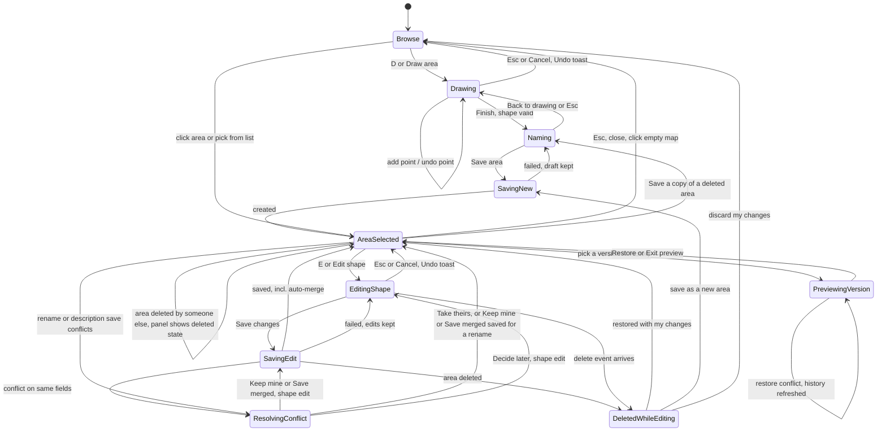

`DeletedWhileEditing` is the C-20 dialog on top of EditingShape; it is not a separate `data-mode` (the map keeps `data-mode=editing-shape` until a choice is made). The "deleted by someone else" panel state (C-14) keeps `data-mode=area-selected`.

| Mode (`map[data-mode]`) | Map click / tap does | Map drag does | Hover shows | Double-click zoom |
|---|---|---|---|---|
| Browse (`browse`) | Select topmost area under pointer; empty map -> nothing | Pan | Area outline highlight + tooltip (desktop) | on |
| AreaSelected (`area-selected`) | Select another area; empty map -> deselect (close panel) | Pan | Same as Browse | on |
| Drawing (`drawing`) | Add point (or finish on first point) | Pan | Rubber-band, closing preview | **off** |
| Naming (`naming`) / SavingNew (`saving-new`) | Nothing (map pans/zooms only); shape is locked | Pan | - | **off** |
| EditingShape (`editing-shape`) | Select point handle; click midpoint -> insert point; empty map -> deselect point (or place point in "Move point" mode) | Drag a handle -> move point; elsewhere -> pan | Handle hover state | **off** |
| SavingEdit (`saving-edit`) | Nothing (view only) | Pan | - | **off** |
| ResolvingConflict (`resolving-conflict`) | Nothing (view only) | Pan | - | **off** |
| PreviewingVersion (`previewing-version`) | Nothing (view only) | Pan | - | **off** |

Double-click zoom (Leaflet `doubleClickZoom`, which also reacts to Leaflet's simulated double-tap) is re-enabled only `DBLCLICK_ZOOM_REENABLE_MS` after entering Browse or AreaSelected, so a double-click or double-tap that spans a mode change (e.g. a finish, a save, a cancel) never zooms.

Rename and description edits happen in the panel and do not change the mode (except when their save conflicts -> ResolvingConflict).

### 3.5 Screen / state inventory

| Surface | States (all [M] unless tagged) |
|---|---|
| **App shell** | Booting (session check, <= 1 s spinner only after `SPINNER_DELAY_MS`), Signed out -> `/signin`, Ready, Session expired (dialog C-21) |
| **Layout** (v2, section 3.2) | Docked (>= 1,200 px), Overlay (600-1,199 px), Phone (< 600 px) |
| **Theme** (C-30) | Dark (default; also when nothing valid is stored or storage is unavailable), Light - on every screen, including sign-in |
| **Title bar** (C-02) | Brand, pill, Quiet chip (>= 600 px), presence (avatars + `presence.online`; phone: count button), user menu (incl. Theme) |
| **Tool rail** (C-03, >= 600 px) | *Draw area* (normal / pressed / disabled), *Edit shape* (disabled: no selection, busy, holes, enabled, pressed while editing), *Areas in view* (pressed while the list shows), *People*, *Shortcuts* |
| **Options bar** (C-05, >= 600 px) | Browse (key hints), Drawing, Naming (compact), EditingShape (+ point selected, + Move point), PreviewingVersion (legend), AreaSelected (name, area, key hints), SavingNew (as Naming), SavingEdit (*Save changes* reads *Saving...* or the rate countdown), ResolvingConflict (actions in the conflict panel) |
| **Inspector** (C-28, >= 600 px) | Docked (always shown), Overlay: hidden / open, Primary slot: Selection empty (docked only), Area details, Areas list, Save form, Conflict, Deleted-by-other, History / People / Activity sections: expanded, collapsed |
| **Status bar** (C-29, >= 600 px) | Pointer position, Map centre (`coord.centreLabel`), key hints per context (C-29 table), narrow (items dropped by priority) |
| **Sign in / Sign up** (C-01) | Idle, Field error, Submitting, Wrong credentials, Account disabled, Username taken, Rate-limited (countdown, minutes above 90 s), Network/server error |
| **Connection pill** (C-16) | Connecting, Live, Reconnecting, Limited (REST polling), Offline, Signed out - each with a full label (>= 600 px) and a short label (< 600 px) |
| **Map data** (C-17) | Loading (progress bar), Loaded, Empty view, Truncated (10 pages, no total), Small areas culled (count), Load error, Rate-limited read (countdown), Storage unavailable (auto-retry), **[N]** Stale (degraded, last updated time) |
| **Base map** (C-15, section 7) | Map, Aerial (the ITM cache; Esri with the ITM kill switch off), Switching (cross-CRS / cross-fade; outgoing layer kept until the incoming one loads, <= 5 s), Aerial outside its coverage, Zoom clamped (ITM), Tiles failing (OSM / Esri) |
| **Map status line** (section 3.2) | Scale, Zoom level, Viewport summary (C-26), Coordinate readout (C-27: pointer, or map centre) - >= 600 px in the status bar (C-29), < 600 px at the top of the Areas list |
| **Workspace mode** (section 3.4) | Browse, Drawing, Naming, SavingNew, AreaSelected, EditingShape (+ point selected, + Move-point), SavingEdit, ResolvingConflict, PreviewingVersion |
| **Drawing HUD** (C-05) | 0 points, 1-2 points, >= 3 valid, Crossing at cursor, Doubling back, Closing edge crosses, Too large, Too wide (extent), Crosses 180°, Max points, Zero area, Live sharing paused (rate limit, countdown), Live sharing paused (restart failed, no countdown), Remote newer version exists (edit only), Someone else is also editing (edit only) |
| **Area on map** (C-08) | Default, Hover, Selected, Being edited by me, Locked by other (ring + chip, or initials disc), My edit + their lock (`lock.chipBoth`), Edited by another non-holder (remote edit preview + chip), Just changed by other (pulse in the actor's colour; reduced motion: ring + `collab.updatedChip`), Simplified (low zoom), Saving (mine), Deleted (removed; history only) |
| **My new shape** (F-03, C-09) | Drawing, Finished, unsaved (point dots + `save.unsavedChip`), Saving (core at 60% + `save.savingChip`), Save failed (back to *Unsaved*), Saved (= Selected) |
| **Side panel** (v2: the inspector's primary slot and History section, C-28; phones: the sheet) | Closed, Areas list (C-10), Save form (C-09), Area details (C-11), History (C-13), Conflict (C-19), Deleted-by-other state (C-14) |
| **Area details** (C-11) | Loading full detail (*Delete* already decided from `createdById`), Ready (creator/admin: with *Delete*), Ready (others: no *Delete*), Holes (shape editing disabled), Locked by other banner, Newer version arrived, Deleted by other (creator/admin: *Restore area*; others: ask the creator), Rename in progress, Rate-limited action (countdown), Not found / purged, Error |
| **History** (C-13) | Loading, List, Previewing version (preview legend in the HUD position), Restoring, Restore disabled (Current / delete entries), Error |
| **Toasts** (C-18) | Own success, Own error (persistent), Undo-able, Countdown (rate-limited delete), Storage retrying, Collaboration (single, batched, held while drawing/editing), Reconnected summary - phones: 1 own + 1 collaboration |
| **Dialogs** | Conflict panel (C-19, non-modal), Deleted-while-editing (C-20; creator/admin: 3 actions, others: 2), Session expired / signed out elsewhere (C-21), Sign out with unsaved work (C-22), Keyboard shortcuts (C-23) |
| **Banners** | Restore unsaved drawing (C-24), Offline / limited (pill popover), Quiet mode indicator (chip >= 600 px, menu badge < 600 px) |
| **Presence** (C-25) | Only you, Others present, Limited (polled every 15 s, no activity status), Unavailable (offline), Busy area counter ("12 changes nearby"), **[N]** Idle users |
| **Activity** (C-31, >= 600 px) | Empty, Items (<= `ACTIVITY_MAX_ITEMS`), Held note (Drawing / Naming: `activity.heldNote`; EditingShape: `activity.heldNoteEdit`) |

### 3.6 Studio placement map (v2) [M]

Where every v1.2 surface lives in the Studio layout. Behaviour, copy keys and test ids of each component are unchanged unless its section says otherwise; only the place changes. "Primary slot" = the first inspector section (C-28).

**Components**

| Component (v1.2) | Docked (>= 1,200 px) | Overlay (600-1,199 px) | Phone (< 600 px) |
|---|---|---|---|
| C-01 Auth screens | Centred card, themed (C-30) | same | same |
| C-02 Top bar -> **title bar** | 44 px: brand, pill, Quiet chip, spacer, presence avatars + `presence.online`, user menu | same | 48 px: mark, short pill, presence count button, menu button |
| C-03 Tool rail / bottom bar | **Tool rail** 52 px, left: *Draw area*, *Edit shape*, -, *Areas in view*, *People*, (bottom) *Shortcuts* | same | Bottom bar 72 px (Browse: *Draw*, *Areas*; Drawing / EditingShape actions) |
| C-04 Map canvas | Between rail, options bar, inspector and status bar | Between rail, options bar and status bar (inspector floats over it) | Between title bar (or HUD) and bottom bar / sheet |
| C-05 Drawing / editing HUD -> **options bar** | 44 px bar above the map (map column only), present in every mode | same, narrow rules of C-05 | HUD 58 px, docked above the map, Drawing / EditingShape / PreviewingVersion only |
| C-06 Drawing tool | On the map; readout, strip and buttons in the options bar | same | readout + strip in the HUD; buttons in the bottom bar |
| C-07 Remote drafts, C-08 saved areas, C-12 handles | On the map (unchanged; styling UI.md) | same | same |
| C-09 Save form | Primary slot, titled *Save area* | Overlay opens with it | Naming sheet |
| C-10 Areas in view list | Primary slot (`A`, rail *Areas in view*) | Overlay | Sheet (bottom bar *Areas*) |
| C-11 Area details | Primary slot **Selection** | Overlay | Peek / expanded sheet |
| C-13 History | **History** section under Selection; preview legend in the options bar | same | *History* in the sheet |
| C-14 Deleted-by-other | Primary slot | Overlay | Sheet |
| C-15 Base-map switcher, zoom | Top-left of the map, zoom buttons under the switcher | same | Control row (unchanged) |
| C-16 Connection pill | Title bar, after the brand | same | Title bar (short labels) |
| C-17 Notices, loading bar | Notice slot top-centre of the map; loading bar along the map's top edge | same | Top of the map (1 line) |
| C-18 Toasts | One bottom-centre lane over the map, above the status bar | Centred in the map area left of the open overlay | Above the control row |
| C-19 Conflict panel | Primary slot | Overlay | Sheet at 50 dvh |
| C-20 ... C-23 Dialogs | Centred modals (unchanged) | same | same |
| C-24 Restore banner | Notice slot | same | same |
| C-25 Presence | Title bar avatars + **People** section (`presence-list`) | Title bar avatars; People section in the overlay | Count button -> popover `presence-list` |
| C-26 Viewport summary, C-27 coordinate readout | **Status bar** | Status bar | Top of the Areas list (unchanged) |
| Quiet indicator | Chip after the pill | same | `bell-off` badge on the menu button |
| User menu | Title bar, right; adds *Theme* (C-30) | same | Menu button |
| Keyboard shortcuts (C-23) | Rail *Shortcuts* + user-menu item | same | User-menu item |
| Live regions (section 6.6) | Unchanged, visually hidden | same | same |
| - **new** Activity (C-31) | **Activity** section, last | Activity section in the overlay (collapsed) | Not shown (toasts and the held summary as in v1.2) |
| - **new** Status bar (C-29) | Full width, 26 px | same, fewer items | Not shown |
| - **new** Theme switch (C-30) | User menu | same | User menu |

**Flows**

| Flow | What moves in v2 |
|---|---|
| F-01 Sign in / up | Nothing but the theme (dark by default; light if chosen earlier in this browser). |
| F-02 First load | The shell renders title bar, tool rail, options bar (Browse), map, status bar and - docked - the inspector (Selection empty state, People, Activity). |
| F-03 Draw -> save | Start from the rail or `D`; the options bar switches to Drawing; Naming shows the save form in the primary slot (overlay below 1,200 px opens with it; phones: naming sheet) and the options bar collapses to the readout. |
| F-04 Edit shape | Start from the Selection *Edit shape*, the rail *Edit shape* or `E`; the options bar shows the edit kicker, delta readout and *Undo*, *Cancel*, *Save changes*. Below 1,200 px the overlay hides while editing. |
| F-05 Rename / description | In the Selection section (pencil next to the name, `F2`). |
| F-06 Delete + Undo | *Delete* in the Selection section; the Undo toast in the bottom-centre lane with its countdown bar. |
| F-07 History / restore | History section (`H`, header toggle); preview banner at the top of the History section; preview legend in the options bar. |
| F-08 Switch base map | Control top-left of the map; `L` unchanged. |
| F-09 Conflict | Conflict panel in the primary slot (phones: sheet at 50 dvh); early warning in the options-bar strip. |
| F-10 Soft-lock | Lock banner in the Selection section; `lock.hudBoth` / `edit.otherEditing` in the options-bar strip. |
| F-11 Session expiry, F-14 Sign out | Dialogs unchanged; *Sign out* in the title-bar user menu. |
| F-12 Rate limit | Countdowns stay where the action lives: rate chip in the options-bar strip, save buttons in the primary slot, the delete countdown toast in the lane. |
| F-13 Connection | Pill in the title bar; Limited / Offline notes in the People section (section 6.1). |
| **F-15** Switch theme (new) | User menu -> *Theme* -> *Dark* / *Light* (C-30). |

---

## 4. Flows

Each flow: diagram, then numbered steps. "Toast" / "HUD" / "panel" copy is in section 9 by key.

### F-01 Sign up / sign in [M]

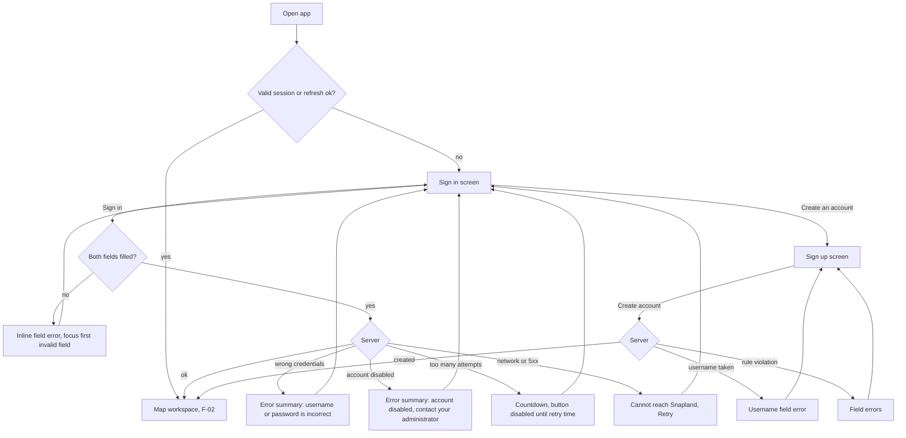

1. App boots -> attempts a silent refresh (refresh token). Success -> workspace; failure -> `/signin`. No flash of the sign-in form while checking (show nothing for `SPINNER_DELAY_MS`, then a centred spinner).
2. Sign in: *Username* (autocomplete `username`) and *Password* (autocomplete `current-password`, Show/Hide toggle, paste allowed). Submit with Enter or the button.
3. Client validation only checks "not empty" (sign-in) - never reveal password rules on sign-in.
4. Submitting: button shows spinner + `base.auth.signingIn`, fields read-only; double submit prevented.
5. Wrong credentials -> single message above the form (`base.auth.badCredentials`), password field cleared and focused, username kept. Do not say which field was wrong.
6. 429 (`scope` `auth` or `login`) -> `base.auth.tooManyAttempts` with a live countdown from `retryAfterMs` (else `Retry-After`), formatted with `formatCountdown` (section 9.13: seconds up to 90 s, then whole minutes - a 5-failure lockout reads "Try again in 15 min", not "873 s"); button disabled until 0. 403 `ACCOUNT_DISABLED` -> `base.auth.accountDisabled` in the error summary; fields kept, no countdown.
7. Sign up: *Username* with rule hint visible under the field (`base.auth.usernameHint`), then *Display name (optional)* (`base.auth.displayName`, `autocomplete="nickname"`, `dir="auto"`, hint `base.auth.displayNameHint`, counter from 80% of 64 code points), then *Password* (`new-password`, Show/Hide, `base.auth.passwordHint`). The request always carries `displayName` (SPEC section 6.2 requires it): the field's value after `sanitizeText`, or the username when the field is empty after sanitizing. Server `VALIDATION_FAILED` `errors[]` are mapped to fields by `path` (`username`, `displayName`, `password`). No "confirm password" field (the Show toggle replaces it; fewer redundant entries, WCAG 3.3.7). Errors inline per field, `aria-describedby` linked, focus to the first invalid field.
8. Success (either form) -> navigate to `next` or `/` -> F-02. Sign-up signs the user in directly.

### F-02 First load of the workspace [M]

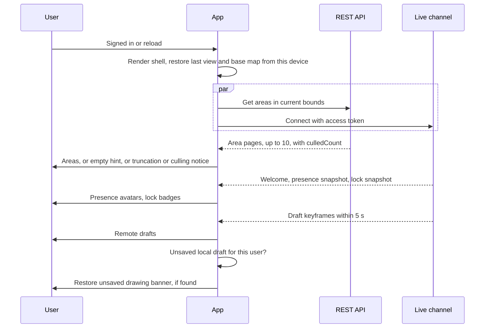

1. Shell renders immediately, in the stored theme (C-30): title bar, tool rail, options bar (Browse), map with the layer switcher, status bar and - at >= 1,200 px - the docked inspector (Selection empty state, People, Activity). Phones: title bar, map, bottom bar. Pill shows `Connecting…` (only after `WS_GRACE_MS`; before that nothing).
2. View = last view on this device for this user (center, zoom, base map; stored in `localStorage`, try/catch). First ever visit: Israel, center `31.5, 34.85`, zoom 8, base map **Map**.
3. Areas for the bounds load page by page (`limit=2000`, following `nextCursor` for at most 10 pages, SPEC section 5.5); each page renders as it arrives. The progress bar under the top bar appears only if the **whole paginated load** takes longer than `PROGRESS_DELAY_MS`.
4. Result:
   - Areas in view -> rendered.
   - None -> empty hint (C-17) `base.map.emptyTitle` / `base.map.emptyBody`, dismissible, shown again only when another empty view is reached after at least one pan.
   - Page 10 still returned a non-null `nextCursor` -> truncation notice (C-17). `culledCount > 0` on the first page -> culling notice (C-17). `simplified: true` on its own never shows a notice.
   - Error -> `base.map.loadError` with Retry. 429 -> the rate-limited read state; 503 -> the storage-unavailable state (C-17; both retry automatically).
5. Live channel connects -> pill -> `Live`; presence avatars and lock badges fill in from the snapshots. Other users' active drafts appear within one server keyframe (<= 5 s; there is no draft snapshot, SPEC section 7.6).
6. If a local unsaved draft or unsaved edit exists for this user (< `DRAFT_RETENTION_DAYS` old) -> Restore banner (C-24). Restoring pans/zooms the map to fit the draft.
7. **[N]** First-run coach mark (once per device, dismissible): points at *Draw area*: `base.onboarding.draw`.
8. Panning/zooming later: areas refetch `BOUNDS_DEBOUNCE_MS` after `moveend`; previously loaded areas stay visible during the refetch (no flicker); stale responses (older request than the latest) are discarded.

### F-03 Draw -> validate -> name -> save [M]

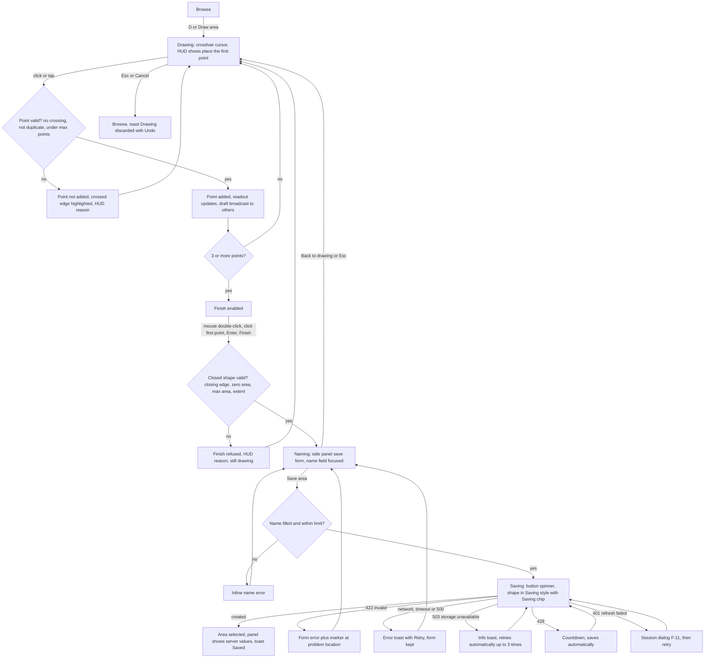

1. **Start.** User presses `D`, clicks *Draw area* in the tool rail, or (phone) taps *Draw*. Draw button becomes pressed (`aria-pressed="true"`), cursor -> crosshair, the options bar switches to its Drawing content (phones: the HUD docks above the map) with `base.draw.hintStart` (pointer), `base.draw.hintStartTouch` (touch) or `base.draw.hintStartKeyboard` (entered via keyboard). Area hover highlights and tooltips switch off. Double-click zoom is off (section 3.4). Nothing is sent yet: collaborators see nothing until the first point.
2. **Place points.** Each valid click/tap adds a point (see C-06 for validity and pixel thresholds). The HUD shows point count and readout. The draft is autosaved locally (debounced `DRAFT_AUTOSAVE_MS`). The **first point** sends `draft.start` (a drawing action; my presence becomes *Drawing a new area*); from then on the draft - placed points plus my cursor position - is streamed with a trailing throttle of `DRAFT_BROADCAST_MIN_INTERVAL_MS` on point changes **and** pointer moves (SPEC section 8.6; streaming does not count toward the rate limit).
   - **Keeping the live draft alive (invisible to me):** while the drawing is open but quiet - I pause, I am in Naming, or a rate-limit countdown runs after the draft started - the client sends a free keepalive every `DRAFT_TOUCH_INTERVAL_MS` (SPEC `draft.touch`), so collaborators keep seeing my draft (as *paused*, C-07) for as long as I work, however long I think.
   - **If the server lost my draft anyway** (my own `draft.ended expired`, or the first `DRAFT_NOT_FOUND` / `DRAFT_ID_IN_USE`; SPEC section 7.12 step 11): nothing changes on my screen - points, undo stack, readout and mode stay. Sharing restarts under a **new** draft id with all my points (one drawing action; if that start is rate-limited, F-12 step 2 applies), and the save later uses the new id. At most one automatic restart per `DRAFT_RESTART_GUARD_MS`; a second failure inside that window shows the rate chip **without a countdown** (`rate.chipPaused`, `rate-limit-notice` with no `data-seconds`, `hud-message[data-code=sharing-paused]`) and sharing is retried at my next point change. Drawing and saving are never blocked by this.
3. **Live feedback.** Between clicks, a rubber-band edge follows the cursor from the last point and a lighter closing-edge preview runs from the cursor back to the first point; the translucent fill previews the would-be shape; readout includes the cursor as a provisional point (C-06.4).
4. **Invalid while drawing.** If the next edge would cross an existing edge, the rubber-band and the crossed edge turn to the invalid style, an "x" marker sits on the crossing, cursor -> `not-allowed`, and a click there is refused with `base.draw.crossing`. See C-06.5 for all rules.
5. **Finish.** Any of: a **mouse** double-click (C-06.6: adds a final point at that spot if valid, then finishes; double-taps never finish), click/tap the first point (when >= 3 points; the first point grows and shows `base.draw.finishHere` tooltip on hover), `Enter`, or the *Finish* button. Finish validates the closed shape; if invalid, finish is refused and the HUD states why; the user keeps drawing.
6. **Name.** Desktop/tablet: the inspector's primary slot shows the save form, titled *Save area* (below 1,200 px the overlay inspector opens with it): *Name* (required, autofocus, `dir="auto"`), *Description (optional)*, the area (formatted, with ha), *Save area* (primary), *Back to drawing*, *Discard*; the options bar collapses to the readout and point count. Phone: the **naming sheet** of section 3.2 (Name, *Save area*, *Back to drawing*, `+ Add description`; kept above the on-screen keyboard; the shape re-fits into the visible strip; the HUD is hidden). The shape stays on the map in the **Finished, unsaved** style (UI section 9.3): my accent outline and fill, the point dots kept (non-interactive), and the neutral map chip `base.save.unsavedChip` ("Unsaved") at its label point - so "mine, not saved yet" never looks like a saved or selected area, nor like someone else's work. My live draft stays visible to collaborators throughout Naming (step 2 keepalive).
7. **Save.** `Enter` in *Name* or *Save area*. Empty name -> `base.save.nameRequired`, focus stays in field, nothing is sent. Valid -> button spinner `base.save.saving`, form read-only, shape in the **Saving** style (outline core at 60%, point dots kept, never dashed) with the map chip `base.save.savingChip` ("Saving...") replacing *Unsaved*.
8. **Success.** Area becomes a normal saved area, selected (point dots and chip gone); panel switches to Area details with **server** values (area km², version 1, created by me, timestamps); toast `base.toast.saved`; local draft cleared; draft broadcast ends; collaborators receive the created event. Focus: if the save was triggered by keyboard -> panel heading; otherwise stays where it was.
9. **Failure.** In every failure below the shape returns to the **Finished, unsaved** style with the *Unsaved* chip (the *Saving...* chip stays only while an automatic retry or countdown is pending).
   - Validation 422 `INVALID_GEOMETRY`: `base.save.serverInvalid` with the reason for the first `errors[].code` (section 9.4 table), plus an "x" marker at `errors[].location` when present; *Back to drawing* lets the user fix it.
   - 400 `VALIDATION_FAILED`: `errors[]` with `path` `name` / `description` become the field errors (`base.save.nameRequired` when the name is empty after sanitizing, `base.save.nameTooLong`, `base.save.descriptionTooLong`); focus moves to the first invalid field.
   - 503 (`DEPENDENCY_UNAVAILABLE`, `REQUEST_TIMEOUT`, `SERVICE_UNAVAILABLE`): info toast `base.toast.storageUnavailable`; the save is retried automatically up to `WRITE_503_MAX_RETRIES` times, each after `Retry-After` (default 5 s); the button reads `base.save.saving` throughout and the pill stays `Live`. After the last failure -> persistent `base.toast.saveFailedServer` with *Retry*.
   - Network error or no response within `FETCH_TIMEOUT_MS` (15 s): persistent `base.toast.saveFailedNetwork` / `base.toast.saveTimeout` with *Retry*; form and draft kept. Retrying is safe: the create carries the draft id, so a retry of a save that did reach the server returns the same area (200 `Idempotent-Replay`), never a duplicate.
   - 500: persistent `base.toast.saveFailedServer` with *Retry*.
   - 409 `AREA_ID_CONFLICT`: the client regenerates the id and retries once silently (SPEC section 6.3, section 7.12 step 10, SG-21); a second failure -> `base.toast.saveFailedServer`.
   - Rate limit: F-12. Session: F-11.
10. **Cancel.** `Esc` (when no popover is open) or *Cancel*: exits draw mode. With >= 1 point, toast `base.toast.drawingDiscarded` with *Undo* (`TOAST_UNDO_MS`), which re-enters Drawing with the exact points and undo stack. With 0 points, exit silently.

### F-04 Edit a shape (points) [M]

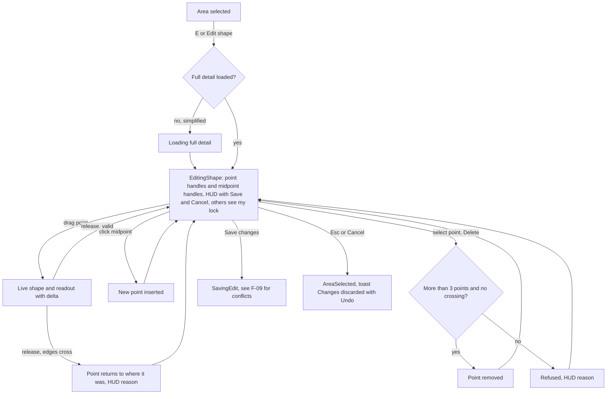

1. From Area details: *Edit shape* button, the tool rail's *Edit shape* (same as `E`, C-03) or `E`. The area's full-resolution `AreaDto` (`GET /areas/{id}`) is always the edit base - list geometry may be simplified (SPEC section 5.5) - so if it is not loaded yet, `base.edit.loadingDetail` shows and the edit starts when it arrives. Areas with holes: *Edit shape* is `aria-disabled` with `base.edit.holesDisabled` as its description; `E` announces the same text and does nothing else.
2. If someone else holds the edit lock, the panel shows the lock banner first (F-10); *Edit shape* reads *Edit anyway*, and `E` only moves focus to that button (the banner is the confirmation).
3. Edit mode: every point has a handle; every edge longer than `MIDPOINT_MIN_EDGE_PX` (`MIDPOINT_MIN_EDGE_TOUCH_PX` on coarse pointers) on screen has a midpoint handle. Below 1,200 px the overlay inspector hides until editing ends. HUD (options bar): `base.edit.hint` (`base.edit.hintTouch` on touch), readout `Area 2.31 km² (was 2.10 km²)`, buttons *Undo*, *Cancel*, *Save changes* (phone: in the bottom bar, C-12). The client sends `lock.acquire {areaId, scope: 'geometry'}` (renewed every `LOCK_HEARTBEAT_MS`) and `draft.start {areaId}` (a drawing action). My presence reads *Editing "{name}"* on every screen whether or not I get the lock (SPEC section 7.7 derives it from the edit draft, SG-26); if the lock is held by someone else, or cannot be taken (`LOCK_UNAVAILABLE`, `LOCK_LIMIT_REACHED`), I edit without it (F-10 steps 4 and 10).
4. Drag a handle -> map panning suspended for that gesture; the shape, readout and delta update live. Release -> validated (C-12): valid -> committed to the edit undo stack; invalid -> the point animates back (`SNAP_BACK_MS`, instant with reduced motion) and HUD shows `base.edit.revertedCrossing`. The edit is streamed like a new-area draft (points + cursor, `DRAFT_BROADCAST_MIN_INTERVAL_MS`, `areaId` set), so collaborators see my in-progress shape (C-07).
5. Click/tap a midpoint -> inserts a point there (and it becomes selected). Dragging a midpoint inserts and moves in one gesture.
6. Select a point (click/tap it) -> it gets the selected style and the HUD message strip shows `base.sr.pointSelected` with *Move point* and *Delete point* (on phones too - the bottom bar keeps Cancel, Undo, Save). `Delete`/`Backspace` or *Delete point* removes it unless only 3 points remain (`base.edit.minPoints`) or removal would create a crossing (`base.edit.deleteWouldCross`). Right-click on a point also deletes it (desktop shortcut). *Move point* -> the strip shows `base.edit.movePointArmed` (`base.edit.movePointArmedTouch` on touch) with a *Stop* button, and the next click/tap on the map moves the selected point there (single-pointer alternative to dragging, WCAG 2.5.7).
7. `Ctrl/Cmd+Z` undoes the last point operation; *Undo* button mirrors it; **[N]** `Ctrl/Cmd+Shift+Z` / `Ctrl+Y` redo.
8. Save -> `PATCH` with `baseVersion` -> F-09 path (incl. conflicts). While the request is in flight the shape shows the **Saving** style with the `base.save.savingChip` map chip (as F-03 step 7). Success toast `base.toast.editSaved`, version increments, `lock.release` and `draft.end committed` sent. A 422 -> `base.edit.serverInvalid` in the HUD strip with an "x" marker at the reported location; the edit stays open. 503 / timeout / network -> as F-03 step 9 (auto-retry for 503; retrying a PATCH is safe because an already-applied patch returns `noop`).
9. Cancel / Esc (with no point selected; the first Esc deselects a selected point): if nothing changed -> exit silently; else revert and show `base.toast.changesDiscarded` with *Undo* (re-enters edit mode with my changes).

### F-05 Rename / edit description [M]

1. In Area details, the name is a heading with an adjacent *Rename* (pencil) button; `F2` also starts renaming when the panel has focus or an area is selected.
2. The heading becomes a text input with the current name selected, `dir="auto"`, max `NAME_MAX` code points counted after `sanitizeText` (counter appears at 80% of max). Opening the input sends `lock.acquire {scope: 'details'}` (others see "{user} is editing"); closing it sends `lock.release`.
3. `Enter` or blur with a changed, valid value -> save (optimistic: the new name shows immediately with a subtle pending indicator). `Esc` -> revert, no request. Empty after sanitizing -> `base.save.nameRequired`, stays in edit.
4. Success -> toast `base.toast.renamed`; version increments. `noop: true` (someone already set the same name) -> the same toast, version unchanged. Failure -> name reverts, error toast with *Retry* (retry re-opens the input with my text). 400 `VALIDATION_FAILED` with `path` `name` -> the field error, input stays open. Rate limited -> `base.rate.renameLine` countdown under the input; the save is sent automatically at 0 (F-12).
5. Description: same pattern with a multi-line textarea, *Save* / *Cancel* buttons (Enter inserts a newline; `Ctrl/Cmd+Enter` saves). Max `DESCRIPTION_MAX` code points after sanitizing.
6. Concurrency: both use the area's version (optimistic concurrency). Disjoint changes merge on the server; a conflicting rename or description (409 `VERSION_CONFLICT`) opens the conflict panel (AreaSelected -> ResolvingConflict, F-09); 409 `AREA_DELETED` -> the deleted-by-other state (C-14) with my text kept in `base.panel.unsavedName` so it can be copied. A rename never blocks and is never blocked by a collaborator's shape edit (different fields -> auto-merge).

### F-06 Delete with Undo (soft delete) [M]

**Precondition:** I am the area's creator or an admin (`canDelete`, section 0 - decided from the list item's `createdById` as soon as the area is selected). For everyone else *Delete* is not rendered, the `Delete` key shows the info toast `base.perm.deleteOwnerOnly` ("Only {creator} or an admin can delete this area.") - or `base.perm.deleteOwnerOnlyGeneric` while the full detail (which carries the creator's display name) is still loading - and sends nothing.

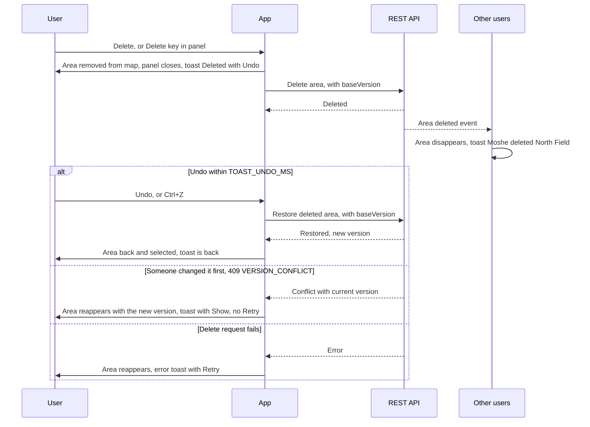

1. *Delete* in Area details (danger-styled but not a confirmation), or `Delete` key when the panel has focus / an area is selected and not editing. Both are available as soon as the area is selected and `canDelete` is true (SPEC SG-31); the request uses the version I see (list item or full detail, whichever is newer).
2. Optimistic: the area disappears immediately, the panel closes, focus moves to the next item in the Areas list if it is open, otherwise to the map container. Toast `base.toast.deleted` with *Undo*, visible `TOAST_UNDO_MS`, paused on hover/focus. The request is `DELETE /areas/{id}?baseVersion={version I see}`.
3. *Undo* (or `Ctrl/Cmd+Z` while the toast is visible and focus is not in a text field) -> `POST /areas/{id}/restore {baseVersion: deleted version}` -> area returns, selected, toast `base.toast.undeleted`. The restore is a new version in history ("Restored after delete").
   - 409 `AREA_NOT_DELETED` whose `current.deletedAt` is null and `current.version` = my `baseVersion + 1` -> my earlier attempt already succeeded (SPEC SG-15): treat as success. Any other `AREA_NOT_DELETED` -> someone else restored it: show the area, toast `base.toast.alreadyRestored`.
4. Failures of the delete request (the area reappears in every case):
   - 409 `VERSION_CONFLICT` (someone changed the area after I loaded it; deletes never merge, SPEC section 10.3 #8): the area is updated from `problem.current`, reappears with a pulse, and `base.toast.deleteConflict` shows with *Show* (selects the area and opens its panel so I can see the change). **No Retry**: deleting again from the panel uses the new version, so it is an informed choice, never a blind retry.
   - 409 `AREA_DELETED`: someone else deleted it first - it stays removed; if its panel is open it shows the deleted-by-other state (C-14).
   - 403 `FORBIDDEN` (e.g. my admin role was removed meanwhile): `base.toast.forbiddenDelete`, no Retry.
   - 503: automatic retries as F-03 step 9. A retried DELETE that returns 409 `AREA_DELETED` with `current.deletedBy.id` = me and `current.version` = `baseVersion + 1` is treated as success.
   - Network / 500: `base.toast.deleteFailed` with *Retry*.
5. Rate limited: the Undo toast reads `base.rate.deleteToast` ("Deleting "North Field" in 23 s...") and stays until the request is sent; **Undo during the countdown cancels the pending DELETE - nothing is sent** and the area reappears (F-12).
6. After the toast expires, the server keeps the area for the 30-day retention window (SPEC SG-04), but v1 offers no way back to it except the deleted-by-other panel state (C-14) and an **[N]** deep link (`/?area=<id>` opening that state). A *Recently deleted* list stays **[N]** (SPEC provides no endpoint for it in v1). There is no hard delete in the UI.
7. If the area is locked by someone else, delete still works for the creator/admin (advisory lock) but the panel's lock banner is visible; the editor goes through F-09's "deleted while editing" branch.

### F-07 View history and restore a version [M]

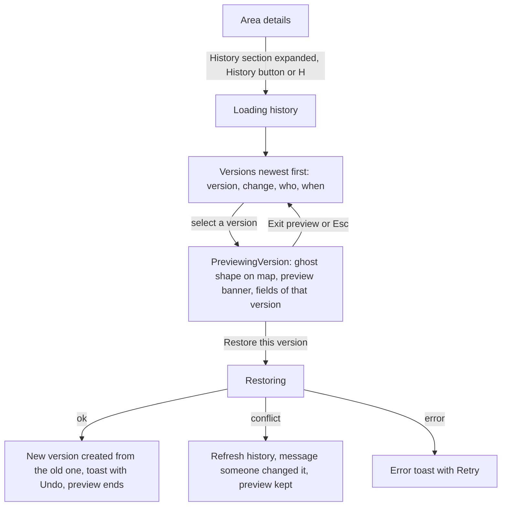

1. History is the inspector's **History section**, directly under Selection (v2; v1.2 had *Details* / *History* tabs). Its header is a disclosure button (`history-tab`, `aria-expanded`), expanded by default at >= 600 px; the expanded/collapsed choice is kept for the session (across selections). While it is expanded, the selected area's history loads when the area is selected (the same `GET …/versions` the tab used to send when opened); while collapsed, nothing is fetched. `H` expands it if needed **and moves focus to the *Current* item**. Phones: the sheet's *History* button (`history-tab`) expands the sheet and the History section, collapsed by default.
2. History (`GET /areas/{id}/versions`, without geometry) lists versions newest first: `v{n}`, change summary (`base.history.*`, derived from `op` + `changedFields` + `merged` + `revertedFrom`, SPEC SG-19), user (with colour dot), relative time (absolute time in `title` and for screen readers). The current version is labelled *Current*. Items are buttons with a roving tabindex: `↑`/`↓` move focus, `Enter`/`Space` preview.
3. Selecting a version (click or Enter on the item) -> PreviewingVersion: its geometry is loaded (`GET …/versions/{v}`), the old shape is drawn as a ghost (dotted, history style) over the current shape, the map fits both (phone: the sheet snaps to peek; overlay inspector: fit into the free map area), the HUD position (options bar; phones: the docked HUD) shows the non-interactive **preview legend** (`history-preview-legend`: a dotted swatch + `base.history.legendGhost` "v3, 20 Sep" and a solid accent swatch + `base.history.legendCurrent` "Current v5"; UI section 10.6) - the colour-independent key telling the two shapes apart - and the preview banner `base.history.previewBanner` shows at the top of the History section with *Restore this version* then *Exit preview* (tab order). The panel shows that version's name/description/area. Keyboard selection moves focus to *Restore this version*; `Esc` / *Exit preview* returns focus to the previewed item.
4. *Restore this version* is disabled (`aria-disabled`, with the reason as its description) on the *Current* item (`base.history.restoreDisabledCurrent`) and on delete entries (`base.history.restoreDisabledDeleted`). Otherwise -> no confirmation (restoring is non-destructive): a `PATCH` with that version's name, description and geometry, `baseVersion` = current version, `revertedFrom` = v. Result:
   - Saved -> version n+1; toast `base.toast.restoredVersion` with *Undo* (Undo restores the version that was current before, creating n+2 - history is append-only).
   - Saved with `merged: true` (another user changed a field that the old version shares with my base meanwhile, and their change was kept) -> `base.toast.restoredVersionMerged`, naming the kept fields.
   - `noop: true` (the old version equals the current content) -> `base.toast.restoreNoop`, no new version.
   - Rate limited -> the button reads `base.rate.restoreButton` and restores automatically at 0 (F-12).
5. Conflict during restore (409 `VERSION_CONFLICT`) -> `base.history.restoreConflict`, history and the current shape refresh, the preview stays (PreviewingVersion -> PreviewingVersion) so the user can decide again.
6. Other users see the change like any edit (`base.collab.restoredVersion`, subject to section 6.5 scoping).
7. **[N]** Two-version compare: select a second version to see both ghosts and a field diff.

### F-08 Switch base map mid-drawing [M]

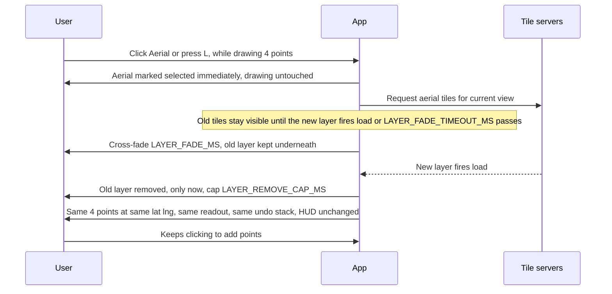

1. User selects *Aerial* (or presses `L`) at any time, including while drawing, editing, previewing history or with the save form open.
2. The control reflects the choice immediately. If a pointer drag is in progress (panning, dragging a point), the switch is applied on pointer-up.
3. Transition per section 7: no blank/grey frame; cross-fade `LAYER_FADE_MS`; the old layer is removed only after the new layer has loaded (cap `LAYER_REMOVE_CAP_MS`), even if the fade started at the timeout; center and scale preserved (for the ITM *Aerial*, the cross-CRS rebuild of section 7 keeps the center and picks the closest zoom level; the draft, its undo stack and keyboard focus on the map survive the rebuild).
4. All overlays keep their lat/lng: points, rubber-band (recomputed on next pointer move), fill, handles, remote drafts, lock badges, labels, popups. The readout string is unchanged (it is computed from lat/lng, never pixels). The undo stack is untouched. Mode is unchanged.
5. Screen-reader status: `base.layer.switchedAerial` / `base.layer.switchedMap`.
6. Outside Israel, the ITM *Aerial* has no imagery and shows the info notice `base.layer.outsideCoverage` (section 7). Drawing continues regardless.

### F-09 Conflict on save (someone saved first) [M]

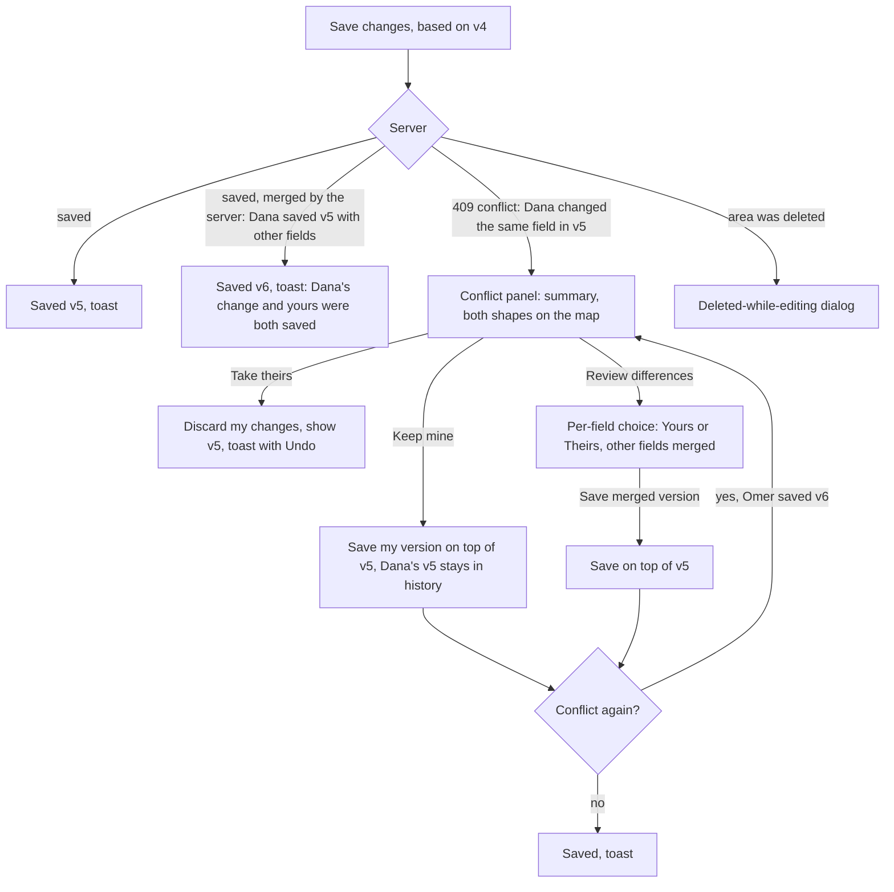

Merge units (fields): **Shape** (geometry), **Name**, **Description**. "Changed" = differs from the base version I started editing from.

1. **Early warning [M].** While I am editing (shape, rename or description), if a newer version of that area arrives (live channel or change feed), the HUD/panel shows `base.edit.newerVersion` with *Review* (opens the conflict panel in read-only compare). Nothing changes in my edit. If another user is editing the same area right now without the lock (their remote edit draft has my area's `areaId`), my HUD shows `base.edit.otherEditing` (F-10).
2. **No overlap -> auto-merge [M].** The **server** merges disjoint fields (SPEC section 10.3) and answers 200 with `merged: true` and `serverChangedFields`. Toast (`TOAST_INFO_MS`): `base.toast.autoMerged`, e.g. "Dana also edited "North Field". Their name change and your shape change were both saved (v6)." The response has no actor: `{user}` is the actor of the most recent `area.changed` / change-feed event for that area that I have received; if none is known, `base.toast.autoMergedUnknown` ("Someone also edited ..."). `noop: true` (their change equals mine) -> my normal success toast, version unchanged.
3. **Overlap -> Conflict panel [M]** (C-19), built from the 409's `current`, `conflictingFields` and `serverChangedFields`. Opens from a shape save (SavingEdit) and from a rename or description save (AreaSelected). Replaces the content of the inspector's primary slot (below 1,200 px the overlay opens with it; phone: the sheet snaps to 50 dvh so the map stays visible). Non-modal; the map can be panned/zoomed but not edited. Focus moves to the panel heading (read by the screen reader because it receives focus); the `alert` region gets only `base.sr.conflictAlert` ("Save conflict."), so the title is not spoken twice.
   - Summary: `base.conflict.title`, `base.conflict.body`.
   - Map: my shape (my draft style, solid) and theirs (their colour, dashed) with a two-item legend and *Show mine* / *Show theirs* toggles. Area of each shown in the panel.
   - Actions:
     - *Keep mine* (`base.conflict.keepMineHelp`) -> saves all my changed fields on top of their version. Their version remains in history.
     - *Take theirs* (`base.conflict.takeTheirsHelp`) -> discards my changes, shows their version, toast `base.toast.tookTheirs` with *Undo* (Undo puts my changes back into edit mode, based on their version).
     - *Review differences* -> a per-field table: Field | Yours | Theirs (user, v{n}) | choice (radio: Yours/Theirs). Overlapping fields start on *Yours*; non-overlapping fields are listed as `base.conflict.mergedAuto` without a choice. *Save merged version* submits.
     - `Esc` / *Decide later* -> closes the panel and returns to where I was with my changes intact and unsaved: EditingShape for a shape edit (the early-warning banner stays), or the rename/description input re-opened with my text.
4. **Conflict again** during resolution (a third user saved) -> the panel refreshes with the newest "theirs" and `base.conflict.changedAgain`.
5. **Deleted while editing** (C-20, 409 `AREA_DELETED` on save, or the delete event arriving while I edit): dialog `base.deletedWhileEditing.*` naming `current.deletedBy`. For the area's creator or an admin: *Restore it with my changes* (restore, then `PATCH` my fields on the restored version), *Save as a new area* (create with my shape and name), *Discard my changes*. For everyone else (restore would be 403): only *Save as a new area* (primary, initial focus) and *Discard my changes*, with `base.deletedWhileEditing.bodyNoRestore`.
6. Nothing is ever lost: every choice either saves my changes as a version, or offers Undo.

### F-10 Another user is editing the same area (soft-lock) [M]

The lock has **one holder per area** (SPEC section 7.9, SG-07): a second `lock.acquire` gets `LOCK_HELD`. The lock is advisory - anyone may still edit, and correctness comes from versions and merging (F-09). The UX goal (Principle 3) is that **both** editors know about each other before either saves.

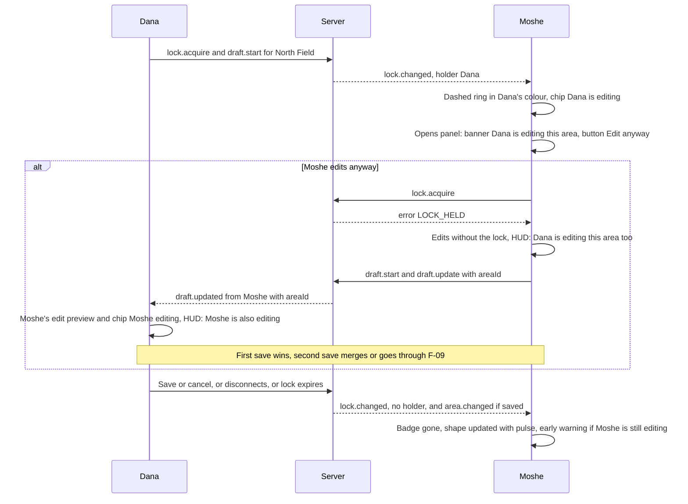

1. When a collaborator holds the lock on an area (`scope` `geometry` = reshaping, `details` = renaming/describing), everyone viewing it sees: the area keeps its own outline, surrounded by a **dashed ring in the holder's colour** (drawn under the area, UI section 9.2), and a badge `base.lock.badge` ("Dana is editing") anchored at the area's label point (visible as a full chip when the area is >= 24 px on screen; otherwise the badge collapses to an initials disc in the holder's colour (UI section 9.7); it is never reduced to a bare dot). The same initials disc is used when the chip would collide with the HUD, a notice, the panel, the control row or another chip; the full text stays in its `title` and accessible name. Late joiners get the same from `lock.snapshot`. A lock whose `expiresAt` has passed is hidden.
2. Area details for a locked area shows a banner `base.lock.bannerTitle` / `base.lock.bannerBody`, and *Edit shape* reads *Edit anyway*. Rename stays enabled; *Delete* stays available to the creator/admin (advisory lock).
3. **Confirmation (SG-27, adopted by SPEC section 7.9 v1.2):** there is no modal dialog. The visible banner plus the relabelled *Edit anyway* button are the confirmation: activating *Edit anyway* is an informed, explicit choice. The shortcut path cannot skip the banner: `E` on a locked area does **not** start editing - it moves focus to *Edit anyway* and announces `base.lock.editAnywayHint` ("Dana is editing this area. Press Enter on Edit anyway to edit too."). On phones the sheet's peek state shows the lock line above *Edit anyway*.
4. *Edit anyway* -> `lock.acquire` returns `LOCK_HELD`, which is expected: my edit starts **without the lock**, my HUD shows `base.lock.hudBoth` ("Dana is editing this area too.") in the warning strip, the lock chip on my map reads `base.lock.chipBoth` ("Dana is editing too", UI section 9.2: her ring stays under my edit shape and handles), and my edit streams as a draft with `areaId` (F-04 step 4).
5. **The holder learns about me:** on Dana's map my in-progress shape is drawn as a remote edit preview (C-07) with the chip `base.collab.editChip` ("Moshe, editing"), and her HUD shows `base.edit.otherEditing` ("Moshe is also editing this area. The second save may need a quick review.") for as long as a remote draft with her area's `areaId` exists. Both derive from `draft.updated`; no protocol change.
6. **Race:** if I pressed plain *Edit shape* (the lock looked free) and still get `LOCK_HELD` (the holder's `lock.changed` had not arrived yet), I keep editing without the lock and the HUD shows `base.lock.heldRace` naming the holder from `error.details.holder`.
7. **Presence status of a lockless editor (SG-26, resolved by SPEC section 7.7 v1.2):** the server derives `editing` with `activeAreaId` = the area for any connection whose active draft has a non-null `areaId` - including an *Edit anyway* editor without the lock - as well as for a lock holder (precedence editing > drawing > client-reported). Every screen therefore shows **Editing "{name}"** (name from my area store) for both editors. The v1.1 client fallback (status `drawing` + a remote draft with `areaId` -> displayed as editing) may stay as a harmless safety net but is no longer needed.
8. Lock ends on save, cancel, disconnect, or `LOCK_EXPIRY_MS` without renewal (renewed every `LOCK_HEARTBEAT_MS`) -> badge fades out. If Dana saved, my view updates live with a pulse; if I am still editing, the early warning of F-09 step 1 shows.
9. My own lock: I never see a lock badge for myself; the server renews the lock for the same user from another tab, so a second tab of mine edits as holder too; **[N]** `base.lock.selfOtherTab`.
10. `LOCK_UNAVAILABLE` (Redis down), `THROTTLED` on `lock.acquire`, or Limited/Offline mode: lock state is unknown -> the panel and the HUD show `base.lock.unknown` instead of a banner; editing is still allowed. `LOCK_LIMIT_REACHED` (this tab already holds `WS_MAX_LOCKS_PER_CONNECTION` locks - only reachable through stuck locks, since one edit plus one rename need two): editing continues without the lock and **no message** is shown (other people's locks are still known, so `lock.unknown` would be false); the client releases every lock it no longer needs and retries the acquire at the next renewal tick.

### F-11 Session expiry mid-draw (keep the draft) [M]

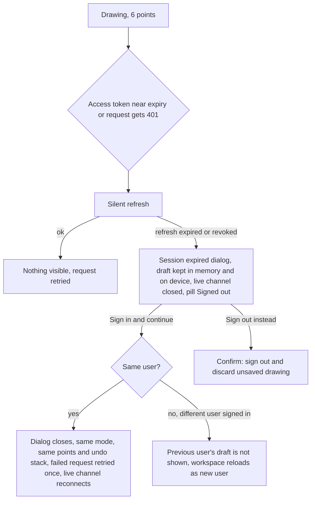

1. Tokens refresh silently (`TOKEN_REFRESH_LEAD_MS` before expiry, and on any 401 `TOKEN_EXPIRED`). The user sees nothing; the failed request is retried after refresh.
2. What a failed refresh means:
   - 401 `REFRESH_TOKEN_INVALID` (expired) -> modal dialog C-21 with `base.session.title` / `base.session.body`.
   - 401 `SESSION_REVOKED` or `REFRESH_TOKEN_REUSED` (signed out elsewhere, by an admin, or a stolen token was detected) -> the same dialog with `base.session.revokedTitle` / `base.session.revokedBody` (never "expired", which would be misleading).
   - 429 on refresh (`scope` `refresh`/`auth`) -> **not** a session failure: no dialog; the refresh is retried after `Retry-After`, requests wait for it, and a request that waits longer than `FETCH_TIMEOUT_MS` fails like a network error.
   - Network error / 5xx on refresh -> not a session failure either: the pill shows the connection state (F-13) and the refresh is retried with the reconnect backoff.

   The dialog cannot be dismissed with `Esc` or by clicking outside. The workspace behind it is dimmed but intact (mode, points, undo stack, form values, open panel). The draft is already in `localStorage` (autosave) as a second safety net.
3. Username is pre-filled and read-only; password field focused. *Sign in and continue*.
4. Success (same user): dialog closes; focus returns to where it was; if a request failed with 401 (e.g. Save), it is retried once automatically (a create retry is idempotent by id, so it never duplicates); live channel reconnects with a fresh ticket and resyncs (F-13 step 5); my open drawing or edit resumes live sharing under the **new** session for free (SPEC section 7.6: a `disconnected` draft record of the same user can be taken over), and if that is refused it restarts under a new id with the same points (F-03 step 2) - collaborators see the same draft again within one keyframe. Login errors inside the dialog use the C-01 mapping (wrong password, `ACCOUNT_DISABLED`, 429 countdown).
5. *Sign in as someone else* link / *Sign out instead*: C-22 confirmation (the only destructive confirmation in the app) -> sign out; the draft stays in `localStorage` keyed to the original user and is offered to that user next time (it is never shown to another user).
6. If the tab was hidden when the session expired, the dialog is shown when the tab becomes visible.

### F-12 Rate limit hit (50 drawing actions / minute) [M]

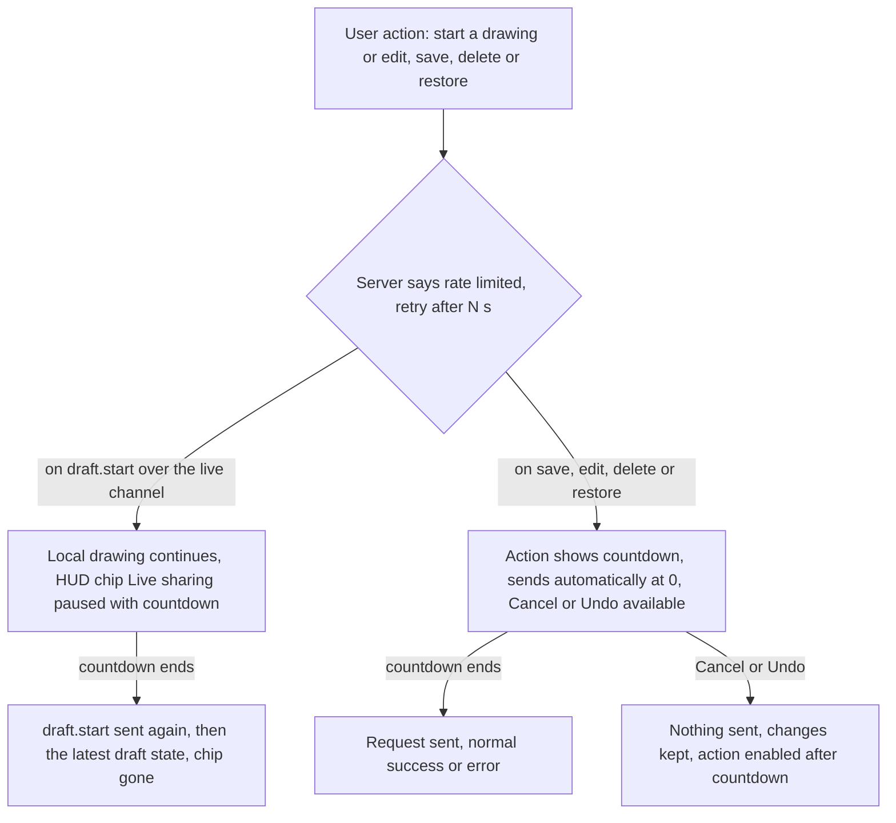

The draw limit counts `draft.start` and committed writes only (SPEC section 10.1); streaming `draft.update` never counts. The countdown uses `retryAfterMs` from the problem body or WS error when present, otherwise the `Retry-After` header (seconds), otherwise 60 s; it is shown with `formatCountdown` and updates every second (screen readers are told once, when it starts, not every second).

1. **Local drawing is never blocked by the rate limit** (points, undo, finish, cancel all work). Only network actions are delayed.
2. `draft.start` rate-limited (the first point of a drawing or an edit) -> the HUD message strip shows the **rate chip** `base.rate.chip` ("Live sharing paused, 23 s") with `base.rate.chipHelp` ("Keep drawing, nothing is lost."); this strip entry is `rate-limit-notice` (section 12). The `status` region gets `base.rate.sharingPausedSr` once. At 0 the client sends `draft.start` again and then the latest state. A save attempted during the countdown is itself subject to the limit (step 3). The same chip **without a countdown** (`base.rate.chipPaused`, no `data-seconds`) marks the rarer case where restarting a lost live draft failed twice within `DRAFT_RESTART_GUARD_MS` (F-03 step 2); it clears when sharing succeeds at a later point change.
3. Committed actions rate-limited - each shows its countdown where the action lives and sends automatically at 0 (the user already expressed intent):
   - **Save area / Save changes:** the button reads `base.rate.saveButton` ("Saving in 23 s...") with `base.rate.help` ("Limit: 50 drawing actions a minute.") as its description and a *Cancel* next to it.
   - **Rename / description:** `base.rate.renameLine` under the input (the input stays open; `Esc` cancels).
   - **Delete:** the area stays hidden (optimistic) and the Undo toast reads `base.rate.deleteToast` ("Deleting "North Field" in 23 s...") until the request is sent. **Undo during the countdown cancels the pending DELETE - nothing is sent** - and the area reappears.
   - **Restore area / Undo of a delete / Restore this version:** the button reads `base.rate.restoreButton` ("Restoring in 23 s...").
   - *Cancel* / *Undo* / `Esc` -> nothing is sent, changes kept; the action is enabled again (a new attempt during the countdown restarts the countdown, never sends early).
4. **[N]** Pre-warning: when `X-Draw-RateLimit-Remaining` (REST) or `ack.drawActionsRemaining` (WS) drops to `RATE_WARN_REMAINING`, the HUD shows `base.rate.nearLimit`.
5. Copy never blames ("You're drawing faster than the limit" is fine; "Abuse detected" is not).
6. **Rate-limited reads** (the general `api` limit, 300 requests/minute; SPEC section 6): a 429 on any `GET` keeps the data already shown and retries **automatically** after `retryAfterMs` / `Retry-After`; no *Retry* button is offered before the countdown ends. Map loads show `base.map.rateLimited` in the notice slot (C-17); a panel or history load shows its loading state with the same countdown line. A 429 on `POST /auth/ws-ticket` is treated as one failed reconnect attempt (normal backoff, F-13), never as a session failure; a 429 on refresh follows F-11 step 2.

### F-13 Live channel lost -> limited mode -> reconnect and resync [M]

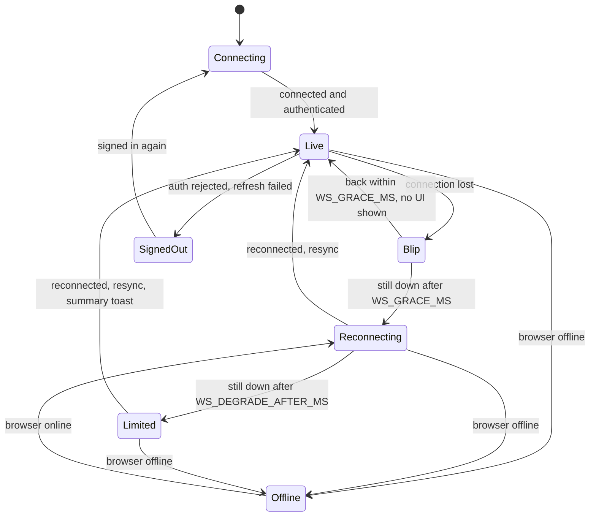

1. Connection drops. For `WS_GRACE_MS` nothing changes visibly (blips are normal on mobile).
2. Still down -> pill `Reconnecting…` (phone: `Retrying…`). Reconnect attempts use full-jitter exponential backoff (`WS_BACKOFF`, SPEC section 7.12), each with a fresh ticket; `online` and tab-visible events retry immediately. Pill popover shows `base.conn.reconnectingDetail` with *Reconnect now*.
3. Still down after `WS_DEGRADE_AFTER_MS` while REST works -> **Limited** mode: pill `Limited connection` (phone: `Limited`); the app polls the change feed every `POLL_INTERVAL_MS` (5 s) and presence every `PRESENCE_POLL_MS` (15 s) over REST; all saves/edits/deletes/restores keep working over REST (with optimistic concurrency). The presence list shows the polled users **without activity status** and with `base.presence.limited`; other users' drafts and lock badges are removed (they would be stale); the panel shows `base.lock.unknown` instead of lock banners. Reconnect attempts continue in the background.
4. **Offline** (browser reports offline, or REST also fails): pill `Offline`; drawing and editing continue locally; Save/Delete/Rename/Restore buttons are disabled with `base.conn.offlineSaveDisabled` as their description; drafts persist locally; presence shows `base.presence.unavailable`. **[N]** queue saves for when back online.
5. **Resync on reconnect:** after `welcome`, pull the change feed from the last REST cursor (SPEC section 7.12; 410 or more than 10 pages -> reload the viewport), apply updates and removals (areas deleted meanwhile disappear, even outside the view if they are in my store), refresh presence and locks from the snapshots; remote drafts return within one keyframe (<= 5 s); my own draft resumes with `draft.start {resume: true}` (free), or - if the server no longer has it - restarts under a new id with my points (F-03 step 2; no user-visible change). If I was editing an area that changed meanwhile -> F-09 step 1 banner.
6. Pill -> `Live`. If the outage lasted longer than `WS_DEGRADE_AFTER_MS`, toast `base.toast.backOnline` (with the number of distinct areas in view that others changed) or `base.toast.backOnlineNoChanges`. Shorter outages: no toast.
7. Auth rejected by the live channel (close 4401) -> token refresh, then reconnect with a new ticket; if refresh fails -> F-11.
8. **Storage unavailable** (PostgreSQL down, SPEC section 10.6): REST answers 503 while the live channel stays up. The pill stays `Live` (live drafts, presence and locks still work); reads show the storage notice (C-17) and writes retry automatically (F-03 step 9).

### F-14 Sign out [M]

1. User menu -> *Sign out*.
2. No unsaved draft/edit -> sign out immediately (`POST /auth/logout`, live channel closed with 1000, no reconnect) -> `/signin` with `base.auth.signedOut` notice.
3. Unsaved draft/edit -> C-22: `base.signout.title` / `base.signout.body`, buttons *Keep working* (default focus) and *Discard and sign out*.
4. Sign-out clears the user's drafts from `localStorage` only when they chose *Discard*. It never clears the theme choice (C-30).

### F-15 Switch theme (Dark / Light) [M] - new in v2

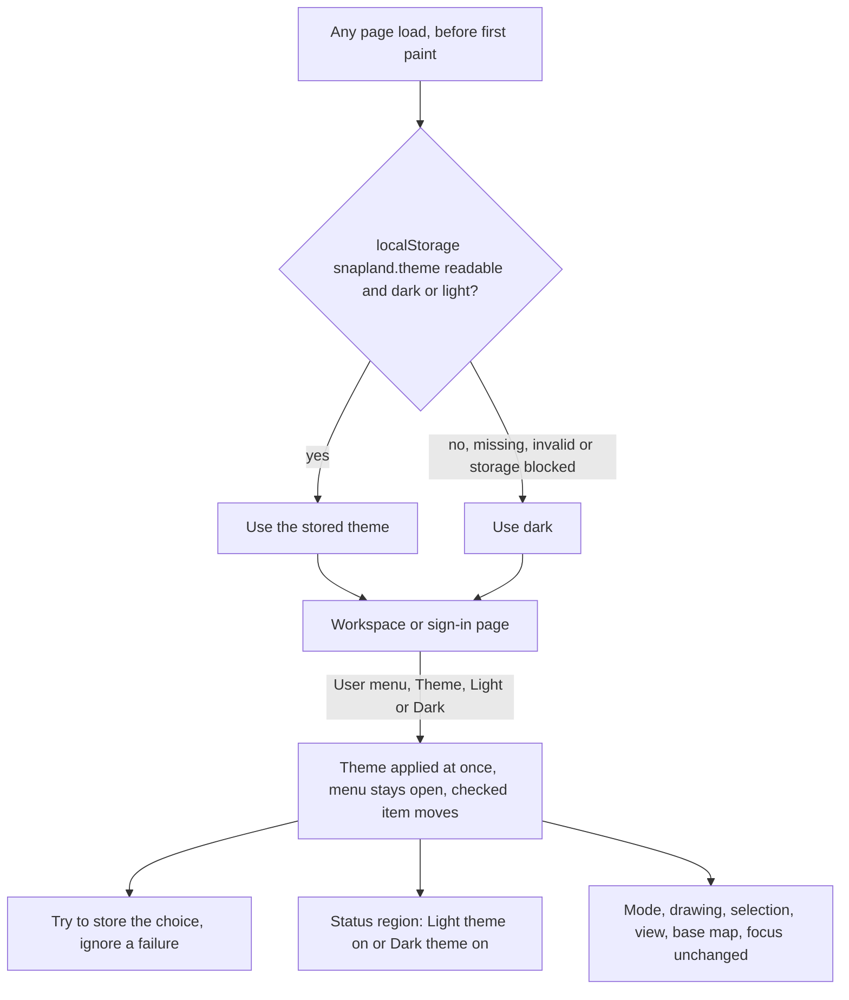

1. **On load** (every route, including `/signin` and `/signup`): the theme is read from `localStorage` key `snapland.theme` (`THEME_STORAGE_KEY`) inside a try/catch. `dark` or `light` -> that theme; anything else (missing, invalid, unreadable) -> **dark** (`THEME_DEFAULT`). The OS `prefers-color-scheme` is **not** consulted (D-5). The theme is applied before the first frame is painted, so the other theme never flashes; this must respect the CSP (no inline script - e.g. a small same-origin script in `<head>` that sets `<html data-theme>`).
2. **Switch:** user menu (C-02) -> group *Theme* -> *Dark* / *Light* (`menuitemradio`). Selecting an option applies it immediately (no reload, no colour transition), moves `aria-checked`, keeps the menu open (like *Quiet mode*) and keeps focus on the selected item; `Esc` closes the menu and returns focus to the menu button. The `status` region gets `base.theme.switchedLight` / `base.theme.switchedDark` once.
3. **Store:** the choice is written to `snapland.theme` in a try/catch; if storage is unavailable the theme still applies for the rest of the page's life and no error is shown.
4. **What it touches:** colours only - chrome, map overlays' theme variants and the dark theme's tint of the *Map* (OSM) tiles (UI.md). Mode, drafts, undo stacks, selection, open sections, history preview, map view, base map, focus, toasts and live connections are untouched; overlay geometry and hit areas do not change.
5. **Scope:** per browser, not per user or per device: signing out, or signing in as someone else in the same browser, keeps it. **[N]** Other open tabs of the same browser follow a change through the `storage` event.
6. There is no keyboard shortcut for the theme (the keyboard map of section 8.1 is unchanged); the menu is fully keyboard-operable.

---

## 5. Interaction specs per component

Format: **Trigger -> Immediate feedback (<= 100 ms) -> Outcome -> Errors / edge cases.**

### C-01 Auth screens [M]
Covered by F-01. Additional rules: one column centred card, max width 400 px; product name + one-line value proposition (`base.auth.tagline`); errors are text + icon (not colour only) and linked with `aria-describedby`; an error summary (`role="alert"`) appears above the form for server errors; the browser tab always reads `Snapland` with the brand-mark favicon (`frontend/public/favicon.svg`), on every screen including sign-in and sign-up. This is user decision D-3 (2026-09-28) and supersedes the earlier `Sign in · Snapland` / `Create account · Snapland` titles. The screen heading (`h1`) still says which form is shown. Password managers must work (proper `name`/`autocomplete`, no paste blocking) - WCAG 3.3.8. Sign-up fields in order: *Username*, *Display name (optional)*, *Password* (F-01 step 7).

### C-02 Top bar -> title bar [M]
v2 name: **title bar** (`title-bar`, the `header` banner landmark); 44 px (phones 48 px). Left to right: brand mark + product name (not a link on the map page), connection pill (C-16), Quiet chip (>= 600 px), spacer, presence (C-25: avatars with status badges plus the visible count `base.presence.online`, "3 online"; phones: a count button), user menu. The v1.2 top-bar *Keyboard shortcuts* button moves to the tool rail (C-03); the concept's extra keyboard icon in the title bar is not rendered (it duplicated the rail and the menu and added a tab stop).

User menu (shows my display name, with the username beneath it). Items, in order: *Keyboard shortcuts*, *Quiet mode* toggle, **Theme** group with *Dark* / *Light* (C-30, new in v2), **[N]** *Show collaborators' cursors* toggle, *Undo last action* (`base.menu.undoLast`, present only while a replaced or expired-from-view Undo is still within its `TOAST_UNDO_MS`; mainly for phones, section 3.2), *Sign out*. The user menu is a menu button (`aria-haspopup="menu"`), arrow-key navigable, `Esc` closes and returns focus. Quiet mode indicator: a chip next to the pill at >= 600 px, a `bell-off` badge on the menu button below 600 px (section 3.2). Phone rules (short pill labels, wordmark below 400 px): section 3.2.

### C-03 Tool rail / bottom bar [M]
**Tool rail (>= 600 px, v2):** 52 px column left of the map (`tool-rail`, a `nav` labelled `base.rail.label` "Tools", as in v1.2). Icon buttons, top to bottom: *Draw area*, *Edit shape*, a divider, *Areas in view*, *People*; *Shortcuts* sits at the bottom. Each button is a separate tab stop (no roving focus), >= 36 x 36 px on fine pointers and >= 44 x 44 px on coarse pointers, has its label as the accessible name and, while single-key shortcuts are on, `aria-keyshortcuts` with its key. A tooltip `{label} · {key}` (`base.rail.tooltip`) shows on hover **and** keyboard focus, is hoverable and closes with `Esc` (1.4.13); the key part is left out while single-key shortcuts are off. **Phones (< 600 px)** have no rail: the bottom bar keeps *Draw*, *Areas* (Browse) and the action rows below.

| Control | Trigger | Feedback | Outcome | Edge cases |
|---|---|---|---|---|
| *Draw area* (`D`, `draw-button`) | click / key | pressed state, cursor crosshair, options bar switches to Drawing | Drawing mode (F-03) | Pressing again while drawing = Cancel (same as Esc). Disabled while Naming/Saving/Editing with tooltip `base.draw.busy`. |
| *Edit shape* (`E`, `rail-edit-button`) - new in v2 | click | pressed state (`aria-pressed="true"`) while in EditingShape | Exactly what `E` does in AreaSelected (F-04 step 1-2): enters edit mode; on an area locked by someone else it moves focus to *Edit anyway* in the Selection section and announces `base.lock.editAnywayHint`; on an area with holes it announces `base.edit.holesDisabled` | `aria-disabled="true"` (still focusable) with a description: no area selected -> `base.rail.editShapeUnavailable`; Drawing / Naming / Saving -> `base.draw.busy`; area with holes -> `base.edit.holesDisabled`. Pressing it again while editing = Cancel (same as `Esc` with no point selected: `toast.changesDiscarded` with Undo). |
| *Areas in view* (`A`, `areas-button`) | click / key | pressed state while the list shows | Opens the Areas list (C-10) in the inspector's primary slot (overlay below 1,200 px) | If an area is open, the list replaces it; *Back to list* returns. Accessible name `base.rail.areas` ("Areas in view"). |
| *People* (`P`, `people-button`) - new in v2 | click / key | - (not a toggle; no `aria-pressed`) | Shows the People section (C-28): expands it if collapsed, scrolls it into view (overlay: opens the overlay), clears the busy counter (section 6.1); keyboard activation moves focus to the People heading | Same as activating `presence-button` or pressing `P`. |
| *Shortcuts* (`?`, `shortcuts-button`) - moved from the top bar | click / key | - | Opens the keyboard shortcuts dialog (C-23), `aria-haspopup="dialog"` | Focus returns to this button when the dialog closes. |

**Focus after pointer activation in Drawing / EditingShape [M]:** a **pointer** activation of any options-bar (HUD), tool-rail or bottom-bar button that leaves the workspace in Drawing or EditingShape (incl. *Draw area* and *Edit shape* themselves, *Undo point*, *Undo*, *Move point*, *Delete point*) moves focus to the map container with `focus({ preventScroll: true })`. Otherwise focus would stay on the clicked button and `Enter` (finish / save) or `Space` would activate that button again - removing another point, or cancelling the drawing. **Keyboard** activation (Enter/Space on the button) keeps focus on the button, as usual. Programmatic focus after a pointer click does not show the `:focus-visible` ring or the keyboard reticle.

### C-04 Map canvas [M]
- Leaflet container is focusable (`tabindex="0"`), `aria-label` = `base.a11y.mapLabel`, `aria-describedby` -> a visually hidden element with the current mode's instructions (updated per mode).
- Keyboard pan/zoom: Leaflet defaults (arrows pan `KEY_PAN_PX`, `+`/`-` zoom) plus `Shift+Arrow` fine pan `KEY_PAN_FINE_PX` in Drawing/Editing.
- When the map has keyboard focus (`:focus-visible`) in Drawing or Editing mode, a center crosshair (reticle) is shown; it is the keyboard "cursor" (C-06.9).
- Scroll-wheel zoom on; double-click zoom per the mode table of section 3.4 (on only in Browse and AreaSelected, re-enabled `DBLCLICK_ZOOM_REENABLE_MS` after entering them); box zoom (Shift+drag) on in Browse only.
- Click vs drag: a pointer-down/up pair counts as a click only if movement <= `CLICK_TOLERANCE_PX` (mouse) or `TAP_TOLERANCE_PX` (touch/pen); otherwise it was a pan.
- The map container records the `pointerType` of the most recent `pointerdown` on it; C-06.2 and C-06.6 use it to tell mouse from touch/pen.

### C-05 Drawing / editing HUD -> options bar [M]
- **Position (v2):** at >= 600 px the HUD is the **options bar** (`options-bar`): a 44 px bar docked above the map, spanning the map column (between the tool rail and the docked inspector). It is present in **every** mode with a constant height, so the map never resizes on a mode change (section 3.2); on coarse pointers it grows once, to fit 44 px targets, and keeps that height in all modes. It is a labelled group (`aria-label` = its mode tag text, e.g. "Drawing"); it is **not** a live region and not a `toolbar` with roving focus - its controls keep the HUD's tab order (section 8.2). The HUD's own content group keeps the test id `draw-hud` and exists in Drawing, Naming and EditingShape. **Phones (< 600 px):** a 58 px HUD docked between the title bar and the map (readout row + exactly one message line; the mode icon is decorative), buttons in the bottom bar, hidden in phone Naming (section 3.2). The v1.2 wrapping rule (UI U5) and the **[N]** translucent-HUD idea no longer apply: the bar does not sit over the map.
- **Mode tag** (`optbar-mode-tag`, first item): Drawing and Naming `base.optbar.tagDraw` ("Draw area"); EditingShape `base.edit.title` (the kicker, `Editing “{name}”`, truncated per section 9.14); PreviewingVersion `base.optbar.tagPreview`; AreaSelected `base.optbar.tagSelected` ("Area selected", neutral style); Browse has no tag.
- **Content per mode** (`options-bar[data-content]`):

  | Mode | Content, left -> right |
  |---|---|
  | Browse (`browse`) | Key hints only (`optbar-key-hints`): `D` *Draw area*, `A` *Areas in view*, `L` *Map / Aerial* (section 9.15). No controls. |
  | Drawing (`drawing`) | Tag, readout (`area-readout`, with the ha value at >= 1,200 px), `point-count`, message strip (`hud-message`), *Undo point*, *Cancel*, *Finish* |
  | Naming, SavingNew (`naming`) | Tag, readout, `point-count` (no strip, no buttons) |
  | EditingShape (`editing`) | Tag (kicker), readout with delta, message strip (incl. the selected point with *Move point* / *Delete point*), *Undo*, *Cancel*, *Save changes* |
  | SavingEdit, ResolvingConflict (`editing`) | As EditingShape, in the v1.2 states: during SavingEdit *Save changes* reads `base.edit.saving` or the rate countdown `base.rate.saveButton` with *Cancel* (F-12); in ResolvingConflict the conflict panel (C-19) owns the actions |
  | PreviewingVersion (`preview`) | Tag, the preview legend (`history-preview-legend`, C-13), non-interactive |
  | AreaSelected (`selected`) | Tag, the area's name (`<bdi>`, truncated per section 9.14) and formatted area, key hints `E` *Edit shape* (*Edit anyway* when locked by someone else; left out for an area with holes), `F2` *Rename*, `H` *History*, `Z` *Zoom to area*, and at the right `Esc` *Deselect*. No controls: the actions live in the Selection section. |
- **Key hints** (options bar and status bar): text, never controls. A key-hint group is `aria-hidden`: the same shortcuts are exposed through `aria-keyshortcuts` on the controls that perform them and in the shortcuts dialog (C-23), so screen readers do not hear them twice. They are shown only while single-key shortcuts are on (letter and `?` hints; `Esc`, `Enter`, `Space`, `Backspace`, `Del` and modifier hints stay) and only on devices with a fine pointer (`(any-pointer: fine)`). Key chips inside buttons (*Undo point* `Ctrl Z`, *Cancel* `Esc`) are `aria-hidden`; the button carries `aria-keyshortcuts` instead and its accessible name is unchanged.
- **Message strip in the options bar:** one line, never wraps. It uses the `.short` variant of every key that has one (the same strings as the phone strip) and the `*Touch` hint keys for touch input (C-06.10); the full sentence is the strip's `title` and is announced through the `status` region exactly as in v1.2. `base.rate.chipHelp` is not shown in the bar (it is in the chip's `title`). Anything that still overflows is ellipsized.
- **Narrow options bar (600-1,199 px):** space is freed in this order - the ha value and the key chips inside buttons are hidden, then the mode tag shrinks to its icon (its text stays the accessible name), then the strip ellipsizes. The readout, `point-count` and the action buttons are never hidden.
- Content (Drawing): readout (C-06.4), point count `· {n} points`, message strip (exactly one message, the most important wins: error > warning > rate chip > hint), buttons *Undo point* (disabled at 0 points), *Cancel*, *Finish* (disabled with `aria-disabled="true"` + tooltip/description of the reason until the shape is finishable).
- Content (Editing): kicker `Editing “{name}”` (name truncated per section 9.14), readout with delta, message strip, *Undo* (disabled if no changes), *Cancel*, *Save changes* (disabled if no changes or invalid). When a point is selected, the strip shows the point and *Move point* / *Delete point* (also on phones).
- Content (Naming, desktop): the compact HUD - readout and point count only, no buttons, no strip (phone Naming hides the HUD, section 3.2).
- Content (PreviewingVersion): the HUD slot holds only the non-interactive preview legend (`history-preview-legend`, C-13); the actions stay in the History section's preview banner / the sheet banner.
- Phones (< 600 px): the strip is exactly one line and uses the `.short` copy (section 3.2 budget).
- The message strip is **not** a live region. Discrete changes (point added/removed/refused, finish refused, new error, mode change) are announced once, through the `status` region only (section 6.6), with the full-length copy; pointer-move updates are never announced (C-06.4).
- Buttons have text labels (icons optional), >= 44 x 44 px on coarse pointers. Focus after pointer activation: C-03.

### C-06 Drawing tool (the core interaction) [M]

#### C-06.1 Cursor states
| Situation | Cursor | Visual cue |
|---|---|---|
| Browse, over empty map | `grab` (Leaflet default) | - |
| Browse, over area | `pointer` | outline thickens, tooltip after `TOOLTIP_DELAY_MS` |
| Drawing, over map | `crosshair` | rubber-band + closing preview |
| Drawing, over first point with >= 3 points, closing valid | `pointer` | first point enlarged ring, tooltip `base.draw.finishHere` |
| Drawing, position where a point would be invalid (crossing / max points / closing invalid when over first point) | `not-allowed` | invalid styling + HUD reason |
| Drawing, while panning | `grabbing` | - |
| Editing, over point / midpoint handle | `move` / `copy` | handle hover state |
| Editing, dragging a handle | `grabbing` | live shape |
| Editing, "Move point" armed | `crosshair` | HUD `base.edit.movePointArmed` |
| Any mode, pending network save | default | Saving style + *Saving...* chip on the shape, spinner on button (never a global wait cursor) |

#### C-06.2 Point placement
- Click/tap adds a point at the pointer's lat/lng. Stored as lat/lng (never pixels).
- **Duplicate guard:** a click within `DUPLICATE_POINT_PX` (mouse) or a tap within `DUPLICATE_POINT_TOUCH_PX` (touch/pen; >= `TAP_TOLERANCE_PX`, so a nervous double-tap cannot add two points 6-10 px apart) of the previous point is ignored silently. This also absorbs the second click of a double-click and the second tap of a double-tap.
- **Snap to first point:** within `SNAP_FIRST_POINT_PX` (mouse) / `SNAP_FIRST_POINT_TOUCH_PX` (touch) of the first point, with >= 3 points -> the click finishes the shape instead of adding a point.
- **[N]** Snap to points of other saved areas within `SNAP_OTHER_PX` (hold `Alt` to disable), with a snap indicator - helps adjacent parcels share boundaries.
- Visual: placed points are small dots; the first point is visually distinct (ring) so users know where to close; the most recent point is emphasised.
- Screen reader announcement per point: `base.sr.pointAdded` ("Point 4 added. Area 2.31 square kilometers.").

#### C-06.3 Rubber-band and closing preview
- From the last point to the cursor: dashed line in own-draft style, updated every animation frame (`requestAnimationFrame`, no throttling below 60 Hz).
- From the cursor back to the first point (when >= 2 points): lighter dotted line - shows how the shape will close.
- Fill preview of the would-be polygon (>= 2 points + cursor), translucent.
- When the pointer leaves the map (or on touch, where there is no hover), rubber-band and closing preview are hidden and the preview shows the placed points only, closed.

#### C-06.4 Live area readout
- **Placement:** in the HUD - the options bar at >= 600 px, right after the mode tag; the docked phone HUD's first row - large enough to read at a glance (UI.md). Not attached to the cursor (it would hide what the user is tracing). **[N]** a small label at the shape's centroid once finished/while editing.
- **What it measures** (never an area for a self-intersecting ring, SPEC section 8.5):
  1. Placed points + the cursor as a provisional point, if the pointer is over the map, the next point would be valid and that ring is simple.
  2. Otherwise the placed points alone, closed, if that ring is simple.
  3. Otherwise `Area —` with the validation message in the strip (e.g. the closing edge crosses).
  With < 3 points (including provisional), shows `Area —` and hint `base.draw.needThree`.
- **Algorithm:** the shared `geodesicArea` (`packages/shared/src/geo/geodesic.ts`, geographiclib on the WGS84 ellipsoid) applied to the ring **after quantizing every coordinate to 7 decimals** (`quantize7`, the same quantization the save applies, SPEC section 8.7), so the preview equals the server's `ST_Area(geography)` within 1e-9 relative (SPEC section 8.5, SG-03). `turf.area` (spherical) and planar Web Mercator area are **not** acceptable (see `docs/fixtures/geodesic-area-fixtures.json`).
- **Update rate:** every animation frame on pointer move (visual only). Screen readers get the value only on discrete events (point added/removed/moved, finish).
- **Format - `formatArea(km2)`** (pure function, unit-tested; `en-US` digit grouping; round half away from zero):

  | Range (raw km²) | Unit & precision | Example input -> output |
  |---|---|---|
  | `< 0.000001` (under 1 m²) | literal | `0.0000004` -> `< 1 m²` |
  | `< 0.01` | m², integer, grouped | `0.00998028` -> `9,980 m²` |
  | `0.01 – < 1` | km², 3 decimals | `0.99870079` -> `0.999 km²` |
  | `1 – < 100` | km², 2 decimals | `2.3104` -> `2.31 km²`; `78.33326720` -> `78.33 km²` |
  | `100 – < 10,000` | km², 1 decimal | `1347.46875764` -> `1,347.5 km²` |
  | `≥ 10,000` | km², integer, grouped | `21422.58815494` -> `21,423 km²` |

  Bands are chosen on the raw value (so `0.99996` -> `1.000 km²` is acceptable).
- **Secondary unit - hectares `formatHectares(km2)`** (1 km² = 100 ha): `< 10 ha` -> 2 decimals (`0.998 ha` -> `1.00 ha`), `< 1,000 ha` -> 1 decimal (`231.0 ha`), else integer grouped (`2,142,259 ha`). Shown: in the readout's tooltip (hover **and** keyboard focus - the readout is focusable, `tabindex="0"`), and always as a second line in the save form and Area details (touch users have no hover).
- **Spoken form:** readout has an `aria-label` using `formatAreaSpoken` -> "2.31 square kilometers" / "9,980 square meters".
- **Perimeter [M]** (SPEC section 8.5 analysis, SG-25): the geodesic perimeter of the same ring, exposed as `area-readout[data-perimeter-km]` (raw km) and shown in the readout tooltip, the save form and Area details. `formatPerimeter(km)`: `< 1 km` -> meters, integer, grouped ("850 m"); else km, 2 decimals ("4.48 km").

#### C-06.5 Invalid-shape feedback while drawing
All checks run client-side on every pointer move (visual) and on every placement/finish attempt (enforced), using the **shared validator** (`packages/shared/src/geo/validate.ts`, SPEC section 9) on 7-decimal-quantized coordinates - the same code the server runs, so the client never refuses what the server accepts or vice versa. Limits come from `GET /api/v1/config` (section 11). If the server still rejects, F-03 step 9 applies. Each rule has a `data-code` on `hud-message` (section 12).

| Rule (validator sub-code) | When detected | Feedback | Can place? | Can finish? |
|---|---|---|---|---|
| **Crossing** (`SELF_INTERSECTION`, non-adjacent edges) - the new edge (last point -> cursor) crosses or touches an existing edge | pointer move | rubber-band + crossed edge in invalid style (colour **and** pattern change), "x" marker at `location`, cursor `not-allowed`, HUD `base.draw.crossing` (`crossing`) | No - click refused, SR `base.sr.pointRefused` | - |
| **Doubling back** (`SELF_INTERSECTION` whose `edgeIndices` are adjacent: collinear overlap / spike with the previous edge) | pointer move | same as crossing, HUD `base.draw.spike` (`spike`) | No | - |
| **Closing edge crosses** (`SELF_INTERSECTION` involving the closing edge) - cursor -> first point (preview) or last point -> first point | pointer move / finish | closing preview in invalid style; readout `Area —` if the placed ring is not simple (C-06.4); Finish disabled with reason `base.draw.closingCrosses` (`closing-crosses`) | Yes (later points may fix it) | No |
| **Too few points** (`TOO_FEW_POSITIONS`, < 3 distinct) | always | Finish disabled; hint `base.draw.needThree` (`need-more`) | Yes | No |
| **Zero area** (`AREA_TOO_SMALL`, area < `MIN_AREA_KM2`, e.g. collinear points) | finish | HUD `base.draw.zeroArea` (`zero-area`) | Yes | No |
| **Too large** (`AREA_TOO_LARGE`, > `MAX_AREA_KM2`) | pointer move / finish | readout in warning style + HUD `base.draw.tooLarge` (`too-large`) | Yes | No |
| **Too wide** (`EXTENT_TOO_LARGE`, bounding box wider or taller than `MAX_EXTENT_DEG`) | pointer move / finish | HUD `base.draw.extentTooLarge` (`extent-too-large`) | Yes (undo fixes it) | No |
| **Crosses the 180° meridian** (`ANTIMERIDIAN_CROSSING`, after unwrapping Leaflet's continuous longitudes, SPEC section 9.2) | pointer move / placement | invalid rubber-band, HUD `base.draw.antimeridian` (`antimeridian`) | No | - |
| **Beyond the map edge** (`COORDINATE_OUT_OF_RANGE`, latitude beyond +/-85.05°) | placement | HUD `base.draw.outOfRange` (`out-of-range`) | No | - |
| **Max points** (= `MAX_POINTS`, i.e. `MAX_POSITIONS` − 1 because the closing position counts, `TOO_MANY_VERTICES`) | placement | HUD `base.draw.maxPoints` (`max-points`) | No | Yes |
| **Duplicate point** | placement | none (silently ignored) | No | - |

Sub-codes that the drawing UI cannot produce (`INVALID_GEOMETRY_TYPE`, `NON_FINITE_COORDINATE`, `RING_NOT_CLOSED`, `TOO_MANY_RINGS`, `HOLE_OUTSIDE_SHELL`, `HOLES_INTERSECT`, `GEOS_INVALID`) only arrive from the server; they map to `base.save.reason.*` (section 9.4).

Invalid states are never conveyed by colour alone: the invalid edge also changes dash pattern and the "x" marker has a text equivalent in the HUD.

#### C-06.6 Finishing
| Method | Where | Notes |
|---|---|---|
| Double-click | **mouse only** | Its first click is an ordinary click (adds a point if valid and not a duplicate); the `dblclick` then finishes. Double-click zoom is off in Drawing. |
| Click/tap first point | mouse, touch | When >= 3 points and closing edge valid. |
| `Enter` | keyboard | Finishes with the placed points (the crosshair position is not added - press `Space` first to add it). Works when the map container has focus (C-03 returns focus there after pointer clicks on HUD buttons). |
| *Finish* button | all | In the options bar (>= 600 px) / bottom bar (phone). |

**Double-click guard [M]** (Leaflet 1.9 turns two quick taps from touch or pen into a synthetic map `dblclick` via `DomEvent.DoubleTap`, and `doubleClickZoom.disable()` stops only the zoom, not the event):
- The finish handler accepts a `dblclick` only if **all** hold: (a) it is not Leaflet-simulated (`originalEvent._simulated !== true`); (b) the pointer that produced it is a mouse - the `pointerType` recorded from the most recent `pointerdown` on the map (C-04) is `'mouse'`, falling back to `originalEvent.sourceCapabilities?.firesTouchEvents === false` where available; (c) the first click of the pair was not **refused**.
- If the first click of the double-click was refused (crossing, doubling back, max points, 180°, out of range), the double-click does **not** finish; the refusal reason stays in the HUD. A first click that was only a silent duplicate (on the last point) is not a refusal: the double-click finishes with the points already placed.
- Touch/pen double-taps are just two taps: the second is absorbed by `DUPLICATE_POINT_TOUCH_PX` or adds a legitimate second point; they never finish and never zoom (UX-AC-22).

If the shape can't be finished, all four methods show the same refusal reason in the HUD and SR (`base.sr.finishRefused` + reason). No method silently does nothing.

#### C-06.7 Undo / redo while drawing
- `Backspace`, `Ctrl/Cmd+Z`, or *Undo point* removes the last point; readout and broadcast update. At 0 points *Undo point* is disabled; `Backspace` does nothing.
- **[N]** Redo: `Ctrl/Cmd+Shift+Z` / `Ctrl+Y`; the redo stack is cleared by any new point.
- Undo never exits drawing mode (only Cancel does).

#### C-06.8 Cancel
- `Esc` (with no open popover/tooltip - Esc closes those first, one layer per press), *Cancel*, or pressing `D` again.
- 0 points -> exit silently. >= 1 point -> exit + `draft.end cancelled` + toast `base.toast.drawingDiscarded` with *Undo* (restores points, undo stack and mode; streaming restarts with a new `draft.start`, which counts as a drawing action, because `draft.end` released the old draft). The local draft copy is **marked discarded immediately** (`discardedAt` in its `localStorage` record) and purged when the toast expires; the restore banner (C-24) ignores discarded drafts, so a reload within the Undo window never offers the drawing back. *Undo* clears the mark.

#### C-06.9 Keyboard drawing (crosshair) [M]
- Enter drawing with `D` while the map (or anything outside a text field) has focus -> focus moves to the map; the center crosshair appears; HUD hint `base.draw.hintStartKeyboard`.
- Arrow keys pan the map under the crosshair (`KEY_PAN_PX`); `Shift+Arrow` pans `KEY_PAN_FINE_PX` for precision; `+`/`-` zoom (crosshair stays centred).
- `Space` adds a point at the crosshair (same validation as a click; rubber-band follows the crosshair). `Enter` finishes. `Backspace` undoes. `Esc` cancels.
- The crosshair is also the "cursor" for the readout's provisional point.

#### C-06.10 Touch [M]
- Tap adds a point; one-finger drag pans; pinch zooms; **double-tap never zooms and never finishes while drawing** (section 3.4, C-06.6); finish by tapping the first point or *Finish*.
- No long-press gestures anywhere (poor discoverability, conflicts with OS context menus/text selection).
- Point handles in editing: hit area >= `HANDLE_HIT_TOUCH_PX`; when a touch starts on a handle, the map does not pan.
- The finger hides the exact spot: after each tap, the placed point shows briefly enlarged (150 ms, none with reduced motion) so users can confirm placement. **[N]** Crosshair mode toggle on touch (same center reticle as keyboard + an *Add point* button) for precise placement in the field.
- Bottom bar in drawing (phones, < 600 px; the bar is 72 px tall): order `Cancel ········ Undo · Finish` (>= 44 px each). On touch tablets (>= 600 px) the same actions are in the options bar, each >= 44 x 44 px. The destructive *Cancel* sits alone at the left edge, away from the high-frequency *Undo*; *Finish* stays at the right thumb edge. Bottom bar in EditingShape: `Cancel ········ Undo · Save` (C-12).
- Touch copy: HUD hints and errors use the touch/`.short` variants (`base.draw.hintStartTouch`, `base.draw.hintFinishTouch`, `base.edit.hintTouch`, `base.edit.movePointArmedTouch`, `*.short`); no string tells a touch user to click, double-click or press a key.

### C-07 Other users' drafts on my map [M]
Source: `draft.updated` (full vertex list + `cursor`, ordered by `rev`, up to 10 Hz; SPEC section 7.6). There is no draft snapshot: a remote draft appears on my map within one server keyframe (<= 5 s) after I connect or pan to it.
- **New-area draft** (`areaId` null): rendered in the author's colour: dashed stroke, light fill, small point dots (always - a lock ring never has dots, UI section 9.3), no handles, `pointer-events: none`. Name chip near the author's latest point: `base.collab.draftChip` ("Dana, drawing"), followed by their live km² computed by me with the shared geodesic function (`base.collab.draftChipArea`, "Dana, drawing, 0.12 km²"; SPEC SG-25). The km² is always in `remote-draft-chip[data-km2]`; below 600 px it is left out of the visible chip text to keep chips short.
- **Remote rubber-band [M]:** when `cursor` is not null, a line from the author's last point to their cursor, styled per UI.md section 9.3 (1.5 px dotted, 60% opacity, author colour; **with a casing on Aerial imagery** so it stays visible there). No closing preview and no fill for the cursor. Hidden in Quiet mode (motion noise) and while the author's `cursor` is null (pointer off their map, or touch).
- **Edit draft** (`areaId` set, a collaborator reshaping an existing area): drawn as a dashed preview in the author's colour over the saved shape, with the chip `base.collab.editChip` ("Moshe, editing"). If I am editing that same area, it also drives `base.edit.otherEditing` in my HUD (F-10).
- Updates appear within `REMOTE_VISIBLE_MAX_MS` of the author's action; points pop in without animation.
- **Paused:** `rev` unchanged for `DRAFT_IDLE_MS` (the author neither moved nor placed a point; server keyframes repeat the same `rev` and do not count as change) -> the shape fades to 40% opacity with the chip `base.collab.draftIdle` ("Dana, paused"). The next new `rev` restores it. An author who pauses or sits in Naming keeps the draft alive with the free keepalive (SPEC `draft.touch`, never relayed, never bumps `rev`), so the draft stays on my map as *paused* for as long as they work; only a tab that stopped talking for the server's idle expiry (120 s) ends it (`draft.ended expired`).
- **Removed** on `draft.ended` (cancel, commit, expiry, disconnect), or when no message at all (update or keyframe) has arrived for `DRAFT_STALE_MS` (covers a lost `draft.ended`). A `draft.updated` for a draft id that ended within the last `ENDED_DRAFT_IGNORE_MS`, or whose `user.id` differs from the author I already hold for that id, is ignored (SPEC section 7.6) - an ended draft never reappears. If the author's draft had to be restarted under a new id (F-03 step 2), the old ghost ends and the new one appears with the same points; no toast.
- **On commit:** if the saved area is already in my store the ghost is removed at once; otherwise the ghost stays (non-interactive) until the area arrives or `COMMITTED_GHOST_MAX_MS` passes, so the saved area replaces it without flicker (the new area's id equals the draft id) and pulses.
- Not listed in the Areas list; not selectable; never counted in "areas in view".

### C-08 Saved areas on the map [M]
- Default style: one neutral brand colour for all saved areas (calm map; colour is reserved for people). Selected: accent, thicker stroke (v2 Studio adds a glow and corner brackets around the selection's bounds - styling only, UI.md; they are part of the non-interactive selection copy). Hover (desktop, Browse/AreaSelected): thicker stroke + tooltip `{name} · {area}` after `TOOLTIP_DELAY_MS` (`area-tooltip`, `data-area-id`). Selection and hover are drawn as a non-interactive copy above the areas; the areas' own order never changes (section 3.3), so a nested smaller area stays clickable while a larger one is selected (UX-AC-108).
- Locked by other: the area keeps its own outline; a dashed ring in the holder's colour surrounds it, plus the lock chip or, when space is short, the holder's initials disc (F-10 step 1). My edit + their lock: the chip reads `base.lock.chipBoth` (F-10 step 4).
- Just changed by others: a `PULSE_MS` pulse **in the actor's colour** (`actor.color` from the event's `UserRef`, SPEC section 6.3; never the accent, which means "me"), solid, growing out from under the area's outline. Reduced motion: a static solid ring in the actor's colour plus the map chip `base.collab.updatedChip` ("Dana, updated", `updated-chip`) at the label point, both for `PULSE_STATIC_MS`.
- Saving (mine, new area or edit): the same accent style with the outline core at 60% and the `base.save.savingChip` ("Saving...") map chip; **no dash** (a dash means another person); the panel button shows the spinner. On failure it reverts (new area -> *Unsaved* chip, F-03 step 9; edit -> edit mode).
- Click -> select (open Area details). Overlapping areas: smaller areas are on top; clicking selects the topmost. **[N]** If >= 2 areas are under the pointer, a small chooser popover lists them (`base.map.overlapChooser`).
- **[N]** Name labels on the map at zoom >= 14 when the area's screen size >= 80 px.
- Saved areas are drawn on a canvas renderer (SPEC section 8.6), so they have no DOM nodes; their states are exposed to tests through `window.__snapland.areasInView[].flags` (section 12).

### C-09 Save form (Naming) [M]
Placement (v2): the inspector's primary slot, titled `base.save.title` ("Save area"); below 1,200 px the overlay opens with it; phones: the naming sheet (section 3.2). Covered by F-03 steps 6-9. Fields: *Name* (required, `NAME_MAX`, `dir="auto"`), *Description (optional)* (`DESCRIPTION_MAX`, `dir="auto"`; on phones collapsed behind `+ Add description`, section 3.2), read-only area (km² + ha). Lengths and counters count **code points after `sanitizeText`** (NFC, control and zero-width characters removed, whitespace collapsed - the server's rule, SPEC section 10.7.1), so a name that looks non-empty but sanitizes to empty gets `base.save.nameRequired` before sending. Buttons: *Save area* (primary, also `Enter` in Name / `Ctrl/Cmd+Enter` anywhere / `Ctrl/Cmd+S`), *Back to drawing* (`Esc`), *Discard* (-> same as Cancel with Undo toast). Form values are part of the local draft (survive reload / session expiry). While the form is open, the shape on the map carries the `base.save.unsavedChip` map chip, replaced by `base.save.savingChip` during the request (`own-shape-chip[data-state]`, F-03 steps 6-9).

### C-10 Areas in view list [M]
The text alternative to the map (and the fastest way to find an area). Placement (v2): the inspector's primary slot (`A` or the rail's *Areas in view*); while the list shows, the History section is not rendered (it belongs to a selection). Phones: the sheet.
- Title `base.list.title` ("Areas in view (24)"), where the count is the number of **loaded areas that intersect the current viewport** - i.e. the areas rendered, which excludes areas the server culled as too small at this zoom (SPEC section 5.5). Updates as the map moves (debounced with the bounds fetch).
- Each item: name (`<bdi>`), area, "edited {time} by {user}". Lock icon + text when locked by others.
- Sort: *Recently edited* (default), *Name*, *Size*. *Filter by name* input **[M]** (case- and diacritic-insensitive substring match on the loaded areas; `base.list.filterEmpty` when nothing matches). **[N]** *Recently deleted* filter with *Restore* (needs a SPEC endpoint).
- **Render cap [M]:** a view can hold up to 20,000 loaded areas (10 pages x 2,000), which is unusable as a list and as the screen-reader text alternative. The list renders at most `LIST_RENDER_CAP` (200) items of the current sort/filter, followed by `base.list.capped` ("Showing 200 of 9,712 loaded. Zoom in or filter by name.") with *Zoom in*. Raising the cap requires a virtualized list (only visible rows in the DOM, with `aria-setsize` / `aria-posinset` on each row).
- Culled / truncated: when the view has culled small areas, the list header shows `base.list.culled`; when the load was truncated, the truncation notice (C-17) is repeated at the top of the list.
- Activate (click / Enter) -> map flies to the area (`flyToBounds`, instant with reduced motion), selects it, opens Area details, focus -> panel heading. *Back to list* returns focus to the same list item.
- Arrow Up/Down move between items (listbox pattern or a list of buttons; either is fine if focus is visible).
- Empty: `base.list.empty`.

### C-11 Area details panel [M]
- **Placement (v2):** the inspector's **Selection** section (primary slot, C-28). Section header: the label `base.inspector.selection`, then *Zoom to area* as an icon button (`zoom-to-area-button`, accessible name `base.panel.zoomTo`, `aria-keyshortcuts="Z"`) and *Close* (`close-panel-button`, `base.panel.close`). Body: name heading with the *Rename* pencil beside it; the area well (km² large, ha beside it) with the perimeter, points, version cells; *Created* and *Last edit* lines (the person's colour dot, name, time); the action row *Edit shape* (with its `E` chip, `aria-hidden`) and, pushed right, *Delete*. Every test id below is unchanged. Phones: the sheet (section 3.2 peek content).
- Opening the panel always fetches the full `AreaDto` (`GET /areas/{id}`; state *Loading full detail*): it carries `createdBy` (the creator's display name), the full-precision geometry (for editing) and the description. `canDelete` does not wait for it: the list item's `createdById` already decides it (SPEC SG-31).
- Heading: name (`<bdi>`, `dir="auto"`, full length, wraps) + *Rename* button. Lines: area (km², then ha), `base.panel.metrics` (perimeter via `formatPerimeter` and point count - `area-panel-perimeter`, `area-panel-vertices`; SPEC SG-25), `base.panel.createdBy`, `base.panel.editedBy` (relative time; absolute in `title`), `Version {n}`. Description (or `base.panel.noDescription` + *Add description*).
- Actions: *Edit shape* (`E`), *Zoom to area* (`Z`), *Delete* (`Delete`), **[N]** *Copy link*.
  - **Permission variants [M]:** creator or admin -> *Delete* rendered (danger-ghost, pushed right). Anyone else -> *Delete* is **not rendered** (SPEC section 8.6); the action row is *Edit shape*, *Zoom to area*; the `Delete` key shows the info toast `base.perm.deleteOwnerOnly` (`base.perm.deleteOwnerOnlyGeneric` until the full detail has loaded) and sends nothing. The variant is chosen from `createdById` the moment the panel opens, so *Delete* never pops in or out when the full detail arrives.
  - **Holes:** *Edit shape* is `aria-disabled` (still focusable) with `base.edit.holesDisabled` as its description.
- History: v1.2 *Details* / *History* tabs -> the History section directly under Selection (C-13, F-07 step 1; `H`).
- States: Locked-by-other banner (F-10); newer-version-arrived (while I rename/edit: F-09 step 1; while just viewing: silently updates + pulse); deleted by other while open -> C-14; loading full detail; rate-limited action (countdown in place, F-12); **not found** - a 404 `AREA_NOT_FOUND` (soft-deleted between listing and clicking, or opened from a stale deep link) -> refetch with `includeDeleted=true`: a tombstone -> C-14; a second 404 (purged) -> the area is removed from the map and the store, the panel closes, toast `base.toast.areaGone`.
- Close: x button (`close-panel-button`) or `Esc` -> focus returns to the invoker (list item, or map container if opened from the map). Docked, the Selection section then shows its empty state (`base.inspector.selectionEmpty`); below 1,200 px the overlay closes.
- Phone: bottom sheet (peek per section 3.2: name, area line, created / last edit, the lock line when locked, and *Edit shape*, *History*, *Delete*; expanded shows everything). Expand/collapse by buttons, not only drag. Heights and automatic snaps: section 3.2.

### C-12 Shape editing handles [M]
- Point handle: visible dot (UI.md), hit area `HANDLE_HIT_PX` (mouse) / `HANDLE_HIT_TOUCH_PX` (touch). Midpoint handle: smaller, semi-transparent, only for edges >= `MIDPOINT_MIN_EDGE_PX` on screen.
- Interactions: see F-04. Validation on release (crossing, backtracking, min 3 points, max area, max points). Invalid during drag -> invalid styling live; on release -> snap back + `base.edit.revertedCrossing` / `base.edit.tooLarge`.
- Keyboard (map focused, in EditingShape): `]` / `[` select next/previous point (the selected point is announced: `base.sr.pointSelected`, and the map pans to keep it visible); arrows move the selected point by `KEY_MOVE_POINT_PX` screen px (`Shift`+arrows: `KEY_MOVE_POINT_FINE_PX`, for precision - same convention as fine panning); `Delete`/`Backspace` delete it; `I` inserts a point at the midpoint of the edge after it; `Esc` deselects (second `Esc` cancels the edit). With no point selected, arrows pan. There is no `M` shortcut: with a point selected the arrows already move it precisely, so *Move point* is a pointer-only alternative to dragging (WCAG 2.5.7).
- Delta readout: `Area {new} (was {old})`; announce on each committed change.
- **Phone layout [M]:** the sheet is hidden while editing (section 3.2). The bottom bar shows `Cancel ········ Undo · Save` (*Save* = *Save changes*; its accessible name is "Save changes"). The HUD at the top shows the kicker, the readout with delta and the one-line message strip; when a point is selected the strip holds *Move point* and *Delete point* (UI.md section 10.6). With *Move point* armed, the strip reads `base.edit.movePointArmedTouch` with a *Stop* button.

### C-13 History tab -> History section [M]
Placement (v2): the inspector's **History** section under Selection, rendered only while an area is selected (not with the Areas list, save form or conflict panel). Header: a heading containing the disclosure button `history-tab` (`aria-expanded`, `aria-controls` = the list) with the label `base.inspector.history` and the version count; expanded by default at >= 600 px, collapsed by default in the phone sheet; the state is kept for the session (F-07 step 1). Items render as a timeline (the person's colour node; mine in the accent colour, section 6.2) and keep their button semantics; a hovered or focused item may show a visible *Preview* affordance, which is the same action as activating the item (not a separate tab stop). The preview banner sits at the top of the History section; while previewing, the section is expanded and scrolled into view. Covered by F-07. Items are buttons in a list with a roving tabindex (`↑`/`↓`); the previewed item has `aria-current="true"`. `H` focuses the *Current* item. While previewing, the HUD position shows the **preview legend** (`history-preview-legend`; `base.history.legendGhost` with the dotted ghost swatch, `base.history.legendCurrent` with the solid accent swatch; UI section 10.6): non-interactive, not focusable, `aria-hidden="true"` (the banner already names the version); it is the colour-independent key that says which line pattern is the old version and which is the current one. Preview banner is at the top of the History section (tab order: *Restore this version*, *Exit preview*); keyboard preview moves focus to *Restore this version*. `Esc` exits preview and returns focus to the item. *Restore this version* is `aria-disabled` on the *Current* item and on delete entries (F-07 step 4). Loading: skeleton rows; error: `base.history.loadError` + *Retry*; rate-limited read: loading state + countdown line (F-12 step 6).

### C-14 Deleted-by-other state (in panel) [M]
When the open area is deleted by someone else (live event, change feed, 409 `AREA_DELETED` on my rename, or a tombstone after a 404): panel content -> `base.panel.deletedByOther` ("Dana deleted this area 1 min ago."), then per permission:
- **Creator or admin:** *Restore area* (primary; `POST …/restore` with the tombstone's version; rate-limited -> countdown) and *Close*.
- **Anyone else:** `base.panel.askToRestore` ("Ask Dana or an admin to restore it."), *Save a copy as a new area* (`base.panel.saveCopy`; opens the save form prefilled with the deleted area's shape, `base.panel.copyName` as the name and its description, as a brand-new area with a new id), and *Close*. There is no restore control.
- If I had an unsaved rename/description, `base.panel.unsavedName` shows my text so it can be copied.
If I was editing the shape -> C-20 instead.

### C-15 Base-map switcher [M]
See section 7.

### C-16 Connection status pill [M]
| State | Label (>= 600 px) | Short label (< 600 px) | Detail (popover on click / Enter) | Actions |
|---|---|---|---|---|
| Connecting | `Connecting…` | `Connecting…` | - | - |
| Live | `Live` | `Live` | `base.conn.liveDetail` | - |
| Reconnecting | `Reconnecting…` | `Retrying…` | `base.conn.reconnectingDetail` (includes next attempt countdown) | *Reconnect now* |
| Limited | `Limited connection` | `Limited` | `base.conn.limitedDetail` | *Reconnect now* |
| Offline | `Offline` | `Offline` | `base.conn.offlineDetail` | - |
| Signed out | `Signed out` | `Signed out` | - (dialog C-21 is showing) | - |

- Label always has text (not only a coloured dot). With a short label, the pill's `aria-label` is `base.conn.ariaLabel` ("Connection: Limited connection. Show details") so screen readers get the full state. State changes are announced politely **except** Live<->Reconnecting blips shorter than `WS_GRACE_MS` (not announced, not shown).
- When storage is unavailable (F-13 step 8) the pill stays `Live`: the live channel works; the problem is shown where data is missing (C-17, toasts).
- The pill is a button; the popover is a non-modal disclosure; `Esc` closes.

### C-17 Map data notices [M]
- Single notice slot, top-centre of the map container (v2: the options bar or phone HUD is docked above it; at narrow widths the slot sits to the right of the base-map control column and never overlaps it). When several notices apply, exactly one shows, by this **total order** (highest first):
  1. Restore unsaved drawing (C-24)
  2. Load error (`load-error`) - or, in its place, the rate-limited read (`read-rate-limit-notice`)
  3. Storage unavailable (`storage-notice`)
  4. Imagery problems: tiles failing (`tiles-failing-notice`)
  5. Truncated (`truncation-notice`)
  6. Small areas culled (`culling-notice`)
  7. Coverage: Aerial outside its coverage (`coverage-notice`)
  8. Empty view (`empty-hint`)
  A lower notice returns when the higher one clears (unless it was dismissed). Phones: one line, ellipsized, tap to expand; hidden while the HUD shows an error (section 3.2).
- **Loading:** 2-3 px indeterminate progress bar along the top edge of the map container (under the options bar; phones: under the title bar or HUD) when the whole paginated load takes longer than `PROGRESS_DELAY_MS`; visually hidden text `base.map.loading` in a polite status region (announced only if loading > 2 s).
- **Empty:** `base.map.emptyTitle` + `base.map.emptyBody`, with *Draw area* button; dismiss x.
- **Truncated** - trigger: page 10 of the bounds load still returned a non-null `nextCursor` (the server returns no total, SPEC SG-11). Copy `base.map.truncatedNoTotal` ("Showing the first 20,000 areas. Zoom in to see all.", `{shown}` = items loaded), with *Zoom in* (zooms one level at the center). Clears automatically when a load ends with `nextCursor: null` within 10 pages.
- **Culled** - trigger: `culledCount > 0` on the first page (zoom <= 14; SPEC section 5.5). Copy `base.map.culled` ("2,300 small areas are hidden at this zoom. Zoom in to see them."; `10000` reads "10,000+"), with *Zoom in*; dismissible, and once dismissed it stays hidden until the zoom level changes.
- `simplified: true` on its own never shows a notice (it is true at every zoom below 17).
- **Error:** `base.map.loadError` + *Retry*; previously loaded areas remain visible.
- **Rate-limited read** (429 on the bounds load): `base.map.rateLimited` ("Too many requests. Loading again in 23 s.") with a live countdown; areas stay; the load repeats automatically at 0; no *Retry* before then (F-12 step 6).
- **Storage unavailable** (503 on a read): `base.map.storageUnavailable` with a countdown from `Retry-After` (default 5 s); retries automatically; areas stay.
- Imagery notices (tiles failing, coverage): section 7.

### C-18 Toasts [M]
- Region: **one bottom-centre lane** over the map (v2): centred on the map container, just above the status bar; below 1,200 px, centred in the part of the map not covered by an open overlay inspector, which it never overlaps; phone: above the control row, which sits above the attribution - UI U3. `role="region"` `aria-label="Notifications"`. The lane is one visual stack holding two logical queues with the v1.2 caps: **own** (results of my actions; max 3 stacked, newest at bottom; **phones: max 1**, a newer own toast replaces the older, section 3.2) and **collaboration** (max 1; a newer one replaces the content of the current one; phones: one line; held while I draw or edit, section 6.5).
- Durations: info `TOAST_INFO_MS`; with an action (Undo/Retry/Show) `TOAST_UNDO_MS`; errors persist until dismissed or resolved; a countdown toast (`base.rate.deleteToast`) and the storage-retry toast (`base.toast.storageUnavailable`) stay until their request completes. Timers pause on hover, on keyboard focus inside the toast, and while the tab is hidden (WCAG 2.2.1).
- **Countdown bar (v2):** a toast with a timed action (*Undo*, *Retry*, *Show*) has a 2 px bar along its bottom edge (`toast-countdown`, `aria-hidden`) showing the time left of its `TOAST_UNDO_MS`. It freezes whenever the timer is paused (hover, focus, hidden tab) and resumes with it, so it never shows less time than the toast really has. With `prefers-reduced-motion: reduce` it has no transition or animation (it may update in steps of at most once per second). Rate-limit countdown toasts show their `{wait}` text instead of a bar.
- Text: `{name}` and `{user}` are truncated per section 9.14 so the verb and the key information ("Saved", "Deleted", "your work is kept") are always visible within the 3-line clamp; phones use the `.short` variants for toasts with an action (section 9.7).
- Never steal focus. Actions are reachable by Tab (the region is after the map controls in tab order) and by shortcut: `Ctrl/Cmd+Z` triggers the newest visible *Undo* when focus is not in a text field and not in Drawing/Editing (where it undoes points).
- Every toast has a dismiss x (`aria-label="Dismiss"`).
- Announcements: own-lane toasts through the polite status region; error toasts through the assertive alert region; collaboration toasts through the collaboration log region (section 6.6).

### C-19 Conflict panel [M]
See F-09 step 3. Container: the inspector's primary slot (v2; below 1,200 px the overlay opens with it) / bottom sheet (phone: snaps to 50 dvh), `role="region"` with heading; focus moves to the heading and the assertive region gets only `base.sr.conflictAlert` (the heading is not announced twice). Opens from a shape save or a rename/description save; for a rename, the map shows no shape legend and the table has only the text fields. Buttons in this order: *Keep mine*, *Take theirs*, *Review differences*; plus *Decide later*. Each action button has a one-line explanation beneath it (`base.conflict.*Help`). The Review table uses real `<table>` markup with `<th scope>`, radio groups per conflicting field with a `legend` naming the field.

### C-20 Deleted-while-editing dialog [M]
Modal `role="alertdialog"`, title `base.deletedWhileEditing.title` (name and user truncated per section 9.14; full text in the accessible name). Two permission variants:
- **Creator or admin** - three actions: *Restore it with my changes* (primary, **initial focus**), *Save as a new area*, *Discard my changes*; body `base.deletedWhileEditing.body`.
- **Anyone else** - two actions: *Save as a new area* (primary, **initial focus**), *Discard my changes*; body `base.deletedWhileEditing.bodyNoRestore`. The restore action is not rendered, so the default action can never be a 403.
- If *Restore it with my changes* still gets 403 (a role change meanwhile): `base.toast.forbiddenRestore`, and the dialog re-opens in the "anyone else" variant.
`Esc` never discards: it closes the dialog and keeps me in edit mode with my changes unsaved, and the panel shows the deleted-by-other state (C-14) with the same actions as the dialog. Nothing is discarded without an explicit click.

### C-21 Session expired dialog [M]
Modal `role="alertdialog"`, focus trapped, not dismissible by `Esc`/backdrop. Title/body: `base.session.title`/`base.session.body` (expired) or `base.session.revokedTitle`/`base.session.revokedBody` (`SESSION_REVOKED`, `REFRESH_TOKEN_REUSED`). Username (read-only, pre-filled), Password (focused), *Sign in and continue*, link *Sign in as someone else*, link *Sign out instead*. Errors as in C-01. See F-11.

### C-22 Sign out with unsaved work [M]
Modal `role="alertdialog"`; initial focus *Keep working*; `Esc` = *Keep working*.

### C-23 Keyboard shortcuts dialog [M]
`?`, the tool rail's *Shortcuts* (`shortcuts-button`, v2) or user menu -> *Keyboard shortcuts*. Lists section 8.1 grouped by mode. Contains the toggle *Single-key shortcuts* (on by default; persisted per device) - WCAG 2.1.4. Modal dialog, focus to *Close*, `Esc` closes.

### C-24 Restore unsaved drawing banner [M]
Top-centre notice (same slot as C-17, highest priority): `base.restore.drawing` or `base.restore.edit`, buttons *Restore* / *Resume editing* (primary) and *Discard*. Drafts marked discarded (C-06.8) or belonging to another user are never offered. Restore -> enters the saved mode (Drawing, Naming or EditingShape) with points, undo stack, form values and base version; map fits the shape. If an edit's base version is outdated, F-09 step 1 banner shows immediately. Discard -> removed with `base.toast.drawingDiscarded` + Undo.

### C-25 Presence avatars and list [M]
See section 6.1. Placement (v2): avatars in the title bar; the list is the inspector's **People** section at >= 600 px (C-28) and the v1.2 popover on phones.

### C-26 Viewport summary [M]
SPEC section 8.5 "analysis" (SG-25): `base.summary.inView` ("24 areas, 31.7 km² in view"), the number of loaded live areas that intersect the viewport and the sum of their stored `areaKm2` (`formatArea`). Test id `analysis-summary` with `data-count` and `data-total-km2`.
- Placement: >= 600 px - a non-interactive item of the status bar (C-29), after the scale bar (it never enters the notice slot). < 600 px - not on the map (overlay budget, section 3.2); it is the first line of the Areas list instead.
- `base.summary.help` (overlapping areas are each counted; small culled areas are not included) is the status line's `title` and is shown as visible secondary text under the summary in the Areas list, so it is reachable without hover. Updates with the bounds fetch; no live-region announcements.

### C-27 Coordinate readout [M]
SPEC section 8.1, section 8.6 (R34, every build - independent of `VITE_ENABLE_ITM_LAYER`): shows where the pointer is in both WGS84 and the Israeli grid, so the WGS84 -> ITM transformation is visible on *Map* too. Test id `coord-readout` with `data-lat`, `data-lng`, `data-itm-e`, `data-itm-n` (raw numbers, for tolerance asserts).
- **Position shown:** the pointer's position while a mouse or pen hovers the map; otherwise - pointer off the map, touch, keyboard drawing/editing (the reticle, C-06.9) - the **map centre**. The value is computed from lat/lng with the same `itm.ts` definition as the ITM layer, never from screen pixels, so it does not change when the base map changes.
- **Text:** `base.coord.readout` ("32.080000, 34.780000, ITM E 179383.8 N 665268.3"): latitude and longitude with 6 decimals, ITM easting/northing in metres with 1 decimal and **no digit grouping** (so the numbers can be copied into GIS tools); tabular digits; LTR even in an RTL UI. The line has `title` = `base.coord.help`. Numbers are selectable text.
- **Placement:** >= 600 px - the first item of the status bar (C-29), one line; while it shows the map centre, the line starts with `base.coord.centreLabel` (with the pointer over the map, no prefix). It is never dropped for lack of width (C-29 priority). < 600 px - not on the map (overlay budget); it is shown under the viewport summary at the top of the Areas list as the **map centre** (`base.coord.centreLabel` prefix).
- **Updates:** at most once per animation frame while the pointer moves or the map pans; never announced (it is **not** a live region, and it never takes focus). Outside Israel ITM numbers are still shown (the grid is defined everywhere; they are simply far from Israel's range).
- Proof: SPEC section 12.3 (`CoordReadout.test.tsx` with the section 8.1 vector; `layer-switch.spec.ts` R34 at z18 over (32.08, 34.78)).

### C-28 Inspector [M] - new in v2
The docked right-hand column that replaces the v1.2 side panel and the presence popover at >= 600 px. Test id `inspector`, with `data-layout` = `docked|overlay` and `data-open` = `true|false`; an `aside` (complementary landmark) labelled `base.inspector.label` ("Side panel").
- **Docked (>= 1,200 px):** a 352 px column between the title bar and the status bar, always rendered (`data-open=true`); the map is never under it. Its body scrolls as one column; focused elements scroll into view with `scroll-margin` (section 8.3).
- **Overlay (600-1,199 px):** a card floating over the right side of the map (UI.md sizes it), below the options bar and above the status bar and the attribution; it scrolls internally. It is open only while it has content: a selection, the Areas list, the save form, a conflict, the deleted-by-other state, or People / Activity opened by the user (`P`, `people-button`, `presence-button`). It is hidden in Drawing and EditingShape (it returns, with the same content, when EditingShape ends). Closing: each primary-slot content keeps its own v1.2 close control and behaviour (Selection `close-panel-button` deselects; the list's close closes the list; the save form's *Back to drawing*); when the overlay holds only People / Activity, its top shows `inspector-close` (`base.inspector.close`), which hides it. The overlay closes when the last thing in it closes. `Esc` closes the topmost layer as in section 8.1. Opening it never resizes the map; the map pans the relevant shape out from under it (section 3.2).
- **Sections, in this order:**

  | Section | Test ids | Shown | Default |
  |---|---|---|---|
  | **Primary slot** - title and content follow the state: *Selection* (`base.inspector.selection`) for Area details (C-11), the deleted-by-other state (C-14) and the conflict panel (C-19); `base.list.title` for the Areas list (C-10); `base.save.title` for the save form (C-09); docked with nothing to show -> the empty state `base.inspector.selectionEmpty` | `selection-section`; `selection-empty` | Docked: always. Overlay: only with content | Not collapsible |
  | **History** (C-13) | `history-section` (`data-expanded`), header toggle `history-tab` | Only while an area is selected (Area details) | Expanded |
  | **People** (section 6.1; body = `presence-list`) | `people-section` (`data-expanded`), header toggle `people-toggle` | Always | Docked: expanded. Overlay: collapsed |
  | **Activity** (C-31) | `activity-section` (`data-expanded`), header toggle `activity-toggle` | Always | Docked: expanded. Overlay: collapsed |

- **Section headers** of History, People and Activity: a heading containing a disclosure `<button>` with `aria-expanded` and `aria-controls`, labelled by the section name and its count badge ("History, 3"); the chevron is decorative. The expanded/collapsed state of each section is kept for the session, across selections and mode changes; **[N]** persisted per browser.
- **People opened on request:** `P`, the rail's *People* and the title-bar `presence-button` all expand People if collapsed, scroll it into view (overlay: open the overlay) and clear the busy-area counter (section 6.1); by keyboard, focus moves to the People header button. Activating them while People is already visible does not collapse it (only the header toggle collapses).
- **Focus:** as section 8.3 - content opened by keyboard moves focus to its heading; content opened by pointer does not move focus; closing returns focus to the invoker.
- **Phones (< 600 px):** no inspector. The primary-slot content and History live in the bottom sheet (section 3.2), People in the presence popover, and Activity is not shown.

### C-29 Status bar [M] - new in v2
A 26 px bar across the bottom of the workspace at >= 600 px (`status-bar`), labelled `base.status.label` ("Map status"). Non-interactive: it contains no focusable element and is **not** a live region (nothing in it is announced); its text is selectable. It never changes height.
- **Items, left -> right:** a decorative icon; the coordinate readout (C-27, `coord-readout`); the zoom level (`status-zoom`, `base.status.zoom` "z 15", `data-zoom` = the map's zoom, at most 1 decimal); the scale bar (`scale-bar`, metric, the same scale v1.2 showed on the map); the viewport summary (C-26, `analysis-summary`); and, right-aligned, the context key hints (`status-key-hints`, `data-context`).
- **Key hints by context** (rules of C-05 apply: hidden without a fine pointer; letter and `?` hints hidden while single-key shortcuts are off; `Ctrl` reads `⌘` on macOS; copy in section 9.15). Below 1,200 px only the `?` hint is shown.

  | `data-context` | Hints |
  |---|---|
  | `browse` | `D` *Draw area*, `L` *Map / Aerial*, `?` *Shortcuts* |
  | `selected` | `Del` *Delete* (creator/admin only), `L` *Map / Aerial*, `?` *Shortcuts* |
  | `drawing` (entered by pointer) | `Backspace` *Undo point*, `L` *Map / Aerial*, `?` *Shortcuts* |
  | `drawing-keyboard` (entered by keyboard, C-06.9) | `⇧ Arrows` *Fine pan*, `L` *Map / Aerial*, `?` *Shortcuts* |
  | `naming` | `Ctrl S` *Save area*, `Esc` *Back to drawing* |
  | `editing` | `] [` *Select point*, `Del` *Delete point* (only with a point selected), `L` *Map / Aerial*, `?` *Shortcuts* |
  | `preview` | `Esc` *Exit preview*, `L` *Map / Aerial*, `?` *Shortcuts* |

- **Narrow widths:** when the items do not fit, they are dropped in this order: key hints, then the scale bar, then the zoom level. The coordinate readout and the viewport summary are never dropped at >= 600 px.
- **Phones:** no status bar (the summary and coordinates are at the top of the Areas list, C-26 / C-27).

### C-30 Theme switch [M] - new in v2
Behaviour: F-15. Summary for implementers and QA:
- `<html>` always carries `data-theme="dark"` or `data-theme="light"` (never absent; the OS setting is ignored). Default and fallback: dark.
- Stored in `localStorage['snapland.theme']` (`THEME_STORAGE_KEY`) as `dark` / `light`, read and written in try/catch.
- Control: in the user menu (C-02), a group `theme-switch` (`role="group"`, `aria-label` = `base.menu.theme`, visible label "Theme") with two `menuitemradio` items, `theme-option-dark` (`base.menu.themeDark`) and `theme-option-light` (`base.menu.themeLight`), exactly one `aria-checked="true"`. Arrow keys move through them like the other menu items; `Enter` / `Space` select.
- Selecting: applied at once, no reload and no colour transition; the menu stays open; announced once through `status` (`base.theme.switchedDark` / `base.theme.switchedLight`).
- Both themes meet every contrast rule of section 10 (UI.md computes them); the focus indicator is visible in both, over both base maps.

### C-31 Activity section [M] - new in v2
The last inspector section: a quiet, pull-only record of other people's changes during this session, so the user can catch up on what toasts would have said - above all while toasts are held (section 6.5). It replaces the v1.2 **[N]** activity feed in a minimal, client-only form (SPEC v1 has no activity endpoint).
- **What is recorded:** every collaboration event that passes the section 6.5 **scope** rules (a) and (b) when it arrives - the same events that can produce a collaboration toast - one row per event (not batched). My own echoed events and events without an actor are not recorded. Recording ignores holding, batching, the burst rule and Quiet mode (the section notifies nobody).
- **Row** (`activity-item`, `data-area-id`, `data-user-id`, `data-code` = the copy key): the actor's avatar (colour + initials), the single-event collaboration text (`base.collab.created`, `.reshaped`, `.renamed`, `.described`, `.updated`, `.deleted`, `.undeleted`, `.restoredVersion` - the string a single-event toast would show, with section 9.14 truncation), a meta line `{area} · {time}` (`formatArea` when the area is known; `formatRelativeTime`, absolute time in `title`), and *Show* (`activity-show`, `base.toast.show`), which selects the area and flies to it exactly like activating an Areas-list item (C-10; keyboard -> focus to the Selection heading). *Show* is rendered only while the area exists in my store (never on a delete row, and removed once the area is deleted).
- **Order and size:** newest first, at most `ACTIVITY_MAX_ITEMS` (50); the oldest row is dropped. Session memory only: a reload or sign-out empties it.
- **Header:** label `base.inspector.activity` with the row count; while collaboration toasts are held, the note `activity-held-note` reads `base.activity.heldNote` ("Toasts held while you draw"; Drawing and Naming) or `base.activity.heldNoteEdit` (EditingShape), with `title` = `base.activity.heldHelp`. The note is in the header, so it is visible when the section is collapsed.
- **Empty:** `activity-empty`, `base.activity.empty`.
- **Accessibility:** a list (`ul`/`li`); the row is not a button, *Show* is. No `aria-live` on the section or the list; announcements stay with the `collab` region rules of section 6.6.
- **Phones:** not shown; toasts and the held summary work as in v1.2.

---

## 6. Collaboration awareness

### 6.1 Presence [M]
- **Who counts:** every signed-in user with an open live connection. Presence entries are per connection (`PresenceDto`); the client groups them by `userId` (several tabs = one person; the "busiest" status wins: editing > drawing > viewing > idle). Timeout: a closed tab disappears at once (`presence.left`); a crashed instance's users within 60 s (SPEC section 7.7).
- **Names and colours:** `displayName` and the server-assigned `color` from `PresenceDto` (my own from `welcome.user`).
- **Title bar:** my avatar first (label *You*; v2: it keeps my presence colour - what others see - with an accent ring and an accent status badge), then others sorted: drawing/editing first, then viewing, then alphabetical. Up to `PRESENCE_MAX_AVATARS` avatars, then `+{n}`, then the visible count `base.presence.online` ("3 online"); avatars do not overlap (10 px gap, UI U7 - the 16 px status badges stick out 6 px and must not cover the neighbour's initials). Status badges have distinct glyphs, so status is not told by colour alone: drawing (plus), editing (pencil), viewing (eye, quiet; new in v2), **[N]** idle; Limited mode shows no badges. Avatar = initials of the display name on the user's colour with a text-contrast-safe pairing (UI.md section 10.4); tooltip/`aria-label` = `{name} — {status}`. The whole group is the `presence-button`, which opens the People section (C-28). Phone: a single count button (`base.presence.count`) that opens the popover.
- **Presence list** (`presence-list`; v2: the inspector's **People** section at >= 600 px, the popover on phones; `P` shortcut): header `base.presence.header` ("On the map now (5)"; in the People section the header reads `base.inspector.people` with the count); rows: colour swatch + initials + name + status (mine with the `base.presence.you` tag in the accent colour). Status values: `base.presence.viewing`, `base.presence.drawing` (from the first point of a drawing, when `draft.start` is sent), `base.presence.editing` ("Editing "North Field""; the server status `editing` covers the lock holder, a renamer and a lockless *Edit anyway* editor alike, SPEC section 7.7 / SG-26, F-10 step 7), **[N]** `base.presence.idle` (the client reports `idle` after `IDLE_AFTER_MS` without input). **[N]** Row action *Show on map* (fits their draft/edit area, or their `viewport`).
- Only me: `base.presence.onlyYou`.
- Joins/leaves: list and avatars update live with a subtle fade (none with reduced motion); **no toasts, no screen-reader announcements** (noise). **[N]** A "Who's here" SR summary on demand via the presence button's accessible name ("5 people on the map").
- **Busy-area counter [M]:** while collaboration toasts are paused by the burst rule (section 6.5), the presence button carries a small neutral counter (`base.presence.changesCounter`, "12 changes nearby"), part of its accessible name. Opening the presence list or `COLLAB_COUNTER_RESET_MS` without new events clears it. In v2 "opening the presence list" means an explicit request - `P`, `presence-button`, the rail's *People*, or expanding the People section - not the docked People section merely being visible.
- **Limited:** the list and avatars come from `GET /presence` every `PRESENCE_POLL_MS` (15 s); rows show names without activity status (it would be up to 15 s stale and drafts/locks are hidden in Limited mode), under the note `base.presence.limited`; avatars carry no status badges. The polled list holds live connections only, so my own row and avatar are added from my session: I stay first and counted. **Offline:** avatars greyed, list shows `base.presence.unavailable`.

### 6.2 User colours [M]
- Each user has one stable colour from the 12-colour collaborator palette (`USER_PALETTE` in `packages/shared`, identical to `tokens.css` `--collab-1…12` - tokens.css is the single source and a SPEC test parses it, SPEC section 6.2), assigned by the server at registration so every client agrees (SG-08 resolved). v2 (D-6) replaces the colours with the Studio set in a fixed order (lime, orchid, tangerine, copper, mint, violet, periwinkle, pink, gold, cobalt, plum, grass); stored colours are remapped index for index, so nobody's colour index changes (SPEC / data migration, not a UX behaviour). My own drafts/edits use the app accent colour on **my** screen; others see me in my presence colour.
- **"Me" is one colour on my screen (v2):** the accent marks everything that is mine - my draft, my selection, my history nodes and the *You* tag in the People section - while my avatar keeps my presence colour (so it matches what others see) with an accent ring and badge.
- **Where the colour comes from:** presence (`PresenceDto.color`), my own (`welcome.user.color`), and - for people who are not (or no longer) on the map - every `UserRef` (`actor`, `createdBy`, `updatedBy`, `deletedBy`, history `actor`) carries `color` (SPEC section 6.3, UI.md S10). Pulses, collaboration-toast avatars, history rows and lock chips therefore always use the person's real colour; an event without an actor (system change) uses the neutral saved-area colour.
- Colour is never the only identifier: every coloured element that identifies a person also has the name (chip, badge, tooltip, list row) or initials. With > 12 users colours repeat; names disambiguate.
- Saved areas are not coloured by author (keeps the map calm).

### 6.3 Other users' drafts and edits
- New-area drafts: C-07 [M], including the streamed rubber-band.
- Edits of existing areas: lock badge [M] (holder); live edit preview with "{user}, editing" chip [M] (any editor, from drafts with `areaId`, SPEC section 7.6).

### 6.4 Live cursors [N]
- There is no separate cursor message: the `cursor` field of `draft.updated` (<= 10 Hz, not rate-limited) is the only cursor source, so cursors exist only for users who are drawing or editing - which is exactly when they are useful (idle cursors are noise). For those users the remote rubber-band (C-07) is already the [M] cursor cue.
- **[N]** Optional cursor arrow: off by default; toggle in user menu `base.menu.showCursors`. Small arrow in the user's colour + name label at `cursor`, interpolated on receive; hidden after `CURSOR_HIDE_MS` without a new `rev` or when `cursor` is null.

### 6.5 Activity notifications (toasts) and noise control [M]
Target scenario: five people splitting a region into zones, each saving every minute or so, plus renames and reshapes. The rules below keep that to a handful of toasts, with the map pulse as the main signal.

- **What can trigger a collaboration toast (scope):**
  - (a) **Created, deleted or restored-after-delete** - an area that intersects my current view.
  - (b) **Any change** (incl. reshape, rename, description, restore-a-version) - the area I have selected or am editing.
  - Reshapes, renames, description edits and version restores of **other** areas in view get the **map pulse only**, no toast. Events outside the view are never toasted ([N] Activity feed).
- **Never toasted:** joins/leaves, draft starts/updates, lock start/end (these are visible on the map), my own events echoed back.
- **Held while I work [M]:** while I am in Drawing, Naming or EditingShape, collaboration toasts are **held** - except events on the area I am editing, which surface immediately in the HUD (early warning, F-09 step 1) or the C-20 dialog, not as toasts. When I leave the mode, the held events flush as **one** summary toast `base.collab.heldSummary` ("While you worked: 3 changes by Dana and Omer"), if any are still in scope. On phones, collaboration toasts are likewise held whenever the HUD is visible, so they never cover a draft chip or lock badge where I am working.
- **Batching:** events are collected for `COLLAB_BATCH_WINDOW_MS`. 1 event -> specific message (`base.collab.*`, e.g. "Dana created "North Field", 2.31 km²"). >= 2 events -> summary `base.collab.summary` ("4 changes by Dana and Omer"). **[N]** *Show* action on the summary fits the map to the changed areas.
- **Newest wins per area:** a newer event about an area replaces an older one I have not read yet: it leaves the batch, and a single-event toast about that area still on screen is dismissed. A delete undone within seconds therefore never reads as "deleted" after the area is back (the Activity section keeps both rows).
- **Rate cap:** at most one collaboration toast visible; at most one new collaboration toast every `COLLAB_TOAST_MIN_GAP_MS` (further events roll into the next batch).
- **Burst rule [M]:** after `COLLAB_BURST_LIMIT` (3) collaboration toasts within `COLLAB_BURST_WINDOW_MS` (60 s), toasts stop; further in-scope events only increment the silent busy-area counter on the presence button (`base.presence.changesCounter`, section 6.1) and pulse on the map. Toasts resume, and the counter clears, after `COLLAB_COUNTER_RESET_MS` (2 min) without collaboration events, or when I open the presence list. Result: 20 remote events in 60 s produce at most 3 toasts (UX-AC-85).
- **On-map cue [M]:** changed areas pulse once (C-08) - the primary, silent signal. Deleted areas simply disappear (**[N]** a 600 ms fade-out).
- **Quiet mode [M]:** user-menu toggle (`base.menu.quietMode` + help `base.menu.quietModeHelp`), persisted per device. When on: no collaboration toasts, no collaboration announcements, no remote rubber-bands; map updates, pulses, badges, drafts and presence still work; the Quiet indicator (chip `base.quiet.chip` next to the pill at >= 600 px; `bell-off` badge on the menu button below 600 px) tells the user why it's quiet. Errors and conflict messages about **my** work are never silenced.
- **Activity feed:** v2 makes its core **[M]** as the inspector's Activity section (C-31): the last `ACTIVITY_MAX_ITEMS` (50) in-scope collaboration events of this session, each with *Show* to fly to the area, and the header note "Toasts held while you draw" while toasts are held (the rule above). It is not shown on phones. Still **[N]**: an unread count on the presence button, and events from before the session (SPEC v1 has no activity endpoint).

### 6.6 Screen-reader announcements (ARIA live regions) [M]
Three visually hidden regions mounted once at app start (never re-created, so announcements aren't lost):

| Region | Attributes | Used for | Throttle |
|---|---|---|---|
| `status` | `role="status"` (`aria-live="polite"`) | My action results (saved, deleted, renamed, restored), drawing events (point added/removed/refused, finish refused - full-length copy), mode changes ("Drawing mode. ..."), layer switch, pill state changes, rate-limit start | Coalesce messages within 250 ms; drawing readout only on discrete events; **exactly one message per refused point** (the HUD strip itself is not a live region) |
| `collab` | `role="log"` `aria-live="polite"` `aria-relevant="additions"` | Collaboration events (same scoped, batched text as toasts) | At most one announcement per `COLLAB_SR_MIN_GAP_MS` (30 s; later events join the next summary); **nothing while I am in Drawing, Naming or EditingShape** (held, then one summary); silent in Quiet mode and while the burst rule pauses toasts |
| `alert` | `role="alert"` (`aria-live="assertive"`) | Errors about my work: save failed, conflict (`base.sr.conflictAlert` only - the heading is read through focus), deleted-while-editing, session expired, offline while I have unsaved work | Never throttled, but identical consecutive messages are not repeated |

v2: no new region. The options bar, status bar, inspector sections and the Activity list are **not** live regions; the theme switch announces once through `status` (C-30).

---

## 7. Base-map switching [M]

**Layers** (SPEC section 8.3; each option's `data-base-layer` value in brackets):

| Option | What the user sees | CRS |
|---|---|---|
| *Map* [`map`] | OpenStreetMap. | EPSG:3857 |
| *Aerial* [`govmap-itm`] (user decision D-1) | GovMap's 2022 aerial photos (תצלום אוויר) in the Israeli grid. Israel only, no backdrop, native detail to about 0.33 m/px. | EPSG:2039 (ITM) |
| *Aerial* [`aerial`], only with `VITE_ENABLE_ITM_LAYER` off | Esri World Imagery everywhere. | EPSG:3857 (same zoom pyramid as *Map*) |

The GovMap 2025 imagery through the same-origin proxy, its fallback notice and the experimental *Aerial 2022* option were removed by D-7.

- **Control (desktop / tablet >= 600 px):** a segmented radio group labelled `base.layer.groupLabel` ("Base map"), at the **top-left of the map** with the zoom buttons below it (v2; v1.2 had it bottom-left above the scale bar, which moved to the status bar) (`role="radiogroup"`, arrow keys move between options, selection follows focus; its tooltips add the `L` key hint while single-key shortcuts are on): *Map*, *Aerial*. **[N]** Small thumbnails.
- **Control (phone < 600 px):** one toggle button showing the layer you would switch **to** (`Aerial` / `Map`), `aria-label` = `base.layer.toggleLabel` ("Switch base map to Aerial"); `aria-pressed` not used (label carries state). Test id `layer-toggle`.
- **Shortcut:** `L` switches between *Map* and *Aerial*.
- **Tooltips:** *Aerial* `base.layer.aerialTooltipItm` (`base.layer.aerialTooltipEsri` with the ITM layer off).
- **Transition (Map <-> the Esri *Aerial* of a kill-switch build, same CRS):**
  1. Selection shown immediately.
  2. New layer loads underneath at opacity 0.
  3. When the new layer's tiles covering the viewport have loaded (its `load` event), or after `LAYER_FADE_TIMEOUT_MS`, cross-fade over `LAYER_FADE_MS` (`ease-out`). **The old layer is removed only after the new layer has loaded (cap `LAYER_REMOVE_CAP_MS` after the switch began), even if the fade started at the timeout**: until then it stays underneath at full opacity, so tiles still arriving on a slow connection show the previous map, never grey holes (SPEC section 8.4, UI.md S9).
  4. `prefers-reduced-motion: reduce` -> no fade: swap instantly once the new layer has loaded (or at the timeout); the old layer is still removed only after `load` (cap as above) - still no grey flash.
  5. Rapid toggling: the latest choice wins; an in-flight fade is cancelled and restarted from the current visual state (never two fades stacked).
  6. Overlay styling for imagery (halo/casing, `map[data-base-layer]`) swaps instantly at the fade's midpoint (UI section 8); the control's `aria-checked` and the `status` announcement change immediately on selection.
- **Transition to / from the ITM *Aerial* (cross-CRS, SPEC section 8.4):** the map instance is rebuilt in a stacked container: the new map is created at the same center with the closest zoom by ground resolution (SPEC reference: at Tel Aviv z12->L4, z13->L5, z14->L6, z16->L7), overlays are mounted from their stored lat/lng, and the new container fades in over `LAYER_FADE_MS` once its tiles load (or after `LAYER_FADE_TIMEOUT_MS`); the old map is destroyed only once the new map's base layer has fired `load` (cap `LAYER_REMOVE_CAP_MS`, same rule as step 3), so inside Israel no frame is without imagery. If the map container had keyboard focus, the new container receives it. If the current zoom is more detailed than *Aerial* supports, the zoom is clamped and the info toast `base.layer.zoomClamped` explains why the view zoomed out. Switching back restores the zoom the user had before entering *Aerial*, provided they did not zoom while in it (SPEC section 8.4); otherwise the closest zoom by ground resolution.
- **View preservation:** the map center's lat/lng is unchanged (<= 1e-6° drift). Map <-> Aerial: zoom is unchanged and every overlay lands on the same screen pixel (+/-1 px). Overlays are always re-projected from their stored lat/lng - never from pixels.
- **What persists across a switch:** mode, drafts (points, undo stack, readout string), edits, selection, open panels and tabs, history preview, popups/tooltips (re-anchored to lat/lng; hover tooltips simply close), remote drafts, lock badges, notices. Nothing is reset.
- **Styling:** overlays adapt to imagery (halo/casing for contrast on Aerial, incl. remote rubber-bands) per UI.md - geometry and hit areas do not change.
- **Theme and tiles (v2, D-4 / D-5; UI.md styles it):** *Aerial* imagery is dimmed (about 26%) in both themes and never inverted; in the **dark** theme the *Map* (OSM) tiles are tinted (inverted, hue-rotated, desaturated). The tint is a visual filter only: the tile source, attribution, `map[data-base-layer]`, zoom, centre and every overlay position are unchanged, and switching the theme on *Map* swaps the tint at once, without a cross-fade. The cross-fade rules below apply to base-map switches only.
- **Attribution [M]:** the Leaflet attribution control (bottom-right of the map, above the status bar; phones: above the bottom bar or sheet, wrapping to two lines on *Aerial*) always shows the active layer's attribution, keyboard-reachable links, Hebrew parts isolated with `dir="auto"`:
  - *Map* -> `base.layer.attribOsm`.
  - *Aerial* (ITM) -> `תצלום אוויר © GovMap / המרכז למיפוי ישראל` (exact string from SPEC section 8.3, SG-18).
  - *Aerial* (Esri, kill-switch build) -> `base.layer.attribEsri`.
- **Outside Israel [M]:** with the ITM *Aerial* active and the view centre outside its coverage, the map shows the plain map background, so the info notice `base.layer.outsideCoverage` ("Aerial covers Israel only.", `coverage-notice`) shows while outside. Drawing continues.
- **Tile failures [M] (OSM and Esri only):** if > 50% of requested tiles for the active layer fail within `TILE_FAIL_WINDOW_MS` -> notice `base.layer.tilesFailing` with *Switch to Map* / *Switch to Aerial* (the other layer) and *Retry*.
- **Preference:** last chosen base map persisted per user per device and restored on load.

---

## 8. Keyboard map and focus management

### 8.1 Keyboard map [M]
Single-key shortcuts (letters, `?`) only fire when focus is **not** in a text input/textarea/contenteditable and no modal dialog is open, and can be turned off (C-23). Modifier shortcuts always work (except inside dialogs where they don't apply).

**v2: the keyboard map is unchanged** - no key was added, removed or re-bound. The Studio chrome only changes where the result shows: `P` shows the People section, `H` expands the History section, and the tool rail offers the same actions as `D`, `E`, `A`, `P` and `?`. There is no shortcut for the theme (C-30). Key hints in the options bar and status bar (C-05, C-29) describe these keys; they are never controls.

| Context | Keys | Action |
|---|---|---|
| **Global** | `D` | Start drawing (again = cancel) |
| | `L` | Switch between *Map* and *Aerial* |
| | `A` | Open Areas in view list (focus the list) |
| | `P` | Open presence list (v2: show the People section, C-28; phones: the popover) |
| | `?` | Keyboard shortcuts dialog |
| | `Esc` | Close the topmost layer: tooltip/popover/menu -> dialog -> preview -> selection/panel (incl. the overlay inspector below 1,200 px) -> mode (one layer per press) |
| | `Ctrl/Cmd+Z` | Undo: points (Drawing/Editing), otherwise the newest visible Undo toast |
| | `Ctrl/Cmd+Shift+Z`, `Ctrl+Y` | **[N]** Redo (Drawing/Editing) |
| | `Tab` / `Shift+Tab` | Move through regions in the order of section 8.2 |
| | `F6` / `Shift+F6` | **[N]** Jump between regions (title bar -> tool rail -> map -> options bar -> inspector -> notifications) |
| **Map focused (any mode)** | Arrows | Pan `KEY_PAN_PX` |
| | `Shift+Arrows` | Fine pan `KEY_PAN_FINE_PX` (Drawing/Editing; also when a point is not selected) |
| | `+` / `-` | Zoom in / out |
| **Drawing** | `Space` | Add point at crosshair |
| | `Enter` | Finish |
| | `Backspace` | Undo last point |
| | `Esc` | Cancel drawing (Undo toast) |
| **Save form** | `Enter` (in Name) / `Ctrl/Cmd+Enter` / `Ctrl/Cmd+S` | Save area |
| | `Esc` | Back to drawing |
| **Area selected** (panel open, not editing) | `E` | Edit shape. Locked by someone else: focuses *Edit anyway* and announces the lock (F-10). Area with holes: announces `base.edit.holesDisabled`. |
| | `F2` | Rename |
| | `Delete` | Delete (Undo toast) - creator/admin only (decided from `createdById` as soon as the area is selected); anyone else: info toast `base.perm.deleteOwnerOnly` (`…Generic` while the detail loads), nothing sent |
| | `H` | History (v2: expands the History section if collapsed); focus moves to the *Current* item |
| | `Z` | Zoom to area |
| | `Esc` | Close panel |
| **Editing shape** (map focused) | `]` / `[` | Select next / previous point |
| | Arrows (point selected) | Move selected point `KEY_MOVE_POINT_PX`; with `Shift`: `KEY_MOVE_POINT_FINE_PX` |
| | `Delete` / `Backspace` | Delete selected point |
| | `I` | Insert point after the selected one (edge midpoint) |
| | `Enter` / `Ctrl/Cmd+S` | Save changes |
| | `Esc` | Deselect point; again: cancel edit (Undo toast) |
| **History** (focus in the list) | `↑` / `↓` | Move focus between versions |
| | `Enter` / `Space` | Preview the focused version; focus moves to *Restore this version* |
| | `Esc` | Exit preview; focus returns to the previewed item |

There is no `M` shortcut (removed in v1.1: with a point selected the arrows already move it; *Move point* is the pointer alternative to dragging).

**Full keyboard-only path (UX-AC-40 tests it; the tester is the area's creator):** `Tab` to map -> `D` -> arrows + `Space` x 3+ -> `Enter` -> type name -> `Enter` (saved; focus on the panel heading) -> `E` -> `]` -> arrows -> `Enter` (edit saved) -> `F2` -> type -> `Enter` (renamed) -> `L` (Aerial) -> `H` (focus on *Current*) -> `↓` -> `Enter` (preview; focus on *Restore this version*) -> `Enter` (restored) -> `Delete` -> `Ctrl+Z` (undo delete).

### 8.2 Tab order [M]
1. Skip link `base.a11y.skipToMap` (first focusable; visible on focus).
2. Title bar: connection pill -> presence button -> user menu.
3. Tool rail: *Draw area* -> *Edit shape* -> *Areas in view* -> *People* -> *Shortcuts* (phones: the bottom bar takes this place in the order).
4. Map container.
5. Options bar / HUD (when it has controls): readout -> strip (its buttons) -> buttons. In Browse and AreaSelected it has no tab stops (key hints are text).
6. Top-centre notice/banner (when present).
7. Inspector (docked: always; overlay: when open) - primary slot, then the History, People and Activity section headers each followed by their open content / bottom sheet (phones, when open).
8. Base-map switcher -> zoom controls -> attribution links.
9. Notifications region (toasts).
10. The status bar has no tab stops.

This is the v1.2 order with the new rail buttons added and the regions renamed. It deliberately stays unchanged even though the base-map switcher now sits at the map's top-left (`L` is the fast path to it).

Landmarks: `header` (banner) = the title bar, `nav` "Tools" = the tool rail, `main` containing the options bar and the map (`aria-label="Map workspace"`), `aside`/`complementary` = the inspector (`base.inspector.label`; v1.2: the side panel, labelled by its heading), `region` for notifications. The status bar is a labelled group (`base.status.label`), not a landmark and not a live region.

### 8.3 Focus rules [M]
- **Pointer-opened vs keyboard-opened:** a panel opened by clicking the map does not move focus (don't yank mouse users); a panel opened by keyboard (list item, shortcut, Enter) moves focus to the panel heading (`tabindex="-1"`).
- **Closing** a panel/popover/dialog returns focus to its invoker; if the invoker no longer exists (e.g. deleted area's list item), focus goes to the next list item, else to the map container. Focus is never dropped to `<body>`.
- **Mode entry:** entering Drawing/Editing by keyboard focuses the map container (so Space/arrows work); by pointer, focus also moves to the map container (C-03), so `Enter`/`Space` can never re-activate a clicked HUD button.
- **Pointer actions in Drawing/EditingShape:** a pointer activation of a HUD, tool-rail or bottom-bar button returns focus to the map container (`focus({preventScroll: true})`, C-03). Everywhere else a pointer action does not move focus.
- **Save form:** Name field autofocused. After success -> panel heading (keyboard-initiated) or unchanged.
- **History:** `H` -> the *Current* item; keyboard preview -> *Restore this version*; `Esc`/*Exit preview* -> the previewed item; after a restore -> the new *Current* item.
- **Dialogs:** focus trapped; initial focus: C-20 *Restore it with my changes* (creator/admin) or *Save as a new area* (everyone else), C-21 password field, C-22 *Keep working*, C-23 *Close*. On close -> invoker.
- **Conflict panel:** focus -> its heading; after resolution -> Area details heading.
- **Toasts:** never receive focus automatically.
- **Inspector sections (v2):** toggling a section header keeps focus on the header button. `H` -> the *Current* item (as above); `P` / *People* / `presence-button` by keyboard -> the People header button. Collapsing a section that contains the focused element moves focus to its header button. When an overlay inspector hides (Drawing, EditingShape, close), focus inside it goes to its invoker, else to the map container.
- **User menu -> Theme (v2):** selecting *Dark* / *Light* keeps focus on the selected item and the menu open; `Esc` closes the menu and returns focus to `user-menu-button`. A theme change never moves focus anywhere else.
- **Focus not obscured (2.4.11):** notices, the overlay inspector, bottom sheet and toasts must not fully cover the focused element (the options bar and docked HUD are outside the map and cannot); the inspector and sheet scroll focused elements into view with `scroll-margin` equal to overlay heights; the map pans a keyboard-selected point (`]`/`[`) out from under the sheet, the overlay inspector and toasts (UX-AC-99). The overlay inspector is hidden in Drawing and EditingShape, so it never covers the keyboard reticle (C-06.9).
- **Visible focus:** every focusable element has a `:focus-visible` indicator >= 2 px, 3:1 contrast against adjacent colours on both Map and Aerial and in both themes (UI.md). The map container's focus ring is drawn inside its frame (it has no margin to draw outside).

---

## 9. Microcopy

Rules: sentence case; US English; no jargon; no blame; say what happened **and** what to do next. Exact characters: `’` U+2019, `“ ”` U+201C/U+201D, `…` U+2026, `·` U+00B7, `—` U+2014, `²` U+00B2. `{placeholders}` are filled by code; `{name}` and `{user}` are always wrapped in `<bdi>` (see section 9.12) and truncated in constrained surfaces (section 9.14). `{user}` is a display name. Numbers/areas via `formatArea`, times via `formatRelativeTime`, countdowns (`{wait}`) via `formatCountdown` (section 9.13). Keep all strings in one module (e.g. `src/base/en.ts`) keyed as below - prerequisite for Hebrew localisation.

**Short variants.** A key with a `.short` sibling (e.g. `draw.crossing` / `draw.crossing.short`) uses the short form in the phone HUD strip (< 600 px), in the options-bar strip at every width (v2, C-05; the full form is the strip's `title`) and in phone toasts with an action; the full form still goes to the screen-reader `status`/`alert` region and is used everywhere else. Budgets, counted on the fixed text (placeholders are already capped by section 9.14): HUD `.short` <= `COPY_SHORT_MAX_CHARS` (40); toast `.short` <= `COPY_TOAST_PHONE_MAX_CHARS` (70). Phone HUD hints use the touch keys (`*Touch`), which obey the same 40-character budget. A unit test checks every `.short` and `*Touch` string against its budget.

### 9.1 Auth
| Key | Text |
|---|---|
| `auth.tagline` | Draw and measure areas on the map, together, in real time. |
| `auth.signInTitle` | Sign in to Snapland |
| `auth.signUpTitle` | Create your account |
| `auth.username` | Username |
| `auth.displayName` | Display name (optional) |
| `auth.displayNameHint` | Shown to others on the map. Any language, up to 64 characters. Leave empty to use your username. |
| `auth.displayNameTooLong` | Use up to 64 characters. |
| `auth.displayNameInvalid` | This name can't be used. Try another. |
| `auth.password` | Password |
| `auth.showPassword` / `auth.hidePassword` | Show password / Hide password |
| `auth.usernameHint` | 3-32 characters: letters, numbers, dot, dash or underscore. |
| `auth.passwordHint` | 8 to 128 characters. |
| `auth.passwordTooLong` | Use at most 128 characters. |
| `auth.signIn` / `auth.signingIn` | Sign in / Signing in... |
| `auth.signUp` / `auth.signingUp` | Create account / Creating account... |
| `auth.toSignUp` | New to Snapland? Create an account |
| `auth.toSignIn` | Already have an account? Sign in |
| `auth.usernameRequired` | Enter your username. |
| `auth.passwordRequired` | Enter your password. |
| `auth.badCredentials` | Username or password is incorrect. |
| `auth.usernameTaken` | That username is already taken. Try another. |
| `auth.usernameInvalid` | Use 3-32 letters, numbers, dots, dashes or underscores. |
| `auth.passwordTooShort` | Use at least 8 characters. |
| `auth.tooManyAttempts` | Too many attempts. Try again in {wait}. *(e.g. "in 23 s", "in 15 min")* |
| `auth.accountDisabled` | This account is disabled. Contact your administrator. |
| `auth.networkError` | Can't reach Snapland. Check your connection and try again. |
| `auth.serverError` | Something went wrong on our side. Try again in a moment. |
| `auth.signedOut` | You're signed out. |

### 9.2 Top bar, menu, onboarding
| Key | Text |
|---|---|
| `menu.shortcuts` | Keyboard shortcuts |
| `menu.quietMode` | Quiet mode |
| `menu.quietModeHelp` | Hide collaborator notifications. You'll still see their changes on the map. |
| `menu.showCursors` | Show collaborators' cursors *(N)* |
| `menu.signOut` | Sign out |
| `menu.undoLast` | Undo last action *(secondary line: the replaced toast's text, e.g. "Deleted "North Field"")* |
| `menu.label` / `menu.labelQuiet` | Menu / Menu, quiet mode on *(phone menu button aria-label)* |
| `menu.theme` | Theme *(v2; label of the menu group, C-30)* |
| `menu.themeDark` / `menu.themeLight` | Dark / Light *(v2; `menuitemradio` items)* |
| `theme.switchedDark` / `theme.switchedLight` | Dark theme on / Light theme on *(v2; `status` region, once per change)* |
| `quiet.chip` | Quiet mode |
| `onboarding.draw` | Draw an area: select Draw area (D), click to add points, then double-click to finish. *(N)* |
| `a11y.skipToMap` | Skip to map |
| `a11y.mapLabel` | Map. Arrow keys pan, plus and minus zoom. |

### 9.3 Drawing
| Key | Text |
|---|---|
| `draw.button` | Draw area |
| `draw.busy` | Finish or cancel what you're doing first. |
| `draw.hintStart` | Click the map to place the first point. |
| `draw.hintStartTouch` | Tap the map to place the first point. |
| `draw.hintStartKeyboard` / `.short` | Move the map with the arrow keys and press Space to place a point. / {Arrows} move, {Space} add point *(v2 `.short`; `{Arrows}`, `{Space}` render as key chips)* |
| `draw.needThree` | Place at least 3 points. |
| `draw.hintFinish` / `.short` | Double-click, click the first point, or press Enter to finish. / Double-click or {Enter} to finish. *(v2 `.short`)* |
| `draw.hintFinishKeyboard.short` | {Space} add point, {Enter} finish *(v2; options bar, >= 3 points, drawing entered by keyboard; its full form is `draw.hintFinish`)* |
| `draw.hintFinishTouch` | Tap the first point or Finish. |
| `draw.finishHere` | Click to finish |
| `draw.readout` | Area {area} |
| `draw.readoutEmpty` | Area - |
| `draw.points` | {n} points *(1 -> "1 point")* |
| `draw.readoutTooltip` | {hectares}, {m2orKm2Exact}, perimeter {perimeter} *(e.g. "231.0 ha, 2,310,400 m², perimeter 6.12 km")* |
| `draw.crossing` / `.short` | Edges can't cross. Place the point somewhere else. / Edges can't cross here. |
| `draw.spike` / `.short` | That point doubles back over the last edge. Place it somewhere else. / That doubles back. Try elsewhere. |
| `draw.closingCrosses` / `.short` | Can't finish yet: the closing edge would cross another edge. / Closing edge would cross. |
| `draw.zeroArea` / `.short` | The shape has almost no area (under 1 m²). Move a point to make a shape. / Almost no area. Move a point. |
| `draw.tooLarge` / `.short` | Too large. Areas can be up to {max}. / Too large (max {max}). *(max via formatArea: "100,000 km²")* |
| `draw.extentTooLarge` / `.short` | Too wide. An area can span at most {maxDeg}° across. Undo a point to continue. / Too wide (max {maxDeg}°). |
| `draw.antimeridian` / `.short` | Areas can't cross the 180° meridian. Place the point on this side. / Can't cross the 180° line. |
| `draw.outOfRange` / `.short` | Points can't go beyond the edge of the map. / Beyond the map edge. |
| `draw.maxPoints` / `.short` | You've reached the {max}-point limit. Finish the shape or undo a point. / Point limit reached ({max}). |
| `draw.undoPoint` | Undo point *(aria-label: "Undo last point")* |
| `draw.cancel` | Cancel |
| `draw.finish` | Finish |
| `draw.finishDisabled` | Finish is available once the shape is valid: {reason} |

### 9.4 Save form, rename, description
| Key | Text |
|---|---|
| `save.title` | Save area |
| `save.name` | Name |
| `save.namePlaceholder` | e.g. North Field |
| `save.description` | Description (optional) |
| `save.area` | Area |
| `save.submit` / `save.saving` | Save area / Saving... |
| `save.back` | Back to drawing |
| `save.discard` | Discard |
| `save.addDescription` | + Add description *(phone naming sheet)* |
| `save.nameRequired` | Give the area a name. |
| `save.nameTooLong` | Names can be up to {max} characters. |
| `save.descriptionTooLong` | Descriptions can be up to {max} characters. |
| `save.charCount` | {n} of {max} characters *(code points after sanitizing)* |
| `save.unsavedChip` | Unsaved *(map chip on my finished, unsaved shape; Naming and after a failed save - UI section 9.3)* |
| `save.savingChip` | Saving... *(map chip with a spinner while a create or shape edit is in flight - UI section 9.2, section 9.3)* |
| `save.serverInvalid` | This shape can't be saved: {reason}. Go back to drawing to fix it. |
| `save.reason.selfIntersection` | edges cross near the marked point *(`SELF_INTERSECTION`)* |
| `save.reason.tooFewPoints` | it needs at least 3 points *(`TOO_FEW_POSITIONS`)* |
| `save.reason.tooManyPoints` | it has more than {max} points *(`TOO_MANY_VERTICES`)* |
| `save.reason.tooLarge` | it's larger than {max} *(`AREA_TOO_LARGE`)* |
| `save.reason.zeroArea` | it has almost no area *(`AREA_TOO_SMALL`)* |
| `save.reason.extentTooLarge` | it's wider than {maxDeg}° *(`EXTENT_TOO_LARGE`)* |
| `save.reason.antimeridian` | it crosses the 180° meridian *(`ANTIMERIDIAN_CROSSING`)* |
| `save.reason.outOfRange` | it goes beyond the edge of the map *(`COORDINATE_OUT_OF_RANGE`)* |
| `save.reason.generic` | the shape isn't valid *(`GEOS_INVALID`, `INVALID_GEOMETRY_TYPE`, `NON_FINITE_COORDINATE`, `RING_NOT_CLOSED`, `TOO_MANY_RINGS`, `HOLE_OUTSIDE_SHELL`, `HOLES_INTERSECT`, anything unknown)* |
| `rename.button` | Rename *(aria-label: "Rename {name}")* |
| `description.add` | Add description |
| `description.save` / `description.cancel` | Save / Cancel |

### 9.5 Editing
| Key | Text |
|---|---|
| `edit.button` / `edit.buttonLocked` | Edit shape / Edit anyway |
| `edit.title` | Editing "{name}" |
| `edit.hint` / `.short` | Drag points to reshape. Drag or click a small midpoint to add a point. / Drag points. Click a midpoint to add. *(v2 `.short`)* |
| `edit.hintTouch` | Drag points. Tap a midpoint to add one. |
| `edit.readoutDelta` | Area {new} (was {old}) |
| `edit.loadingDetail` | Loading full detail... |
| `edit.holesDisabled` | This area has holes and can't be reshaped here. *(description of the disabled Edit shape)* |
| `edit.revertedCrossing` / `.short` | That move would make edges cross, so the point went back. / Edges would cross. Point went back. |
| `edit.tooLarge` / `.short` | That would make the area larger than {max}, so the point went back. / Too large. Point went back. |
| `edit.minPoints` | An area needs at least 3 points. |
| `edit.deleteWouldCross` / `.short` | Removing this point would make edges cross. / Removing it would cross edges. |
| `edit.deletePoint` / `edit.movePoint` | Delete point / Move point |
| `edit.movePointArmed` | Click where the point should go. Esc to stop. |
| `edit.movePointArmedTouch` | Tap where the point should go. *(with a Stop button)* |
| `edit.stopMove` | Stop |
| `edit.save` / `edit.saving` | Save changes / Saving... *(phone bottom bar shows "Save", accessible name "Save changes")* |
| `edit.cancel` | Cancel |
| `edit.serverInvalid` / `.short` | These changes can't be saved: {reason}. Adjust the shape and try again. / This shape can't be saved. Adjust it. |
| `edit.newerVersion` / `.short` | {user} saved a newer version (v{n}) while you were editing. When you save, we'll combine your changes or ask you to choose. / {user} saved a newer version. |
| `edit.otherEditing` / `.short` | {user} is also editing this area. The second save may need a quick review. / {user} is also editing this. |
| `edit.review` | Review |

### 9.6 Area panel, list, history
| Key | Text |
|---|---|
| `panel.createdBy` | Created by {user}, {date} |
| `panel.editedBy` | Last edited by {user}, {time} |
| `panel.version` | Version {n} |
| `panel.metrics` | Perimeter {perimeter}, {n} points |
| `summary.inView` | {n} areas, {total} in view *(1 -> "1 area")* |
| `summary.help` | Sum of the areas shown. Overlapping areas are each counted; very small areas hidden at this zoom are not included. |
| `panel.hectares` | {hectares} |
| `panel.noDescription` | No description. |
| `panel.zoomTo` | Zoom to area |
| `panel.delete` | Delete |
| `panel.close` | Close *(aria-label: "Close area details")* |
| `panel.tabDetails` / `panel.tabHistory` | Details / History |
| `panel.deletedByOther` | {user} deleted this area {time}. |
| `panel.restoreArea` | Restore area |
| `panel.askToRestore` | Ask {user} or an admin to restore it. *(non-creator; {user} = who deleted it)* |
| `panel.saveCopy` | Save a copy as a new area |
| `panel.copyName` | Copy of {name} *(prefilled name; full name, trimmed to `NAME_MAX`)* |
| `panel.unsavedName` | Your unsaved text: "{text}" |
| `perm.deleteOwnerOnly` | Only {creator} or an admin can delete this area. |
| `perm.deleteOwnerOnlyGeneric` | Only the person who created this area or an admin can delete it. *(while the full detail with the creator's name is loading)* |
| `list.title` | Areas in view ({n}) |
| `list.sort` | Sort by |
| `list.sortRecent` / `list.sortName` / `list.sortSize` | Recently edited / Name / Size |
| `list.item` | {name}, {area}, edited {time} by {user} |
| `list.empty` | No areas in this view. Pan or zoom out, or draw a new one. |
| `list.back` | Back to list |
| `list.filter` | Filter by name |
| `list.filterEmpty` | No areas in view match "{q}". |
| `list.capped` | Showing {cap} of {n} loaded. Zoom in or filter by name. |
| `list.culled` | {n} small areas aren't listed at this zoom. |
| `list.recentlyDeleted` | Recently deleted *(N)* |
| `history.loading` | Loading history... |
| `history.loadError` | Couldn't load history. |
| `history.current` | Current |
| `history.created` | Created, {area} |
| `history.reshaped` | Reshaped, {old} -> {new} |
| `history.renamed` | Renamed from "{old}" |
| `history.described` | Description edited |
| `history.multi` | Reshaped and renamed *(or joined list of the above)* |
| `history.deleted` | Deleted |
| `history.undeleted` | Restored after delete |
| `history.restoredFrom` | Restored from v{m} |
| `history.item` | v{n}, {change}, {user}, {time} |
| `history.previewBanner` | Previewing v{n} from {time}. |
| `history.legendGhost` | v{n}, {date} *(preview legend, next to the dotted ghost swatch; `{date}` e.g. "20 Sep", section 9.13 short date - UI section 10.6)* |
| `history.legendCurrent` | Current v{n} *(preview legend, next to the solid accent swatch)* |
| `history.restore` / `history.restoring` | Restore this version / Restoring... |
| `history.restoreDisabledCurrent` | This is the current version. |
| `history.restoreDisabledDeleted` | This entry records a delete, so there's nothing to restore from it. |
| `history.exitPreview` | Exit preview |
| `history.restoreConflict` | Someone changed this area while you were looking. History is up to date - choose again. |

### 9.7 Toasts (own actions)
| Key | Text | Phone `.short` (toasts with an action) | Action |
|---|---|---|---|
| `toast.saved` | Saved "{name}", {area} | - | - |
| `toast.editSaved` | Saved changes to "{name}", v{n} | - | - |
| `toast.renamed` | Renamed to "{name}" | - | - |
| `toast.deleted` | Deleted "{name}" | - | Undo |
| `toast.undeleted` | "{name}" is back | - | - |
| `toast.alreadyRestored` | {user} already restored "{name}". | - | - |
| `toast.deleteFailed` | Couldn't delete "{name}". It's back on the map. | Not deleted. It's back on the map. | Retry |
| `toast.deleteConflict` | {user} just changed "{name}", so it wasn't deleted. Check the change, then delete again if you still want to. | {user} changed it first. Not deleted. | Show |
| `toast.forbiddenDelete` | Only {creator} or an admin can delete "{name}". It's back on the map. | - | - |
| `toast.forbiddenRestore` | Only {creator} or an admin can restore "{name}". | - | - |
| `toast.areaGone` | This area no longer exists. | - | - |
| `toast.drawingDiscarded` | Drawing discarded | - | Undo |
| `toast.changesDiscarded` | Changes to "{name}" discarded | - | Undo |
| `toast.restoredVersion` | Restored v{old} of "{name}" as v{new} | - | Undo |
| `toast.restoredVersionMerged` | Restored v{old} of "{name}" as v{new}. {user}'s newer {fields} was kept. | Restored v{old} as v{new}, with {user}'s newer edit. | Undo |
| `toast.restoreNoop` | "{name}" already matches v{old}. Nothing changed. | - | - |
| `toast.tookTheirs` | Your changes were discarded. You're now seeing {user}'s version. | Showing {user}'s version. Undo to get yours. | Undo |
| `toast.autoMerged` | {user} also edited "{name}". Their {theirFields} and your {myFields} were both saved (v{n}). *(e.g. "Dana also edited "North Field". Their name change and your shape change were both saved (v6).")* | - | - |
| `toast.autoMergedUnknown` | Someone also edited "{name}". Their {theirFields} and your {myFields} were both saved (v{n}). | - | - |
| `toast.saveFailedNetwork` | Couldn't save "{name}". Check your connection - your work is kept. | Not saved: no connection. Work is kept. | Retry |
| `toast.saveFailedServer` | Something went wrong on our side while saving. Your work is kept. | Not saved: a problem on our side. Work kept. | Retry |
| `toast.saveTimeout` | Saving "{name}" is taking too long. Your work is kept. | Saving timed out. Your work is kept. | Retry |
| `toast.storageUnavailable` | Saving is delayed by a problem on our side. Retrying... | - *(no action; already short)* | - |
| `toast.backOnline` | You're back online. {n} areas in view changed while you were away. *(n = 1: "You're back online. 1 area in view changed while you were away."; n counts distinct areas, not changes)* | - | - |
| `toast.backOnlineNoChanges` | You're back online. | - | - |
| `toast.undo` / `toast.retry` / `toast.show` / `toast.dismiss` | Undo / Retry / Show / Dismiss | | |

Field names in `autoMerged` and `restoredVersionMerged`: `shape change`, `name change`, `description change` (joined with "and").

### 9.8 Collaboration
| Key | Text |
|---|---|
| `collab.created` | {user} created "{name}", {area} |
| `collab.reshaped` | {user} reshaped "{name}", {area} |
| `collab.renamed` | {user} renamed "{old}" to "{name}" |
| `collab.described` | {user} edited the description of "{name}" |
| `collab.updated` | {user} updated "{name}" *(several fields)* |
| `collab.deleted` | {user} deleted "{name}" |
| `collab.undeleted` | {user} restored "{name}" |
| `collab.restoredVersion` | {user} restored v{m} of "{name}" |
| `collab.summary` | {n} changes by {users} *(users: "Dana", "Dana and Omer", "Dana, Omer and 2 others")* |
| `collab.heldSummary` | While you worked: {n} changes by {users} *(1 change: "While you worked: Dana created "North Field"")* |
| `collab.show` | Show *(N)* |
| `collab.draftChip` | {user}, drawing |
| `collab.draftChipArea` | {user}, drawing, {area} *(>= 600 px; `{area}` via formatArea, " - " below 3 points)* |
| `collab.editChip` | {user}, editing *(remote edit draft, `areaId` set)* |
| `collab.draftIdle` | {user}, paused *(rev unchanged for `DRAFT_IDLE_MS`)* |
| `collab.updatedChip` | {user}, updated *(map chip with the static ring that replaces the pulse under reduced motion, `PULSE_STATIC_MS` - UI section 8)* |
| `lock.badge` | {user} is editing |
| `lock.chipBoth` | {user} is editing too *(lock chip on my map while I edit an area whose lock another user holds - UI section 9.2)* |
| `lock.bannerTitle` | {user} is editing this area. |
| `lock.bannerBody` | You can still edit. If you both save, the second save may need a quick review. |
| `lock.editAnywayHint` | {user} is editing this area. Press Enter on Edit anyway to edit too. *(status region, when `E` is pressed on a locked area)* |
| `lock.hudBoth` / `.short` | {user} is editing this area too. / {user} is editing this too. *(my HUD when I edit without the lock)* |
| `lock.heldRace` / `.short` | {user} just started editing this area. You can continue; the second save may need a quick review. / {user} just started editing this. |
| `lock.unknown` / `.short` | We can't check right now whether someone else is editing this area. / Can't check who else is editing. *(Limited/Offline, `LOCK_UNAVAILABLE`, `THROTTLED`)* |
| `lock.selfOtherTab` | You're editing this area in another tab. *(N)* |
| `presence.header` | On the map now ({n}) |
| `presence.count` | {n} on the map *(phone badge aria-label)* |
| `presence.online` | {n} online *(v2; visible count after the title-bar avatars)* |
| `presence.you` | You |
| `presence.viewing` | Viewing |
| `presence.drawing` | Drawing a new area |
| `presence.editing` | Editing "{name}" |
| `presence.idle` | Idle *(N)* |
| `presence.onlyYou` | Only you are here right now. |
| `presence.limited` | People list refreshes every 15 seconds while live updates are paused. |
| `presence.unavailable` | Who's here is unavailable while you're offline. |
| `presence.changesCounter` | {n} changes nearby *(badge text; appended to the presence button's accessible name)* |
| `presence.showOnMap` | Show on map *(N)* |

### 9.9 Conflicts
| Key | Text |
|---|---|
| `conflict.title` | {user} saved "{name}" while you were editing |
| `conflict.body` | Some of your changes overlap with theirs. Choose what to keep - nothing is lost, every version stays in history. |
| `conflict.keepMine` | Keep mine |
| `conflict.keepMineHelp` | Save your version. {user}'s changes stay in history. |
| `conflict.takeTheirs` | Take theirs |
| `conflict.takeTheirsHelp` | Discard your changes and use {user}'s version. You can undo this. |
| `conflict.review` | Review differences |
| `conflict.reviewHelp` | Choose field by field. |
| `conflict.later` | Decide later |
| `conflict.colField` / `conflict.colYours` / `conflict.colTheirs` | Field / Yours / Theirs ({user}, v{n}) |
| `conflict.fieldShape` / `conflict.fieldName` / `conflict.fieldDescription` | Shape / Name / Description |
| `conflict.mergedAuto` | Merged automatically - only one of you changed this. |
| `conflict.saveMerged` | Save merged version |
| `conflict.legendMine` / `conflict.legendTheirs` | Your shape / {user}'s shape |
| `conflict.showMine` / `conflict.showTheirs` | Show mine / Show theirs |
| `conflict.changedAgain` | {user} saved another version meanwhile. Here's the latest - choose again. |
| `deletedWhileEditing.title` | {user} deleted "{name}" while you were editing |
| `deletedWhileEditing.body` | Your changes haven't been saved yet. |
| `deletedWhileEditing.bodyNoRestore` | Your changes haven't been saved yet. Only {creator} or an admin can restore the area, so you can save your version as a new area. |
| `deletedWhileEditing.restore` | Restore it with my changes |
| `deletedWhileEditing.saveNew` | Save as a new area |
| `deletedWhileEditing.discard` | Discard my changes |

### 9.10 System status
| Key | Text |
|---|---|
| `conn.connecting` | Connecting... |
| `conn.live` | Live |
| `conn.reconnecting` | Reconnecting... |
| `conn.limited` | Limited connection |
| `conn.offline` | Offline |
| `conn.signedOut` | Signed out |
| `conn.*.short` | Connecting... / Live / Retrying... / Limited / Offline / Signed out *(phone < 600 px, C-16)* |
| `conn.ariaLabel` | Connection: {fullLabel}. Show details |
| `conn.liveDetail` | You're connected. Changes from others appear instantly. |
| `conn.reconnectingDetail` | Connection lost. Trying again in {s} s. You can keep working. |
| `conn.limitedDetail` | Live updates are paused. We check for changes every {poll} seconds and saving still works. |
| `conn.offlineDetail` | You're offline. Keep drawing - your work stays on this device, and you can save when you're back online. |
| `conn.offlineSaveDisabled` | You're offline. Saving will be available when you reconnect. |
| `conn.reconnectNow` | Reconnect now |
| `rate.chip` | Live sharing paused, {wait} *(HUD rate chip)* |
| `rate.chipPaused` | Live sharing paused *(same chip without a countdown: restarting a lost live draft failed twice, F-03 step 2; retried at the next point change)* |
| `rate.chipHelp` | Keep drawing, nothing is lost. *(HUD strip text next to the chip; omitted below 600 px so the chip fits the one-line strip)* |
| `rate.sharingPausedSr` | Live sharing is paused for {wait} because of the limit of 50 drawing actions a minute. Keep drawing; nothing is lost. *(status region, once)* |
| `rate.saveButton` | Saving in {wait}... *(Save area / Save changes button)* |
| `rate.restoreButton` | Restoring in {wait}... *(Restore area / Restore this version button)* |
| `rate.renameLine` | Saving the name in {wait}... *(under the rename / description input)* |
| `rate.deleteToast` | Deleting "{name}" in {wait}... *(Undo toast; Undo cancels)* |
| `rate.help` | Limit: 50 drawing actions a minute. *(description under/for the countdown control)* |
| `rate.cancel` | Cancel |
| `rate.nearLimit` | You're close to the limit of 50 drawing actions a minute. *(N)* |
| `session.title` | Your session has expired |
| `session.body` | Sign in again to continue. Your work is safe and will be right where you left it. |
| `session.revokedTitle` | You were signed out |
| `session.revokedBody` | Your session was ended on another device or by an administrator. Sign in again to continue - your work is safe here. |
| `session.submit` | Sign in and continue |
| `session.switchUser` | Sign in as someone else |
| `session.signOut` | Sign out instead |
| `signout.title` | Sign out with unsaved work? |
| `signout.body` | You have an unsaved drawing. If you sign out now, it will be discarded. |
| `signout.keep` | Keep working |
| `signout.confirm` | Discard and sign out |
| `restore.drawing` | You have an unsaved drawing from {time}. |
| `restore.edit` | You have unsaved changes to "{name}" from {time}. |
| `restore.restore` / `restore.resume` / `restore.discard` | Restore / Resume editing / Discard |
| `map.loading` | Loading areas... |
| `map.emptyTitle` | No areas here yet. |
| `map.emptyBody` | Draw one with Draw area (D). |
| `map.truncatedNoTotal` | Showing the first {shown} areas. Zoom in to see all. *(the only truncation copy; there is no server total)* |
| `map.culled` | {n} small areas are hidden at this zoom. Zoom in to see them. *({n} = "10,000+" when `culledCount` is 10000)* |
| `map.zoomIn` | Zoom in |
| `map.loadError` | Couldn't load areas for this view. |
| `map.rateLimited` | Too many requests. Loading again in {wait}. |
| `map.storageUnavailable` | Areas can't load because of a problem on our side. Retrying in {wait}. |
| `map.retry` | Retry |
| `common.waitRetry` | Too many requests. Trying again in {wait}. *(panel / history loading line)* |
| `map.overlapChooser` | {n} areas here *(N)* |

### 9.11 Base map and screen-reader-only strings
| Key | Text |
|---|---|
| `layer.groupLabel` | Base map |
| `layer.map` / `layer.aerial` | Map / Aerial |
| `layer.toggleLabel` | Switch base map to {layer} |
| `layer.aerialTooltipItm` | GovMap aerial photo (2022) |
| `layer.aerialTooltipEsri` | Aerial photos from Esri World Imagery *(ITM layer switched off by `VITE_ENABLE_ITM_LAYER`, section 7)* |
| `layer.switchedMap` / `layer.switchedAerial` | Map base map on / Aerial base map on |
| `layer.outsideCoverage` | Aerial covers Israel only. |
| `layer.zoomClamped` | Zoomed out to the closest level Aerial supports. |
| `layer.tilesFailing` | {layer} tiles aren't loading right now. *(OSM and Esri only)* |
| `layer.switchTo` | Switch to {layer} |
| `layer.attribOsm` | © OpenStreetMap contributors |
| *Aerial* attribution | תצלום אוויר © GovMap / המרכז למיפוי ישראל *(SPEC section 8.3, SG-18, exact; link on "GovMap")* |
| `layer.attribEsri` | Imagery © Esri, Maxar, Earthstar Geographics *(SPEC section 8.3, exact)* |
| `coord.readout` | {lat}, {lng}, ITM E {e} N {n} *(C-27; lat/lng 6 decimals, ITM metres 1 decimal, no grouping, e.g. "32.080000, 34.780000, ITM E 179383.8 N 665268.3")* |
| `coord.centreLabel` | Map centre: *(prefix of the coordinate line in the phone Areas list, C-27)* |
| `coord.help` | Pointer position (the map centre when the pointer is off the map), in latitude/longitude and in the Israeli Transverse Mercator grid (ITM, metres). *(`title` of the readout)* |
| `sr.drawMode` | Drawing mode. Move the map with the arrow keys, Space places a point, Enter finishes, Escape cancels. |
| `sr.editMode` | Editing "{name}". Brackets select points, arrow keys move the selected point, Enter saves, Escape cancels. |
| `sr.pointAdded` | Point {n} added. Area {areaSpoken}. |
| `sr.pointRemoved` | Point removed. {n} points. Area {areaSpoken}. |
| `sr.pointRefused` | Can't place a point there. {reason} |
| `sr.finishRefused` | Can't finish. {reason} |
| `sr.pointSelected` | Point {i} of {n} selected. |
| `sr.conflictAlert` | Save conflict. *(alert region; the panel heading is read through focus)* |
| `sr.pointMoved` | Point moved. Area {areaSpoken}. |
| `sr.undoHint` | Press Control Z to undo. *(appended to Undo toasts; "Command Z" on macOS)* |

### 9.12 RTL / Hebrew readiness [M for names, N for full UI]
- The UI is English, LTR. **Area names, descriptions and usernames can be Hebrew (or mixed).** Render every user-provided string inside `<bdi>` (or an element with `dir="auto"` + `unicode-bidi: isolate`) so "North Field" / "שדה צפוני" display correctly inside English sentences and punctuation doesn't jump. Inputs for name/description use `dir="auto"`.
- Numbers and units (`2.31 km²`) are always LTR runs; don't concatenate a name and a number without the `<bdi>` boundary.
- The Hebrew parts of the *Aerial* attribution are isolated with `dir="auto"` inside the English attribution line.
- Sorting names: `Intl.Collator(undefined, { sensitivity: 'base' })` so Hebrew and Latin sort sensibly.
- Fonts: the chosen UI font stack must include Hebrew glyphs (UI.md).
- **[N]** Full Hebrew UI: all strings live in `en.ts`; layout uses CSS logical properties (`margin-inline-start`, `inset-inline-end`) from day one so flipping `dir="rtl"` on `<html>` mirrors panels (side panel -> left), HUD button order and toasts. Map controls (zoom, attribution) follow Leaflet's own RTL handling; the map itself never mirrors.

### 9.13 Time and number formatting [M]
- Relative: `< 45 s` -> "just now"; `< 60 min` -> "{m} min ago"; `< 24 h` -> "{h} h ago"; yesterday -> "yesterday at 14:05"; else "12 Sep 2026, 14:05". Absolute (tooltip / SR): "27 Sep 2026, 17:21:04" in the user's time zone, 24-hour clock. Short date (`{date}` in `history.legendGhost`): "20 Sep" in the current year, else "20 Sep 2025". Relative labels refresh every 30 s while visible.
- Grouping and decimals: `Intl.NumberFormat('en-US')` (fixed for now so tests are deterministic).
- **Countdowns - `formatCountdown(ms)`** (pure, unit-tested): round up to whole seconds; <= 90 s -> "{s} s" ("23 s"); > 90 s -> whole minutes rounded up, "{m} min" (873,000 ms -> "15 min"). Used for every `{wait}`. Source precedence: `retryAfterMs` (problem body or WS error) -> `Retry-After` header (seconds) -> 60 s.

### 9.14 Length of user-provided strings in constrained surfaces [M]
Names can be 120 code points and display names 64 (SPEC section 9.1, section 6.2); a long Hebrew or mixed name must never wrap the HUD over the map or push the verb out of a toast.
- **Rule:** in toasts, the HUD (kicker and strip), map chips and lock badges, presence rows and avatar tooltips, notices, list rows, dialog titles (`deletedWhileEditing.title`, `signout.*`), `conflict.title`, `restore.edit`, the collaboration copy and history rows ("Renamed from "{old}""), `{name}` is end-truncated to `NAME_DISPLAY_MAX_GRAPHEMES` (32) and `{user}` to `USER_DISPLAY_MAX_GRAPHEMES` (20), with "..." appended.
- **Graphemes:** count and cut with `Intl.Segmenter(undefined, { granularity: 'grapheme' })`, so Hebrew letters with points (niqqud), emoji and combining marks are never split; trailing whitespace before the "..." is trimmed.
- **Bidi:** the truncated text (incl. the "...") stays inside its `<bdi>` isolate, so the ellipsis sits at the logical end of a Hebrew name.
- **Full text stays available:** the full name/display name is in the element's `title` and in its accessible name; live-region announcements use the full text.
- **Not truncated:** the area panel heading and the save form / rename input show the full name and wrap.
- UX-AC-86 tests a 120-character mixed Hebrew/Latin name.

### 9.15 Studio chrome (v2) [M]
`{Key}` tokens (`{Enter}`, `{Space}`, `{Arrows}`) render as key chips; budgets (`.short` <= 40 characters) count the rendered text. All strings below follow the rules at the top of section 9.

| Key | Text |
|---|---|
| `rail.label` | Tools *(rail `nav` label)* |
| `rail.tooltip` | {label}, {key} *(e.g. "Draw area, D"; the key part is left out while single-key shortcuts are off)* |
| `rail.areas` | Areas in view |
| `rail.people` | People |
| `rail.shortcuts` | Keyboard shortcuts |
| `rail.editShapeUnavailable` | Select an area to edit its shape. *(description of the disabled rail Edit shape)* |
| `optbar.tagDraw` | Draw area *(Drawing, Naming)* |
| `optbar.tagSelected` | Area selected |
| `optbar.tagPreview` | History preview |
| `inspector.label` | Side panel *(inspector landmark label)* |
| `inspector.selection` | Selection |
| `inspector.selectedArea` | Selected area *(phone sheet label)* |
| `inspector.history` / `inspector.people` / `inspector.activity` | History / People / Activity *(section headers, followed by the count badge)* |
| `inspector.selectionEmpty` | No area selected. Select one on the map or in Areas in view. |
| `inspector.close` | Close side panel *(overlay holding only People / Activity)* |
| `activity.heldNote` | Toasts held while you draw *(Drawing, Naming)* |
| `activity.heldNoteEdit` | Toasts held while you edit *(EditingShape)* |
| `activity.heldHelp` | Notifications about others' changes wait until you finish. The map and this list still update. *(`title` of the note)* |
| `activity.empty` | Changes others make in your view will show up here. |
| `activity.meta` | {area}, {time} *(time via `formatRelativeTime`; absolute time in `title`)* |
| `status.label` | Map status |
| `status.zoom` | z {zoom} *(at most 1 decimal)* |

**Key hints** (C-05, C-29) - rendered as *key chip* + *label*, hints separated by `·`; `Ctrl` reads `⌘` on macOS; `Del` is the text "Del" on every platform:

| Key | Chip | Label |
|---|---|---|
| `keys.draw` | D | Draw area |
| `keys.areas` | A | Areas in view |
| `keys.layer` | L | Map / Aerial |
| `keys.shortcuts` | ? | Shortcuts |
| `keys.editShape` / `keys.editAnyway` | E | Edit shape / Edit anyway |
| `keys.rename` | F2 | Rename |
| `keys.history` | H | History |
| `keys.zoomTo` | Z | Zoom to area |
| `keys.deselect` | Esc | Deselect |
| `keys.delete` | Del | Delete |
| `keys.undoPoint` | Backspace | Undo point |
| `keys.finePan` | ⇧ Arrows | Fine pan |
| `keys.save` | Ctrl S | Save area |
| `keys.backToDrawing` | Esc | Back to drawing |
| `keys.selectPoint` | ] [ | Select point |
| `keys.deletePoint` | Del | Delete point |
| `keys.exitPreview` | Esc | Exit preview |

---

## 10. Accessibility checklist (WCAG 2.2 AA)

| # | Criterion | How Snapland meets it | Pri |
|---|---|---|---|
| 1.1.1 | Non-text content | Map region has a label and the **Areas in view** list is the text alternative (capped at 200 rows with *Filter by name*, so it stays usable with a screen reader); icons have accessible names; decorative icons `aria-hidden`. | M |
| 1.3.1 | Info and relationships | Landmarks, headings in panels, real `<table>` in conflict review, labelled form fields; v2: inspector sections are headings with disclosure buttons (`aria-expanded`, `aria-controls`) - the v1.2 Details/History tablist is gone because both are visible at once; the theme options are a labelled `menuitemradio` group. | M |
| 1.4.1 | Use of colour | People identified by name/initials as well as colour (chips collapse to an initials disc, never a bare dot); invalid edges change pattern + marker + text; my unsaved/saving shape carries a text chip; the history ghost is told from the current shape by line pattern plus the preview legend; connection state has text. | M |
| 1.4.3 | Text contrast 4.5:1 | All chrome text incl. chips/badges drawn over the map sits on an opaque or >= 90% background (UI.md verifies numerically) - in **both** themes (v2). The default is dark and the OS preference is not followed (D-5); anyone who needs the light theme sets it once in the user menu and it sticks in that browser. | M |
| - | Minimum text size (v2) | No rendered text is smaller than 11 px (UI.md; checked in UX-AC-115). | M |
| 1.4.10 | Reflow | Works at 320 px width without horizontal scroll; inspector -> overlay (600-1,199 px) -> bottom sheet (< 600 px); phone title bar with short pill labels and the Quiet badge fits 360 px in every state (UX-AC-81); phone overlay budget (section 3.2). | M |
| 1.4.11 | Non-text contrast 3:1 | Area strokes, handles, focus rings >= 3:1 against both base maps (halo on Aerial; v2: bright core on a dark casing, and on the light theme's OSM map a dark core on a white casing) and in both themes. | M |
| 1.4.12 | Text spacing | No clipped text with increased spacing; chips grow. | M |
| 1.4.13 | Content on hover/focus | Tooltips appear on hover **and** focus, are hoverable, dismissible with Esc (without moving focus), persist until pointer/focus leaves (UX-AC-100) - incl. the v2 icon-only tool-rail tooltips (UX-AC-116). | M |
| 2.1.1 | Keyboard | Full keyboard path (section 8.1) for draw, edit, save, rename, delete, history, restore, layer switch. | M |
| 2.1.2 | No keyboard trap | Map uses arrows/Space/Enter but Tab/Shift+Tab always leave it; only modal dialogs trap, with a way out. | M |
| 2.1.4 | Character key shortcuts | Single-key shortcuts can be turned off (C-23) and never fire in text fields. | M |
| 2.2.1 | Timing adjustable | Toasts with actions last >= 10 s, pause on hover/focus/hidden tab; Undo also via Ctrl+Z; rate-limit countdown is informative, not a deadline for the user. | M |
| 2.3.3 / reduced motion | Animation from interactions | `prefers-reduced-motion: reduce` -> cross-fade, pulse, panel slide, fly-to, snap-back, point pop, section expand/collapse and the toast countdown bar are instant (0 ms; the bar may step once per second); a theme change is instant in every case; the pulse becomes a static solid ring in the actor's colour plus the `collab.updatedChip` chip for `PULSE_STATIC_MS`; the outgoing base layer is still kept until the incoming one has loaded. | M |
| 2.4.1 | Bypass blocks | Skip to map link; F6 region cycling **[N]**. | M |
| 2.4.3 | Focus order | section 8.2. | M |
| 2.4.6 | Headings and labels | Descriptive panel headings and button labels ("Delete", not "OK"). | M |
| 2.4.7 | Focus visible | `:focus-visible` ring on every control and on the map container. | M |
| 2.4.11 | Focus not obscured (minimum) | Overlays never fully cover the focused element (section 8.3, UX-AC-99). | M |
| 2.5.3 | Label in name | Accessible names start with the visible label ("Delete point", "Edit shape"). v2: key chips inside buttons ("Cancel Esc") are `aria-hidden` and exposed as `aria-keyshortcuts`; icon-only rail buttons are named by their tooltip label. | M |
| 2.5.7 | Dragging movements | Point moving has *Move point* (click-to-place) and keyboard alternatives; bottom sheet has buttons; map panning has keyboard, zoom buttons, double-click zoom and *Zoom to area*. | M |
| 2.5.8 | Target size (minimum) | >= 24 x 24 CSS px for all targets incl. point handles on desktop; >= 44 x 44 on coarse pointers (project standard). | M |
| 3.2.1/3.2.2 | On focus / on input | Focusing never changes mode; changing the layer radio switches layer (expected, announced). | M |
| 3.3.1/3.3.3 | Error identification / suggestion | Inline, specific errors with the fix (section 9). | M |
| 3.3.7 | Redundant entry | Session re-auth pre-fills username; drafts restore form values. | M |
| 3.3.8 | Accessible authentication | Password managers and paste work; no cognitive tests (no CAPTCHA puzzles). | M |
| 4.1.2 | Name, role, value | Toggle buttons use `aria-pressed` (incl. the rail's *Draw area*, *Edit shape*, *Areas in view*); radio group for layers; disclosure sections with `aria-expanded`; `menuitemradio` with `aria-checked` for the theme; dialogs `aria-modal`, `aria-labelledby`. | M |
| 4.1.3 | Status messages | Three live regions (section 6.6); one announcement per discrete event (the HUD strip is not live); collaboration announcements throttled to one per 30 s and held while drawing/editing; continuously updating read-outs (coordinate readout C-27, live area while the pointer moves) are never live regions. | M |
| - | Zoom | Browser zoom to 200% works; the map's own zoom is separate. `user-scalable` not disabled on mobile. | M |
| - | Automated check | axe-core clean (no serious/critical) on key states, in both themes (UX-AC-68, UX-AC-114). | M |

---

## 11. Constants (timings and thresholds)

All in one exported module (e.g. `frontend/src/constants/ux.ts`) so QA can reference them. **Source** column: **SPEC** = owned by `docs/SPEC.md` (section 16 superseded the v1.0 values of this table); **config** = read at runtime from `GET /api/v1/config` (or `welcome.limits` on the live channel) - the value listed is only the fallback used before the config has loaded; **UI** = agreed with `docs/design/UI.md` section 16; **UX** = owned here.

**Limits (config)**

| Constant | Value | Source | Notes |
|---|---|---|---|
| `MIN_AREA_KM2` | 0.000001 (1 m²) | config `limits.minAreaKm2` | `AREA_TOO_SMALL` below |
| `MAX_AREA_KM2` | 100,000 | config `limits.maxAreaKm2` | |
| `MAX_EXTENT_DEG` | 20 | config `limits.maxExtentDeg` | bounding-box width and height |
| `MAX_POSITIONS` | 2,000 | config `limits.maxPositions` | **counts positions**, all rings, closing position included |
| `MAX_POINTS` | `MAX_POSITIONS` − 1 = 1,999 | derived | points of a drawn (single-ring) shape |
| `NAME_MAX` / `DESCRIPTION_MAX` | 120 / 2,000 | config `limits.nameMaxLength` / `descriptionMaxLength` | code points after `sanitizeText` |
| `DISPLAY_NAME_MAX` | 64 | SPEC section 6.2 | code points after `sanitizeText` |
| `COORD_DECIMALS` | 7 (committed), 6 (drafts) | config `limits.coordDecimals` / SPEC section 8.7 | |
| `RATE_LIMIT_PER_WINDOW` / `RATE_WINDOW_MS` | 50 / 60,000 | config `rateLimits` | counts `draft.start` + committed writes only |
| `RATE_WARN_REMAINING` | 10 | UX **[N]** | pre-warning threshold on the remaining-actions headers |

**Realtime, connection, network (SPEC)**

| Constant | Value | Source | Notes |
|---|---|---|---|
| `DRAFT_BROADCAST_MIN_INTERVAL_MS` | 100 | config `realtime.draftUpdateMinIntervalMs` | trailing throttle; sent on point changes **and** pointer moves, with `cursor`; final state always sent |
| `DRAFT_IDLE_MS` | 10,000 | UX | remote draft `rev` unchanged -> paused style (must stay below `DRAFT_STALE_MS`) |
| `DRAFT_STALE_MS` | 15,000 | SPEC section 7.6 | no message at all (updates or 5 s keyframes) -> remote draft removed |
| `DRAFT_TOUCH_INTERVAL_MS` | 20,000 | config `realtime.draftTouchIntervalMs` (also `welcome.limits`) | own-draft keepalive (`draft.touch`) whenever this passes without a `draft.update` while a draft is open (Drawing, Naming, EditingShape) |
| `DRAFT_SERVER_IDLE_MS` | 120,000 | SPEC section 7.6 (`REALTIME_DRAFT_IDLE_MS`, server-side; reference only) | a draft that sent neither update nor keepalive for this long is ended `expired` |
| `DRAFT_RESTART_GUARD_MS` | 60,000 | SPEC section 7.12 step 11 | at most one automatic restart of a lost own draft per window (F-03 step 2) |
| `ENDED_DRAFT_IGNORE_MS` | 30,000 | SPEC section 7.6 | late `draft.updated` for an ended draft id is ignored this long |
| `COMMITTED_GHOST_MAX_MS` | 2,000 | SPEC section 7.6 | a committed remote draft's ghost waits at most this long for its saved area |
| `WS_MAX_LOCKS_PER_CONNECTION` | 3 | SPEC section 7.9 | beyond it `lock.acquire` -> `LOCK_LIMIT_REACHED` (F-10 step 10) |
| `REMOTE_VISIBLE_MAX_MS` | 2,000 | SPEC section 12.3 E2E | a collaborator's draft point or committed change is visible to me within this (asserted by ACs; ~ 1 s is typical locally) |
| `LOCK_HEARTBEAT_MS` / `LOCK_EXPIRY_MS` | 10,000 / 30,000 | SPEC section 7.9 | `lock.acquire` renewal / TTL |
| `PRESENCE_TIMEOUT_MS` | 45,000 | SPEC section 7.7 | a crashed instance's users disappear within <= 60 s |
| `IDLE_AFTER_MS` | 120,000 | SPEC section 7.7 | client reports `idle` **[N]** display |
| `WS_GRACE_MS` | 3,000 | SPEC section 7.12 | no UI for shorter blips |
| `WS_DEGRADE_AFTER_MS` | 10,000 | SPEC section 7.12 | enter Limited mode |
| `WS_BACKOFF` | delay = `random(0, min(30,000, 500 · 2^attempt))` ms (full jitter); `attempt` resets after 10 s connected; immediate retry on `online` / tab visible | SPEC section 7.12 | replaces the v1.0 fixed ladder |
| `POLL_INTERVAL_MS` | 5,000 | SPEC section 7.12 | change-feed poll in Limited mode |
| `PRESENCE_POLL_MS` | 15,000 | SPEC section 7.12 | presence poll in Limited mode |
| `ANTI_ENTROPY_MS` | 60,000 | SPEC section 7.12 | change-feed poll while Live |
| `TOKEN_REFRESH_LEAD_MS` | 60,000 | UX | proactive refresh before the 15-min access token expires |
| `FETCH_TIMEOUT_MS` | 15,000 | SPEC section 10.7.3 | client `AbortSignal.timeout` |
| `WRITE_503_MAX_RETRIES` / `WRITE_503_DEFAULT_RETRY_MS` | 3 / 5,000 | SPEC section 10.6 | automatic retries of a write after 503 |

**Interaction and layout (UX / UI)**

| Constant | Value | Source | Notes |
|---|---|---|---|
| `SPINNER_DELAY_MS` | 300 | UX | show spinners only if slower |
| `PROGRESS_DELAY_MS` | 400 | UX | map loading bar; measured over the whole paginated load |
| `BOUNDS_DEBOUNCE_MS` | 250 | UX | after `moveend` |
| `TOOLTIP_DELAY_MS` | 300 | UX | area hover tooltip |
| `CLICK_TOLERANCE_PX` / `TAP_TOLERANCE_PX` | 5 / 10 | UX | click vs pan |
| `DUPLICATE_POINT_PX` / `DUPLICATE_POINT_TOUCH_PX` | 6 / 12 | UX | ignore repeat clicks / taps; touch >= `TAP_TOLERANCE_PX` |
| `DBLCLICK_ZOOM_REENABLE_MS` | 400 | UX | double-click zoom re-enabled this long after entering Browse / AreaSelected |
| `SNAP_FIRST_POINT_PX` / `SNAP_FIRST_POINT_TOUCH_PX` | 12 / 22 | UX | finish by first point |
| `SNAP_OTHER_PX` | 10 | UX **[N]** | snapping to other areas |
| `HANDLE_HIT_PX` / `HANDLE_HIT_TOUCH_PX` | 24 / 44 | UX | hit areas (visual size in UI.md) |
| `MIDPOINT_MIN_EDGE_PX` / `MIDPOINT_MIN_EDGE_TOUCH_PX` | 40 / 88 | UX / UI U2 | hide midpoints on shorter on-screen edges (fine / coarse pointer) |
| `KEY_PAN_PX` / `KEY_PAN_FINE_PX` | 80 / 10 | UX | keyboard pan |
| `KEY_MOVE_POINT_PX` / `KEY_MOVE_POINT_FINE_PX` | 10 / 1 | UX | keyboard point move (screen px converted to lat/lng) |
| `DRAFT_AUTOSAVE_MS` / `DRAFT_RETENTION_DAYS` | 300 / 7 | UX (= SPEC section 8.6) | localStorage debounce / local drafts older are dropped |
| `NAME_DISPLAY_MAX_GRAPHEMES` / `USER_DISPLAY_MAX_GRAPHEMES` | 32 / 20 | UX | section 9.14 truncation |
| `COPY_SHORT_MAX_CHARS` / `COPY_TOAST_PHONE_MAX_CHARS` | 40 / 70 | UX | `.short` copy budgets (section 9) |
| `LIST_RENDER_CAP` | 200 | UX | Areas list rows rendered (C-10) |
| `PHONE_MAX_PX` / `SHEET_MAX_PX` / `WORDMARK_MIN_PX` | 599 / **599** (v1.2: 899) / 400 | UX / UI section 11 | phone rules below 600 px; bottom sheet and bottom bar below 600 px (v2: 600-1,199 px use the overlay inspector); wordmark shown from 400 px |
| `INSPECTOR_DOCK_MIN_PX` | 1,200 | UX (v2, D-4) | inspector docked from this width; overlay from 600 px up to it (C-28) |
| `ACTIVITY_MAX_ITEMS` | 50 | UX (v2) | Activity section rows kept (C-31) |
| `THEME_STORAGE_KEY` / `THEME_DEFAULT` | `'snapland.theme'` / `'dark'` | UX (v2, D-5) | stored values `dark` \| `light`; anything else -> default (C-30) |
| `PRESENCE_MAX_AVATARS` | 4 | UX | then `+n` |
| `COLLAB_BATCH_WINDOW_MS` | 3,000 | UX | |
| `COLLAB_TOAST_MIN_GAP_MS` | 5,000 | UX | |
| `COLLAB_BURST_LIMIT` / `COLLAB_BURST_WINDOW_MS` | 3 / 60,000 | UX | then counter mode (section 6.5) |
| `COLLAB_COUNTER_RESET_MS` | 120,000 | UX | quiet period that ends counter mode |
| `COLLAB_SR_MIN_GAP_MS` | 30,000 | UX | `collab` live region |
| `TOAST_INFO_MS` / `TOAST_UNDO_MS` | 5,000 / 10,000 | UX | errors persist |
| `PULSE_MS` / `PULSE_STATIC_MS` | 1,500 / 3,000 | UX | pulse in the actor's colour; reduced motion uses the static ring + `collab.updatedChip` |
| `SNAP_BACK_MS` | 150 | UX | 0 with reduced motion |
| `LAYER_FADE_MS` / `LAYER_FADE_TIMEOUT_MS` | 250 (`ease-out`) / 1,500 | SPEC section 8.4 | 0 fade with reduced motion; mirrored by `tokens.css` `--duration-layer-fade` / `-timeout` (UI section 8 parity test). UI U1 (350 / 800) was withdrawn in UI v1.1 |
| `LAYER_REMOVE_CAP_MS` | 5,000 | SPEC section 8.4 (= `tokens.css` `--duration-layer-remove-cap`) | the outgoing base layer (or map, cross-CRS) is removed only after the incoming layer's `load`, at the latest this long after the switch began - also with reduced motion |
| `TILE_FAIL_WINDOW_MS` | 5,000 | UX | OSM / Esri tile-failure notice |
| `PANEL_SLIDE_MS` | 200 | UX | 0 with reduced motion; v2: also the overlay inspector's appearance and section expand/collapse |
| `CURSOR_HIDE_MS` | 5,000 | UX **[N]** | |

---

## 12. Test hooks (`data-testid` registry) [M]

Stable IDs the frontend must render so Playwright/QA don't depend on copy or CSS. DOM test ids exist for DOM and **SVG** overlays only (own draft, handles, remote drafts, chips, badges, markers). Saved areas are drawn on a **canvas** renderer (SPEC section 8.6) and have no DOM node; tests read them through the hook below.

**E2E hook** - identical to SPEC section 8.6 v1.2 (SG-29 accepted, incl. `flags`). Present **only** in builds with `VITE_E2E_HOOKS=true`; never enabled by a query string, and absent from production builds. Read-only:

```ts
window.__snapland = {
  mode,                                  // same values as map[data-mode]
  selectedAreaId,
  draft: { points: [lng, lat][],         // my draft or edit: placed points, 7-dp quantized
           provisional: [lng, lat] | null, // 7-dp pointer/crosshair point the readout currently includes; null when none
           areaKm2,                      // = the readout's raw value (area-readout[data-km2])
           perimeterKm },                // = area-readout[data-perimeter-km]
  areasInView: [{ id, name, version, areaKm2, createdById,
                  state,                 // single value, precedence 'pending' > 'selected' > 'locked' > 'pulse' > 'default'
                  flags: { selected, locked, pending, pulse } }],   // all booleans, may combine
  connection: { state, instanceId },
  baseLayer,                             // 'map' | 'aerial' | 'govmap-itm'
  remoteDrafts: [{ draftId, userId, areaId, // areaId: null for a new area, the area's id for an edit draft
                   points,               // relayed 6-dp vertices
                   cursor,               // [lng, lat] | null
                   areaKm2, idle }],     // idle = the paused state of C-07 (data-idle)
  locks,
  view: { center, zoom },                // center = the keyboard reticle's lat/lng (UI §9.8b)
  project(lat, lng): { x, y },           // map-container pixel of a lat/lng in the current map (CRS-aware)
  perf: { lastRegionLoad: { pages, items, bytes, culledCount, fetchMs, renderMs } | null },
}
```

| Element | `data-testid` | Extra attributes |
|---|---|---|
| Sign-in / sign-up forms | `signin-form`, `signup-form`, `auth-error`, `username-input`, `display-name-input`, `password-input` | |
| Map container | `map` | `data-mode`, `data-base-layer` = `map\|aerial\|govmap-itm` |
| Draw button / Areas button | `draw-button`, `areas-button` | `aria-pressed` |
| HUD | `draw-hud` (v2: the HUD content inside `options-bar` in Drawing / Naming / EditingShape; phones: the docked HUD) | `data-state` = `empty\|need-more\|valid\|invalid` |
| Readout | `area-readout` | `data-km2` (raw number, for tolerance asserts), `data-perimeter-km` |
| Area hover tooltip | `area-tooltip` | `data-area-id` |
| Viewport summary (C-26) | `analysis-summary` | `data-count`, `data-total-km2` |
| Coordinate readout (C-27) | `coord-readout` | `data-lat`, `data-lng`, `data-itm-e`, `data-itm-n` (raw numbers) |
| Point count / HUD message | `point-count`, `hud-message` | `data-code` = `crossing\|spike\|closing-crosses\|need-more\|zero-area\|too-large\|extent-too-large\|antimeridian\|out-of-range\|max-points\|rate-limited\|sharing-paused\|newer-version\|other-editing\|lock-both\|lock-race\|lock-unknown\|server-invalid\|hint` |
| HUD / bottom-bar buttons | `undo-point-button`, `cancel-draw-button`, `finish-button`, `save-edit-button`, `cancel-edit-button`, `undo-edit-button`, `delete-point-button`, `move-point-button`, `stop-move-button` | `aria-disabled` |
| Rate chip (HUD strip) | `rate-limit-notice` | `data-seconds` (absent for the no-countdown `rate.chipPaused` variant) |
| Own draft / edit shape | `own-draft` | `data-points` (count) |
| Own-shape map chip (F-03, C-09) | `own-shape-chip` | `data-state` = `unsaved\|saving` |
| Reduced-motion change chip (C-08) | `updated-chip` | `data-area-id`, `data-user-id` |
| Point / midpoint handles | `point-handle`, `midpoint-handle` | `data-index`, `data-selected` |
| Invalid marker / edge | `invalid-marker`, `invalid-edge` | |
| Saved area | - (canvas; use `__snapland.areasInView[].flags`) | |
| Remote draft / chip / rubber-band | `remote-draft`, `remote-draft-chip`, `remote-rubber-band` | `data-user-id`, `data-area-id` (edit drafts), `data-idle`; `data-km2` on the chip |
| Lock badge | `lock-badge` | `data-area-id`, `data-user-id`, `data-compact` (`true` = initials disc), `data-variant` = `other\|both` (`both` = `lock.chipBoth`); `title` = full text |
| Save form | `save-area-form`, `area-name-input`, `area-description-input`, `add-description-button` (phone), `save-area-submit`, `back-to-drawing`, `discard-draft` | |
| Area panel | `area-panel`, `area-panel-name`, `area-panel-km2`, `area-panel-ha`, `area-panel-perimeter`, `area-panel-vertices`, `area-panel-version`, `rename-button`, `edit-shape-button`, `delete-area-button` (creator/admin only), `zoom-to-area-button`, `lock-banner`, `deleted-state`, `restore-area-button` (creator/admin only), `ask-to-restore`, `save-copy-button` | `aria-disabled` on `edit-shape-button` |
| Areas list | `areas-list`, `areas-list-item`, `areas-list-filter`, `areas-list-capped` | `data-area-id` |
| History | `history-tab` (v2: the History section's header toggle >= 600 px, the sheet's *History* button on phones - a disclosure button with `aria-expanded`, no longer a `tab` with `aria-selected`), `history-item` (`data-version`), `history-preview-banner`, `history-preview-legend`, `restore-version-button`, `exit-preview-button` | `aria-disabled`; `aria-expanded` on `history-tab` |
| Layer switcher | `layer-switch-map`, `layer-switch-aerial` (phone: `layer-toggle`) | `aria-checked` |
| Attribution | `attribution` | |
| Connection pill | `connection-status` | `data-state` = `connecting\|live\|reconnecting\|limited\|offline\|signed-out` |
| Presence | `presence-button` (v2: title-bar avatars + count >= 600 px; phone count button), `presence-list` (v2: the People section's list >= 600 px; phone popover), `presence-item` | `data-changes` (busy-area counter) on the button; `data-user-id`, `data-status` = `viewing\|drawing\|editing\|idle\|unknown` on items |
| User menu | `user-menu-button`, `menu-undo-last`, `quiet-toggle` | |
| Notices | `map-loading`, `restore-draft-banner`, `load-error`, `read-rate-limit-notice`, `storage-notice`, `tiles-failing-notice`, `truncation-notice`, `culling-notice`, `coverage-notice`, `empty-hint` | `data-count` (= `culledCount`) on `culling-notice` |
| Quiet indicator | `quiet-chip` (the chip >= 600 px, the menu-button badge < 600 px) | |
| Toasts | `toast` | `data-kind` = `info\|undo\|error\|collab\|countdown`, `data-code` (copy key) |
| Toast actions | `toast-undo`, `toast-retry`, `toast-show`, `toast-dismiss` | |
| Conflict | `conflict-panel`, `conflict-keep-mine`, `conflict-take-theirs`, `conflict-review`, `conflict-save-merged`, `conflict-later`, `conflict-field-row` (`data-field`) | |
| Dialogs | `deleted-while-editing-dialog` (`dwe-restore` creator/admin only, `dwe-save-new`, `dwe-discard`), `session-expired-dialog`, `signout-confirm-dialog`, `shortcuts-dialog`, `single-key-toggle` | `data-variant` = `expired\|revoked` on the session dialog |
| Live regions | `live-status`, `live-collab`, `live-alert` | |
| **v2** Title bar | `title-bar` | |
| **v2** Tool rail (C-03) | `tool-rail`, `draw-button`, `rail-edit-button`, `areas-button`, `people-button`, `shortcuts-button` | `aria-pressed` on `draw-button`, `rail-edit-button`, `areas-button`; `aria-disabled` (+ description) on `rail-edit-button`; `aria-keyshortcuts` while single-key shortcuts are on |
| **v2** Options bar (C-05) | `options-bar`, `optbar-mode-tag`, `optbar-key-hints` | `data-content` = `browse\|drawing\|naming\|editing\|preview\|selected` on `options-bar` |
| **v2** Inspector (C-28) | `inspector`, `inspector-close`, `selection-section`, `selection-empty`, `close-panel-button`, `history-section`, `people-section`, `people-toggle`, `activity-section`, `activity-toggle` | `data-layout` = `docked\|overlay` and `data-open` = `true\|false` on `inspector`; `data-expanded` on the History / People / Activity sections; `aria-expanded` on `history-tab`, `people-toggle`, `activity-toggle` |
| **v2** Activity (C-31) | `activity-item`, `activity-show`, `activity-held-note`, `activity-empty` | `data-area-id`, `data-user-id`, `data-code` (copy key) on items |
| **v2** Status bar (C-29) | `status-bar`, `status-zoom`, `scale-bar`, `status-key-hints` (it also holds `coord-readout` and `analysis-summary`) | `data-zoom` on `status-zoom`; `data-context` = `browse\|selected\|drawing\|drawing-keyboard\|naming\|editing\|preview` on `status-key-hints` |
| **v2** Theme (C-30) | `theme-switch`, `theme-option-dark`, `theme-option-light`; plus the root attribute `html[data-theme]` | `aria-checked` on the options; `data-theme` = `dark\|light` |
| **v2** Phone chrome | `bottom-bar`, `area-sheet`, `sheet-expand-button`, `sheet-close-button` | `data-snap` = `peek\|expanded\|conflict\|naming` on `area-sheet` |
| **v2** Toast countdown (C-18) | `toast-countdown` | `aria-hidden="true"` |
| Registered in v2 (already rendered by the v1.2 build, not listed before) | `signin-submit`, `signup-submit`, `rename-input`, `description-input`, `history-ghost`, `conflict-mine`, `conflict-theirs` | |

No v1.2 test id was removed or renamed in v2. The only semantic change is `history-tab` (tab -> disclosure button, see the History row).

---

## 13. Acceptance criteria

Each criterion is independently testable (Playwright with two browser contexts for collaboration; network interception (`page.route`, `page.routeWebSocket`) for failures; `page.clock` for timers; `emulateMedia({ reducedMotion })`; `hasTouch` mobile projects; the `window.__snapland` hook of section 12 for canvas-rendered areas and projections). "Within N s" assumes a local stack. Collaboration timings use `REMOTE_VISIBLE_MAX_MS` (2 s), the same bound as the SPEC section 12.3 E2E suite. Unless stated otherwise, the acting user is the **creator** of the areas involved.

### Auth and first load
- **UX-AC-01** [M] Wrong password on sign-in shows `auth.badCredentials` in `auth-error`, keeps the username, clears and focuses the password field; no navigation.
- **UX-AC-02** [M] Sign-up with an existing username shows `auth.usernameTaken` on the username field (linked via `aria-describedby`). A new unique username with *Display name* left empty signs the user in, lands on `/`, and the intercepted request body has `displayName` equal to the username. A second sign-up with *Display name* `משה כהן` shows that name (not the username) in the other context's `presence-item` and as avatar initials; a server `VALIDATION_FAILED` with `errors[0].path = "displayName"` shows its error under `display-name-input`.
- **UX-AC-03** [M] Username/password inputs have `autocomplete` `username` / `current-password` (sign-in) and `new-password` (sign-up); the display-name input has `autocomplete="nickname"` and `dir="auto"`; paste into the password field works; Show/Hide toggles the input type.
- **UX-AC-04** [M] First visit on a fresh device opens at center 31.5, 34.85, zoom 8, base map Map (`__snapland.view`); after panning, reloading restores the same center (+/-1e-5°), zoom and base map.
- **UX-AC-05** [M] When the **whole paginated** areas load (first request start -> last response) takes > 400 ms, `map-loading` is visible; when it completes in < 400 ms, `map-loading` never appears.
- **UX-AC-06** [M] A view with no areas shows `empty-hint`; after drawing and saving an area in that view, `empty-hint` is gone.
- **UX-AC-07** [M] Intercept `GET /api/v1/areas` so that every page, including page 10, returns a non-null `nextCursor` -> after exactly 10 requests `truncation-notice` shows the `map.truncatedNoTotal` text with the number of items loaded, and no 11th request is made. Zoom in with responses whose last page (within 10) has `nextCursor: null` -> the notice disappears. A response with `simplified: true` and no truncation shows no notice.
- **UX-AC-08** [M] A failed bounds request shows `load-error` with *Retry*; previously rendered areas stay on the map (`__snapland.areasInView` unchanged); Retry refetches.

### Drawing
- **UX-AC-09** [M] Pressing `D` (focus not in a text field) sets `map[data-mode=drawing]`, `draw-button[aria-pressed=true]`, shows `draw-hud`, and the map cursor is `crosshair`.
- **UX-AC-10** [M] Each click on the map (movement <= 5 px) increments `point-count`; a drag of > 10 px pans the map and does not add a point.
- **UX-AC-11** [M] With 0-2 points (and the pointer off the map), `area-readout` reads `Area —` and `finish-button` has `aria-disabled=true`; with 3 valid points it shows a formatted area and Finish is enabled.
- **UX-AC-12** [M] With >= 2 points, moving the pointer changes `area-readout` without clicking (provisional point), and the rubber-band follows the pointer. When the placed points' closed ring is not simple (closing edge crosses) and the pointer is off the map, the readout reads `Area —`.
- **UX-AC-13** [M] `formatArea` unit tests pass for every row in C-06.4 (`< 1 m²`, `9,980 m²`, `0.999 km²`, `2.31 km²`, `78.33 km²`, `1,347.5 km²`, `21,423 km²`) and `formatHectares` for `1.00 ha`, `231.0 ha`, `2,142,259 ha`; `formatCountdown` for 23,000 ms -> `23 s`, 90,000 -> `90 s`, 873,000 -> `15 min`.
- **UX-AC-14** [M] Area parity. (a) Fixture accuracy is a **unit** test: `packages/shared` `geo/geodesic.test.ts` runs every valid fixture of `docs/fixtures/geodesic-area-fixtures.json` on its exact coordinates (SPEC section 12.3); a click-drawn E2E polygon cannot reproduce fixture coordinates to 1e-6. (b) E2E: draw any valid polygon; while drawing with the pointer on the map, `area-readout[data-km2]` equals `geodesicArea(quantize7(__snapland.draft.points + __snapland.draft.provisional))` within 1e-9 relative (SPEC section 8.5 parity); finish it; in Naming (`draft.provisional` = null), `area-readout[data-km2]` equals `geodesicArea(quantize7(__snapland.draft.points))` within 1e-9 relative; after saving, it equals the `POST /api/v1/areas` response's `area.areaKm2` within 1e-9 relative, and the readout text equals the `area-panel-km2` text.
- **UX-AC-15** [M] Placing the points of the `bowtie_self_intersection` fixture in order: the 4th point is refused (`point-count` stays 3), `hud-message[data-code=crossing]` is shown, and `invalid-edge` plus `invalid-marker` exist while the pointer is at the crossing position.
- **UX-AC-16** [M] Each finish method - mouse double-click, click on the first point, `Enter`, `finish-button` - opens `save-area-form` with the same geometry; a mouse double-click adds at most one point (at the double-click position) - never two coincident points. A mouse double-click whose first click lands on a crossing position does **not** open `save-area-form`, adds no point, and `hud-message[data-code=crossing]` stays.
- **UX-AC-17** [M] `Backspace`, `Ctrl+Z` and `undo-point-button` each remove exactly one point and update the readout; at 0 points `undo-point-button` is disabled.
- **UX-AC-18** [M] `Esc` with >= 1 point exits drawing and shows a `toast[data-kind=undo]` `toast.drawingDiscarded`; clicking `toast-undo` restores the identical points (same lat/lng) and Drawing mode.
- **UX-AC-19** [M] A shape larger than `MAX_AREA_KM2` shows `hud-message[data-code=too-large]` and cannot be finished by any method; a collinear shape shows `zero-area` and cannot be finished; a shape wider than 20° (drawn at zoom 3) shows `extent-too-large` and cannot be finished.
- **UX-AC-20** [M] Reloading the page mid-drawing shows `restore-draft-banner`; *Restore* returns to Drawing with identical points and point count. *Discard* (or `Esc`, with its Undo toast still visible) followed by an **immediate** reload shows no banner, and none on any later reload.
- **UX-AC-21** [M] Keyboard drawing: focus map, `D`, then for 4 positions (arrow presses) `Space`, then `Enter` -> `save-area-form` opens with 4 points whose `__snapland.project()` positions were the crosshair (map centre) at each press (+/-1 px).
- **UX-AC-22** [M] Touch project (`hasTouch`, 390 x 844): tap adds a point; a double-tap in Drawing (two taps 3-10 px apart within 300 ms) adds at most 1 point, does not change zoom and does not open `save-area-form`; the bottom bar shows, left to right, Cancel, Undo, Finish, each >= 44 x 44 px; tapping the first point with >= 3 points finishes.

### Save, select, rename
- **UX-AC-23** [M] Submitting `save-area-form` with an empty name (or a name made only of zero-width characters) shows `save.nameRequired`, keeps focus in `area-name-input`, and sends no request.
- **UX-AC-24** [M] A successful save shows `toast.saved`, selects the new area (`__snapland.selectedAreaId` = its id and its `areasInView` entry has `flags.selected`), opens `area-panel` with the server's area, `Version 1`, creator = me; the local draft is cleared (a reload shows no restore banner).
- **UX-AC-25** [M] A save that fails with a network error shows a persistent error toast with *Retry*, keeps the form values and the shape; Retry succeeds once the network is back and creates exactly one area (the retry reuses the id).
- **UX-AC-26** [M] Intercept `POST /api/v1/areas` -> 422 `INVALID_GEOMETRY` with `errors[0] = { code: "SELF_INTERSECTION", location: [34.785, 32.085] }` -> `save.serverInvalid` with `save.reason.selfIntersection` shows, and the centre of `invalid-marker` is within +/-1 px of `__snapland.project(32.085, 34.785)`.
- **UX-AC-27** [M] A Hebrew name (e.g. `שדה צפוני`) is stored and displayed correctly: `area-name-input` has `dir="auto"`, the panel heading and toasts render it inside `<bdi>` (or `dir="auto"` isolate).
- **UX-AC-28** [M] Clicking an area opens `area-panel` showing name, km², ha, created by, last edited, version; `Esc` closes it; when opened from the Areas list by keyboard, focus goes to the panel heading and returns to the same list item on close.
- **UX-AC-29** [M] `F2` -> type -> `Enter` renames: the name updates immediately, the version increments, `toast.renamed` shows; `Esc` during rename restores the old name and sends no request. With the PATCH intercepted to return `noop: true`, `toast.renamed` shows and the version stays the same.
- **UX-AC-30** [M] The Areas list shows exactly the rendered areas that intersect the current view (count in the title), updates after panning, and selecting an item flies to and selects that area. With more than 200 such areas, exactly 200 `areas-list-item`s are in the DOM and `areas-list-capped` shows; typing in `areas-list-filter` narrows the list.

### Editing
- **UX-AC-31** [M] `E` on a selected area enters edit mode with one `point-handle` per point and a `midpoint-handle` per edge longer than 40 px on screen (88 px in the touch project); `save-edit-button` is disabled until something changes.
- **UX-AC-32** [M] Dragging a point updates `area-readout` live and shows `(was …)`; *Save changes* increments the version and shows `toast.editSaved`.
- **UX-AC-33** [M] Dragging a point to a position that makes edges cross and releasing returns the point to its original lat/lng and shows `edit.revertedCrossing`.
- **UX-AC-34** [M] Clicking a midpoint inserts a point (handle count +1); selecting a point and pressing `Delete` removes it (count −1); on a 3-point area `Delete` is refused with `edit.minPoints`.
- **UX-AC-35** [M] Without dragging: select a point, `move-point-button`, click elsewhere -> the point moves there (WCAG 2.5.7 alternative).
- **UX-AC-36** [M] Keyboard edit: `]` selects point 1 (`data-selected`), arrows move it, `Enter` saves. `M` does nothing.
- **UX-AC-37** [M] Cancelling an edit with changes shows `toast.changesDiscarded`; Undo returns to edit mode with the changes.

### Delete and history
- **UX-AC-38** [M] As the area's **creator**: *Delete* removes the area from the map immediately and shows `toast.deleted` with Undo for >= 10 s (paused while hovered); Undo brings back the same area id, selected, and history shows a "Restored after delete" entry.
- **UX-AC-39** [M] As the creator, with the Undo toast visible and focus not in a text field, `Ctrl+Z` performs the Undo.
- **UX-AC-40** [M] As the creator of the areas involved, the full keyboard-only path in section 8.1 completes without using the mouse; focus is visible at every step; after `H` the focused element is the *Current* history item, and after the preview `Enter` it is `restore-version-button`.
- **UX-AC-41** [M] History lists versions newest first with change summary, user and relative time; each item exposes the absolute timestamp (title / accessible description).
- **UX-AC-42** [M] Selecting an older version shows `history-preview-banner` and a ghost shape; `Esc` exits preview; *Restore this version* creates version n+1 whose name and area equal the old version's, and shows `toast.restoredVersion` with Undo. On the *Current* item and on a delete entry `restore-version-button` has `aria-disabled=true`. With the PATCH intercepted to return `noop: true`, `toast.restoreNoop` shows and no new version appears.

### Base map
- **UX-AC-43** [M] Clicking `layer-switch-aerial` (or pressing `L`) sets `aria-checked=true` immediately, `map[data-base-layer=govmap-itm]` (`aerial` with the ITM kill switch off), and `attribution` contains the GovMap attribution (`layer.attribEsri` with the kill switch off); `L` again returns to `map` with `layer.attribOsm`.
- **UX-AC-44** [M] During a switch the old tiles remain visible until the new layer is ready or 1.5 s pass (no frame where neither layer is visible - checked by asserting at least one tile layer at opacity 1 throughout); with `reducedMotion: 'reduce'` no opacity transition is applied. **The old layer is removed only after the new layer has loaded (cap 5 s), even if the fade started at the timeout:** with the new layer's tiles delayed by 3 s (`page.route`), the old tile layer is still in the map at 2 s (after the timeout-started fade) and is removed only after the new layer's `load`; with the new layer's tiles never completing, the old layer is removed 5 s after the switch; both hold with and without reduced motion.
- **UX-AC-45** [M] The map center lat/lng is unchanged (+/-1e-6°) after switching Map <-> Aerial both ways; for a known saved area, `__snapland.project()` of its vertices is unchanged (+/-1 px).
- **UX-AC-46** [M] Switching while drawing 4 points keeps `point-count`=4, the same `area-readout` text, Drawing mode, and Undo still removes the 4th point.
- **UX-AC-47** [M] Switching keeps the selected area, the open panel/tab and any history preview.
- **UX-AC-48** [M] The chosen base map persists across reloads.
- **UX-AC-49** [M] With the ITM *Aerial* active and the view centred outside its coverage (e.g. Paris), `coverage-notice` shows the `layer.outsideCoverage` text with no action; it clears once the centre is back inside the coverage.

### Collaboration (two browser contexts A and B)
- **UX-AC-50** [M] When B signs in, A's `presence-list` shows B with a colour and status `Viewing` within 2 s; when B places a first point, B's status becomes `Drawing a new area` within 2 s; when B closes the tab, B disappears within 2 s. (Crash case, not in E2E: <= 60 s, SPEC section 7.7.)
- **UX-AC-51** [M] B's placed draft points appear on A's map as `remote-draft` with a `remote-draft-chip` "B, drawing" within 2 s of each placement, and a `remote-rubber-band` follows B's pointer; clicking on B's draft in A's Drawing mode adds a point for A (draft is non-interactive).
- **UX-AC-52** [M] When B cancels, disconnects, or saves, B's `remote-draft` disappears from A's map within 2 s; on save, the new area's `areasInView` entry has `flags.pulse` and A sees `collab.created` with the area formatted.
- **UX-AC-53** [M] With Quiet mode on, A sees the new area and pulse but no `toast[data-kind=collab]`, nothing in `live-collab` and no `remote-rubber-band`; `quiet-chip` is visible.
- **UX-AC-54** [M] Under `page.clock`, B creates five areas inside A's view through the API within 2 s -> A shows exactly one collaboration toast (`collab.summary`), not five.
- **UX-AC-55** [M] Changes by B to areas outside A's view and not selected by A produce no toast on A.
- **UX-AC-56** [M] When B enters edit on area X, A sees `lock-badge` "B is editing" on X and `lock-banner` in X's panel with *Edit anyway*; pressing `E` on A moves focus to `edit-shape-button` without entering edit mode; after B saves or cancels, the badge disappears within 2 s.
- **UX-AC-57** [M] Auto-merge: A and B both open area X at v1; B renames and saves; A reshapes and saves -> A sees `toast.autoMerged` naming B; the resulting version has B's name and A's shape; no conflict panel appears.
- **UX-AC-58** [M] Manual conflict: both rename X from v1; B saves first; A's save opens `conflict-panel` (`map[data-mode=resolving-conflict]`) with a `conflict-field-row[data-field=name]`. *Keep mine* -> new version with A's name; *Take theirs* -> B's name shown, A's text recoverable via `toast-undo`; *Review differences* -> per-field choice -> *Save merged version* saves the chosen values.
- **UX-AC-59** [M] While A edits X, B saves X -> A sees `edit.newerVersion` within 2 s of B's save (before A saves).
- **UX-AC-60** [M] While A edits X, B (X's **creator**) deletes X -> A sees `deleted-while-editing-dialog` within 2 s of the delete event, without saving. If A is also allowed to restore (admin), the dialog has `dwe-restore` (initial focus), `dwe-save-new`, `dwe-discard`; otherwise only `dwe-save-new` (initial focus) and `dwe-discard`. *Save as a new area* creates a new area with A's shape and name.

### Session, rate limit, connection
- **UX-AC-61** [M] An expired access token with a valid refresh token is refreshed silently: no dialog, the triggering request succeeds.
- **UX-AC-62** [M] With the refresh failing mid-draw (6 points), `session-expired-dialog` appears, cannot be closed with `Esc`, has the username pre-filled; after signing in, Drawing mode resumes with the same 6 points and Undo still works; if the failure happened on Save, the save is retried once automatically and creates exactly one area.
- **UX-AC-63** [M] Intercept `POST /api/v1/areas` -> 429 with body `retryAfterMs: 5000` and header `Retry-After: 30` -> under `page.clock`, `save-area-submit` text matches `/Saving in \d+ s/`, starts at 5 s (the body wins over the header) and decreases by 1 each second, then the save is sent automatically; *Cancel* during the countdown prevents the request and keeps the form.
- **UX-AC-64** [M] A `RATE_LIMITED` error on `draft.start` shows `rate-limit-notice` with the `rate.chip` text; the user can still place, undo and finish points; after the countdown the draft reaches the other client.
- **UX-AC-65** [M] Live channel blocked: `connection-status` stays `live` for < 3 s outages (no toast); shows `reconnecting` after 3 s; `limited` after 10 s; in `limited`, saving an area succeeds over REST and the other client sees it; a change made by B during A's outage appears on A within 7 s (5 s change-feed polling).
- **UX-AC-66** [M] After reconnect, `connection-status` returns to `live`; an area deleted by B during A's outage is gone from A's map; `toast.backOnline` shows only if the outage exceeded 10 s.
- **UX-AC-67** [M] With the browser offline, `connection-status=offline`, drawing works, `save-area-submit` is disabled with `conn.offlineSaveDisabled` as its description; going online re-enables it.

### Accessibility and responsive
- **UX-AC-68** [M] axe-core reports no serious/critical violations on: sign-in, sign-up, map (browse), Drawing with 3 points, area panel, history, conflict panel, session dialog - in both light and dark schemes (v2: the two app themes, selected through `snapland.theme` as in UX-AC-114, since `prefers-color-scheme` is no longer followed).
- **UX-AC-69** [M] With `reducedMotion: 'reduce'`, computed transition/animation durations for layer fade, pulse, panel slide and snap-back are 0 s; the pulse is replaced by a static solid ring plus `updated-chip` (`collab.updatedChip`, e.g. "B, updated", with `data-user-id` = the actor) that is visible after another user's change to an area in view and gone after `PULSE_STATIC_MS` (under `page.clock`; the change may be made through the API as a second user).
- **UX-AC-70** [M] All buttons and handles are >= 24 x 24 px (fine pointer) and >= 44 x 44 px (coarse pointer project), measured by bounding box of the hit target.
- **UX-AC-71** [M] Turning *Single-key shortcuts* off makes `D`, `L`, `E`, `H`, `A`, `P`, `?` do nothing, while `Ctrl+Z` and `Esc` still work; typing "d" in the name field never starts drawing.
- **UX-AC-72** [M] At 320 x 640 there is no horizontal page scroll; the area panel is a bottom sheet with Expand/Close buttons; the attribution remains fully visible.
- **UX-AC-73** [M] Saving, deleting and switching layers each put their message in `live-status`; a conflict puts exactly `sr.conflictAlert` in `live-alert` and focuses the conflict heading; a collaboration event puts its (batched) text in `live-collab`.
- **UX-AC-74** [M] Focus is never lost to `<body>` after closing a panel, a dialog, deleting the selected area, or finishing a save (assert `document.activeElement !== document.body`).

### Nice-to-have (only if time allows)
- **UX-AC-75** [N] Cursor toggle on: while B draws, A sees B's cursor arrow at B's streamed `cursor` (<= 10 Hz), hidden 5 s after B's last new `rev`.
- **UX-AC-76** [N] Activity feed lists the last events with actor, action, area and time; clicking one flies to the area. *(v2: this core is now [M] as the Activity section, UX-AC-119.)*
- **UX-AC-77** [N] `/?area=<id>` opens with the area selected and zoomed.
- **UX-AC-78** [N] Redo (`Ctrl+Shift+Z`) restores the last undone point.

### Added in v1.1 (all [M])

**Permissions**
- **UX-AC-79** [M] B selects an area created by A (B is not an admin): there is no `delete-area-button`, neither while `GET /api/v1/areas/{id}` is pending (intercepted and delayed) nor after it resolves; pressing `Delete` shows `toast[data-code=perm.deleteOwnerOnly]` (`perm.deleteOwnerOnlyGeneric` while the detail is pending) and sends no request. As A, with the same delayed detail request, `delete-area-button` is already rendered (decided from `createdById`, SPEC SG-31). As A (creator), with `DELETE` intercepted -> 403 `FORBIDDEN`: the area reappears and `toast[data-code=toast.forbiddenDelete]` shows with no `toast-retry`.
- **UX-AC-80** [M] A (creator) deletes X while B (not an admin) has X's panel open: B's panel shows `deleted-state` with `ask-to-restore` and `save-copy-button` and no `restore-area-button`. A, viewing the tombstone of its own area (deep link or the 404 -> `includeDeleted` path), sees `restore-area-button`.

**Phone layout** (360 x 640, `hasTouch`, coarse pointer, unless stated)
- **UX-AC-81** [M] For each of the six `connection-status` states, with Quiet mode off and on: the top bar's `scrollWidth` <= 360, `user-menu-button` is fully inside the viewport, the pill shows the short label and its `aria-label` contains the full state text; with Quiet mode on, the menu button's accessible name is `menu.labelQuiet`.
- **UX-AC-82** [M] In Drawing, with a refused tap (HUD error) and one own toast visible: `hud-message` is one line tall (its height equals its line-height +/- 2 px), no notice is visible, and the union of the bounding boxes of the HUD, toasts, control row and attribution covers <= 55 % of the map container's area between the top bar and the bottom bar (>= 45 % unobstructed).
- **UX-AC-83** [M] Finish a drawing, then resize the viewport to 360 x 360 (simulating an open on-screen keyboard under `interactive-widget=resizes-content`) while `area-name-input` has focus: `area-name-input` and `save-area-submit` are fully inside the viewport, `area-description-input` is not rendered (only `add-description-button`), and the finished shape's projected bounding box intersects the visible map strip between the top bar and the sheet.
- **UX-AC-84** [M] With the area sheet expanded: `attribution` is fully visible and does not overlap the top bar, and at least 60 px of map are visible between the top bar and the control row.
- **UX-AC-104** [M] Touch editing: entering edit mode hides the sheet and the bottom bar shows, left to right, `cancel-edit-button`, `undo-edit-button`, `save-edit-button`; selecting a point shows `move-point-button` and `delete-point-button` inside `draw-hud`.

**Collaboration noise and locks**
- **UX-AC-85** [M] Under `page.clock`, B makes 20 in-scope changes (creates and deletes in A's view) spread over 60 s -> A shows at most 3 `toast[data-kind=collab]`, and `presence-button[data-changes]` counts the rest; B renames another area in A's view -> pulse only, no toast. While A is in Drawing, B creates an area in A's view -> no toast and nothing in `live-collab` until A leaves Drawing, then exactly one `collab.heldSummary` toast. `live-collab` receives at most one announcement per 30 s.
- **UX-AC-86** [M] An area named with 120 characters of mixed Hebrew and Latin text: while editing it, the HUD kicker shows <= 32 graphemes ending in "..." and the HUD is <= 2 lines; `toast.saved` for it is <= 3 lines with "Saved" visible; the lock badge and chip text end in "..."; each truncated element's `title` holds the full name; the panel heading shows the full name.
- **UX-AC-87** [M] A holds the lock on X; B presses *Edit anyway* -> B enters edit mode and B's `hud-message[data-code=lock-both]` shows; within 2 s A sees a `remote-draft[data-area-id=X]` with chip "B, editing" and `hud-message[data-code=other-editing]`; A's presence list shows B as "Editing "X"" (`presence-item[data-status=editing]`, derived by the server from B's edit draft, SPEC section 7.7 / SG-26); B's map shows A's lock chip as `lock-badge[data-variant=both]` (`lock.chipBoth`).
- **UX-AC-88** [M] Under `page.clock`: B has a draft and stops moving -> after 10 s A shows `remote-draft[data-idle=true]` with chip "B, paused"; B's socket is then blocked so no messages arrive -> 15 s after the last message A's `remote-draft` is removed.

**Failure handling**
- **UX-AC-89** [M] Intercept `DELETE` -> 409 `VERSION_CONFLICT` with `current` at v5 renamed by B -> the area reappears with v5's name and `toast[data-code=toast.deleteConflict]` shows `toast-show` and no `toast-retry`. Intercept -> 409 `AREA_DELETED` -> the area stays removed.
- **UX-AC-90** [M] Delete, then Undo with `POST …/restore` intercepted -> 409 `AREA_NOT_DELETED` with `current.version` = `baseVersion + 1` and `deletedAt: null` -> treated as success (`toast.undeleted`); with any other `current.version` -> `toast.alreadyRestored`.
- **UX-AC-91** [M] Intercept one `GET /api/v1/areas` -> 429 with `retryAfterMs: 5000` -> areas already shown stay, `read-rate-limit-notice` counts down from 5 s with no *Retry*, and under `page.clock` the load repeats automatically at 0. Intercept `POST /api/v1/auth/refresh` -> 429 -> no `session-expired-dialog`; the refresh is retried after `Retry-After`.
- **UX-AC-92** [M] Intercept `POST /api/v1/areas` -> 503 `DEPENDENCY_UNAVAILABLE` with `Retry-After: 5` twice, then pass through -> `toast.storageUnavailable` shows, `connection-status` stays `live`, and exactly one area is created. Four consecutive 503s -> persistent `toast.saveFailedServer` with `toast-retry`.
- **UX-AC-93** [M] `layer-switch-aerial` while drawing 4 points at Tel Aviv zoom 14 -> `map[data-base-layer=govmap-itm]`, centre unchanged (+/-1e-6°), zoom = ITM level 6 (SPEC section 8.4 table), `point-count` = 4 and `area-readout` text unchanged; `L` then goes to `map`.
- **UX-AC-94** [M] Intercept `PATCH` during a shape edit -> 422 `INVALID_GEOMETRY` -> `hud-message[data-code=server-invalid]` with `edit.serverInvalid`, edit mode kept. Intercept a rename `PATCH` -> 400 `VALIDATION_FAILED` with `errors[0].path = "name"` -> the error shows under the rename input, which stays open.
- **UX-AC-95** [M] For an area with a hole (created through the API), `edit-shape-button` has `aria-disabled=true` and `edit.holesDisabled` as its accessible description; `E` does not enter edit mode and puts `edit.holesDisabled` in `live-status`.
- **UX-AC-96** [M] Intercept `GET /api/v1/areas/{id}` -> 404, then `?includeDeleted=true` -> a tombstone -> the panel shows `deleted-state`. Both -> 404 -> the area is removed from `__snapland.areasInView` and `toast.areaGone` shows.
- **UX-AC-97** [M] Login intercepted -> 403 `ACCOUNT_DISABLED` -> `auth.accountDisabled` in `auth-error`. Login -> 429 `retryAfterMs: 873000` -> the text reads "Try again in 15 min". Refresh -> 401 `SESSION_REVOKED` -> `session-expired-dialog[data-variant=revoked]` with `session.revokedTitle`.
- **UX-AC-98** [M] With `/ws` blocked (Limited): within 15 s A's `presence-list` shows B (polled) with `presence-item[data-status=unknown]` and the `presence.limited` note; offline -> `presence.unavailable`.
- **UX-AC-103** Removed by D-7 (the GovMap 2025 proxy, its fallback and `govmap-fallback-notice` no longer exist).
- **UX-AC-105** [M] Intercept the first `GET /api/v1/areas` page -> `culledCount: 2300` -> `culling-notice` reads "2,300 small areas are hidden at this zoom..."; `culledCount: 10000` -> "10,000+ small areas...".

**Accessibility**
- **UX-AC-99** [M] Focus not obscured: tabbing through the workspace at 1440 x 900 and at 360 x 640 in Drawing, EditingShape (with `]` selecting points) and with a toast visible, the focused element's centre point is not covered - `document.elementFromPoint(centre)` is the focused element or inside it.
- **UX-AC-100** [M] Tooltip (1.4.13): focusing `area-readout` by keyboard shows its tooltip; moving the pointer onto the tooltip keeps it open; `Esc` hides it while focus stays on the readout.
- **UX-AC-101** [M] With Aerial active, draw a polygon and save it: the flow is identical to Map (save form, panel), the saved `areaKm2` matches the readout per UX-AC-14(b), and `attribution` shows the aerial strings.
- **UX-AC-102** [M] In Drawing with 3 points, clicking `undo-point-button` with the mouse leaves `document.activeElement` = the map container; place a 3rd point again and press `Enter` -> `save-area-form` opens (the Enter did not undo another point). Activating `undo-point-button` with `Tab` + `Enter` keeps focus on the button.
- **UX-AC-106** [M] One refused click in Drawing produces exactly one new message in `live-status`; `hud-message` and `draw-hud` have no `aria-live` attribute.

**Analysis (SPEC SG-25)**
- **UX-AC-107** [M] While drawing, `area-readout[data-perimeter-km]` equals the shared geodesic perimeter of the quantized ring (+/-1e-9 relative). After B saves an area inside A's view, A's `analysis-summary[data-count]` increases by 1 and `data-total-km2` by that area's `areaKm2` (+/-1e-9 relative) within 2 s; opening the area shows `area-panel-perimeter` = `formatPerimeter(perimeterKm)` and `area-panel-vertices` = `vertexCount`. At 360 px, `analysis-summary` is not on the map but at the top of the Areas list.

### Added in v1.2 (all [M]; proof owners to be assigned in SPEC section 12.7 - section 17)

- **UX-AC-108** [M] Nested selection (UI section 17 #16): with a large area L and a smaller area S inside it (both created through the API), clicking L outside S selects L (`areasInView` entry of L has `flags.selected`); clicking inside S while L is selected selects S; selecting L again and clicking inside S still selects S (the selected area is never brought to front).
- **UX-AC-109** [M] Lock chips keep identity (F-10 step 1): B holds the lock on an area that is < 24 px on A's screen -> A's `lock-badge[data-compact=true]` is present, shows B's initials, has a non-zero bounding box and `title` containing `lock.badge` with B's full display name; zooming in until the area is >= 24 px turns it into a full chip (`data-compact=false`) with the `lock.badge` text. While the lock is held and the area is in view, the lock badge is never absent at any zoom.
- **UX-AC-110** [M] My shape's save stages (F-03 steps 6-9): after *Finish*, `own-shape-chip[data-state=unsaved]` is visible and `own-draft[data-points]` still equals the point count; with `POST /api/v1/areas` delayed (`page.route`), clicking *Save area* switches it to `data-state=saving`; a network failure returns it to `unsaved` (with the error toast); a successful save removes the chip and the new area's `areasInView` entry has `flags.selected`.

### Added in v2.0 - Studio layout and theme (all [M]; proof owners to be assigned in SPEC section 12.7 - section 18)

Every criterion UX-AC-01 ... UX-AC-110 still applies unchanged to the Studio layout (the E2E desktop project's 1280 x 720 viewport is >= 1,200 px, so it runs the docked layout). The criteria below cover what v2 adds.

**Theme (C-30, F-15)**
- **UX-AC-111** [M] Default and OS independence: in a fresh browser context (no `snapland.theme`) with `emulateMedia({ colorScheme: 'light' })`, `/signin` and, after signing in, the workspace have `html[data-theme=dark]`, and the user menu shows `theme-option-dark[aria-checked=true]`. With `localStorage['snapland.theme'] = 'light'` and `emulateMedia({ colorScheme: 'dark' })`, both pages have `data-theme=light`. Changing `emulateMedia` while a page is open never changes `data-theme`.
- **UX-AC-112** [M] Switch and persistence: open `user-menu-button` with the keyboard, arrow to `theme-option-light`, press `Enter` -> in the next animation frame `html[data-theme=light]`; `theme-option-light[aria-checked=true]`, `theme-option-dark[aria-checked=false]`; the menu is still open with focus on `theme-option-light`; `live-status` receives `theme.switchedLight` exactly once; `localStorage['snapland.theme'] === 'light'`. `Esc` closes the menu and focuses `user-menu-button`. After a reload, an init script that records `document.documentElement.dataset.theme` in the first `requestAnimationFrame` records `light` (no dark first frame) - on the workspace and on `/signin` after signing out. Signing in as another user in the same browser keeps `light`. Selecting *Dark* stores `dark`.
- **UX-AC-113** [M] Robustness: with `snapland.theme` = `sepia`, pages load in `dark` without console errors. With an init script that makes `localStorage.getItem` and `localStorage.setItem` throw, pages load in `dark`; selecting *Light* still sets `data-theme=light` for that page; no error toast appears, `page.on('pageerror')` stays silent, and the workspace stays usable (`D` enters Drawing).
- **UX-AC-114** [M] A theme change never touches work: at 1440 x 900 on *Map*, in Drawing with 4 points, switching the theme through the user menu, both ways, leaves `map[data-mode=drawing]`, `point-count` = 4, the `area-readout` text, `__snapland.draft.points`, `__snapland.view` (centre +/-1e-6°, same zoom), `map[data-base-layer]` and the `map` bounding box unchanged, and `__snapland.project()` of every placed point moves <= 1 px. With an area selected, the History section expanded and a version previewed, a theme change keeps the selection, the section states and the preview. UX-AC-68's axe checks pass in both themes, each set through `localStorage['snapland.theme']`.

**Layout (section 3.2, section 3.6)**
- **UX-AC-115** [M] Docked frame: at 1440 x 900 and 1280 x 720 (fine pointer), `title-bar` (44 px), `tool-rail` (52 px), `options-bar` (44 px), `inspector[data-layout=docked][data-open=true]` (352 px) and `status-bar` (26 px) are visible (sizes +/-1 px) and none of their bounding boxes intersects `map`'s. The `map` bounding box is identical (+/-0.5 px) in Browse, Drawing (3 points), Naming, AreaSelected, EditingShape and PreviewingVersion, and with the History, People and Activity sections expanded or collapsed; entering and leaving Drawing leaves `__snapland.view.center` unchanged (+/-1e-6°). In each of those states no visible text has a computed `font-size` below 11 px.
- **UX-AC-116** [M] Tool rail: at 1440 x 900 `tool-rail` holds, top to bottom, `draw-button`, `rail-edit-button`, `areas-button`, `people-button`, `shortcuts-button`, with the accessible names *Draw area*, *Edit shape*, *Areas in view*, *People*, *Keyboard shortcuts* and `aria-keyshortcuts` `D`, `E`, `A`, `P`, `?` (removed once *Single-key shortcuts* is off). Hovering or focusing each shows a tooltip "{label}, {key}" that follows the UX-AC-100 rules. `rail-edit-button` is `aria-disabled=true` with `rail.editShapeUnavailable` as its description in Browse and `draw.busy` in Drawing; with an area selected, clicking it enters EditingShape (`aria-pressed=true`) exactly like `E`; on an area locked by B it moves focus to `edit-shape-button` without entering edit mode (as UX-AC-56); clicking it again while editing with changes cancels and shows `toast.changesDiscarded`. `people-button` expands `people-section` and clears `presence-button[data-changes]`; `shortcuts-button` opens `shortcuts-dialog`, and focus returns to it on close. Tabbing from the skip link reaches `connection-status`, `presence-button`, `user-menu-button`, the five rail buttons in order, then `map`.
- **UX-AC-117** [M] Options bar per mode, at 1440 x 900: `options-bar[data-content]` is `browse` in Browse (no `draw-hud`; `optbar-key-hints` shows D, A, L); `drawing` in Drawing, where `options-bar` contains `draw-hud` with `area-readout`, `point-count`, `hud-message`, `undo-point-button`, `cancel-draw-button` and `finish-button` on one row, and a refused point shows `draw.crossing.short` in `hud-message`, the full `draw.crossing` in its `title` and once in `live-status`; `naming` in Naming (readout and `point-count`; no buttons, no `hud-message`); `editing` in EditingShape (`optbar-mode-tag` = `edit.title`, readout with "(was ...)", `undo-edit-button`, `cancel-edit-button`, `save-edit-button`); `preview` in PreviewingVersion (`history-preview-legend` inside `options-bar`); `selected` in AreaSelected (the name, the area, and `optbar-key-hints` with E, F2, H, Z and Esc - E labelled *Edit anyway* on an area locked by B, no E hint for an area with holes). With *Single-key shortcuts* off the letter hints are gone; the touch project shows no key hints. `options-bar` and `draw-hud` have no `aria-live`, and the height of `options-bar` is the same in every mode.
- **UX-AC-118** [M] Inspector sections, at 1440 x 900 with an area selected: the inspector holds `selection-section`, `history-section`, `people-section`, `activity-section` in this order; `selection-section` contains `area-panel` with `rename-button`, `zoom-to-area-button`, `close-panel-button`, `edit-shape-button` and (creator) `delete-area-button`. `history-tab` has `aria-expanded=true` and the area's `history-item`s are listed; clicking `history-tab` sets `aria-expanded=false` and hides them; selecting another area keeps History collapsed and sends no `GET …/versions`; `H` then expands it and focuses the *Current* item (UX-AC-40 still passes). `people-section` contains `presence-list` with the rows of UX-AC-50. With nothing selected, `selection-empty` shows and `history-section` is absent; `A` shows `areas-list` inside `selection-section` (`areas-button[aria-pressed=true]`) and `history-section` stays absent.
- **UX-AC-119** [M] Activity section (contexts A at 1440 x 900 and B): B creates area X inside A's view -> within 2 s A shows `activity-item[data-user-id=<B>][data-area-id=<X>][data-code=collab.created]` with the `collab.created` text, as the first item; its `activity-show` selects X (`__snapland.selectedAreaId` = X) and fits the map to it. B changes an area outside A's view that A has not selected -> no new item. While A is in Drawing, B creates Y in A's view -> within 2 s an item for Y appears and `activity-held-note` shows `activity.heldNote`, while no `toast[data-kind=collab]` shows until A leaves Drawing (then UX-AC-85's single held summary); in EditingShape the note reads `activity.heldNoteEdit`. With Quiet mode on, items keep arriving and no collaboration toast shows. B deletes X -> the new item has no `activity-show`, and the earlier X item loses its `activity-show`. After 51 in-scope events (through the API, under `page.clock`) exactly 50 items remain. Neither `activity-section` nor its list has `aria-live`. After a reload, `activity-empty` shows.
- **UX-AC-120** [M] Status bar, at 1440 x 900: `status-bar` contains `coord-readout`, `status-zoom`, `scale-bar`, `analysis-summary` and `status-key-hints`, and has no focusable descendant and no `aria-live`. With the pointer off the map, the coordinate text starts with `coord.centreLabel` and `coord-readout[data-lat]` / `[data-lng]` equal `__snapland.view.center` (+/-1e-6°); with the mouse over the map the prefix is gone. `status-zoom[data-zoom]` equals `__snapland.view.zoom`. `status-key-hints[data-context]` is `browse` in Browse, `drawing` in pointer Drawing (Backspace hint), `drawing-keyboard` after `D` from the focused map (⇧ Arrows hint), and `selected` with a Del hint only for the creator. With *Single-key shortcuts* off, the D, L and ? hints are gone and Backspace / Del remain. At 600 x 800, `coord-readout` and `analysis-summary` are fully visible and unclipped inside `status-bar`, and no key hint other than `?` is shown.
- **UX-AC-121** [M] Overlay inspector, at 1024 x 768 and 768 x 1024: in Browse with nothing opened, `inspector[data-open=false]` and nothing of it is visible. Clicking a small area near the map's right edge opens `inspector[data-layout=overlay][data-open=true]`, whose box lies inside the `map` box below `options-bar` and does not intersect `attribution`, `status-bar` or any `toast`; People and Activity are collapsed; the area's projected bounds end up outside the overlay's box (the map panned) while the `map` box is unchanged. `Esc` closes it (Browse) and focus follows section 8.3. `P` opens the overlay with People expanded and no primary content, and `inspector-close` hides it. Entering Drawing hides the overlay; editing the selected area hides it until the edit ends, when it returns with the Selection. No `area-sheet` or `bottom-bar` is rendered at these widths.
- **UX-AC-122** [M] Phone frame, at 390 x 844 and 360 x 640 (touch): `title-bar` is 48 px tall (+/-1 px) and holds `connection-status`, `presence-button` (accessible name `presence.count`) and `user-menu-button`; `tool-rail`, `options-bar`, `inspector` and `status-bar` are not visible. In Drawing, `draw-hud` sits between `title-bar` and `map` (the map's top edge = the HUD's bottom edge +/-1 px), is <= 58 px tall with a one-line `hud-message`, and `bottom-bar` shows Cancel, Undo, Finish (UX-AC-22). Entering and cancelling Drawing move no saved area on screen: for a saved vertex v, `map`'s client top + `__snapland.project(v).y` changes by <= 1 px. Selecting an area shows `area-sheet[data-snap=peek]` over `bottom-bar`, with `edit-shape-button`, `history-tab` and (creator) `delete-area-button`, each >= 44 x 44 px with visible text; tapping `history-tab` sets `data-snap=expanded` and shows the `history-item`s.
- **UX-AC-123** [M] Toast lane and countdown: at 1440 x 900, deleting an area shows the Undo toast horizontally centred on `map` (+/-8 px), above `status-bar` without overlapping it, with a `toast-countdown` whose width shrinks over `TOAST_UNDO_MS` (under `page.clock`) and does not change while the toast is hovered or focused. At 1024 x 768 with the overlay inspector open, no toast intersects the overlay. With `reducedMotion: 'reduce'`, `toast-countdown` has a computed `transition-duration` and `animation-duration` of 0 s.

---

## 14. Spec gaps (for the team lead / `docs/SPEC.md`)

SG-01 ... SG-20 were raised by UX v1.0 and are **resolved by SPEC section 16**; SG-21 ... SG-25 were added and resolved by SPEC v1.1 itself; SG-26 ... SG-31 were raised by UX v1.1 and are **accepted by SPEC v1.2 section 16** (SG-31 as `createdById`). This document follows all of them. **No spec gap is open.**

**v2.0 (Studio):** no new spec gap. Everything v2 adds is client-side: layout, the theme (stored only in the browser), the Activity section (built from events the client already receives; SPEC v1 still has no activity endpoint) and the key hints. The palette change of D-6 and its data migration belong to SPEC section 6.2 / `packages/shared` (team lead); UX only relies on colours staying stable per user. Hand-offs are in section 18.

| ID | Need (UX v1.0) | Resolved by SPEC section 16 | How UX v1.1 applies it |
|---|---|---|---|
| **SG-01** | What counts as a drawing action; retry-after | Yes - section 10.1: `draft.start` + committed writes; streaming free; `retryAfterMs` / `Retry-After` | F-12 rewritten; `DRAFT_BROADCAST_MIN_INTERVAL_MS` 100 ms with cursor (C-07) |
| **SG-02** | Limits as data; machine error codes with location | Yes - `GET /config` `limits`; `INVALID_GEOMETRY` sub-codes with `location` | section 11 reads limits at runtime; C-06.5 uses the shared validator; section 9.4 maps every sub-code |
| **SG-03** | Area algorithm parity | Yes - WGS84 spheroid both sides, 7-dp quantized, <= 1e-9 | C-06.4 quantizes; UX-AC-14 rewritten |
| **SG-04** | Undelete endpoint, retention | Yes - `POST …/restore`, 30 days; no "Recently deleted" list in v1 | F-06; *Recently deleted* stays [N] |
| **SG-05** | Conflict response shape; who merges | Yes - server merges; 200 `merged` / 409 with `current`, `conflictingFields`, `serverChangedFields` | F-09 steps 2-3; actor for the toast from the latest `area.changed` |
| **SG-06** | Editing a deleted area | Yes - 409 `AREA_DELETED` with `current.deletedBy` | C-20, C-14 |
| **SG-07** | Soft-lock protocol | Yes - one holder, 10 s / 30 s, `lock.snapshot`; others "Edit anyway" | F-10 rewritten for one holder |
| **SG-08** | Presence payload and colours | Yes - `PresenceDto` with `displayName`, server `color` from the shared palette | section 6.1, section 6.2 |
| **SG-09** | Draft streaming contract | Yes - full list + `rev`, keyframes 5 s, receivers drop after 15 s, edits carry `areaId`, id = draft id | C-07 (paused = `rev` unchanged 10 s; removed after 15 s silence) |
| **SG-10** | Event payloads | Yes - `area.changed` with full `AreaDto`, `changedFields`, `previousName`, `actor` | section 6.5 scoping uses `op` and `changedFields` |
| **SG-11** | Bounds metadata, total | Yes - keyset pages, `simplified`, `culledCount`; **no total** | C-17 truncation = page 10 still has `nextCursor`; `map.truncatedNoTotal` only; culling notice; list cap |
| **SG-12** | Resync with tombstones | Yes - change feed incl. deletes; 410 -> reload | F-13 step 5 |
| **SG-13** | Degraded polling | Yes - feed every 5 s, presence every 15 s | F-13 step 3; UX-AC-65 <= 7 s |
| **SG-14** | Auth rules and codes | Yes - section 6.2 | F-01, F-11 (revoked variant, refresh 429), C-01 |
| **SG-15** | Idempotency | Yes - create by client id; restore `AREA_NOT_DELETED` = success when `current.version` = base + 1 | F-03 step 9, F-06 step 3 |
| **SG-16** | Permission model | Yes - delete/restore by creator or admin only (403 otherwise) | section 0, F-06, C-11, C-14, C-20, UX-AC-79/80 |
| **SG-17** | Geometry scope | Yes - holes accepted by the API (<= 10), no MultiPolygon, antimeridian rejected | C-11 holes state, `edit.holesDisabled`, C-06.5 antimeridian now [M] |
| **SG-18** | GovMap layer details | Yes - superseded by D-1 / D-7: the EPSG:2039 ITM cache, exact attribution | section 7 rewritten (ITM *Aerial*, attribution) |
| **SG-19** | History API | Yes - versions with `op`, `changedFields`, `merged`, `revertedFrom`; restore = PATCH | F-07 |
| **SG-20** | Error catalogue | Yes - SPEC section 3.5 | Mapped throughout section 4-section 9 |
| **SG-21** *(SPEC)* | Save-id conflict | Yes - silent id regeneration + one retry | F-03 step 9 |
| **SG-22** *(SPEC)* | Culled vs truncated | Yes - `culling-notice` (`data-count`) and `truncation-notice` (10 pages, no total) | C-17 (UX copy `map.culled`, `map.truncatedNoTotal`), UX-AC-07, UX-AC-105 |
| **SG-23** *(SPEC)* | Hover tooltip / chips as text-only DOM | Yes - `area-tooltip` | C-08 tooltip; section 12 |
| **SG-24** *(SPEC)* | ITM option | Yes - behind `VITE_ENABLE_ITM_LAYER` (SPEC defaults: dev and E2E builds on, production off) | section 7 switch table (two options -> phone keeps the one-tap toggle) |
| **SG-25** *(SPEC)* | Analysis metrics | Yes - perimeter + vertex count in the panel, live perimeter while drawing, remote draft km², viewport summary | C-06.4, C-07, C-11, C-26 |

**Raised by UX v1.1, resolved by SPEC v1.2 section 16:**

| ID | Need (UX v1.1) | Resolved by SPEC v1.2 | How UX v1.2 applies it |
|---|---|---|---|
| **SG-26** | Presence `editing` also for a connection whose active draft has a non-null `areaId`, not only for the lock holder. | Yes - section 7.7 status derivation: edit draft or lock -> `editing` (`activeAreaId` = the area); precedence editing > drawing > client-reported. | F-10 step 7 and section 6.1 rely on the server status; the v1.1 client fallback is optional; UX-AC-87 asserts `data-status=editing`. |
| **SG-27** | No modal before *Edit anyway*; the banner + button are the confirmation; `E` only focuses the button. | Yes - section 7.9 reworded (UI.md S6 closed). | F-10 step 3 unchanged; UX-AC-56. |
| **SG-28** | (a) GovMap fallback = notice with *Retry*, not a toast; (b) ITM label "Aerial 2022" + *Beta*; (c) ITM attribution. | Superseded: D-7 removed the fallback; D-1 made the ITM layer *Aerial* itself, with the SG-18 attribution. | section 7, section 9.11. |
| **SG-29** | E2E hook `areasInView[].flags` (keep `state`). | Yes - plus `draft.provisional`, `draft.perimeterKm`, `areasInView[].areaKm2`/`createdById`, `remoteDrafts[].areaId`/`cursor`/`idle`, `perf`. | section 12 hook = SPEC section 8.6 v1.2 verbatim; UX-AC-14(b) uses `provisional`. |
| **SG-30** | One conflict vocabulary: UX C-19 / C-20 names. | Yes - section 10.3 and ADR-0005 use *Keep mine* / *Take theirs* / *Review differences* / *Decide later* and *Restore* / *Save as a new area* / *Discard*. | No change (UX copy was already these names). |
| **SG-31** | `createdBy` on list items, so *Delete* need not wait for the full detail. | Yes, as `createdById` (uuid; no extra join in the bbox query). | section 0 formula; F-06, C-11, section 8.1 decide *Delete* on selection; `perm.deleteOwnerOnlyGeneric` until the creator's name loads; UX-AC-79. |
| *UI.md S2 / S9 / S10* | Palette = tokens.css v1.1; outgoing base layer removed only after the incoming `load` (cap 5 s); `UserRef.color`. | Yes - section 6.2, section 8.4, section 6.3. | section 6.2 colour sources; section 7 steps 3-4 and cross-CRS; `LAYER_REMOVE_CAP_MS`; UX-AC-44. |

---

## 15. Priority summary and build order (one frontend engineer)

1. **Foundation [M]:** `GET /config` limits + constants + copy modules (incl. `.short` variants and the section 9.14 truncation helper); auth screens (incl. display name) + silent refresh; map with the base-map control (Map / Aerial) + the load-gated cross-fade (section 7) + attribution + persistence; map status block (scale, C-26, C-27 coordinate readout); paginated bounds loading with loading/empty/truncated/culled/error/rate-limited/storage notices in the C-17 order; connection pill states (full and short labels); toasts (desktop and phone lanes) + three live regions; test hooks.
2. **Drawing [M]:** draw mode, point placement (mouse/touch duplicate guards), rubber-band, readout + `formatArea` on quantized coordinates, shared-validator checks, finish (4 methods, mouse-only double-click guard), undo, cancel with Undo, focus return after pointer clicks, keyboard crosshair, touch bar, local draft autosave + restore banner (discard marking).
3. **Areas [M]:** save form (desktop panel and phone naming sheet) with the *Unsaved* / *Saving...* map chips, area rendering/selection (selection as an overlay copy, canvas order fixed), area panel with permission variants (from `createdById`), Areas list (cap + filter), rename/description, delete with Undo and its 409/403 paths, history + preview + restore.
4. **Editing [M]:** handles, midpoints (fine/coarse thresholds), delete/move point (incl. non-drag), keyboard editing, snap-back validation, edit save/cancel, phone editing bar, holes disabled.
5. **Collaboration [M]:** presence list + colours + busy counter, remote drafts with rubber-band and edit previews (incl. the ended-id and committed-ghost rules), own-draft keepalive and silent restart, collaboration toasts with scope, holding, batching, burst rule + Quiet mode, pulses in the actor's colour (reduced-motion chip), single-holder soft-lock rings and chips (initials disc, *editing too*)/banners, early warnings, auto-merge toast, conflict panel, deleted-while-editing dialog (both variants).
6. **Resilience [M]:** backoff + Limited mode polling (feed and presence) + resync; offline; rate-limit countdowns (writes and reads); 503 auto-retry; session-expired / revoked dialog with resume + retry.
7. **Studio v2 [M]** (after 1-6, which it restyles and re-places without changing behaviour): theme boot script + user-menu switch (C-30); docked shell - title bar, tool rail with the new *Edit shape* / *People* / *Shortcuts*, options bar with per-mode content and key hints, status bar (C-02, C-03, C-05, C-29); inspector with sections, docked / overlay rules and auto-pan (C-28); History as a section; People section; Activity section (C-31); phone title bar / docked HUD / peek sheet (section 3.2); toast countdown bar (C-18); UX-AC-111 ... 123.
8. **Polish [N]:** live cursor arrows, activity feed extras (unread badge, pre-session events), snapping to other areas, redo, overlap chooser, deep links, crosshair mode on touch, map name labels, coach mark, recently deleted, Hebrew UI.

---

## 16. Revision notes (v1.1, design review)

**Applied** (every blocker/major and all minors of the review): permission variants (section 0, F-06, C-11, C-14, C-20; SG-16 closed), touch-safe double-click finish, `DUPLICATE_POINT_TOUCH_PX`, double-click zoom for all modes (section 3.4, C-06.2, C-06.6), phone top bar, overlay budget, `.short` copy, naming/expanded sheets, editing bar, bar order (section 3.2, C-12, C-06.10, section 9), adaptive collaboration noise (section 6.5, section 6.6), single-holder soft lock (F-10), truncation without total, culling, list cap + filter (C-10, C-17), name/display-name truncation (section 9.14), constants aligned with SPEC section 16 and read from `/config` (section 11), streamed remote rubber-band and idle/stale rules (C-07), rate-limit copy split and per-action countdowns (F-12), notice total order, GovMap fallback notice, corrected coverage copy, ITM layer (C-17, section 7), Enter vs pointer focus (C-03), `M` removed (section 8.1), delete 409/403, restore races, 404, 503, timeouts, read 429s (F-03, F-06, F-11, F-12, C-11), display name at sign-up (F-01), UX-AC-14 rewritten on quantized parity, E2E hook aligned with SPEC (section 12), discarded-draft marking (C-06.8), history focus and restore rules (F-07), state-machine transitions (section 3.4), validation mapping (C-06.5, section 9.4), merge/noop handling (F-09), Limited-mode presence (section 6.1), single announcements (C-05, C-19), readout " - " rule (C-06.4), auth mappings (F-01, F-11), measurable ACs (section 13).

**Also aligned with SPEC v1.1 changes made while this revision was written:** SPEC SG-21 ... SG-25 (silent id regeneration; culling vs truncation notices; `area-tooltip`; *Aerial 2022* in dev/E2E builds only, with zoom restore on return; analysis metrics -> C-06.4 perimeter, C-07 remote km², C-11 perimeter and point count, new C-26 viewport summary, UX-AC-107) and the E2E hook's `remoteDrafts` shape (section 12).

**Rejected or changed from the suggested fix:**

| Item | Decision | Why |
|---|---|---|
| UI U1 (layer fade 350 ms / 800 ms timeout) | **Rejected.** Keep `LAYER_FADE_MS` 250 ms `ease-out` and `LAYER_FADE_TIMEOUT_MS` 1,500 ms. | SPEC section 8.4 `crossfade.ts` fixes 250 / 1,500, so U1's premise ("aligns with SPEC") is wrong; an 800 ms timeout also cuts in on slow aerial tiles and shows a half-loaded layer. UI tokens should revert. U2-U7 are accepted. |
| *Delete anyway* action in `toast.deleteConflict` | **Not offered.** The toast has *Show*; deleting again from the panel uses the new version. | Two findings disagreed (one asked for *Delete anyway*, the other for "no blind retry"). *Show* + the normal *Delete* is informed and costs one extra click. |
| Disabled *Delete* with an explanation for non-creators | **Hidden** instead (the `Delete` key explains with a toast). | SPEC section 8.6 says the controls are shown only to creator/admin; the "Created by" line already names the owner. |
| Display name: required field, or silently send the username | **Optional field** that falls back to the username. | Satisfies SPEC (the request always carries `displayName`) without adding a mandatory field to sign-up; users who care get a human name. No SPEC change needed. |
| Holder learns about a second editor only through the chip | **Also a HUD warning** (`edit.otherEditing`) for the lock holder. | Principle 3: the first editor must know before saving; it is derived from `draft.updated`, so no protocol change. |
| Phone collaboration toast "above the own lane" | **Held while the HUD is visible** instead of repositioned. | Holding during Drawing/Naming/EditingShape (section 6.5) already removes every case where it covered chips or badges; moving the lane would cost more map. |
| Generic "Very small areas are hidden" sentence | **Counted notice** from SPEC `culledCount` (`map.culled`). | SPEC reports the exact number and defines `culling-notice`; a number is more honest than a generic sentence. |
| Coverage wording ("Outside Israel, Aerial uses Esri imagery.") | Adopted as "Outside Israel, Aerial shows Esri World Imagery.", once per session. | Same meaning; names the imagery source like the attribution. |
| "Edit anyway" confirmation | **No modal**; `E` focuses the button; recorded as SG-27 for the team lead. | See F-10 step 3. |
| Remote draft km² in the chip | **[M]** per SPEC SG-25, but left out of the visible chip text below 600 px (always in `data-km2`). | Keeps phone chips short (overlay budget). |

**Handoffs to the UI owner (`UI.md`, `mockup.html`, `tokens.css`):**
1. Area panel action row without *Delete* (non-creator), the C-14 non-creator variant (*Ask ... to restore*, *Save a copy as a new area*), and a two-button C-20 (*Save as a new area* primary).
2. Phone top bar: short pill labels, the `bell-off` Quiet badge on the menu button, wordmark hidden below **400** px (UI section 10.2 says 360).
3. Phone overlay budget: one-line HUD strip, rate chip without help text, one own + one one-line collaboration toast, one-line ellipsized notice with tap-to-expand; add a **360 x 640** mockup state with HUD error + toast (the notice is hidden by the rule).
4. Naming sheet (content-sized, `+ Add description`, keyboard-aware), expanded-sheet cap `calc(100dvh − topbar − 160px)`, automatic snaps (preview -> peek, conflict -> 50 dvh), sheet hidden in EditingShape.
5. Bottom bars: Drawing `Cancel ··· Undo · Finish`, EditingShape `Cancel ··· Undo · Save` (UI section 10.14 still shows `Undo · Cancel ··· Finish`).
6. Remote rubber-band **casing on Aerial**; remote edit preview + "{user}, editing" chip; paused chip now driven by `DRAFT_IDLE_MS` (10 s).
7. Base-map control with *Aerial 2022* (desktop third segment already styled) and the phone three-option menu button; coverage, GovMap-fallback and culling notice styles; `data-base-layer` values `map | aerial | govmap-itm`.
8. Presence busy-area counter on the presence button; Limited-mode rows without status.
9. Revert U1 tokens (`--duration-layer-fade*` -> 250 ms `ease-out`, timeout 1,500 ms).
10. Refresh UI.md section 16: S1, S2, S4, S5 are resolved in SPEC v1.1; S3 -> UX SG-30; S6 -> UX SG-27; S7 -> resolved by UX section 7 labels (pending SG-28); S8 -> accepted (C-07). In `mockup.html`, hide `delete-area-button` for a non-creator viewer (line ~643 shows it next to "Created by Yael") and replace "Showing 500 of 12,340" (lines ~620, ~840) with `map.truncatedNoTotal`.

11. Style the new C-26 viewport summary line (bottom-left beside the scale; top of the Areas list on phones), the panel's perimeter, points line, the readout tooltip's perimeter, and the remote-draft chip with km².

**Handoffs to the team lead (`SPEC.md`):** SG-26 ... SG-31 (section 14) - all resolved in SPEC v1.2. UI hand-offs 1-11 were closed by UI.md v1.1 (section 17 there).

---

## 17. Revision notes (v1.2, sync with SPEC v1.2 and UI.md v1.1)

No UX-AC was renumbered or removed; UX-AC-14, 44, 69, 79 and 87 were reworded, UX-AC-49, 93 and 103 gained their configuration-switch precondition, UX-AC-108 ... 110 were appended.

**From UI.md section 16 "Requested of UX.md" (all applied):**
1. F-10 step 1: the lock badge collapses to an initials disc in the holder's colour, never a bare dot (also on collisions); the lock is a dashed ring around the area, not a dashed outline. Made testable: `lock-badge[data-compact]`, UX-AC-109.
2. New copy keys: `collab.updatedChip`, `lock.chipBoth`, `save.unsavedChip`, `save.savingChip`, `history.legendGhost`, `history.legendCurrent` (section 9.4, section 9.6, section 9.8); test ids `updated-chip`, `own-shape-chip`, `history-preview-legend`, `lock-badge[data-variant=both]` (section 12); UX-AC-110.
3. C-08: Saving = accent with the core at 60% + *Saving...* chip, no dash; pulse in the actor's colour, reduced motion = static ring + `collab.updatedChip` (also section 10, section 11, UX-AC-69).
4. C-13 / F-07: the preview legend in the HUD position as the colour-independent key (also C-05).
5. section 6.1: avatar gap 10 px (UI U7).
6. section 7 steps 3-4, cross-CRS, F-08, UX-AC-44: the old layer is removed only after the new layer's `load`, cap `LAYER_REMOVE_CAP_MS` (5 s), even if the fade started at the timeout (= SPEC section 8.4 v1.2, UI.md S9).
Also from UI.md v1.1: selection/hover as overlay copies with a fixed canvas order (section 3.3, C-08, UX-AC-108 - the AC UI section 17 #16 proposed); the map status block (section 3.2); naming-sheet control row hidden while the keyboard is open; `map[data-base-layer]` swaps at the fade midpoint; U1 recorded as withdrawn (section 11).

**From SPEC v1.2:**
- section 16 SG-26 ... SG-31 accepted -> section 14 closed; F-10 steps 3 and 7, section 6.1, UX-AC-87 (server-derived *Editing*).
- SG-31 `createdById` -> `canDelete` on selection (section 0, F-06, C-11, section 8.1, UX-AC-79) + `perm.deleteOwnerOnlyGeneric`.
- SG-28 -> final ITM label/attribution (`layer.attribItm`), fallback notice wording.
- S10 `UserRef.color` -> section 6.2 colour sources (pulse, toasts, history).
- section 7.6 / section 7.12 step 11 (MA4, MA8, MI27): own-draft keepalive and silent restart under a new id (F-03 step 2, F-11 step 4, F-13 step 5), `rate.chipPaused` + `data-code=sharing-paused` for the rare double failure, receiver rules (ended-id memory, foreign `user.id`, committed ghost <= 2 s) in C-07; constants in section 11.
- section 7.9 `LOCK_LIMIT_REACHED` -> F-10 step 10.
- section 8.6 E2E hook v1.2 verbatim (section 12); `area-tooltip[data-area-id]`; UX-AC-14(b) uses `draft.provisional` (section 8.5 parity).
- R34 / MI10 coordinate readout -> new **C-27** (`coord-readout`, `coord.*` copy; phones: map-centre line in the Areas list).
- Configuration switches (`GOVMAP_TILES_ENABLED` via `/config`, `VITE_ENABLE_ITM_LAYER`): section 0 rule and the section 7 on/off table; no behaviour depends on a default. New: `layer.aerialTooltipEsriOnly`, and no outside-Israel notice when GovMap is off. *(Later removed by D-7: only `VITE_ENABLE_ITM_LAYER` remains.)*

**Deliberate choices (one line each):**
- `LOCK_LIMIT_REACHED` shows **no** message: other locks are still known, so `lock.unknown` would be false, and the state is only reachable through stuck locks.
- The coordinate readout keeps ITM numbers **ungrouped** (unlike areas) so they paste into GIS tools; it is never a live region.
- A lost own draft restarts **silently**; only a second failure within 60 s is shown, as the existing rate chip without a countdown, so there is one visual vocabulary for "live sharing paused".

**Hand-offs:**
- **Team lead (`SPEC.md` section 12.7):** assign proof owners for UX-AC-108 (suggested T7 `ux-save.spec.ts`), UX-AC-109 (T7 `ux-collab.spec.ts`), UX-AC-110 (T7 `ux-save.spec.ts`); section 8.6's test-id list could add `own-shape-chip`, `updated-chip`, `history-preview-legend` and the `lock-badge` attributes (UX section 12 is already normative for them).
- **UI owner (`UI.md`):** section 10.11 gives the ITM segment `aria-label` "Aerial 2022 (ITM, experimental)" - SPEC SG-28b / `layer.itmLabel` say "Aerial 2022 (experimental)"; style C-27 (desktop status block line, wrapping to two lines; phone Areas-list line) and the no-countdown rate chip; section 16 "Open items: GovMap attribution wording" is closed by SPEC SG-18 / SG-28c.

---

## 18. Revision notes (v2.0, Studio layout and theme)

Source: product-owner decisions D-4 (Studio look and layout), D-5 (dark default, light switch in the user menu, stored in `localStorage['snapland.theme']`, OS preference not followed) and D-6 (Studio collaborator palette) in `docs/superpowers/specs/2026-09-28-studio-redesign-design.md`; concept `docs/design/concepts/1-studio/` (mockup and the five PNG frames).

**What changed**
- Layout and placement only: section 3.2 (three layouts: docked >= 1,200 px, overlay 600-1,199 px, phone < 600 px; stable map box), new section 3.6 (placement map of every component and flow), C-02 title bar, C-03 tool rail (new *Edit shape*, *People*, *Shortcuts*), C-05 options bar (per-mode content, `.short` strip copy, key hints), C-09 / C-10 / C-11 / C-13 / C-19 in the inspector, C-15 switcher top-left, C-17 slot and loading bar, C-18 one lane + countdown bar, C-26 / C-27 in the status bar, section 6.1 presence (People section, status badges, `presence.online`), section 6.2 palette note and "me = accent", section 7 theme tint and attribution position, section 8.2 / section 8.3 regions and focus, section 10 rows.
- New: C-28 Inspector, C-29 Status bar, C-30 Theme switch, C-31 Activity section, F-15 Switch theme, section 9.15 copy, constants `INSPECTOR_DOCK_MIN_PX`, `ACTIVITY_MAX_ITEMS`, `THEME_STORAGE_KEY` / `THEME_DEFAULT`; `SHEET_MAX_PX` 899 -> 599.
- **Acceptance criteria:** none renumbered, removed or reworded in substance. UX-AC-68 gained a pointer ("both themes" = the two app themes, set through `snapland.theme`) and UX-AC-76 a note (its core is now UX-AC-119). New: **UX-AC-111 ... UX-AC-123**.
- **Test ids:** none removed or renamed. `history-tab` is now a disclosure button (`aria-expanded`) instead of a `tab`. New: `title-bar`; `tool-rail`, `rail-edit-button`, `people-button`, `shortcuts-button`; `options-bar`, `optbar-mode-tag`, `optbar-key-hints`; `inspector`, `inspector-close`, `selection-section`, `selection-empty`, `close-panel-button`, `history-section`, `people-section`, `people-toggle`, `activity-section`, `activity-toggle`, `activity-item`, `activity-show`, `activity-held-note`, `activity-empty`; `status-bar`, `status-zoom`, `scale-bar`, `status-key-hints`; `theme-switch`, `theme-option-dark`, `theme-option-light` (+ `html[data-theme]`); `bottom-bar`, `area-sheet`, `sheet-expand-button`, `sheet-close-button`; `toast-countdown`. Registered because the v1.2 build already renders them: `signin-submit`, `signup-submit`, `rename-input`, `description-input`, `history-ghost`, `conflict-mine`, `conflict-theirs`.
- **Unchanged:** every flow and state transition, REST/WS usage, the keyboard map (section 8.1), the tab order sequence (section 8.2), live regions (section 6.6), copy of every existing key (only `.short` siblings were added), and the WCAG rules.

**Deliberate choices (one line each)**
- **Activity is [M] but minimal** (C-31): the approved layout has an Activity section, so it needs content; it is the only addition that behaves, and it is client-only (a session list of the in-scope events the client already receives). If the team lead wants a strict zero-behaviour release, the section can ship with only `activity-empty` and UX-AC-119 deferred - say so in SPEC section 12.7.
- **600-1,199 px use the overlay inspector, not the bottom sheet** (as the concept's CSS specifies); touch tablets lose the thumb-row bottom bar, mitigated by 44 px targets in the options bar.
- **History is expanded by default** (as in the frames), so selecting an area also loads its version list while History is expanded; collapsing it stops that. The same endpoint as the v1.2 tab.
- **The options bar is present in every mode** so the map never resizes on a mode change; its strip uses the `.short` copy because the full sentences do not fit one 44 px row. The full text stays in `title` and in the `status` region.
- **The phone HUD docks without moving the map content** (content keeps its screen position), so a shape never jumps when drawing starts.
- **The overlay inspector hides in Drawing and EditingShape**, so it can never cover the draft, the handles or the keyboard reticle.
- **Selection is not collapsible**; History, People and Activity are. Fewer states, and the primary slot always shows what is selected.
- **Key hints are text, `aria-hidden`, only with a fine pointer and only while single-key shortcuts are on**; controls expose `aria-keyshortcuts` instead.
- **The concept's title-bar keyboard icon is dropped**; *Shortcuts* is in the rail and the user menu.
- **Tab order is unchanged** although the base-map switcher moved to the top-left; `L` is the fast path.
- **Times stay relative** (section 9.13) in History and Activity, with the absolute time in `title`; the concept's clock times ("11:58") are illustrative.
- **Name chips on saved areas** that the frames show ("Rabin Square Event Zone 0.12 km²") remain the **[N]** map labels of C-08.
- **Theme boot respects the CSP**: no inline script; the first painted frame already has the stored theme.

**Hand-offs**
- **UI owner (`UI.md`, `tokens.css`):** (1) section 13 "Dark theme" - replace the `prefers-color-scheme` path with D-5 (`<html data-theme>` always set, default dark). (2) section 2.2 "Map tiles are never recoloured in dark mode" conflicts with D-4 (tinted OSM *Map* in the dark theme; *Aerial* dimmed about 26% in both themes). (3) Style the new pieces: tool rail and tooltips, options bar per mode incl. the narrow rules and the coarse-pointer height, inspector docked/overlay and section headers, Activity rows and the held note, status bar items and drop order, toast countdown bar, theme menu group, phone 48 px title bar, 58 px docked HUD and peek-sheet content. (4) Re-run contrast and CVD checks for both themes and the D-6 palette. (5) Pre-existing, not changed here: *Undo point* has the accessible name "Undo last point", which does not contain the visible label (2.5.3); propose a fix (e.g. name "Undo point" with the description "Removes the last point").
- **Team lead (`SPEC.md`):** assign proof owners for UX-AC-111 ... 123 in section 12.7 (suggested: T7 `ux-theme.spec.ts` for 111-114, T7 `ux-studio.spec.ts` for 115-118 and 120-123, T7 `ux-collab.spec.ts` for 119); section 8.6's test-id list may add the v2 ids; confirm Activity as [M] (above); D-6's `USER_PALETTE` / `tokens.css` update and the colour-index migration. Check: at 1280 x 720 the docked map is about 876 x 606 px, so the `tel_aviv_1km_square` fixture at zoom 16 (about 494 px) still fits the E2E view.
- **Frontend:** `SHEET_MAX_PX` = 599; breakpoints 600 / 1,200; no test id may be dropped while moving components.
