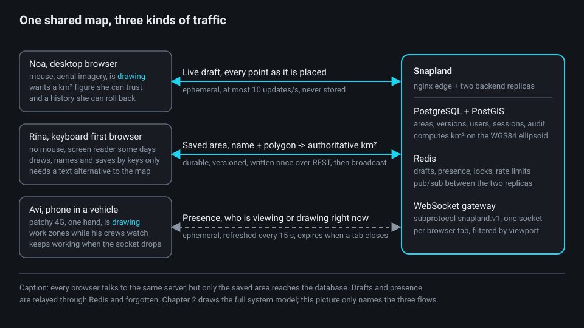
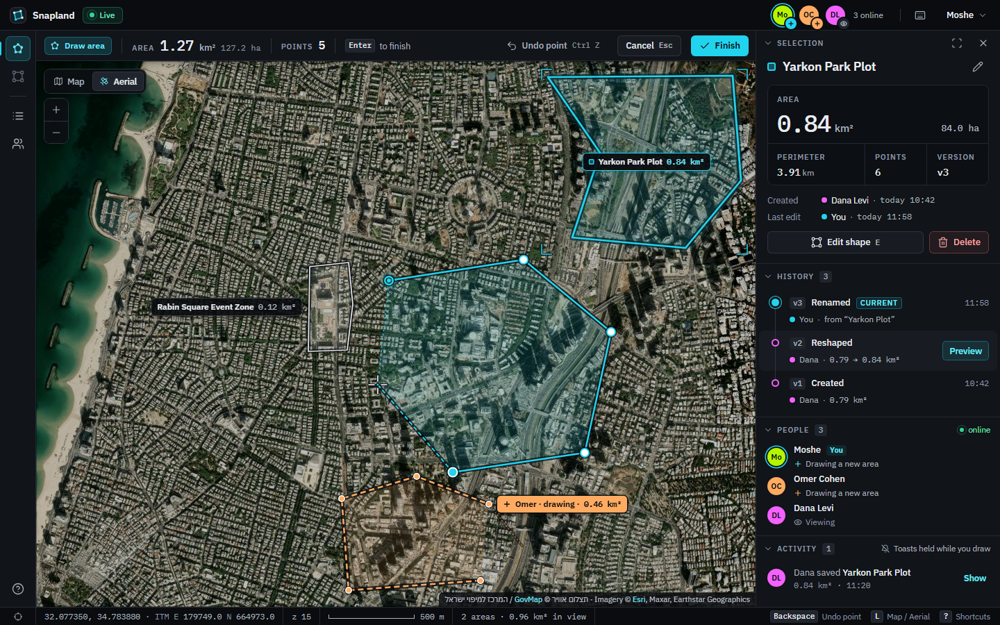
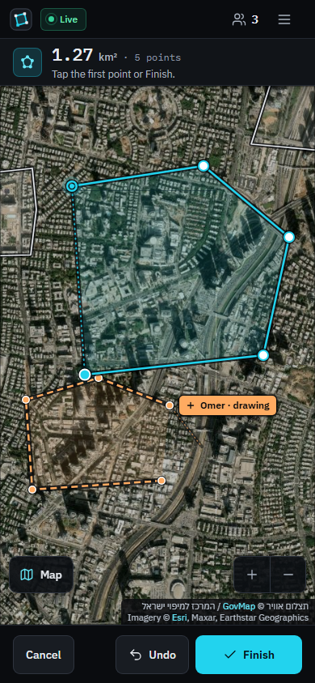
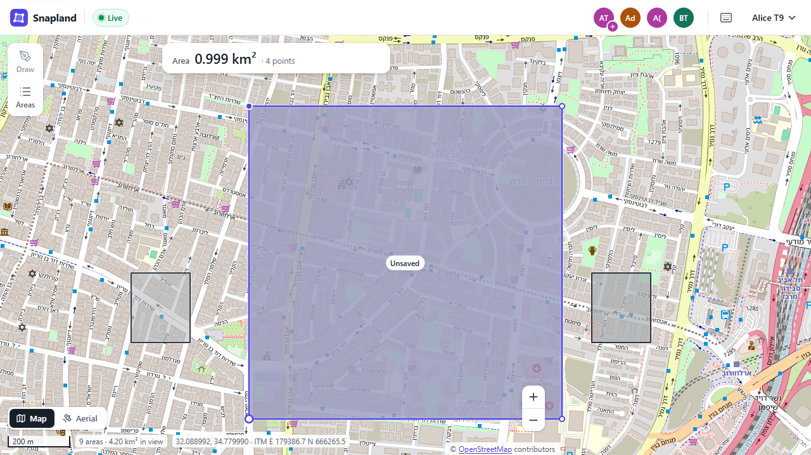
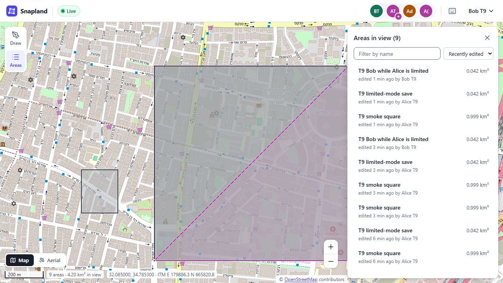
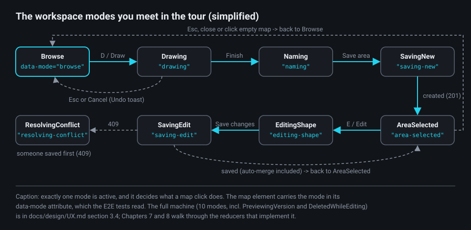
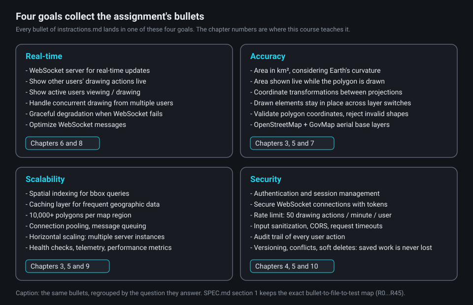
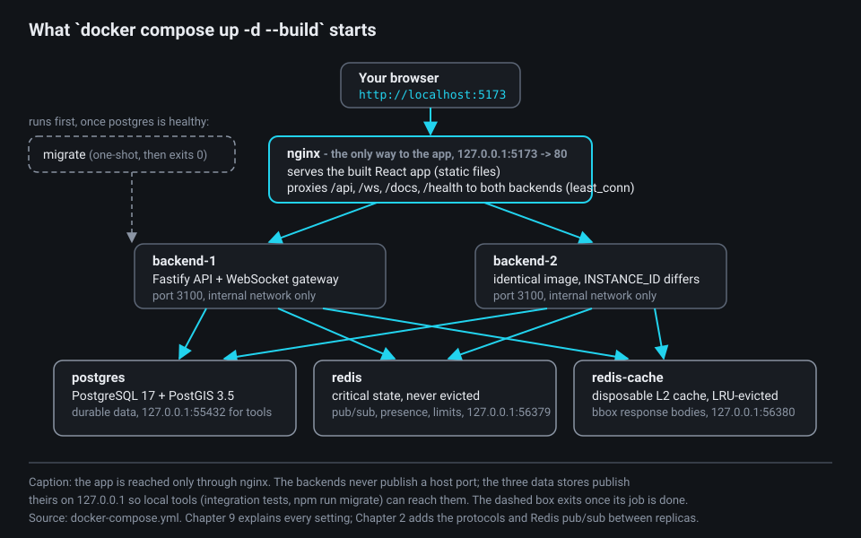
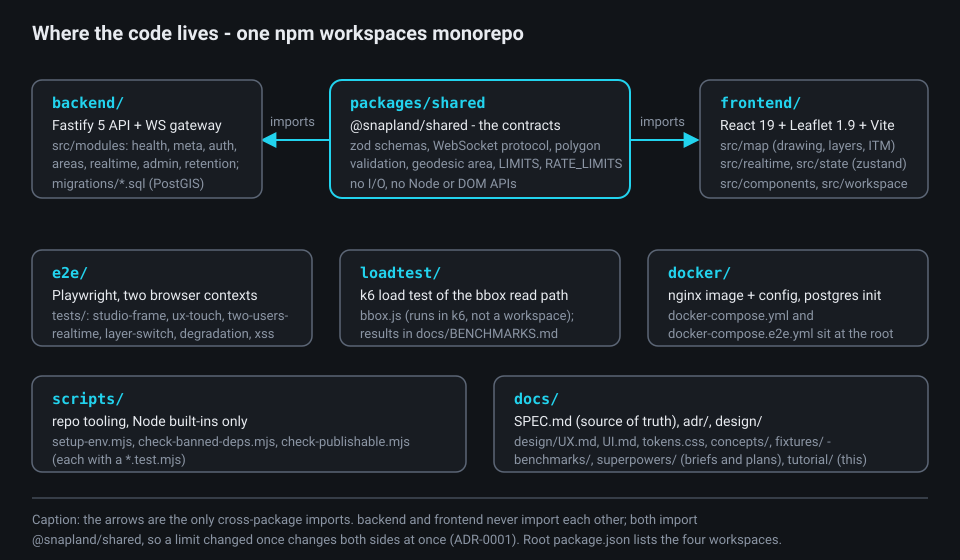

# Chapter 1 - What we are building and why

**What you will learn**

- What the assignment asks for, and how a two-line brief became a product with real users in mind.
- The four goals that organise the design: real-time, accuracy, scalability, security.
- What the running app looks like, and the words this course uses for each part of it.
- How to start the stack, where each piece of code lives, and which chapter covers what.

**Why this matters**

You know JavaScript, TypeScript, React and SQL. What you have not built before is a system where several browsers edit the same map at once, where the numbers on screen must be geodetically correct, and where everything runs as containers behind a reverse proxy. This chapter gives you the map: what the system must do, why each goal exists, and where to look.

## 1. The assignment

The brief is short. Its first two lines say what the product has to be:

**instractions.md:1-2**

```text
Create a collaborative GIS application where multiple users can draw and analyze areas on a
map in real-time, with the ability to switch between regular map and satellite views.
```

Three terms to fix first:

- **GIS** (geographic information system): software that stores and analyses shapes placed on the Earth. Here the shapes are **polygons**: closed outlines made of corner points, each a longitude and latitude.
- **Area**: a polygon that has been named and saved. The app measures it in **km²**; "analyze" means those measurements: km², hectares, perimeter, point count.
- **Real-time**: what one user draws appears in the other browsers while it is being drawn, not after a refresh.

The brief lists six groups of requirements (backend, database, security, map integration, real-time drawing, technical challenges) and fixes the stack:

**instractions.md:70-74**

```text
Technical Stack:
● Backend: Your choice of language with WebSocket support
● Database: PostgreSQL with PostGIS extension (or justify alternative choice)
● Frontend: Any modern framework + Leaflet.js
● No third-party plugins for the collaborative features
```

Two things to notice. **PostGIS** is the PostgreSQL extension that adds geometry types, spatial functions (such as area on the ellipsoid) and spatial indexes; Chapter 3 is about it. And the last line shapes the code most: no `socket.io`, no `leaflet-draw`, no Yjs. The drawing tool, the WebSocket protocol and the conflict handling are written here, and `scripts/check-banned-deps.mjs` enforces the ban: its `BANNED` list names those packages, and `npm run check:deps` fails if any of them appears anywhere in the installed dependency tree.

The brief also says how the work is graded:

**instractions.md:84-93**

```text
Evaluation Criteria:
● Implementation of real-time features
● Backend architecture and code organization
● Database design and performance considerations
● Security implementation
● Handling of map layer transitions
● Accuracy of area calculations
● Error handling and logging approach
● System scalability and monitoring considerations
● Documentation quality and technical decision explanations
```

`docs/SPEC.md` section 1 turns every bullet into a row: requirement id (R0...R45), design section, implementing files, and the test that proves it. When you wonder "where is X done, and how do we know it works?", start there.

## 2. The product

### 2.1 Three people, one map

The UX spec (`docs/design/UX.md` section 2) designs for three personas; many later decisions make sense only through them:

- **Noa**, a municipal planner on a large screen, traces parcels on aerial imagery for reports: precise points, live km², undo per point, a version history she can roll back.
- **Avi**, a field-team coordinator on a phone with patchy 4G, splits a region into work zones while his crews watch: big touch targets, others' drafts labelled by name, a clear connection state, saving that survives a lost socket.
- **Rina**, a keyboard-first GIS analyst, sometimes with a screen reader, digitises dozens of areas per session: a complete keyboard path and a text alternative to the map.



The diagram names three kinds of traffic. A **draft** is the polygon someone is drawing right now; it is ephemeral: it lives in memory and in **Redis** (an in-memory key-value store that both backends share), never in PostgreSQL. A **saved area** is durable and versioned. **Presence** is who is viewing or drawing. Only the second reaches the database.

### 2.2 A tour of the screens

Open http://localhost:5173. The first screen is sign-in (`/signin`, with `/signup` one link away); after that there is one screen, the **workspace**, at `/`. The routing is tiny: `frontend/src/app/router.ts` is a History-API router of about fifty lines, and `frontend/src/App.tsx` (lines 63-80) picks between `booting` (a silent token refresh, so a returning user never sees the sign-in form flash), `signed-in` and the login page. The workspace never unmounts while you are signed in.

The workspace uses the **Studio** design, chosen by the product owner on 2026-09-28 from four concepts (ADR-0010, `docs/design/concepts/README.md`): a docked frame around the map.



Top to bottom, left to right (file names from `frontend/src/components/frame/` and `inspector/` unless a path is given):

- **Title bar** (`TitleBar.tsx`): brand, connection pill (`Live`, `Reconnecting`, `Limited`), presence avatars, user menu.
- **Tool rail** (`ToolRail.tsx`): Draw area, Edit shape, Areas in view, People, Shortcuts.
- **Options bar** (`OptionsBar.tsx`; its content comes from `frontend/src/components/Hud.tsx`, one level up): the drawing HUD with the live area (`1.27 km² 127.2 ha` in the frame), point count, Undo / Cancel / Finish.
- **The map**: Leaflet with a `Map` / `Aerial` switch. Your draft is solid cyan; others' drafts are dashed in their colour with a chip such as `Omer · drawing · 0.46 km²`; saved areas are white.
- **Inspector** (`Inspector.tsx`), 352 px on the right: Selection, History (one row per version), People, Activity.
- **Status bar** (`StatusBar.tsx`): the coordinate readout in two systems (`32.077350, 34.783880 · ITM E 179749.0 N 664973.0`), zoom, scale bar, `2 areas · 0.96 km² in view`.

Below 1200 px the inspector becomes an overlay; below 600 px the app uses a phone frame with a one-line HUD and a bottom bar:



Two honest notes: the `concepts/1-studio/*.png` frames are mockups from `mockup.html` (their aerial tiles are an Esri stand-in, as `notes.md` says), and the real screenshots, `docs/design/impl-*.png` (twelve files) and `docs/benchmarks/t9-*.png`, were taken before the Studio restyle, so they show the earlier light chrome and violet accent; the behaviour is unchanged.





### 2.3 Modes

The workspace is a state machine. Exactly one **mode** is active, and it decides what a map click does: in `browse` it selects an area, in `drawing` it adds a point, in `naming` nothing, because the shape is locked (`docs/design/UX.md` section 3.4, the table at lines 204-213). The map element carries the mode in a `data-mode` attribute so tests can read it.



What to notice: Leaflet's double-click zoom is on only in Browse and AreaSelected, where a click selects an area. It is off in every mode where a click places or moves a point (Drawing, EditingShape) and in every locked mode (Naming, SavingNew, SavingEdit, ResolvingConflict, PreviewingVersion), so a fast second click never zooms the map mid-draw. Chapters 7 and 8 read the reducers (`frontend/src/state/drawingReducer.ts`, `editReducer.ts`) that implement it.

## 3. Four goals



The specification states three properties everything else follows from:

**docs/SPEC.md:181-183**

```text
- **Commands over REST, events over WebSocket** (ADR-0004): every durable mutation goes through one REST write path; the socket carries committed-change events, ephemeral drafts, presence, soft locks and heartbeats. The app stays usable without WebSocket.
- **Stateless backend instances**: durable state in PostgreSQL, shared ephemeral state in Redis; any instance serves any request or socket, with no sticky sessions. Each serves Prometheus metrics on its internal `/metrics` (§10.8).
- **Server-authoritative geometry and area**: the client previews the geodesic area with the same algorithm as PostGIS (geographiclib, Karney); they agree to ~1e-12 on identical coordinates.
```

### 3.1 Real-time

A **WebSocket** is a long-lived two-way connection between a browser and a server; unlike an HTTP request, the server can push a message whenever it wants. Snapland opens one socket per browser tab at `/ws`, with the subprotocol name `snapland.v1`. The rule of ADR-0004 (`docs/adr/0004-realtime-commands-over-rest-events-over-websocket.md`, lines 11-18) is that the socket carries *events*, never *commands*: `area.changed` after a commit, `draft.updated` at most ten times a second, presence, advisory soft locks and heartbeats, only for the viewport each connection declared.

Why it matters: when the socket drops, nothing is lost, because saving never went over the socket. The client falls into a "limited" mode that polls a REST change feed every 5 s; a recorded two-browser run shows a save made in that mode still reaching the other user (`docs/benchmarks/t9-smoke.txt`, lines 28-33; the harness that produced it is not in the repository). Chapters 6 and 8 cover both sides.

### 3.2 Accuracy

The Earth is round and a web map is flat. Leaflet draws in **Web Mercator**, a projection that stretches areas more the further you are from the equator, so measuring a polygon in screen pixels is wrong by a lot:

**docs/SPEC.md:777**

```text
- **Never** planar Web Mercator area: it overestimates by 1.35–1.42× in Israel and 8.5× at 70° N (fixture `area_km2_webmercator_planar_WRONG`). Validity uses planar lng/lat edges while area uses geodesic ones; negligible within 20°.
```

Instead, every area is computed **geodesically** on the **WGS84 ellipsoid** (the Earth model GPS uses): PostGIS `ST_Area(geom::geography)` on the server, and the same algorithm (Karney's, `geographiclib-geodesic`) in the browser, so the number you see while drawing is the number that gets saved:

**packages/shared/src/geo/geodesic.ts:39-50**

```ts
/**
 * Area in km² of a polygon (exterior minus holes), rings in `[lng, lat]`. A ring may be open (the live drawing: its
 * vertices plus the cursor point); a ring of fewer than 3 distinct vertices has no area.
 */
export function geodesicArea(rings: readonly (readonly (readonly number[])[])[]): number {
  let areaM2 = 0;
  rings.forEach((ring, index) => {
    const { areaM2: ringArea } = ringMetrics(ring);
    areaM2 += index === 0 ? ringArea : -ringArea;
  });
  return Math.max(0, areaM2) / 1e6;
}
```

What to notice: this lives in `packages/shared`, so the frontend readout and the backend tests import the same code. The recorded run shows how tightly the two sides agree:

**docs/benchmarks/t9-smoke.txt:21-23**

```text
PASS (e) saved areaKm2 = Naming readout ≤ 1e-9 {"areaKm2":0.9986215183067322,"readout":0.9986215183076859,"rel":9.549980254472847e-13}
PASS (d) presence viewing again ≤ 2 s after the save {"ms":84}
PASS (f) Bob's areasInView has the area with the same areaKm2 (≤ 1e-9) {"ms":4,"bob":0.9986215183067322,"saved":0.9986215183067322}
```

Readout and PostGIS differ by about 1e-12 relative on the same coordinates. Chapter 3 explains the geodesy; Chapter 7 the projections and the ITM (Israeli grid) readout.

### 3.3 Scalability

The assignment asks how you would handle multiple server instances. Snapland does not answer with a paragraph; it runs two from the start: `docker-compose.yml` (lines 149-206) defines `backend-1` and `backend-2` from one image, differing only in `INSTANCE_ID`. A **replica** is such an identical copy. **nginx**, a reverse proxy (a server that forwards requests to other servers), sits in front and spreads connections over both:

**docker/nginx/nginx.conf:87-91**

```nginx
    # least_conn balances long-lived WebSockets better than round-robin (SPEC section 10.10). No sticky sessions: tickets,
    # presence and fan-out live in Redis, so any replica accepts any client.
    least_conn;
    server backend-1:3100 max_fails=3 fail_timeout=10s resolve;
    server backend-2:3100 max_fails=3 fail_timeout=10s resolve;
```

What to notice: "no sticky sessions" is the whole scalability story. If Alice's socket is on `backend-1` and Bob's on `backend-2`, Alice's draft still reaches Bob because each backend publishes to a **Redis pub/sub** channel the other subscribes to.

Where is that proved? Twice. In real browsers, `e2e/tests/two-users-realtime.spec.ts` puts its two users on different replicas, as SPEC section 12.2 (`docs/SPEC.md`, line 1334) requires: the test helper records the `instanceId` of each socket's `welcome`, and the spec reloads Bento's page until his replica differs from Alma's (lines 21-34), so the draft he then sees must have crossed Redis. In process, a pair of integration tests does the same without a browser: `backend/test/integration/system/cross-instance-rest-ws.int.test.ts`, the proof SPEC R40 (line 137) names, and `realtime/cross-instance.int.test.ts`. Each starts two app instances in one process, sharing PostgreSQL and Redis, and asserts that a change on instance A reaches a WebSocket client of instance B within 500 ms. Chapter 6 covers the fan-out; Chapter 9 the compose file and nginx.

### 3.4 Security

The assignment names authentication, token-secured sockets, CORS, sanitisation, timeouts, an audit trail and one very specific limit, which is a shared constant:

**packages/shared/src/constants.ts:74-79**

```ts
/** The drawing-action limit of the assignment and the generic HTTP limits' defaults (section 10.1). */
export const RATE_LIMITS = {
  drawActionsPerWindow: 50,
  drawWindowMs: 60_000,
  clientErrorsPerMinute: 30,
} as const;
```

The rest (JWT access tokens in memory, rotating refresh tokens in an HttpOnly cookie, one-time tickets to open a socket, a sliding-window limiter in Redis shared by both replicas) is Chapter 4; the audit trail returns in Chapter 10. The diagram also files versioning, conflict resolution and soft deletes here, although the assignment lists them under backend and database (SPEC R5, R11, R20): all three protect saved work from silent loss, so nothing a user saved is overwritten unnoticed or gone for good. Chapter 5 teaches them.

## 4. The stack, and how to run it

Node 22 + TypeScript with **Fastify** 5 (the Node HTTP framework the backend is built on) and the raw `ws` library; PostgreSQL 17 + PostGIS 3.5; Redis 7.4, twice, with different jobs; React 19 + Leaflet 1.9 built by Vite; nginx 1.30; all under docker compose (SPEC section 4.1 pins every version).



### 4.1 Start everything with Docker

**README.md:19-21**

```bash
cd /d/dev/fullstack/Snapland            # or wherever you cloned the repo
node scripts/setup-env.mjs              # creates .env from .env.example with a random JWT secret (safe to re-run)
docker compose up -d --build            # builds the images and starts the whole stack in the background
```

The first command exists because secrets are never committed: `.env.example` holds every setting with a safe default and a placeholder secret, and `createEnv()` in `scripts/setup-env.mjs` (lines 16-25) copies it, replacing only the `JWT_SECRET=` line with a random value. It returns early when `.env` exists and writes with the `wx` flag (line 23), so an existing `.env` is never overwritten.

Then open http://localhost:5173. Three URLs matter:

| URL | What it is |
|---|---|
| http://localhost:5173 | the app (sign up, then draw) |
| http://localhost:5173/docs | the OpenAPI (Swagger) reference, generated from the route schemas |
| http://localhost:5173/health/ready | readiness of the replica that answered: database, Redis, migrations |

A **health check** is a URL that reports whether a process can serve traffic. There are two, in `backend/src/modules/health/health.routes.ts` (lines 13-46): `/health/live` (the process runs) and `/health/ready` (database, Redis and migrations are fine; 503 otherwise). Compose and nginx wait for the second. Its `response` schema, `ReadyResponseSchema`, is a **zod** schema (zod is a TypeScript schema library: you describe a shape once and get both a validator and a type) from `packages/shared` that Fastify uses both to validate the reply and to generate the `/docs` entry: one schema language for validation and documentation (ADR-0002, Chapter 4).

### 4.2 Development mode

For hot reload, keep the databases in Docker and run the backend and frontend on your machine:

```bash
npm ci                                # install all workspaces (the Docker route in section 4.1 never needed node_modules)
docker compose up -d postgres redis redis-cache && npm run migrate -w @snapland/backend -- up
npm run dev -w @snapland/backend      # http://localhost:3100
npm run dev -w @snapland/frontend     # http://localhost:5174, proxies /api and /ws to :3100
```

Port 5174 is deliberate: 5173 belongs to the Docker stack, so both run at once (decision D-2, SPEC section 11).

### 4.3 The tests

`npm run verify` (static checks and unit tests, no Docker), `npm run test:integration` (real PostGIS and Redis) and `npm run test:e2e` (Playwright against the stack built with `docker-compose.e2e.yml`); Chapter 10 explains them.

## 5. Where the code lives



The repository is an **npm workspaces monorepo**: the root `package.json` lists four packages (`packages/shared`, `backend`, `frontend`, `e2e`) sharing one lockfile and one set of lint and TypeScript rules; `loadtest/` beside them is a single k6 script, `bbox.js`, which runs in the k6 binary, not in Node. The centre is the shared package:

**packages/shared/src/index.ts:1-7**

```ts
/**
 * @snapland/shared - the public API of the contracts shared by backend and frontend (ADR-0001). Consumers import only
 * from this entry point; the package's only other export, `@snapland/shared/testing`, holds test fixtures.
 */
export * from './constants.js';
export * from './errors.js';
export * from './text/sanitize.js';
```

Why: a limit, a message shape or an error code changed here changes both sides at once (ADR-0001, Chapter 2).

The backend has one entry point, `backend/src/main.ts`: it validates the configuration (failing fast with every problem listed), builds a **container** (the one place that wires implementations together), builds the Fastify app and listens. Lines 27-31 show a pattern you will see repeated: the process starts even when Redis is down, in a defined degraded mode. The features are modules, registered in a fixed order:

**backend/src/app.ts:39-48**

```ts
/** Every feature module, in registration order (stopped in reverse order, section 10.12). */
export const APP_MODULES: readonly ModuleFactory[] = [
  createHealthModule,
  createMetaModule,
  createAuthModule,
  createAreasModule,
  createRealtimeModule,
  createAdminModule,
  createRetentionModule,
];
```

Each module folder follows one layering (SPEC section 3.2): `*.routes.ts` (HTTP, validation, status codes) call `*.service.ts` (business rules, transactions, events), which call `*.repository.ts` (SQL only); Chapters 4 and 5 walk through `auth` and `areas`. On the frontend, `frontend/src/` splits into `map/` (Leaflet, the drawing controller, base layers, projections), `state/` (**zustand** stores, zustand being a small React state library, and pure reducers), `realtime/` (the WebSocket client), `workspace/` (the flows) and `components/` (Chapters 7 and 8).

Two facts about the repository. It has no git commits yet; the product owner commits. And the code you read in this course is the result of a simplification pass (`docs/superpowers/plans/2026-09-28-simplify-plan.md`, applied on 2026-09-29): about 9,000 lines of backend, shared, test, script and config code went, `SPEC.md` shrank from 4,393 to about 1,430 lines, and every contract (REST, WebSocket, database schema) stayed frozen except a few small changes the plan lists. Product decision D-7 went further: the optional GovMap 2025 tile proxy (a backend `tiles` module, an nginx tile cache and their settings) was deleted, so *Aerial* is loaded straight from GovMap's 2022 cache (Chapter 7). Treat the **architecture** (goals, one write path, two replicas, shared contracts, layering) as stable, and exact line numbers as a snapshot of the final code of 2026-09-29.

## Try it yourself

All three need the Docker stack: if `docker compose ps` does not show every service `healthy`, run `docker compose up -d --build` first.

**1. See real-time with your own eyes.** Open http://localhost:5173 in two browsers (or a normal and an incognito window), sign up as two users, and in window A press **D** or click *Draw area* and place three points while watching window B.

Expected: within a second or two, B shows a dashed outline in A's colour with a chip `<A's name> · drawing · <km²>`, and *People* in B lists A as `drawing`. Click *Finish* in A, name it, save: in B the draft disappears, a white saved area appears, the *Areas in view* count grows by one, and A returns to `viewing`. The km² is identical in both windows: both show the value PostGIS computed. `e2e/tests/two-users-realtime.spec.ts` (lines 64-84) asserts the same: the remote draft and its chip carry Alma's user id, the chip says `drawing`, and its `data-km2` matches Alma's own readout to within the 6-decimal precision drafts travel at.

**2. Find out which replica served you.** Run this six times:

```bash
curl -s http://localhost:5173/health/ready
```

Expected: JSON with `"status":"ok"`, an `instanceId`, and `checks` for `database`, `redis`, `migrations`, `shutdown` and `cacheRedis`. Over six calls `instanceId` shows both `backend-1` and `backend-2` (on an idle stack they alternate); `"pending":0` means every migration is applied. If curl reports a reset or closed connection while `docker compose ps` shows every service healthy, run `docker compose restart nginx`: Docker Desktop's port forwarding can go stale (README, Troubleshooting). Then open http://localhost:5173/docs (21 paths on 2026-09-29) and find `POST /api/v1/areas`, the one write path of section 3.1.

**3. Run the shared contracts' tests.** No Docker needed:

```bash
npm run test -w @snapland/shared
```

Expected (2026-09-29): `Test Files  9 passed (9)` and `Tests  126 passed (126)` in a few seconds; `geodesic.test.ts` checks every polygon in `docs/fixtures/geodesic-area-fixtures.json` to 1e-6 relative. The counts may change as the code evolves; the tolerance will not.

## Self-check

1. Why does Snapland never compute an area from the polygon's pixels on the map?
2. What is "one write path", and what does the WebSocket carry instead?
3. Why does `docker-compose.yml` start two identical backends rather than one?
4. You open http://localhost:5173, not http://localhost:3100. What runs on each port?
5. Where do the zod schemas, the WebSocket protocol and the area function live, and why there?

<details>
<summary>Answers</summary>

1. Web Mercator inflates areas away from the equator (1.35-1.42x in Israel, 8.5x at 70° N, SPEC section 8.5). Every area is computed geodesically on the WGS84 ellipsoid: PostGIS `ST_Area(geom::geography)` on the server and `geodesicArea()` from `packages/shared/src/geo/geodesic.ts` in the browser, agreeing to about 1e-12.
2. Every durable change (create, update, delete, restore) is a REST call to the areas service (ADR-0004). The WebSocket carries only events: `area.changed`, ephemeral `draft.updated`, presence, soft locks, heartbeats. Saving never depends on the socket, so the app stays usable in "limited" mode without it.
3. To prove horizontal scaling rather than describe it: the backends are stateless (durable state in PostgreSQL, shared ephemeral state in Redis), nginx balances with `least_conn` and no sticky sessions, and Redis pub/sub relays drafts and events between replicas. The running proof is a pair of integration tests (`backend/test/integration/system/cross-instance-rest-ws.int.test.ts`, which SPEC R40 names, and `realtime/cross-instance.int.test.ts`), two instances in one process; and in real browsers the two-user Playwright spec, which reloads one user until the two sockets sit on different replicas.
4. 5173 is nginx, the only entry point to the app: it serves the built React app and proxies `/api`, `/ws`, `/docs` and `/health` to the backends, which never publish a host port. 3100 is the backends' port inside the Docker network (`expose`); in development mode the backend uses it on your machine, next to Vite on 5174. Postgres and the two Redis instances also publish loopback-only ports (`127.0.0.1:55432`, `56379`, `56380`; `docker-compose.yml` lines 66, 102, 125) for local tools such as the integration tests and `npm run migrate`.
5. In `packages/shared`, imported by backend and frontend through its single `index.ts` entry point (ADR-0001), so a limit, message shape or error code changed there changes both sides at once, and the browser's live km² readout runs the same code the backend tests check.

</details>

## Further reading

- The assignment: [`instractions.md`](../../../instractions.md).
- The specification: [`docs/SPEC.md`](../../SPEC.md), especially section 1 (traceability, R40 at line 137), section 2 (architecture), section 3.1 (layout), section 11 (compose), section 12.2 (test pyramid) and section 13, which now points to the README's *Known limitations*.
- Decisions: [ADR-0001](../../adr/0001-monorepo-with-shared-contracts.md) (monorepo), [ADR-0004](../../adr/0004-realtime-commands-over-rest-events-over-websocket.md) (commands over REST, events over WebSocket), [ADR-0010](../../adr/0010-studio-redesign.md) (Studio redesign).
- Design: [`docs/design/UX.md`](../../design/UX.md) section 2 and section 3.4; [`docs/design/UI.md`](../../design/UI.md) v2 "Studio"; [`docs/design/concepts/README.md`](../../design/concepts/README.md); the brief [`2026-09-28-studio-redesign-design.md`](../../superpowers/specs/2026-09-28-studio-redesign-design.md).
- Running it: [`README.md`](../../../README.md) (Troubleshooting included), [`docker-compose.yml`](../../../docker-compose.yml), [`.env.example`](../../../.env.example).
- Evidence: [`docs/benchmarks/t9-smoke.txt`](../../benchmarks/t9-smoke.txt) (34 checks) and the `t9-*.png` screenshots beside it; the cross-instance integration tests under [`backend/test/integration/`](../../../backend/test/integration/); [`docs/BENCHMARKS.md`](../../BENCHMARKS.md), the measured load-test results (the k6 script `loadtest/bbox.js` against the `seed` dataset).
- How the code got its final shape: [`2026-09-28-simplify-plan.md`](../../superpowers/plans/2026-09-28-simplify-plan.md) (the plan, its D-7 and D-8 addenda, and the result).
