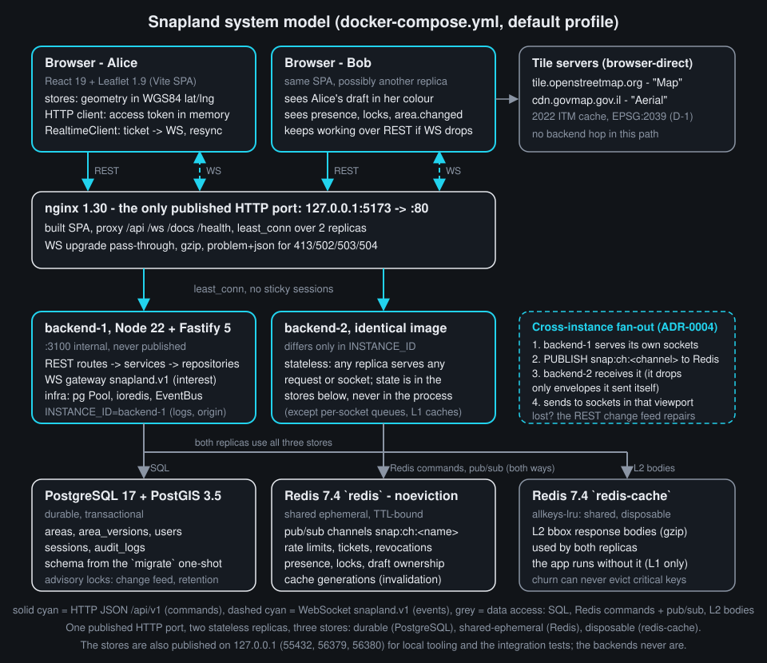
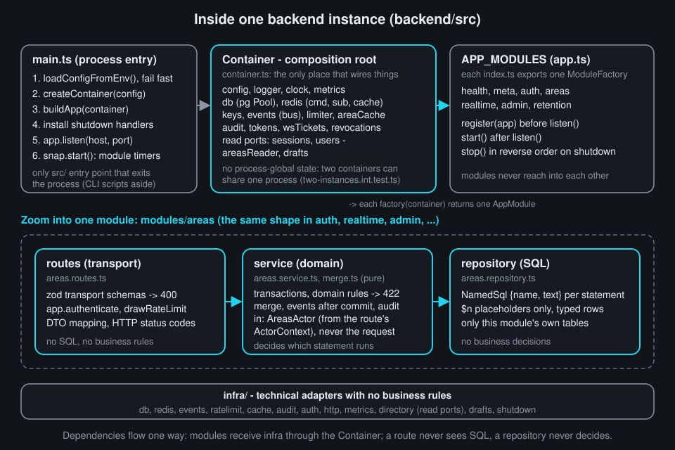
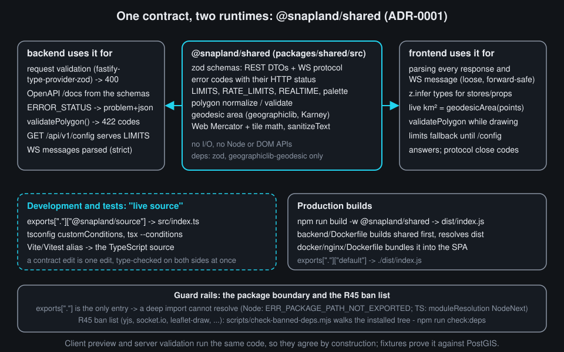
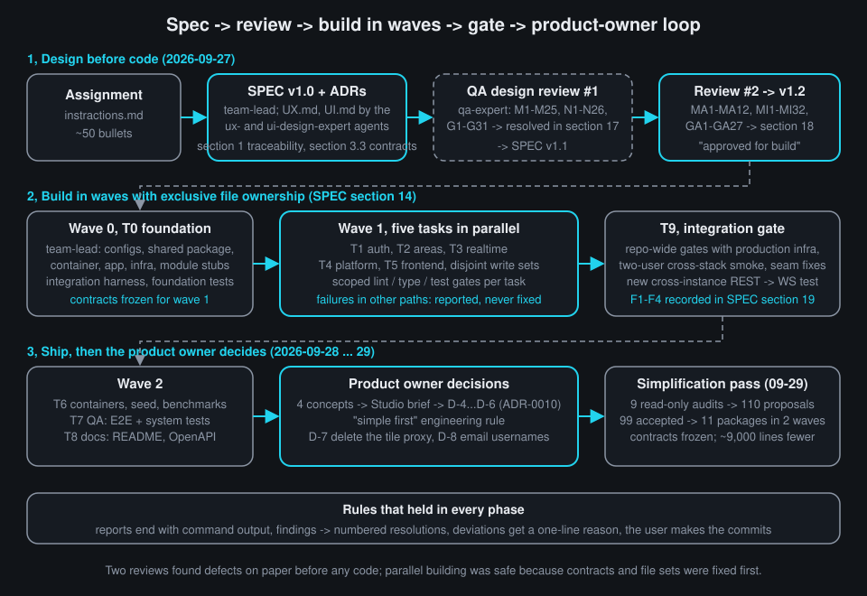

# Chapter 2 - Designing the system: from requirements to architecture

**What you will learn**

- How to turn a fifty-bullet assignment into a numbered, checkable requirement table, and why every row needs a *proof* column.
- The Snapland system model: which component runs where, which protocol connects them, and where each kind of state lives (and why).
- How one backend instance is layered (routes -> service -> repository) and wired by a composition root, so seven modules stay independent.
- Why `@snapland/shared` exists, and how one **zod** schema (zod is a runtime validator that also yields a TypeScript type) serves the server, the client and the **OpenAPI** document (the machine-readable description of the REST API that powers http://localhost:5173/docs) at once.
- How decisions were recorded (ADRs and user decisions) and how the AI team process (spec -> QA review -> build in waves -> integration gate) produced the code.

**Why this matters**

Chapter 1 explained *what* Snapland is. The assignment in `instractions.md` is roughly fifty bullets: real-time drawing, PostGIS, rate limits, audit trails, horizontal scaling, and a README that explains every decision. This chapter is about getting from that list to a design that (a) can be checked bullet by bullet, (b) can be built by several people or agents at once without collisions, and (c) survives a code-simplification pass, because the boundaries and the contracts are what matter, not the line count.

A note on timing: this chapter describes the code after the simplification pass of 2026-09-29 (`docs/superpowers/plans/2026-09-28-simplify-plan.md`). Where that pass changed something the chapter discusses, it says so, and it marks where the *architecture* is the thing to remember.

---

## 1. Start from the grader's checklist: requirement traceability

**The problem.** A long assignment invites a common failure: you build what is interesting, forget what is boring, and cannot say at the end which bullets are met.

**Requirement traceability** is a table with one row per requirement and four columns: the requirement, the design section that decides how it is met, the files that implement it, and the *proof* (a test file or recorded evidence). Snapland's version is `docs/SPEC.md` section 1, with ids `R0`-`R45` for requirements and `S1`-`S8` for deliverables.


**`docs/SPEC.md:91-93`**
```md
## 1. Requirement traceability

Every bullet of `instractions.md` maps to a design section, a primary implementation file and a primary proof (a test or a command); each suite's header lists what else it asserts. `B/` = `backend/`, `F/` = `frontend/`, `S/` = `packages/shared/`, `IT/` = `backend/test/integration/`, `E2E/` = `e2e/tests/`. Groups: 1.1 core requirements, 1.2 database, 1.3 security and reliability, 1.4 map integration, 1.5 real-time drawing, 1.6 technical challenges and advanced backend, 1.7 stack constraints, 1.8 submission deliverables.
```

**`docs/SPEC.md:101-103`**
```md
| R4 | 1.1 | Authentication and session management | §6.2, ADR-0006 | `B/src/modules/auth/auth.service.ts` | `IT/auth/auth-flow.int.test.ts` |
| R5 | 1.1 | Area versioning and edit history | §5.2, §6.3 | `B/src/modules/areas/areas.repository.ts` | `IT/areas/areas-versions.int.test.ts` |
| R6 | 1.1 | Area size in km² | §8.5 | `S/src/geo/geodesic.ts` + PostGIS `ST_Area(geography)` | `S/src/geo/geodesic.test.ts` |
```

**What to notice.** The proof column names a *file* or a command: "covered by tests" is not a proof; a path is. Row `R0` exists because the assignment says users "draw and **analyze** areas"; *analyze* had no row at first, the QA review flagged it as gap G1, and the table gained a row and a design section (section 8.5). (The review maps are archived, unmaintained, in `docs/archive/spec-history-2026-09.md`; G1 is in its section 17.3.)

**How to make this decision yourself.** Number the bullets before you design anything. For each, write the proof first (which test would convince a stranger?), then the design. A row with no nameable proof is a requirement you do not understand or cannot verify; both are worth knowing on day one. Chapter 10 shows how the proof files are organised.

---

## 2. The system model: what runs where

**The problem.** Three requirements pull in different directions. *Real-time* wants the server to push to browsers, which needs long-lived connections. *Horizontal scaling* ("how would you handle multiple server instances?") wants any instance to serve any user, which forbids keeping user state in a process. *Graceful degradation* wants the app to work when the WebSocket is down. The design must decide where every kind of state lives before any code exists.

A few terms: an **instance** (or **replica**) is one running backend process; Snapland runs two, `backend-1` and `backend-2`. A **reverse proxy** is a server in front of the instances that receives every client request and forwards it; here it is nginx. **Stateless** means the process keeps nothing a second request would need. **Pub/sub** is a message pattern where a publisher sends to a named channel and every subscriber of that channel receives a copy; Redis provides it.



Read the diagram top to bottom. Browsers load the **SPA** (single-page app: one HTML page whose JavaScript renders every screen) from nginx and talk to it in two ways: HTTP JSON for **commands** (create, update, delete an area) and one WebSocket for **events** (other users' drafts, presence, committed changes). nginx is the only published *HTTP* entry point of the app: the backends are `expose: 3100` only and never get a host port. The data stores are published too, but only on the loopback address, so local tooling and the integration tests can reach them: PostgreSQL on `127.0.0.1:55432` (`docker-compose.yml:66`), `redis` on `56379` (`:102`) and `redis-cache` on `56380` (`:125`); nginx itself is `127.0.0.1:5173 → 80` (`:219`). nginx balances the two replicas:

**`docker-compose.yml:149-158`**
```yaml
  # Two identical replicas behind nginx prove cross-instance realtime (Redis pub/sub fan-out, section 7.10). They differ
  # only in INSTANCE_ID (logs, bus origin, metrics).
  backend-1:
    <<: *backend-runtime
    command: ['node', '--enable-source-maps', 'dist/main.js']
    environment:
      <<: *backend-environment
      INSTANCE_ID: backend-1
    expose:
      - '3100'
```

**`docker/nginx/nginx.conf:84-94`**
```nginx
  upstream snapland_backend {
    # Required by `resolve`: the re-resolved peer list is shared by all workers.
    zone snapland_backend 64k;
    # least_conn balances long-lived WebSockets better than round-robin (SPEC section 10.10). No sticky sessions: tickets,
    # presence and fan-out live in Redis, so any replica accepts any client.
    least_conn;
    server backend-1:3100 max_fails=3 fail_timeout=10s resolve;
    server backend-2:3100 max_fails=3 fail_timeout=10s resolve;
    keepalive 32;
    keepalive_timeout 60s;
  }
```

**What to notice.** `least_conn` sends a new connection to the replica with fewer open ones. That only works with *no sticky sessions*: Alice's WebSocket can live on `backend-1` while her next REST call lands on `backend-2`, because the state a request needs is in Redis and PostgreSQL, not in the process. The three architectural rules are stated in one place:

**`docs/SPEC.md:181-183`**
```md
- **Commands over REST, events over WebSocket** (ADR-0004): every durable mutation goes through one REST write path; the socket carries committed-change events, ephemeral drafts, presence, soft locks and heartbeats. The app stays usable without WebSocket.
- **Stateless backend instances**: durable state in PostgreSQL, shared ephemeral state in Redis; any instance serves any request or socket, with no sticky sessions. Each serves Prometheus metrics on its internal `/metrics` (§10.8).
- **Server-authoritative geometry and area**: the client previews the geodesic area with the same algorithm as PostGIS (geographiclib, Karney); they agree to ~1e-12 on identical coordinates.
```

### 2.1 Where state lives: the three-question test

Every piece of state was placed by asking three questions. *Must it survive a restart?* Then PostgreSQL. *Must two instances see it?* Then Redis. *Is it tied to one socket?* Then it may stay in memory.

Two terms in the table below: a **bbox** (bounding box) is the lng/lat rectangle of the map viewport; the area list endpoint takes one as a query parameter. **L1/L2** are cache tiers: L1 is a small cache inside each backend process, L2 is the shared one in Redis that both replicas read.

**`docs/SPEC.md:1215-1221`**
```md
| State | Lives in | Why instances stay stateless |
|---|---|---|
| Users, sessions, areas, versions, audit | PostgreSQL | durable, transactional |
| Rate-limit windows, WS tickets, revocations, presence, soft locks, draft ownership, cache generations | Redis `redis` (TTL-bound, `noeviction`) | shared, ephemeral |
| L2 bbox response bodies | Redis `redis-cache` (`allkeys-lru`) | shared, disposable |
| Cross-instance events | Redis pub/sub | fan-out |
| WS sockets, outbound queues, token buckets, L1 caches, draft coalescers | instance memory | connection-scoped or pure caches |
```

Notice there are **two** Redis containers. The critical one is `noeviction`: out of memory, it refuses writes rather than silently dropping a rate-limit window or a draft owner. Cached bbox pages are large and disposable, so they go to a second Redis with `allkeys-lru`, where eviction is the point. The split came from QA finding M20 (section 17.1 of the archived review map): a design simpler to explain than the failure it prevents.

### 2.2 Commands over REST, events over WebSocket

The most important single decision is that the WebSocket never writes durable data:

**`docs/adr/0004-realtime-commands-over-rest-events-over-websocket.md:10-17`**
```md
## Decision
- **One write path.** Every durable mutation (create/update/delete/restore) is a REST call through the same service. The WebSocket
  (`/ws`, subprotocol `snapland.v1`, raw `ws` via `@fastify/websocket`) carries:
  - committed-change events (`area.changed` with the global `changeSeq`);
  - ephemeral drafts (`draft.updated` at <= 10 Hz, coalesced, with keyframes);
  - presence;
  - advisory soft locks;
  - heartbeats.
```

**`docs/adr/0004-realtime-commands-over-rest-events-over-websocket.md:41-47`**
```md
## Consequences
- Graceful degradation comes almost for free: without WS the app still reads, writes and (by polling) sees others' changes.
- One validated, documented write path: OpenAPI, rate limits and audit are applied once.
- Latency is slightly higher than writing over WS (one HTTP round trip). This is negligible for saves; drafts, the latency-critical
  part, stay on WS.
- Pub/sub is at-most-once, so loss is repaired by resync. A transactional outbox or Redis Streams is the documented upgrade.
- Instances are stateless and need no sticky sessions (tickets live in Redis); nginx uses `least_conn`.
```

**What to notice.** One decision satisfies three requirements at once: graceful degradation (R14), a single place for validation, rate limiting and audit (R8, R12, R13), and horizontal scaling (R40). When one choice pays for several requirements, it is usually the right level of abstraction.

Here is the fan-out in code. `publish` delivers to this instance's own subscribers first, then to Redis for the other replica:

**`backend/src/infra/events/redis-event-bus.ts:54-71`**
```ts
  async publish<C extends BusChannel>(channel: C, payload: BusPayload<C>): Promise<boolean> {
    const envelope: BusEnvelope<BusPayload<C>> = {
      v: 1,
      origin: this.#deps.instanceId,
      ts: this.#deps.clock.now(),
      payload,
    };
    this.#subscribers.deliver(channel, envelope);
    try {
      await this.#deps.redis.cmd.publish(this.#deps.keys.channel(channel), JSON.stringify(envelope));
      this.#deps.metrics.busMessagesTotal.inc({ channel, direction: 'published', result: 'ok' });
      return true;
    } catch (error) {
      this.#deps.metrics.busMessagesTotal.inc({ channel, direction: 'published', result: 'error' });
      this.#logger.warn({ err: error, channel }, 'bus publish failed; remote instances rely on resync');
      return false;
    }
  }
```

The `origin` field is the instance id from the compose file; the receiving side skips envelopes whose origin is itself, so the publishing instance never delivers twice. Chapter 6 covers the gateway; the point here is that the bus is an infra adapter with a small interface (`backend/src/infra/events/types.ts:24-35`), so a module never knows whether it talks to Redis or to the in-memory bus of the unit tests.

**Code versus architecture.** Until decision D-7 the code also had a backend tile proxy for GovMap's 2025 imagery (decision D-1, ADR-0009), off by default. D-7 (`docs/superpowers/plans/2026-09-28-simplify-plan.md:831-841`) deleted it with everything that served it: the backend `tiles` module and its route, the nginx tiles location and cache, the `tiles` rate-limit scope, the `GOVMAP_*`/`TILE_*` settings, the SPA's proxy branch and the `tiles` field of `/api/v1/config`. The default *Aerial* layer comes straight from `cdn.govmap.gov.il`, as drawn.

---

## 3. Inside one instance: modules, layers and the composition root

**The problem.** A backend with seven feature areas and a dozen cross-cutting services (logger, connection pool, Redis clients, metrics, rate limiter, cache, audit writer, token services) can become a ball of imports in a week. Snapland also needed five builders working at once. The boundaries had to be cheap to check.

Terms: a **module** is one feature folder under `backend/src/modules/` with its own routes, service and repository. A **layer** is a role inside a module with a rule about what it may import. The **composition root** is the single place where concrete implementations are created and handed to everything else; handing them in rather than importing them is **dependency injection**. A **read port** is a tiny read-only interface one module uses to look at another module's data without touching its tables.



### 3.1 The three layers

One more term: a **DTO** (data-transfer object) is the JSON shape sent over the wire, as opposed to the database row; *DTO mapping* converts one into the other.

**`docs/SPEC.md:279`**
```md
`routes` (transport: zod schemas, auth hooks, DTO mapping, HTTP status) → `service` (domain: business rules, transactions, merge, events, audit) → `repository` (parameterised named SQL, typed rows, no business decisions).
```

Each layer of the areas module states its own rule in its header comment:

**`backend/src/modules/areas/areas.routes.ts:1-8`**
```ts
/**
 * Transport layer of the areas API (SPEC section 6.1, section 6.3): transport schemas, authentication, the drawing-action charge,
 * audit routing and HTTP validators. No SQL and no business rules - those live in the services.
 *
 * Mutation pipeline order (section 6.3): `authenticate` (onRequest, 401) -> transport validation (400, free) ->
 * `drawRateLimit` (preHandler: charges 1 for everything after it, 429) -> service. Every mutation route declares
 * `config.auditAction`, so outcomes the service never saw (transport 400, 413, 415, 5xx) still get an audit row.
 */
```

**`backend/src/modules/areas/areas.service.ts:1-8`**
```ts
/**
 * Area mutations (SPEC section 6.3, section 5.5 write path, section 10.3). Each one runs the normative pipeline after the route's
 * authentication, transport validation and drawing-action charge:
 *   domain input (sanitise -> 428 -> 422) -> [POST: draft-owner squatting guard, 409] -> transaction (row lock ->
 *   change-feed advisory lock 7210001 -> write -> version snapshot; GEOS / CHECK -> 422) -> COMMIT -> cache invalidation
 *   -> bus event (both awaited, before the reply) -> audit + metrics.
 * Lock order is always row lock -> advisory lock, so concurrent writers cannot deadlock.
 */
```

**`backend/src/modules/areas/areas.repository.ts:46-53`**
```ts
export const AREAS_SQL = {
  /** By id, soft-deleted rows included (the service decides whether a tombstone is visible). */
  findById: sql('areas.findById', `SELECT ${AREA_COLUMNS} FROM areas a ${AREA_JOINS} WHERE a.id = $1::uuid`),
  /**
   * Row lock that serialises writers of one area; always taken before the change-feed advisory lock. It locks the
   * `areas` row alone; `lockById` then reads the row with its user joins in a second statement (see there).
   */
  lockById: sql('areas.lockById', 'SELECT id FROM areas WHERE id = $1::uuid FOR UPDATE'),
```

**What to notice.** The comment on `findById` says "the service decides whether a tombstone is visible": the SQL returns soft-deleted rows and the *service* applies the rule. That is the layering in one sentence. Every statement has a name (a metrics label and prepared-statement name) and every value is a `$n` placeholder; SPEC section 3.2 bans concatenating values into SQL, which rules out injection by construction rather than by review.

### 3.2 Modules plug into a fixed app through one contract

**`backend/src/modules/types.ts:10-20`**
```ts
export interface AppModule {
  readonly name: string;
  /** Register routes/hooks. Called once, before listen(). */
  register(app: AppInstance): Promise<void>;
  /** Start background work (timers, subscriptions). Called after listen(). */
  start?(): Promise<void>;
  /** Stop background work. Called in reverse registration order during shutdown. */
  stop?(): Promise<void>;
}

export type ModuleFactory = (container: Container) => AppModule;
```

**`backend/src/app.ts:39-48`**
```ts
/** Every feature module, in registration order (stopped in reverse order, section 10.12). */
export const APP_MODULES: readonly ModuleFactory[] = [
  createHealthModule,
  createMetaModule,
  createAuthModule,
  createAreasModule,
  createRealtimeModule,
  createAdminModule,
  createRetentionModule,
];
```

The areas factory is pure wiring; it creates the services and hands them to the routes:

**`backend/src/modules/areas/index.ts:12-24`**
```ts
export const createAreasModule: ModuleFactory = (container) => {
  const { db, areaCache, events, audit, metrics, drafts, users } = container;
  const effects = new MutationEffects({ areaCache, events, audit, metrics });
  const service = new AreasService({ db, drafts, users, effects });
  const queries = new AreasQueryService({ db, areaCache, metrics });
  return {
    name: 'areas',
    register: (app) => {
      registerAreasRoutes(app, { service, queries });
      return Promise.resolve();
    },
  };
};
```

**What to notice.** The module takes `container.users` and `container.drafts`: those are read ports. The areas service needs to know whether a draft id is owned by another user (to refuse "squatting" on someone's visible draft), but it never queries Redis itself and never imports the realtime module:

**`docs/SPEC.md:284`**
```md
- Modules talk only through the `Container` or each other's `index.ts`. Cross-module reads go through the read ports `container.sessions`, `.users`, `.areasReader` and `.drafts`; a module's repository queries only its own tables.
```

### 3.3 The composition root

**`backend/src/container.ts:100-123`**
```ts
export function createContainer(config: AppConfig, overrides: ContainerOverrides = {}): Container {
  const logger = overrides.logger ?? createLogger(config);
  const clock = systemClock;
  const instanceId = config.INSTANCE_ID;
  const metrics = createMetrics(config, instanceId);

  const pool = createPool(config, instanceId);
  const db = createDb({ pool, metrics, logger });
  const redis = createRedisClients({ config, instanceId, logger, metrics });
  const keys = createRedisKeys(config.REDIS_KEY_PREFIX);
  const events: EventBus & Lifecycle =
    overrides.events ?? new RedisEventBus({ instanceId, clock, logger, metrics, redis, keys });

  const drawRateLimiter =
    overrides.drawRateLimiter ??
    new RedisDrawRateLimiter({
      redis: redis.cmd,
      keys,
      clock,
      logger,
      metrics,
      limit: config.DRAW_RATE_LIMIT_MAX,
      windowMs: config.DRAW_RATE_LIMIT_WINDOW_MS,
    });
```

**What to notice.** Every `overrides.x ?? new X(...)` line is a seam for tests, and there are exactly four (`ContainerOverrides`, line 89: the bus, the draw limiter, the audit logger and the logger): an integration test can inject an in-memory audit logger and assert on the events it recorded, without touching the production wiring. The function is synchronous since the simplification pass; nothing in it waits for a network. Nothing here is a module-level singleton; the file header says why: "every container owns its logger, metric registry, pool, Redis clients and timers, so several app instances can run in one process". That is what lets `backend/test/integration/system/cross-instance-rest-ws.int.test.ts` boot *two* full instances in one Vitest process and prove R40 (a REST write on instance A reaches a WebSocket client on instance B) with the production Redis bus. The frontend mirrors this in `frontend/src/app/services.ts:70-79` (`createAppServices`, with injectable `fetch`, scheduler and locks).

**Lint or review?** Mechanical boundaries are ESLint rules: `process.env` is read only in `backend/src/config/env.ts` (rule `eslint.config.js:9-17`, scope with that one `ignores` entry `:120-125`), and user text never reaches a Leaflet HTML sink except through `frontend/src/map/safe-dom.ts` (the `eslint.config.js` selectors `:19-38`, scope `:134-138`). Judgement calls ("no business rules in a repository") are review rules, and the spec's heading says so: "Layering rules (enforced in review)" (`docs/SPEC.md:277`). Decide per rule; a linter cannot read intent.

---

## 4. One contract, two runtimes: the shared package

**The problem.** The live km² shown while you draw must equal the number the server stores. The client must refuse the same invalid shapes the server refuses, with the same error codes, or users see contradictions. WebSocket messages must parse on both ends. Two copies of any of these rules will drift.

Terms: a **monorepo** is one repository holding several packages; npm **workspaces** let them depend on each other by name. A **zod schema** is a runtime validator that also produces a TypeScript type (`z.infer`). A package **export condition** is a named entry in `package.json` `exports` that different tools can select.



**`packages/shared/src/index.ts:1-7`**
```ts
/**
 * @snapland/shared - the public API of the contracts shared by backend and frontend (ADR-0001). Consumers import only
 * from this entry point; the package's only other export, `@snapland/shared/testing`, holds test fixtures.
 */
export * from './constants.js';
export * from './errors.js';
export * from './text/sanitize.js';
```

The file goes on (from line 9) to re-export the geo helpers, the schemas, the WebSocket protocol and the error catalogue: everything a consumer may import, in one place. A request schema is defined once:

**`packages/shared/src/schemas/areas.ts:48-53`**
```ts
export const CreateAreaRequestSchema = z.strictObject({
  id: UuidSchema.optional(),
  name: NameInSchema,
  description: DescriptionInSchema.optional(),
  geometry: PolygonGeometryInSchema,
});
```

The backend puts it in a route's `schema.body` (`backend/src/modules/areas/areas.routes.ts`), which validates the JSON and generates the OpenAPI entry at http://localhost:5173/docs. The frontend types `create(body: CreateAreaRequest)` from the same schema (`frontend/src/api/areas.ts:36`) and parses every *response* with the sibling response schemas: `AreaMutationResponseSchema` for create, update, delete and restore (`:99-103` for create), `AreaListResponseSchema` for the bbox list (`:73`) and `AreaDtoSchema` for GET by id (`:94`) and for the `current` area carried inside a 409 problem (`:55`, `:64`). Limits work the same way:

**`packages/shared/src/constants.ts:74-79`**
```ts
/** The drawing-action limit of the assignment and the generic HTTP limits' defaults (section 10.1). */
export const RATE_LIMITS = {
  drawActionsPerWindow: 50,
  drawWindowMs: 60_000,
  clientErrorsPerMinute: 30,
} as const;
```

and the server publishes them at runtime, so a deployed SPA never disagrees with the backend it talks to:

**`backend/src/modules/meta/meta.routes.ts:15-30`**
```ts
  app.get(
    '/api/v1/config',
    {
      // Public, static and cacheable (max-age=60): deliberately unlimited, like /health (section 6.1, section 10.1).
      config: { rateLimit: false },
      schema: {
        summary: 'Client configuration and limits',
        tags: ['meta'],
        response: withProblems({ 200: ConfigResponseSchema }),
      },
    },
    (_request, reply) => {
      reply.header('Cache-Control', 'public, max-age=60');
      return clientConfig;
    },
  );
```

### 4.1 "Live types": no stale builds

A shared package has a classic annoyance: you edit `src/`, but the backend imports the compiled `dist/`, so the change is invisible until you rebuild. Snapland solves it with a custom export condition:

**`packages/shared/package.json:7-16`**
```json
  "exports": {
    ".": {
      "@snapland/source": "./src/index.ts",
      "types": "./dist/index.d.ts",
      "default": "./dist/index.js"
    },
    "./testing": {
      "@snapland/source": "./src/testing/protocol-examples.ts"
    }
  },
```

The second entry, `./testing`, has only the source condition: test files can import the protocol examples, and a production build, which never sets that condition, cannot resolve them.

Type-checking selects the condition through `"customConditions": ["@snapland/source"]` (`tsconfig.base.json:22`); the dev server runs `tsx watch --conditions=@snapland/source src/main.ts` (`backend/package.json:8`); and Vite aliases the package to its source:

**`frontend/vite.config.ts:55-59`**
```ts
  resolve: {
    alias: {
      '@snapland/shared': fileURLToPath(new URL('../packages/shared/src/index.ts', import.meta.url)),
    },
  },
```

Production builds do not set the condition, so they take `default` -> `dist/index.js`; `backend/Dockerfile:39-43` builds the shared package first for exactly that reason (its comment starts "Shared first").

### 4.2 Guard rails

Two guard rails protect the package boundary and the assignment's "no third-party plugins for the collaborative features" (R45), and they are different in kind.

The *boundary* is enforced by the package itself. The `exports` map above lists `"."` and `"./testing"` and nothing else, and Node refuses any subpath a package does not export: from `backend/`, `node -e "import('@snapland/shared/src/constants.js').catch((e) => console.log(e.code))"` prints `ERR_PACKAGE_PATH_NOT_EXPORTED`. TypeScript applies the same map (`"moduleResolution": "NodeNext"`, `tsconfig.base.json:6`). Before the simplification pass an ESLint regex banned deep imports as well; the plan's tooling package deleted "the R45 import-ban and deep-import regex plumbing in `eslint.config.js`" and inlined the ban list into the audit script (`docs/superpowers/plans/2026-09-28-simplify-plan.md:573-574`), because the `exports` map already makes a deep import fail.

R45 is enforced by a script that walks the *installed* tree, transitive dependencies included:

**`scripts/check-banned-deps.mjs:1-12`**
```js
// @ts-check
// R45 dependency audit (SPEC section 1.7, section 3.4): walks the installed tree (`npm ls --all --json`, transitive packages
// included) and fails when any package is a third-party collaboration or drawing plugin.
import { spawnSync } from 'node:child_process';
import { fileURLToPath } from 'node:url';

/** Package names and globs (`*` matches anything but `/`). */
const BANNED = [
  'yjs',
  'y-*',
  '@y-*/*',
  '@hocuspocus/*',
```

The list goes on through `socket.io` and `leaflet-draw` (`:24`, `:27`). `npm run check:deps` (`package.json:28`) runs it: nothing is printed when the tree is clean, and each finding is one `banned package installed (R45): …` line with its dependency path (`check-banned-deps.mjs:99`). Checking the installed tree rather than the source catches a plugin that arrives as somebody else's dependency.

### 4.3 A contract decision that came from review: transport versus domain validation

If a zod request schema rejected a self-intersecting polygon, Fastify would answer `400`, but the spec promises `422 INVALID_GEOMETRY` with a sub-code. The first QA review caught this (finding M1) and ADR-0002 was amended:

**`docs/adr/0002-fastify-and-zod-single-schema-language.md:21-25`**
```md
- **Transport vs domain validation.** Request schemas validated by Fastify are *transport* schemas: JSON shape, types and
  abuse caps only, and every failure is 400 `VALIDATION_FAILED`. Domain rules — polygon validity (type literal, ring and vertex
  counts, closure, topology, area), required preconditions (`baseVersion` → 428), permissions — run after that in services and the
  shared `validatePolygon()`, and return their own codes (422 with sub-codes, 428, 403, 409). Putting a domain rule into a
  transport schema would silently turn a documented 422/428 into a 400, so SPEC §6.3/§9.2 pin the status of every stage.
```

Chapter 5 walks through the geometry pipeline; the lesson is that "validate at the boundary" has two boundaries, each with its own status code.

---

## 5. Recording decisions: ADRs and user decisions

**The problem.** The grader scores "technical decisions and architecture overview". Team members (here, agents) must not re-open settled questions. And the product owner's choices must be visible and kept separate from engineering choices, because they are argued differently.

An **ADR** (architecture decision record) is a short file with four parts: context, decision, consequences, alternatives considered. Snapland has ten in `docs/adr/`, indexed in SPEC section 15. The consequences section is where honesty lives:

**`docs/adr/0003-postgis-storage-model.md:35-42`**
```md
## Consequences
- Area accuracy comes from PostGIS (Karney's algorithm). The fixtures in `docs/fixtures/geodesic-area-fixtures.json` show the
  browser library agrees within ~1e-12.
- Planar GiST on lng/lat is the fastest bbox index. Area/perimeter never use a projection; Web Mercator would overestimate area by
  ~40% in Israel.
- The advisory lock caps commit throughput at hundreds per second. That is ample under a 50/min/user limit, and xid8 snapshot
  horizons are the documented upgrade path.
- Storing full snapshots per version costs space. It keeps history reads and base-version merges trivial.
```

**What to notice.** Each consequence pairs a cost with why it is acceptable *and* a way out. "Caps commit throughput at hundreds per second" is what an interviewer wants to hear: you know the ceiling of your own design and the way past it.

**User decisions** are numbered `D-1`...`D-8`. Since the simplification pass the SPEC keeps them in one table near the top (`docs/SPEC.md:17-29`, "User decisions"): D-1 (default aerial imagery), D-2 (the port), D-4...D-6 (the Studio redesign, with a longer block below the table), D-7 (delete the tile proxy) and D-8 (email as username), each with the SPEC sections it lands in. D-7 and D-8 were first written as dated addenda to the simplification plan (`docs/superpowers/plans/2026-09-28-simplify-plan.md:831` and `:843`). D-3 is a UX-only decision, the browser-tab title rule ("Snapland" plus the brand favicon), recorded in `docs/design/UX.md:749`; the SPEC table does not list it (`docs/SPEC.md:19`: "There is no D-3"). The product owner also set an engineering rule that later drove the simplification plan:

**`docs/superpowers/specs/2026-09-28-studio-redesign-design.md:16-23`**
```md
## Engineering rule (product owner, 2026-09-28): simple first

Every file must be as simple as possible while still following best practices. Choose the plainest design that meets the
requirement, and do not add:
- extra abstraction layers;
- configuration nobody asked for;
- generic helpers used once;
- clever CSS or TypeScript tricks.
```

**How to decide what to record where.** Write an ADR when alternatives exist, the consequences will be questioned, and reversing the choice is expensive: geometry versus geography columns (ADR-0003), JWT plus rotating refresh cookie (ADR-0006), a sliding-window rate limit (ADR-0008). Record a *user decision* when the choice is product, legal or taste: the port (D-2), whether to send a spoofed `Referer` to GovMap's CDN (D-1, then D-7), the look and default theme (D-4, D-5), email usernames (D-8). An ADR may *implement* a user decision (ADR-0009 implements D-1, ADR-0010 implements D-4...D-6), but the decision itself belongs to the owner and is dated.

---

## 6. How the AI team built it: spec -> build -> QA review loops

**The problem.** Several specialist agents, one working tree, no git commits (the user commits), and every claim of "done" has to be backed by evidence. Parallel work on one codebase fails in two ways: two writers touch one file, or one writer's half-finished file breaks everyone's type-check.



The roles are defined as agent files. The team lead owns the spec and the boundaries:

**`.claude/agents/team-lead.md:12-22`**
```md
## Responsibilities
- **Architecture owner.** Keep `docs/SPEC.md` the single source of truth for module boundaries,
  REST + WebSocket contracts, DB schema, error model, and conventions. When code and spec disagree,
  fix one of them deliberately — never leave drift.
- **Scaffolding & conventions.** Set up workspaces, strict TypeScript, lint/format, test runners, and
  shared config so every specialist starts from the same foundation.
- **Task breakdown.** Split work into tasks with explicit *file ownership* (no two parallel tasks
  write the same file), acceptance criteria, and the tests that prove them.
- **Integration.** Wire modules together, run the whole system (`docker compose up`), and fix seams.
- **Quality bar.** Nothing is "done" until it builds, lints, type-checks, and its tests pass — with the
  command output to prove it. Report failures honestly.
```

The QA expert is defined by what counts as a finding:

**`.claude/agents/qa-expert.md:33-39`**
```md
## How you work
- Run things. Build, type-check, lint, run the test suites, start the stack, hit endpoints, open two WS
  clients. Paste the evidence into your findings.
- Every finding has: severity (blocker/major/minor), file:line, concrete reproduction, expected vs actual,
  and a suggested fix. No vague "consider improving…".
- Add missing tests for critical paths yourself when asked; keep tests deterministic and fast.
- Do not rubber-stamp. If you cannot verify something, say "unverified" and why.
```

The UX and UI design experts (`.claude/agents/ux-design-expert.md`, `ui-design-expert.md`) own `docs/design/UX.md` and `UI.md`; the spec fixes the precedence (UX owns flows, copy and test ids; UI owns visual values; SPEC owns contracts).

### 6.1 Loop 1: review the design twice before writing code

SPEC v1.0 went to the QA expert *as a document*. The review produced findings numbered M1-M25 (major), N1-N26 (minor; N17 appears as N17a and N17b, and several rows resolve two ids at once) and G1-G31 (traceability gaps); v1.1 resolved each in a table (SPEC section 17.1-section 17.3). A second review of v1.1 produced section 18 and v1.2, "approved for build". Those maps, the build plan (section 14) and the T9 change log (section 19) now live, unmaintained, in `docs/archive/spec-history-2026-09.md`. One row shows the level of detail:

**`docs/archive/spec-history-2026-09.md:221`**
```md
| MA7 | Lost `sessions` event leaves revoked/disabled sockets open up to 30 days | Gateway re-validates live sessions from the DB every 60 s and on bus reconnect (`SessionReader.getActiveMany`), closing with 4401; `EventBus.publish` resolves a boolean and `markRevoked` throws, so `user-admin` exits 1 on Redis failures; IT for a lost event | §3.3, §6.2, §7.2 step 5, §7.10, §10.6, §10.8, §13 #25, ADR-0006, T1, T3 |
```

**What to notice.** The finding is a failure scenario (pub/sub is at-most-once, so a revocation can be lost), the resolution is a mechanism plus a *named test*, and the last column lists every place the spec changed. Disagreeing with the reviewer was allowed, one justified line each (section 17.4 and section 18.4 of the archive). A review that produces prose is a conversation; one that produces numbered resolutions is engineering.

### 6.2 Loop 2: build in waves with exclusive file ownership

**`docs/archive/spec-history-2026-09.md:49-60`**
```md
Parallel work is safe only with disjoint write sets. Every path below has exactly one owner per wave. Paths not listed are owned by
the team lead. Rules for every task:
- Do not run `npm install <pkg>` or edit `package-lock.json`. Wave 0 installs every dependency in §4.1; a missing dependency is
  reported to the team lead.
- Do not edit `packages/shared/**`, `backend/src/container.ts`, `backend/src/app.ts` or other tasks' paths. Contract gaps are
  reported, not patched in parallel.
- **Wave 1 (T1–T5) proves its work with the scoped gates of §12.1** (lint, type-check, unit, unit coverage, integration and format
  restricted to the task's owned paths) and reports their output as evidence. A failure located in another task's path is reported,
  never fixed. The repo-wide gates (`npm run verify`, `npm run test:integration`, combined coverage, build) are run by T0 at the end of
  wave 0 and by T9 after wave 1; T6, T7 and T8 (which run after T9) leave them green.
- Every script a task writes follows §3.8 (typed, `run(argv, deps)` + entry guard, parseArgs, structured logging, unit test).
- Make no git commits.
```

Wave 0 (T0, the team lead) wrote everything wave 1 would depend on: root configs, `packages/shared`, `container.ts`, `app.ts`, the infra adapters, the test harness, and a stub `index.ts` per module with its final signature. Then T1 auth, T2 areas, T3 realtime, T4 platform services and T5 frontend ran in parallel, each owning disjoint paths and proving its work with *scoped* gates, so an unfinished file elsewhere could not fail it.

Then came the step that makes parallel work honest: the T9 integration gate (`docs/archive/spec-history-2026-09.md:75-80`). The team lead ran the repo-wide gates with the production rate limiter, cache and audit writer, drove a two-user smoke across both instances, added the cross-instance REST -> WS system test, and fixed the seams. Seam F1 (`docs/archive/spec-history-2026-09.md:343`) is a good interview story: concurrent edits by two different users answered `404` instead of `409`, because a `SELECT … JOIN users … FOR UPDATE` re-checked the locked row against user rows read before the wait. Each task's tests passed alone; only the repo-wide run with two users racing exposed it. The fix locks the `areas` row alone and reads the joins in a second statement, with a regression test.

### 6.3 Loop 3: the product owner decides, the team re-plans

After wave 2 (T6 containers and benchmarks, T7 E2E tests, T8 docs), the product owner compared four visual concepts (`docs/design/concepts/README.md`), chose "Studio" and answered the theme and palette questions; that became the brief, decisions D-4...D-6, SPEC v1.3 and ADR-0010, with no REST/WS contract, test id or acceptance criterion allowed to change. The "simple first" rule then triggered nine read-only audits of every non-frontend area (backend modules, infra, shared, tooling, docs), 110 proposals, and a plan whose ground rules repeat the first build's: exclusive ownership, frozen contracts, never delete a test that proves a graded bullet, never destroy the user's stack, no git commits (`docs/superpowers/plans/2026-09-28-simplify-plan.md:18-33`).

**How to run this yourself.** The pattern is independent of AI: (1) write the spec with a traceability table and frozen contracts; (2) have someone else try to break it on paper, and answer every finding in a numbered table; (3) build the foundation alone, then parallelise only over disjoint files with scoped checks; (4) run one integration gate with real infrastructure before shipping; (5) let the owner decide product questions as dated, numbered decisions; (6) keep "contracts are frozen" as the rule that lets you simplify without fear.

---

## 7. What changed, what stayed

The simplification pass removed about 9,000 lines of backend, test, script and config code, shrank `docs/SPEC.md` from 4,393 lines to about 1,430, moved section 14 and section 17-section 19 to `docs/archive/spec-history-2026-09.md`, and deleted the GovMap tile proxy (D-7, section 2). None of that touched what this chapter taught: the state-placement table, commands over REST / events over WebSocket, the three layers, the composition root, the shared package, and the REST/WS/DB contracts, which the plan freezes (`docs/superpowers/plans/2026-09-28-simplify-plan.md:23`). If you can draw diagram 2 from memory and explain diagram 3, you understand Snapland however its files are reorganised.

---

## Try it yourself

All three exercises use the Docker stack (`docker compose ps` should show six services `healthy`).

**1. Watch two replicas serve one app.** Open http://localhost:5173 in a normal and an incognito window, sign up as two users, and draw a polygon in one window while watching the other. Then run:

```bash
docker compose logs nginx --tail 20 --no-log-prefix
docker compose logs backend-1 backend-2 | grep "Snapland backend started"
```

*Expected:* lines for `/api` and `/ws` requests end with `upstream=<ip>:3100` (the `snapland` log format, `docker/nginx/nginx.conf:56-57`); lines for the static SPA files show `upstream=-`, because nginx serves those itself. Across a handful of API lines you see two different container IPs (`least_conn` spreads requests over both replicas). The backend logs show one "Snapland backend started" line per `instanceId`. The second browser saw the draft live although its socket may be on the other replica: the Redis fan-out of section 2.2.

**2. Trace one requirement to its proof and run a test.** Open `docs/SPEC.md` section 1 row R8 (rate limiting, line 105): its implementation is `B/src/infra/ratelimit/redis-draw-limiter.ts` and its proof `IT/platform/draw-rate-limit.int.test.ts`, an integration test against real Redis (Chapter 10). The in-process fallback the limiter uses while Redis is down has a unit test next to it that needs no Docker. Run it, then fetch the limit the client is told about:

```bash
npm run test -w @snapland/backend -- src/infra/ratelimit
curl -s http://localhost:5173/api/v1/config
```

*Expected:* `Test Files  1 passed (1)` and `Tests  3 passed (3)` (`in-memory.test.ts`); the JSON contains `"rateLimits":{"drawActionsPerWindow":50,"drawWindowMs":60000}`, the same numbers as `RATE_LIMITS` in `packages/shared/src/constants.ts`, served by the public `/api/v1/config` route of section 4.

**3. Break a contract on purpose, and see what stops you.** (a) In `packages/shared/src/constants.ts` change the first `USER_PALETTE` entry from `'#b4f500'` to `'#ffffff'` and run `npm run test -w @snapland/shared`. *Expected:* the `constants.test.ts` case "equals --collab-1...12 of docs/design/tokens.css, in order" fails, because `tokens.css` is the palette's single source. Revert. (b) Create `backend/src/probe.ts` with the single line `export const port = process.env.PORT;` and run `npx eslint backend/src/probe.ts`. *Expected:* one error, `'process.env' is restricted from being used. Read configuration through the validated config module (backend/src/config/env.ts)` (rule `no-restricted-properties`). Delete the file. (c) From `backend/`, run `node -e "import('@snapland/shared/src/constants.js').catch((e) => console.log(e.code))"`. *Expected:* `ERR_PACKAGE_PATH_NOT_EXPORTED`: the shared package's `exports` map exposes only its index (section 4.2), so a deep import cannot even load.

---

## Self-check

1. Why does the WebSocket never carry a create, update or delete of an area?
2. Alice's socket is on `backend-1` and Bob's on `backend-2`. Alice saves an area through a REST call that lands on `backend-2`. How does Bob's browser learn about it, and what repairs the case where the pub/sub message is lost?
3. Why are there two Redis containers, and what would go wrong with one?
4. What is a *read port*, and why does the areas module receive `container.users` instead of importing the auth module?
5. A reviewer says "a self-intersecting polygon should be rejected by the zod request schema". What is the objection, and which ADR records it?

<details>
<summary>Answers</summary>

1. ADR-0004: one REST write path means validation, the drawing-action rate limit and the audit row are applied once, and the app keeps working (reads and writes) when the WebSocket is down. The socket carries only events: `area.changed`, drafts, presence, locks, heartbeats.
2. `backend-2` commits, bumps the cache generations, then `EventBus.publish('areas', …)` delivers to its own subscribers and `PUBLISH`es the envelope (`origin: 'backend-2'`) to Redis; `backend-1` receives it and delivers to sockets whose viewport intersects. Delivery is at-most-once; a lost message is repaired by the client's REST change-feed resync on reconnect and the 60 s anti-entropy poll (SPEC section 2.3, section 7.12).
3. The critical `redis` is `noeviction`, so a full memory refuses writes instead of silently dropping rate-limit windows, tickets, presence or draft ownership; cached bbox bodies are large and disposable, so they live in `redis-cache` with `allkeys-lru`. With one instance, cache churn could starve the critical keys (QA finding M20).
4. A narrow read-only interface (`SessionReader`, `UserDirectory`, `AreaReader`, `DraftRegistry`) implemented under `infra/` and exposed on the `Container`. Modules must not touch each other's internals or tables (SPEC section 3.2), so cross-module reads go through these ports, which keeps auth, areas and realtime independently buildable and testable.
5. Fastify answers every request-schema failure with `400 VALIDATION_FAILED`, but the contract promises `422 INVALID_GEOMETRY` with a sub-code such as `SELF_INTERSECTION`; the rule belongs to *domain* validation (the service and the shared `validatePolygon()`), not the *transport* schema. ADR-0002, amended in SPEC v1.1 after QA finding M1.

</details>

---

## Further reading

- `instractions.md` and `docs/SPEC.md` section 1 (traceability), section 2 (architecture, incl. the draw -> save -> broadcast sequence), section 3.1-section 3.3 (layout, layering, contracts), section 10.10-section 10.12 (scaling, queues, shutdown), section 11 (compose), section 15 (ADR index); `docs/archive/spec-history-2026-09.md` (build plan section 14, review and gate records section 17-section 19).
- `docs/adr/0001`-`0010`, especially 0001 (shared contracts), 0002 (transport vs domain), 0004 (REST vs WS), 0010 (Studio redesign); `docs/superpowers/specs/2026-09-28-studio-redesign-design.md`; `docs/superpowers/plans/2026-09-28-simplify-plan.md`.
- `.claude/agents/*.md`; `backend/src/{main,container,app}.ts`; `backend/src/modules/types.ts`; `packages/shared/package.json`; `docker-compose.yml`; `docker/nginx/nginx.conf`; `backend/test/integration/system/cross-instance-rest-ws.int.test.ts`.
- Next: Chapter 3 (database), Chapter 6 (WebSocket gateway and fan-out), Chapter 9 (Docker, nginx, scaling), Chapter 10 (testing).
