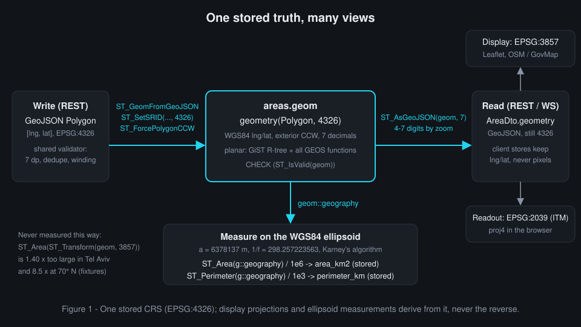
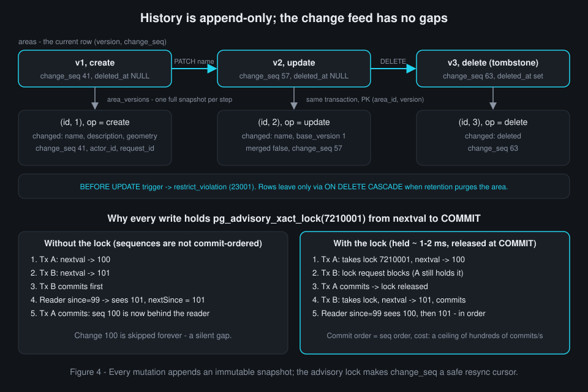

# Chapter 3 - The database: PostgreSQL, PostGIS and geodesy

**What you will learn**

- Why polygons are stored as `geometry(Polygon, 4326)` and what PostGIS adds to a relational table.
- How one partial GiST index answers "which polygons touch this viewport" for 10,000+ polygons.
- How area is measured on the WGS84 ellipsoid, and why Web Mercator gets it ~40 % wrong in Israel.
- How the schema enforces validity, immutable history, a gap-free change feed, soft delete and retention.
- How migrations keep the schema reproducible, and how every query is bounded in time.

**Why this matters**

ADR-0003 states the problem in one sentence: "We store user-drawn polygons, query them by map bounds at 10k+ polygons per region, return accurate areas in km² (accounting for Earth's curvature), keep an edit history, and support soft deletes with retention" (`docs/adr/0003-postgis-storage-model.md:7-8`). A plain SQL table cannot answer "which rows overlap this rectangle" without reading every row, and it knows nothing about the curved Earth. PostGIS solves both; this chapter is about using it without the classic traps: measuring in a map projection, forgetting the index predicate, trusting a sequence for ordering, letting history be rewritten.

> **Architecture vs. code.** The simplification pass of 2026-09-29 (`docs/superpowers/plans/2026-09-28-simplify-plan.md`) froze the database contract - "Contracts are frozen ... DB schema" (line 23), "The SQL is unchanged, including the purge watermark" (line 387) - and moved only TypeScript around the SQL: row mappers, the tests' hand-copied SQL (the EXPLAIN test now runs the production statement) and the retention `schedule.ts` helper (deleted; its batch cap now lives in `retention.service.ts`). DDL, SQL, indexes, lock keys and the watermark are the durable part.

---

## 3.1 From SQL to spatial SQL

**PostGIS** is a PostgreSQL extension that adds spatial column types, hundreds of `ST_*` functions and spatial indexing. Migration `0001_extensions.sql` installs it with `CREATE EXTENSION IF NOT EXISTS postgis`. Three terms:

- **SRID** (spatial reference identifier): which coordinate system a geometry uses. **EPSG:4326** is WGS84 longitude/latitude - GPS and GeoJSON, written as `[lng, lat]`.
- **`geometry`** is PostGIS's *planar* type (coordinates on a flat plane); **`geography`** follows the curved Earth for distances and areas.
- **CRS** (coordinate reference system): projection plus datum. Web maps draw in **EPSG:3857** (Web Mercator); the Israeli grid is **EPSG:2039** (ITM).

Snapland stores exactly one CRS and derives the others from it:



The column is `geometry`, not `geography`. ADR-0003: "Planar GiST on lng/lat is the fastest bbox index", while `geography` has a "slower bbox index and fewer functions (no GEOS validity or simplification without casts)" (`docs/adr/0003-postgis-storage-model.md:38,59`). **GEOS** is the C++ geometry library PostGIS calls for `ST_IsValid`, `ST_IsValidReason`, `ST_Intersects` and the other exact predicates. Where a true measurement is needed, one statement casts `geom::geography`.

`backend/migrations/0004_areas.sql:4-12`
```sql
CREATE TABLE areas (
  id               uuid                    PRIMARY KEY,
  name             text                    NOT NULL,
  description      text,
  geom             geometry(Polygon, 4326) NOT NULL,
  area_km2         double precision        NOT NULL,   -- ST_Area(geom::geography) / 1e6 (WGS84 ellipsoid)
  perimeter_km     double precision        NOT NULL,   -- ST_Perimeter(geom::geography) / 1e3
  vertex_count     integer                 NOT NULL,   -- ST_NPoints - ST_NRings (closing positions excluded)
  bbox_extent_deg  double precision        NOT NULL,   -- max(bbox width, bbox height) in degrees, for LOD culling
```

What to notice: the type binds the shape (polygons only) and the SRID, so a point or a 3857 geometry cannot be inserted by mistake. The four derived columns are computed at write time and stored, so a bbox read never recomputes an area. Reads emit `ST_AsGeoJSON(a.geom, 7)` (`backend/src/modules/areas/areas.repository.ts:31`); writes parse with `ST_ForcePolygonCCW(ST_SetSRID(ST_GeomFromGeoJSON($4::text), 4326))` (line 73).

## 3.2 The schema at a glance

| Table | Migration | Role |
|---|---|---|
| `users` | 0002 | accounts; unique index on `lower(username)` (line 17) |
| `sessions` | 0003 | refresh-token sessions (Chapter 4) |
| `areas` | 0004 | current state of every polygon, live or soft-deleted |
| `area_versions` | 0005 | immutable full snapshot per mutation; also the change feed |
| `audit_logs` | 0006 | append-only audit trail |
| `system_state` | 0007 | key/value: purge watermark, last retention run |
| four `audit_*` views | 0008 | ad-hoc analytics only (3.8) |

The rest of `areas` shows a habit worth copying: every rule that can be a constraint is one, so invalid states are unrepresentable and the DDL doubles as documentation.

`backend/migrations/0004_areas.sql:13-28`
```sql
  version          integer                 NOT NULL DEFAULT 1,
  change_seq       bigint                  NOT NULL,   -- change_seq of the latest mutation
  created_by       uuid                    NOT NULL REFERENCES users (id),
  updated_by       uuid                    NOT NULL REFERENCES users (id),
  created_at       timestamptz             NOT NULL DEFAULT now(),
  updated_at       timestamptz             NOT NULL DEFAULT now(),
  deleted_at       timestamptz,
  deleted_by       uuid                    REFERENCES users (id),
  CONSTRAINT areas_name_len_ck           CHECK (char_length(name) BETWEEN 1 AND 120),
  CONSTRAINT areas_description_len_ck    CHECK (description IS NULL OR char_length(description) <= 2000),
  CONSTRAINT areas_geom_valid_ck         CHECK (ST_IsValid(geom)),
  CONSTRAINT areas_geom_npoints_ck       CHECK (ST_NPoints(geom) <= 2000),
  CONSTRAINT areas_area_range_ck         CHECK (area_km2 >= 0.000001 AND area_km2 <= 100000),
  CONSTRAINT areas_version_ck            CHECK (version >= 1),
  CONSTRAINT areas_deleted_consistency_ck CHECK ((deleted_at IS NULL) = (deleted_by IS NULL))
);
```

What to notice: `version` and `change_seq` are the two counters of 3.7; `deleted_at`/`deleted_by` implement soft delete (3.8), and the last CHECK keeps them consistent. The limits (120, 2000, 100000) mirror `LIMITS` in `packages/shared/src/constants.ts`, so browser, server and database agree. Because geometry updates rewrite whole rows, the table lowers its autovacuum thresholds to 5 %/2 % (lines 35-36).

## 3.3 Area on the ellipsoid

The Earth is an **ellipsoid** (flattened at the poles); **WGS84** defines it as `a = 6378137 m`, `1/f = 298.257223563`. A **geodesic** is the shortest path on that surface, and geodesic area is bounded by geodesic edges. PostGIS computes it with Karney's algorithm; the browser preview uses the same algorithm through geographiclib and "they agree to ~1e-12 relative" (`packages/shared/src/geo/geodesic.ts:2-3`).

The trap is measuring in Web Mercator, the projection the map is drawn in. For the fixture `tel_aviv_1km_square` the ellipsoid area is `0.9987007904701233` km², the sphere gives `0.9964697347779274`, planar Mercator `1.3953115827629967` - `1.397×` too much; at 70° N it is `8.5×` (`docs/fixtures/geodesic-area-fixtures.json`). The insert never touches a projection:

`backend/src/modules/areas/areas.repository.ts:64-76`
```ts
  insert: sql(
    'areas.insert',
    `INSERT INTO areas (id, name, description, geom, area_km2, perimeter_km, vertex_count, bbox_extent_deg,
                        version, change_seq, created_by, updated_by)
     SELECT $1::uuid, $2::text, $3::text, s.g,
            ST_Area(s.g::geography) / 1e6, ST_Perimeter(s.g::geography) / 1e3,
            ST_NPoints(s.g) - ST_NRings(s.g),
            GREATEST(ST_XMax(s.g) - ST_XMin(s.g), ST_YMax(s.g) - ST_YMin(s.g)),
            1, nextval('area_change_seq'), $5::uuid, $5::uuid
       FROM (SELECT ST_ForcePolygonCCW(ST_SetSRID(ST_GeomFromGeoJSON($4::text), 4326)) AS g) AS s
     ON CONFLICT (id) DO NOTHING
     RETURNING id`,
  ),
```

What to notice: the subquery parses the GeoJSON once; `::geography` appears only where a measurement is needed; `vertex_count` excludes each ring's closing position; `bbox_extent_deg` (the larger bounding-box side) feeds culling; `ON CONFLICT (id) DO NOTHING` makes a client-supplied id idempotent - no row back means the id exists, and the service compares the request with version 1 (the `versionOneSnapshot` statement, lines 125-131). The update statement (lines 77-98) wraps each derived column in `COALESCE` so measurements are recomputed only when a new geometry arrives.

**Winding and precision.** RFC 7946 says exterior rings run counter-clockwise (CCW), holes clockwise. The shared validator normalises this (stage 11, `packages/shared/src/geo/normalize.ts:39-42`) and quantises coordinates to 7 decimals, ~ 1.1 cm (stage 5, lines 44-47); `ST_ForcePolygonCCW` enforces it again in SQL, so history diffs and idempotent-create comparisons see one canonical form. The migration test proves both at once:

`backend/test/integration/foundation/migrations.int.test.ts:146-160`
```ts
  it('stores a clockwise ring counter-clockwise with the exact spheroid area, and keeps versions immutable', async () => {
    const ring = [...(fixture('tel_aviv_1km_square').geojson.coordinates[0] ?? [])].reverse();
    const id = '4b0e1c2d-3e4f-4a5b-8c6d-7e8f9a0b1c2d';
    await client.query(AREAS_SQL.insert.text, [
      id,
      'Rabin Square',
      null,
      JSON.stringify({ type: 'Polygon', coordinates: [ring] }),
      userId,
    ]);
    const { rows } = await client.query<{ area_km2: number; ccw: boolean }>(
      'SELECT area_km2, ST_IsPolygonCCW(geom) AS ccw FROM areas WHERE id = $1',
      [id],
    );
    expect(rows[0]).toEqual({ area_km2: 0.9987007904701233, ccw: true });
```

What to notice: the ring is reversed (drawn clockwise), yet the stored polygon is CCW and its area equals the fixture's spheroid value to the last digit. The test runs the production statement itself (`AREAS_SQL.insert.text`), so it proves exactly the SQL the service executes.

## 3.4 Finding polygons in a viewport: the GiST index

An **index** lets the database find rows without reading the whole table. A B-tree orders scalars; it cannot order rectangles. A **GiST** index (Generalized Search Tree) over geometry is an **R-tree**: each polygon is represented by its **bounding box** (the smallest axis-aligned rectangle around it), and boxes are grouped into larger boxes level by level, so "which boxes overlap this rectangle?" costs O(log n + k) instead of a scan.


`backend/migrations/0004_areas.sql:30-36`
```sql
-- Hot path: bbox queries over live areas only.
CREATE INDEX areas_geom_live_gist ON areas USING gist (geom) WHERE deleted_at IS NULL;
-- Retention job: find soft-deleted rows older than N days.
CREATE INDEX areas_deleted_at_idx ON areas (deleted_at) WHERE deleted_at IS NOT NULL;

-- Updates rewrite geometry often: vacuum/analyze earlier than the 20%/10% defaults.
ALTER TABLE areas SET (autovacuum_vacuum_scale_factor = 0.05, autovacuum_analyze_scale_factor = 0.02);
```

A **partial index** has a `WHERE` clause and indexes only matching rows: **tombstones** (soft-deleted rows, `deleted_at` set - see 3.8) never enter the tree, and a tiny second partial B-tree serves the retention job. The price is a rule: the planner can use a partial index only when the query contains the same predicate, so every bbox statement carries `a.deleted_at IS NULL` literally (SPEC section 5.3, row 1).

`backend/src/modules/areas/areas.repository.ts:168-179`
```ts
       FROM (
         SELECT a.id, a.name, a.area_km2, a.version, a.change_seq, a.updated_at, a.created_by, a.updated_by, a.geom,
                a.vertex_count,
                sum(a.vertex_count) OVER w AS cum_positions, row_number() OVER w AS rn
           FROM areas a
          WHERE a.deleted_at IS NULL
            AND ST_Intersects(a.geom, ST_MakeEnvelope($1::float8, $2::float8, $3::float8, $4::float8, 4326))
            AND a.bbox_extent_deg >= $7::float8
            AND ($8::uuid IS NULL OR a.id > $8::uuid)
         WINDOW w AS (ORDER BY a.id ROWS UNBOUNDED PRECEDING)
          ORDER BY a.id
          LIMIT $9::int
```

What to notice: `ST_MakeEnvelope(west, south, east, north, 4326)` turns the bbox into a rectangle; `ST_Intersects` uses the index's box-overlap operator (`&&`) first, then the exact test. Then come the culling threshold (3.5) and the **keyset** cursor: instead of `OFFSET`, the next page starts after the last id seen, which walks `areas_pkey` in O(page) and is stable under concurrent writes. The window sum is the page budget (3.5).

Before the SQL runs, `parseBboxParam` enforces four finite numbers, `west < east`, latitudes within +/-85.05112878 and at most 8,192 Web-Mercator pixels of span at the zoom (`bbox-params.ts:41-49,51-56`), so an over-wide viewport - e.g. the 3°-wide bbox at zoom 14 in Try-it 3 - is a 400 `INVALID_BBOX`. A whole-world bbox is legal at zoom <= 5: the world is `256 · 2^z` px wide (`bboxSpanPx`, `shared/src/geo/tiles.ts:111-121`), i.e. <= 8,192 px there, and `AreaBboxQuerySchema` accepts zoom 0-22 (`schemas/areas.ts:86`); there it is the page budget of 3.5, not the span cap, that keeps the response bounded. `planBboxQuery` then snaps the bbox outward to the cache grid (`infra/cache/key-plan.ts:35-43`), which is why the echoed `queryBbox` is ⊇ the request (caching: Chapter 5).

The design is proven with data: the migration test inserts 12,000 synthetic areas in the Tel Aviv region plus 3,000 elsewhere, runs `ANALYZE`, and asserts that zoom-14 and zoom-16 viewports use `areas_geom_live_gist` with no `Seq Scan on areas` (`migrations.int.test.ts:218-253`). A larger zoom-14 window (1280x720 px, `telAvivZ14FullHd`, line 241) is held only to "no seq scan, <= 250 ms" (lines 255-265), and the zoom-12 whole-region query only to <= 250 ms with its plan logged (lines 267-271), because walking `areas_pkey` in id order and stopping at `LIMIT` is a legitimate plan there.

## 3.5 Level of detail: sending less at low zoom

At zoom 10 one pixel covers ~ 130-150 m (`pixelDeg(10)` = 0.00137°; ~ 153 m at the equator, ~ 130 m at Tel Aviv's latitude), so 1.1-cm precision and every vertex are wasted bytes. **Level of detail (LOD)** adapts geometry to the zoom: fewer vertices, fewer decimals, and no polygons too small to see. `ST_Simplify` is Douglas-Peucker: draw the chord from a ring's first to last vertex, keep the vertex farthest from it if it is farther than the tolerance, recurse on both halves, drop everything else.

`packages/shared/src/geo/lod.ts:22-31`
```ts
/** The LOD for an integer zoom 0-22 (the bbox query schema bounds it). */
export function lodForZoom(zoom: number): LevelOfDetail {
  if (zoom >= 17) return { simplifyDeg: 0, minExtentDeg: 0, digits: 7, simplified: false };
  const simplifyDeg = 0.5 * pixelDeg(zoom);
  if (zoom >= 15) return { simplifyDeg, minExtentDeg: 0, digits: 6, simplified: true };
  const minExtentDeg = 2 * pixelDeg(zoom);
  if (zoom === 14) return { simplifyDeg, minExtentDeg, digits: 6, simplified: true };
  if (zoom >= 10) return { simplifyDeg, minExtentDeg, digits: 5, simplified: true };
  return { simplifyDeg, minExtentDeg, digits: 4, simplified: true };
}
```

| Zoom | Simplify tolerance | Culling (`minExtentDeg`) | GeoJSON digits | `simplified` |
|---|---|---|---|---|
| 0-9 | `0.5 · pixelDeg(z)` | `2 · pixelDeg(z)` | 4 (~ 11 m) | true |
| 10-13 | `0.5 · pixelDeg(z)` | `2 · pixelDeg(z)` | 5 (~ 1.1 m) | true |
| 14 | `0.5 · pixelDeg(z)` | `2 · pixelDeg(z)` | 6 (~ 11 cm) | true |
| 15-16 | `0.5 · pixelDeg(z)` | 0 | 6 | true |
| >= 17 | 0 | 0 | 7 (full) | false |

(`pixelDeg(z) = 360 / (256 · 2^z)`, lines 18-20; the zoom itself is validated earlier, by the query schema, so the function has no range check; table from SPEC section 5.5.) The outer query applies all three knobs:

`backend/src/modules/areas/areas.repository.ts:162-167`
```ts
    `SELECT p.id, p.name, p.area_km2, p.version, p.change_seq, p.updated_at, p.created_by, p.updated_by,
            u.display_name AS updated_by_name, u.color AS updated_by_color,
            CASE WHEN p.rn = 1 OR p.cum_positions <= $10::int THEN
              ST_AsGeoJSON(CASE WHEN $5::float8 > 0 THEN ST_Simplify(p.geom, $5::float8, true) ELSE p.geom END, $6::int)
            END::json AS geometry,
            ARRAY[ST_XMin(p.geom), ST_YMin(p.geom), ST_XMax(p.geom), ST_YMax(p.geom)] AS bbox
```

What to notice: `ST_Simplify(…, true)` replaced `ST_SimplifyPreserveTopology`, which took 27 ms instead of 8 ms for a zoom-14 page of 1,001 areas (SPEC section 5.5). `::json` makes PostgreSQL hand back a parsed object, so the mapper needs no `JSON.parse`. That is safe only because list geometry is display-only (`simplified: true`); editing loads `GET /areas/:id` at full precision (`areas-bbox.int.test.ts:233-234`). Culled polygons are counted on the first page (`culledCount`, capped at 10,000) so the client can say "N small areas hidden", never silently.

**The page budget.** A polygon may hold 2,000 positions, so a 2,000-row page could mean four million coordinates; before v1.2 a world bbox materialised ~91 MB of GeoJSON (SPEC section 5.5). The running sum bounds a page at 150,000 stored positions (`LIMITS.bboxPagePositionBudget`); GeoJSON is generated only inside the budget, and the outer `WHERE p.rn = 1 OR p.cum_positions - p.vertex_count <= $10::int` (line 182) keeps one geometry-less sentinel row so `hasMore` stays true (`cutPage`, `page-budget.ts:20-32`). Note the `<=` (the comment at lines 157-158 explains it): with `<`, a page whose positions sum to exactly the budget would lose its sentinel and end without a continuation. The EXPLAIN test runs this very statement, `AREAS_SQL.findInBbox.text` (`migrations.int.test.ts:61`); before the simplification pass it ran a hand copy that had drifted to `<`. The cursor is opaque JSON bound to `(queryBbox, zoom, limit)` by a SHA-256 prefix (`cursor.ts:37-42`), so a replay against another query is a 400 `INVALID_CURSOR`.

**One snapshot per page.** The page and its `asOfChangeSeq` are read in one `REPEATABLE READ READ ONLY` transaction (`areas-query.service.ts:42,89-124`) that first disables parallel query with `set_config('max_parallel_workers_per_gather', '0', true)` (`areas.repository.ts:145-152`): parallel start-up dominated these short reads, which have a 20 ms budget (SPEC section 5.5).

## 3.6 Validation in depth: three lines of defence

"Prevent invalid shapes" is graded, so the same rule is checked three times by three engines.


Line 1 is the shared `validatePolygon` (stages 1-12 of SPEC section 9.2; Chapter 5 walks its algorithm). Line 2 asks PostGIS's **GEOS** engine (the C++ geometry library behind `ST_IsValid`, `ST_IsValidReason` and friends, 3.1) for a second opinion before any write:

`backend/src/modules/areas/areas.repository.ts:56-60`
```ts
  checkGeometry: sql(
    'areas.checkGeometry',
    `SELECT ST_IsValid(s.g) AS valid, ST_IsValidReason(s.g) AS reason, ST_Area(s.g::geography) / 1e6 AS area_km2
       FROM (SELECT ST_SetSRID(ST_GeomFromGeoJSON($1::text), 4326) AS g) AS s`,
  ),
```

The service runs it before the change-feed lock - the first statement of the create transaction (`areas.service.ts:140-142`), and on updates after the row lock and the merge plan (line 240, only when the geometry changed); `assertGeosAccepts` turns `valid = false` into 422 `GEOS_INVALID` with the reason, e.g. `Self-intersection[34.785 32.085]` for the bowtie fixture (`geometry-pipeline.ts:33-43,66-70`). The simplification review kept this pre-check (AR-8, plan line 58): it is the only path that returns a *reason with a location*; the CHECK fallback only names a constraint.

Line 3 is the DDL. A CHECK violation reaches node-postgres as `code = '23514'` - **SQLSTATE** is PostgreSQL's five-character error class (`23514` = check_violation) - and the service maps it instead of returning a 500:

`backend/src/modules/areas/geometry-pipeline.ts:90-102`
```ts
export function translateCheckViolation(error: unknown): AppError | null {
  if (pgField(error, 'code') !== CHECK_VIOLATION || pgField(error, 'table') !== 'areas') return null;
  const constraint = pgField(error, 'constraint') ?? 'unknown';
  const textField = TEXT_CONSTRAINTS[constraint];
  if (textField !== undefined) {
    return new ValidationError(`${textField} was rejected by the database.`, [
      { path: textField, code: 'check_violation', message: `violates ${constraint}` },
    ]);
  }
  return new InvalidGeometryError([
    { code: 'GEOS_INVALID', message: `PostgreSQL rejected the geometry (${constraint}).`, path: 'geometry' },
  ]);
}
```

What to notice: the mapping is keyed on SQLSTATE and table; a text constraint becomes a 400 naming the field, anything geometric a 422. The migration test proves line 3 alone: the `spike` fixture inserted through raw SQL fails with `{ code: '23514', constraint: 'areas_geom_valid_ck' }` (`migrations.int.test.ts:176-188`).

## 3.7 History that cannot be rewritten, and a feed without gaps

Optimistic concurrency (ADR-0005) needs a **base snapshot** to merge against: when two users edit from version 3, the server must know what version 3 contained. So every mutation increments `areas.version`, takes a new `change_seq`, and copies the whole row into `area_versions` in the same transaction.



`backend/migrations/0005_area_versions.sql:12-27`
```sql
  changed_fields  text[]                  NOT NULL,   -- subset of {name, description, geometry, deleted}
  merged          boolean                 NOT NULL DEFAULT false,
  base_version    integer,                            -- client's base version for updates (audit of merges)
  reverted_from   integer,                            -- set when the update restores the content of an older version
  change_seq      bigint                  NOT NULL,
  -- No ON DELETE action: users are never deleted (only disabled, section 6.2). An `ON DELETE SET NULL` could never fire anyway - the
  -- referential action runs as an UPDATE, which the immutability trigger below rejects (verified by QA on postgis 17-3.5).
  actor_id        uuid                    REFERENCES users (id),
  request_id      text,
  created_at      timestamptz             NOT NULL DEFAULT now(),
  PRIMARY KEY (area_id, version),
  CONSTRAINT area_versions_op_ck             CHECK (op IN ('create', 'update', 'delete', 'restore')),
  CONSTRAINT area_versions_changed_fields_ck CHECK (changed_fields <@ ARRAY['name', 'description', 'geometry', 'deleted']::text[])
);
-- Change feed: GET /areas/changes?since=N scans by change_seq.
CREATE UNIQUE INDEX area_versions_change_seq_uq ON area_versions (change_seq);
```

`backend/migrations/0005_area_versions.sql:29-36`
```sql
-- History is append-only: updates are rejected; deletes happen only via ON DELETE CASCADE from the retention purge.
CREATE FUNCTION area_versions_reject_update() RETURNS trigger LANGUAGE plpgsql AS $$
BEGIN
  RAISE EXCEPTION 'area_versions rows are immutable' USING ERRCODE = 'restrict_violation';
END
$$;
CREATE TRIGGER area_versions_immutable BEFORE UPDATE ON area_versions
  FOR EACH ROW EXECUTE FUNCTION area_versions_reject_update();
```

What to notice: the composite key `(area_id, version)` makes "version 3 of area X" a direct lookup; `changed_fields <@ ARRAY[...]` ("is contained by") restricts the labels; the trigger makes history append-only, with the cascade from `areas` (line 3) as the only exit - hence the `actor_id` comment: `SET NULL` would be an UPDATE the trigger rejects. The snapshot is one `INSERT … SELECT FROM areas` (`areas.repository.ts:117-124`), so it cannot disagree with the row it copies.

**The change feed.** Clients that lose their WebSocket resync with `GET /areas/changes?since=N`, a range scan on `area_versions_change_seq_uq`. The subtlety: `nextval` hands out numbers when called, not when committed. Transaction B can take 101 and commit before A commits 100, and a reader at `since=99` would advance past 100 forever (SPEC section 5.5). The fix is a **transaction-scoped advisory lock** - an application-defined lock PostgreSQL releases at COMMIT: `SELECT pg_advisory_xact_lock(7210001)` (`areas.repository.ts:27-28,61-62`) is taken right before `nextval` and held for the last ~1-2 ms of each write, so commit order equals sequence order. The cost, a global ceiling of "hundreds of commits/s", is documented with an upgrade path (README, *Known limitations*; ADR-0003). The feed's high-water mark has one more guard:

`backend/src/infra/directory/queries.ts:40-50`
```ts
  /**
   * Never below the purge watermark: after retention purged the areas holding the highest seqs, max(change_seq) can
   * drop below it, and a client using it as `since` would get 410 -> reload -> the same value -> 410 forever.
   */
  latestChangeSeq: sql(
    'directory.latestChangeSeq',
    `SELECT GREATEST(
              COALESCE((SELECT max(change_seq) FROM area_versions), 0),
              (SELECT (value)::text::bigint FROM system_state WHERE key = 'change_feed_purge_watermark')
            ) AS latest`,
  ),
```

**Serialised writers.** Writers of one area take a row lock (`SELECT id FROM areas WHERE id = $1::uuid FOR UPDATE`, line 53), always before the advisory lock, so they cannot deadlock (`areas.service.ts:7`). The row is then re-read in a *second* statement, for a reason worth an interview answer:

`backend/src/modules/areas/areas.repository.ts:305-317`
```ts
  /**
   * Locks the row, then reads it with its user references in a NEW statement. A single locking SELECT that also joins
   * `users` loses the row under READ COMMITTED when the writer it waited for changed `updated_by`: PostgreSQL re-checks
   * the new row version (EvalPlanQual) against the users rows it read before the wait, the join condition fails and
   * the query returns nothing, which turned a 409 VERSION_CONFLICT into a 404 (found by T9). The second statement
   * takes a fresh snapshot, so it returns exactly the version committed by the previous lock holder.
   */
  async lockById(q: DbTx, id: string): Promise<AreaDto | null> {
    const locked = await q.query<{ id: string }>(AREAS_SQL.lockById, [id]);
    if (locked.length === 0) return null;
    const [row] = await q.query<AreaRow>(AREAS_SQL.findById, [id]);
    return row === undefined ? null : toAreaDto(row);
  },
```

## 3.8 Soft delete, retention and the audit trail

A **soft delete** marks a row instead of removing it, so it can be restored and its history stays readable:

`backend/src/modules/areas/areas.repository.ts:100-106`
```ts
  softDelete: sql(
    'areas.softDelete',
    `UPDATE areas
        SET deleted_at = now(), deleted_by = $2::uuid,
            version = version + 1, change_seq = nextval('area_change_seq'), updated_by = $2::uuid, updated_at = now()
      WHERE id = $1::uuid`,
  ),
```

The tombstone leaves the partial GiST index and enters `areas_deleted_at_idx`; `GET /areas/:id` hides it unless `includeDeleted=true`, while its history stays readable (`areas-query.service.ts:132-137`; history: `196-199`). `restore` (lines 107-114) is the inverse; both append a version with `changed_fields = {deleted}`.


**Retention** hard-deletes tombstones after `AREA_PURGE_AFTER_DAYS` (30), audit rows after 90 days and dead sessions after 7 (`.env.example:95-97`). Both replicas run the timer, so the job must be a singleton without a coordinator:

`backend/src/modules/retention/retention.repository.ts:16-31`
```ts
const PURGE_AREAS = sql(
  'retention.purgeAreas',
  `WITH doomed AS (
     SELECT id FROM areas
     WHERE deleted_at < now() - make_interval(days => $1)
     ORDER BY deleted_at
     LIMIT $2
     FOR UPDATE SKIP LOCKED
   ), wm AS (
     SELECT COALESCE(max(v.change_seq), 0) AS m FROM area_versions v JOIN doomed d ON d.id = v.area_id
   ), upd AS (
     UPDATE system_state SET value = to_jsonb(GREATEST((value)::text::bigint, (SELECT m FROM wm))), updated_at = now()
     WHERE key = 'change_feed_purge_watermark'
   )
   DELETE FROM areas a USING doomed d WHERE a.id = d.id RETURNING a.id`,
);
```

What to notice: one statement picks a batch (`FOR UPDATE SKIP LOCKED`: a row a writer holds is skipped, not awaited), raises the **purge watermark** to the highest `change_seq` it removes, and deletes; versions vanish through the cascade. A `since` below the watermark gets 410 `CHANGE_FEED_EXPIRED` with `{ watermark }` (`areas-query.service.ts:169-183`; `retention.int.test.ts:239-276`).

Only one instance may run: `pg_try_advisory_lock(7210002)` is a **session-level** lock (it lives as long as the connection, unlike the transaction-scoped lock of 3.7), taken on a dedicated pooled client and *tried*, so a busy lock means "skip this run":

`backend/src/modules/retention/run-lock.ts:50-58`
```ts
    if (!locked) return { acquired: false };
    try {
      return { acquired: true, value: await task() };
    } finally {
      destroyReason = await unlock(session, key, logger);
    }
  } finally {
    session.release(destroyReason);
  }
```

What to notice: the unlock runs in `finally`; if it fails, the client is released with an error, which destroys the connection - otherwise a leaked session lock would block every future run. Each batch is its own transaction with `timeoutMs: settings.statementTimeoutMs` - `RETENTION_STATEMENT_TIMEOUT_MS`, 60 s by default (`retention.service.ts:159-161`; `backend/src/config/env.ts:219`) - since a cascading delete would exceed the pool's 5 s statement timeout; area batches are capped at 200 (`MAX_AREA_BATCH_SIZE`, `retention.service.ts:20-21`).

**The audit trail** is append-only and time-ordered, which calls for a different index. A **BRIN** (Block Range INdex) stores only the min/max `occurred_at` per range of disk blocks: tiny, and ideal for time-window scans and retention deletes when physical order follows time.

`backend/migrations/0006_audit_logs.sql:24-29`
```sql
-- Append-only, time-correlated: BRIN is tiny and ideal for time-range scans and retention deletes. autosummarize: new block ranges
-- are summarized by autovacuum as they fill (a BRIN created on an empty table otherwise leaves new ranges unsummarized - every
-- query reads them lossily - until a manual VACUUM).
CREATE INDEX audit_logs_occurred_at_brin ON audit_logs USING brin (occurred_at) WITH (autosummarize = on);
CREATE INDEX audit_logs_actor_idx  ON audit_logs (actor_id, occurred_at DESC) WHERE actor_id IS NOT NULL;
CREATE INDEX audit_logs_action_idx ON audit_logs (action, occurred_at DESC);
```

Three details: `actor_id` has no foreign key, so audit rows outlive user changes (line 7); `details` is bounded on its JSON text because jsonb's binary form of 4 KB of text can exceed 24 KB (lines 20-21); writes are one `INSERT … SELECT * FROM unnest(...)` per batch (`infra/audit/buffered-writer.ts:29-35`). The 0008 views are for ad-hoc SQL only: a filter on `date_trunc('hour', occurred_at)` cannot use an index, so the admin endpoint aggregates the base table with `WHERE occurred_at >= $1 AND occurred_at < $2` (`admin.repository.ts:91-98`; 35 ms vs 2.5 ms, SPEC section 5.2).

## 3.9 Migrations: the schema as code

A **migration** is a versioned script that moves the schema from one state to the next; applying them in order to an empty database reproduces the schema exactly. Snapland uses node-pg-migrate 9 with plain SQL files named `NNNN_snake_case.sql`, each with an Up and a Down section:

`backend/migrations/0001_extensions.sql:1-8`
```sql
-- Up Migration
CREATE EXTENSION IF NOT EXISTS postgis;

-- Down Migration
-- Intentionally a no-op: the postgis/postgis image pre-installs postgis in the default database together with
-- postgis_topology and postgis_tiger_geocoder, which depend on it (verified: DROP EXTENSION postgis fails there).
-- Dropping it with CASCADE would destroy objects this project does not own.
SELECT 1;
```

`backend/src/infra/db/migrations.ts:51-59`
```ts
  const ran = await runner({
    databaseUrl: options.databaseUrl,
    dir: options.dir ?? MIGRATIONS_DIR,
    direction: options.direction,
    count: options.count ?? (options.direction === 'up' ? Number.POSITIVE_INFINITY : 1),
    migrationsTable: MIGRATIONS_TABLE,
    checkOrder: true,
    singleTransaction: false,
    advisoryLockMode: 'wait',
```

What to notice: applied names land in `pgmigrations`; `checkOrder` refuses an out-of-order file; each file gets its own transaction; `advisoryLockMode: 'wait'` serialises concurrent runners (two replicas, or CI). The rules (SPEC section 5.4): immutable once merged; every Up has a working Down; no data-dependent branching; a data migration is one set-based statement with an exact inverse (0009 remaps the palette slot-for-slot with a `VALUES` table, reversed in its Down); indexes on populated tables use `CREATE INDEX CONCURRENTLY`. Migration 0010's Down restores the stricter username CHECK and "fails (and changes nothing) while email usernames exist ... silently deleting accounts is not an option" (`0010_email_usernames.sql:3-4`).

The backend never migrates at boot: a one-shot compose service runs `node dist/scripts/migrate.js up` once `postgres` is healthy (`docker-compose.yml:137-147`), both backends depend on it completing (lines 161-163), and `/health/ready` fails while any migration file in the image is missing from `pgmigrations` (`health.service.ts:44-51`, `migrations.ts:78-89`). The integration test runs the real CLI up -> `down --count 10` -> up -> up and expects the last run to apply nothing (`migrations.int.test.ts:86-114`).

## 3.10 Every query is bounded

One `pg.Pool` per instance reuses connections (`backend/src/infra/db/pool.ts:28-42`); 2 x `DB_POOL_MAX` 20 stays under compose's `max_connections` 100 (`docker-compose.yml:56`). Every I/O has two timers: the server cancels a statement after 5 s (SQLSTATE 57014 -> 503) and the client gives up 1 s later; if the client fires first the connection's state is unknown, so it is destroyed, not reused (`tx.ts:33-39`). `idle_in_transaction_session_timeout` (10 s) stops a stuck transaction from holding row locks. `withTransaction(fn, { timeoutMs })` raises both timers locally via `SELECT set_config('statement_timeout', $1, true)`, because `SET` cannot take bind parameters (`tx.ts:14-18`; `db-pool.int.test.ts:82-96`). Each statement is a `NamedSql {name, text}`: the name is the server-side prepared statement and the metrics label, and `sql()` throws at import time if one name gets two texts (`types.ts:39-58`). Chapter 4 covers how these errors reach HTTP.

---

## Try it yourself

Prerequisites: the stack is up (`docker compose up -d --build`) and you registered a user at http://localhost:5173. SQL shell: `docker compose exec postgres psql -U snapland -d snapland` (compose defaults; port 55432 from the host also works).

**1. Look inside a polygon.** In the app, draw and name a polygon in central Tel Aviv (around Rabin Square, 34.78 E 32.08 N) that is at least ~1 km across, like the fixture square - exercise 3 needs it to survive low-zoom culling - then:

```sql
SELECT name, version, change_seq, vertex_count, ST_NPoints(geom) AS npoints,
       ST_SRID(geom) AS srid, ST_IsPolygonCCW(geom) AS ccw, area_km2,
       ST_Area(geom::geography, false) / 1e6           AS sphere_km2,
       ST_Area(ST_Transform(geom, 3857)) / 1e6          AS mercator_km2_wrong,
       ST_Area(ST_Transform(geom, 3857)) / 1e6 / area_km2 AS overestimate
  FROM areas ORDER BY created_at DESC LIMIT 1;
```

Expected: `srid = 4326`, `ccw = t` even if you drew clockwise, `npoints = vertex_count + 1` (one ring), `sphere_km2` about 0.2 % below `area_km2`, `overestimate` between 1.35 and 1.42 (1.397 for the fixture square). Rename the area twice in the app, then `SELECT version, op, changed_fields, base_version, merged, change_seq FROM area_versions WHERE area_id = (SELECT id FROM areas ORDER BY created_at DESC LIMIT 1) ORDER BY version;` - expect version 1 `create {name,description,geometry}`, then `update {name}` rows with `base_version` set. Finally `UPDATE area_versions SET name = 'x' WHERE version = 1 AND area_id = (SELECT id FROM areas ORDER BY created_at DESC LIMIT 1);` must fail with `area_versions rows are immutable` (SQLSTATE 23001; the migration test asserts the same code, `migrations.int.test.ts:171-173`).

**2. Watch the index work.** `backend/src/scripts/seed.ts` loads a realistic dataset (see `docs/BENCHMARKS.md`); for a quick look, create synthetic rows the way the migration test does:

```sql
INSERT INTO areas (id, name, geom, area_km2, perimeter_km, vertex_count, bbox_extent_deg, change_seq, created_by, updated_by)
SELECT gen_random_uuid(), 'synthetic ' || i, g, ST_Area(g::geography) / 1e6, ST_Perimeter(g::geography) / 1e3, 4,
       GREATEST(ST_XMax(g) - ST_XMin(g), ST_YMax(g) - ST_YMin(g)), nextval('area_change_seq'),
       (SELECT id FROM users LIMIT 1), (SELECT id FROM users LIMIT 1)
FROM (SELECT i, ST_MakeEnvelope(x, y, x + s, y + s, 4326) AS g
      FROM (SELECT i, 34.7 + random() * 0.24 AS x, 31.95 + random() * 0.24 AS y, 0.0002 + random() * 0.008 AS s
            FROM generate_series(1, 12000) AS i) AS p) AS q;
ANALYZE areas;
EXPLAIN (ANALYZE, BUFFERS)
SELECT a.id FROM areas a
 WHERE a.deleted_at IS NULL
   AND ST_Intersects(a.geom, ST_MakeEnvelope(34.76, 32.07, 34.79, 32.085, 4326))
 ORDER BY a.id LIMIT 2001;
```

Expected: `Bitmap Index Scan on areas_geom_live_gist` (or `Index Scan using`) and no `Seq Scan on areas`. Remove `a.deleted_at IS NULL` and EXPLAIN again: the partial index disappears. Clean up with `DELETE FROM areas WHERE name LIKE 'synthetic %';`. Direct inserts bypass the app's cache invalidation: at zoom <= 16 the map shows them only after cached pages expire (`CACHE_BBOX_TTL_S`, 120 s); at zoom >= 17, where the cache is bypassed (`CACHE.bypassZoom`, `infra/cache/key-plan.ts:19`; `cacheLevelForZoom`, lines 29-33; Chapter 5), they appear on the next viewport fetch.

**3. Break it on purpose, then ask PostGIS why.** Log in through nginx and copy `accessToken` from the response:

```bash
curl -s http://localhost:5173/api/v1/auth/login -H 'content-type: application/json' \
  -d '{"username":"<your user>","password":"<your password>"}'
curl -s -X POST http://localhost:5173/api/v1/areas -H "authorization: Bearer <accessToken>" -H 'content-type: application/json' \
  -d '{"name":"Bowtie","geometry":{"type":"Polygon","coordinates":[[[34.78,32.08],[34.79,32.09],[34.79,32.08],[34.78,32.09],[34.78,32.08]]]}}'
curl -s "http://localhost:5173/api/v1/areas?bbox=34.76,32.07,34.79,32.085&zoom=13&limit=5" -H "authorization: Bearer <accessToken>"
curl -s "http://localhost:5173/api/v1/areas?bbox=34.76,32.07,34.79,32.085&zoom=17&limit=5" -H "authorization: Bearer <accessToken>"
curl -s "http://localhost:5173/api/v1/areas?bbox=33,31,36,33&zoom=14" -H "authorization: Bearer <accessToken>"
```

Expected: the POST is `422` with `code: "INVALID_GEOMETRY"` and `errors[0].code: "SELF_INTERSECTION"` (line 1). In psql, `SELECT ST_IsValidReason(ST_GeomFromGeoJSON('{"type":"Polygon","coordinates":[[[34.78,32.08],[34.79,32.09],[34.79,32.08],[34.78,32.09],[34.78,32.08]]]}'));` returns `Self-intersection[34.785 32.085]` (line 2). The zoom-13 page has `simplified: true, precision: 5, minExtentDeg: 0.00034332275390625` (~ 35 m) and <= 5 decimals per coordinate of your exercise-1 polygon; zoom 17 has `simplified: false, precision: 7, minExtentDeg: 0` and `queryBbox` equal to your bbox; the 3°-wide bbox at zoom 14 is `400 INVALID_BBOX`. Now repeat the first request with `zoom=10` (`minExtentDeg: 0.00274658203125`, ~ 260-300 m): a >= 1 km polygon is still listed, but if your polygon is smaller than `minExtentDeg` the page is `items: []` with `culledCount: 1` - that is the culling of 3.5 at work (draw a second polygon ~100 m across to see both outcomes on one page). The proofs: `npm run test:integration -w @snapland/backend -- test/integration/foundation/migrations` prints the EXPLAIN plans.

## Self-check

1. Why is the column `geometry(Polygon, 4326)` rather than `geography`, and where does the ellipsoid come in?
2. The fixture `tel_aviv_1km_square` has an ellipsoid area of 0.9987 km². What does `ST_Area(ST_Transform(geom, 3857)) / 1e6` return, roughly, and why is that wrong?
3. What must every bbox statement contain for the planner to use `areas_geom_live_gist`, and what happens if it is missing?
4. Why does every write hold `pg_advisory_xact_lock(7210001)` between `nextval` and COMMIT?
5. A client calls `GET /areas/changes?since=N` after retention purged the newest changes. What happens, and why is `latestChangeSeq` defined with `GREATEST`?

<details>
<summary>Answers</summary>

1. `geometry` is planar: its GiST index over lng/lat boxes is the fastest bbox index and every GEOS function is available (ADR-0003). Measurements cast per statement - `ST_Area(geom::geography) / 1e6`, `ST_Perimeter(geom::geography) / 1e3` - on the WGS84 ellipsoid at write time, and are stored (`areas.repository.ts:69`).
2. About 1.395 km², a 1.397x overestimate (`area_km2_webmercator_planar_WRONG`). Web Mercator preserves angles, not areas, and its distortion grows with latitude (8.5x at 70° N); the app never measures in a projection (SPEC section 8.5).
3. The literal predicate `a.deleted_at IS NULL`, because the index is partial (`0004_areas.sql:31`); without it the planner picks another plan. The EXPLAIN test asserts no `Seq Scan on areas`.
4. Sequence values are assigned at `nextval` time, not at commit, so seq 101 can commit before 100 and a reader at `since=99` would skip 100 forever. Holding the lock from `nextval` to COMMIT makes commit order equal `change_seq` order (SPEC section 5.5; the cost is in the README's *Known limitations*).
5. `N < change_feed_purge_watermark` -> 410 `CHANGE_FEED_EXPIRED` with the watermark, and the client reloads (`areas-query.service.ts:169-183`). After the newest changes are purged, `max(change_seq)` can be below the watermark; returning it would make the reload's `asOfChangeSeq` stale and the client would loop 410 -> reload -> 410. `GREATEST(max(change_seq), watermark)` prevents that (`directory/queries.ts:40-50`; `retention.int.test.ts:239-276`).

</details>

## Further reading

- `docs/adr/0003-postgis-storage-model.md` - the storage decision and rejected alternatives on one page.
- `docs/SPEC.md` section 5.1 (line 370), section 5.2 schema (377), section 5.3 indexes (402), section 5.4 migrations (418), section 5.5 queries and LOD (422), section 5.6 retention (451), section 5.7 pooling (463), section 8.5 area (772), section 8.7 precision (918), section 9.2-9.3 validation (950); the README's *Known limitations* (which SPEC section 13 now points to).
- `backend/migrations/0001` ... `0010`, in order; `backend/src/modules/areas/areas.repository.ts` (every statement of the module); `backend/src/modules/retention/`; `backend/src/infra/db/`.
- Proofs: `backend/test/integration/foundation/migrations.int.test.ts`, `db-pool.int.test.ts`, `platform/retention.int.test.ts`, `areas/areas-bbox.int.test.ts`.
- `docs/fixtures/geodesic-area-fixtures.json` - spheroid, sphere and (wrong) Mercator areas.
- Chapter 5 continues with the shared validator, merge and caching; Chapter 9 with compose, nginx and the migrate one-shot.
