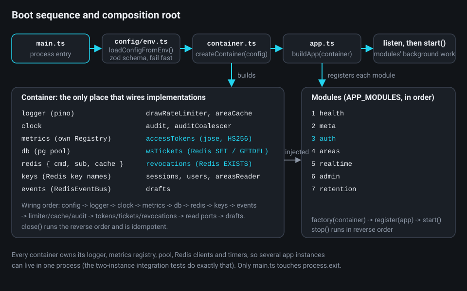
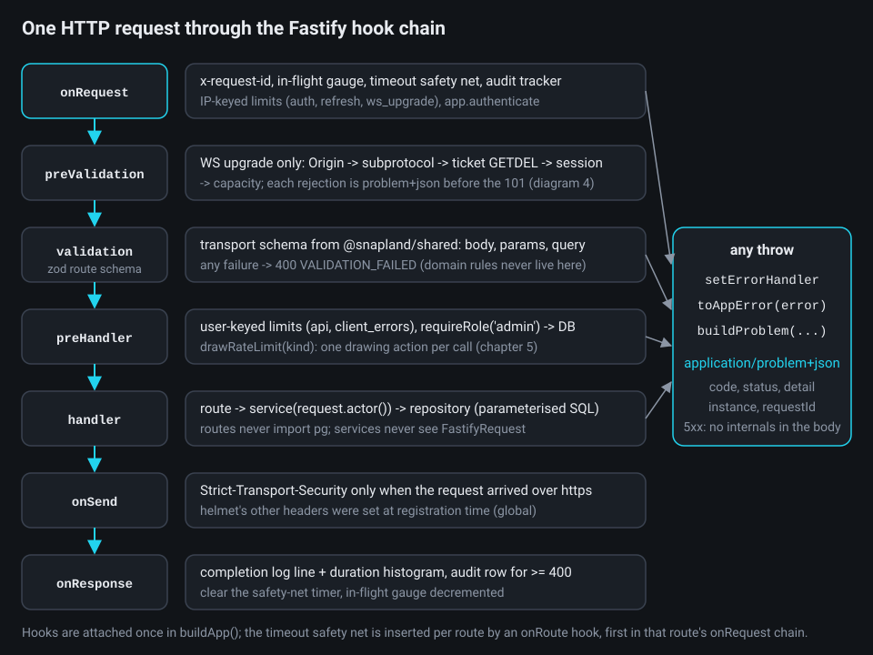
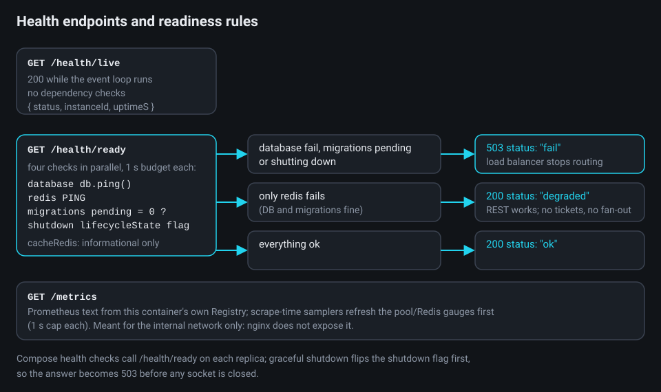
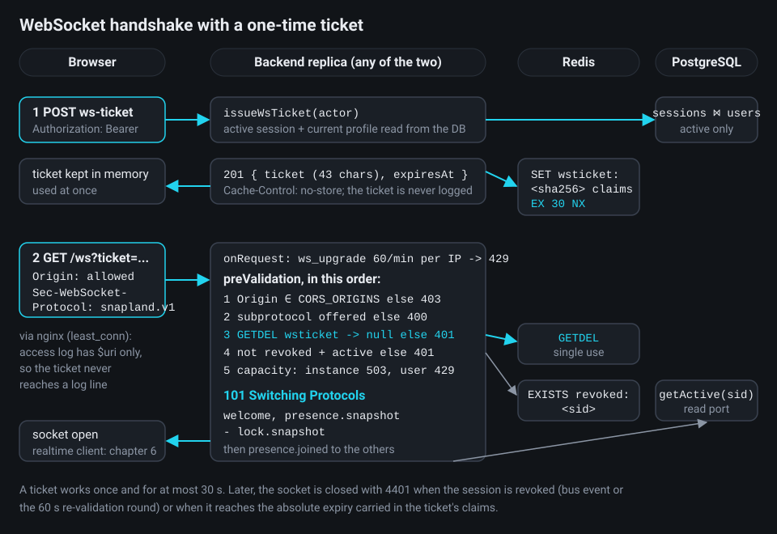

# Chapter 4 - The backend: Fastify foundation, security and authentication

**What you will learn**

- How the backend boots: `main.ts` -> validated config -> a *composition root* -> `buildApp()` -> modules.
- How a request flows through Fastify *hooks*: request ids, timeouts, rate limits, security headers, logging, metrics.
- How every failure becomes one JSON shape (RFC 9457 "problem details") without leaking internals.
- How sign-in works: argon2id passwords, a 15-minute JWT, a rotating `HttpOnly` refresh cookie with reuse detection, immediate revocation, lockouts.
- How a browser reaches the WebSocket with a one-time ticket instead of a token in the URL.

**Why this matters**

Two backend replicas sit behind nginx (chapter 2). Both must accept any user's request or socket, refuse the same bad inputs, and fail in a way the frontend understands. This chapter is the "boring" part that makes areas and realtime safe: how the process starts, how a request is shaped, how a user proves who they are, and what happens when something goes wrong.

The code is described as it exists after the simplification pass (`docs/superpowers/plans/2026-09-28-simplify-plan.md`), which finished on 2026-09-29: every excerpt and line number below was re-checked against that final tree, and where the pass moved or removed code I say so. Throughout, I mark which ideas are *architecture* (they stay) and which are just today's file layout.

---

## 1. Three files that start everything

**The problem.** A server needs a database pool, Redis clients, a logger, a metrics registry, a JWT signer and more. If every module created its own, you could never run two instances in one test process, swap Redis for a fake, or close things in order.

**The idea.** One file, the *composition root*, builds every shared component once and hands them out: *dependency injection* without a framework. Functions receive what they need as arguments; nothing reaches for a global.



`main.ts` is the only file allowed to install process-wide handlers or call `process.exit`:

```ts
// backend/src/main.ts:22-45
async function main(): Promise<void> {
  const config = loadConfigFromEnv();
  const container = createContainer(config);
  const { logger } = container;
  try {
    if (!(await waitUntilReady(container.redis, REDIS_STARTUP_WAIT_MS))) {
      logger.warn(
        'Redis is not reachable yet; starting degraded (limiter fallback, cache bypass, no realtime fan-out)',
      );
    }
    const snap = await buildApp(container);
    installShutdownHandlers({ snap, container, logger, graceMs: config.SHUTDOWN_GRACE_MS });
    await snap.app.listen({ host: config.HOST, port: config.PORT });
    await snap.start();
    logger.info(
      { host: config.HOST, port: config.PORT, instanceId: container.instanceId },
      'Snapland backend started',
    );
  } catch (error) {
    // pino flushes its stdout destination on exit, so the line is never lost.
    logger.fatal({ err: error }, 'startup failed');
    process.exit(EXIT_STARTUP_FAILED);
  }
}
```

**What to notice.** Redis being down is a *warning*, not a crash: the process starts "degraded". Any failure after the container exists is logged as `fatal` and the process exits with code 1; nothing is torn down first, because the exit itself releases whatever a half-started process holds open (listening socket, Redis clients, pool), and compose restarts the container (`main.ts:6-7`). A failure *before* the logger exists (invalid configuration, container construction) rejects `main()` and goes through `reportEarlyFailure` (`main.ts:47-60`): one JSON line written to stderr with `writeSync`, then the same exit. The mirror image of startup, `gracefulShutdown` in `infra/shutdown.ts:13-18`, unwinds in reverse (readiness 503 -> sockets closed 1001 -> HTTP drained -> modules stopped -> container closed).

Every feature module implements one small contract:

```ts
// backend/src/modules/types.ts:10-20
export interface AppModule {
  readonly name: string;
  /** Register routes/hooks. Called once, before listen(). */
  register(app: AppInstance): Promise<void>;
  /** Start background work (timers, subscriptions). Called after listen(). */
  start?(): Promise<void>;
  /** Stop background work. Called in reverse registration order during shutdown. */
  stop?(): Promise<void>;
}

export type ModuleFactory = (container: Container) => AppModule;
```

`buildApp` wires the cross-cutting pieces in a fixed order, then registers the modules:

```ts
// backend/src/app.ts:155-187
export async function buildApp(container: Container, options: BuildAppOptions = {}): Promise<SnaplandApp> {
  const app = createFastify(container);
  // JSON only (section 6): without Fastify's default text/plain parser, any other media type is a 415.
  app.removeContentTypeParser('text/plain');
  app.setValidatorCompiler(validatorCompiler);
  app.setSerializerCompiler(serializerCompiler);

  const authenticate = createAuthenticate({
    accessTokens: container.accessTokens,
    revocations: container.revocations,
  });
  registerRequestContext(app);
  registerRequestLog(app, container.metrics);
  registerProblemHandlers(app);
  decorate(app, container, authenticate);

  await registerSecurity(app, container.config.CORS_ORIGINS);
  await app.register(cookie);
  registerRequestTimeout(app, container.config.REQUEST_TIMEOUT_MS);
  await registerRateLimiting(app, {
    config: container.config,
    redis: container.redis.cmd,
    keys: container.keys,
    metrics: container.metrics,
    auditCoalescer: container.auditCoalescer,
    authenticate,
  });
  registerAuditHook(app, { audit: container.audit, tracker: container.auditTracker });
  await registerDocs(app, container.config.DOCS_ENABLED);
  await registerWebSocket(app, container);

  const modules = (options.modules ?? APP_MODULES).map((factory) => factory(container));
  for (const module of modules) await module.register(app);
```

**What to notice.** `validatorCompiler` / `serializerCompiler` come from `fastify-type-provider-zod`: the same zod schemas from `packages/shared` validate requests, serialise responses and generate the OpenAPI document at `/docs` (ADR-0002). `decorate()` adds `app.authenticate`, `app.requireRole('admin')` and `app.drawRateLimit(kind)` so routes opt in by name.

> **Architecture vs. code.** The composition root, the module contract and the fixed order are the architecture. The simplification pass rewrote `main.ts` (the separate `.env` loader, `parseConfig` and the old `abortStartup` teardown are gone; `loadConfigFromEnv()` does the loading and validation) and removed indirection inside `container.ts` (INFRA-4), whose `createContainer` is now synchronous; the shape stayed.

---

## 2. Configuration that fails fast

**The problem.** A wrong environment variable discovered by a crashed request at 3 a.m. is the worst way to learn about it.

**The idea.** `config/env.ts` is the *only* module that reads `process.env`: an ESLint `no-restricted-properties` rule bans it in all product source and exempts exactly this file (`eslint.config.js:120-125`). A zod schema parses every variable at boot; an invalid configuration stops the process with one message listing every problem. `AppConfig` keys are the env names, so `.env.example`, code and tests share one vocabulary (a unit test, `env.test.ts:139-147`, checks that `CONFIG_KEYS` lists every backend variable of `.env.example`).

```ts
// backend/src/config/env.ts:172-180
    JWT_SECRET: z.string().min(32, 'must be at least 32 characters (run node scripts/setup-env.mjs)'),
    JWT_ISSUER: z.string().min(1).default('snapland'),
    JWT_AUDIENCE: z.string().min(1).default('snapland-api'),
    ACCESS_TOKEN_TTL_S: integer(60, 3600).default(900),
    REFRESH_TOKEN_TTL_S: integer(2, 31_536_000).default(1_209_600),
    SESSION_ABSOLUTE_TTL_S: integer(2, 31_536_000).default(2_592_000),
    COOKIE_SECURE: boolean.default(true),

    WS_TICKET_TTL_S: integer(5, 120).default(30),
```

Cross-field rules live in a `superRefine`; two protect production:

```ts
// backend/src/config/env.ts:235-240
    if (env.NODE_ENV === 'production' && env.JWT_SECRET.includes(JWT_SECRET_PLACEHOLDER)) {
      fail('JWT_SECRET', 'must not be the .env.example placeholder in production');
    }
    if (env.REFRESH_TOKEN_TTL_S > env.SESSION_ABSOLUTE_TTL_S) {
      fail('REFRESH_TOKEN_TTL_S', 'must not exceed SESSION_ABSOLUTE_TTL_S');
    }
```

"Fail fast" is one function. It never returns a half-valid object: either every variable parsed, or a `ConfigError` carries the whole list, which `reportEarlyFailure` (section 1) prints before the exit:

```ts
// backend/src/config/env.ts:277-286
/** Validates a configuration source; throws `ConfigError` listing every invalid variable. */
export function loadConfig(source: Readonly<Record<string, unknown>>): AppConfig {
  const result = EnvSchema.safeParse(source);
  if (!result.success) {
    throw new ConfigError(
      result.error.issues.map((issue) => `${issue.path.map(String).join('.') || '(root)'}: ${issue.message}`),
    );
  }
  return result.data;
}
```

`loadConfigFromEnv()` (`env.ts:291-295`) first loads `<repo>/.env` with Node's `process.loadEnvFile` when the file exists (variables already in the environment win), then calls `loadConfig(process.env)`. In the Docker image there is no `.env`; compose sets the variables.

**What to notice.** Most numbers in this chapter come from here: the 900 s access token, the 14-day sliding refresh and 30-day absolute cap, the 30 s ticket, and the generic rate limits of section 7 (`AUTH_RATE_LIMIT_MAX` 10, `REFRESH_RATE_LIMIT_MAX` 60, `API_RATE_LIMIT_MAX` 300 and `WS_UPGRADE_RATE_LIMIT_MAX` 60 per minute, `env.ts:189,206-208`). The login-lockout limits are *not* here: 5 and 50 failures per 900 s are constants in `modules/auth/login-failures.ts:26-27` (section 9.5), as SPEC section 11.3 says ("The login-failure limits are code constants"). The simplification pass removed the old `LOGIN_FAILURES_*` variables as unused (plan item core:P5), and D-7 removed `TILE_RATE_LIMIT_MAX` with the tile proxy.

---

## 3. One request through the hook chain

**The problem.** Authentication, rate limiting, timeouts, logging and auditing must run on every request, in a fixed order, without each route repeating them.

**The idea.** Fastify exposes *hooks*: named points in a request's life (`onRequest`, `preValidation`, `preHandler`, `onSend`, `onResponse`). Snapland attaches its cross-cutting behaviour as hooks once, in `buildApp`.



### 3.1 Request identity

Every response echoes an `x-request-id`. A client may send its own for correlation, but only if it looks like an id:

```ts
// backend/src/infra/http/request-context.ts:28-32
/** Fastify `genReqId`: a valid inbound id is kept for correlation, anything else is replaced. */
export function generateRequestId(raw: IncomingMessage): string {
  const inbound = raw.headers[REQUEST_ID_HEADER];
  return typeof inbound === 'string' && REQUEST_ID_PATTERN.test(inbound) ? inbound : randomUUID();
}
```

The same file builds the `ActorContext` that services receive *instead of* the Fastify request. The User-Agent is sanitised and cut to 512 code points and the IP validated with `net.isIP`, so an over-long header can neither fail a login nor poison an audit batch:

```ts
// backend/src/infra/http/request-context.ts:51-60
export function buildActorContext(request: FastifyRequest): ActorContext {
  return {
    userId: request.auth?.userId ?? null,
    sessionId: request.auth?.sessionId ?? null,
    role: request.auth?.role ?? null,
    requestId: request.id,
    ip: normalizeIp(request.ip),
    userAgent: normalizeUserAgent(request.headers['user-agent']),
  };
}
```

### 3.2 The route safety net

Node's own `requestTimeout` (15 s) covers a slow *body*. A handler that hangs afterwards needs a second net: `503 REQUEST_TIMEOUT` after `REQUEST_TIMEOUT_MS` (10 s) if nothing was sent yet.

```ts
// backend/src/infra/http/request-timeout.ts:21-36
  const requestTimeoutSafetyNet: onRequestHookHandler = function requestTimeoutSafetyNet(
    request,
    reply,
    done,
  ) {
    const timer = setTimeout(() => {
      timers.delete(request);
      if (reply.sent || reply.raw.headersSent) return;
      request.problemCode = 'REQUEST_TIMEOUT';
      request.log.warn({ timeoutMs }, 'request timed out; answering 503');
      sendProblem(reply, buildProblem(new RequestTimeoutError(), request));
    }, timeoutMs);
    timer.unref();
    timers.set(request, timer);
    done();
  };
```

**What to notice.** `timer.unref()` means a pending timer never keeps the process alive. An `onRoute` hook (lines 46-56) inserts the net *first* in each route's `onRequest` chain, so slow authentication counts toward the deadline. `/ws` and `/metrics` are exempt.

### 3.3 The completion line and HTTP metrics

Fastify's default request logging is off (`app.ts:82`); one line per request carries the *route pattern*, never the raw URL (a WebSocket ticket lives in a query string):

```ts
// backend/src/infra/http/request-log.ts:31-50
  app.addHook('onResponse', (request: FastifyRequest, reply: FastifyReply, done) => {
    finish(request);
    const route = routeOf(request);
    const statusCode = reply.statusCode;
    metrics.httpRequestDuration.observe(
      { method: request.method, route, status_code: String(statusCode) },
      reply.elapsedTime / 1000,
    );
    const line = {
      method: request.method,
      route,
      statusCode,
      responseTimeMs: Math.round(reply.elapsedTime * 100) / 100,
      ...(request.auth === null ? {} : { userId: request.auth.userId }),
      ...request.logContext,
    };
    if (QUIET_ROUTES.has(route)) request.log.debug(line, 'request completed');
    else request.log.info(line, 'request completed');
    done();
  });
```

---

## 4. Errors: one shape for every failure

**The problem.** A frontend cannot handle twenty error formats, and a 500 must never print SQL or a stack trace to a stranger.

**The idea.** Every error response (4xx and 5xx) is `application/problem+json` (RFC 9457 "problem details"): a stable `code`, an HTTP `status`, a human `detail`, the path (`instance`) and the `requestId`. (A bodiless `304 Not Modified` for a matching `If-None-Match`, as in `areas.routes.ts:60`, is not an error and carries no document.) Services throw typed errors; one handler converts them. The status of every code is fixed in the shared catalog, so client and server never disagree:

```ts
// packages/shared/src/errors.ts:12-19
  UNAUTHENTICATED: { status: 401, title: 'Authentication required' },
  TOKEN_INVALID: { status: 401, title: 'Invalid token' },
  TOKEN_EXPIRED: { status: 401, title: 'Token expired' },
  INVALID_CREDENTIALS: { status: 401, title: 'Invalid credentials' },
  REFRESH_TOKEN_INVALID: { status: 401, title: 'Invalid refresh token' },
  REFRESH_TOKEN_REUSED: { status: 401, title: 'Refresh token reused' },
  SESSION_REVOKED: { status: 401, title: 'Session revoked' },
  ACCOUNT_DISABLED: { status: 403, title: 'Account disabled' },
```

Each code carries its status and its problem title in one `ERRORS` object. The base class looks the status up there:

```ts
// backend/src/infra/http/errors.ts:16-32
export class AppError extends Error {
  readonly code: ErrorCode;
  readonly status: number;
  readonly detail: string;
  readonly extensions: Readonly<Record<string, unknown>>;
  readonly headers: Readonly<Record<string, string>>;

  constructor(code: ErrorCode, detail: string, options: AppErrorOptions = {}) {
    super(detail, options.cause === undefined ? undefined : { cause: options.cause });
    this.name = new.target.name;
    this.code = code;
    this.status = ERRORS[code].status;
    this.detail = detail;
    this.extensions = options.extensions ?? {};
    this.headers = options.headers ?? {};
  }
}
```

The single error handler builds the document. Look at the `detail` line:

```ts
// backend/src/infra/http/problem.ts:123-141
export function buildProblem(appError: AppError, request: FastifyRequest): ProblemResponse {
  const status = appError.status;
  const code: ErrorCode = appError.code;
  const detail = status >= 500 ? `An unexpected error occurred. Reference: ${request.id}` : appError.detail;
  return {
    status,
    headers: { ...appError.headers },
    body: {
      type: problemType(code),
      title: ERRORS[code].title,
      status: ERRORS[code].status,
      code,
      detail,
      instance: instanceOf(request),
      requestId: request.id,
      ...appError.extensions,
    },
  };
}
```

**What to notice.** `toAppError()` (problem.ts:62-113) also *classifies* driver errors: a PostgreSQL statement timeout (`57014`) becomes `REQUEST_TIMEOUT`, connection loss `DEPENDENCY_UNAVAILABLE` with `Retry-After: 5`, and a zod failure is *always* 400. Domain rules stay out of transport schemas so they can return their own 422/428 (chapter 5).

---

## 5. Logging without secrets

**The problem.** Logs are read by many people and shipped to many places. A token in a log line is a breach.

**The idea.** `pino` writes one JSON object per line to stdout, with `instanceId`, `service` and `version` on every line; a redaction list censors dangerous paths before they are written:

```ts
// backend/src/infra/logger.ts:14-24
/** Paths censored in every log line (section 3.6). */
const REDACT_PATHS = [
  'req.headers.authorization',
  'req.headers.cookie',
  'res.headers["set-cookie"]',
  '*.password',
  '*.accessToken',
  '*.refreshToken',
  '*.ticket',
  '*.passwordHash',
];
```

`LOG_PRETTY` (human-readable output) is forced off in production by a `.transform` at the end of the config schema (`env.ts:251-252`), because `pino-pretty` is a dev-only dependency absent from the Docker image.

---

## 6. Security headers, CORS and the client IP

**The problem.** A browser sends your API cookies from another website (*CSRF*, cross-site request forgery) and runs scripts injected into a page (*XSS*). Behind a reverse proxy, the "client IP" is the proxy's unless the server trusts a forwarded header, which a client could forge.

*CORS* (cross-origin resource sharing) is the browser rule that a page on origin A may read responses from origin B only if B says so. Snapland allows an exact list of origins (never `*`) and sends *no* CORS headers to anyone else:

```ts
// backend/src/infra/http/security.ts:36-47
  const allowlist = new Set(allowedOrigins);
  await app.register(cors, {
    // Requests without an Origin (same-origin navigations, curl) are not CORS requests: no headers either way.
    origin: (origin, callback) => {
      callback(null, origin !== undefined && allowlist.has(origin));
    },
    credentials: true,
    methods: CORS_METHODS,
    allowedHeaders: CORS_ALLOWED_HEADERS,
    exposedHeaders: CORS_EXPOSED_HEADERS,
    maxAge: CORS_MAX_AGE_S,
  });
```

*Helmet* sets defensive headers (a JSON API's content security policy is simply `default-src 'none'`). *HSTS* ("always use HTTPS") is sent only when the request really arrived over HTTPS:

```ts
// backend/src/infra/http/security.ts:49-63
  await app.register(helmet, {
    global: true,
    contentSecurityPolicy: {
      useDefaults: false,
      directives: { defaultSrc: ["'none'"], frameAncestors: ["'none'"] },
    },
    hsts: false,
    referrerPolicy: { policy: 'no-referrer' },
    crossOriginResourcePolicy: { policy: 'same-origin' },
  });

  app.addHook('onSend', (request, reply, payload, done) => {
    if (request.protocol === 'https') reply.header('Strict-Transport-Security', HSTS_VALUE);
    done(null, payload);
  });
```

*Trust proxy*: per-IP limits and audit IPs depend on `request.ip`. In compose, nginx is the only edge and *overwrites* `X-Forwarded-For` with the real peer address, so the backends run with `TRUST_PROXY=1` (one trusted hop; `infra/http/trust-proxy.ts` turns the number into the function Fastify 5 requires). Local development without nginx uses `TRUST_PROXY=loopback`.

---

## 7. Generic rate limits

**The problem.** "50 drawing actions per minute per user" is a *domain* limit (chapter 5). Login, refresh and the WebSocket upgrade also need plain throttles, shared by both replicas.

**The idea.** `@fastify/rate-limit` with a Redis store and five *scopes*, each a separate bucket keyed by user id after authentication, else by the proxy-resolved IP:

```ts
// backend/src/infra/http/rate-limits.ts:29-35
/** Scopes keyed by the authenticated user run after `authenticate` (preHandler); IP scopes run first (onRequest). */
const USER_KEYED: ReadonlySet<RateLimitScope> = new Set(['api', 'client_errors']);

/** `config: { rateLimit: rateLimitRoute('auth') }` on a route. */
export function rateLimitRoute(scope: RateLimitScope): RateLimitRouteConfig {
  return { scope };
}
```

A *fixed window* counter in Redis is one *atomic Lua script*: Redis runs a script as a single command, so no other client can read or write the counter between the `INCR` and the `PEXPIRE` (a plain `INCR` followed by a separate `PEXPIRE` could be interleaved, or leave a key with no expiry if the process died in between). The script increments, and sets the expiry on the first hit:

```lua
-- backend/src/infra/http/rate-limits.ts:69-79 (the FIXED_WINDOW script)
local current = redis.call('INCR', KEYS[1])
if current == 1 then
  redis.call('PEXPIRE', KEYS[1], ARGV[1])
  return {current, tonumber(ARGV[1])}
end
local ttl = redis.call('PTTL', KEYS[1])
if ttl < 0 then
  redis.call('PEXPIRE', KEYS[1], ARGV[1])
  ttl = tonumber(ARGV[1])
end
return {current, ttl}
```

An `onRoute` hook refuses to *build* the app if an `/api/v1` route has no limit at all:

```ts
// backend/src/infra/http/rate-limits.ts:154-174
function expandRouteLimits(app: FastifyInstance, deps: RateLimitDeps): void {
  app.addHook('onRoute', (route) => {
    const configured = route.config?.rateLimit;
    if (configured === false) return;
    let scope = scopeOf(configured);
    if (scope === null && configured === undefined && route.url.startsWith(API_PREFIX)) {
      if (!isAuthenticatedRoute(route, deps.authenticate)) throw unlimitedApiRouteError(route);
      scope = 'api';
    }
    if (scope === null) return;
    const expanded: RateLimitRouteConfig = {
      ...(typeof configured === 'object' ? configured : {}),
      scope,
      max: maxForScope(scope, deps.config),
      timeWindow: WINDOW_MS,
      hook: USER_KEYED.has(scope) ? 'preHandler' : 'onRequest',
      keyGenerator: (request) => clientKey(request, scope),
    };
    route.config = { ...route.config, rateLimit: expanded };
  });
}
```

**What to notice.** A route with `onRequest: [app.authenticate]` gets the `api` scope (300/min per user) for free. `skipOnError: true` (`rate-limits.ts:207`) means that with Redis down requests are *allowed* (fail-open): an outage of the counters must not become an outage of the app. Every 429 is counted and audited through a coalescer, so a flood writes one audit row per 10 s window instead of thousands.

| Scope | Default | Keyed by | Where |
|---|---|---|---|
| `auth` | 10 / min | IP | register, login |
| `refresh` | 60 / min | IP | `/auth/refresh` |
| `api` | 300 / min | user | routes with `app.authenticate` |
| `client_errors` | 30 / min | user | `POST /client-errors` |
| `ws_upgrade` | 60 / min | IP | `GET /ws` (before the ticket) |

(A sixth scope, `tiles`, served the GovMap 2025 tile proxy until decision D-7 deleted both. The drawing limit and the login lockout are separate mechanisms: chapter 5 and section 9.5.)

---

## 8. Health and metrics

**The problem.** nginx and compose need to know when a replica may receive traffic; an operator needs numbers.



*Liveness* ("is the process alive?") never checks a dependency. *Readiness* ("may I route traffic here?") runs four parallel checks, each on a 1 s budget. The status rule is the point:

```ts
// backend/src/modules/health/health.service.ts:69-72
  const shutdown = { status: deps.isShuttingDown() ? ('fail' as const) : ('ok' as const) };
  const failed = database.status === 'fail' || migrations.status === 'fail' || shutdown.status === 'fail';
  return {
    status: failed ? 'fail' : redis.status === 'fail' ? 'degraded' : 'ok',
```

**What to notice.** Only a Redis failure *degrades* (HTTP 200, `"degraded"`): the replica can still serve REST. A failing database, pending migrations or a shutting-down instance *fail* readiness (503), so the load balancer stops routing there.

Metrics use a `prom-client` `Registry` created *per container*, never the global one, which is what lets two app instances share one test process:

```ts
// backend/src/modules/health/health.routes.ts:48-54
  if (container.config.METRICS_ENABLED) {
    app.get('/metrics', { schema: { hide: true } }, async (_request, reply) => {
      await container.metrics.sample();
      const body = await container.metrics.registry.metrics();
      return reply.type(container.metrics.registry.contentType).send(body);
    });
  }
```

`sample()` runs *scrape-time samplers* (pool counts, Redis memory, queue depths), each abandoned after 1 s, so a slow dependency cannot stall a scrape.

---

## 9. Authentication: who are you?

Every decision below is recorded in ADR-0006.


### 9.1 Passwords: argon2id and the dummy hash

*argon2id* is a deliberately slow, memory-hard hash: guessing becomes expensive for an attacker while the server pays tens of milliseconds per check. The parameters are the OWASP baseline:

```ts
// backend/src/modules/auth/passwords.ts:14-18
export const ARGON2_PARAMS = {
  memoryCost: 19_456,
  timeCost: 2,
  parallelism: 1,
} as const satisfies Argon2Options;
```

If a login for an *unknown* username answered faster than a wrong password for a known one, an attacker could enumerate accounts by timing. So the service always pays for one verification (`verifyDummy` checks the password against a pre-computed hash of a discarded password, `passwords.ts:20-22`):

```ts
// backend/src/modules/auth/auth.service.ts:283-297
    let stored: UserCredentials | null;
    let matched: boolean;
    try {
      stored = await findUserCredentials(db, username);
      // An unknown username still pays for one full verification (the dummy hash), so timing does not reveal
      // whether the account exists.
      matched =
        stored === null
          ? await passwords.verifyDummy(password)
          : await passwords.verify(stored.passwordHash, password);
    } catch (error) {
      await giveBackAttempt();
      throw error;
    }
    if (stored === null || !matched) this.#rejectInvalidCredentials(actor, stored?.user.id ?? null);
```

Both failures return the byte-identical `401 INVALID_CREDENTIALS` body. A disabled account is checked only *after* the password matched (`auth.service.ts:298-301`), so nobody learns that an account exists but is disabled.

### 9.2 The access token: a short-lived JWT

A *JWT* (JSON Web Token) is a signed JSON payload the server verifies without a database lookup. Snapland signs it with *HS256* (an HMAC with `JWT_SECRET`) for 15 minutes; the SPA holds it in memory only, never in `localStorage`. Verification pins algorithm, issuer and audience and tolerates 5 s of clock skew:

```ts
// backend/src/infra/auth/access-tokens.ts:67-81
    async verify(token) {
      let payload: unknown;
      try {
        ({ payload } = await jwtVerify(token, key, {
          algorithms: [ALGORITHM],
          issuer: options.issuer,
          audience: options.audience,
          clockTolerance: CLOCK_TOLERANCE_S,
          currentDate: new Date(options.clock.now()),
        }));
      } catch (error) {
        if (error instanceof joseErrors.JWTExpired)
          throw new UnauthorizedError('TOKEN_EXPIRED', 'The access token has expired.');
        throw new UnauthorizedError('TOKEN_INVALID', 'The access token is invalid.');
      }
```

`TOKEN_EXPIRED` and `TOKEN_INVALID` differ on purpose: the frontend refreshes on the first and gives up on the second (chapter 8). The `app.authenticate` hook's second check makes logout *immediate* even though the JWT is still cryptographically valid:

```ts
// backend/src/infra/auth/authenticate.ts:18-33
  return async function authenticate(request) {
    try {
      const match = BEARER.exec(request.headers.authorization ?? '');
      const token = match?.[1];
      if (token === undefined)
        throw new UnauthorizedError('UNAUTHENTICATED', 'A Bearer access token is required.');
      const claims = await deps.accessTokens.verify(token);
      if (await deps.revocations.isRevoked(claims.sessionId)) {
        throw new UnauthorizedError('SESSION_REVOKED', 'The session has been revoked.');
      }
      request.auth = claims;
    } catch (error) {
      request.authFailed = true;
      throw error;
    }
  };
```

`isRevoked` is a Redis `EXISTS` on `snap:revoked:<sessionId>`, written with the access-token TTL. It *fails open* (returns `false` with a throttled warning) when Redis is down: a revoked token then works for its remaining minutes at worst, a trade-off ADR-0006 accepts.

### 9.3 The refresh token: an HttpOnly cookie

A 15-minute token needs renewing. The *refresh token* is 32 random bytes in a cookie the browser attaches automatically but JavaScript can never read:

```ts
// backend/src/modules/auth/refresh-tokens.ts:40-48
export function refreshCookieOptions(secure: boolean, maxAgeS?: number): CookieSerializeOptions {
  return {
    httpOnly: true,
    secure,
    sameSite: 'strict',
    path: REFRESH_COOKIE_PATH,
    ...(maxAgeS === undefined ? {} : { maxAge: maxAgeS }),
  };
}
```

**What to notice.** `httpOnly` defeats XSS theft. `sameSite: 'strict'` means a request started from another site never carries the cookie: the CSRF defence for `/auth/refresh` and `/auth/logout`. `path` keeps it off every other request. `secure` is `COOKIE_SECURE` (`auth/index.ts:50`), and it stays `true` on the compose stack even though nginx listens on plain port 80: browsers treat `http://localhost` as a *secure context*, so a `Secure` cookie is still stored and sent there (SPEC section 11.3; `.env.example` sets `COOKIE_SECURE=true` and `docker-compose.yml` does not override it). `false` exists only for a backend run by hand on a non-localhost plain-HTTP host; `refresh-rotation.int.test.ts:243-245` covers that case and checks the other attributes survive.

The database stores only the SHA-256 of the token, plus the *previous* token's hash and when the rotation happened:

```sql
-- backend/migrations/0003_sessions.sql:2-15
CREATE TABLE sessions (
  id                   uuid        PRIMARY KEY DEFAULT gen_random_uuid(),
  user_id              uuid        NOT NULL REFERENCES users (id) ON DELETE CASCADE,
  refresh_token_hash   bytea       NOT NULL,           -- SHA-256 of the current refresh token
  previous_token_hash  bytea,                          -- SHA-256 of the token it replaced (reuse detection)
  rotated_at           timestamptz,
  user_agent           text,
  ip                   inet,
  created_at           timestamptz NOT NULL DEFAULT now(),
  last_used_at         timestamptz NOT NULL DEFAULT now(),
  expires_at           timestamptz NOT NULL,           -- sliding: now() + REFRESH_TOKEN_TTL_S on each refresh
  absolute_expires_at  timestamptz NOT NULL,           -- created_at + SESSION_ABSOLUTE_TTL_S, never extended
  revoked_at           timestamptz,
  revoked_reason       text,
```

### 9.4 Rotation and reuse detection

**The problem.** A stolen refresh cookie could mint access tokens forever. Rotation limits that: every refresh issues a *new* token and remembers the old one. If the old one ever shows up again, someone has a copy.

The decision is a pure function of the locked row and the database clock, unit-tested without I/O:

```ts
// backend/src/modules/auth/rotation.ts:50-66
export function decideRotation(
  candidate: RefreshCandidate,
  now: Date,
  refreshTtlS: number,
): RotationDecision {
  if (candidate.revoked) return { kind: 'reject', code: 'SESSION_REVOKED', reason: 'revoked' };
  if (candidate.userDisabled) return { kind: 'reject', code: 'SESSION_REVOKED', reason: 'disabled' };

  if (candidate.matched === 'previous') {
    return isWithinRaceWindow(candidate.rotatedAt, now)
      ? { kind: 'reject', code: 'REFRESH_TOKEN_INVALID', reason: 'race' }
      : { kind: 'reuse' };
  }

  if (isExpired(candidate, now)) return { kind: 'reject', code: 'REFRESH_TOKEN_INVALID', reason: 'expired' };
  return { kind: 'rotate', expiresAt: slidingExpiry(now, refreshTtlS, candidate.absoluteExpiresAt) };
}
```

**What to notice.** The 10 s *race window*: two tabs may refresh at once, and the loser presents a token rotated a moment ago. That is not theft, so it gets a plain 401 and nothing is revoked. A previous token presented *later* than 10 s is a replay: the session is revoked (`token_reuse`), its sockets closed, and the client receives `REFRESH_TOKEN_REUSED`. The transaction locks the row so two refreshes of one token cannot both rotate:

```ts
// backend/src/modules/auth/sessions.repository.ts:46-64
  findForRefresh: sql(
    'auth.findSessionForRefresh',
    `SELECT s.id, s.expires_at, s.absolute_expires_at, s.rotated_at, s.revoked_at,
            s.refresh_token_hash = $1 AS matched_current, u.disabled_at, ${OWNER_COLUMNS}, now() AS db_now
       FROM sessions s JOIN users u ON u.id = s.user_id
      WHERE s.refresh_token_hash = $1 OR s.previous_token_hash = $1
        FOR UPDATE OF s`,
  ),
  rotate: sql(
    'auth.rotateSession',
    `UPDATE sessions s
        SET previous_token_hash = s.refresh_token_hash,
            refresh_token_hash = $2,
            rotated_at = now(),
            last_used_at = now(),
            expires_at = $3
      WHERE s.id = $1::uuid
     RETURNING ${SESSION_VIEW}`,
  ),
```

`now() AS db_now` in `findForRefresh` is deliberate: session timestamps were written with the *database* clock, so the decision compares against that clock, not Node's (`decideRotation(row, row.dbNow, …)`, `auth.service.ts:340`). The comment above the query (`sessions.repository.ts:40-45`) explains the other half: under `READ COMMITTED`, a concurrent rotation of the same token makes this `SELECT … FOR UPDATE` wait and re-evaluate against the committed row, which is why the loser of a tab race sees a fresh rotation rather than a reuse. (The simplification pass dropped `db_now` from `rotate`; `FOR UPDATE` and the race window were on its keep-list.) The route itself is thin:

```ts
// backend/src/modules/auth/auth.routes.ts:101-105
    async (request, reply) => {
      const issued = await auth.refresh(request.cookies[REFRESH_COOKIE_NAME], request.actor());
      setRefreshCookie(reply, issued);
      return reply.code(200).send(issued.body);
    },
```

### 9.5 Login lockout: counting before verifying

**The problem.** 10 login requests per minute per IP does not stop a patient attacker guessing one user's password, or a distributed one guessing from many IPs.

**The idea.** Two Redis counters in a 15-minute window: 5 failures per (username, IP) and 50 per username across all IPs, so one attacker cannot lock a victim out by name alone. The three numbers are constants in the module itself, not configuration:

```ts
// backend/src/modules/auth/login-failures.ts:26-27
export const LOGIN_FAILURE_WINDOW_S = 900;
export const LOGIN_FAILURE_LIMITS = { perUserIp: 5, perUser: 50 } as const;
```

They are passed to the script as `ARGV` (`login-failures.ts:199-203`). The attempt is counted *before* the password check, in the same atomic Lua script as the lockout test, so (as in section 7) nothing can run between the check and the increment:

```lua
-- backend/src/modules/auth/login-failures.ts:41-49 (ADMIT_LOGIN_ATTEMPT_LUA)
local userIp = tonumber(redis.call('GET', KEYS[1]) or '0')
local user = tonumber(redis.call('GET', KEYS[2]) or '0')
if userIp < tonumber(ARGV[1]) and user < tonumber(ARGV[2]) then
  redis.call('INCR', KEYS[1])
  redis.call('EXPIRE', KEYS[1], ARGV[3], 'NX')
  redis.call('INCR', KEYS[2])
  redis.call('EXPIRE', KEYS[2], ARGV[3], 'NX')
end
return {userIp, redis.call('PTTL', KEYS[1]), user, redis.call('PTTL', KEYS[2])}
```

The script replies with both counts *as they were before this attempt* plus the remaining window of each key. Node then applies the same `count < limit` rule to that reply (`toAdmission` -> `evaluateLockout`, `login-failures.ts:101-136`): if a counter had already reached its limit the script did not count and the answer is `locked` (with the longer `retryAfterMs`); otherwise the attempt was counted and the answer is `{ locked: false, reserved: true }`. `EXPIRE … NX` sets the 900 s window only on the first counted attempt, so a lockout is never extended by further tries.

Why count first? If you checked, then verified (~50 ms), then incremented, a burst of parallel attempts would all pass the check before any was recorded. The login flow then *settles* the reserved attempt:

```ts
// backend/src/modules/auth/auth.service.ts:120-139
  async login(input: LoginRequest, actor: ActorContext): Promise<IssuedSession> {
    // Folded once: this one value keys the failure counters AND the account lookup (see username.ts).
    const username = canonicalUsername(input.username);
    if (username === null) {
      // A name outside the (public) registration pattern cannot belong to any account: it gets the unknown-user
      // treatment - one dummy verification and the same 401 body - without touching the counters or the database.
      await this.#deps.passwords.verifyDummy(input.password);
      this.#rejectInvalidCredentials(actor, null);
    }

    // The attempt is counted atomically with the lockout check, before the password is verified, so a burst of
    // parallel attempts cannot all pass a check that runs before any of them is recorded (section 6.2 limits).
    const admission = await this.#deps.loginFailures.admit(username, actor.ip);
    if (admission.locked) this.#rejectLockedLogin(actor, admission);
    const user = await this.#authenticate(username, input.password, actor, admission.reserved);

    await this.#deps.loginFailures.reset(username, actor.ip);
    const started = await this.#startSession(this.#deps.db, user.id, actor);
    // The account was disabled between the password check and the session insert (see insertSessionForEnabledUser).
    if (started === null) this.#rejectDisabled(user.id, actor);
```

**What to notice.** A wrong password leaves the count in place; a success clears both counters (`reset`, line 136); a disabled account or a database/hashing error gives the attempt back (`giveBackAttempt` -> `release`, `auth.service.ts:281-282, 294, 299`), because it was not a guess, and only a *reserved* attempt is ever released. `canonicalUsername` folds the name *once*, so the counter key and the SQL lookup can never disagree. Redis failures fail open here too: `admit` answers `{ locked: false, reserved: false }` (`login-failures.ts:205-208`).

### 9.6 Revocation: the database decides, Redis makes it fast

Logout, "revoke that session", token reuse and the operator's `user-admin disable` all end the same way; the order of side effects is the architecture:

```ts
// backend/src/modules/auth/revocation-notifier.ts:44-59
    async notify({ sessionId, userId, reason }) {
      let marked = true;
      try {
        await revocations.markRevoked(sessionId);
      } catch (error) {
        marked = false;
        logger.warn(
          { err: error, sessionId, reason },
          'could not mark the session revoked in Redis; the database revocation stands and its access token ' +
            'stays usable until it expires',
        );
      }
      // publish() never throws: it logs and counts its own failures.
      const published = await events.publish('sessions', { kind: 'revoked', sessionId, userId, reason });
      return { sessionId, marked, published };
    },
```

1. The `sessions` row is updated first, in a transaction. That is authoritative.
2. `snap:revoked:<sid>` is set in Redis so `authenticate` rejects the still-valid JWT at once.
3. A `sessions` bus event tells every gateway to close that session's sockets with code 4401 (chapter 6).

Steps 2 and 3 are best effort: with Redis down, the JWT lives at most 15 more minutes and the gateway's 60 s re-validation loop, which reads the database, catches the socket.

Roles follow the same rule: `requireRole('admin')` reads the *current* role from the database on every admin request, so granting or revoking admin (CLI only; no HTTP path exists) takes effect on the next request:

```ts
// backend/src/infra/http/require-role.ts:11-20
export function createRequireRole(users: UserDirectory): (role: 'admin') => preHandlerAsyncHookHandler {
  return (role) =>
    async function requireRole(request) {
      if (request.auth === null) throw new UnauthorizedError('UNAUTHENTICATED', 'Authentication required.');
      const profile = (await users.getProfiles([request.auth.userId])).get(request.auth.userId);
      if (profile === undefined || profile.disabled || profile.role !== role) {
        throw new ForbiddenError('FORBIDDEN', 'This endpoint requires the admin role.');
      }
    };
}
```

---

## 10. WebSocket tickets: getting onto the socket safely

**The problem.** A browser's `WebSocket` constructor cannot set an `Authorization` header. An access token in the URL leaks into nginx logs, proxy logs and browser history, and stays valid for 15 minutes.

**The idea.** Trade the access token for a *ticket*: 32 random bytes that work once and for at most 30 s. The URL leak becomes harmless.



Redis stores only the SHA-256 of the ticket, mapped to the claims the gateway needs, so the upgrade path does no user lookup:

```ts
// backend/src/infra/auth/ws-tickets.ts:56-80
    async issue(claims) {
      const ticket = randomBytes(32).toString('base64url');
      const stored = await redis.cmd.set(
        keys.wsTicket(hashTicket(ticket)),
        JSON.stringify(claims),
        'EX',
        ttlS,
        'NX',
      );
      // 256 random bits cannot collide in practice; NX only guarantees that a ticket is never silently replaced.
      if (stored !== 'OK') throw new Error('WebSocket ticket collision');
      return { ticket, expiresAt: new Date(clock.now() + ttlS * 1000) };
    },

    async consume(ticket) {
      if (!TICKET_PATTERN.test(ticket)) return null;
      const raw = await redis.cmd.getdel(keys.wsTicket(hashTicket(ticket)));
      if (raw === null) return null;
      try {
        const parsed = ClaimsSchema.safeParse(JSON.parse(raw));
        return parsed.success ? parsed.data : null;
      } catch {
        return null;
      }
    },
```

**What to notice.** `GETDEL` is atomic: two upgrades racing with the same ticket cannot both win. The claims are read from the database *at issue time* by `SessionsService.issueWsTicket` (`sessions.service.ts:84-117`), which answers `401 SESSION_REVOKED` for a session that is no longer active (`#activeSession`, lines 120-125) and `503 SERVICE_UNAVAILABLE` with `Retry-After`, not a 500, when Redis cannot store the ticket (lines 99-111).

On the gateway, everything happens in the `/ws` route's `preValidation` hook (`gateway.ts:101-106`), *before* the upgrade, so every rejection is a normal problem+json answer. The hook delegates to one function in `upgrade-auth.ts`:

```ts
// backend/src/modules/realtime/upgrade-auth.ts:69-87
  try {
    checkOrigin(request.headers.origin, deps.config.CORS_ORIGINS);
    checkSubprotocol(request.headers['sec-websocket-protocol']);
    const claims = await consumeTicket(request.query, deps.wsTickets);
    context.userId = claims.userId;
    context.sessionId = claims.sessionId;
    await checkSession(claims, deps);
    const reservation = reserve(claims.userId, deps);
    // Returns the slot if the upgrade never completes (aborted handshake); a no-op once the socket is registered.
    request.raw.socket.once('close', () => {
      reservation.release();
    });
    return { claims, reservation };
  } catch (error) {
    if (!(error instanceof UpgradeRejection)) throw error;
    deps.metrics.wsConnectionsTotal.inc({ result: `rejected_${error.reason}` });
    deps.audit.rejected(error.reason, context);
    throw error.error;
  }
```

The order is defence in depth (the file's header comment, `upgrade-auth.ts:1-7`, spells it out with the status of each rejection): the per-IP `ws_upgrade` limit runs first in `onRequest`, so a flood cannot burn tickets; then Origin (a missing Origin is rejected too, 403); then the `snapland.v1` subprotocol (400); then the ticket (401); then a second session check, the Redis revocation mark plus the database read port (401 `SESSION_REVOKED`); then capacity (5,000 sockets per instance -> 503, 10 per user -> 429). Only then comes `101 Switching Protocols` and `welcome`. The open socket is chapter 6.

> **Architecture vs. code.** The simplification pass moved `issueWsTicket()` from `AuthService` into `SessionsService` (plan item A17; `auth.routes.ts:196` calls `sessions.issueWsTicket`) and the gateway's upgrade checks into `upgrade-auth.ts` (RT-6). The ticket design, the `GETDEL`, the order of checks and "503 when Redis is down" were all on its keep-list.

---

## Try it yourself

All three exercises use the Docker stack at http://localhost:5173 (`docker compose up -d --build`). The `curl` commands below are written for **Git Bash or WSL** (they use `-o /dev/null`, backslash line continuation and single-quoted JSON). In Windows PowerShell 5.1, `curl` is an alias of `Invoke-WebRequest`, so call `curl.exe`, write `-o NUL` instead of `-o /dev/null`, keep the command on one line and escape the JSON quotes as `\"`; exercise 3 shows the PowerShell form.

### Exercise 1: watch the tokens in the browser

1. Open http://localhost:5173, register, then open DevTools -> *Network* and sign in again.
2. The `login` response body has `accessToken` (`eyJ…`) and `accessTokenExpiresAt` about 15 minutes ahead.
3. Its headers have `set-cookie: snap_rt=…; Max-Age=1209600; Path=/api/v1/auth; HttpOnly; Secure; SameSite=Strict`. `Secure` is there even though the page is plain `http://`: localhost is a secure context, so the browser keeps and sends the cookie (section 9.3).
4. *Application -> Cookies* lists `snap_rt` as HttpOnly; *Local Storage* holds no token; `document.cookie` shows no `snap_rt`.
5. After the next `refresh` request the `snap_rt` value has changed: rotation.

**Expected:** the access token lives only in memory, the refresh token only in an HttpOnly cookie scoped to `/api/v1/auth`, and each refresh replaces it.

### Exercise 2: read four problem documents

```bash
curl -i http://localhost:5173/api/v1/auth/me
curl -i http://localhost:5173/api/v1/nope
curl -i -X POST http://localhost:5173/api/v1/auth/login -H 'Content-Type: text/plain' --data 'hello'
curl -i -X POST http://localhost:5173/api/v1/auth/login -H 'Content-Type: application/json' --data '{"username":"x"}'
```

**Expected:** every answer has `Content-Type: application/problem+json; charset=utf-8` and an `x-request-id` header. In order: `401 UNAUTHENTICATED` with `"detail":"A Bearer access token is required."`; `404 NOT_FOUND`; `415 UNSUPPORTED_MEDIA_TYPE`; `400 VALIDATION_FAILED` with an `errors[]` entry about the missing `password`.

### Exercise 3: trigger the login lockout

Pick a throwaway username that never logged in from your machine (say `nobody-here-42`) and run this six times:

```bash
curl -s -o /dev/null -w '%{http_code}\n' -X POST http://localhost:5173/api/v1/auth/login \
  -H 'Content-Type: application/json' --data '{"username":"nobody-here-42","password":"wrong-password"}'
```

The same command for Windows PowerShell 5.1 (one line; `curl.exe` receives the JSON with real double quotes):

```powershell
curl.exe -s -o NUL -w '%{http_code}\n' -X POST http://localhost:5173/api/v1/auth/login -H 'Content-Type: application/json' --data '{\"username\":\"nobody-here-42\",\"password\":\"wrong-password\"}'
```

**Expected:** five `401`s, then a `429`. Repeat the sixth with `-i`: `"code":"RATE_LIMITED"`, `"scope":"login"`, `"limit":5`, a `retryAfterMs` up to 900,000 and a `Retry-After` header. That (username, IP) pair stays locked for 15 minutes. If you see `"scope":"auth"` instead, you hit the 10/min per-IP route limit shared with exercise 2: wait a minute. `docker compose exec redis redis-cli --scan --pattern 'snap:rl:login:*'` shows the two hashed counter keys.

### On the test suites

With the database containers running (`docker compose up -d postgres redis redis-cache`), this runs only the auth integration tests:

```bash
npm run test:integration -w @snapland/backend -- test/integration/auth
```

Read `backend/test/integration/auth/refresh-rotation.int.test.ts` and `ws-ticket.int.test.ts` alongside: each test is one rule from this chapter as an assertion.

---

## Self-check

1. Why does `app.authenticate` check Redis after the JWT signature already verified, and what happens to that check when Redis is down?
2. Two tabs refresh at the same moment. Why does the loser get `REFRESH_TOKEN_INVALID` rather than `REFRESH_TOKEN_REUSED`, and what is the cut-off?
3. Why is a login attempt counted *before* the password is verified, and which outcomes give the count back?
4. Why does the frontend never put the access token in the WebSocket URL, and what makes the ticket that goes there harmless?
5. `/health/ready` reports Redis as failed. What status and `status` field does it return, and why is that different from a database failure?

<details>
<summary>Answers</summary>

1. A JWT stays valid until it expires (15 min), but logout must be immediate, so `authenticate` also asks Redis whether `snap:revoked:<sessionId>` exists (`infra/auth/authenticate.ts:25`). `isRevoked` fails *open* with Redis down (`infra/auth/revocations.ts:43-52`): a revoked token works for at most its remaining minutes. The database row stays authoritative.
2. Rotation stores the old hash in `previous_token_hash` and the time in `rotated_at`. A match on the previous hash within 10 s of `rotated_at` is a tab race (`rotation.ts:40-43, 58-62`): 401 `REFRESH_TOKEN_INVALID`, nothing revoked. Later than 10 s it is reuse: the session is revoked and the client gets `REFRESH_TOKEN_REUSED`. The frontend also serialises refreshes across tabs with the Web Locks API (`frontend/src/auth/session.ts`).
3. Check-then-verify-then-increment lets a parallel burst pass the check before any attempt is recorded, so one Lua script checks both limits and increments atomically (`login-failures.ts:40-50`). A success clears both counters (`reset`); a disabled account or a database/hashing error gives the attempt back (`release`); a wrong password keeps it.
4. A URL leaks into nginx access logs, proxy logs and browser history, and an access token stays valid for 15 minutes. The ticket is stored only as a SHA-256 in Redis with a 30 s TTL and consumed with an atomic `GETDEL` (`infra/auth/ws-tickets.ts:70-80`), so it is useless after one use or 30 s. nginx also logs `$uri` without the query string.
5. HTTP 200 with `"status":"degraded"` (`health.service.ts:69-72`): the replica can still serve REST because PostgreSQL is the source of truth. A database failure, pending migrations or a shutting-down instance return 503 `"fail"`, so the load balancer stops routing there.

</details>

---

## Further reading

- `docs/adr/0006-auth-jwt-rotating-refresh-and-ws-tickets.md` (every auth decision and the rejected alternatives) and `docs/adr/0002-fastify-and-zod-single-schema-language.md`.
- `docs/SPEC.md` section 3.1-section 3.3, section 3.5, section 3.6, section 6.2, section 7.2, section 10.1, section 10.7, section 10.9, section 10.12, section 11.3.
- Code: `backend/src/{main,container,app}.ts`, `config/env.ts`, `infra/http/*.ts`, `infra/auth/*.ts`, `infra/logger.ts`, `infra/shutdown.ts`, `modules/auth/*.ts`, `modules/health/*.ts`, `modules/realtime/{gateway,upgrade-auth}.ts`.
- Tests: `backend/test/integration/auth/*.int.test.ts`; `backend/test/integration/foundation/{errors,security,timeouts,global-rate-limits,health,shutdown,ws-tickets,require-role}.int.test.ts`; the unit tests beside `rotation.ts`, `login-failures.ts`, `passwords.ts`, `problem.ts` and `env.ts`.
- How this code got its final shape: `docs/superpowers/plans/2026-09-28-simplify-plan.md`, sections W1-AUTH, W1-INFRA and W1-CORE and their "must keep" lists.
