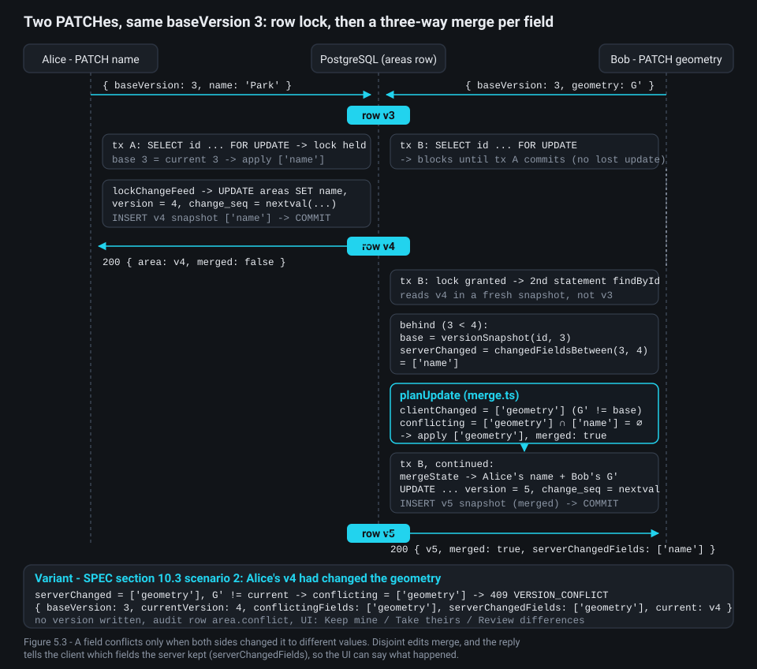

# Chapter 5 - Areas: validation, versioning, conflicts and caching

**What you will learn**

- How `POST /api/v1/areas` travels through Fastify, the service, PostGIS and Redis, and which step charges a drawing action.
- Why validation is split into transport (400), domain (422 / 428 / 409) and database (CHECK) layers.
- How a current row, immutable snapshots and one global sequence give you history, three-way merges and a gap-free change feed.
- How a viewport read is bounded four ways, read in one snapshot, and cached in two tiers keyed by tile generations.
- How audit logging and retention close the loop without blocking a request.

**Why this matters**

Several users edit the same polygons at once, over an unreliable network, and nothing may be lost silently. So a save must be *idempotent* (doing it twice has the effect of doing it once), because clients retry; the server must merge edits that do not collide and refuse those that do; ten thousand polygons render on every pan, so reads must be cached without ever serving a stale polygon; and "log all user actions" must not turn every pan into a database write.

The `areas` module (`backend/src/modules/areas/`) holds these rules. We follow one write and one read through it, then the machinery around them. Chapter 3 covered PostGIS; chapter 6 covers the WebSocket fan-out these writes trigger.

## 1. The shape of the module

`areas.routes.ts` is transport only: hooks, schemas, headers, no SQL. `areas.service.ts` (writes) and `areas-query.service.ts` (reads) hold every business decision and open every transaction. `areas.repository.ts` holds every SQL statement as a *named statement* (the name doubles as a prepared-statement name and a metrics label). `index.ts` wires them:

```ts
// backend/src/modules/areas/index.ts:12-24
export const createAreasModule: ModuleFactory = (container) => {
  const { db, areaCache, events, audit, metrics, drafts, users } = container;
  const effects = new MutationEffects({ areaCache, events, audit, metrics });
  const service = new AreasService({ db, drafts, users, effects });
  const queries = new AreasQueryService({ db, areaCache, metrics });
  return {
    name: 'areas',
    register: (app) => {
      registerAreasRoutes(app, { service, queries });
      return Promise.resolve();
    },
  };
};
```

What to notice: `MutationEffects` (cache invalidation, bus event, audit, metrics) is built once and handed to the write service. The repository is not passed in at all: it is a stateless module of named statements, and both services import `areasRepository` directly.

> **Architecture vs. code.** The simplification pass (`docs/superpowers/plans/2026-09-28-simplify-plan.md`, W1-AREAS) deleted the `*Record` types, so SQL rows map straight to DTOs in `areas.mapper.ts` (AR-1), and stopped injecting the repository (AR-6); the routes -> services -> repository layering stayed. Line numbers in this chapter are those of the final code of 2026-09-29.

## 2. Following `POST /api/v1/areas` hop by hop

Alice finishes a drawing. `saveDraftAsArea` (`frontend/src/realtime/draftSession.ts:331-333`) puts `id = session.draftId ?? newId()` on the body and calls the create; `ownWrites.ts:38` wraps that call to record the write. So the body carries an `id` - the WebSocket draft id, so the "ghost" other users are watching becomes the committed polygon - a `name`, an optional `description` and a Polygon. nginx forwards it to either replica.

Geometry is checked by four lines of defence, and the figure numbers them: the browser (the same validator, for live feedback), the service (stages 1-12), PostGIS (stage 13) and the table's CHECK constraints. (The code comment at `geometry-pipeline.ts:5-6` counts only the three server-side lines.)


The route declares the whole pipeline in its options:

```ts
// backend/src/modules/areas/areas.routes.ts:173-204
  app.post(
    '/api/v1/areas',
    {
      onRequest: [app.authenticate],
      preHandler: [app.drawRateLimit('area.create')],
      config: { auditAction: 'area.create' },
      schema: {
        summary: 'Create an area (idempotent by client-supplied id)',
        tags: TAGS,
        security: SECURITY_BEARER,
        body: CreateAreaRequestSchema,
        response: withProblems(
          { 200: AreaMutationResponseSchema, 201: AreaMutationResponseSchema },
          401,
          409,
          413,
          415,
          422,
        ),
      },
    },
    async (request, reply) => {
      const result = await service.create(areasActor(request), request.body);
      reply.header('ETag', versionEtag(result.area.version));
      if (result.replay)
        return reply.code(200).header('Idempotent-Replay', 'true').send(mutationResponse(result));
      return reply
        .code(201)
        .header('Location', `/api/v1/areas/${result.area.id}`)
        .send(mutationResponse(result));
    },
  );
```

The hook order is the contract of SPEC section 6.3: `authenticate` in `onRequest` (401), Fastify's body validation (400, free), then `drawRateLimit` as a `preHandler`:

```ts
// backend/src/infra/http/draw-rate-limit.ts:28-36
    async function drawRateLimit(request, reply) {
      if (request.auth === null) throw new UnauthorizedError('UNAUTHENTICATED', 'Authentication required.');
      const userId = request.auth.userId;
      const decision = await deps.limiter.consume(userId, kind);
      const resetInS = Math.max(0, Math.ceil((decision.resetAtMs - deps.clock.now()) / 1000));
      reply.header('X-Draw-RateLimit-Limit', String(decision.limit));
      reply.header('X-Draw-RateLimit-Remaining', String(decision.remaining));
      reply.header('X-Draw-RateLimit-Reset', String(resetInS));
      if (decision.allowed) return;
```

What to notice: the charge happens *before any domain work*. Every request that reaches this line costs one of the 50 actions per minute whatever happens next - a 422, a 428 and a 409 all cost one; only a 401, a transport 400 and the 429 itself are free (`areas-rate-limit.int.test.ts:33`). `config.auditAction` feeds the generic audit hook (section 12).

The handler calls `service.create`, which wraps everything in `#audited` (any 4xx becomes an audit row):

```ts
// backend/src/modules/areas/areas.service.ts:69-85
  /** POST /areas: 201 created, or 200 replay of the same create (section 6.3 idempotency). */
  create(actor: AreasActor, body: CreateAreaRequest): Promise<MutationResult> {
    return this.#audited('create', actor, body.id ?? null, async () => {
      const input = prepareCreate(body);
      const id = input.id ?? randomUUID();
      if (input.id !== null) await this.#assertNotSquatted(id, actor);
      const outcome = await this.#deps.db.withTransaction((tx) => this.#createInTx(tx, id, input, actor));
      if (outcome.kind === 'replay') {
        const { area } = outcome;
        this.#deps.effects.recordSuccess('create', actor, id, this.#createDetails(area, true), 'replay');
        return mutationResult(area, { serverChangedFields: outcome.serverChangedFields, replay: true });
      }
      await this.#deps.effects.afterCommit(outcome.change);
      this.#deps.effects.recordSuccess('create', actor, id, this.#createDetails(outcome.change.area, false));
      return mutationResult(outcome.change.area);
    });
  }
```

`prepareCreate` -> squatting guard -> one transaction -> `afterCommit` -> `recordSuccess`. The next sections take each step in turn.

## 3. Three kinds of validation, three status codes

A Zod schema at the boundary can say "this JSON has the right shape and is not absurdly large". It cannot say "this ring crosses itself" without turning a documented 422 into a 400 - and the client switches on those codes. ADR-0002 therefore separates *transport* validation (Fastify, 400) from *domain* validation (the service, 422 / 428 / 403 / 409):

```ts
// packages/shared/src/schemas/areas.ts:22-41
/**
 * Stage 0 of section 9.2: `type` is any short string (a Polygon-shaped `MultiPolygon` passes and fails later with 422
 * INVALID_GEOMETRY_TYPE); `coordinates` must be rings of `[number, number]`, so a genuine MultiPolygon (nested three
 * deep), a 3-number position and `1e999` are 400s.
 */
export const PolygonGeometryInSchema = z
  .strictObject({
    type: z.string().min(1).max(LIMITS.transportTypeMaxLength),
    coordinates: z.array(z.array(PositionSchema)).max(LIMITS.transportMaxRings),
  })
  .superRefine((geometry, context) => {
    const total = geometry.coordinates.reduce((sum, ring) => sum + ring.length, 0);
    if (total > LIMITS.transportMaxPositionsTotal) {
      context.addIssue({
        code: 'custom',
        path: ['coordinates'],
        message: `at most ${LIMITS.transportMaxPositionsTotal} positions in total`,
      });
    }
  });
```

What to notice: `type` is *any* short string, and the caps (64 rings, 10,000 positions in total) are abuse limits, not the real ones (11 rings and 2,000 positions). Likewise `baseVersion` is `.optional()` in `UpdateAreaRequestSchema` (line 57): its absence is a 428, not a 400.

The domain order is fixed and has one implementation:

```ts
// backend/src/modules/areas/area-input.ts:63-76
export function prepareCreate(body: CreateAreaRequest): CreateInput {
  const name = sanitizeName(body.name);
  const description = sanitizeDescription(body.description);
  return { id: body.id ?? null, name, description, geometry: validateGeometryInput(body.geometry) };
}

export function prepareUpdate(body: UpdateAreaRequest): UpdateInput {
  const patch: AreaPatch = {};
  if (body.name !== undefined) patch.name = sanitizeName(body.name);
  if (body.description !== undefined) patch.description = sanitizeDescription(body.description);
  const baseVersion = requireBaseVersion(body.baseVersion);
  if (body.geometry !== undefined) patch.geometry = validateGeometryInput(body.geometry);
  return { baseVersion, patch, revertedFrom: body.revertedFrom ?? null };
}
```

Text first (an empty name after sanitisation is a 400 that still costs an action), then the precondition (428), then geometry (422) through the shared `validatePolygon` - the *same function* the browser runs for live feedback:

```ts
// backend/src/modules/areas/geometry-pipeline.ts:20-24
export function validateGeometryInput(geometry: PolygonGeometryIn): PolygonGeometry {
  const result = validatePolygon(geometry);
  if (!result.ok) throw new InvalidGeometryError(result.issues);
  return result.polygon;
}
```

Stages 1-12 (SPEC section 9.2) quantise to 7 decimals, drop duplicates, check closure, ring simplicity, holes, extent and geodesic area, and return the polygon wound counter-clockwise. Stage 13 runs inside the transaction: PostGIS answers `ST_IsValid` and the geography area, and `assertGeosAccepts` (`geometry-pipeline.ts:67-70`) maps a "no" to 422 `GEOS_INVALID` or `AREA_TOO_*`. The table's CHECK constraints are the fourth line of defence; `translateCheckViolation` (lines 90-102) turns a geometry CHECK violation (SQLSTATE 23514 on `areas_geom_valid_ck`, `areas_geom_npoints_ck` or `areas_area_range_ck`) into a 422 `GEOS_INVALID` and a text CHECK (`areas_name_len_ck`, `areas_description_len_ck`) into a 400 `VALIDATION_FAILED`, never a 500. The shared validator is at least as strict as GEOS (SPEC section 9), so stage 13 should never fire; `areas-validation.int.test.ts` asserts every row of the section 6.3 stage -> status table.

## 4. How an area is stored


`areas` is the current row, with measurements computed once at write time:

```sql
-- backend/migrations/0004_areas.sql:2-31
CREATE SEQUENCE area_change_seq AS bigint START WITH 1 INCREMENT BY 1 NO CYCLE;

CREATE TABLE areas (
  id               uuid                    PRIMARY KEY,
  name             text                    NOT NULL,
  description      text,
  geom             geometry(Polygon, 4326) NOT NULL,
  area_km2         double precision        NOT NULL,   -- ST_Area(geom::geography) / 1e6 (WGS84 ellipsoid)
  perimeter_km     double precision        NOT NULL,   -- ST_Perimeter(geom::geography) / 1e3
  vertex_count     integer                 NOT NULL,   -- ST_NPoints - ST_NRings (closing positions excluded)
  bbox_extent_deg  double precision        NOT NULL,   -- max(bbox width, bbox height) in degrees, for LOD culling
  version          integer                 NOT NULL DEFAULT 1,
  change_seq       bigint                  NOT NULL,   -- change_seq of the latest mutation
  created_by       uuid                    NOT NULL REFERENCES users (id),
  updated_by       uuid                    NOT NULL REFERENCES users (id),
  created_at       timestamptz             NOT NULL DEFAULT now(),
  updated_at       timestamptz             NOT NULL DEFAULT now(),
  deleted_at       timestamptz,
  deleted_by       uuid                    REFERENCES users (id),
  CONSTRAINT areas_name_len_ck           CHECK (char_length(name) BETWEEN 1 AND 120),
  CONSTRAINT areas_description_len_ck    CHECK (description IS NULL OR char_length(description) <= 2000),
  CONSTRAINT areas_geom_valid_ck         CHECK (ST_IsValid(geom)),
  CONSTRAINT areas_geom_npoints_ck       CHECK (ST_NPoints(geom) <= 2000),
  CONSTRAINT areas_area_range_ck         CHECK (area_km2 >= 0.000001 AND area_km2 <= 100000),
  CONSTRAINT areas_version_ck            CHECK (version >= 1),
  CONSTRAINT areas_deleted_consistency_ck CHECK ((deleted_at IS NULL) = (deleted_by IS NULL))
);

-- Hot path: bbox queries over live areas only.
CREATE INDEX areas_geom_live_gist ON areas USING gist (geom) WHERE deleted_at IS NULL;
```

What to notice: `area_km2` comes from the `geography` cast - the WGS84 ellipsoid, never a projection (Web Mercator would overestimate by about 40 % in Israel, ADR-0003). `bbox_extent_deg` exists only for cheap sub-pixel culling. A *tombstone* (soft-deleted row) has `deleted_at` set, and the GiST index is *partial* - `WHERE deleted_at IS NULL` - so every bbox query must repeat that predicate for the planner to use it.

`area_versions` (migration 0005) holds one full snapshot per version, `PRIMARY KEY (area_id, version)`, a unique `change_seq` for the feed, and a trigger that makes history immutable:

```sql
-- backend/migrations/0005_area_versions.sql:26-36
-- Change feed: GET /areas/changes?since=N scans by change_seq.
CREATE UNIQUE INDEX area_versions_change_seq_uq ON area_versions (change_seq);

-- History is append-only: updates are rejected; deletes happen only via ON DELETE CASCADE from the retention purge.
CREATE FUNCTION area_versions_reject_update() RETURNS trigger LANGUAGE plpgsql AS $$
BEGIN
  RAISE EXCEPTION 'area_versions rows are immutable' USING ERRCODE = 'restrict_violation';
END
$$;
CREATE TRIGGER area_versions_immutable BEFORE UPDATE ON area_versions
  FOR EACH ROW EXECUTE FUNCTION area_versions_reject_update();
```

Each snapshot records `changed_fields` (which of `name`, `description`, `geometry`, `deleted` changed), `merged` and the client's `base_version` - what the merge needs later - and is copied from the current row in SQL:

```ts
// backend/src/modules/areas/areas.repository.ts:117-124
  insertVersionFromCurrent: sql(
    'areas.insertVersionFromCurrent',
    `INSERT INTO area_versions (area_id, version, op, name, description, geom, area_km2, perimeter_km, vertex_count,
                                changed_fields, merged, base_version, change_seq, actor_id, request_id, reverted_from)
     SELECT id, version, $2::text, name, description, geom, area_km2, perimeter_km, vertex_count,
            $3::text[], $4::boolean, $5::int, change_seq, $6::uuid, $7::text, $8::int
       FROM areas WHERE id = $1::uuid`,
  ),
```

`system_state` (migration 0007) holds the change-feed purge watermark and the last retention run.

## 5. The write transaction and its lock order

Every write follows the shape documented at `areas.service.ts:1-8`: row lock -> change-feed advisory lock -> write -> version snapshot -> COMMIT. The create is the simplest:

```ts
// backend/src/modules/areas/areas.service.ts:140-164
  async #createInTx(tx: DbTx, id: string, input: CreateInput, actor: AreasActor): Promise<CreateOutcome> {
    const geoJson = JSON.stringify(input.geometry);
    assertGeosAccepts(await areasRepository.checkGeometry(tx, geoJson));
    await areasRepository.lockChangeFeed(tx);
    const inserted = await this.#write(() =>
      areasRepository.insert(tx, {
        id,
        name: input.name,
        description: input.description,
        geoJson,
        actorId: actor.userId,
      }),
    );
    if (!inserted) return this.#replayOrConflict(tx, id, input, actor);
    await areasRepository.insertVersionFromCurrent(tx, {
      areaId: id,
      op: 'create',
      changedFields: MERGE_FIELDS,
      merged: false,
      baseVersion: null,
      actorId: actor.userId,
      requestId: actor.requestId,
      revertedFrom: null,
    });
    const area = await this.#reload(tx, id);
```

Three repository statements do the work:

```ts
// backend/src/modules/areas/areas.repository.ts:56-76
  checkGeometry: sql(
    'areas.checkGeometry',
    `SELECT ST_IsValid(s.g) AS valid, ST_IsValidReason(s.g) AS reason, ST_Area(s.g::geography) / 1e6 AS area_km2
       FROM (SELECT ST_SetSRID(ST_GeomFromGeoJSON($1::text), 4326) AS g) AS s`,
  ),
  /** Held from nextval to COMMIT so commit order equals change_seq order (gap-free feed for readers, section 5.5). */
  lockChangeFeed: sql('areas.lockChangeFeed', `SELECT pg_advisory_xact_lock(${CHANGE_FEED_LOCK_KEY})`),
  /** $1 id, $2 name, $3 description, $4 GeoJSON, $5 actor. No row -> the id exists (idempotency check, section 6.3). */
  insert: sql(
    'areas.insert',
    `INSERT INTO areas (id, name, description, geom, area_km2, perimeter_km, vertex_count, bbox_extent_deg,
                        version, change_seq, created_by, updated_by)
     SELECT $1::uuid, $2::text, $3::text, s.g,
            ST_Area(s.g::geography) / 1e6, ST_Perimeter(s.g::geography) / 1e3,
            ST_NPoints(s.g) - ST_NRings(s.g),
            GREATEST(ST_XMax(s.g) - ST_XMin(s.g), ST_YMax(s.g) - ST_YMin(s.g)),
            1, nextval('area_change_seq'), $5::uuid, $5::uuid
       FROM (SELECT ST_ForcePolygonCCW(ST_SetSRID(ST_GeomFromGeoJSON($4::text), 4326)) AS g) AS s
     ON CONFLICT (id) DO NOTHING
     RETURNING id`,
  ),
```

What to notice in `insert`: `ST_ForcePolygonCCW` enforces winding in the database too; every derived column comes from the same geometry; and `ON CONFLICT (id) DO NOTHING RETURNING id` returns no row when the id exists, which `areasRepository.insert` turns into `false` - the idempotency signal of section 7.

Why an *advisory lock* (a lock on a number, not a row)? Sequence values are handed out at `nextval` time, not commit time, so a later number could commit first and a feed reader could skip the earlier one forever (figure 5.4). Holding `pg_advisory_xact_lock(7210001)` for the last few statements (the write, its version snapshot and the `findById` reload - three in `#createInTx`, `#applyUpdate` at lines 241-260 and `#tombstoneInTx` at lines 301-314) makes commit order equal sequence order, and caps commits at hundreds per second - ample under 50 actions per minute per user (ADR-0003).

Updates first lock the row, and `lockById` is deliberately two statements:

```ts
// backend/src/modules/areas/areas.repository.ts:305-317
  /**
   * Locks the row, then reads it with its user references in a NEW statement. A single locking SELECT that also joins
   * `users` loses the row under READ COMMITTED when the writer it waited for changed `updated_by`: PostgreSQL re-checks
   * the new row version (EvalPlanQual) against the users rows it read before the wait, the join condition fails and
   * the query returns nothing, which turned a 409 VERSION_CONFLICT into a 404 (found by T9). The second statement
   * takes a fresh snapshot, so it returns exactly the version committed by the previous lock holder.
   */
  async lockById(q: DbTx, id: string): Promise<AreaDto | null> {
    const locked = await q.query<{ id: string }>(AREAS_SQL.lockById, [id]);
    if (locked.length === 0) return null;
    const [row] = await q.query<AreaRow>(AREAS_SQL.findById, [id]);
    return row === undefined ? null : toAreaDto(row);
  },
```

A real bug found by the integration gate, now pinned by `areas-concurrency.int.test.ts:80`. The row lock always comes before the advisory lock, so two writers can never deadlock.

## 6. Optimistic concurrency: the three-way merge

Last-writer-wins loses data silently; enforced locks break when the WebSocket is down (ADR-0005 rejects both). Instead every PATCH, DELETE and restore carries the `baseVersion` it was edited from - *optimistic concurrency* - and the server merges per field. Advisory *soft locks* over WebSocket (chapter 6; SPEC section 10.3 item 5, section 7.9) warn "Alice is editing" before a conflict; they are advice, not enforcement - REST never checks them.



```ts
// backend/src/modules/areas/areas.service.ts:197-211
  async #updateInTx(tx: DbTx, id: string, input: UpdateInput, actor: AreasActor): Promise<UpdateOutcome> {
    const current = await this.#lockExisting(tx, id);
    if (current.deletedAt !== null) throw areaDeleted(current);
    const behind = input.baseVersion < current.version;
    const serverChanged = behind
      ? mergeFieldsOf(await areasRepository.changedFieldsBetween(tx, id, input.baseVersion, current.version))
      : [];
    const base = behind ? await areasRepository.versionSnapshot(tx, id, input.baseVersion) : null;
    const plan = planUpdate({
      current,
      baseVersion: input.baseVersion,
      base,
      serverChanged: new Set(serverChanged),
      patch: input.patch,
    });
```

When the client is behind, the service loads the snapshot at `baseVersion` and the union of `changed_fields` since it (`changedFieldsBetween`, `areas.repository.ts:138-144`). A pure function decides:

```ts
// backend/src/modules/areas/merge.ts:73-94
/** Plans an update (section 10.3): conflict -> 409 VERSION_CONFLICT, noop -> 200 without a new version, else apply. */
export function planUpdate({
  current,
  baseVersion,
  base,
  serverChanged,
  patch,
}: UpdatePlanInput): UpdatePlan {
  const sent = patchFields(patch);
  const differsFromCurrent = (field: MergeField): boolean => !patchValueEquals(patch, current, field);

  // A client ahead of the server is impossible unless forged; a missing base cannot be merged safely.
  if (baseVersion > current.version) return { kind: 'conflict', conflictingFields: sent };
  if (baseVersion === current.version) return applyOrNoop(sent.filter(differsFromCurrent), false);
  if (base === null) return { kind: 'conflict', conflictingFields: sent };

  const clientChanged = sent.filter((field) => !patchValueEquals(patch, base, field));
  // The same value on both sides converges instead of conflicting.
  const conflicting = clientChanged.filter((field) => serverChanged.has(field) && differsFromCurrent(field));
  if (conflicting.length > 0) return { kind: 'conflict', conflictingFields: conflicting };
  return applyOrNoop(clientChanged.filter(differsFromCurrent), true);
}
```

What to notice: `clientChanged` is measured against the *base*, so a field sent unchanged can never overwrite a newer server value. A field conflicts only when both sides changed it *and* the values differ; the same value on both sides converges (SPEC section 10.3 scenario 3). Nothing effective left -> `noop`: no version, no event, so a retried PATCH is harmless (scenario 5). Geometry is atomic: two users reshaping the same polygon always conflict.

A conflict carries everything the UI needs, so no second request is necessary:

```ts
// backend/src/modules/areas/area-errors.ts:47-60
export function versionConflict(facts: VersionConflictFacts): ConflictError {
  const { current, baseVersion } = facts;
  const detail =
    baseVersion > current.version
      ? `baseVersion ${baseVersion} is ahead of the current version ${current.version}.`
      : `Fields [${facts.conflictingFields.join(', ')}] were changed by another user since version ${baseVersion}.`;
  return new ConflictError('VERSION_CONFLICT', detail, {
    baseVersion,
    currentVersion: current.version,
    conflictingFields: [...facts.conflictingFields],
    serverChangedFields: [...facts.serverChangedFields],
    current,
  });
}
```

The frontend reads `problemCurrent` (`frontend/src/api/areas.ts:63-66`) and opens the *Keep mine / Take theirs / Review differences* dialog (`frontend/src/workspace/editFlow.ts:480`); a merged save shows a toast naming the server-changed fields (`editFlow.ts:458-459`). `merge.test.ts:53-137` maps the section 10.3 scenarios one to one; `areas-concurrency.int.test.ts:52` proves 10 concurrent renames give one 200 and nine 409s.

> **Architecture vs. code.** Until the simplification pass `planUpdate` also had a `{ kind: 'deleted' }` branch that could never fire, because the service throws `AREA_DELETED` before planning (line 199); AR-4 deleted it. The guard lives in the service, where the lock is held.

## 7. Idempotent create, delete and restore

The client reuses its draft id as the area id, and a retry must not create a duplicate. When `insert` returns no row, the service compares the request with **version 1** and `created_by`, not with the current row:

```ts
// backend/src/modules/areas/area-input.ts:84-91
export function isSameCreate(snapshot: VersionOneSnapshot, input: CreateInput, actorId: string): boolean {
  return (
    snapshot.createdBy === actorId &&
    snapshot.name === input.name &&
    snapshot.description === input.description &&
    polygonsEqual(snapshot.geometry.coordinates, input.geometry.coordinates)
  );
}
```

Why version 1? If the response was lost and someone renamed the area meanwhile, the current row would look like different content -> 409, and the client's id regeneration would create a duplicate. Comparing with the state this create produced recognises the retry after any later edit or delete and answers 200 + `Idempotent-Replay: true` with the *current* state (`#replayOrConflict`, `areas.service.ts:175-189`; `areas-crud.int.test.ts:185`); different content or another caller is 409 `AREA_ID_CONFLICT`. Draft ids are visible to every viewer, so a POST with another user's live draft id is refused before any DB work (`#assertNotSquatted`, lines 134-138) - fail-open when Redis is down (`infra/drafts/types.ts:34-35`), because the primary key still prevents duplicates.

> **Architecture vs. code.** The simplification pass (AR-7) moved `isSameCreate` into `area-input.ts` and deleted the old `replay.ts`; the version-1 rule is unchanged.

Delete and restore are tombstone transitions (version + 1) by the creator or an admin, and they never merge:

```ts
// backend/src/modules/areas/areas.service.ts:284-303
  /**
   * 404 -> 403 (creator or admin) -> 409 wrong state -> 409 stale version, then the transition and its snapshot.
   * `isAdmin` is the caller's CURRENT admin role, read before the transaction.
   */
  async #tombstoneInTx(
    tx: DbTx,
    op: 'delete' | 'restore',
    id: string,
    baseVersion: number,
    actor: AreasActor,
    isAdmin: boolean,
  ): Promise<CommittedChange> {
    const current = await this.#lockExisting(tx, id);
    if (current.createdBy.id !== actor.userId && !isAdmin) throw notCreatorOrAdmin();
    if (op === 'delete' && current.deletedAt !== null) throw areaDeleted(current);
    if (op === 'restore' && current.deletedAt === null) throw areaNotDeleted(current);
    await this.#assertVersionMatches(tx, current, baseVersion);
    await areasRepository.lockChangeFeed(tx);
    if (op === 'delete') await areasRepository.softDelete(tx, id, actor.userId);
    else await areasRepository.restore(tx, id, actor.userId);
```

What to notice: `isAdmin` is re-read from the user directory (`#isCurrentAdmin`, lines 337-341), so a demoted admin with a still-valid token is refused at once. A restore answered 409 `AREA_NOT_DELETED` whose `current` is live at `baseVersion + 1` is treated by the client as its own earlier success (`frontend/src/api/areas.ts:53-60`). Tombstones and their history stay readable (`includeDeleted=true`, `GET /areas/{id}/versions`) until the purge.

## 8. After commit: invalidate, then publish

Once COMMIT returns, two things happen in a fixed order, both before the HTTP reply:

```ts
// backend/src/modules/areas/mutation-effects.ts:91-95
  /** Invalidate, then publish - both awaited, neither throws (section 10.2 step 5, section 3.3 EventBus). */
  async afterCommit(change: CommittedChange): Promise<void> {
    await this.#deps.areaCache.invalidate(affectedBboxes(change));
    await this.#deps.events.publish('areas', toBusPayload(change));
  }
```

The cache is invalidated for the old *and* new bbox (`affectedBboxes`, lines 37-42) before any subscriber could re-read; then the `areas` bus event is published so every instance's WebSocket fan-out (chapter 6) delivers `area.changed`. Publishing before the reply means the client's later `draft.end` can never overtake the `area.changed` on any subscriber (SPEC section 7.6). Neither call throws: a failed invalidation degrades to bypass (section 11); a failed publish is repaired by the change feed. `areas-crud.int.test.ts:303` asserts exactly one event per committed mutation, before the reply; line 357, none for a failure, rollback, no-op or replay.

## 9. The change feed and the purge watermark

The event bus behind WebSocket delivery is at-most-once (`backend/src/infra/events/types.ts:1-3`). A client that missed messages asks `GET /api/v1/areas/changes?since=N` for every committed version in `change_seq` order - gap-free thanks to the advisory lock.


```ts
// backend/src/modules/areas/areas-query.service.ts:173-194
  changesSince(since: number, limit: number | undefined): Promise<ChangeFeedResponse> {
    const pageSize = limit ?? LIMITS.changeFeedLimitDefault;
    return this.#deps.db.withTransaction(async (tx) => {
      const watermark = await areasRepository.purgeWatermark(tx);
      if (since < watermark) {
        throw new AppError(
          'CHANGE_FEED_EXPIRED',
          `Changes before ${watermark} were purged; reload the viewport.`,
          { extensions: { watermark } },
        );
      }
      const latestChangeSeq = await areasRepository.latestChangeSeq(tx);
      const rows = await areasRepository.changesSince(tx, since, pageSize + 1);
      const items = rows.slice(0, pageSize);
      return {
        items,
        nextSince: items.at(-1)?.changeSeq ?? since,
        hasMore: rows.length > pageSize,
        latestChangeSeq,
      };
    }, SNAPSHOT_READ);
  }
```

What to notice: one `REPEATABLE READ` snapshot for the watermark, `latestChangeSeq` and the page. Retention (section 13) purges old versions and raises the watermark; a `since` below it gets 410 `CHANGE_FEED_EXPIRED`, which the frontend turns into a viewport reload (`frontend/src/api/areas.ts:87`). The subtle part is "latest":

```ts
// backend/src/infra/directory/queries.ts:40-50
  /**
   * Never below the purge watermark: after retention purged the areas holding the highest seqs, max(change_seq) can
   * drop below it, and a client using it as `since` would get 410 -> reload -> the same value -> 410 forever.
   */
  latestChangeSeq: sql(
    'directory.latestChangeSeq',
    `SELECT GREATEST(
              COALESCE((SELECT max(change_seq) FROM area_versions), 0),
              (SELECT (value)::text::bigint FROM system_state WHERE key = 'change_feed_purge_watermark')
            ) AS latest`,
  ),
```

The REST `asOfChangeSeq` and the WebSocket `welcome.latestChangeSeq` both use this one statement. `change-feed.int.test.ts:42` proves 50 concurrent creates are gap-free; line 107 proves the 410.

## 10. Reading a viewport: the bbox query

`GET /api/v1/areas?bbox=…&zoom=14` must render 10,000+ polygons quickly, and one request must never materialise 90 MB of GeoJSON. The query is bounded four ways and read in one snapshot.

**Span cap.** `parseBboxParam` (`bbox-params.ts:56-71`) rejects a bbox wider than 8,192 Web-Mercator pixels at the requested zoom (400 `INVALID_BBOX`) - no "world bbox at zoom 17".

**Level of detail (LOD).** One shared table gives per-zoom simplification, culling and precision:

```ts
// packages/shared/src/geo/lod.ts:22-31
/** The LOD for an integer zoom 0-22 (the bbox query schema bounds it). */
export function lodForZoom(zoom: number): LevelOfDetail {
  if (zoom >= 17) return { simplifyDeg: 0, minExtentDeg: 0, digits: 7, simplified: false };
  const simplifyDeg = 0.5 * pixelDeg(zoom);
  if (zoom >= 15) return { simplifyDeg, minExtentDeg: 0, digits: 6, simplified: true };
  const minExtentDeg = 2 * pixelDeg(zoom);
  if (zoom === 14) return { simplifyDeg, minExtentDeg, digits: 6, simplified: true };
  if (zoom >= 10) return { simplifyDeg, minExtentDeg, digits: 5, simplified: true };
  return { simplifyDeg, minExtentDeg, digits: 4, simplified: true };
}
```

List geometry is display-only; editing loads `GET /areas/:id` at full precision. Polygons under two pixels are culled and counted (`culledCount`, first page only), never dropped silently.

**Row limit and keyset pagination with a bound cursor.** A page holds at most `limit` rows - default 1,000, maximum 2,000 (`LIMITS.bboxPageLimitDefault` / `bboxPageLimitMax`, applied at `areas-query.service.ts:67`). Pages continue with `id > $cursor ORDER BY id`; the cursor embeds a sha256 of the exact `queryBbox|zoom|limit`, so replaying it against another query is 400 `INVALID_CURSOR`:

```ts
// backend/src/modules/areas/cursor.ts:37-42
export function queryBinding({ queryBbox, zoom, limit }: BboxCursorQuery): string {
  return createHash('sha256')
    .update(`v1|${queryBbox.join(',')}|${zoom}|${limit}`)
    .digest('base64url')
    .slice(0, BINDING_LENGTH);
}
```

**Position budget.** The SQL sums `vertex_count` *before* generating any GeoJSON:

```ts
// backend/src/modules/areas/areas.repository.ts:160-184
  findInBbox: sql(
    'areas.findInBbox',
    `SELECT p.id, p.name, p.area_km2, p.version, p.change_seq, p.updated_at, p.created_by, p.updated_by,
            u.display_name AS updated_by_name, u.color AS updated_by_color,
            CASE WHEN p.rn = 1 OR p.cum_positions <= $10::int THEN
              ST_AsGeoJSON(CASE WHEN $5::float8 > 0 THEN ST_Simplify(p.geom, $5::float8, true) ELSE p.geom END, $6::int)
            END::json AS geometry,
            ARRAY[ST_XMin(p.geom), ST_YMin(p.geom), ST_XMax(p.geom), ST_YMax(p.geom)] AS bbox
       FROM (
         SELECT a.id, a.name, a.area_km2, a.version, a.change_seq, a.updated_at, a.created_by, a.updated_by, a.geom,
                a.vertex_count,
                sum(a.vertex_count) OVER w AS cum_positions, row_number() OVER w AS rn
           FROM areas a
          WHERE a.deleted_at IS NULL
            AND ST_Intersects(a.geom, ST_MakeEnvelope($1::float8, $2::float8, $3::float8, $4::float8, 4326))
            AND a.bbox_extent_deg >= $7::float8
            AND ($8::uuid IS NULL OR a.id > $8::uuid)
         WINDOW w AS (ORDER BY a.id ROWS UNBOUNDED PRECEDING)
          ORDER BY a.id
          LIMIT $9::int
       ) p
       JOIN users u ON u.id = p.updated_by
      WHERE p.rn = 1 OR p.cum_positions - p.vertex_count <= $10::int
      ORDER BY p.id`,
  ),
```

What to notice: the inner query hits the partial GiST, applies the extent threshold and the keyset, and computes `cum_positions` with a window sum; the outer query generates GeoJSON only for rows inside the 150,000-position budget, plus one sentinel row (a *sentinel*: the first row past the budget, returned without geometry only to prove a next page exists - `page-budget.ts:2-6`). The `<=` in the last `WHERE` matters: with `<`, a page whose positions sum to exactly the budget would end without a continuation. `cutPage` (`page-budget.ts:20-32`) turns rows into items and `hasMore`: every row with a geometry is an item, the sentinel is not. `ST_Simplify` beat `ST_SimplifyPreserveTopology` 8 ms to 27 ms per zoom-14 page (SPEC section 5.5).

**Consistent snapshot** (a consistency property, not a bound). `#loadBboxPage` (`areas-query.service.ts:89-124`) runs in `REPEATABLE READ READ ONLY` and reads `latestChangeSeq` in the same snapshot as the rows - the `asOfChangeSeq` the client resyncs from. `areas-bbox.int.test.ts:194` proves the union of all pages is the exact set.

> **Architecture vs. code.** The simplification pass (AR-2) made `cutPage` key on `geometry !== null` and stopped *selecting* `rn`/`cum_positions` (the SQL still computes and filters on them); the budget mechanism stayed.

## 11. The two-tier cache and HTTP validators

Viewport reads are roughly 100x the write rate. The cache must be invalidated precisely when a polygon inside a page changes, across instances, and never serve stale data after a Redis restart.


The plan is pure (`infra/cache/key-plan.ts:29-43`): level `L = clamp(zoom − 2, 0, 14)` (zoom >= 17 bypasses), the bbox snapped outward to level-L tiles (the `queryBbox` the response echoes), and the key tiles as its *closed* coverage - more than 64 of them and the request bypasses. The key embeds every counter that could change the answer:

```ts
// backend/src/infra/cache/key-plan.ts:75-91
/** `v1|L|zoom|limit|cursor|queryBbox|epoch|big|x:y=gen,...` - the exact material of section 10.2 step 4. */
export function cacheKeyMaterial(key: BboxQueryKey, generations: GenerationSnapshot): string {
  const tiles = keyTiles(key.plan)
    .map((tile, index) => `${tile.x}:${tile.y}=${generations.tiles[index] ?? 0}`)
    .join(',');
  return [
    CACHE_KEY_VERSION,
    key.plan.level ?? 'bypass',
    key.plan.zoom,
    key.limit,
    key.cursor ?? '',
    key.plan.queryBbox.join(','),
    generations.epoch,
    generations.big,
    tiles,
  ].join('|');
}
```

A *generation* is an integer counter in the critical Redis (`snap:cache:gen:<L>:<x>:<y>`). After a commit the writer INCRs the generations of every tile covering its old and new bbox at levels 0-14 (one Lua script, `redis-area-cache.ts:43-50`, at most 240 keys per bbox - 15 levels x 16 tiles; the old and new bbox are merged into one call, deduplicated by `generationKeysFor`, lines 92-107), or the level's `big` counter when more than 16 tiles would be touched. A reader that starts after the INCR computes a different hash; the old body is orphaned and expires. Reader and writer share `tilesCoveringClosed` (`packages/shared/src/geo/tiles.ts:76-93`): with open coverage a polygon merely touching the snapped edge would be returned by `ST_Intersects` yet share no key tile with the reader (`area-cache.int.test.ts:137`).

The read path is one `MGET`, then L1, then L2, then the loader:

```ts
// backend/src/infra/cache/redis-area-cache.ts:162-186
  async getOrLoad(
    key: BboxQueryKey,
    loader: () => Promise<string>,
  ): Promise<{ body: string; outcome: CacheOutcome }> {
    if (!this.#options.enabled || key.plan.level === null || this.#pendingBump !== null) {
      return this.#record(await loader(), 'bypass');
    }
    const generations = await this.#readGenerations(key.plan, key.plan.level);
    if (generations === null) return this.#record(await loader(), 'bypass');

    const hash = cacheKeyHash(key, generations);
    const l1 = this.#l1.get(hash);
    if (l1 !== undefined) return this.#record(l1.body, 'hit_l1');

    const fromL2 = await this.#readL2(hash);
    if (fromL2 !== null) {
      this.#storeL1(hash, fromL2);
      return this.#record(fromL2, 'hit_l2');
    }

    const body = await loader();
    this.#storeL1(hash, body);
    this.#scheduleL2Write(hash, body);
    return this.#record(body, 'miss');
  }
```

What to notice: `#readGenerations` returns null - bypass, served from the DB, never an error - when Redis is down, a counter is corrupt or the **epoch** (`gen:global`) is missing. A missing epoch is never read as 0: the reader bypasses and `SET … NX`es a random 52-bit value (lines 236-239, 244-257), so bodies cached before a Redis restart can never match again even though tile counters restart at 0. A failed INCR clears L1 and schedules an epoch bump (lines 308-314); a reconnect of the command client bumps it too. L2 bodies are gzip on the separate `redis-cache` (`allkeys-lru`), written only if <= 512 KiB compressed; counters stay on the critical `redis` (`noeviction`), so cache churn can never evict a limiter or lock key. `area-cache.int.test.ts:100` proves MISS -> HIT-L1 -> HIT-L2 on a second instance; line 357, the restart case.

On top sit cheap HTTP validators:

```ts
// backend/src/modules/areas/http-caching.ts:11-18
export function versionEtag(version: number): string {
  return `"v${version}"`;
}

/** `W/"<base64url sha1 of body>"` for bbox list pages. */
export function weakBodyEtag(body: string): string {
  return `W/"${createHash('sha1').update(body).digest('base64url')}"`;
}
```

`Cache-Control: private, no-cache` forces revalidation; the bbox route (`areas.routes.ts:87-101`) answers 304 on `If-None-Match`, exposes the tier in `X-Cache` (`MISS`, `HIT-L1`, `HIT-L2`, `BYPASS`) and sends the cached string as-is - the one route that skips per-request Zod serialisation (ADR-0002).

> **Architecture vs. code.** The production cache is `RedisAreaQueryCache`, created in `container.ts:124-137`. The simplification pass deleted the in-memory test double `InMemoryAreaQueryCache` (INFRA-11); the integration tests now run and spy on the production class (`area-cache.int.test.ts:83`).

## 12. Audit logging

SPEC section 10.4 scopes "log all user actions": every authenticated state-changing request, whatever its outcome, is a row in `audit_logs`; reads go to the structured request log; WebSocket traffic is aggregated per connection. Services record the outcomes they produce (`mutation-effects.ts:115-128`: a `VERSION_CONFLICT` becomes `area.conflict`, a 403 `denied`); floods such as rate-limit hits go through a coalescer (`draw-rate-limit.ts:38-51`; per key, the first hit of a 10 s window is written at once with `details.count: 1` and the rest of the window as one more row whose `details.count` is the later hits, `audit/coalescer.ts:2-5`); a generic `onResponse` hook catches what the service never saw - transport 400, 413, 415, 5xx:

```ts
// backend/src/infra/http/audit-hook.ts:17-20
function needsGenericAuditRow(status: number, authFailed: boolean, alreadyRecorded: boolean): boolean {
  if (status < 400 || status === 429 || alreadyRecorded) return false;
  return !(status === 401 && authFailed);
}
```

`alreadyRecorded` comes from a tracker that marks request ids as services call `audit.record`; because ids are client-controlled, a mark is trusted only while one request holds the id (a duplicate row beats a missing one).

`record()` never blocks or throws: it normalises (`details` <= 4 KiB, never geometry), writes an `audit: true` log line (the second trail) and queues. A buffered writer flushes up to 500 events (`AUDIT_BATCH_SIZE`), at least every second, in one statement:

```ts
// backend/src/infra/audit/buffered-writer.ts:29-35
export const INSERT_AUDIT_BATCH = sql(
  'audit.insertBatch',
  `INSERT INTO audit_logs (occurred_at, action, outcome, actor_id, session_id, target_type, target_id, request_id,
                         instance_id, ip, user_agent, details)
SELECT * FROM unnest($1::timestamptz[], $2::text[], $3::text[], $4::uuid[], $5::uuid[], $6::text[], $7::text[],
                     $8::text[], $9::text[], $10::inet[], $11::text[], $12::jsonb[])`,
);
```

Data errors (SQLSTATE 22/23) bisect the batch so one poison row cannot block the queue; transient errors back off 1, 2, 4 ... 30 s; a full queue drops the newest event. `areas-audit.int.test.ts:193` proves reads are not audit rows.

## 13. Retention

Soft-deleted areas (30 days), audit rows (90) and dead sessions (7) - the defaults of `AREA_PURGE_AFTER_DAYS`, `AUDIT_RETENTION_DAYS` and `SESSION_PURGE_AFTER_DAYS` - are purged by exactly one of N instances, without blocking and without breaking feed clients. The singleton is a *session-level* advisory lock on a dedicated connection:

```ts
// backend/src/modules/retention/run-lock.ts:39-58
  const session = await connect();
  let destroyReason: Error | undefined;
  try {
    let locked: boolean;
    try {
      locked = await session.tryLock(key);
    } catch (error) {
      // The connection's state is unknown: never hand it back to the pool.
      destroyReason = asError(error);
      throw error;
    }
    if (!locked) return { acquired: false };
    try {
      return { acquired: true, value: await task() };
    } finally {
      destroyReason = await unlock(session, key, logger);
    }
  } finally {
    session.release(destroyReason);
  }
```

What to notice: `pg_try_advisory_lock` never waits - a busy lock means "skip this run". If the unlock fails the connection is destroyed rather than returned to the pool, so a leaked lock cannot outlive it (`run-lock.test.ts:68`). Runs are jittered +/-10 % (`retention.job.ts:62-63`; the separate `schedule.ts` helper was inlined by the simplification pass) so instances started together drift apart.

Each batch runs in its own transaction with a longer `statement_timeout` (`infra/db/tx.ts:56-59`); area batches are capped at 200 because each cascades to its versions (`MAX_AREA_BATCH_SIZE`, `retention.service.ts:20-21`). The area purge raises the watermark in the same statement:

```ts
// backend/src/modules/retention/retention.repository.ts:16-31
const PURGE_AREAS = sql(
  'retention.purgeAreas',
  `WITH doomed AS (
     SELECT id FROM areas
     WHERE deleted_at < now() - make_interval(days => $1)
     ORDER BY deleted_at
     LIMIT $2
     FOR UPDATE SKIP LOCKED
   ), wm AS (
     SELECT COALESCE(max(v.change_seq), 0) AS m FROM area_versions v JOIN doomed d ON d.id = v.area_id
   ), upd AS (
     UPDATE system_state SET value = to_jsonb(GREATEST((value)::text::bigint, (SELECT m FROM wm))), updated_at = now()
     WHERE key = 'change_feed_purge_watermark'
   )
   DELETE FROM areas a USING doomed d WHERE a.id = d.id RETURNING a.id`,
);
```

The run record is written while the lock is still held, so an older run can never overwrite a newer one (`retention.service.ts:94-98`), and a `retention.run` audit event is recorded. `retention.int.test.ts:239` proves `asOfChangeSeq ≥ watermark` after a purge; line 307, that of two concurrent runners only one works.

## Try it yourself

All three exercises use the Docker stack on http://localhost:5173 (`docker compose up -d --build`). For psql: `docker compose exec postgres psql -U snapland -d snapland`.

### Exercise 1 - Validation stages and the drawing-action charge (Swagger, 10 min)

1. Sign up in the app, then open http://localhost:5173/docs. Call `POST /api/v1/auth/login`, copy `accessToken`, click **Authorize** and paste it.
2. `POST /api/v1/areas` with the `bowtie_self_intersection` fixture from `docs/fixtures/geodesic-area-fixtures.json`:
   ```json
   { "name": "bowtie", "geometry": { "type": "Polygon",
     "coordinates": [[[34.78,32.08],[34.79,32.09],[34.79,32.08],[34.78,32.09],[34.78,32.08]]] } }
   ```
   **Expected:** 422, `code: "INVALID_GEOMETRY"`, `errors[0].code: "SELF_INTERSECTION"`, `errors[0].location: [34.785, 32.085]`. Note the response header `X-Draw-RateLimit-Remaining`.
3. Wrap the same ring one level deeper (`[[[[34.78,32.08], …]]]`, a genuine MultiPolygon). **Expected:** 400 `VALIDATION_FAILED` and *no* `X-Draw-RateLimit-*` headers at all - the `preHandler` that sets them never ran, so nothing was charged. Now send the original body with `"type": "MultiPolygon"`. **Expected:** 422, `errors[0].code: "INVALID_GEOMETRY_TYPE"`, and `X-Draw-RateLimit-Remaining` exactly one lower than in step 2.
4. Post a valid square twice with the same `"id"` (any UUID v4). **Expected:** 201 with `Location` and `ETag: "v1"`, then 200 with `Idempotent-Replay: true` and the same `version: 1`. Change one character of the name and post again: 409 `AREA_ID_CONFLICT`.

### Exercise 2 - Merge and conflict with two users (app + psql, 15 min)

1. Open http://localhost:5173 in two browser profiles (one may be incognito) as Alice and Bob. Alice draws and saves an area; both select it.
2. Bob starts reshaping it (do not save). Alice renames it and saves. Bob now saves. **Expected:** Bob's save succeeds and the toast names `name` as the field the server kept (`editFlow.ts:458-459`). The arrival of Alice's version while Bob was editing only showed a warning and did not change his `baseVersion` (`onRemoteVersion`, `editFlow.ts:531-537`).
3. Repeat with both reshaping: Bob starts first (his client acquires the `geometry` soft lock, `editFlow.ts:186`), then Alice. Alice sees the "Bob is editing this area." banner (`copy/en.ts:390-391`; with the keyboard, the *Edit anyway* hint of `editFlow.ts:117-129`) and continues anyway - nothing went wrong, the lock is advisory. Alice saves first. **Expected:** Bob gets the conflict dialog, and in DevTools -> Network his PATCH's 409 body carries `baseVersion`, `currentVersion`, `conflictingFields: ["geometry"]` and `current`.
4. In psql, with the area id from any `GET /api/v1/areas/<id>` request:
   ```sql
   SELECT version, op, changed_fields, merged, base_version, change_seq
     FROM area_versions WHERE area_id = '<id>' ORDER BY version;
   ```
   **Expected:** one row per version, exactly one with `merged = t`, none for the rejected save. Then `UPDATE area_versions SET name = 'x' WHERE area_id = '<id>' AND version = 1;` -> `ERROR: area_versions rows are immutable`.
5. `SELECT action, outcome, details FROM audit_logs WHERE target_id = '<id>' ORDER BY id;` **Expected:** `area.create success`, `area.update success` with `"merged": true`, `area.conflict failure` with `conflictingFields`; no rows for your GET requests.
6. Without Docker: `npm run test -w @snapland/backend -- merge`. Change scenario 3's expectation (`merge.test.ts:76-85`) from `noop` to `apply`, watch it fail, revert.

### Exercise 3 - Watch the cache work (curl, 10 min)

```bash
TOKEN=$(curl -s -X POST http://localhost:5173/api/v1/auth/login -H 'content-type: application/json' \
  -d '{"username":"<your username>","password":"<your password>"}' | node -pe 'JSON.parse(require("fs").readFileSync(0)).accessToken')
URL='http://localhost:5173/api/v1/areas?bbox=34.70,31.95,34.95,32.20&zoom=14&limit=1000'
curl -si -H "Authorization: Bearer $TOKEN" "$URL" | grep -i '^x-cache\|^etag'
curl -si -H "Authorization: Bearer $TOKEN" "$URL" | grep -i '^x-cache'
```

**Expected:** `X-Cache: MISS`, then `HIT-L1` - or `HIT-L2` if nginx sent the second request to the other replica. The body's `queryBbox` is larger than the bbox you sent (snapped to the level-12 grid). Send the ETag back with `-H 'If-None-Match: <etag>'` -> `304`. Edit a polygon inside that bbox in the app and request again -> `MISS`. For the bypass, use a *small* bbox at zoom 17: `bbox=34.78,32.07,34.80,32.09&zoom=17` (about 2,200 px) -> `X-Cache: BYPASS` on every call. Do not just change `zoom=17` on the wide bbox above: the span cap is checked first (`listInBbox` calls `parseBboxParam` before `planBboxQuery`, `areas-query.service.ts:66-68`), and 0.25° at zoom 17 is about 27,500 px, far over `LIMITS.bboxMaxSpanPx` (8,192) - so a wide bbox at high zoom is a 400, never a bypass. `bbox=34.0,29.3,36.0,33.5&zoom=17` -> 400 `INVALID_BBOX` naming the pixel span. Bonus: `docker compose exec redis redis-cli --scan --pattern 'snap:cache:gen:*'` before and after an edit shows which tile keys appeared; `DEL snap:cache:gen:global` makes the next request `BYPASS` (a new epoch is set), then `MISS`, then `HIT-L1`.

## Self-check

1. A request fails text sanitation with a 400. Why does it cost a drawing action when a transport 400 does not?
2. Why does the server compare a duplicate `POST` with version 1 and `created_by` rather than with the current row?
3. Why is the row lock always taken before the advisory lock, and why is `lockById` two statements instead of one locking SELECT with the `users` joins?
4. What would go wrong if the cache treated a missing `gen:global` as 0?
5. Why is `latestChangeSeq` defined as `GREATEST(max(change_seq), watermark)` rather than `max(change_seq)`?

<details>
<summary>Answers</summary>

1. The charge is a `preHandler` that runs after Fastify's transport validation and before any domain work (`areas.routes.ts:176-177`). A transport 400 is raised before that hook; sanitation runs in the service, after it. So the cost is independent of the outcome and validation CPU cannot be abused for free (SPEC section 6.3 step 3).
2. Version 1 is the state this create produced. If the response was lost and someone edited the area meanwhile, the current row would differ, the retry would be a 409, and the client's id regeneration would create a duplicate. Version 1 plus `created_by` recognises the retry after any later edit or delete (`area-input.ts:78-83`).
3. A fixed lock order (`areas.service.ts:7`) means two writers can never each hold one lock while waiting for the other. Under READ COMMITTED a locking SELECT joined to `users` re-checks the new row version against user rows read before the wait (EvalPlanQual); when the previous writer changed `updated_by` the join fails, the row "vanishes", and a 409 became a 404. The second statement takes a fresh snapshot (`areas.repository.ts:305-311`).
4. After a Redis restart every generation is missing. If the epoch read as 0, a page cached earlier under epoch 0 and tile counters 0 would have the same key as a fresh read, so a pre-restart body could be served although writes happened since. "Bypass and `SET NX` a random epoch" makes every old key unreachable (`redis-area-cache.ts:8-9`, `:236-239`).
5. Retention can purge the versions holding the highest `change_seq`. With plain `max`, a reloading client could get a `since` below the watermark, receive 410, reload, get the same value and loop forever. `GREATEST` keeps the next `since` >= watermark (`directory/queries.ts:40-50`; `retention.int.test.ts:239`).

</details>

## Further reading

- Code: [`areas.routes.ts`](../../../backend/src/modules/areas/areas.routes.ts), [`areas.service.ts`](../../../backend/src/modules/areas/areas.service.ts), [`areas-query.service.ts`](../../../backend/src/modules/areas/areas-query.service.ts), [`areas.repository.ts`](../../../backend/src/modules/areas/areas.repository.ts), [`merge.ts`](../../../backend/src/modules/areas/merge.ts), [`area-input.ts`](../../../backend/src/modules/areas/area-input.ts), [`geometry-pipeline.ts`](../../../backend/src/modules/areas/geometry-pipeline.ts), [`mutation-effects.ts`](../../../backend/src/modules/areas/mutation-effects.ts).
- Cache: [`infra/cache/key-plan.ts`](../../../backend/src/infra/cache/key-plan.ts), [`infra/cache/redis-area-cache.ts`](../../../backend/src/infra/cache/redis-area-cache.ts), [`shared/geo/tiles.ts`](../../../packages/shared/src/geo/tiles.ts), [`shared/geo/lod.ts`](../../../packages/shared/src/geo/lod.ts).
- Audit and retention: [`infra/http/audit-hook.ts`](../../../backend/src/infra/http/audit-hook.ts), [`infra/audit/buffered-writer.ts`](../../../backend/src/infra/audit/buffered-writer.ts), [`retention/run-lock.ts`](../../../backend/src/modules/retention/run-lock.ts), [`retention/retention.repository.ts`](../../../backend/src/modules/retention/retention.repository.ts).
- Schema: [`0004_areas.sql`](../../../backend/migrations/0004_areas.sql), [`0005_area_versions.sql`](../../../backend/migrations/0005_area_versions.sql), [`0006_audit_logs.sql`](../../../backend/migrations/0006_audit_logs.sql), [`0007_system_state.sql`](../../../backend/migrations/0007_system_state.sql).
- Design: [SPEC](../../SPEC.md) section 5.5 (queries, LOD, 10k+ polygons), section 5.6 (retention), section 6.3 (areas API and the status-per-stage table), section 9.2 (validation pipeline), section 10.2 (caching), section 10.3 (conflict resolution), section 10.4 (audit); [ADR-0002](../../adr/0002-fastify-and-zod-single-schema-language.md), [ADR-0003](../../adr/0003-postgis-storage-model.md), [ADR-0005](../../adr/0005-optimistic-concurrency-with-field-merge.md).
- How this module got its final shape: the W1-AREAS section of [the simplification plan](../../superpowers/plans/2026-09-28-simplify-plan.md); its "Must keep" list is this chapter's architecture in one page. The tests cited inline live under `backend/src/modules/areas/`, `backend/src/modules/retention/` and `backend/test/integration/{areas,platform}/`.
