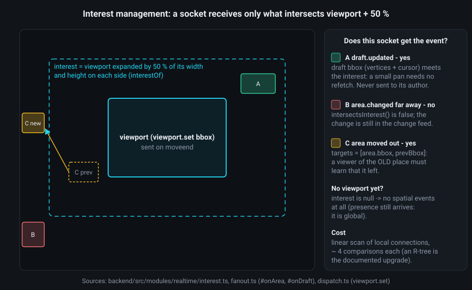
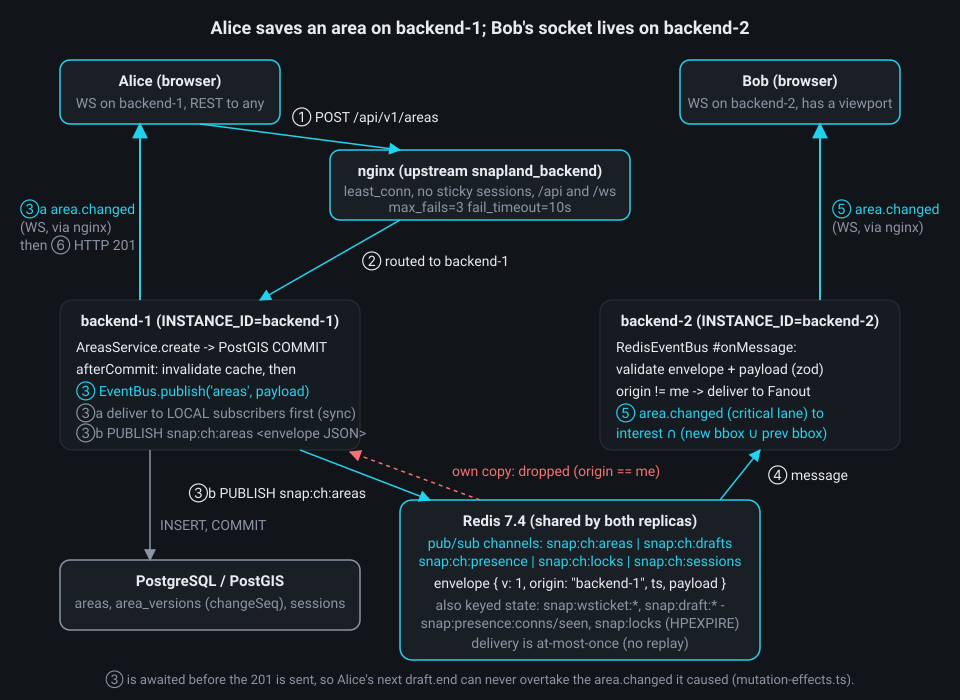
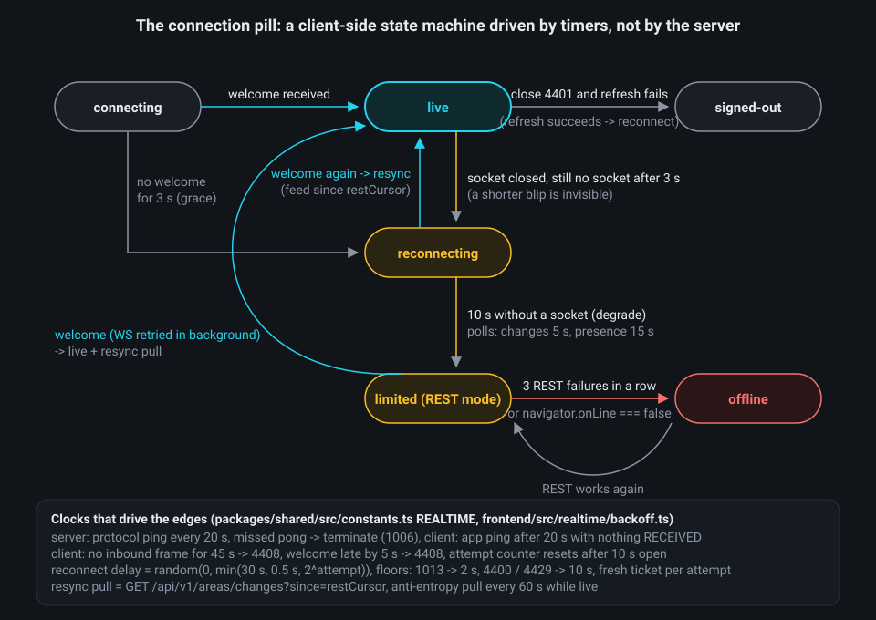

# Chapter 6 - Real-time: the WebSocket gateway and cross-instance fan-out

**What you will learn**

- What a WebSocket is, and why Snapland keeps every write on REST and uses the socket only for events.
- How a browser gets in: one-time tickets, six checks before the upgrade, and why `welcome` is always the first message (inside the first frame, a `batch`).
- The `snapland.v1` protocol: the envelope, `ref`/`ack`, strict-in/loose-out schemas, heartbeats and close codes.
- How presence, live drafts and soft locks live in Redis so that any replica can serve any user.
- How two replicas see each other's events, how a slow tab is contained, and how the client survives lost messages.

**Why this matters**

Collaborative drawing means Bob must see Alice's polygon grow and see it appear the moment she saves. HTTP cannot do that: a server can only answer a request. Snapland also runs two backend processes behind nginx (Chapter 2), so the two sockets usually live in different processes that share no memory. This chapter explains how events are pushed to browsers, how they cross replicas, and how the app keeps working when the socket is blocked, a replica dies or Redis is down.

## 6.1 The problem: HTTP can only answer

A **WebSocket** is a long-lived, two-way channel between a browser and a server. It starts as an ordinary HTTP `GET` carrying `Upgrade: websocket`; if the server agrees it answers `101 Switching Protocols`, and from then on the same TCP connection carries small **frames** in both directions, at any time.

Snapland uses that channel for **events only**. Every durable write stays a REST call (ADR-0004): validation, rate limits, audit and OpenAPI exist once, and the app still works when the socket cannot be opened. What the socket adds is *seeing*: other users' drafts, presence, soft locks, and `area.changed` for committed writes. The contract is shared by backend, frontend and tests:

```ts
// packages/shared/src/constants.ts:82-86
export const REALTIME = {
  wsPath: '/ws',
  subprotocol: 'snapland.v1',
  /** Client draft.update throttle (10 Hz). */
  draftUpdateMinIntervalMs: 100,
```

A **subprotocol** is a dialect name the client offers in `Sec-WebSocket-Protocol` and the server confirms:

```ts
// backend/src/app.ts:118-125
  await app.register(websocket, {
    options: {
      maxPayload: container.config.WS_MAX_PAYLOAD_BYTES,
      perMessageDeflate: container.config.WS_PERMESSAGE_DEFLATE,
      // Select snapland.v1 when offered; the realtime route rejects upgrades without it (400) before upgrading.
      handleProtocols: (protocols: Set<string>) =>
        protocols.has(REALTIME.subprotocol) ? REALTIME.subprotocol : false,
    },
```

What to notice: `maxPayload` is 64 KiB (`backend/src/config/env.ts:181`), so a bigger frame is refused by the library with close code 1009. Compression is off by default (`env.ts:191`).

## 6.2 Getting in: a ticket, six gates, then `welcome`


**The ticket.** Browsers cannot set an `Authorization` header on `new WebSocket(url)`, so the credential must travel in the URL or in the first message. URLs get copied into logs; a first message leaves an unauthenticated socket open. Snapland's answer (ADR-0006) is a **one-time ticket**: `POST /api/v1/auth/ws-ticket`, called with the normal bearer token, returns 32 random bytes valid for 30 seconds and usable once.

```ts
// backend/src/infra/auth/ws-tickets.ts:56-68
    async issue(claims) {
      const ticket = randomBytes(32).toString('base64url');
      const stored = await redis.cmd.set(
        keys.wsTicket(hashTicket(ticket)),
        JSON.stringify(claims),
        'EX',
        ttlS,
        'NX',
      );
      // 256 random bits cannot collide in practice; NX only guarantees that a ticket is never silently replaced.
      if (stored !== 'OK') throw new Error('WebSocket ticket collision');
      return { ticket, expiresAt: new Date(clock.now() + ttlS * 1000) };
    },
```

What to notice: Redis stores only the SHA-256 (`hashTicket`) for 30 s (`env.ts:180`); the claims carry the profile and `absoluteExpiresAt`, so the upgrade needs no user lookup; consumption is `redis.cmd.getdel(...)` (`ws-tickets.ts:72`), read-and-delete in one atomic command, which makes it single-use.

**The gate.** Everything that can reject does so as plain HTTP, before a socket exists, so a bad client never holds a socket and every rejection is counted and audited. The `/ws` route's `preValidation` hook first refuses while the instance is shutting down (503, `gateway.ts:101-106`), then hands the request to `authorizeUpgrade` in `upgrade-auth.ts`. The order is deliberate:

```ts
// backend/src/modules/realtime/upgrade-auth.ts:69-81
  try {
    checkOrigin(request.headers.origin, deps.config.CORS_ORIGINS);
    checkSubprotocol(request.headers['sec-websocket-protocol']);
    const claims = await consumeTicket(request.query, deps.wsTickets);
    context.userId = claims.userId;
    context.sessionId = claims.sessionId;
    await checkSession(claims, deps);
    const reservation = reserve(claims.userId, deps);
    // Returns the slot if the upgrade never completes (aborted handshake); a no-op once the socket is registered.
    request.raw.socket.once('close', () => {
      reservation.release();
    });
    return { claims, reservation };
```

What to notice: Origin is checked before the ticket is consumed, so a cross-site page cannot burn a user's ticket; a *missing* Origin is rejected too (`upgrade-auth.ts:97-104`). The session is checked against the Redis revocation marker *and* the database row (`upgrade-auth.ts:151-164`). Capacity (5000 per instance, 10 per user, `env.ts:183-184`) is reserved last, so a rejected upgrade never occupies a slot. The grant (the ticket claims and the reservation) is kept for the upgrade handler (`gateway.ts:105`). Even earlier, in Fastify's `onRequest` phase, a per-IP limit of 60 upgrades per minute (`env.ts:189`, `gateway.ts:100`) means a flood consumes no tickets.

**`welcome` is always the first message.** The client needs `welcome` (connection id, instance id, profile, `latestChangeSeq`, limits), `presence.snapshot` and `lock.snapshot` before anything else makes sense. While the server reads Redis for those, the client may already send frames and fan-out for other users may arrive. Both are buffered:

```ts
// backend/src/modules/realtime/connection.ts:178-198
  /** Queues a message; before `becomeReady` it is held back so that `welcome` is always the first message. */
  send(message: OutboundMessage): void {
    if (this.#closing) return;
    if (this.ready) {
      this.outbound.enqueue(message);
      return;
    }
    if (this.#beforeReady.length >= this.#maxBeforeReady) {
      this.close(CLOSE_CODES.TRY_AGAIN_LATER, 'too many events during the handshake');
      return;
    }
    this.#beforeReady.push(message);
  }

  /** Queues the handshake messages (welcome, snapshots), then everything held back, and opens the connection. */
  becomeReady(initial: readonly OutboundMessage[]): void {
    if (this.#closing) return;
    for (const message of initial) this.outbound.enqueue(message);
    for (const message of this.#beforeReady.splice(0)) this.outbound.enqueue(message);
    this.ready = true;
  }
```

What to notice: "first message" is not "first frame". `becomeReady` enqueues the three handshake messages together, the flush runs on the next `setImmediate` (`outbound-queue.ts:232-238`) and packs everything pending into one frame (section 6.9), so the first frame a browser sees is normally a `batch` whose `messages[0]` is `welcome`, followed by `presence.snapshot` and `lock.snapshot`. The integration-test harness unwraps that batch (`backend/test/integration/realtime/realtime-harness.ts:67-73`) and `gateway.int.test.ts:46-56` asserts the order.

Inbound frames need no buffer of their own: the gateway pushes the handshake as the *first task* of the connection's serial inbound queue (`gateway.ts:211-217`), and every frame that arrives meanwhile is validated on arrival and queued behind it. `gateway.int.test.ts:74-86` sends a `ping` right after the 101 and receives `welcome`, the two snapshots, then the `pong`. (Before the simplification pass a separate buffer of up to 64 early frames did this job; section 6.12.)

## 6.3 The wire format: `{ type, ref?, data }`

Every frame is UTF-8 JSON with three keys: `type`, `data`, and an optional `ref`, a **correlation id** chosen by the client and echoed on exactly one `ack` or `error`. That is how the frontend turns a fire-and-forget frame into a promise: `request` in `frontend/src/realtime/RealtimeClient.ts:249-264` assigns `c-1`, `c-2`, ... and the reply is resolved at lines 461-471. `draft.start`, `draft.end` and `lock.acquire` use it; `viewport.set` and `presence.update` go through `send` without a `ref` (`Workspace.ts:418-429`).

The client sends nine types, the server sixteen (full tables in `docs/SPEC.md` section 7.4 and section 7.5, lines 576 and 590):

| Direction | Types |
|---|---|
| client -> server | `viewport.set`, `presence.update`, `draft.start`, `draft.update`, `draft.touch`, `draft.end`, `lock.acquire`, `lock.release`, `ping` |
| server -> client | `welcome`, `ack`, `error`, `pong`, `presence.snapshot`, `lock.snapshot`, `presence.joined`, `presence.updated`, `presence.left`, `area.changed`, `draft.updated`, `draft.ended`, `lock.acquired`, `lock.changed`, `resync.required`, `batch` |

**Strict in, loose out.** Client-to-server schemas use `z.strictObject` (`packages/shared/src/protocol/client-messages.ts:23-25`): an unknown key or type is rejected and counted as invalid, because the server must never guess. Server-to-client schemas use `z.looseObject` and never throw:

```ts
// packages/shared/src/protocol/server-messages.ts:167-180
/** Parses an already JSON-decoded server frame without throwing (forward compatible, see the module comment). */
export function parseServerMessage(value: unknown): ServerParseResult {
  const { type } = peekEnvelope(value);
  if (type === null)
    return { kind: 'invalid', type: null, issues: [{ path: 'type', message: 'type is required' }] };
  if (!isServerMessageType(type)) return { kind: 'unknown', type };
  const parsed = ServerMessageSchema.safeParse(value);
  if (!parsed.success) return { kind: 'invalid', type, issues: toProtocolIssues(parsed.error) };
  const message = parsed.data;
  if (message.type === 'batch') {
    return { kind: 'batch', results: message.data.messages.map((inner) => parseServerMessage(inner)) };
  }
  return { kind: 'message', message };
}
```

What to notice: an unknown type yields `{ kind: 'unknown' }`, so a newer server never breaks an older tab; a `batch` frame (section 6.9) is parsed message by message.

**No sequence numbers.** TCP orders frames on one socket, and across instances order is settled by data: `area.changed` carries the global `changeSeq`, areas carry a `version` where higher wins, drafts a per-draft `rev` (`docs/SPEC.md:574`, section 6.10).

## 6.4 Staying alive: two heartbeats and the close codes

A dead TCP peer can look "open" for minutes. The server sends a WebSocket *protocol* ping every 20 s (`env.ts:182`) and terminates any socket that did not answer the previous one:

```ts
// backend/src/modules/realtime/heartbeat.ts:10-33
export function startHeartbeat(registry: ConnectionRegistry, intervalMs: number, logger: Logger): Cancel {
  return repeat(
    () => intervalMs,
    () => {
      for (const connection of registry.values()) {
        if (!connection.alive) {
          connection.log.info('WebSocket heartbeat timeout; terminating');
          connection.terminate();
          continue;
        }
        connection.alive = false;
        try {
          connection.socket.ping();
        } catch (error) {
          // ping() throws only when the socket is not open; its close event does the cleanup.
          logger.debug({ err: error, connectionId: connection.id }, 'ping on a closing socket');
        }
      }
    },
    (error) => {
      logger.error({ err: error }, 'heartbeat failed');
    },
  );
}
```

What to notice: the socket's `pong` listener sets `alive` back to `true` (`gateway.ts:197-199`); `terminate()` sends no close frame (`connection.ts:216-224`), because a dead peer would never read one; the recorded code is 1006. `repeat` (`timers.ts:31-39`) schedules the next round only after the previous one settled, with an unref'd timer, the same helper presence and session re-validation use.

Browsers cannot see protocol pings, so the client has its own *application* `ping`. The subtle part (a v1.2 fix in ADR-0004) is *when*: after 20 s with nothing **received**, not when its own sends are idle. Otherwise a user streaming drafts while everyone else is quiet would never ping and would declare the server dead.

```ts
// frontend/src/realtime/RealtimeClient.ts:413-416
  private onInbound(): void {
    this.pingTimer.arm(REALTIME.clientPingAfterInboundIdleMs);
    this.livenessTimer.arm(REALTIME.clientLivenessTimeoutMs);
  }
```

Every inbound frame re-arms both timers: 20 s until the next `ping`, 45 s of silence until close 4408 and reconnect (`constants.ts:89-94`); a `welcome` late by 5 s also gives 4408. Close codes are part of the contract:

```ts
// packages/shared/src/protocol/close-codes.ts:2-24
export const CLOSE_CODES = {
  /** Normal closure (logout, page unload): do not reconnect when user-initiated. */
  NORMAL: 1000,
  /** Graceful server shutdown: reconnect with backoff (another instance picks up). */
  GOING_AWAY: 1001,
  /** Binary frame received: reconnect and report via POST /client-errors. */
  UNSUPPORTED_DATA: 1003,
  /** Abnormal closure (network loss, terminate): reconnect with backoff. */
  ABNORMAL: 1006,
  /** Message larger than 64 KiB: reconnect and report. */
  MESSAGE_TOO_BIG: 1009,
  INTERNAL_ERROR: 1011,
  /** Slow consumer / overloaded: reconnect with backoff (min 2 s), then resync. */
  TRY_AGAIN_LATER: 1013,
  /** Too many invalid messages: reconnect after >= 10 s and report. */
  INVALID_MESSAGES: 4400,
  /** Session revoked or expired: refresh the access token once, then reconnect or sign out. */
  SESSION_REVOKED: 4401,
  /** Client-side heartbeat / welcome timeout. */
  HEARTBEAT_TIMEOUT: 4408,
  /** Message flood: reconnect after >= 10 s. */
  FLOOD: 4429,
} as const;
```

## 6.5 One misbehaving tab must not hurt the rest

Each connection owns a **token bucket**: a counter holding 40 tokens, refilled at 20 per second, paying one per inbound message (`protocol-limits.ts:5-7`). When it is empty the pipeline branches:

```ts
// backend/src/modules/realtime/dispatch.ts:73-90
    const { type, ref } = peekEnvelope(value);
    if (!connection.bucket.tryTake(this.#deps.clock.now())) {
      this.#throttled(connection, type, ref);
      return;
    }
    const parsed = parseClientMessage(value);
    if (!parsed.ok) {
      const message =
        parsed.code === 'UNKNOWN_MESSAGE_TYPE'
          ? `Unknown message type ${String(parsed.type)}.`
          : 'The message does not match the snapland.v1 schema.';
      this.#invalid(connection, typeLabel(parsed.type), parsed.code, message, parsed.ref, parsed.issues);
      return;
    }
    const message = parsed.message;
    this.#deps.metrics.wsMessagesReceivedTotal.inc({ type: message.type });
    const queued = connection.inbound.push(() => this.#handleSafely(connection, message));
    if (!queued) this.#throttled(connection, message.type, message.ref ?? null);
```

What to notice: throttled `draft.update`, `draft.touch`, `presence.update` and `viewport.set` are dropped *silently* (`dispatch.ts:23-29`) because newer state will follow; other types get `error THROTTLED`. More than 200 throttled messages in 10 s closes with 4429; more than 20 invalid in 60 s closes with 4400 (`protocol-limits.ts:8-13`). Valid messages run through a per-connection serial queue, so replies keep request order. `DRAFT_NOT_FOUND` for an id the connection once owned is answered but not counted (`invalid-accounting.ts`).

## 6.6 Interest management: send only what the user can see

With thousands of polygons and many drawers, sending every event to every socket would waste server and browser CPU. Each connection declares its **viewport** with `viewport.set` on every map `moveend`; the server keeps a larger **interest** region and delivers a spatial event only if the event's bbox intersects it.



```ts
// backend/src/modules/realtime/interest.ts:11-24
export const INTEREST_MARGIN = 0.5;

export function interestOf(viewportBbox: Bbox): Bbox {
  return expandBbox(viewportBbox, INTEREST_MARGIN);
}

/**
 * True when `interest` intersects at least one non-null target box. A connection without a viewport (null interest)
 * receives no spatial events; a null target (e.g. an area without a previous bbox) is skipped.
 */
export function intersectsInterest(interest: Bbox | null, targets: readonly (Bbox | null)[]): boolean {
  if (interest === null) return false;
  return targets.some((target) => target !== null && bboxesIntersect(interest, target));
}
```

What to notice: the 50 % margin means a small pan needs no refetch. For `area.changed` the targets are `[payload.area.bbox, payload.prevBbox]` (`fanout.ts:99`), so a viewer of the *old* place learns that the area moved away. A `draft.updated` targets the draft's bbox (vertices plus cursor, `drafts.ts:364-370`) and is never echoed to its author; a `draft.ended` reaches every connection with a viewport *and always the owner*, which must learn that its draft expired (`fanout.ts:129-132`). The scan is linear; an R-tree past about 10,000 connections per instance is the documented upgrade (SPEC section 7.8).

## 6.7 Shared state in Redis: presence, drafts, locks

Because nginx may send the next socket to either replica, nothing about a user may live only in one process. Three pieces of state live in Redis, each built so that a crashed replica leaves no ghosts, but in two different ways. Drafts and locks carry a **TTL** (time to live: Redis deletes the key, or the hash field, by itself when it is up): `SET ... EX` for the draft record (`redis-draft-registry.ts:27`), `HPEXPIRE` for a lock field (`lock-store.ts:41`). Presence has no TTL: `snap:presence:conns` and `snap:presence:seen` are written with plain `HSET`/`ZADD` (`presence-store.ts:15-19`); each entry carries a last-seen timestamp, and any instance's 15 s sweep removes the entries older than 45 s. Multi-step operations are **Lua scripts**, which Redis runs atomically.

**Presence** ("who is online, doing what") is a hash `snap:presence:conns` (connectionId -> profile JSON) plus a sorted set `snap:presence:seen` scored by last-seen time (`backend/src/infra/redis/keys.ts:57-58`). Every instance refreshes its own connections every 15 s and sweeps everybody's stale entries every 15 s (`env.ts:193-195`):

```ts
// backend/src/modules/realtime/presence-store.ts:51-62
const SWEEP = new LuaScript(`
local ids = redis.call('ZRANGEBYSCORE', KEYS[2], '-inf', ARGV[1], 'LIMIT', 0, tonumber(ARGV[2]))
local out = {}
for _, id in ipairs(ids) do
  local raw = redis.call('HGET', KEYS[1], id)
  redis.call('HDEL', KEYS[1], id)
  redis.call('ZREM', KEYS[2], id)
  out[#out + 1] = id
  out[#out + 1] = raw or ''
end
return out
`);
```

What to notice: `ZRANGEBYSCORE ... '-inf', cutoff` selects the entries whose last-seen score is older than the 45 s cutoff (`presence.ts:225`); the script is atomic, so exactly one instance removes each of them and announces its `presence.left` (`presence.ts:223-242`); a crashed replica's users vanish within about a minute. The refresh script (`presence-store.ts:33-44`) re-adds an entry a sweep removed while its connection was alive, and the instance re-announces it (`presence.ts:209-219`). Status is derived on the server: an edit draft or a held lock means `editing`, a new-area draft `drawing`, otherwise the reported `viewing`/`idle` (`presence-status.ts:25-32`).

**Drafts** are polygons in progress. Their vertices live in the owning connection's memory; Redis holds only an *ownership record* `snap:draft:<id>` with a 120 s TTL, so nobody can hijack a visible draft id and a reconnecting user can pick the draft up on the other replica:

```ts
// backend/src/infra/drafts/redis-draft-registry.ts:25-43
/** KEYS[1] draft key, ARGV[1] record JSON, ARGV[2] TTL seconds -> 1 claimed, 0 in use. */
const CLAIM = new LuaScript(`
if redis.call('SET', KEYS[1], ARGV[1], 'NX', 'EX', ARGV[2]) then return 1 end
return 0
`);

/**
 * KEYS[1], ARGV[1] userId, ARGV[2] sessionId, ARGV[3] new record JSON, ARGV[4] TTL -> 1 resumed, 0 not found.
 * Same user AND (same session OR a disconnected record): two live tabs never steal each other's draft.
 */
const RESUME = new LuaScript(`
local raw = redis.call('GET', KEYS[1])
if not raw then return 0 end
local record = cjson.decode(raw)
if record.userId ~= ARGV[1] then return 0 end
if record.sessionId ~= ARGV[2] and record.state ~= 'disconnected' then return 0 end
redis.call('SET', KEYS[1], ARGV[3], 'EX', ARGV[4])
return 1
`);
```

What to notice: `SET NX` claims the id only if nobody holds it. A non-resume `draft.start` costs one **drawing action** (ADR-0008), charged *before* the claim (`drafts.ts:144-160`); a resume is free. On socket close the record is marked `disconnected` (`MARK_DISCONNECTED`, lines 64-72) rather than deleted, so a new session of the same user can resume for free (`drafts.int.test.ts:126`).

`draft.update` frames are throttled twice: the browser sends at most 10 per second, and the server coalesces a burst into one bus publish per 50 ms window, repeating a **keyframe** (the latest state) every 5 s so late joiners see an idle draft:

```ts
// backend/src/modules/realtime/draft-coalescer.ts:43-52
  /** Records the latest state; it is published `coalesceMs` after the first push of the window. */
  push(state: T): void {
    if (this.#cancelled) return;
    this.#latest = state;
    if (this.#trailing !== null) return;
    this.#trailing = unrefTimeout(() => {
      this.#trailing = null;
      this.#publish();
    }, this.#options.coalesceMs);
  }
```

A paused user, or the Naming form, sends `draft.touch` every 20 s: it keeps the draft alive but is never relayed (`drafts.ts:104-114`). Without update or touch for 120 s the draft expires (`env.ts:196`).

**Soft locks** are a courtesy signal ("Alice is editing"), not enforcement: REST writes never check them, because optimistic concurrency with field merge (ADR-0005, Chapter 5) is the real correctness mechanism. One hash `snap:locks` holds them all, one field per area, with a per-field TTL of 30 s that the client renews every 10 s:

```ts
// backend/src/modules/realtime/lock-store.ts:32-43
const ACQUIRE = new LuaScript(`
local current = redis.call('HGET', KEYS[1], ARGV[1])
if current then
  local ok, record = pcall(cjson.decode, current)
  if ok and record.userId ~= ARGV[2] then
    return {0, current}
  end
end
redis.call('HSET', KEYS[1], ARGV[1], ARGV[3])
redis.call('HPEXPIRE', KEYS[1], ARGV[4], 'FIELDS', 1, ARGV[1])
return {1}
`);
```

What to notice: `HPEXPIRE ... FIELDS` (hash-field expiration) needs Redis >= 7.4, hence the pinned `redis:7.4.11-alpine` (`docker-compose.yml:88`). Another user gets `LOCK_HELD` with the holder's name. One hash makes the late-joiner `lock.snapshot` a single `HGETALL`. A connection holds at most 3 locks (`env.ts:190`); with Redis down the answer is `LOCK_UNAVAILABLE` and editing stays allowed (`locks.ts:86-91`).

## 6.8 Fan-out across replicas: Redis pub/sub

**Pub/sub** is a Redis feature: a client `PUBLISH`es a string on a named channel and every client `SUBSCRIBE`d to it receives it. Redis keeps nothing: a listener disconnected at that moment never sees the message. That is **at-most-once** delivery.



Every event goes through one bus with five channels, `areas`, `drafts`, `presence`, `locks`, `sessions` (the keys of `BUS_PAYLOAD_SCHEMAS`, `backend/src/infra/events/payloads.ts:83-89`), named `snap:ch:<channel>` on the wire (`keys.ts:49`). Publishing is two steps:

```ts
// backend/src/infra/events/redis-event-bus.ts:54-71
  async publish<C extends BusChannel>(channel: C, payload: BusPayload<C>): Promise<boolean> {
    const envelope: BusEnvelope<BusPayload<C>> = {
      v: 1,
      origin: this.#deps.instanceId,
      ts: this.#deps.clock.now(),
      payload,
    };
    this.#subscribers.deliver(channel, envelope);
    try {
      await this.#deps.redis.cmd.publish(this.#deps.keys.channel(channel), JSON.stringify(envelope));
      this.#deps.metrics.busMessagesTotal.inc({ channel, direction: 'published', result: 'ok' });
      return true;
    } catch (error) {
      this.#deps.metrics.busMessagesTotal.inc({ channel, direction: 'published', result: 'error' });
      this.#logger.warn({ err: error, channel }, 'bus publish failed; remote instances rely on resync');
      return false;
    }
  }
```

Receiving skips the instance's own echo:

```ts
// backend/src/infra/events/redis-event-bus.ts:114-125
  readonly #onMessage = (redisChannel: string, message: string): void => {
    const channel = this.#channelByKey.get(redisChannel);
    if (channel === undefined) return;
    const envelope = this.#parse(channel, message);
    if (envelope === null) {
      this.#deps.metrics.busMessagesTotal.inc({ channel, direction: 'received', result: 'invalid' });
      return;
    }
    if (envelope.origin === this.#deps.instanceId) return;
    this.#deps.metrics.busMessagesTotal.inc({ channel, direction: 'received', result: 'ok' });
    this.#subscribers.deliver(channel, envelope);
  };
```

What to notice: local subscribers are called *synchronously first*, then one `PUBLISH`; when the envelope comes back, `origin === instanceId` drops it, so nothing is delivered twice on the publishing instance. `publish` never throws; a failed publish is logged and the remote side relies on resync (section 6.11). The `Fanout` class turns bus events into server messages:

```ts
// backend/src/modules/realtime/fanout.ts:88-101
  #onArea(payload: AreasBusPayload): void {
    this.#deps.changeSeq.observe(payload.changeSeq);
    const message = criticalMessage('area.changed', {
      changeSeq: payload.changeSeq,
      op: payload.op,
      area: payload.area,
      changedFields: payload.changedFields,
      merged: payload.merged,
      previousName: payload.previousName,
      actor: payload.actor,
    });
    const targets = [payload.area.bbox, payload.prevBbox];
    this.#deliver(message, (connection) => intersectsInterest(connection.interest, targets));
  }
```

What to notice: `criticalMessage` builds a message for the **critical** lane, the one that is never dropped (section 6.9 defines the two lanes; `ephemeralMessage` builds the other kind), and serialises the JSON *once* (`messages.ts:29-47`) so every recipient shares the string. The proof is `backend/test/integration/system/cross-instance-rest-ws.int.test.ts:159`: a REST create on instance A reaches a viewer on instance B within 500 ms, and `expect(message.data['area']).toEqual(created)` asserts the event equals the 201 body.

## 6.9 Backpressure: the two-lane outbound queue

**Backpressure** is what a server does when a consumer cannot keep up. A background tab or a phone on bad Wi-Fi reads frames slowly; unbounded buffering would eat memory. Snapland's rule: committed changes are never silently dropped, cheap state may be.


The classification is a type of the backend's message builder (`CriticalMessageType`, `backend/src/modules/realtime/messages.ts:11-26`; the simplification pass moved it out of the shared package, because only the server's queue uses it): `welcome`, `ack`, `error`, `pong`, both snapshots, `area.changed`, `draft.ended`, `lock.acquired` and `resync.required` are **critical**; `draft.updated`, `presence.joined`, `presence.updated`, `presence.left` and `lock.changed` are **ephemeral** with a key (`fanout.ts:105-116`, `136-152`, `156-160`).

```ts
// backend/src/modules/realtime/outbound-queue.ts:146-162
  #enqueueEphemeral(message: OutboundMessage): void {
    const key = message.key ?? message.type;
    const previous = this.#ephemeral.get(key);
    // Map.set on an existing key keeps its position: latest wins, insertion order is preserved.
    this.#ephemeral.set(key, message);
    if (previous !== undefined) {
      this.#deps.hooks.onDropped(previous.type, 'coalesced');
      return;
    }
    if (this.#ephemeral.size > this.#deps.limits.maxEphemeralKeys) {
      const oldest = this.#ephemeral.entries().next();
      if (oldest.done !== true) {
        this.#ephemeral.delete(oldest.value[0]);
        this.#deps.hooks.onDropped(oldest.value[1].type, 'overflow');
      }
    }
  }
```

What to notice: `Map.set` on an existing key keeps its slot, so a newer `draft.updated` for `draft:<id>` replaces the older one in place. The critical lane is bounded by 500 messages and 1 MiB (`env.ts:187-188`); when full, the queue flushes once and, if still full, reports `critical_overflow` and the connection closes with 1013 (`outbound-queue.ts:125-133`, `connection.ts:158-162`). A `draft.ended` carries `supersedes: 'draft:<id>'` and deletes the pending update of that draft (`outbound-queue.ts:122-124`, `fanout.ts:124-128`).

The flusher runs once per burst (`setImmediate`), sends only while `ws.bufferedAmount` is below 256 KiB (`env.ts:185`), and packs several messages into one `batch` frame of at most 64 KiB by string concatenation:

```ts
// backend/src/modules/realtime/outbound-queue.ts:193-201
    const [only] = parts;
    if (only === undefined) return;
    if (parts.length === 1) {
      this.#deps.socket.send(only.json);
      this.#deps.hooks.onSent([only.type], only.bytes);
      return;
    }
    const frame = `${BATCH_PREFIX}${parts.map((part) => part.json).join(',')}${BATCH_SUFFIX}`;
    this.#deps.socket.send(frame);
```

A socket above the high-water mark for 10 s (`env.ts:186`) is a slow consumer and is closed with 1013 (the server side is tested in `backpressure.int.test.ts:88`); the client then waits at least 2 s (`frontend/src/realtime/backoff.ts:15`) and, because the next `welcome` is a reconnect, pulls the change feed (`handlers.ts:72-79`).

## 6.10 Ordering without sequence numbers

This is where REST and WebSocket must agree on timing. Alice saves: `POST /api/v1/areas` commits, and only then does she send `draft.end { outcome: 'committed' }`. On Bob's screen the ghost must be replaced by the saved polygon *without a flicker*, so `area.changed` must reach him before `draft.ended`. The areas service guarantees it by awaiting the publish before it replies:

```ts
// backend/src/modules/areas/mutation-effects.ts:91-95
  /** Invalidate, then publish - both awaited, neither throws (section 10.2 step 5, section 3.3 EventBus). */
  async afterCommit(change: CommittedChange): Promise<void> {
    await this.#deps.areaCache.invalidate(affectedBboxes(change));
    await this.#deps.events.publish('areas', toBusPayload(change));
  }
```

`areas.service.ts:81` awaits `afterCommit` before building the 201. Since Alice sends `draft.end` only after she has the 201, her `draft.ended` can never overtake the `area.changed` it caused. On the draft side, `#finish` cancels the coalescer and keyframe timers *before* publishing `draft.ended` (`drafts.ts:248-264`), so an instance never emits an update after the end. Bob's browser adds a last line of defence:

```ts
// frontend/src/state/remoteDraftsStore.ts:71-76
  const endedAt = state.ended.get(message.draftId);
  if (endedAt !== undefined && now - endedAt < ENDED_DRAFT_IGNORE_MS) return state;
  const existing = state.drafts.get(message.draftId);
  if (existing !== undefined && existing.user.id !== message.user.id) return state;
  if (existing !== undefined && existing.committedAt !== null) return state;
  if (existing && message.rev < existing.rev) return state;
```

Ended ids are remembered for 30 s, stale `rev`s are ignored, and if `draft.ended committed` ever arrived before the area, the ghost is kept for at most 2 s (`remoteDraftsStore.ts:99-120`, `constants.ts:99-100`). This is "order-independent client state": order comes from `changeSeq`, `version` and `rev`, never from arrival time. The client rules live in `remoteDraftsStore.ts:66-119` and are unit-tested one by one in `remoteDraftsStore.test.ts:47-99` ("ignores an update after draft.ended for the same id for 30 s", "drops stale revs", "keeps a committed ghost at most 2 s"); the server-side half, no `draft.updated` after `draft.end`, is `drafts.int.test.ts:183`.

## 6.11 When things break: reconnect, resync, degrade

Three things go wrong in practice: the socket drops, a message is lost, or no socket can be opened. One client state machine and one source of truth, the REST change feed, handle all three.



**Reconnect with jitter.** When a replica dies, hundreds of sockets close at once; retrying after the same delay would hit the survivor in one instant. **Full jitter** picks a random delay between zero and a ceiling that doubles per attempt:

```ts
// frontend/src/realtime/backoff.ts:7-18
/** Full-jitter delay for `attempt` (>= 1) with an injected `random()` in [0, 1). */
export function backoffDelayMs(attempt: number, random: () => number): number {
  const ceiling = Math.min(REALTIME.reconnectCapMs, REALTIME.reconnectBaseMs * 2 ** attempt);
  return Math.floor(random() * ceiling);
}

/** The minimum delay a close code imposes before the next attempt (0 when none). */
export function closeCodeFloorMs(code: number): number {
  if (code === CLOSE_CODES.TRY_AGAIN_LATER) return 2000;
  if (code === CLOSE_CODES.INVALID_MESSAGES || code === CLOSE_CODES.FLOOD) return 10_000;
  return 0;
}
```

Each attempt fetches a fresh ticket, and a 4401 triggers one token refresh before reconnecting or signing out (`RealtimeClient.ts:321-336`). A graceful `docker compose stop backend-1` closes every socket with 1001 (`gateway.ts:140-149`); nginx routes the retries to backend-2, whose `welcome.instanceId` differs.

**Resync from the feed.** Pub/sub is at-most-once, so the socket alone cannot be trusted. The client treats `GET /api/v1/areas/changes?since=<restCursor>` as the source of truth and pulls it after every reconnect, on `resync.required`, and every 60 s while live (**anti-entropy**: periodic repair of drift nobody noticed):

```ts
// frontend/src/realtime/handlers.ts:69-79
    deps.restate();
    deps.draft.handleWelcome();
    deps.reacquireLocks();
    if (!info.isReconnect) return;
    // Resync (SPEC section 7.12 steps 3-4): the feed from restCursor repairs everything missed while disconnected.
    void deps
      .pullFeed()
      .then(() => {
        if (info.outageMs !== null && info.outageMs >= WS_DEGRADE_AFTER_MS) deps.onBackOnline(info.outageMs);
      })
      .catch(() => undefined);
```

What to notice: after every `welcome` the client restates its viewport and presence, resumes its draft and re-acquires its locks. `pullFeed` reads up to 10 pages of 500 (`areasSync.ts:111-129`); each item is applied only if `version > max(knownVersion, tombstoneVersion)`, and deletes leave a **tombstone** (a remembered "deleted at version N"), so a late older update can never resurrect an area. A 410 `CHANGE_FEED_EXPIRED` or more than 10 pages means "reload the viewport". Every instance pushes `resync.required` to its local clients when its Redis subscriber reconnects (`fanout.ts:76-79` -> `gateway.ts:133-138`).

**Degrade to REST polling.** If no socket can be opened for 10 s, the app enters *limited* mode:

```ts
// frontend/src/realtime/RealtimeClient.ts:353-367
  /** The connection was live and dropped: blips stay invisible for WS_GRACE_MS, REST mode starts after 10 s. */
  private beginOutage(): void {
    this.outageStartedAt = this.deps.scheduler.now();
    this.antiEntropyTimer.cancel();
    this.graceTimer.arm(REALTIME.wsGraceMs);
    this.degradeTimer.arm(REALTIME.wsDegradeAfterMs);
  }

  private enterDegradedMode(): void {
    if (this.welcomed || this.userStopped) return;
    const restFailing = this.restFailures >= OFFLINE_AFTER_REST_FAILURES;
    this.setState(this.deps.isOnline() && !restFailing ? 'limited' : 'offline');
    void this.pollChanges();
    void this.pollPresence();
  }
```

A blip under 3 s is invisible; after 3 s the pill says *reconnecting*; after 10 s it says *limited* and the client polls the change feed every 5 s and `GET /api/v1/presence` every 15 s while still retrying the socket. Three consecutive REST failures, or `navigator.onLine === false`, mean *offline*. Remote drafts and lock badges are cleared because they would be stale (`handlers.ts:55-59`), but saving still works. `docs/benchmarks/t9-smoke.txt:28-33` records the pill at *limited* 10.4 s after `/ws` was blocked, a 201 save in that mode, and the other user's change arriving by polling in 2.7 s. Redis down gives the same path from the other end: `POST /ws-ticket` answers 503, so new sockets are impossible while existing ones keep working.

**Revocation reaches live sockets.** Logout on backend-1 must close the session's sockets on backend-2 too. The `sessions` bus event does that at once (`fanout.ts:164-166` -> `revokeSession`, `gateway.ts:114-119`, close 4401), but it is at-most-once. So every gateway also re-checks its open sockets' sessions against the database every 60 s (+/-10 % jitter) and right after its subscriber reconnects:

```ts
// backend/src/modules/realtime/session-revalidation.ts:86-102
    this.#deps.metrics.wsRevalidationRunsTotal.inc({ result: 'ok' });
    const checked = new Set(sessionIds);
    for (const connection of [...this.#deps.registry.values()]) {
      const sessionId = connection.identity.sessionId;
      // Connections registered after the ids were collected are checked by the next round.
      if (!checked.has(sessionId) || active.has(sessionId) || !connection.isOpen) continue;
      this.#deps.metrics.wsRevalidationClosesTotal.inc();
      this.#log.warn(
        { connectionId: connection.id, sessionId },
        'socket of an inactive session closed by re-validation (a sessions event was lost)',
      );
      try {
        this.#deps.onInactive(connection);
      } catch (error) {
        this.#log.error({ err: error, connectionId: connection.id }, 'closing an inactive session failed');
      }
    }
```

A third mechanism, a per-connection timer armed from the ticket's `absoluteExpiresAt`, closes the socket at the session's absolute expiry (`gateway.ts:255-270`). `ws-auth.int.test.ts:163` revokes a session in the database *without* a bus event and expects the socket closed within about a second; line 242 covers the cross-instance event.

## 6.12 What is architecture and what the simplification pass changed

The simplification pass (`docs/superpowers/plans/2026-09-28-simplify-plan.md`, W1-REALTIME, lines 272-355) ran under one constraint: no REST, WebSocket or database contract changes, except the pre-welcome flood rule below. The architecture is the plan's "Must keep" list (lines 335-353): the two-lane outbound queue and the 1013 close, the token bucket and the 4429/4400 rules, the pre-101 upgrade checks and capacity reservations, the fan-out rules, the Lua scripts, the degradation branches, re-validation, `#beforeReady` and the metrics. Everything in this chapter that describes the wire, Redis shapes, ordering and the client state machine is that durable design.

What the pass changed is the code around it:

- **RT-7** deleted the inbound early-frame buffer (`earlyFrames`, `maxEarlyFrames`, `replayEarlyFrames`) and with it SPEC section 7.8's "more than 64 early frames -> 4429" rule. The handshake is now the first task on `connection.inbound` (`gateway.ts:211-217`), so a frame sent right after the 101 waits behind it (section 6.2); `Connection.#beforeReady` stayed. The durable property is only "welcome is queued before any inbound frame is handled".
- **RT-6** moved the upgrade checks out of the gateway into `upgrade-auth.ts` (`authorizeUpgrade`, the section 6.2 excerpt) and deleted `ConnectionIdentity`/`toIdentity`: a connection's identity is now the ticket claims.
- **RT-1** replaced the `Heartbeat` class with `startHeartbeat(...)` on the shared `repeat` helper (section 6.4); presence and the session re-validator use `repeat` too.
- **RT-3** deleted the `RealtimeSettings` rename layer (`settings.ts`): components take `Pick<AppConfig, …>` and read the env names directly, the fixed protocol numbers live in `protocol-limits.ts`, and `welcome.limits` is built inline in `gateway.ts:239-246` with exactly the same values.
- **RT-5** turned `runNow()` of the session re-validator into a promise chain (`session-revalidation.ts:65-69`).
- **RT-8** dropped the `closeReason` truncation, the `OutboundSink` adapter (the queue now writes to the socket directly, section 6.9) and the test-only getters.
- **RT-2** folded `createRealtime`/`RealtimeRuntime` into `createRealtimeModule`; **RT-4** deleted `unwrap` and other dead helpers from `backend/test/helpers/ws-client.ts` (the harness has its own `unwrap`, section 6.2).

## Try it yourself

1. **Watch the handshake.** Sign in at http://localhost:5173, open DevTools -> Network, filter *WS*, click the `ws?ticket=…` row. Expected: status **101**, `Sec-WebSocket-Protocol: snapland.v1` in request and response. In *Messages*, the first server frame is one `batch`: expand it and you find `{"type":"batch","data":{"messages":[…]}}` with `messages[0]` = `welcome`, then `presence.snapshot`, then `lock.snapshot` (three messages, one frame, section 6.2). Next come your own `viewport.set` and `presence.update` (no `ref`, so no `ack`), then a `presence.updated` whose `presence.userId` is yours: your viewport change is broadcast to everyone including you (`fanout.ts:149-152` excludes only `presence.joined` from its subject). Click *Draw* and place a point: the first frame with a `ref` is `draft.start` with `"ref":"c-1"`, answered by an `ack` with the same ref and `drawActionsRemaining`. Now replay the ticket: copy the socket URL and run `new WebSocket('<that url>', ['snapland.v1'])` in the Console of the same tab. Expected: a new *WS* row with status **401** (`TOKEN_INVALID`), because `GETDEL` consumed the ticket the first time. (As a plain page the same URL gives 404: no `Upgrade` header, no gate, `gateway.ts:102-103`.)

2. **See the bus.** Run `docker compose exec redis redis-cli`, then `SUBSCRIBE snap:ch:areas snap:ch:drafts`. Draw and save an area. Expected: `drafts` messages while drawing (at most one per 50 ms, then a keyframe every 5 s while paused) and on save one `areas` message beginning `{"v":1,"origin":"backend-1"` or `"backend-2"`. In a second `redis-cli`, `KEYS snap:draft:*` shows the ownership record while you draw. Open an incognito window as a second user and compare `welcome.data.instanceId` in both; when they differ you are watching pub/sub fan-out.

3. **Break it on purpose.** Run `docker compose up -d postgres redis redis-cache`, then `npm run test:integration -w @snapland/backend -- test/integration/realtime/backpressure.int.test.ts`. Expected: seven passing tests named after the contract (4429, 1003, 1009, 4400, 1006 on a missed pong, 1013 for a slow consumer, and `resync.required` after the bus subscriber reconnects). Then block only the socket: in DevTools -> Network right-click the `ws?ticket=…` row, choose *Block request URL* and edit the pattern to `*/ws?ticket=*`. `POST /api/v1/auth/ws-ticket` must stay reachable: `*/ws*` would block it too, a failed ticket fetch is a `network` failure (`Workspace.ts:405-415`) that counts as a REST failure (`RealtimeClient.ts:284`), three in a row set the pill to *offline* (`395-399`) and the next successful poll flips it back to *limited* (`401-409`), so you would see offline/limited flapping (section 6.11) instead of the sequence below. Reload the app: the pill shows *connecting*, turns *reconnecting* after about 3 s and *Limited* after about 10 s (both timers are armed in `start()`, `RealtimeClient.ts:188-189`), `GET /api/v1/areas/changes?since=…` appears every 5 s, and saving an area still returns 201. Remove the block: the pill returns to *live* and one feed pull runs. The first half (blocked socket -> *limited* -> a 201 save) runs unattended as `e2e/tests/degradation.spec.ts:9-41`, which routes only WebSockets (`e2e/support/session.ts:167`, `context.routeWebSocket(/\/ws/u, …)`); the recovery is recorded in `docs/benchmarks/t9-smoke.txt:33` ("unblocking /ws -> live again").

## Self-check

1. Why a 30-second single-use ticket instead of the JWT in the WebSocket URL?
2. Name the six upgrade gates in order and the HTTP status each returns.
3. Why is `draft.updated` ephemeral but `draft.ended` critical, and what does `supersedes` do?
4. Two replicas share one Redis channel. Why is nothing delivered twice on the instance that published?
5. What would break if the areas service sent the 201 *before* awaiting the bus publish?

<details>
<summary>Answers</summary>

1. A URL credential leaks into logs and is reusable. A ticket is 32 random bytes stored only as a SHA-256 in Redis with `EX 30 NX` and consumed with `GETDEL`, so a leaked ticket is useless after one use or 30 s (`ws-tickets.ts:56-80`, ADR-0006).
2. Shutting down -> 503; Origin missing or not allowed -> 403; no `snapland.v1` subprotocol -> 400; bad ticket -> 401 `TOKEN_INVALID`; inactive session -> 401 `SESSION_REVOKED`; capacity -> 503 per instance, 429 per user (`gateway.ts:104`, `upgrade-auth.ts:69-81`).
3. `draft.updated` is state where only the newest value matters, so it is keyed `draft:<id>` and replaced in place; `draft.ended` is an event that must not be lost, so it is critical. `supersedes: 'draft:<id>'` deletes that draft's pending update when the end is enqueued (`fanout.ts:124-128`, `outbound-queue.ts:122-124`).
4. `publish` delivers to local subscribers synchronously, then `PUBLISH`es an envelope with `origin: instanceId`; when it comes back, `#onMessage` drops it because `envelope.origin === this.#deps.instanceId` (`redis-event-bus.ts:57`, `122`).
5. Alice sends `draft.end { committed }` as soon as she has the 201. If the 201 preceded the publish, `draft.ended` could reach Bob before `area.changed`: his ghost would vanish before the saved area appeared (a flicker, hidden only by the 2 s grace in `remoteDraftsStore.ts:99-120`). Awaiting `afterCommit` in `areas.service.ts:81` makes the order a guarantee.

</details>

## Further reading

- `docs/adr/0004-realtime-commands-over-rest-events-over-websocket.md` and `docs/adr/0006-auth-jwt-rotating-refresh-and-ws-tickets.md`.
- `docs/SPEC.md`: section 2.2-section 2.3 (lines 185-257), section 7.1-section 7.12 (558-700), section 10.6 (1096).
- `docs/superpowers/plans/2026-09-28-simplify-plan.md` lines 272-355 (W1-REALTIME: what changed, what had to be kept).
- `packages/shared/src/protocol/` (its test, `protocol.test.ts`, parses every example of `packages/shared/src/testing/protocol-examples.ts`); `backend/src/modules/realtime/`; `backend/src/infra/events/redis-event-bus.ts`.
- `frontend/src/realtime/` and `frontend/src/state/areasSync.ts`, `remoteDraftsStore.ts` (Chapter 8); `docker/nginx/nginx.conf:84-94`, `140-154` (Chapter 9).
- Tests: `backend/test/integration/realtime/*.int.test.ts`, `backend/test/integration/system/cross-instance-rest-ws.int.test.ts`, `e2e/tests/degradation.spec.ts` (Chapter 10).
