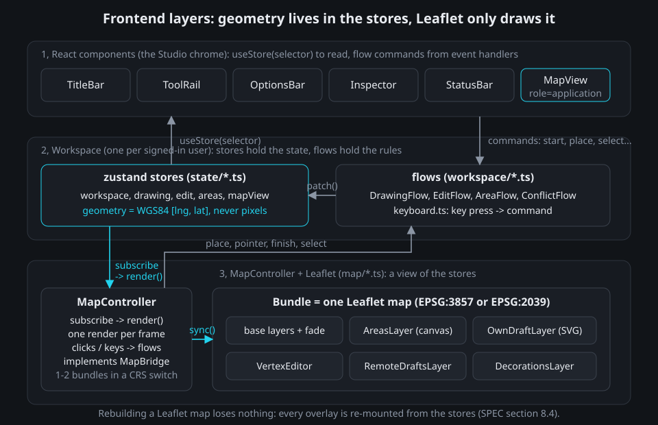
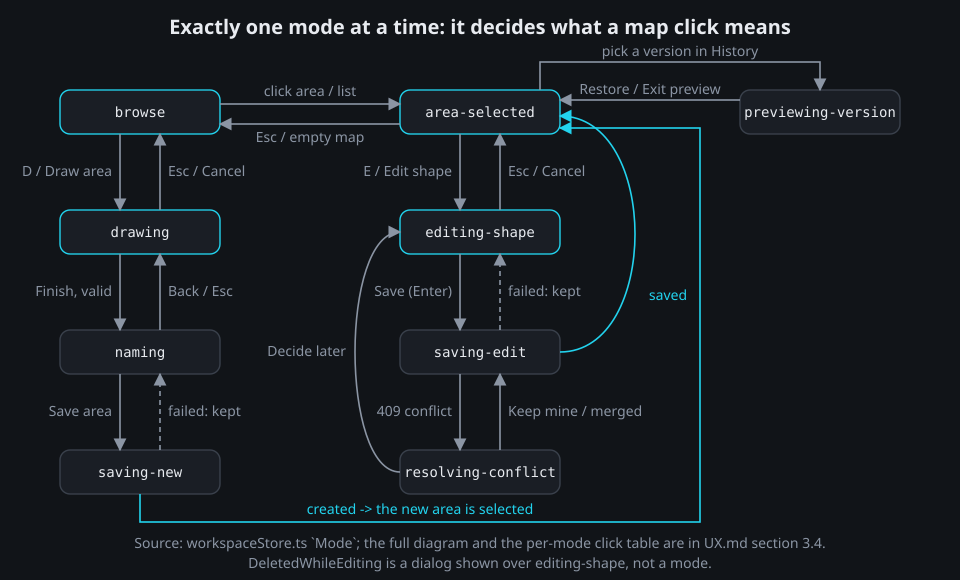
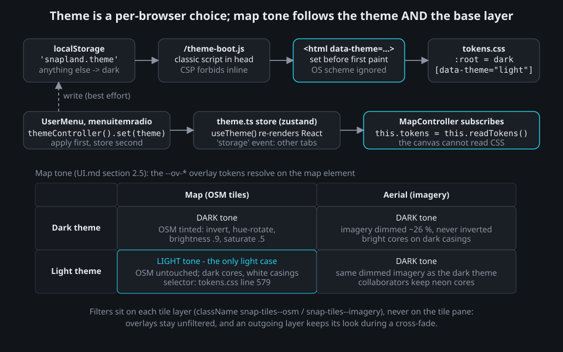

# Chapter 7 - The frontend: React, Leaflet, custom drawing and projections

**What you will learn**

- How the SPA is layered: React chrome on top, zustand stores and "flows" in the middle, one imperative `MapController` at the bottom, and why geometry lives only in the stores.
- How a single `mode` string decides what a map click means, and how drawing and editing are pure reducers that the map only renders.
- Why the live km² readout is computed on the WGS84 ellipsoid, never from pixels.
- What a real projection switch (EPSG:3857 <-> EPSG:2039) costs in Leaflet, and how a second stacked map, a zoom mapping with a memory and a load-gated cross-fade hide it.
- Where the Studio design tokens, the dark-by-default theme and the accessibility rules land in code.

## Why this matters

The assignment asks for a Leaflet map with two base layers, "a smooth layer transition", drawn elements that "remain properly positioned when switching layers", area calculations "as the polygon is being drawn", and "coordinate transformations between different map projections" (`instractions.md`, sections 4-6). No drawing plugin is used: the polygon tool is hand-written.

The trap is to let Leaflet own the data. An `L.Polygon` that exists only on a map is stored in that map's projection and dies when the map is rebuilt. Snapland's answer is one rule, stated at the top of the store bundle:

`frontend/src/app/stores.ts:1-4`
```ts
/**
 * Every client store, created once per app instance (tests create their own bundle). Geometry lives only in these
 * stores, as WGS84 lat/lng; the map, the HUD and the panels are views of them (SPEC section 8.4).
 */
```

Everything in this chapter follows from that rule. The stack is React 19, Vite 8, Leaflet 1.9.4, proj4 with proj4leaflet, and zustand 5 (`frontend/package.json`); there is no router library and no Redux.

> **Architecture vs. code.** The backend simplification pass left `frontend/**` alone while the Studio redesign was under way (`docs/superpowers/plans/2026-09-28-simplify-plan.md:8`). Its frontend follow-up then applied decision D-7 (the plan's addendum, `:831-841`, and *Final-QA follow-ups*, `:958-965`): the GovMap 2025 proxy branch, its Esri + GovMap 2025 `aerial` group, the fallback notice, the "Aerial 2022" option and the labels pane are gone, and section 8 describes the result. A broader frontend simplification audit is still an open follow-up, so file names and helper counts may change. What to keep overall is the shape: stores own geometry, reducers are pure, the controller is a renderer, and a projection switch is a new map.

## 1. Three layers



A **store** is a small zustand object holding state plus a few setters; React components subscribe to slices of it with `useStore(store, selector)`. A **flow** is a plain class holding the rules of one user job: `DrawingFlow`, `EditFlow`, `AreaFlow` and `ConflictFlow` in `frontend/src/workspace/`. The `Workspace` class creates them, one workspace per signed-in user (`frontend/src/workspace/WorkspaceView.tsx:160-175`), so a user switch disposes everything and `resetUserStores()` (`stores.ts:56`) empties every per-user store.

React touches Leaflet in exactly one place, an effect that mounts the controller:

`frontend/src/map/MapView.tsx:43-61`
```tsx
  useEffect(() => {
    const element = host.current;
    if (element === null) return undefined;
    const controller = new MapController({
      host: element,
      workspace,
      services,
      scheduler: systemScheduler,
      frames: browserFrames,
      reducedMotion: prefersReducedMotion,
      coarsePointer: () => globalThis.matchMedia('(pointer: coarse)').matches,
      isPhone: () => globalThis.matchMedia('(max-width: 599.98px)').matches,
    });
    workspace.attachMap(controller);
    return () => {
      workspace.attachMap(null);
      controller.dispose();
    };
  }, [services, workspace]);
```

**What to notice.** Timers, animation frames and media queries are injected, which is why `MapController.test.ts` runs under jsdom with manually flushed animation frames (`manualFrames()`, `frontend/src/map/MapController.test.ts:21-39`; the scheduler passed in is the real `systemScheduler`). `workspace.attachMap(controller)` hands the flows a `MapBridge` (`frontend/src/workspace/context.ts:20-39`: focus, fit, project a point) without letting them import Leaflet. React never talks to Leaflet directly, and Leaflet never talks to the Snapland server at all: its only requests are tile images, fetched straight from the tile servers (OpenStreetMap and Esri, `frontend/src/map/baseLayers.ts:18-20`; GovMap's 2022 cache, `frontend/src/map/itm.ts:35`).

## 2. The Studio frame

The frame is product decision D-4 (`docs/adr/0010-studio-redesign.md`): title bar, tool rail, options bar (the drawing HUD), inspector and status bar docked around the map. CSS grid places them while the DOM keeps the tab order of UX.md section 8.2:

`frontend/src/styles/shell.css:33-41`
```css
  display: grid;
  grid-template-columns: var(--frame-rail) minmax(0, 1fr) var(--frame-inspector);
  grid-template-rows: var(--frame-topbar) var(--frame-optbar) minmax(0, 1fr) var(--frame-status);
  grid-template-areas:
    'title title title'
    'rail optbar inspector'
    'rail map inspector'
    'status status status';
  background: var(--color-bg);
```

Three layouts exist: `docked` from 1,200 px, `overlay` from 600 px and `phone` below. `useLayout()` in `frontend/src/app/AppContext.tsx:59-64` derives them from media queries, and the React layer writes the value into the workspace store so the flows can read it too. The map is a grid cell that never resizes for overlays, and the options bar keeps a constant height in every mode, so the map box does not jump on a mode change (`frontend/src/components/frame/OptionsBar.tsx:1-6`).

## 3. The mode machine



Exactly one mode is active. It is a string in the workspace store, mirrored onto `map[data-mode]`:

`frontend/src/state/workspaceStore.ts:12-22`
```ts
/** `map[data-mode]` values (UX section 3.4). */
export type Mode =
  | 'browse'
  | 'drawing'
  | 'naming'
  | 'saving-new'
  | 'area-selected'
  | 'editing-shape'
  | 'saving-edit'
  | 'resolving-conflict'
  | 'previewing-version';
```

The store only holds the value; transitions live in the flows (`DrawingFlow.start()` patches `mode: 'drawing'` and `finish()` patches `mode: 'naming'`, `frontend/src/workspace/drawingFlow.ts:106-107` and `:188`). The controller reads the mode to route a click:

`frontend/src/map/MapController.ts:819-838`
```ts
  private onClick(event: L.LeafletMouseEvent): void {
    const mode = this.stores.workspace.getState().mode;
    const latlng = event.latlng;
    if (mode === 'drawing') {
      this.onDrawingClick(latlng);
      return;
    }
    if (mode === 'editing-shape') {
      const edit = this.stores.edit.getState().edit;
      if (edit?.moveArmed === true) this.workspace.edit.moveSelectedTo(fromLatLng(latlng));
      else if (edit?.selected !== null) this.workspace.edit.select(null);
      return;
    }
    if (mode === 'browse' || mode === 'area-selected') {
      this.hideTooltip();
      const hit = this.hitAt(latlng);
      if (hit !== null) this.workspace.area.select(hit.id, 'map');
      else if (mode === 'area-selected') this.workspace.area.close();
    }
  }
```

**What to notice.** Hit-testing (`hitAt`) works on lat/lng with the shared exact point-in-ring predicate, not on Leaflet click targets: saved areas sit on a non-interactive canvas, and the smallest polygon under the pointer wins whatever the draw order (`frontend/src/map/hitTest.ts:1-5`). Small pure helpers next to `Mode` encode the UX section 3.4 table: `allowsDoubleClickZoom(mode)` is true only in `browse` and `area-selected`. The flows stamp `dblClickZoomAfter = now + DBLCLICK_ZOOM_REENABLE_MS` (400 ms) into the workspace store when they enter those modes (`frontend/src/workspace/areaFlow.ts:114` and `:196`, `drawingFlow.ts:501`), and `onModeChange` (`MapController.ts:956-976`) re-enables Leaflet's double-click zoom only once that time has passed, so a finishing double-click never zooms.

## 4. MapController: a renderer, not a model

`MapController` subscribes to every store that can change what is on the map (`areas`, `drawing`, `edit`, `remoteDrafts`, `locks`, `effects`, `workspace`, the clock, toasts and notices; `MapController.ts:923-952`) and coalesces all of them into one render per animation frame:

`frontend/src/map/MapController.ts:978-984`
```ts
  private scheduleRender(): void {
    if (this.renderFrame !== null || this.disposed) return;
    this.renderFrame = this.deps.frames.request(() => {
      this.renderFrame = null;
      this.render();
    });
  }
```

`render()` calls `renderBundle()` for each stacked map (`:998-1096`); that method reads the stores and calls `sync(...)` on `AreasLayer`, `DecorationsLayer`, `OwnDraftLayer`, `RemoteDraftsLayer` and `VertexEditor`. Each layer diffs its input against what it drew last time (`OwnDraftLayer.sync` compares a JSON signature, `frontend/src/map/OwnDraftLayer.ts:77-88`), so a pointer move does not rebuild two thousand point glyphs.

Each Leaflet map is created with its own chrome switched off, because the app renders the switcher, zoom buttons and attribution once for all stacked maps:

`frontend/src/map/mapInstance.ts:63-77`
```ts
  const map = L.map(container, {
    crs: kind === 'itm' ? createItmCrs() : L.CRS.EPSG3857,
    center,
    zoom,
    minZoom: kind === 'itm' ? ITM_MIN_ZOOM : MAP_MIN_ZOOM,
    maxZoom: kind === 'itm' ? ITM_MAX_ZOOM : MAP_MAX_ZOOM,
    zoomControl: false,
    attributionControl: false,
    keyboard: false,
    doubleClickZoom: false,
    boxZoom: false,
    worldCopyJump: kind === 'mercator',
    zoomSnap: 1,
    wheelPxPerZoomLevel: 90,
  });
```

**What to notice.** The `crs` option is the whole difference between a "Map" map and an ITM map. Leaflet's CRS is fixed at construction, which is why section 8 has to create a second map. The same file defines overlay panes with fixed z-indices (`PANES`, `mapInstance.ts:18-29`) so stacking is identical on both kinds of map. Saved areas go on one `L.canvas` renderer, drawn largest-first so nested areas stay on top (`frontend/src/map/AreasLayer.ts:1-6`); my draft, the handles and others' drafts are SVG so they can carry the `data-testid`s the E2E suite asserts.

## 5. Drawing: from a click to a point


The controller applies the two pixel-space rules, because only it knows pixels:

`frontend/src/map/MapController.ts:840-859`
```ts
  /** Point placement with the duplicate guard and snap-to-first (UX C-06.2). */
  private onDrawingClick(latlng: L.LatLng): void {
    const points = this.stores.drawing.getState().drawing.points;
    const first = points[0];
    const last = points.at(-1);
    const coarse = this.coarse();
    const snap = coarse ? SNAP_FIRST_POINT_TOUCH_PX : SNAP_FIRST_POINT_PX;
    if (points.length >= 3 && first !== undefined && this.pixelDistance(first, latlng) <= snap) {
      this.lastClickRefused = false;
      this.workspace.drawing.finish();
      return;
    }
    const duplicate = coarse ? DUPLICATE_POINT_TOUCH_PX : DUPLICATE_POINT_PX;
    if (last !== undefined && this.pixelDistance(last, latlng) <= duplicate) {
      this.lastClickRefused = false;
      return;
    }
    const result = this.workspace.drawing.place(fromLatLng(latlng));
    this.lastClickRefused = result === 'refused';
  }
```

The constants are 12 px to snap onto the first point (22 px on touch) and 6 px to ignore a duplicate of the last point (12 px on touch), from `frontend/src/constants/ux.ts`. After `place()` nothing knows about pixels. `DrawingFlow.place()` (`drawingFlow.ts:131-156`) runs the reducer, stores the result, announces the outcome to the status live region and streams the draft (chapter 8). The reducer first brings a candidate into the drawing's longitude frame and quantises it to 7 decimals (about 1.1 cm), the precision the server stores (SPEC section 8.7):

`frontend/src/state/drawingReducer.ts:95-100`
```ts
/** Brings a raw Leaflet lat/lng into the drawing's longitude frame (SPEC section 9.2 antimeridian policy). */
function normalizeCandidate(points: readonly Position[], candidate: Position): Position {
  const last = points.at(-1);
  const lng = last === undefined ? wrapLongitude(candidate[0]) : unwrapLongitude(last[0], candidate[0]);
  return quantize7([lng, candidate[1]]);
}
```

`frontend/src/state/drawingReducer.ts:123-143`
```ts
/** Adds a point (UX C-06.2, C-06.5): refused when it would cross, fold back, leave the map or exceed the limit. */
export function addPoint(
  state: DrawingState,
  raw: Position,
  limits: DrawingLimits = DEFAULT_DRAWING_LIMITS,
): AddPointResult {
  const candidate = normalizeCandidate(state.points, raw);
  const last = state.points.at(-1);
  if (last !== undefined && samePosition(last, candidate)) {
    return { outcome: 'ignored', state, code: null };
  }
  const problem = placementProblem(state.points, candidate, limits);
  if (problem !== null) {
    return {
      outcome: 'refused',
      code: problem.code,
      state: { ...state, refusal: { code: problem.code, kind: 'place', issue: problem.issue } },
    };
  }
  return { outcome: 'added', state: { ...state, points: [...state.points, candidate], refusal: null } };
}
```

**What to notice.** A point that would make the chain cross itself is refused, not accepted-and-flagged (UX-AC-15). Because the placed chain is therefore always simple, `newPointIssue` (`frontend/src/lib/drawGeometry.ts:108-113`) only tests the one new edge against the others, with the shared integer segment predicates from `packages/shared/src/geo/segments.ts`, so the client can never disagree with the server's validator (chapter 5). `finish()` then runs the full shared `validatePolygon` on the closed ring plus the runtime limits from `/api/v1/config` (`finish()` via `finishProblem()`, `drawingReducer.ts:198-226`).

The keyboard path is the same pipeline with a different first step: arrows pan (`frontend/src/workspace/keyboard.ts:120-130`), `Space` places at the reticle drawn by `MapView`, `Enter` finishes, `Backspace` undoes (`keyboard.ts:133-137`); `MapController.onMapKey` calls the same `workspace.drawing.place()`. On the way out, `OwnDraftLayer` draws the placed edges, the rubber-band to the pointer and a dotted closing preview as SVG paths derived from `points` and `pointer`; on touch there is no hover, `pointer` is null, and the placed points are shown closed (`OwnDraftLayer.ts:1-8`).

## 6. The geodesic preview

The readout must match the server's stored `areaKm2` to 1e-9 relative (SPEC section 8.5), so it cannot come from pixels or from Web Mercator metres: measured in Web Mercator, an Israeli polygon comes out 1.35-1.42x too large (`docs/SPEC.md:777`). The shared package uses GeographicLib's Karney algorithm on the WGS84 **ellipsoid** (the flattened sphere that models the Earth), the same algorithm behind PostGIS `ST_Area(geography)`:

`packages/shared/src/geo/geodesic.ts:39-50`
```ts
/**
 * Area in km² of a polygon (exterior minus holes), rings in `[lng, lat]`. A ring may be open (the live drawing: its
 * vertices plus the cursor point); a ring of fewer than 3 distinct vertices has no area.
 */
export function geodesicArea(rings: readonly (readonly (readonly number[])[])[]): number {
  let areaM2 = 0;
  rings.forEach((ring, index) => {
    const { areaM2: ringArea } = ringMetrics(ring);
    areaM2 += index === 0 ? ringArea : -ringArea;
  });
  return Math.max(0, areaM2) / 1e6;
}
```

The frontend question is *which ring* to measure while the user is still drawing. `deriveDrawing()` (`drawingReducer.ts:345-399`) measures the placed points plus the pointer as a provisional point when that ring is simple; otherwise the placed points alone; otherwise nothing, shown as "Area - ". A pointer resting on the point just placed, or on the first point it would close at, is not a provisional point:

`frontend/src/state/drawingReducer.ts:299-307`
```ts
function restingPointer(state: DrawingState): Position | null {
  const { points, pointer } = state;
  if (pointer === null) return null;
  const last = points.at(-1);
  const first = points[0];
  if (last !== undefined && samePosition(pointer, last)) return null;
  if (points.length >= 3 && first !== undefined && samePosition(pointer, first)) return null;
  return pointer;
}
```

The HUD exposes the raw value as `area-readout[data-km2]` (`frontend/src/components/Hud.tsx:115-121`) so tests can assert parity without parsing text; `formatArea()` in `frontend/src/lib/format.ts` picks m² or km² for display, and the value is never rounded before that. Chapter 3 covers the ellipsoid and PostGIS side.

## 7. Editing: handles over a pure reducer

Editing an existing area follows the same pattern with a second reducer. `EditFlow` starts from the full-precision `AreaDto`, takes the advisory geometry lock, streams the edit as a draft with `areaId`, and saves with `PATCH … baseVersion` (`frontend/src/workspace/editFlow.ts:1-6`; conflicts are chapters 5 and 8). The reducer validates every operation on the closed ring and snaps an invalid move back:

`frontend/src/state/editReducer.ts:83-103`
```ts
/** Moves point `index` (drag release, keyboard, *Move point*); an invalid result snaps back (UX-AC-33). */
export function movePoint(
  state: EditState,
  index: number,
  position: Position,
  limits: DrawingLimits = DEFAULT_DRAWING_LIMITS,
): EditState {
  if (index < 0 || index >= state.points.length) return state;
  const points = state.points.map((point, i) =>
    i === index ? quantizePosition(position, COMMITTED_DECIMALS) : point,
  );
  const problem = ringProblem(points, limits);
  if (problem !== null) {
    return {
      ...state,
      moveArmed: false,
      refusal: problem === 'too-large' ? 'too-large' : 'reverted-crossing',
    };
  }
  return { ...commit(state, points, index), moveArmed: false };
}
```

`VertexEditor` turns the edit state into draggable Leaflet markers, with one subtlety: Leaflet ends a drag if its marker is destroyed, so handles are never rebuilt mid-drag:

`frontend/src/map/VertexEditor.ts:76-84`
```ts
    const points = input.points.map((point, index) =>
      input.dragging?.index === index ? input.dragging.position : point,
    );
    this.syncShape(points, input);
    if (input.dragging !== null) {
      // Rebuilding handles would end Leaflet's gesture, so only the midpoints next to the dragged point move.
      this.moveMidpoints(points, input.dragging.index);
      return;
    }
```

**What to notice.** Point handles are 24 px hit targets, 44 px on coarse pointers; a midpoint handle exists only for edges longer than 40 px on screen, 88 px on touch (`VertexEditor.ts:1-7`). Keyboard editing (`]`/`[` cycle, `I` insert, `Delete`; `keyboard.ts:139-146`) and arrow nudging of the selected point (`keyboard.ts:123-125`) run the same reducer through `MapController.onMapKey`.

## 8. Base layers, and the cross-CRS switch

*Aerial*, the required satellite view, is GovMap's 2022 orthophoto cache in the Israeli grid, EPSG:2039, which needs no Referer header. The product owner chose it (decision D-1, ADR-0009), and that turns the required Map <-> Aerial toggle into a real projection switch. A build with the ITM kill switch off (`VITE_ENABLE_ITM_LAYER=false`) shows Esri World Imagery instead, a Web Mercator layer (`frontend/src/map/baseLayers.ts:1-10`). Until decision D-7 there was a third option, GovMap's 2025 orthophoto through a backend tile proxy that sent GovMap's Referer for the browser (ADR-0007); D-7 deleted the proxy and the SPA's branch for it:

`frontend/src/state/mapViewStore.ts:15-22`
```ts
/**
 * *Aerial* is the GovMap 2022 ITM cache (`govmap-itm`, user decision D-1), or Esri World Imagery (`aerial`) in a build
 * whose `VITE_ENABLE_ITM_LAYER` kill switch is off (SPEC section 8.3).
 */
export function resolveBaseLayer(choice: LayerChoice, itmLayerEnabled: boolean): BaseLayerId {
  if (choice === 'map') return 'map';
  return itmLayerEnabled ? 'govmap-itm' : 'aerial';
}
```

The value ends up in `map[data-base-layer]` as `map`, `govmap-itm` or, in the no-ITM build, `aerial`.

### 8.1 Same CRS: the load-gated cross-fade

When both layers share EPSG:3857 (Map <-> Esri in the no-ITM build), a switch is only a fade between tile layers. Both Mercator layers declare `maxZoom: 21` above their native maximum (`maxNativeZoom` 19; `baseLayers.ts:85-94`), so a switch never forces a zoom change. The fade has three rules, stated at the top of the file:

`frontend/src/map/crossfade.ts:1-6`
```ts
/**
 * Base-layer cross-fade (SPEC section 8.4, UI.md section 8 S9, UX section 7): the incoming layer is added at opacity 0 above the outgoing
 * one; it fades in (250 ms, ease-out, rAF) once it fired `load` or after 1.5 s; the outgoing layer stays underneath at
 * full opacity and is removed only after the incoming layer's `load` - capped 5 s after the switch began - so there is
 * never a frame without an opaque layer. A second switch completes the running one early (latest choice wins, never
 * two fades stacked). With reduced motion the swap is instant, but removal still waits for `load`.
```

`BaseLayerCrossfade` works on a small `FadeLayer` interface (`show`, `setOpacity`, `bringToFront`, `remove`, `onLoad`, `isLoaded`; `crossfade.ts:15-26`). That abstraction is what makes the next section cheap.

### 8.2 Different CRS: a second map


A **CRS** (coordinate reference system) says how a lat/lng becomes metres on a flat grid. EPSG:2039, the Israeli Transverse Mercator grid, is defined once with proj4 and shared by the tile layer and the coordinate readout:

`frontend/src/map/itm.ts:10-15`
```ts
/** The current 7-parameter epsg.io definition (SPEC section 8.1); PostGIS' 3-parameter shift differs by ~ 9.7 m. */
export const ITM_PROJ4 =
  '+proj=tmerc +lat_0=31.7343936111111 +lon_0=35.2045169444444 +k=1.0000067 +x_0=219529.584 +y_0=626907.39 ' +
  '+ellps=GRS80 +towgs84=23.772,17.49,17.859,-0.3132,-1.85274,1.67299,-5.4262 +units=m +no_defs';

proj4.defs(EPSG_2039, ITM_PROJ4);
```

proj4leaflet wraps that definition into a Leaflet CRS with the cache's origin and its ladder of 13 resolutions (L0-L10 native, L11-L12 overzoom; `itm.ts:23-27`):

`frontend/src/map/itmLayer.ts:22-28`
```ts
export function createItmCrs(): L.Proj.CRS {
  return new L.Proj.CRS(EPSG_2039, ITM_PROJ4, {
    origin: [ITM_ORIGIN[0], ITM_ORIGIN[1]],
    resolutions: [...ITM_RESOLUTIONS],
    bounds: L.bounds([ITM_BOUNDS[0], ITM_BOUNDS[1]], [ITM_BOUNDS[2], ITM_BOUNDS[3]]),
  });
}
```

GovMap's cache does not use `{z}/{x}/{y}` paths, so `GovmapItmTileLayer` overrides `getTileUrl` with `L{LL}/R{row:08x}/C{col:08x}.jpg` (`itm.ts:65-68`).

Now the hard part. The two grids have different zoom ladders, so "zoom 15" means nothing to the ITM map. The app maps zooms by **ground resolution**, metres per screen pixel at the map centre: `mercatorMpp` is `156543.03 · cos(lat) / 2^zoom`, and the target is the ITM level whose resolution is nearest in log2 (`frontend/src/map/crs.ts:12-34`). This mapping is not one-to-one: at Tel Aviv z15 and z16 both map to L7, and L7 maps back to z16, so a naive round trip would change the user's zoom. The **round-trip rule** fixes that:

`frontend/src/map/crs.ts:57-75`
```ts
export class CrsZoomMemory {
  private memory: { fromZoom: number; toLevel: number } | null = null;

  toItm(lat: number, mercatorZoom: number, maxLevel: number = ITM_MAX_LEVEL): ZoomMapping {
    const level = mercatorZoomToItmLevel(lat, mercatorZoom);
    const clampedLevel = Math.min(level, maxLevel);
    this.memory = { fromZoom: mercatorZoom, toLevel: clampedLevel };
    return { zoom: clampedLevel, clamped: clampedLevel !== level };
  }

  toMercator(lat: number, itmLevel: number, minZoom: number, maxZoom: number): ZoomMapping {
    const remembered = this.memory;
    this.memory = null;
    if (remembered?.toLevel === itmLevel) return { zoom: remembered.fromZoom, clamped: false };
    const zoom = itmLevelToMercatorZoom(lat, itmLevel);
    const clampedZoom = Math.max(minZoom, Math.min(maxZoom, zoom));
    return { zoom: clampedZoom, clamped: clampedZoom !== zoom };
  }
}
```

The switch itself asks `crsMemory` for the target zoom (`MapController.ts:424-433`), creates a new bundle at the carried centre and that zoom, then hands the whole container to the same cross-fade class:

`frontend/src/map/MapController.ts:434-440`
```ts
    const hadFocus = this.deps.host.contains(document.activeElement);
    const bundle = this.createBundle(target, center, targetZoom);
    this.showBaseLayer(bundle, id, true);
    this.containerFade.switchTo(this.containerFadeFor(bundle));
    // The new map takes input at once; the old one stays visible underneath until the new base layer has loaded.
    this.primary = bundle;
    this.onLayerDisplayed(bundle.fade.active as BaseLayerHandle);
```

Note the order: `this.primary = bundle` and `onLayerDisplayed(...)` run synchronously, at t = 0, so `data-base-layer`, the overlay tokens and the attribution swap the moment the switch starts, before a single tile has loaded (`onLayerDisplayed`, `MapController.ts:403-410`). The container fade's `onMidpoint` (`:264-266`) only calls `setPrimary(bundle)`, which returns early because the bundle is already primary (`:373`). It is the same-CRS tile fade of section 8.1 that swaps these at the fade midpoint (`createBundle`'s `onMidpoint`, `:307-309`).

**What to notice.** No overlay is converted in app code. `createBundle` builds a fresh `AreasLayer`, `OwnDraftLayer` and so on for the new map, and the next `render()` re-mounts everything from the stores; proj4leaflet applies the WGS84 -> ITM datum shift when it projects each lat/lng. Drafts, selection and handles survive the switch untouched, which is what `e2e/tests/layer-switch.spec.ts` asserts (`:89-138`): three points placed on Map stay in place on Aerial, with the centre within 1e-6° and the live km² within 1e-9; a fourth point placed on Aerial survives the switch back to Map the same way.

The same proj4 definition powers the status-bar coordinate readout, so the projection transformation is visible in every build:

`frontend/src/components/CoordReadout.tsx:25-31`
```tsx
  const position = pointer ?? center;
  // Leaflet reports continuous longitudes after panning across +/-180; wrap only then, so exact values stay exact.
  const lng =
    position.lng >= -180 && position.lng < 180
      ? position.lng
      : ((((position.lng + 180) % 360) + 360) % 360) - 180;
  const { e, n } = toItm(lng, position.lat);
```

## 9. The Studio design system and theming



Every visual value comes from one file, `docs/design/tokens.css`, imported by `frontend/src/main.tsx:7` before the app's own styles; the collaborator palette in `packages/shared` must match it (ADR-0010, D-6). Dark values sit on `:root` (`tokens.css:24`) and light ones under `:root[data-theme="light"]` (`:478`); there is no `prefers-color-scheme` query.

**Theme (decision D-5).** Dark is the default, the OS preference is ignored, and the choice is per browser. The Content Security Policy forbids inline scripts, so the pre-paint step is a same-origin classic script loaded from `<head>` in `frontend/index.html`:

`frontend/public/theme-boot.js:8-17`
```js
(function () {
  var theme = 'dark';
  try {
    var stored = window.localStorage.getItem('snapland.theme');
    if (stored === 'light' || stored === 'dark') theme = stored;
  } catch {
    // Storage unavailable (private window, blocked site data): dark.
  }
  document.documentElement.setAttribute('data-theme', theme);
})();
```

The user menu's *Theme* group (`role="menuitemradio"`, `frontend/src/components/frame/UserMenu.tsx:41-57`) calls `themeController().set(theme)`, which applies first and stores second inside `try/catch` (`frontend/src/theme/theme.ts:64-77`); `useTheme()` re-renders React from the controller's zustand store.

**Map tone.** Overlay colours follow the *map tone*, which depends on both the theme and the base layer. Imagery is always dark tone; OSM is tinted in the dark theme and untouched only in the light theme:

`docs/design/tokens.css:355-358`
```css
  --map-backdrop-osm: #1b1e22;
  --map-backdrop-imagery: #0b0e12;
  --map-filter-osm: invert(1) hue-rotate(180deg) brightness(0.9) contrast(0.86) saturate(0.5); /* dark: OSM tinted */
  --map-filter-imagery: brightness(0.74) saturate(0.82) contrast(1.06);                        /* imagery dimmed ~26 %, never inverted */
```

The filters are applied per tile layer through Leaflet's `className` option (`snap-tiles--osm`, `snap-tiles--imagery`), never on the tile pane, so overlays stay unfiltered and an outgoing layer keeps its own look during a fade (`frontend/src/styles/map.css:70-79`). One consumer cannot read CSS: the saved-areas canvas. So the controller reads the few tokens it needs from the host's computed style and re-reads them on a theme change:

`frontend/src/map/MapController.ts:947-951`
```ts
      // The OSM map tone depends on the theme (UI.md section 2.5, section 13): the canvas cannot read CSS, so re-read its colours.
      themeController().store.subscribe(() => {
        this.tokens = this.readTokens();
        render();
      }),
```

**What to notice.** Every overlay line is a "core on a casing": `casedPath()` in `frontend/src/map/overlayUtil.ts` builds up to three SVG paths per line. UI.md section 2.6 records that every palette colour keeps at least 3:1 against its casing on any map pixel, checked by `docs/design/contrast-check.mjs`.

## 10. Accessibility

The rules are UX.md section 8 and section 10 (WCAG 2.2 AA); here is where they land.

**The map is an application region with instructions** that change with the mode (`MapView.tsx:63-68`):

`frontend/src/map/MapView.tsx:72-83`
```tsx
      <div
        ref={host}
        id="map"
        className="map"
        data-testid="map"
        data-mode={mode}
        data-base-layer={baseLayer}
        tabIndex={0}
        aria-label={copy.a11y.mapLabel}
        aria-describedby="map-instructions"
        role="application"
      />
```

**Three live regions, mounted once**: status (polite), collaboration (a log) and alerts (assertive). Continuously changing readouts, such as the live km² and the coordinates, are deliberately not live regions:

`frontend/src/components/LiveRegions.tsx:15-25`
```tsx
    <div className="sr-only">
      <div role="status" aria-live="polite" data-testid="live-status">
        <span key={status.seq}>{status.text}</span>
      </div>
      <div role="log" aria-live="polite" aria-relevant="additions" data-testid="live-collab">
        <span key={collab.seq}>{collab.text}</span>
      </div>
      <div role="alert" aria-live="assertive" data-testid="live-alert">
        <span key={alert.seq}>{alert.text}</span>
      </div>
    </div>
```

**Single-key shortcuts that can be turned off.** WCAG 2.1.4 requires that single-character shortcuts can be turned off (or remapped, or made active only on focus); Snapland also never fires them in text fields, its own rule UX-AC-71 (`isTypingTarget`, `keyboard.ts:150-161`). The keyboard map is a pure function over a context object:

`frontend/src/workspace/keyboard.ts:76-86`
```ts
  if (context.typing || context.modal) return null;
  if (event.key === 'F2') return context.mode === 'area-selected' ? 'rename' : null;
  if (event.key === 'Delete') {
    // With the map focused in EditingShape, Delete removes the selected point (map key); otherwise it deletes the area.
    return context.mode === 'area-selected' && !context.detailsEditing ? 'delete' : null;
  }
  if (!context.singleKeys || event.altKey) return null;
  const command = SINGLE_KEYS[event.key.length === 1 ? event.key.toLowerCase() : ''];
  if (command === undefined) return null;
  if (AREA_COMMANDS.has(command) && context.mode !== 'area-selected') return null;
  return command;
```

**Other rules you can find.** Rail buttons carry `aria-label`, `aria-pressed` and `aria-keyshortcuts` (`frontend/src/components/frame/ToolRail.tsx:76-85`); a skip link is the first focusable element (`frontend/src/styles/base.css:214-234`); the map's focus ring is drawn inside its frame (`map.css:20-26`); `prefers-reduced-motion` makes the cross-fade instant (`crossfade.ts:139`); and every Leaflet HTML sink goes through `frontend/src/map/safe-dom.ts`, which sets `textContent` and never parses a string as HTML, so an area name cannot inject markup.

## Try it yourself

The stack must be running (`docker compose up -d --build`, then http://localhost:5173; chapter 9). Sign in and open the browser console.

0. **Zoom in first.** A first visit opens at `DEFAULT_VIEW`, zoom 8 over 31.5° N (`frontend/src/constants/ux.ts:106`), where three clicked corners span hundreds of kilometres and the reducer would refuse with `too-large`. Scroll-zoom into Tel Aviv until the status bar's zoom cell (`[data-testid="status-zoom"]`) reads `z 15`. The ITM level named in exercise 2 assumes that zoom; from another zoom you get a different level.

1. **Watch the reducer refuse a crossing.** Press `D`, click three corners of a triangle, then move the pointer so the rubber-band would cross an existing edge: the cursor becomes *not-allowed* (`map.css:57-58`). Click anyway. *Expected:* `[data-testid="point-count"]` keeps `data-count="3"`, the two conflicting edges are drawn in the invalid style with a x marker, and `[data-testid="live-status"]` contains the refusal text. `document.querySelector('[data-testid="area-readout"]').dataset.km2` is the raw geodesic value the server will store.

2. **Switch projections mid-draw.** With the three points placed, press `L`. *Expected:* `document.querySelector('[data-testid="map"]').dataset.baseLayer` becomes `govmap-itm`, the attribution changes to GovMap, the points sit on the same places in the imagery, and `data-km2` is unchanged to the last digit. `[data-testid="status-zoom"]` shows the Web-Mercator-equivalent zoom in its text while its `data-zoom` attribute holds the ITM level (7 for zoom 15 over Tel Aviv). Press `L` again: back to `map` at exactly your previous zoom (the round-trip rule). Zoom in once on Aerial before pressing `L`, and the formula is used instead.

3. **Run the pure tests.** In `frontend/`, run `npx vitest run src/map/crs.test.ts src/state/drawingReducer.test.ts`. *Expected:* all tests pass, including "round trip: Map(z15) -> ITM -> Map restores z15" and "a bowtie point is refused with data-code crossing (UX-AC-15 rule)" (`drawingReducer.test.ts:81`). Neither file touches a browser or Leaflet.

## Self-check

1. Where does a polygon live while the user is drawing it, and in which coordinate system?
2. Why does switching from *Map* to *Aerial* (default configuration) create a second Leaflet map instead of swapping tile layers?
3. What problem does `CrsZoomMemory` solve?
4. Why is the live km² not computed from screen pixels or Web Mercator metres?
5. How does the page show the right theme before the first paint without an inline script?

<details>
<summary>Answers</summary>

1. In the `drawing` zustand store, as `points: Position[]` in WGS84 `[lng, lat]`, quantised to 7 decimals by `drawingReducer.addPoint`. `OwnDraftLayer` is only a projection of that array; a map rebuild loses nothing.
2. Leaflet's CRS is fixed when `L.map()` is created. *Map* is EPSG:3857 and the default *Aerial* (`govmap-itm`) is EPSG:2039, so `MapController.switchBaseLayer` creates a new bundle with `createMapInstance(host, 'itm', center, targetZoom)` and cross-fades the whole container, keeping the old map underneath until the new base layer has loaded (cap 5 s).
3. The zoom mapping by ground resolution is not one-to-one (z15 and z16 both map to L7 at Tel Aviv, and L7 maps back to z16), so a plain round trip would change the zoom. `CrsZoomMemory` remembers `{ fromZoom, toLevel }` on the way into ITM and restores `fromZoom` on the way back if the level is unchanged.
4. Web Mercator is a display projection that stretches area by 1.35-1.42x in Israel, and the readout must equal the server's `ST_Area(geography)` within 1e-9 relative. So `geodesicArea` in `packages/shared/src/geo/geodesic.ts` runs GeographicLib's Karney algorithm on the WGS84 ellipsoid over the quantised ring.
5. `index.html` loads `/theme-boot.js` in `<head>` as a same-origin classic script, allowed by `script-src 'self'`. It reads `localStorage['snapland.theme']` inside `try/catch` and sets `<html data-theme>` to `light` or `dark` before the stylesheet applies; `tokens.css` then selects the token set, with no `prefers-color-scheme` query.

</details>

## Further reading

- `docs/SPEC.md` section 8.1 (coordinate systems), section 8.3 (base layers and decision D-1), section 8.4 (layer switching that keeps geometry in place), section 8.5 (area calculation), section 8.6 (frontend architecture), section 8.7 (precision rules).
- `docs/adr/0007-govmap-orthophoto-via-same-origin-tile-proxy.md` (the deleted 2025 proxy, kept as the record of why that imagery is not used), `docs/adr/0009-default-aerial-govmap-itm-cache.md`, `docs/adr/0010-studio-redesign.md`, `docs/superpowers/specs/2026-09-28-studio-redesign-design.md`.
- `docs/design/UX.md` section 3.4 (mode machine), section 7 (base-map switching), section 8 (keyboard map and focus), section 10 (accessibility checklist); `docs/design/UI.md` section 2.5 (map tone), section 9 (map styling), section 13 (themes).
- Code: `frontend/src/app/stores.ts`, `frontend/src/workspace/Workspace.ts`, `frontend/src/state/workspaceStore.ts`, `frontend/src/map/MapController.ts`, `frontend/src/state/drawingReducer.ts`, `frontend/src/lib/drawGeometry.ts`, `frontend/src/map/OwnDraftLayer.ts`, `frontend/src/state/editReducer.ts`, `frontend/src/map/VertexEditor.ts`, `frontend/src/map/crossfade.ts`, `frontend/src/map/crs.ts`, `frontend/src/map/itm.ts`, `frontend/src/map/itmLayer.ts`, `frontend/src/theme/theme.ts`, `frontend/public/theme-boot.js`, `docs/design/tokens.css`, `frontend/src/map/safe-dom.ts`, `packages/shared/src/geo/geodesic.ts`.
- Tests: `frontend/src/map/crs.test.ts`, `frontend/src/state/drawingReducer.test.ts`, `frontend/src/map/crossfade.test.ts`, `frontend/src/theme/theme.test.ts`, `e2e/tests/layer-switch.spec.ts`, `e2e/tests/studio-frame.spec.ts`.
