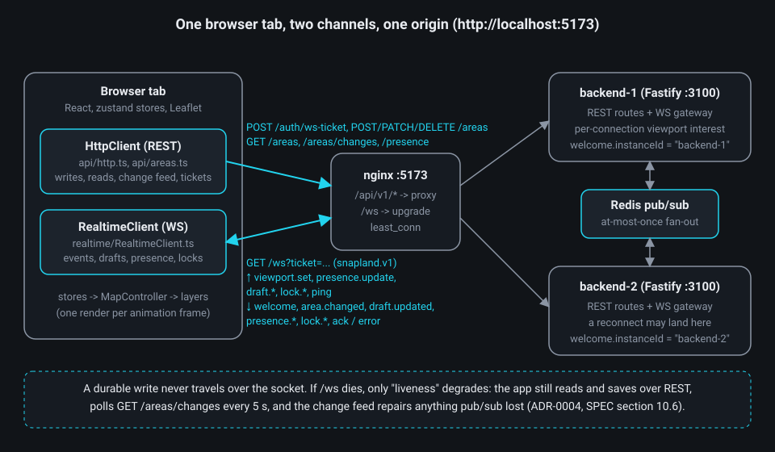
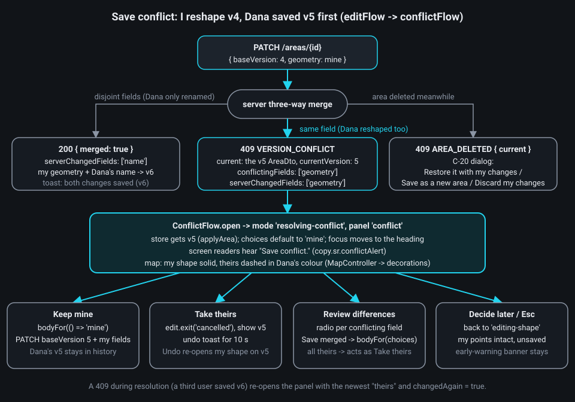

# Chapter 8 - The frontend: real-time client, conflicts and resilience

**What you will learn**

- Why every write is a REST call and the WebSocket carries only events, and how a 30-second ticket keeps the JWT out of the socket URL.
- How `RealtimeClient` moves between *connecting -> live -> reconnecting -> limited -> offline* (plus *signed-out*) with injectable timers, and why liveness is judged on inbound traffic only.
- How the areas store stays correct when events arrive in any order: the version rule, tombstones, `restCursor` and the region catch-up.
- How presence and other people's drafts are received, filtered and drawn, and what limited mode must clear.
- How a 409 becomes the conflict panel (*Keep mine / Take theirs / Review differences / Decide later*), and how session expiry keeps your unsaved drawing alive.

**Why this matters**

Chapter 7 built a map you can draw on. This chapter makes it a *shared* map that survives the real world: a Wi-Fi blip on a phone, a replica dying during a deploy, two replicas delivering events in different orders, a colleague saving the polygon you are reshaping, a session expiring while you hold six unsaved points. None of these may lose work or show a stale lie (a ghost draft that stopped moving, a lock badge for someone who left).

The *rules* below (REST versus WebSocket, the state machine and its thresholds, the feed and apply rules, the draft receiver rules, the conflict vocabulary, the refresh rules) are architecture fixed by the ADRs and SPEC section 7. The file layout is the code of 2026-09-29: the simplification pass left `frontend/**` alone while the Studio redesign ran (`docs/superpowers/plans/2026-09-28-simplify-plan.md:8`), except for the D-7 follow-up that removed the GovMap 2025 proxy branch (Chapter 7), and a frontend simplification audit is still an open follow-up (`:827`).

## 1. Two channels: commands over REST, events over WebSocket

A **WebSocket** is a long-lived, two-way connection the server can push to at any time. It is tempting to send everything over it; Snapland does not. Every durable write (create, update, delete, restore) is an HTTP call; the socket carries only what must be *fast* or *ephemeral*.

**`docs/adr/0004-realtime-commands-over-rest-events-over-websocket.md:10-17`**

```md
## Decision
- **One write path.** Every durable mutation (create/update/delete/restore) is a REST call through the same service. The WebSocket
  (`/ws`, subprotocol `snapland.v1`, raw `ws` via `@fastify/websocket`) carries:
  - committed-change events (`area.changed` with the global `changeSeq`);
  - ephemeral drafts (`draft.updated` at <= 10 Hz, coalesced, with keyframes);
  - presence;
  - advisory soft locks;
  - heartbeats.
```

Two terms in that list, defined now: a **keyframe** is the server re-sending a draft's latest state *at the same `rev`* every 5 s while it is idle, so late joiners see it and receivers know it is alive (`docs/SPEC.md:626`); a **soft lock** is an advisory "Alma is editing" badge (30 s TTL, renewed every 10 s) that REST never enforces, because correctness must not depend on the socket (ADR-0005 lines 23-24).

The client-side proof is the message union: there is no `area.create` message anywhere.

**`packages/shared/src/protocol/client-messages.ts:27-67`**

```ts
export const ClientMessageSchema = z.discriminatedUnion('type', [
  clientMessage(
    'viewport.set',
    z.strictObject({ bbox: BoundedBboxSchema, zoom: z.number().int().min(0).max(LIMITS.maxZoom) }),
  ),
  clientMessage('presence.update', z.strictObject({ status: z.enum(['viewing', 'idle']) })),
  // ... draft.start, draft.update, draft.touch, draft.end, lock.acquire ...
  clientMessage('lock.release', z.strictObject({ areaId: UuidSchema })),
  clientMessage('ping', z.strictObject({ t: z.number() })),
]);
```

(`clientMessage(type, data)`, lines 23-25, builds each member as a strict `{ type, ref?, data }` object.)



**What to notice.** Because saves never depended on the socket, losing it costs almost nothing: only "liveness" degrades (SPEC section 10.6, `docs/SPEC.md:1100`). The socket carries *fast hints*; the REST change feed is the *truth* that repairs whatever at-most-once pub/sub lost. Both channels use the page origin: nginx on `:5173` and the Vite dev server on `:5174` both proxy `/ws` to a backend (`docs/SPEC.md:24`, `:916`).

## 2. The handshake: a ticket instead of the JWT

Browsers cannot set an `Authorization` header on a WebSocket upgrade, and putting the 15-minute access token in the URL would leak it into proxy and access logs. So the client first asks REST for a **ticket**, a random single-use string that lives 30 s (SPEC section 7.2, `docs/SPEC.md:564`; ADR-0006 lines 21-23), then opens the socket with `?ticket=…` and the subprotocol `snapland.v1`.

**`frontend/src/workspace/Workspace.ts:105-109`**

```ts
/** `ws(s)://<host>/ws?ticket=...` on the page origin (the Vite proxy / nginx forward it, SPEC section 7.1). */
export function socketUrl(ticket: string, location: Pick<Location, 'protocol' | 'host'>): string {
  const scheme = location.protocol === 'https:' ? 'wss' : 'ws';
  return `${scheme}://${location.host}${REALTIME.wsPath}?ticket=${encodeURIComponent(ticket)}`;
}
```

Every connection attempt fetches a *fresh* ticket, and the result is mapped to three outcomes (`Workspace.fetchTicket`, `Workspace.ts:405-415`): a `SESSION_ENDED` error signs the client out, a network error counts as a REST failure, anything else just retries.

**`frontend/src/realtime/RealtimeClient.ts:272-294`**

```ts
    let ticket: TicketResult;
    try {
      ticket = await this.deps.fetchTicket();
    } finally {
      this.connectInFlight = false;
    }
    if (this.superseded()) return;
    if (!ticket.ok) {
      if (ticket.reason === 'session-ended') {
        this.signOut();
        return;
      }
      if (ticket.reason === 'network') this.noteRestFailure();
      this.scheduleReconnect(0);
      return;
    }
    this.noteRestSuccess();
    const socket = this.deps.openSocket(ticket.ticket);
    this.socket = socket;
    socket.onopen = () => {
      this.onInbound();
      this.welcomeTimer.arm(REALTIME.clientWelcomeTimeoutMs);
    };
```

**What to notice.** `if (this.superseded()) return;` sits right after the `await`: the user may have signed out, or another attempt may already own a socket. The same "check after every await" pattern recurs in `pollingObsolete()`, `DraftSession.startGeneration` and `LockKeeper.generation`. Server-side, the pre-upgrade hook checks the `Origin` and subprotocol, `GETDEL`s the ticket, then sends `welcome`, `presence.snapshot` and `lock.snapshot` (`docs/SPEC.md:566-567`).

## 3. The envelope and forward compatibility

Every frame is a JSON **envelope** `{ type, ref?, data }` validated with zod schemas from `packages/shared`, so a renamed field fails the build, not production. The asymmetry is deliberate: client -> server schemas are `z.strictObject` (a buggy client is rejected and counted as invalid); server -> client schemas are loose, and an unknown `type` yields `{ kind: 'unknown' }` rather than an exception (SPEC section 7.3, `docs/SPEC.md:574`).

**`packages/shared/src/protocol/server-messages.ts:167-180`**

```ts
/** Parses an already JSON-decoded server frame without throwing (forward compatible, see the module comment). */
export function parseServerMessage(value: unknown): ServerParseResult {
  const { type } = peekEnvelope(value);
  if (type === null)
    return { kind: 'invalid', type: null, issues: [{ path: 'type', message: 'type is required' }] };
  if (!isServerMessageType(type)) return { kind: 'unknown', type };
  const parsed = ServerMessageSchema.safeParse(value);
  if (!parsed.success) return { kind: 'invalid', type, issues: toProtocolIssues(parsed.error) };
  const message = parsed.data;
  if (message.type === 'batch') {
    return { kind: 'batch', results: message.data.messages.map((inner) => parseServerMessage(inner)) };
  }
  return { kind: 'message', message };
}
```

**`frontend/src/realtime/RealtimeClient.ts:430-436`**

```ts
  private dispatch(result: ServerParseResult): void {
    switch (result.kind) {
      case 'batch':
        for (const inner of result.results) this.dispatch(inner);
        return;
      case 'unknown':
        return; // Forward compatibility: newer servers may add message types.
```

**What to notice.** An old tab survives a newer server. The `batch` case exists because the server's outbound queue flushes what is waiting in one go ("several messages go as one `batch`", `docs/SPEC.md:644`), so `welcome`, `presence.snapshot` and `lock.snapshot` may arrive as one envelope. A frame that fails its schema is dropped and reported through `POST /client-errors` (`RealtimeClient.ts:437-449`); `ClientErrorReporter` deduplicates identical reports to one a minute and caps all reports at 10 a minute (`frontend/src/realtime/clientErrors.ts:30-48`), so a broken server cannot make every client flood the endpoint.

## 4. The connection state machine and its timers

Users must not be alarmed by a one-second blip, but must know when they are stale. The thresholds are contract constants shared with the server. **Anti-entropy** in the list is the change-feed pull made every 60 s while live, repairing whatever at-most-once pub/sub dropped (ADR-0004 line 26; `antiEntropyTimer`, `RealtimeClient.ts:161-164`).

**`packages/shared/src/constants.ts:106-114`**

```ts
  /** Client reconnect backoff: full jitter over min(cap, base, 2^attempt) (section 7.12). */
  reconnectBaseMs: 500,
  reconnectCapMs: 30_000,
  /** A WS outage shorter than this is not shown; longer than degradeAfter -> REST ("limited") mode. */
  wsGraceMs: 3000,
  wsDegradeAfterMs: 10_000,
  limitedPollChangesMs: 5000,
  limitedPollPresenceMs: 15_000,
  antiEntropyIntervalMs: 60_000,
```


When a welcomed socket closes, `handleClose` starts the outage clock; two timers decide what the user sees.

**`frontend/src/realtime/RealtimeClient.ts:353-367`**

```ts
  /** The connection was live and dropped: blips stay invisible for WS_GRACE_MS, REST mode starts after 10 s. */
  private beginOutage(): void {
    this.outageStartedAt = this.deps.scheduler.now();
    this.antiEntropyTimer.cancel();
    this.graceTimer.arm(REALTIME.wsGraceMs);
    this.degradeTimer.arm(REALTIME.wsDegradeAfterMs);
  }

  private enterDegradedMode(): void {
    if (this.welcomed || this.userStopped) return;
    const restFailing = this.restFailures >= OFFLINE_AFTER_REST_FAILURES;
    this.setState(this.deps.isOnline() && !restFailing ? 'limited' : 'offline');
    void this.pollChanges();
    void this.pollPresence();
  }
```

**What to notice.** If the socket comes back within the 10 s the degrade timer never fires: `onWelcome` cancels both `graceTimer` and `degradeTimer` (`RealtimeClient.ts:486-487`); the `welcomed` guard at `:362` is belt-and-braces. The first connection follows the same rules: `start()` arms both timers (`:188-189`) and `graceTimer` moves `'connecting'` as well as `'live'` to `'reconnecting'` (`:153`). *Limited* versus *offline* depends on two facts only: `navigator.onLine` and the count of consecutive REST failures. The pill maps each state to a label and a tone (`frontend/src/components/frame/ConnectionPill.tsx:12-28`).

**Injectable time.** Ten `Timer` instances live in the constructor (`RealtimeClient.ts:126-171`); a `Timer` wraps the injected `Scheduler` (`frontend/src/lib/scheduler.ts:24-48`), and `arm()` replaces any pending run. Because time and randomness are injected (SPEC section 3.8), the whole machine runs under `vi.useFakeTimers()` with `seededRandom(42)`: the outage test at `RealtimeClient.test.ts:151-180` walks live -> reconnecting at 3 s -> limited at 10 s -> live again in a few lines.

**Liveness on inbound traffic only.** Browsers cannot see protocol-level pings. If "idle" meant *outbound* idle, a user who only streams `draft.update` would never ping and the server would declare them dead (ADR-0004 lines 35-36). So every received frame re-arms two timers:

**`frontend/src/realtime/RealtimeClient.ts:413-416`**

```ts
  private onInbound(): void {
    this.pingTimer.arm(REALTIME.clientPingAfterInboundIdleMs);
    this.livenessTimer.arm(REALTIME.clientLivenessTimeoutMs);
  }
```

Nothing received for 20 s -> send `ping`; nothing at all for 45 s -> close 4408 and reconnect; no `welcome` within 5 s of `open` -> 4408 too, which catches a proxy that accepts the upgrade but forwards nothing (SPEC section 7.11, `docs/SPEC.md:669`). `closeSocket` calls `handleClose` synchronously, because browsers deliver `onclose` asynchronously and a stuck socket must not delay the reconnect (`RealtimeClient.ts:503-509`).

**Backoff.** When one replica dies, thousands of clients reconnect at once. **Full jitter** picks a random delay between 0 and `min(30 s, 0.5 s · 2^attempt)`, so the storm spreads out; some close codes add a floor.

**`frontend/src/realtime/backoff.ts:7-18`**

```ts
/** Full-jitter delay for `attempt` (>= 1) with an injected `random()` in [0, 1). */
export function backoffDelayMs(attempt: number, random: () => number): number {
  const ceiling = Math.min(REALTIME.reconnectCapMs, REALTIME.reconnectBaseMs * 2 ** attempt);
  return Math.floor(random() * ceiling);
}

/** The minimum delay a close code imposes before the next attempt (0 when none). */
export function closeCodeFloorMs(code: number): number {
  if (code === CLOSE_CODES.TRY_AGAIN_LATER) return 2000;
  if (code === CLOSE_CODES.INVALID_MESSAGES || code === CLOSE_CODES.FLOOD) return 10_000;
  return 0;
}
```

`attempt` resets once a connection has stayed open 10 s (`RealtimeClient.ts:92`); the browser's `online` and tab-visible events call `handleOnline()` and `retryNow()` (`Workspace.ts:431-440`). Every close code and its client reaction is listed in `packages/shared/src/protocol/close-codes.ts:2-24`; the special case is 4401 (session revoked): refresh the access token once, then reconnect or sign out (`RealtimeClient.ts:321-336`).

## 5. Requests, the send queue, and what happens after `welcome`

Some sends need an answer (`draft.start`, `lock.acquire`). `request()` gives each a `ref` like `c-7`; the matching `ack` or `error` resolves it, a close resolves `NOT_CONNECTED`, 10 s of silence resolves `TIMEOUT`. Fire-and-forget sends before `welcome` are queued, with one exception.

**`frontend/src/realtime/RealtimeClient.ts:236-252`**

```ts
  /** Fire-and-forget message. Returns false when it could not be sent (and was not queued). */
  send(message: OutboundMessage): boolean {
    if (this.welcomed) {
      this.sendRaw(message);
      return true;
    }
    if (RESTATED_ON_WELCOME.has(message.type)) return false;
    this.queue.push(message);
    if (this.queue.length > SEND_QUEUE_MAX) this.queue.shift();
    return true;
  }

  /** A message with a `ref`, resolved by the matching `ack` / `error` (or NOT_CONNECTED / TIMEOUT). */
  request(message: OutboundMessage): Promise<RequestResult> {
    if (!this.welcomed) {
      return Promise.resolve({ ok: false, error: { code: 'NOT_CONNECTED', message: 'Not connected' } });
    }
```

**What to notice.** `viewport.set`, `presence.update`, `draft.*` and `ping` are never queued (`RESTATED_ON_WELCOME`, `RealtimeClient.ts:93-102`): the owner restates them after every `welcome`, so a queued copy would replay stale state. And `request()` before `welcome` fails at once: a `draft.start` answered later would refer to a claim the server no longer has.

The server keeps per-connection state (viewport interest, presence, the active draft, soft locks). A new socket is a new connection, so everything is restated; only a *reconnect* pulls the feed.

**`frontend/src/realtime/handlers.ts:61-80`**

```ts
  const onWelcome = (welcome: WelcomeData, info: { isReconnect: boolean; outageMs: number | null }): void => {
    channelOpen = true;
    stores.connection.getState().setWelcome({
      instanceId: welcome.instanceId,
      connectionId: welcome.connectionId,
      me: welcome.user,
      draftTouchIntervalMs: welcome.limits.draftTouchIntervalMs,
    });
    deps.restate();
    deps.draft.handleWelcome();
    deps.reacquireLocks();
    if (!info.isReconnect) return;
    // Resync (SPEC section 7.12 steps 3-4): the feed from restCursor repairs everything missed while disconnected.
    void deps
      .pullFeed()
      .then(() => {
        if (info.outageMs !== null && info.outageMs >= WS_DEGRADE_AFTER_MS) deps.onBackOnline(info.outageMs);
      })
      .catch(() => undefined);
  };
```

`restate` sends `viewport.set` and `presence.update 'viewing'` (`Workspace.ts:417-429`); `draft.handleWelcome` tries a free `draft.start {resume: true}` if the draft was ever claimed (`draftSession.ts:154-158`); `reacquireAll` re-takes every soft lock (`lockKeeper.ts:77-80`). After an outage of 10 s or more, the "You're back online" toast counts the areas in view that changed (`Workspace.ts:674-684`). Code as it is: `IDLE_AFTER_MS` exists (`constants/ux.ts:26`) but the client only ever reports `'viewing'`, while SPEC section 7.7 expects `idle` after 2 min.

## 6. Region loading, the change feed and order-independent state

Three facts make naive state handling wrong: events from two replicas can arrive in either order; a bbox page (`GET /areas?bbox=…`) is a snapshot at one `asOfChangeSeq`, so an area created between page 1 and page 2 may be on neither; and pub/sub is at-most-once. The areas store answers with three rules.

**`frontend/src/state/areasStore.ts:6-11`**

```ts
 * store for React. Rules (normative, SPEC §7.12):
 * - apply an upsert only if `version > max(knownVersion, tombstoneVersion)` — events are idempotent and
 *   order-independent, so "v5 delete, then late v4 update" never resurrects an area;
 * - items for known areas are always applied, even outside the viewport; items for unknown areas only when their
 *   bbox intersects a fetched **or loading** region;
 * - `restCursor` moves only from change-feed pages, never from bbox pages or WebSocket events.
```

A **tombstone** is the memory of a delete (`{ version, at }`); `restCursor` is the change-feed position (`since`) the client will ask for next.

**`frontend/src/state/areasStore.ts:220-244`**

```ts
  const { area } = change;
  const known = state.byId.has(area.id);
  if (!known && options.requested !== true && !isTracked(state, area.bbox))
    return { state, outcome: 'dropped' };
  const isDelete = change.op === 'delete' || area.deletedAt !== null;
  const incoming = recordFromDto(area);
  const existing = state.byId.get(area.id);
  if (
    area.version <= highestKnownVersion(state, area.id) &&
    !(isDelete ? false : upgradesGeometry(existing, incoming))
  ) {
    return { state, outcome: 'stale' };
  }
  const byId = new Map(state.byId);
  const tombstones = new Map(state.tombstones);
  if (isDelete) {
    byId.delete(area.id);
    tombstones.set(area.id, { version: area.version, at: now });
    pruneTombstones(tombstones, now);
    return { state: withAreas(state, byId, tombstones), outcome: 'deleted' };
  }
  byId.set(area.id, mergeRecords(existing, incoming));
  // A restore (or any newer live version) supersedes the tombstone.
  tombstones.delete(area.id);
  return { state: withAreas(state, byId, tombstones), outcome: 'upserted' };
```


Every region load ends with a **catch-up** before the region counts as fetched (ADR-0004 lines 32-34).

**`frontend/src/state/areasSync.ts:167-176`**

```ts
      this.store.getState().update((state) => initialiseRestCursor(state, minAsOf));
      const restCursor = currentAreasState(this.store).restCursor ?? minAsOf;
      const catchUp = await this.readFeed(Math.min(restCursor, minAsOf), signal, false);
      result.fetchMs = this.options.scheduler.now() - startedAt;
      if (catchUp.outcome === 'reload') {
        this.store.getState().update((state) => abandonRegion(state, region.id));
        result.needsReload = true;
        return result;
      }
      this.store.getState().update((state) => completeRegion(state, region.id, catchUp.lastNextSince));
```

**What to notice.** Starting from the *older* of the two cursors repairs both known holes: an area created between two pages, and a stale cached page (`docs/SPEC.md:690`); re-applying old items is harmless because of the version rule. `pullFeed` (`areasSync.ts:195-208`) is single-flight, reads at most 10 pages, and serves the post-welcome resync, anti-entropy and limited-mode polling. A 410 `CHANGE_FEED_EXPIRED` (`frontend/src/api/areas.ts:78-90`) or an overflow triggers `reloadViewport`, which evicts everything outside the view and resets the cursor (`areasSync.ts:214-231`). `frontend/src/state/areasStore.test.ts:118-136` and `:218-317` are these rules as tests.

## 7. Limited mode: REST polling and what must be cleared

After 10 s without a live channel while REST works, the pill reads *Limited connection* and the app polls `GET /areas/changes` every 5 s and `GET /presence` every 15 s (SPEC section 7.12 step 7). Saving keeps working. Three consecutive REST failures (or `navigator.onLine === false`) mean *Offline* (`OFFLINE_AFTER_REST_FAILURES`, `RealtimeClient.ts:87-88`, `:395-409`).

What the app *cannot* know without the socket must not be shown as if it did: other people's drafts would freeze mid-shape and lock badges would stay for users who left.

**`frontend/src/realtime/handlers.ts:135-147`**

```ts
  const onState = (state: ConnectionState, detail: { attempt: number; nextRetryAt: number | null }): void => {
    const previous = stores.connection.getState().state;
    stores.connection.getState().setState(state, detail);
    if (state === previous) return;
    if (lacksLiveChannel(state) && !channelOpen) clearLiveOnlyState();
  };

  /** Only a real socket close ends my draft claim; an `offline` -> `online` blip on an open socket keeps sharing. */
  const onChannelLost = (): void => {
    channelOpen = false;
    deps.draft.handleDisconnected();
    if (lacksLiveChannel(stores.connection.getState().state)) clearLiveOnlyState();
  };
```

**What to notice.** `channelOpen` matters: the browser's `offline` event does not close the socket, and while it is open the server keeps streaming, so nothing is cleared until it really closes (test QA-T5-06, `handlers.test.ts:193-201`). The presence poll passes `source: 'rest'`, which turns every status into `'unknown'` (`presenceStore.ts:93`); the list shows `base.presence.limited` without badges (`Presence.tsx:137`, `:160`), and the area panel shows `base.lock.unknown` while `locks.known` is false (`AreaPanel.tsx:392`). `e2e/tests/degradation.spec.ts:9-41` proves it end to end: with `/ws` blocked (`e2e/support/session.ts:166-168`) the pill reaches `limited` and an area still saves.

## 8. Presence: connections grouped into people

The server sends one `PresenceDto` per *connection* (`presence.snapshot` on connect, then `joined`/`updated`/`left`), because one person may have three tabs. A client may only report `viewing` or `idle` (this one sends `viewing`, section 5); `drawing` and `editing` are derived server-side from drafts and locks (SPEC section 7.7, `docs/SPEC.md:633`). The display groups by user and lets the busiest status win.

**`frontend/src/state/presenceStore.ts:106-114`**

```ts
    existing.connections += 1;
    if (
      status !== 'unknown' &&
      (existing.status === 'unknown' || STATUS_RANK[status] > STATUS_RANK[existing.status])
    ) {
      existing.status = status;
      existing.activeAreaId = entry.activeAreaId;
    }
  }
```

`STATUS_RANK` is `editing 4 > drawing 3 > viewing 2 > idle 1` (`presenceStore.ts:80`); rows sort me first, then busy people, then alphabetically (`:115-121`). The two-users E2E has Alma place three points, checks Bento's draft chip, then clicks `people-toggle` and expects Alma's row to read `data-status="drawing"` within 5 s of opening the People section (`e2e/tests/two-users-realtime.spec.ts:47-97`).

## 9. Remote drafts: sender, receiver and renderer

"Real-time drawing" means streaming an *unsaved* polygon. The sender is `DraftSession`: `draft.start` on the first point (`drawingFlow.ts:148-150`; an edit opens one with its `areaId`, `editFlow.ts:185`), `draft.update` at most 10 Hz with 6-decimal positions, `draft.touch` every 20 s when quiet, `draft.end` on save or cancel.

**`frontend/src/realtime/draftSession.ts:197-217`**

```ts
    if (!this.deps.transport.isLive) {
      this.setStatus({ kind: 'local' });
      return;
    }
    this.setStatus({ kind: 'starting' });
    const result: RequestResult = await this.deps.transport.request({
      type: 'draft.start',
      data: { draftId: id, areaId: this.areaId, resume },
    });
    // A newer start, a close or a new id superseded this one while it was in flight.
    if (generation !== this.startGeneration || id !== this.id) return;
    if (result.ok) {
      this.claimed = true;
      this.everClaimed = true;
      this.setStatus({ kind: 'live' });
      // Through the throttle, so the next pointer move respects the 10 Hz budget from this send on.
      this.updates.push(this.latest);
      this.updates.flush();
      return;
    }
    this.handleStartError(result.error, resume);
```

Whatever fails, the user keeps drawing: a `RATE_LIMITED` start holds updates and re-sends the same id after the countdown; `DRAFT_NOT_FOUND` or `DRAFT_ID_IN_USE` restarts under a *new* id with every point kept, at most once per 60 s (`draftSession.ts:220-264`). The save reuses the draft id (`saveDraftAsArea`, `:325-345`), so the committed area replaces the ghost on every screen.


The receiver is a pure function with four gates.

**`frontend/src/state/remoteDraftsStore.ts:66-78`**

```ts
export function handleDraftUpdated(
  state: RemoteDraftsState,
  message: DraftUpdatedLike,
  now: number,
): RemoteDraftsState {
  const endedAt = state.ended.get(message.draftId);
  if (endedAt !== undefined && now - endedAt < ENDED_DRAFT_IGNORE_MS) return state;
  const existing = state.drafts.get(message.draftId);
  if (existing !== undefined && existing.user.id !== message.user.id) return state;
  if (existing !== undefined && existing.committedAt !== null) return state;
  if (existing && message.rev < existing.rev) return state;
  // A keyframe repeats the same rev: it proves liveness but is not activity (the paused state keys off rev changes).
  const lastRevChangeAt = existing?.rev === message.rev ? existing.lastRevChangeAt : now;
```

**What to notice.** The 30 s ended-id memory exists because two replicas can deliver a late `draft.updated` after the `draft.ended`, which is also why the sender never reuses an ended id. On `draft.ended committed` the ghost stays until the area arrives or 2 s pass (`:109-116`, `:122-131`), so a save never flickers; the server publishes `area.changed` *before* answering the 201 (ADR-0004 lines 37-39). A 500 ms sweep (`Workspace.ts:465-476`) drops drafts silent for 15 s. The chip's km² is computed locally from vertices plus cursor (`remoteDraftAreaKm2`, `remoteDraftsStore.ts:160-163`); `RemoteDraftsLayer.sync` rebuilds a draft only when its render key changed (`frontend/src/map/RemoteDraftsLayer.ts:77-101`).

## 10. Reacting to a change of the area I am looking at

`area.changed` names an actor but no session, so a change "by me" is either the echo of this tab's own write (ignore it) or my change from another tab (treat it like anyone's). `OwnWrites` wraps the API (`Workspace.ts:206`) and remembers pending, uncertain and produced versions per area.

**`frontend/src/workspace/ownWrites.ts:25-32`**

```ts
  /** Whether `area`, from a change event whose actor is me, is what one of this tab's writes produced. */
  isEcho(area: Pick<AreaDto, 'id' | 'version'>): boolean {
    return (
      (this.pending.get(area.id) ?? 0) > 0 ||
      this.uncertain.has(area.id) ||
      (this.produced.get(area.id) ?? 0) >= area.version
    );
  }
```

**`frontend/src/workspace/Workspace.ts:647-658`**

```ts
  private reactToChange(op: ChangeLike['op'], area: ChangeLike['area'], actor: UserRef | null): void {
    const { stores } = this.services;
    const me = stores.auth.getState().user;
    if (actor !== null && actor.id === me?.id && this.ownWrites.isEcho(area)) return;
    const workspace = stores.workspace.getState();
    const editing = stores.edit.getState().edit;
    const deleted = op === 'delete' || area.deletedAt !== null;
    if (editing?.areaId === area.id) {
      if (deleted) this.conflict.openDeletedWhileEditing(area);
      else this.edit.onRemoteVersion(area, actor);
      return;
    }
```

`onRemoteVersion` shows the early-warning banner without touching my points (`editFlow.ts:531-537`; copy at `copy/en.ts:242`). Toast noise is `CollabNotifier`'s job (`collabNotifier.ts:116-138`): WS events may toast, feed items only pulse, events on the area I edit never toast, and while I draw everything is held and flushed as one "While you worked: N changes by ..." summary (`:279-299`).

## 11. Conflicts: from a 409 to the conflict panel

**Optimistic concurrency** means nobody blocks anybody: every `PATCH` carries the `baseVersion` I started from, and the server merges per field. Disjoint fields auto-merge (`merged: true`); overlapping fields return 409 `VERSION_CONFLICT` with `current`, `conflictingFields` and `currentVersion` (ADR-0005 lines 12-19), plus `serverChangedFields` in the problem body (`docs/SPEC.md:323`, `:539`; read at `conflictFlow.ts:48-49`). Soft locks (section 1) only change copy; REST never enforces them (ADR-0005 lines 23-24).

**`frontend/src/workspace/editFlow.ts:480-488`**

```ts
    if (isApiError(error, 'VERSION_CONFLICT')) {
      this.hooks.openShapeConflict(edit.areaId, rings, error);
      return;
    }
    if (isApiError(error, 'AREA_DELETED')) {
      const current = problemCurrent(error);
      if (current !== null) this.hooks.openDeletedWhileEditing(current);
      return;
    }
```



`ConflictFlow.open` (`conflictFlow.ts:43-73`) parses `current` from the problem body (`api/areas.ts:62-66`), puts v5 into the store, switches the workspace to mode `'resolving-conflict'`, defaults every conflicting field to `'mine'`, and moves focus to the panel heading. Both *Keep mine* and *Save merged version* build the next request the same way:

**`frontend/src/workspace/conflictFlow.ts:135-148`**

```ts
  private bodyFor(
    conflict: ConflictState,
    side: (field: MergeField) => 'mine' | 'theirs',
  ): UpdateAreaRequest {
    const body: UpdateAreaRequest = { baseVersion: conflict.current.version };
    const conflicting = new Set(conflict.conflictingFields);
    const keeps = (field: MergeField): boolean => !conflicting.has(field) || side(field) === 'mine';
    if (conflict.mine.name !== undefined && keeps('name')) body.name = conflict.mine.name;
    if (conflict.mine.description !== undefined && keeps('description'))
      body.description = conflict.mine.description;
    if (conflict.mine.rings !== undefined && keeps('geometry'))
      body.geometry = { type: 'Polygon', coordinates: conflict.mine.rings };
    return body;
  }
```

**What to notice.** `baseVersion` becomes *their* version, so the save lands on top of v5 and Dana's version stays in history. *Take theirs* discards with a 10 s Undo that re-opens my shape on v5 (`:209-248`); *Decide later* returns to `'editing-shape'` with the banner (`:251-267`); a third user's save re-opens the panel with `changedAgain: true` (`:164-168`); `AREA_DELETED` opens the C-20 dialog, whose *Esc* never discards (`:276-295`, `:414-417`). Every exit saves a version or offers Undo (UX F-09 step 6).

## 12. Session expiry: refresh, the dialog and the three ends of the client

The access JWT lives 15 min in memory; the **refresh token** is an `HttpOnly` cookie that rotates on every use (ADR-0006 lines 13-20). Two tabs refreshing at once would look like token reuse, so refreshes are single-flight per tab and serialised across tabs with the Web Locks API (`session.ts:81-89`).

**`frontend/src/api/http.ts:227-244`**

```ts
    async request<T>(path: string, request: RequestOptions<T> = {}): Promise<HttpResponse<T>> {
      const wantsAuth = request.auth !== false;
      if (wantsAuth && options.tokens.accessToken() === null) {
        // No token in memory (after a reload, or under the session dialog): a request without one could only fail.
        const refreshed = await options.tokens.refresh();
        if (!refreshed.ok) throw refreshFailureError(refreshed);
      }
      let response = await send(path, request);
      if (response.status === 401 && wantsAuth) {
        const error = await toApiError(response);
        if (error.code !== 'TOKEN_EXPIRED') throw error;
        const refreshed = await options.tokens.refresh();
        if (!refreshed.ok) throw refreshFailureError(refreshed);
        response = await send(path, request);
      }
      if (!response.ok && response.status !== 304) throw await toApiError(response);
      return parse(response, request.schema);
    },
```

Only an expired or revoked session is a session failure; a 429 waits `Retry-After`, and network or 5xx errors fail the *original* request so writes show *Retry* instead of a dialog that never opens (`http.ts:51-61`).

**`frontend/src/auth/session.ts:106-117`**

```ts
        const hadSession = this.deps.store.getState().status === 'signed-in';
        if (failure === 'expired' && hadSession && !raceRetried && error.code === 'REFRESH_TOKEN_INVALID') {
          raceRetried = true;
          await this.deps.sleep(ROTATION_RACE_RETRY_MS);
          continue;
        }
        if (failure === 'expired' || failure === 'revoked') {
          this.onSessionEnded(failure);
          return { ok: false, reason: failure };
        }
        // 5xx, transport errors and an exhausted 429 budget: the caller fails with this error (UX F-11 step 2).
        return { ok: false, reason: 'network', cause: error };
```

The 300 ms retry covers a parallel tab that rotated the cookie a moment ago (the server allows a 10 s grace). When the session really ended, the dialog opens but the workspace stays:

**`frontend/src/auth/authStore.ts:55-58`**

```ts
    markSessionProblem: (problem) => {
      // The user stays "signed in" underneath the dialog: the workspace keeps its state (UX F-11 step 2).
      set({ accessToken: null, accessTokenExpiresAt: null, sessionProblem: problem });
    },
```

`Workspace` watches `sessionProblem` and calls `realtime.endSession()` (`Workspace.ts:497-503`): close 1000, state `'signed-out'`, no reconnect; the pill reads *Signed out*. A failed Save is not toasted; its retry closure waits for sign-in (`awaitsSignIn`, `context.ts:84-87`; `editFlow.ts:474-479`). Signing in again in the dialog (`Dialogs.tsx:125-128`) runs `onSignedInAgain` (`Workspace.ts:393-403`): `realtime.start()`, the held write once (a create is idempotent by id), and the viewport reload if it had waited. The draft resumes for free because a `disconnected` record of the same user can be taken over by a new session (`docs/SPEC.md:619`).

Three ways the client ends: `stop()` is user-initiated (`RealtimeClient.ts:194-202`); `endSession()` is a REST refresh failure with the dialog up (`:204-216`); `signOut()` is a ticket saying `SESSION_ENDED` or a 4401 whose refresh failed (`:338-343`). All three stop reconnecting; the last two set `'signed-out'`.

## 13. From stores to pixels

Geometry lives only in stores; React and Leaflet are views of them. `MapController` subscribes to every relevant store and schedules one render per animation frame (`frontend/src/map/MapController.ts:923-952`, `:978-984`); each layer diffs against what it already drew, so a 10 Hz draft stream or a 500-item feed page redraws only what changed.

**`frontend/src/map/AreasLayer.ts:70-75`**

```ts
    for (const area of wanted.values()) {
      const entry = this.entries.get(area.id);
      if (entry?.version === area.version && entry.precision === area.precision) {
        if (restyle) entry.layer.setStyle(style);
        continue;
      }
```

## Try it yourself

All three use the compose stack at http://localhost:5173 (`docker compose up -d --build`).

**1. Watch the handshake and a shared draft.** Open DevTools -> Network, sign in, and filter by `ws`. Expected: `POST /api/v1/auth/ws-ticket` answers 201 `{ ticket, expiresAt }`, then `/ws?ticket=…` gets `101 Switching Protocols` with the request header `Sec-WebSocket-Protocol: snapland.v1`. In the socket's Messages tab the first inbound frames are `welcome`, `presence.snapshot`, `lock.snapshot`, possibly wrapped in one `batch` frame (see section 3); among your first outbound ones are `viewport.set` and `presence.update`. Now open a second browser profile with a second account and draw there: the first window's socket shows `draft.updated` with a rising `rev`, then the same `rev` every 5 s once drawing pauses (the keyframe), and its chip reads "drawing" with `data-km2` > 0. Save in the second window: in the first, `area.changed` arrives before `draft.ended` with `outcome: "committed"`.

**2. Offline, limited, and back.** Have a second window (second account) draw and leave the polygon unsaved; in the first window's DevTools -> Network choose *Offline* for about 15 s. Expected: the pill reads *Offline* at once, not after 3 s, because the browser's `offline` event calls `handleOffline` (`Workspace.ts:435-437` -> `RealtimeClient.ts:225-228`), which only sets the state. The save form shows "You're offline. Saving will be available when you reconnect." (`frontend/src/components/SaveAreaForm.tsx:253-257`, copy `copy/en.ts:476`). The other user's ghost and any lock ring **stay** (section 7: nothing is cleared while `channelOpen` is true, `handlers.ts:139`; test QA-T5-06, `handlers.test.ts:193-201`). Whether DevTools *Offline* also tears down an open WebSocket is browser-dependent, so expect the ghost to remain; it goes when the socket really closes (`onChannelLost`, `handlers.ts:143-147`, e.g. the 45 s liveness timeout at `RealtimeClient.ts:149-151`) or after the 15 s sweep (`DRAFT_STALE_MS`, `remoteDraftsStore.ts:139`). Choose *Online*: `handleOnline` sets `'live'` if still welcomed, else `'reconnecting'`, and retries at once (`RealtimeClient.ts:230-234`); the "You're back online" toast needs a real close of 10 s or more. The deterministic "cleared" case is a test: `handlers.test.ts:181-191` closes the channel first and expects zero remote drafts and `locks.known === false` at `'limited'`. *Limited connection* needs REST up while only `/ws` is down: `npm run test -w @snapland/frontend -- RealtimeClient` (17 tests; the outage walk is `RealtimeClient.test.ts:151-180`), and with the E2E stack from the README running, `npm run e2e -w @snapland/e2e -- degradation` closes every `/ws` socket with 1011 (`routeWebSocket`, `e2e/support/session.ts:166-168`) and expects `data-state="limited"` plus a successful save.

**3. Cause a conflict on purpose.** In windows A and B select the same area. In B click *Edit shape*, move one point, do not save. In A edit the shape and save. Expected in B: the HUD shows "... saved a newer version (v*n*) while you were editing". Save in B: the conflict panel opens, your shape solid, theirs dashed. Try *Decide later* (Esc; points intact), *Take theirs* then *Undo* (your edit returns on top of their version), *Review differences* (one radio group per conflicting field), and *Keep mine* (History now shows their version, then yours). Variation: in A only *rename* while B reshapes; B's save succeeds with `merged: true` and a toast saying both changes were saved.

## Self-check

1. Why does the client never send an "area.create" message over the WebSocket, and what does that buy when the socket dies?
2. A 15-minute JWT would also authenticate the socket. Why fetch a 30-second ticket per attempt instead?
3. Area X lies in a region the store tracks. A `delete` of X at version 5 arrives, then an `update` of X at version 4 from the other replica. What does `applyChange` return for the second event, and why is nothing resurrected?
4. Why are `viewport.set` and `draft.update` never queued before `welcome`, while `lock.release` is?
5. The socket closes with 4401 and the refresh succeeds. What happens next? And if the refresh fails with `SESSION_REVOKED`?

<details>
<summary>Answers</summary>

1. Every durable write is REST (ADR-0004 lines 10-17; `client-messages.ts:27-67` has no such message). So without the socket the app still reads and saves; only live hints degrade to REST polling (SPEC section 10.6, `docs/SPEC.md:1100`).
2. Browsers cannot set an `Authorization` header on the upgrade, and a token in the URL leaks into logs. A ticket is single-use, lives 30 s and is redacted from logs (`docs/SPEC.md:570`; ADR-0006 line 47); `connect()` fetches one per attempt (`RealtimeClient.ts:272-274`).
3. `'stale'`, given the assumption: after the delete X is no longer in `byId`, so for an *untracked* area the first gate (`areasStore.ts:222-223`) would answer `'dropped'`; the test calls `beginRegion` first (`areasStore.test.ts:125`). With X tracked, the tombstone `{ version: 5 }` makes version 4 fail `version > max(known 0, tombstone 5)`, so the store is unchanged (`areasStore.ts:227-232`). A restore at v6 passes and clears the tombstone (`areasStore.ts:241-243`; test `areasStore.test.ts:118-136`).
4. The owner restates viewport and presence and resumes the draft after every `welcome`, so a queued copy would replay stale state (`RESTATED_ON_WELCOME`, `RealtimeClient.ts:93-102`, `:242`). `lock.release` is not restated, so it is queued (up to 50) and flushed after `welcome` (`:493-495`).
5. `handleClose` sees `SESSION_REVOKED` and calls `recoverSession`: a successful refresh -> `scheduleReconnect(0)` -> fresh ticket, new socket (`RealtimeClient.ts:321-336`). A failed refresh -> `signOut()` -> `'signed-out'`; the refresh failure itself called `markSessionProblem('revoked')` (`session.ts:112-114`, `:122-128`), so the C-21 dialog opens with the "revoked" copy and the workspace stays intact.

</details>

## Further reading

- `docs/adr/0004-realtime-commands-over-rest-events-over-websocket.md` (the split, recovery, order independence, liveness, ordering); `docs/adr/0005-optimistic-concurrency-with-field-merge.md` (merge, conflict vocabulary); `docs/adr/0006-auth-jwt-rotating-refresh-and-ws-tickets.md` (tickets, rotation, Web Locks).
- SPEC section 2.3 reconnect sequence (`docs/SPEC.md:232-257`), section 7.2 handshake (`:562-571`), section 7.3 envelope (`:572-574`), section 7.6 drafts (`:612-629`), section 7.7 presence (`:630-635`), section 7.11 heartbeat and close codes (`:667-684`), section 7.12 the reconnect and resync algorithm (`:685-700`), section 10.6 degradation (`:1096-1109`).
- UX flows: F-09 conflict (`docs/design/UX.md:558-591`), F-11 session expiry (`:631-656`), F-13 live channel lost (`:684-711`), C-16 pill (`:982-994`), C-19/C-20 (`:1026-1034`), section 6.5 toast noise control (`:1147-1161`).
- Code: `frontend/src/realtime/*.ts`, `frontend/src/state/{areasStore,areasSync,remoteDraftsStore,presenceStore,connectionStore}.ts`, `frontend/src/workspace/{Workspace,conflictFlow,editFlow,ownWrites,collabNotifier}.ts`, `frontend/src/auth/session.ts`, `frontend/src/api/http.ts`, `packages/shared/src/protocol/*.ts`, `packages/shared/src/constants.ts`.
- Tests: `frontend/src/realtime/{RealtimeClient,handlers}.test.ts`, `frontend/src/state/{areasStore,remoteDraftsStore}.test.ts`, `frontend/src/auth/session.test.ts`, `e2e/tests/{degradation,two-users-realtime}.spec.ts`.
