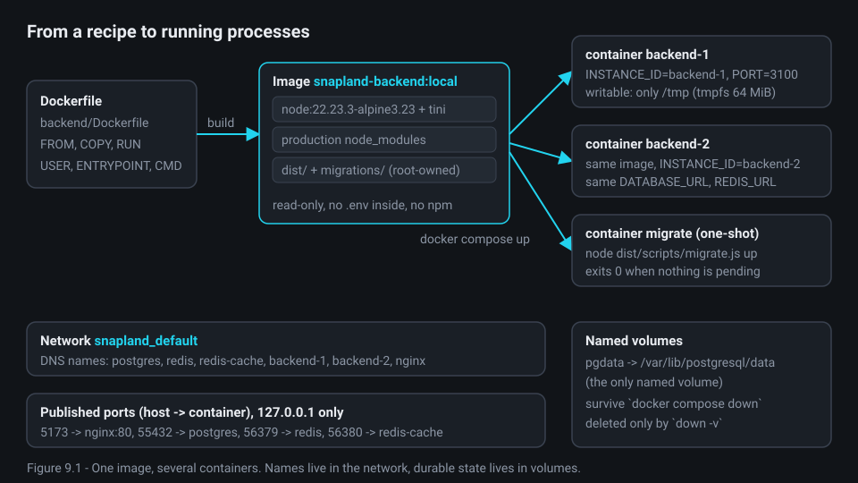
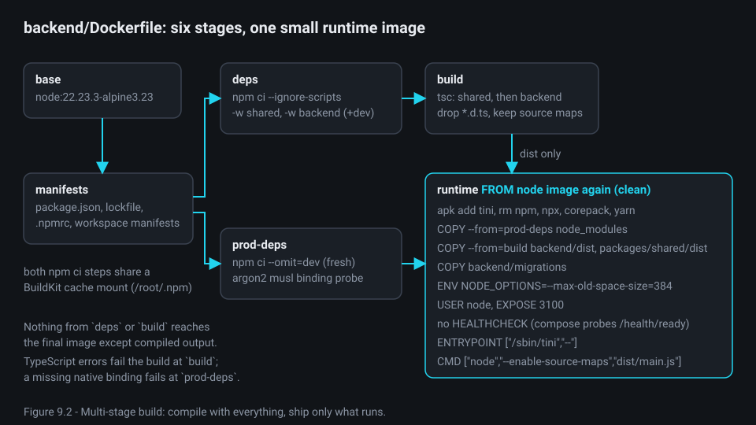
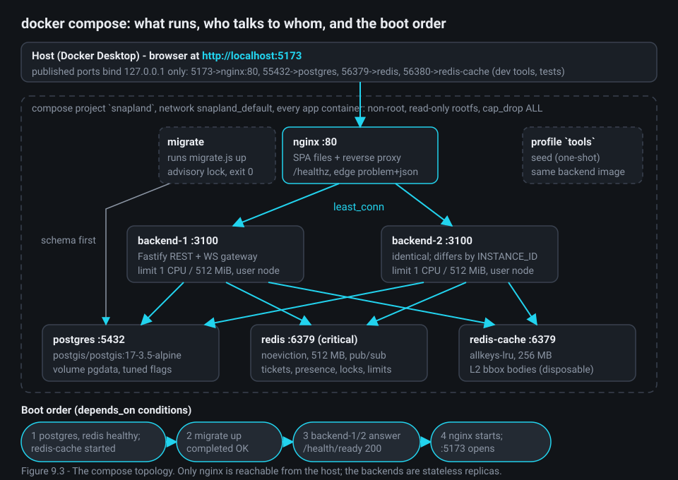
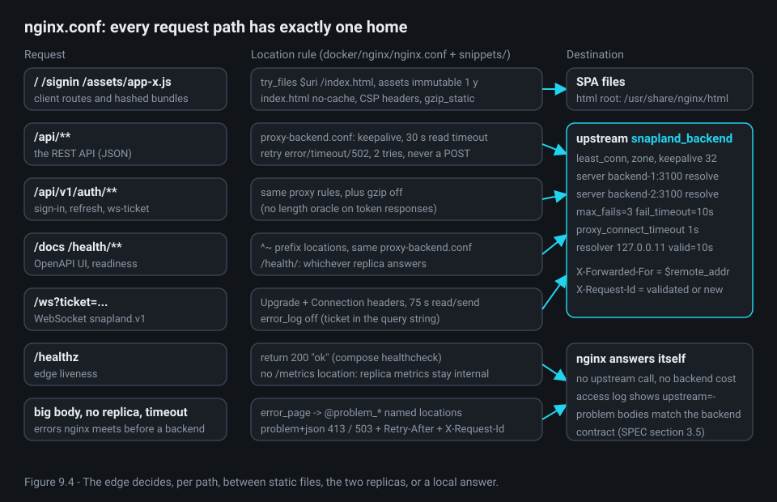

# Chapter 9 - Running it: Docker, nginx, configuration and scaling

**What you will learn**

- What an image, a container, a volume and a compose network are, and why each exists.
- How two Dockerfiles turn this monorepo into a small backend image and an nginx image carrying the built SPA.
- How `docker-compose.yml` starts services in order, keeps them healthy and stops them without cutting users off.
- What nginx does as the single entry point: static files, load balancing, WebSocket upgrades, edge errors and logs.
- How one `.env` configures everything, why the backend refuses to boot on a bad value, and what two stateless replicas prove.

**Why this matters**

Chapters 3 to 8 explained the pieces; none of them runs alone. The assignment asks for docker-compose packaging (`instractions.md:109`, "Docker containerization with docker-compose"); user decision D-2 and the compose header (`docker-compose.yml:1-4`) fix the single command and the address: `docker compose up -d --build`, then http://localhost:5173. This chapter is the glue: how code becomes images, images become cooperating containers, traffic gets in, and what happens when a piece stops.

The files below are the result of a code-simplification pass (`docs/superpowers/plans/2026-09-28-simplify-plan.md`, section W1-TOOLING, applied on 2026-09-29); where it removed something this chapter used to show, the text says so. The architecture (two replicas behind nginx, one migrate job, readiness gates, container hardening) was on its keep-list: learn that part by heart.

---

## 1. Containers from zero

Five words carry the chapter.

- An **image** is a read-only snapshot of a filesystem plus a start command, built from a **Dockerfile** (a recipe of `FROM`, `COPY`, `RUN` steps). Each step adds a **layer**; unchanged steps come from cache.
- A **container** is a process started from an image, with its own filesystem view, network address and environment. Many containers can start from one image and differ only by environment.
- A **volume** is a directory Docker keeps outside any container. Containers are disposable; volumes hold durable data.
- A **network** is a private virtual LAN where containers reach each other by service name (`postgres`, `redis`, `backend-1`) through Docker's DNS.
- **Compose** (`docker-compose.yml`) declares services, networks, volumes, and the order and conditions in which services start.



What to notice: one backend image serves four services (`backend-1`, `backend-2`, `migrate`, `seed`) that differ only in command and a few variables. The database lives in the `pgdata` volume: `docker compose down` keeps your areas, `down -v` deletes them.

---

## 2. The backend image: `backend/Dockerfile`

The problem: the backend compiles against `@snapland/shared` and needs TypeScript to build, but must not ship TypeScript, test tools or `.env`. The answer is a **multi-stage build**: several `FROM` stages in one file, where only what is explicitly copied from an earlier stage reaches the last one.



`deps` installs exactly what the lockfile pins, for two workspaces only:

**backend/Dockerfile:24-30**

```dockerfile
FROM manifests AS deps
# `npm ci` installs exactly what the lockfile pins. `-w` limits the install to the two workspaces the backend needs.
# `--ignore-scripts` stops dependency install scripts from running. Native modules (@node-rs/argon2, rollup/rolldown)
# ship prebuilt per-platform optional packages, so they need no install script. The cache mount keeps the npm tarball
# cache out of every layer.
RUN --mount=type=cache,target=/root/.npm,sharing=locked \
    npm ci --ignore-scripts -w @snapland/shared -w @snapland/backend
```

`prod-deps` is a *second, fresh* install with `--omit=dev`, not a prune of the first. It ends with a probe: the password hasher is a native module and Alpine uses the musl C library, so a missing binding would otherwise surface at the first sign-up.

**backend/Dockerfile:51-54**

```dockerfile
RUN --mount=type=cache,target=/root/.npm,sharing=locked \
    npm ci --ignore-scripts --omit=dev -w @snapland/shared -w @snapland/backend \
 && mkdir -p backend/node_modules packages/shared/node_modules \
 && node -e "const a = require('@node-rs/argon2'); if (!a.verifySync(a.hashSync('probe'), 'probe')) process.exit(1);"
```

`runtime` starts again from the clean Node image, adds `tini`, removes npm (nothing in the container can install code), caps the V8 heap at 384 MiB (`NODE_OPTIONS`, lines 67-69) under the 512 MiB compose limit, and copies in only compiled JavaScript, production dependencies and SQL migrations. The image declares no health probe of its own; compose probes *readiness* on the replicas (liveness vs readiness: section 8):

**backend/Dockerfile:84-90**

```dockerfile
USER node
EXPOSE 3100

# No image HEALTHCHECK: compose probes /health/ready on the replicas, and the one-shot jobs need none.

ENTRYPOINT ["/sbin/tini", "--"]
CMD ["node", "--enable-source-maps", "dist/main.js"]
```

What to notice:

- **`USER node`**: not root, and the files stay root-owned, so the process cannot modify its own code.
- **`tini` as PID 1**: a container's first process gets no default signal handlers and must reap children; `tini` forwards `SIGTERM` to `node`, so section 9's graceful shutdown runs on `docker stop`.
- **`ENTRYPOINT` vs `CMD`**: the image fixes `tini` as the entrypoint and `node … dist/main.js` as the default command. `migrate` and the two backends override only `command` (`docker-compose.yml:139`, `153`, `195`), so `tini` stays PID 1. `seed` overrides `entrypoint` too (line 259): it keeps `tini` and bakes in the script (`seed.js`), so run-time arguments such as `--count 15000` follow as `command` (its default command is `--help`, line 260). Operator commands run inside a live replica instead: `docker compose exec backend-1 node dist/scripts/user-admin.js …` (line 254).

Simplification note: the pass (T12) deleted the old image-level `HEALTHCHECK`, which probed `/health/live` and which compose overrode anyway; the multi-stage build and the argon2 probe stayed.

---

## 3. The edge image: `docker/nginx/Dockerfile`

There is no frontend container. The nginx image has three stages: `deps` installs the SPA toolchain (line 10), `build` runs `vite build` (line 24), and `runtime` is nginx serving the result (line 47). A **build arg** (`ARG`) is a value passed at *build* time; Vite inlines every `VITE_*` variable into the JavaScript, freezing these values into the image:

**docker/nginx/Dockerfile:36-44**

```dockerfile
RUN VITE_API_BASE="${VITE_API_BASE}" \
    VITE_ENABLE_ITM_LAYER="${VITE_ENABLE_ITM_LAYER}" \
    VITE_E2E_HOOKS="${VITE_E2E_HOOKS}" \
    npm run build -w @snapland/frontend \
 && test -f frontend/dist/index.html \
 && find frontend/dist -type f \
      \( -name '*.html' -o -name '*.js' -o -name '*.mjs' -o -name '*.css' -o -name '*.svg' -o -name '*.json' \
         -o -name '*.map' -o -name '*.txt' -o -name '*.webmanifest' \) \
      -size +1k -exec gzip -9 -k {} +
```

One frontend module reads them (a lint rule forbids `import.meta.env` elsewhere):

**frontend/src/config.ts:40-49**

```ts
export function parseFrontendConfig(env: BuildEnv): FrontendConfig {
  const apiBase = env.VITE_API_BASE?.trim();
  return {
    apiBase: apiBase === undefined || apiBase === '' ? '/api/v1' : apiBase.replace(/\/+$/, ''),
    enableItmLayer: parseFlag(env.VITE_ENABLE_ITM_LAYER, true),
    e2eHooks: parseFlag(env.VITE_E2E_HOOKS, false),
  };
}

export const config: FrontendConfig = parseFrontendConfig(import.meta.env);
```

What to notice: build args are feature flags, never secrets (a bundle is public). Changing `VITE_API_BASE` means rebuilding the image, not restarting it. `gzip -9 -k` pre-compresses text assets so nginx serves a `.gz` twin (`gzip_static`) rather than compressing per request.

The `runtime` stage ends by fitting nginx to a locked-down container:

**docker/nginx/Dockerfile:64-68**

```dockerfile
STOPSIGNAL SIGQUIT
# The official entrypoint's scripts (envsubst templates, IPv6 listen, worker tuning) would try to write to a read-only
# filesystem and are not needed: the configuration is static and has no runtime templating.
ENTRYPOINT ["nginx"]
CMD []
```

`SIGQUIT` is nginx's graceful signal (finish, then exit); the nginx master is its own init, so no `tini` here.

---

## 4. The build context: `.dockerignore` as an allow-list

Both images build from the repository root (the workspaces share one lockfile), so the whole checkout, `.env` and `.git` included, would go to the builder. The fix: deny everything, then re-admit what the Dockerfiles `COPY`:

**.dockerignore:4-10**

```gitignore
*

# Root: workspace manifest, lockfile, npm settings (no tokens), shared compiler options.
!package.json
!package-lock.json
!.npmrc
!tsconfig.base.json
```

Lines 36-50 re-exclude generated and secret files inside admitted directories (`**/dist`, `**/.env`, `**/.env.*`, `**/*.pem`, `**/*.test.ts`). An image cannot contain a secret that never reached the builder.

---

## 5. The compose topology



### 5.1 Shared fragments

YAML anchors (`&name`, `*name`, `<<:`) let the four backend-image services share one definition. The environment anchor holds the *in-network* values that override `.env`:

**docker-compose.yml:17-25**

```yaml
x-backend-environment: &backend-environment
  NODE_ENV: production
  LOG_PRETTY: 'false'
  TRUST_PROXY: '1'
  HOST: 0.0.0.0
  PORT: '3100'
  DATABASE_URL: postgres://${POSTGRES_USER:-snapland}:${POSTGRES_PASSWORD:-snapland}@postgres:5432/${POSTGRES_DB:-snapland}
  REDIS_URL: redis://redis:6379/0
  CACHE_REDIS_URL: redis://redis-cache:6379/0
```

On your machine `.env` points `DATABASE_URL` at `127.0.0.1:55432`; inside the network it points at `postgres:5432`, a service name resolved by Docker DNS. Compose `environment` wins over `env_file`, so one `.env` serves both.

The runtime anchor is the hardening every app container gets:

**docker-compose.yml:27-38**

```yaml
x-backend-runtime: &backend-runtime
  <<: *backend-image
  env_file: .env
  environment: *backend-environment
  user: node
  read_only: true
  tmpfs:
    - /tmp:size=64m
  security_opt:
    - no-new-privileges:true
  cap_drop:
    - ALL
```

`read_only` makes the root filesystem immutable; `/tmp` is a **tmpfs** (RAM-backed) for scratch space. `cap_drop: ALL` removes every Linux capability; `no-new-privileges` blocks setuid escalation.

### 5.2 Data stores

`postgres` is `postgis/postgis:17-3.5-alpine` with tuning flags (`max_connections=100`, `pg_stat_statements` and more; lines 47-64) and the `pgdata` volume. Two Redis containers exist on purpose: `redis` holds critical, TTL-bound state and must never evict; `redis-cache` holds disposable response bodies and evicts freely (`allkeys-lru`, 256 MB).

**docker-compose.yml:87-100**

```yaml
  redis:
    image: redis:7.4.11-alpine
    command:
      - redis-server
      - --save
      - ''
      - --appendonly
      - 'no'
      - --maxmemory
      - 512mb
      - --maxmemory-policy
      - noeviction
      - --client-output-buffer-limit
      - pubsub 32mb 8mb 60
```

`--save ''` and `--appendonly no` mean Redis never writes to disk, by design: everything in it is ephemeral by contract; PostgreSQL is the system of record.

### 5.3 Boot order and health

Compose starts services in dependency order, but "started" is not "ready". A **healthcheck** is a command Docker runs inside the container on an interval; `depends_on` with a `condition` waits on it. The backend block uses all three conditions, and its healthcheck comment insists on "readiness, not liveness" (liveness vs readiness: section 8):

**docker-compose.yml:161-182**

```yaml
    depends_on: &backend-depends-on
      migrate:
        condition: service_completed_successfully
      postgres:
        condition: service_healthy
        restart: true
      redis:
        condition: service_healthy
        restart: true
      # The L2 bbox cache is disposable. The app runs without it (L1 only, section 10.6), so it only has to be started.
      redis-cache:
        condition: service_started
        restart: true
    # Readiness, not liveness: 503 while the database or migrations are not OK or the instance is draining. nginx
    # waits for it, and it is what `docker compose ps` reports.
    healthcheck: &backend-healthcheck
      test: ['CMD', 'wget', '-q', '-O', '/dev/null', 'http://127.0.0.1:3100/health/ready']
      interval: 10s
      timeout: 3s
      retries: 3
      start_period: 20s
      start_interval: 2s
```

Read it as gates: backends start only after `migrate` exited 0; nginx only after both backends are ready:

**docker-compose.yml:218-224**

```yaml
    ports:
      - '127.0.0.1:${HTTP_HOST_PORT:-5173}:80'
    depends_on:
      backend-1:
        condition: service_healthy
      backend-2:
        condition: service_healthy
```

Two interview-worthy details:

- **`migrate` is a one-shot service.** It runs `migrate.js up`, exits 0 when nothing is pending, and serialises with any concurrent runner on a PostgreSQL **advisory lock** (a named, connection-scoped lock that PostgreSQL hands out on request; it serialises callers without locking any table) with `advisoryLockMode: 'wait'` (`backend/src/infra/db/migrations.ts:59`). Schema changes happen once, before any replica serves.
- **`restart: true`** on the data-store dependencies: restarting a store also restarts both replicas once it is healthy. Lines 159-160 record why: a restarted store can come back on another IP, and a replica that reconnected mid-restart was once seen with its critical client pointed at `redis-cache`.

The postgres healthcheck probes TCP (`pg_isready -h 127.0.0.1`, lines 71-74): on a fresh volume the image's init server listens on the Unix socket only, seconds before TCP 5432 opens, and `migrate` connects over TCP. Simplification note: that one flag (T8) replaced a separate `wait-for-postgres` one-shot service, and T9 deleted a `cli` service in favour of `docker compose exec backend-1 node dist/scripts/user-admin.js …`. The `migrate` one-shot, readiness gates and `restart: true` stayed.

### 5.4 The E2E overlay

A second file is *layered* on the first for Playwright, never used alone. Compose merges `build.args` and `environment` key by key:

**docker-compose.e2e.yml:23-35**

```yaml
services:
  nginx:
    image: snapland-nginx:e2e
    build:
      args:
        VITE_E2E_HOOKS: 'true'
        VITE_ENABLE_ITM_LAYER: 'true'

  backend-1:
    environment: *e2e-limits

  backend-2:
    environment: *e2e-limits
```

The raised limits (lines 19-21) exist because every Playwright context reaches nginx from one Docker gateway IP; at 10 sign-ins per minute per IP, a spec run would hit unrelated 429s. The separate tag keeps a test build from overwriting `snapland-nginx:local`.

---

## 6. nginx: one door in

A **reverse proxy** accepts client connections and forwards them to servers the client never sees. Here it is also the static file server and a **load balancer** over the two replicas. Only nginx has a published port.



### 6.1 The upstream

An **upstream** is nginx's name for a pool of servers:

**docker/nginx/nginx.conf:84-94**

```nginx
  upstream snapland_backend {
    # Required by `resolve`: the re-resolved peer list is shared by all workers.
    zone snapland_backend 64k;
    # least_conn balances long-lived WebSockets better than round-robin (SPEC section 10.10). No sticky sessions: tickets,
    # presence and fan-out live in Redis, so any replica accepts any client.
    least_conn;
    server backend-1:3100 max_fails=3 fail_timeout=10s resolve;
    server backend-2:3100 max_fails=3 fail_timeout=10s resolve;
    keepalive 32;
    keepalive_timeout 60s;
  }
```

- **`least_conn`** sends each new connection to the replica with the fewest *open* ones. It only differs from round-robin when connections overlap, which is exactly what WebSockets that live for hours do. When nothing is open (plain `curl` calls, one after the other) both replicas tie at zero and nginx falls back to its default weighted round-robin, so the answers alternate between `backend-1` and `backend-2` (exercise 1). nginx has no active health checks here; `max_fails=3 fail_timeout=10s` is a *passive* check that marks a peer down after three failed connections (section 9).
- **`resolve`** (with `resolver 127.0.0.11 valid=10s`, line 73) re-queries Docker DNS, so nginx starts even while a replica is down and follows a recreated container to its new IP without a reload.
- **`keepalive 32`** reuses idle backend connections; `proxy_connect_timeout 1s` (line 77) bounds the wait on a just-stopped replica.
- **No sticky sessions**: nothing user-specific lives in replica memory (section 10).

### 6.2 Headers the backend can trust

**docker/nginx/snippets/proxy-headers.conf:6-11**

```nginx
proxy_http_version 1.1;
proxy_set_header Host $http_host;
proxy_set_header X-Forwarded-For $remote_addr;
proxy_set_header X-Forwarded-Proto $scheme;
proxy_set_header X-Forwarded-Host $http_host;
proxy_set_header X-Real-IP $remote_addr;
```

`X-Forwarded-For` is *overwritten* with the real peer address, never appended; appending would let a client put a forged IP first. This pairs with `TRUST_PROXY=1` on the backend (section 7): trust exactly one hop. Per-IP rate limits and audit rows depend on that pair.

Request correlation works the same way: a client's `X-Request-Id` is kept only if it matches the backend's pattern:

**docker/nginx/nginx.conf:49-52**

```nginx
  map $http_x_request_id $snapland_request_id {
    default $request_id;
    '~^[A-Za-z0-9._-]{1,64}$' $http_x_request_id;
  }
```

The access log (`log_format`, lines 56-57) prints `$uri`, never `$request` or `$args`, because the WebSocket ticket travels in the query string. Each line ends with `upstream=$upstream_addr`, so a proxied request reads `upstream=<ip>:3100` (the replica that served it) and an answer nginx gave itself reads `upstream=-`. (Until decision D-7 a `cache=` field followed, the status of the GovMap tile cache that went with the tile proxy.)

### 6.3 WebSockets through a proxy

HTTP/1.1 becomes a WebSocket through an `Upgrade` handshake. `Upgrade` and `Connection` are **hop-by-hop headers**: headers meant for one connection only, which a proxy does not forward unless told to. `/ws` re-adds them, sets 75 s timeouts to tolerate missed 20 s server pings, and silences its error log (error lines quote the full URL, ticket included):

**docker/nginx/nginx.conf:143-147**

```nginx
      error_log /dev/null;
      include snippets/proxy-headers.conf;
      proxy_pass http://snapland_backend;
      proxy_set_header Upgrade $http_upgrade;
      proxy_set_header Connection $connection_upgrade;
```

**docker/nginx/nginx.conf:151-153**

```nginx
      # Retry only failures to reach a replica: once an upgrade reaches a backend, its single-use ticket is consumed.
      proxy_next_upstream error timeout;
      proxy_next_upstream_tries 2;
```

### 6.4 Retries, the SPA fallback and edge errors

For plain API calls the shared snippet fails over only on connection-level problems:

**docker/nginx/snippets/proxy-backend.conf:14-16**

```nginx
proxy_next_upstream error timeout http_502;
proxy_next_upstream_tries 2;
proxy_next_upstream_timeout 10s;
```

nginx never retries non-idempotent methods (POST, PATCH), so a write is never applied twice. `http_503` is deliberately *not* listed, and the snippet's comment says why (lines 11-13): the backend answers 503 legitimately (pool exhausted, draining), and counting those as peer failures once marked both replicas down.

The SPA is one `index.html` whose routes (`/`, `/signin`) exist only in the browser. `try_files` serves a real file if one exists, otherwise the shell:

**docker/nginx/nginx.conf:168-172**

```nginx
    location / {
      gzip_static on;
      include snippets/spa-headers.conf;
      add_header Cache-Control "no-cache" always;
      try_files $uri /index.html;
```

Hashed bundles under `/assets/` are cached for a year as `immutable` (line 162); `index.html` is `no-cache`, so a new deploy shows on the next load. `spa-headers.conf` adds the Content-Security-Policy for static pages (API responses get theirs from `@fastify/helmet`). Errors nginx meets before any backend has answered (a body over 256 KiB, no reachable replica, a replica that did not answer within `proxy_read_timeout`, which nginx reports as 504 and `@problem_timeout` turns into a 503 problem, lines 108 and 200-205) come back as `application/problem+json` in the backend's shape (lines 184-205): one error contract. A path that names a file (`favicon.ico`) but does not exist is a real 404 from the nested location at lines 174-181, never the SPA shell.

Simplification note: the tile location, its cache zone and the `nginx-tiles` volume went with the GovMap 2025 proxy (decision D-7); T13 removed the `/metrics` 404 locations, so `/metrics` at the edge now falls through to the SPA shell like any client route, and merged the `/docs` locations. The problem+json pages, request-id map, `$uri`-only log, `/ws` log suppression, header overwrite and retry rules were all on the keep-list and stayed.

---

## 7. Configuration: one file, validated once

The problem: dozens of tunables, some of which must agree with each other, and a secret that must never be committed. Three layers.

**Layer 1: `.env.example` is the catalog.** Every backend variable is there with a comment; the secret is a placeholder:

**.env.example:41-48**

```dotenv
# Placeholder: setup-env replaces it with a random secret; production refuses to boot with this value.
JWT_SECRET=replace-me-run-node-scripts-setup-env-mjs
JWT_ISSUER=snapland
JWT_AUDIENCE=snapland-api
ACCESS_TOKEN_TTL_S=900
REFRESH_TOKEN_TTL_S=1209600
SESSION_ABSOLUTE_TTL_S=2592000
COOKIE_SECURE=true
```

**Layer 2: `node scripts/setup-env.mjs` creates `.env`** with 48 random bytes in place of the placeholder, using the `wx` flag so it never overwrites an existing file:

**scripts/setup-env.mjs:16-25**

```js
export function createEnv(root) {
  const envPath = join(root, '.env');
  if (existsSync(envPath)) return false;
  const example = readFileSync(join(root, '.env.example'), 'utf8');
  if (!JWT_SECRET_LINE.test(example)) throw new Error('.env.example has no JWT_SECRET= line');
  const secret = randomBytes(48).toString('base64url');
  // 'wx' fails if .env appeared meanwhile, so a concurrent run can never overwrite it.
  writeFileSync(envPath, example.replace(JWT_SECRET_LINE, `JWT_SECRET=${secret}`), { flag: 'wx' });
  return true;
}
```

`.env` is git-ignored, excluded from images, and read by compose through `env_file`. In local dev the backend loads it itself; in a container the file does not exist and the load is skipped:

**backend/src/config/env.ts:288-295**

```ts
/** `<repo>/.env`, written by `node scripts/setup-env.mjs`; absent in the container image, where compose sets the env. */
const REPO_DOTENV = fileURLToPath(new URL('../../../.env', import.meta.url));

/** Loads `<repo>/.env` when it exists (variables already in the environment win), then validates the process env. */
export function loadConfigFromEnv(): AppConfig {
  if (existsSync(REPO_DOTENV)) process.loadEnvFile(REPO_DOTENV);
  return loadConfig(process.env);
}
```

**Layer 3: `backend/src/config/env.ts` validates at boot** with a zod schema (chapter 4). Every variable has a type; most have a range and a default, and the three that must be supplied (`DATABASE_URL`, `REDIS_URL`, `JWT_SECRET`; `env.ts:153`, `159`, `172`) have none. Cross-variable rules live in a `superRefine`:

**backend/src/config/env.ts:235-240**

```ts
    if (env.NODE_ENV === 'production' && env.JWT_SECRET.includes(JWT_SECRET_PLACEHOLDER)) {
      fail('JWT_SECRET', 'must not be the .env.example placeholder in production');
    }
    if (env.REFRESH_TOKEN_TTL_S > env.SESSION_ABSOLUTE_TTL_S) {
      fail('REFRESH_TOKEN_TTL_S', 'must not exceed SESSION_ABSOLUTE_TTL_S');
    }
```

**backend/src/config/env.ts:278-286**

```ts
export function loadConfig(source: Readonly<Record<string, unknown>>): AppConfig {
  const result = EnvSchema.safeParse(source);
  if (!result.success) {
    throw new ConfigError(
      result.error.issues.map((issue) => `${issue.path.map(String).join('.') || '(root)'}: ${issue.message}`),
    );
  }
  return result.data;
}
```

What to notice: the process fails *before* it opens a socket, listing every problem, and `main.ts` exits 1 so compose restarts it. `env.ts` is the only module allowed to read `process.env` (lint-enforced), so the catalog stays complete.

`TRUST_PROXY` needs one line of code, because Fastify 5 refuses a bare number:

**backend/src/infra/http/trust-proxy.ts:9-13**

```ts
export function toFastifyTrustProxy(setting: TrustProxySetting): TrustProxyOption {
  if (typeof setting !== 'number') return setting;
  const hops = setting;
  return (_address, hop) => hop < hops;
}
```

`1` means "trust the first hop from the socket", which is nginx. Put another proxy in front and the count must change.

Simplification note: the pass removed the unused `LOGIN_FAILURES_*` and `BOOTSTRAP_ADMIN_USERNAMES` variables (plan item core:P5) and, with decision D-7, the `GOVMAP_*`/`TILE_*` ones; it folded the separate `.env` loader (`dotenv.ts`) into `loadConfigFromEnv()` and rewrote `setup-env.mjs` as the 40-line script above, keeping the 48-byte secret and the `wx` flag.

---

## 8. Health: live, ready, and who asks

**Liveness** ("is the process alive?") is `GET /health/live`: 200 while the event loop runs. **Readiness** ("should traffic be sent here?") is `GET /health/ready`, which checks the database, critical Redis, pending migrations and the shutdown flag in parallel, 1 s each:

**backend/src/modules/health/health.service.ts:69-72**

```ts
  const shutdown = { status: deps.isShuttingDown() ? ('fail' as const) : ('ok' as const) };
  const failed = database.status === 'fail' || migrations.status === 'fail' || shutdown.status === 'fail';
  return {
    status: failed ? 'fail' : redis.status === 'fail' ? 'degraded' : 'ok',
```

The route (`health.routes.ts:42-44`) answers 503 for `fail`, 200 otherwise, with `Cache-Control: no-store`. Only Redis failing yields `degraded` with 200: the instance can still serve REST. Error strings are short and credential-free, so the endpoint can be public.

Consumers: **compose** polls `/health/ready` every 10 s, and its verdict is what gates nginx's start (`depends_on … service_healthy`); **nginx** itself never polls it, it only proxies `/health/` to whichever replica answers (its checks are passive, section 6.1); **shutdown** flips the flag first (section 9). nginx's own probe, `/healthz` (`nginx.conf:111-115`), keeps the edge's health independent of the backends'.

---

## 9. Stopping without breaking anyone

`docker compose stop` sends the stop signal and waits `stop_grace_period` (15 s, `docker-compose.yml:189`) before `SIGKILL`. Everything the backend does in that window is one function:

**backend/src/infra/shutdown.ts:13-18**

```ts
export async function gracefulShutdown(snap: SnaplandApp, container: Container): Promise<void> {
  snap.app.lifecycleState.shuttingDown = true;
  await snap.app.close();
  await snap.stop();
  await container.close();
}
```


The flag makes `/health/ready` answer 503. Who acts on that? Compose's healthcheck, and any balancer that runs *active* checks, now sees the instance as not ready. This repo's nginx is not such a balancer: open-source nginx has no active health checks, and nothing in `docker/nginx/nginx.conf` polls `/health/ready`. It drops the draining replica *passively*: Fastify closes its idle keep-alive sockets, which nginx counts as an `error` (`max_fails`) and retries on the other replica through `proxy_next_upstream`. The snippet names both cases:

**docker/nginx/snippets/proxy-backend.conf:11-13**

```nginx
# Fail over to the other replica when one is unreachable or has closed the connection. No `non_idempotent`: a write is
# never replayed. No http_503: the backend answers 503 legitimately (pool exhausted, draining), and counting those as
# peer failures (max_fails) turned a partial overload into "no live upstreams" on every route.
```

(SPEC section 10.12 step 1 writes "the load balancer stops routing"; that is the design intent for a balancer with active checks. Here the effect is reached the passive way, and a rare 503 answered mid-drain reaches the client, which retries.) `app.close()` runs Fastify's `preClose` hooks, one of which closes every WebSocket with 1001 ("going away"), then stops accepting HTTP and lets in-flight requests finish:

**backend/src/app.ts:126-131**

```ts
    // section 10.12 step 2: every socket is closed with 1001 "going away" so clients reconnect to another instance.
    preClose(this: FastifyInstance, done: () => void) {
      for (const client of this.websocketServer.clients) client.close(1001, 'server shutting down');
      done();
    },
  });
```

`snap.stop()` stops each module's loops; the realtime gateway closes any remaining connection with the cleanup a normal disconnect gets: drafts, then locks, then presence (`backend/src/modules/realtime/gateway.ts:140-149` and `289-297`). `container.close()` flushes the audit queue within a 5 s budget, quits the Redis clients and ends the pool (`backend/src/container.ts:180-191`). `close-with-grace` wires this to `SIGTERM` with `SHUTDOWN_GRACE_MS` (10 s) as the deadline; on timeout it logs `fatal` and exits 1 (`shutdown.ts:27-48`). The 5 s of slack before compose's 15 s protects a slow flush.

nginx has the matching rule, because a WebSocket never finishes on its own:

**docker/nginx/nginx.conf:14-15**

```nginx
# WebSockets never finish on their own, so a graceful stop closes them after 10 s (inside the 15 s stop_grace_period).
worker_shutdown_timeout 10s;
```

Clients (chapter 8) see the 1001 close, fetch a fresh ticket, reconnect through nginx to the other replica, and resync from the change feed.

---

## 10. How two replicas scale

A **replica** is an identical copy of a service; **stateless** means a replica keeps nothing in memory that another replica would need. That property is the architecture; two is the smallest number that proves it. SPEC section 10.10:

**docs/SPEC.md:1223**

```markdown
No sticky sessions (tickets are in Redis; nginx `least_conn` balances long-lived sockets better than round-robin). Singletons (retention, migrations) are coordinated by PostgreSQL advisory locks, with no leader election. Per-instance protections: pool max 20, 5,000 WS connections, bounded queues, timeouts. **Scaling path**: (1) more instances behind the load balancer; (2) PgBouncer transaction pooling once instances × pool exceeds `max_connections`; (3) read replicas for bbox reads (writes and the feed stay on the primary); (4) pub/sub sharded by region (`snap:ch:areas:<z6 tile>`) or Redis Streams / NATS JetStream for durable fan-out; (5) `audit_logs` partitioned by month; (6) a CDN for the SPA; (7) Redis Sentinel or Cluster. The demo topology (2 backends, nginx, 1 PostgreSQL, 2 Redis) proves cross-instance realtime; the load test measures it (`docs/BENCHMARKS.md`).
```

The table just above (SPEC lines 1215-1221) says where each kind of state lives and why that keeps instances stateless.

Each replica opens at most `DB_POOL_MAX=20` connections (`backend/src/infra/db/pool.ts:33`), so two replicas plus the one-shot jobs stay well under `max_connections=100`. Replicas differ by one variable, `INSTANCE_ID` (`docker-compose.yml:156`, `198`). The README repeats the scaling path for operators (`README.md:210-213`). Step (1) is copying the `backend-2` block to `backend-3` and adding one `server backend-3:3100 … resolve;` line; the application does not change.

---

## 11. What to change for production

The repo is a local demo topology; each point below is grounded in one of its comments or settings.

- **Secrets.** `setup-env` generates `JWT_SECRET`; production refuses the placeholder (`env.ts:235`). `POSTGRES_PASSWORD` is spliced into `DATABASE_URL` as-is (`docker-compose.yml:23`), so it must be URL-safe. Rotation: edit `.env`, then `docker compose up -d`, which recreates the containers whose configuration changed.
- **Origins and ports.** A new `HTTP_HOST_PORT` needs its origin in `CORS_ORIGINS` (`.env.example:16`), or the backends reject the SPA's WebSocket origin. The postgres and Redis host ports serve local tools and tests, not a server; every published port binds to 127.0.0.1 (`docker-compose.yml:3-4`).
- **TLS is not in the repo.** nginx listens on port 80 only. `COOKIE_SECURE=true` works locally because localhost is a secure context (SPEC section 11.3), and the CSP already allows `wss:`. Terminate TLS in this nginx or in a proxy in front; in the second case `TRUST_PROXY` must count the extra hop.
- **Durability.** PostgreSQL data is in `pgdata`; backups are outside the repo. Redis persistence is off by design (section 5.2).
- **Resources.** The 1 CPU / 512 MiB replica limits and `NODE_OPTIONS=--max-old-space-size=384` move together (Dockerfile lines 67-69); `worker_processes 2` fits nginx's 1-CPU limit (nginx.conf lines 10-11).
- **Observability.** JSON logs on stdout, rotated locally (`json-file`, 10 MB x 5). No Prometheus or Grafana is shipped (README, *Known limitations*): each replica's `/metrics` is reachable only inside the network, and the k6 load test (`loadtest/bbox.js`, results in `docs/BENCHMARKS.md`) runs on demand.
- **Outside the repo.** A registry and CI (the Dockerfile comment on line 11 puts `npm audit` there); images are `:local` tags built on the host. Public GovMap use needs written approval from the Survey of Israel (`README.md:200-204`).

---

## Try it yourself

All three need the running stack (every service `healthy` in `docker compose ps`). Commands are for Git Bash; in PowerShell read `$LASTEXITCODE` instead of `$?`. If `curl http://localhost:5173/…` returns an empty reply while every container is `healthy` and nginx logs no access line, the fault is on the host side of the published port (Docker Desktop's port forward or its embedded DNS), not in the stack: `README.md` ("Troubleshooting", the `docker compose restart nginx` row) covers it, and restarting Docker Desktop is the fallback. Everything below can also be run from inside the network with `docker compose exec -T nginx wget -qSO- http://127.0.0.1/…`.

**1. Follow a request id through the edge, then find your WebSocket.**

Open http://localhost:5173 in one browser and sign in, so one WebSocket is open. Then:

```bash
curl -s -o /dev/null -D - -H 'X-Request-Id: tutorial-check-1'    http://localhost:5173/health/live | grep -i x-request-id
curl -s -o /dev/null -D - -H 'X-Request-Id: bad id with spaces!' http://localhost:5173/health/live | grep -i x-request-id
docker compose logs --no-log-prefix nginx | grep health/live | tail -2
curl -s -o /dev/null -w '%{http_code}\n' http://localhost:5173/metrics
for s in backend-1 backend-2; do docker compose exec -T $s wget -qO- http://127.0.0.1:3100/metrics | grep '^snapland_ws_connections{'; done
```

Expected: the first header comes back as `x-request-id: tutorial-check-1`; the second is replaced by a 32-character hex id (nginx's `$request_id`). The two log lines end in `rid=tutorial-check-1 upstream=<ip>:3100` and `rid=<hex> upstream=<ip>:3100` (the `grep` keeps the signed-in browser's periodic `/api/v1/areas/changes` polls from displacing them). `/metrics` answers `200` at the edge, but with the SPA's `index.html`: nginx proxies only `/api/`, `/docs`, `/health/` and `/ws`, so the path falls through to the SPA shell and the replicas' metrics are never exposed. Inside the network each replica reports its gauge, for example `snapland_ws_connections{instance="backend-2"} 1` and `{instance="backend-1"} 0`. Open the app in a second browser and rerun the last line: `least_conn` should put the new socket on the replica with fewer open connections, so both read `1`. That gauge is the real `least_conn` demonstration. Six plain `curl -s http://localhost:5173/health/live` calls, by contrast, alternate `instanceId` between `backend-1` and `backend-2`: none is open when the next arrives, both replicas tie at zero, and `least_conn` falls back to round-robin.

**2. Fail fast on bad configuration; fail cheap at the edge.**

```bash
docker compose run --rm --no-deps -T -e JWT_SECRET=short backend-1; echo "exit=$?"
head -c 300000 /dev/zero | tr '\0' a > /tmp/big.txt
curl -s -i -X POST -H 'Content-Type: application/json' --data-binary @/tmp/big.txt http://localhost:5173/api/v1/areas | head -12
```

Expected: the one-shot prints one JSON line, `{"level":"fatal",…,"msg":"startup failed","error":"Invalid configuration:\n  - JWT_SECRET: must be at least 32 characters …"}`, and `exit=1`; the running replicas are untouched. The POST gets `HTTP/1.1 413` with `Content-Type: application/problem+json` and `"code":"PAYLOAD_TOO_LARGE"`; its nginx access log line ends in `upstream=-` (no backend was contacted).

**3. Take a replica away while you use the app.**

Open http://localhost:5173 in two browsers as two users (README, "See real-time collaboration"). Then:

```bash
docker compose stop backend-1
for i in 1 2 3 4; do curl -s http://localhost:5173/health/live; echo; done
docker compose ps backend-1
docker compose start backend-1 && sleep 25 && docker compose ps backend-1
```

Expected: both sessions keep working (a session that was on `backend-1` reconnects within seconds and shows "live" again). Every `/health/live` now says `backend-2`; the first request after the stop may take up to 1 s extra (`proxy_connect_timeout 1s`). After `start`, `backend-1` is `(healthy)` again and nginx picks up its address within `valid=10s`, no reload. Live sockets stay on `backend-2`; reload one tab and its new socket should land on `backend-1`, the replica with fewer open connections (check with exercise 1's gauge command).

---

## Self-check

1. Why is the database migrated by a separate one-shot service instead of by each backend at startup?
2. Where does the frontend read `VITE_API_BASE` at runtime, and what does changing it require?
3. Why does nginx *overwrite* `X-Forwarded-For` instead of appending, and what does `TRUST_PROXY=1` mean?
4. What is the difference between `/health/live` and `/health/ready`, and which does compose poll?
5. What happens to open WebSockets when you run `docker compose stop backend-1`?

<details>
<summary>Answers</summary>

1. `migrate` runs `migrate.js up` once and exits 0; the backends depend on it with `service_completed_successfully`, so no replica serves before the schema is current. Concurrent runners serialise on an advisory lock.
2. Nowhere: Vite inlines the build arg into the bundle (`frontend/src/config.ts` reads `import.meta.env`); changing it means rebuilding the nginx image, not restarting it.
3. Appending would keep a client-supplied value first, letting a client forge its IP. nginx sets it to `$remote_addr` and blanks `Forwarded`. `TRUST_PROXY=1` makes Fastify trust exactly one hop, nginx.
4. `/health/live` is 200 whenever the event loop runs. `/health/ready` checks database, Redis, pending migrations and the shutdown flag: 503 when database, migrations or shutdown fail, `degraded` (200) when only Redis fails. Compose polls `/health/ready`; the image defines no health probe of its own.
5. Compose sends `SIGTERM`; `tini` forwards it; `close-with-grace` runs `gracefulShutdown`: `/health/ready` turns 503, `preClose` closes every socket with 1001, HTTP drains, module loops stop, audit flushes, Redis and the pool close, exit 0 within 10 s. Clients reconnect with a fresh ticket and land on `backend-2`.

</details>

---

## Further reading

- `docker-compose.yml` (its header comment, lines 1-4, first) and `docker-compose.e2e.yml`
- `backend/Dockerfile`, `docker/nginx/Dockerfile`, `.dockerignore`, `docker/nginx/nginx.conf` and `docker/nginx/snippets/*.conf`
- `.env.example`, `scripts/setup-env.mjs`, `backend/src/config/env.ts`, `backend/src/infra/http/trust-proxy.ts`
- `backend/src/main.ts`, `backend/src/infra/shutdown.ts`, `backend/src/container.ts`, `backend/src/modules/health/health.service.ts`, `backend/src/modules/realtime/gateway.ts`
- `README.md` ("Run it with Docker", "Troubleshooting")
- SPEC section 4.1 (pinned images), section 10.9 (health), section 10.10 (scaling), section 10.12 (graceful shutdown), section 11 (compose, local dev, environment)
- `docs/superpowers/plans/2026-09-28-simplify-plan.md`, section W1-TOOLING (what changed, and the keep-list)
- Chapters 6 (pub/sub fan-out across replicas) and 8 (client reconnect and resync)
