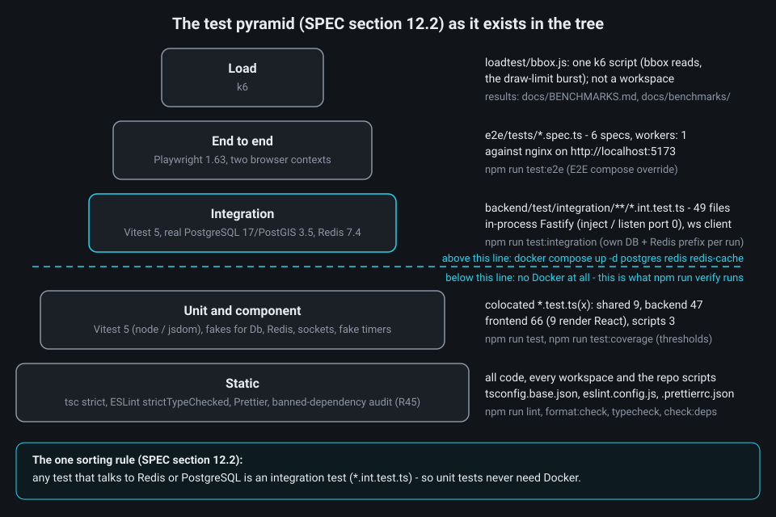
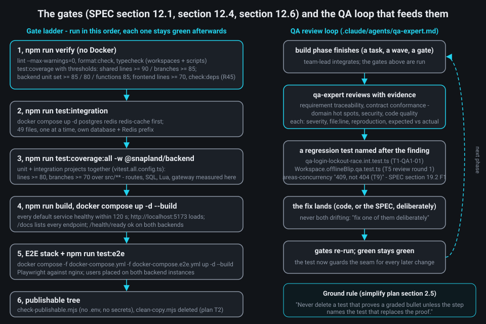

# Chapter 10 - Testing and quality: how we know it works

**What you will learn**

- How the test pyramid is laid out here, and the one rule that decides where a test goes.
- Why the geodesic fixtures are generated by PostGIS and how every layer asserts against the same file.
- How an integration run gets a private database and private Redis keys, so parallel runs never collide.
- What component tests, end-to-end specs and the `verify` gates each prove, and what they do not.
- How the QA review loop turns a finding into a regression test, and what "as simple as possible" means here.

**Why this matters**

The assignment asks for "Unit tests for critical backend functionality" and a "Testing approach" in the README. The real problem is harder: the browser, two backend replicas, PostGIS and Redis can each be wrong, and the interesting bugs live in the seams - two users editing one polygon at once, a cache page served after a write on the other instance, ten wrong passwords arriving together. So: for each claim the system makes, which test is the *cheapest one that could actually fail*, and how do we keep those tests honest when several people or agents work in one tree?

Everything below is the tree after the simplification pass of 2026-09-29 (`docs/superpowers/plans/2026-09-28-simplify-plan.md`); every excerpt and line reference was checked against that final tree. Where the pass changed test *code*, this chapter says so and names what stayed.

---

## 1. The pyramid and the one sorting rule

A **test pyramid** orders tests by cost: many fast tests of small pieces, few slow tests of the whole. It needs a clear rule for which level a test belongs to, and SPEC section 12.2 gives one: *any test that talks to Redis or PostgreSQL is an integration test*, named `*.int.test.ts`. Everything else is colocated next to the code and runs without Docker, which is why `npm run verify` works with nothing but Node.



Counts are from the tree on 2026-09-29. The top of the pyramid is one k6 script, `loadtest/bbox.js` (bbox reads over random viewports plus one burst that must end in exactly 50 x 201 and 10 x 429), with its measured results in `docs/BENCHMARKS.md`; `loadtest/` is not an npm workspace, because the script runs in the k6 binary. `docs/benchmarks/t9-smoke.txt` keeps the earlier two-browser smoke record.

The root scripts wire the levels together:

```json
package.json:21-29
    "typecheck": "npm run typecheck --workspaces --if-present && tsc -p scripts",
    "test": "npm run test --workspaces --if-present && npm run test:scripts",
    "test:scripts": "vitest run --dir scripts",
    "test:coverage": "npm run test:coverage --workspaces --if-present && npm run test:scripts",
    "test:integration": "npm run test:integration -w @snapland/backend",
    "test:e2e": "npm run build -w @snapland/shared && npm run e2e -w @snapland/e2e",
    "build": "npm run build -w @snapland/shared && npm run build -w @snapland/backend && npm run build -w @snapland/frontend",
    "check:deps": "node scripts/check-banned-deps.mjs",
    "verify": "npm run lint && npm run format:check && npm run typecheck && npm run test:coverage && npm run check:deps"
```

What to notice: `verify` runs `test:coverage`, not `test`, so coverage thresholds are enforced by the command everyone runs, and `check:deps` makes the assignment's "no third-party plugins for the collaborative features" executable: `scripts/check-banned-deps.mjs` walks `npm ls --all --json` against a `BANNED` list of package names and globs inlined in the script (lines 8-33; the simplify plan's T4 step moved it there from `banned-packages.json` and dropped the matching ESLint import ban, so this one script is the R45 proof).

The cheapest tests are static: `tsconfig.base.json` turns on `strict`, `noUncheckedIndexedAccess` and `useUnknownInCatchVariables`, and ESLint runs `strictTypeChecked` with `--max-warnings=0`. Some rules encode project decisions, not style:

```js
eslint.config.js:9-17
/** process.env is read only by config modules (backend/src/config/env.ts; the SPA uses frontend/src/config.ts). */
const noProcessEnv = [
  'error',
  {
    object: 'process',
    property: 'env',
    message: 'Read configuration through the validated config module (backend/src/config/env.ts).',
  },
];
```

Others ban HTML sinks (`innerHTML`, `bindTooltip`, `dangerouslySetInnerHTML`) in every frontend source file except `frontend/src/map/safe-dom.ts` (the selectors are attached to the `frontend/src/**/*.{ts,tsx}` block, `eslint.config.js:134-138`) - the XSS requirement enforced before any test runs.

---

## 2. Unit tests: pure logic, injected time, fakes at the port

A unit test here is a test of a function with no I/O. The design allows that on purpose: SPEC section 3.8 injects time and randomness (`Clock`, a `random` parameter), and pure functions (merge planning, LOD maths, queue policies) live in their own files. When logic is pure, the test is a table: SPEC section 10.3 has a scenario matrix for the three-way merge of Chapter 5, and `merge.test.ts` is that matrix, one `it` per row for the seven rows that are merge decisions (row 8, the stale DELETE, is a service rule proven at integration level):

```ts
backend/src/modules/areas/merge.test.ts:53-74
describe('planUpdate - section 10.3 scenario matrix', () => {
  it('1: disjoint changes merge (Alice renamed to v4, Bob edits geometry from base 3)', () => {
    const plan = planUpdate({
      current: current({ version: 4, name: 'Renamed by Alice' }),
      baseVersion: 3,
      base: V3,
      serverChanged: serverChanged('name'),
      patch: { geometry: BIGGER },
    });
    expect(plan).toEqual({ kind: 'apply', fields: ['geometry'], merged: true });
  });

  it('2: overlapping geometry edits conflict', () => {
    const plan = planUpdate({
      current: current({ version: 4, geometry: BIGGER }),
      baseVersion: 3,
      base: V3,
      serverChanged: serverChanged('geometry'),
      patch: { geometry: OTHER },
    });
    expect(plan).toEqual({ kind: 'conflict', conflictingFields: ['geometry'] });
  });
```

What to notice: no database, transaction or HTTP. `planUpdate` gets the base snapshot, the current row and the server-changed fields and returns a plan; loading and locking belong to the service and its integration tests. A wrong merge rule fails here in milliseconds and names the scenario.

When a function needs a collaborator, the test hands it a **fake**: a small in-memory object implementing the same interface (the "port"). The audit writer talks to a `Db`; its test gives it one that records batches and fails on demand:

```ts
backend/src/infra/audit/buffered-writer.test.ts:36-45
/** A Db double: records every attempted batch, can fail on demand and rejects "poison" rows like a CHECK would. */
class FakeDb {
  readonly rows: Row[] = [];
  /** Size of every attempted INSERT, in order. */
  readonly attempts: number[] = [];
  /** Errors thrown by the next calls, one per call. */
  readonly failNext: Error[] = [];
  /** While set, every call fails with this error. */
  failAll: Error | undefined = undefined;
  gate: Promise<void> | undefined;
```

That proves batching, back-off and bisecting a batch to drop only the poison row, without PostgreSQL. The frontend does the same for the socket: `frontend/src/test/fakeSocket.ts` is a scriptable `SocketLike`, and `RealtimeClient.test.ts` passes `random: seededRandom(42)` so reconnect back-off is deterministic.

The backend files covered this way are an explicit list, not a percentage over everything:

```ts
backend/vitest.config.ts:6-24
/**
 * The unit coverage set: an explicit list of pure modules. I/O adapters are proven by integration tests and measured
 * by the combined gate (vitest.all.config.ts).
 */
const UNIT_COVERAGE_SET = [
  'src/config/env.ts',
  'src/infra/timeout.ts',
  'src/infra/db/errors.ts',
  'src/infra/http/{errors,problem,request-context}.ts',
  'src/infra/auth/access-tokens.ts',
  'src/infra/cache/{key-plan,l2-codec}.ts',
  'src/infra/ratelimit/in-memory.ts',
  'src/infra/audit/{coalescer,request-audit-tracker,buffered-writer}.ts',
  'src/infra/events/in-memory.ts',
  'src/infra/drafts/types.ts',
  'src/modules/auth/{passwords,rotation,palette}.ts',
  'src/modules/areas/{merge,cursor,areas.mapper,bbox-params,page-budget,http-caching,area-input,geometry-pipeline}.ts',
  'src/modules/realtime/{outbound-queue,token-bucket,interest,draft-coalescer,invalid-accounting}.ts',
];
```

What to notice: a percentage over a codebase full of adapters pushes people toward mock-heavy tests of I/O code, which SPEC section 12.4 rejects. Listing the pure modules keeps the 85 % lines / 80 % branches gate meaningful; adapters are measured by the combined gate (section 7). The simplification pass rewrote the list together with the code: the deleted modules left it (the in-memory cache and draft doubles, the resilient limiter wrapper, the tile proxy, the retention `schedule.ts`), and pure files joined it: `timeout.ts` and `db/errors.ts`, which the pass created, and `http-caching.ts`, `area-input.ts` and `geometry-pipeline.ts`.

---

## 3. Fixtures from PostGIS: one reference file for every layer

The **area in km²** is computed in two places: in the browser while you draw (`geodesicArea` in `packages/shared`) and in PostGIS when the row is stored (`ST_Area(geom::geography)`). Both must agree and be right, and "right" needs an oracle you did not write. The oracle is PostGIS itself (3.4 on PostgreSQL 16, recorded in the file's `source` block), run once to generate `docs/fixtures/geodesic-area-fixtures.json`. Each polygon carries `area_km2_spheroid` (the authoritative ellipsoidal value), `perimeter_km`, `geographiclib_area_km2` and, deliberately, `area_km2_webmercator_planar_WRONG` - the number you get by measuring on the flat map.


The shared package loads it through a test-only helper and asserts tolerances, not equality:

```ts
packages/shared/src/geo/geodesic.test.ts:7-15
describe('geodesicArea (WGS84, GeographicLib) against the PostGIS fixtures', () => {
  it.each(validFixtures().map((fixture) => [fixture.name, fixture] as const))('%s', (_name, fixture) => {
    const area = geodesicArea(fixture.geojson.coordinates);
    expect(relativeDiff(area, fixture.area_km2_spheroid)).toBeLessThanOrEqual(1e-6);
    expect(relativeDiff(area, fixture.geographiclib_area_km2)).toBeLessThanOrEqual(1e-9);
    expect(
      relativeDiff(geodesicPerimeter(fixture.geojson.coordinates), fixture.perimeter_km),
    ).toBeLessThanOrEqual(1e-6);
  });
```

What to notice: two tolerances. Against PostGIS, a different implementation, the bound is 1e-6 (the fixture's `rel_diff_area_geographiclib_vs_postgis` field records the actual gap); against GeographicLib, the library the shared package uses, it is 1e-9. The same file requires the Web-Mercator value to be *more than 30 % off*, so nobody can "fix" the area with a projection.

The invalid polygons pin the transport/domain boundary of Chapter 5 (ADR-0002): every fixture must pass the transport schema, or a topology error would surface as a 400 instead of the documented 422:

```ts
packages/shared/src/schemas/schemas.test.ts:27-32
describe('PolygonGeometryIn (transport, stage 0)', () => {
  it('accepts every section 9.3 fixture, valid and invalid, so domain failures are 422 and never 400', () => {
    for (const fixture of [...validFixtures(), ...invalidFixtures()]) {
      expect(PolygonGeometryInSchema.safeParse(fixture.geojson).success, fixture.name).toBe(true);
    }
  });
```

The backend proves the same file over HTTP and insists the names it knows equal the file's names, so a fixture cannot be added without an expectation:

```ts
backend/test/integration/areas/areas-validation.int.test.ts:76-90
describe('domain geometry stages -> 422 INVALID_GEOMETRY with the section 9.2 sub-code', () => {
  const expected: Record<string, string> = {
    bowtie_self_intersection: 'SELF_INTERSECTION',
    unclosed_ring: 'RING_NOT_CLOSED',
    too_few_points: 'TOO_FEW_POSITIONS',
    duplicate_points_only: 'TOO_FEW_POSITIONS',
    spike: 'SELF_INTERSECTION',
  };

  it('each section 9.3 invalid fixture passes transport and returns 422 with its sub-code', async () => {
    expect(
      loadFixtures()
        .invalid_polygons.map((entry) => entry.name)
        .sort(),
    ).toEqual(Object.keys(expected).sort());
```

`drawingReducer.test.ts` imports the JSON and "clicks" a fixture's corners and checks that the readout of the placed ring is within 1e-6 of the fixture (`drawingReducer.test.ts:49-61`); a separate case (line 109 onward) checks that each undo changes the readout. The T9 smoke record closes the loop on the running stack: readout within 5e-3 of the fixture (the pixel grid limits where you can click), saved `areaKm2` equal to the readout within 1e-9.

---

## 4. Integration tests: a private database per run

An integration test runs the real thing: a Fastify app built by the production `createContainer`, real SQL against PostgreSQL 17 with PostGIS 3.5, real Lua against Redis 7.4 (the compose images), real WebSocket frames. The hard part is running many at once - several engineers, parallel tasks, the E2E stack - against one shared PostgreSQL and Redis without corruption. The harness in `backend/test/setup/` answers with a **database per run** and a **key prefix per run**.


Every `vitest` invocation gets a run id, unique by construction and short enough to embed in names:

```ts
backend/test/setup/global-setup.ts:43-48
function createRunId(): string {
  const runId = `${Date.now().toString(36)}${process.pid.toString(36)}`;
  if (runId.length > 12 || !/^[a-z0-9]+$/.test(runId))
    throw new Error(`run id ${runId} must be <= 12 base36 characters`);
  return runId;
}
```

Running ten migrations per run would be slow, so the harness builds a **template database** once and clones it; the template's name contains a hash of the migration files, so a changed migration yields a new template automatically:

```ts
backend/test/setup/test-database.ts:64-81
  /** Clones the (possibly freshly built) template into `snapland_it_<runId>` and returns its name. */
  async createRunDatabase(runId: string): Promise<string> {
    const runDatabase = `${RUN_DATABASE_PREFIX}${runId}`;
    const template = `${TEMPLATE_PREFIX}${await migrationsHash()}`;
    await this.#withAdmin(async (admin) => {
      await admin.query('SELECT pg_advisory_lock($1)', [TEMPLATE_LOCK_KEY]);
      try {
        await this.#ensureTemplate(admin, template);
        await this.#dropStale(admin, template);
        await admin.query(
          `CREATE DATABASE ${quoteIdentifier(runDatabase)} TEMPLATE ${quoteIdentifier(template)}`,
        );
      } finally {
        await admin.query('SELECT pg_advisory_unlock($1)', [TEMPLATE_LOCK_KEY]);
      }
    });
    return runDatabase;
  }
```

What to notice: `CREATE DATABASE … TEMPLATE` copies files inside PostgreSQL, so it is fast. The advisory lock (Chapter 5's change-feed tool) makes two runs starting together build the template once. `quoteIdentifier` exists because database names cannot be bind parameters, so each name is validated against a strict pattern. `#dropStale` drops databases of runs that crashed over six hours ago.

The run's settings reach the workers through Vitest's `provide`, and the worker setup does something easy to miss:

```ts
backend/test/setup/env.ts:11-15
const provided = inject('snaplandTestEnv');
for (const key of CONFIG_KEYS) {
  if (!(key in provided)) Reflect.deleteProperty(process.env, key);
}
Object.assign(process.env, provided);
```

Every backend variable inherited from the shell is *deleted* before the run's values are applied, so a developer's `.env` cannot change a test outcome (the harness header, `global-setup.ts:12-14`, calls this *hermetic*); `env.test.ts` checks that `CONFIG_KEYS` lists every backend variable of `.env.example`.

In a test file, `createTestApp` builds the production container and app from the run's environment merged with per-test overrides, validated by the same Zod schema:

```ts
backend/test/helpers/test-app.ts:72-93
export async function createTestApp(options: TestAppOptions = {}): Promise<TestApp> {
  const instanceId = options.instanceId ?? nextInstanceId();
  const config = testConfig(options.config, instanceId);
  const logs = createLogCapture();
  const container = createContainer(config, {
    ...options.overrides,
    logger: createLogger(config, { destination: logs.stream }),
  });
  let snap: SnaplandApp;
  try {
    // Deterministic starts: requests of a fresh app would otherwise race the Redis connection (fail-fast clients).
    await waitUntilReady(container.redis, REDIS_READY_TIMEOUT_MS);
    snap = await buildApp(container, {
      ...(options.routes === undefined ? {} : { testRoutes: options.routes }),
      ...(options.modules === undefined ? {} : { modules: options.modules }),
    });
    await snap.app.ready();
    await snap.start();
  } catch (error) {
    await container.close();
    throw error;
  }
```

What to notice: `logs` captures pino output for assertions, and two apps with different `instanceId`s fit in one process, so `two-instances.int.test.ts` and the system test below run two replicas in one worker sharing the run's database and Redis, like `backend-1` and `backend-2` behind nginx.

Tests never stop the shared compose containers; an outage is simulated per app instead:

```ts
backend/test/helpers/tcp-proxy.ts:1-7
/**
 * TCP proxy for dependency-outage tests (SPEC section 12.2): an app under test points REDIS_URL / CACHE_REDIS_URL /
 * DATABASE_URL at the proxy, never at a stopped shared service.
 *  - `pause()`  destroys live sockets and refuses new ones (a dead dependency);
 *  - `stall()`  keeps every socket open but stops forwarding in both directions (a hung dependency);
 *  - `resume()` forwards again (existing stalled sockets included).
 */
```

`stall()` is the one people forget: a dependency that accepts connections and never answers exercises command timeouts. Per-IP limit tests use `uniqueIp()` (second octet from the run id); `waitFor` polls every 25 ms against a monotonic deadline (`performance.now()`), so there are no fixed sleeps (`backend/test/helpers/wait-for.ts:17-35`).

### Three integration tests worth reading

The drawing-action charge (Chapter 5): every request that reaches the limiter costs one action whatever happens next, but a transport 400 is free:

```ts
backend/test/integration/areas/areas-rate-limit.int.test.ts:33-53
  it('a 422, a sanitation 400 and a 428 each cost one action; a transport 400 is free', async () => {
    const user = await createUser(kit.testApp.container);
    const valid = await create(user, { name: 'ok', geometry: polygon(uniqueSquare()) });
    expect(valid.statusCode).toBe(201);
    expect(remaining(valid)).toBe(DRAW_LIMIT - 1);

    const invalidGeometry = await create(user, {
      name: 'bowtie',
      geometry: fixture('bowtie_self_intersection').geojson,
    });
    expect(invalidGeometry.statusCode).toBe(422);
    expect(remaining(invalidGeometry)).toBe(DRAW_LIMIT - 2);

    const emptyName = await create(user, { name: '   ', geometry: polygon(uniqueSquare()) });
    expect(emptyName.statusCode).toBe(400);
    expect(problemCode(emptyName)).toBe('VALIDATION_FAILED');
    expect(remaining(emptyName)).toBe(DRAW_LIMIT - 3);

    const transport = await create(user, { name: 'x', geometry: polygon(uniqueSquare()), unknown: true });
    expect(transport.statusCode).toBe(400);
    expect(remaining(transport)).toBeUndefined();
```

The row-lock re-read (Chapter 5; the bug the T9 gate found): a writer queued behind another user's commit must get 409, not 404. The test holds a row lock from a raw connection, queues Bob then Carol, releases, and asserts:

```ts
backend/test/integration/areas/areas-concurrency.int.test.ts:80-84
  it('a writer queued behind ANOTHER user’s committed rename gets 409, not 404 (row lock re-check, T9)', async () => {
    // Deterministic form of the race above: a test transaction holds the row lock, Bob's rename queues first, Carol's
    // second. When the test releases the lock, Bob commits (updated_by: Alice -> Bob) while Carol is still waiting.
    // A locking SELECT that joined `users` re-checked Bob's new row version against the users row read before the wait
    // and returned no row, so Carol got 404 AREA_NOT_FOUND instead of 409 VERSION_CONFLICT.
```

The spatial index (Chapter 3): after inserting 12,000 synthetic areas in the Tel Aviv region plus 3,000 elsewhere and `ANALYZE` (which refreshes the table statistics the planner uses to choose an index), the bbox statement must use the partial GiST index and never scan `areas` sequentially:

```ts
backend/test/integration/foundation/migrations.int.test.ts:243-253
  it.each([
    ['zoom 14', telAvivZ14, 14],
    ['zoom 16', telAvivZ16, 16],
  ] as const)(
    '%s viewport over Tel Aviv uses areas_geom_live_gist and never a Seq Scan on areas',
    async (_label, bbox, zoom) => {
      const { plan } = await explain(bbox, zoom);
      expect(plan).toMatch(/(Bitmap Index Scan on|Index Scan using) areas_geom_live_gist/);
      expect(plan).not.toContain('Seq Scan on areas');
    },
  );
```

What to notice: GiST is asserted only at zoom 14 and 16. At zoom 12 a viewport matches most rows and walking the primary key in id order is a legitimate plan, so asserting GiST there would test the planner, not the design (SPEC section 5.3); that case (line 267) only requires <= 250 ms and logs its plan, while a larger zoom-14 window (line 255) forbids a Seq Scan but allows the pkey walk.

Finally, `system/cross-instance-rest-ws.int.test.ts` builds two apps with *no* overrides (real Redis bus, limiter, cache, audit writer), creates an area over REST on instance A and requires a WebSocket client of B to receive `area.changed` within 500 ms with exactly the state the REST reply returned.

---

## 5. Component tests: the browser without a browser

Frontend unit tests run under **jsdom**, a JavaScript implementation of the DOM, so React components render inside Vitest with no Chromium. jsdom has no layout engine, so the setup file replaces exactly the two APIs the app needs:

```ts
frontend/src/test/setup.ts:1-5
/**
 * Vitest setup for the jsdom environment (test-only): jsdom lacks `matchMedia` and `ResizeObserver`, which the
 * responsive hooks and the map instances use. Both are replaced by inert doubles; tests that need a media query to
 * match override `window.matchMedia` themselves.
 */
```

One seam makes component tests cheap: `createAppServices` takes `fetch` as a parameter. A test injects a stub that records requests and answers from a table, then renders with Testing Library:

```tsx
frontend/src/auth/LoginPage.test.tsx:48-66
function harness(responder: Responder): { services: AppServices; requests: Recorded[] } {
  const requests: Recorded[] = [];
  const fetchStub = (input: RequestInfo | URL, init?: RequestInit): Promise<Response> => {
    const request: Recorded = {
      url: typeof input === 'string' ? input : input instanceof URL ? input.href : input.url,
      method: init?.method ?? 'GET',
      body: typeof init?.body === 'string' ? (JSON.parse(init.body) as unknown) : undefined,
    };
    requests.push(request);
    return Promise.resolve(responder(request));
  };
  const services = createAppServices({
    fetch: fetchStub,
    scheduler: systemScheduler,
    locks: null,
    apiBase: '/api/v1',
  });
  return { services, requests };
}
```

What to notice: no `vi.mock` of the HTTP client. The real `http.ts` runs, single-flight token refresh included, against a fake network, so `LoginPage.test.tsx` covers the sign-in criteria SPEC section 12.7 assigns to it (UX-AC-01, 02, 03, 97) on the browser's code path. `Dialogs.test.tsx` scales this up, building a whole `Workspace` with `openSocket: () => new FakeSocket()`.

Most of the 66 frontend test files do not render at all (57 are plain `.test.ts` files). `frontend/src/test/workspaceHarness.ts` wires a `WorkspaceContext` to real stores, a real `DraftSession`, a scriptable `FakeTransport` and `vi.fn()` API doubles, with `vi.useFakeTimers()` driving time. The coverage gate is scoped to the logic directories:

```ts
frontend/vitest.config.ts:24-35
    coverage: {
      provider: 'v8',
      include: [
        'src/state/**/*.{ts,tsx}',
        'src/realtime/**/*.{ts,tsx}',
        'src/lib/**/*.{ts,tsx}',
        'src/map/{crossfade,crs,itm,safe-dom,viewportSync}.ts',
      ],
      exclude: ['src/**/*.test.{ts,tsx}'],
      reporter: ['text-summary', 'text'],
      thresholds: { lines: 70 },
    },
```

---

## 6. End to end: two real browsers, one real stack

Everything above runs in one process. The end-to-end suite runs the product: Playwright drives Chromium against nginx on `http://localhost:5173`, which balances `backend-1` and `backend-2`. Two setup choices matter.


First, specs are serial: two browser contexts (Alma and Bento) share one stack and assert realtime delivery with timeouts, so `workers: 1` keeps those assertions deterministic. The `mobile` project (Pixel 5, touch, 360 x 640) runs only `ux-touch.spec.ts`:

```ts
e2e/playwright.config.ts:15-24
export default defineConfig({
  testDir: './tests',
  timeout: 60_000,
  expect: { timeout: 10_000 },
  // Two browser contexts (Alice and Bob) share one stack: specs run one at a time for deterministic realtime assertions.
  fullyParallel: false,
  workers: 1,
  retries: 0,
  forbidOnly: true,
  reporter: [['list'], ['html', { open: 'never', outputFolder: 'playwright-report' }]],
```

Second, the stack is the *E2E variant*: `docker-compose.e2e.yml` layers on the normal file, builds nginx with `VITE_E2E_HOOKS=true` (the read-only `window.__snapland` hook, absent from production builds) and raises two per-IP limits, because every browser context reaches nginx from one Docker gateway address:

```yaml
docker-compose.e2e.yml:19-35
x-e2e-limits: &e2e-limits
  AUTH_RATE_LIMIT_MAX: '1000'
  REFRESH_RATE_LIMIT_MAX: '1000'

services:
  nginx:
    image: snapland-nginx:e2e
    build:
      args:
        VITE_E2E_HOOKS: 'true'
        VITE_ENABLE_ITM_LAYER: 'true'

  backend-1:
    environment: *e2e-limits

  backend-2:
    environment: *e2e-limits
```

What to notice: the image gets its own tag, so the E2E stack never overwrites your `snapland-nginx:local` image, and every other limit - including the 50 drawing actions per minute - keeps its production value. (A third raise, for the tile proxy's per-IP limit, went away with the proxy under decision D-7.)

The specs assert only the DOM contract: the `data-testid` registry in `docs/design/UX.md` section 12 and `data-*` attributes such as `data-state` and `data-km2`, which is why the README says they also run against a production build (`E2E_BASE_URL`). `openSession` signs in through the real form, waits for the pill to say `live`, and keeps the `instanceId` of the socket's `welcome` (read from the frames, lines 172-185) so a spec can tell which replica serves each user:

```ts
e2e/support/session.ts:186-196
  await page.goto(`${BASE_URL}/signin`);
  await page.getByTestId('username-input').fill(user.username);
  await page.getByTestId('password-input').fill(PASSWORD);
  await page.getByTestId('signin-submit').click();
  await expect(page.getByTestId('map')).toBeVisible({ timeout: 15_000 });
  if (options.blockWebSocket !== true) {
    await expect(page.getByTestId('connection-status')).toHaveAttribute('data-state', 'live', {
      timeout: 15_000,
    });
  }
  return { context, page, errors, instanceId: () => welcomed?.instanceId ?? null };
```

Every run registers fresh users and draws at a random "quiet place" in the Negev, so earlier runs' areas are rarely in view; `errors` lets a spec end with `expect(a.errors).toEqual([])`. `two-users-realtime.spec.ts` uses `instanceId()` to put Alma and Bento on different replicas, reloading Bento's page until they differ (`two-users-realtime.spec.ts:21-34`), so the draft it asserts really crosses the Redis fan-out. Graceful degradation (R14) is proven with `blockWebSocket: true`, which closes every `/ws` socket with code 1011: the pill must reach `limited`, and drawing and saving must still work over REST.

Honest note: the tree has six specs, and conflict resolution is proven at integration level, not in a browser. SPEC section 12.3 keeps no catalogue of required tests any more; the section 1 traceability table names each requirement's primary proof.

---

## 7. The verify gates and the definition of done

A **gate** is a command that must exit 0 before work counts as done. Snapland has a ladder of them, ordered by cost; once a gate is green it stays green for every later change.



The first rung, `npm run verify`, needs no Docker and enforces the unit thresholds: shared lines >= 90 % / branches >= 85 %; backend 85 / 80 / functions 85 over the explicit set; frontend lines >= 70 %; scripts have a test each, no percentage. The third rung measures the adapters - unit and integration projects together over all of `backend/src`:

```ts
backend/vitest.all.config.ts:7-19
export default defineConfig({
  resolve: { alias: SHARED_SOURCE_ALIAS },
  test: {
    projects: ['./vitest.config.ts', './vitest.integration.config.ts'],
    coverage: {
      provider: 'v8',
      include: ['src/**/*.ts'],
      exclude: ['src/**/*.test.ts', 'src/main.ts', 'src/scripts/{migrate,seed,export-openapi}.ts'],
      reporter: ['text-summary', 'text'],
      thresholds: { lines: 80, branches: 70 },
    },
  },
});
```

What to notice: the excludes are files exercised *outside* Vitest workers - the process entry and the CLI scripts run as real processes, so counting them would make the number lie.

Two more mechanisms explain oddities. **Scoped gates** (`npx eslint <paths>`, Vitest filters, and until the end of the simplification pass a `scripts/typecheck-paths.mjs`) existed because parallel tasks shared one tree, where a repo-wide `typecheck` would fail on another task's half-written file; once nothing ran in parallel the script was deleted with its helpers (plan step T3). **Publishability**: `scripts/check-publishable.mjs` refuses a `.env` file, a private key, a crash dump or a secret-looking value in the tree a commit would contain (its header, lines 2-3; Node built-ins only, so it runs before `npm ci`). The old `clean-copy.mjs`, which copied the tree into a scratch directory for a second `npm ci && npm run verify`, was deleted too (step T2); SPEC section 12.1 now describes that rung as a manual clean checkout: clone, `npm ci && node scripts/setup-env.mjs && npm run verify`.

The whole ladder is SPEC section 12.6, the definition of done; its benchmark rung is `docs/BENCHMARKS.md`, which records the seeded dataset, the k6 run and the EXPLAIN output (plan package W2-BENCH).

---

## 8. The QA review loop

Four agent briefs live in `.claude/agents/`; two drive quality: a `team-lead` that plans, integrates and runs the gates, and a `qa-expert` that reviews after each phase. The loop works because of the evidence rule:

```md
.claude/agents/qa-expert.md:33-39
## How you work
- Run things. Build, type-check, lint, run the test suites, start the stack, hit endpoints, open two WS
  clients. Paste the evidence into your findings.
- Every finding has: severity (blocker/major/minor), file:line, concrete reproduction, expected vs actual,
  and a suggested fix. No vague "consider improving…".
- Add missing tests for critical paths yourself when asked; keep tests deterministic and fast.
- Do not rubber-stamp. If you cannot verify something, say "unverified" and why.
```

A round's output is tests named after the finding. `qa-login-lockout-race.int.test.ts` fires ten wrong passwords at once and expects exactly five 401s and five 429s:

```ts
backend/test/integration/auth/qa-login-lockout-race.int.test.ts:1-7
/**
 * Regression suite of QA finding T1-QA1-01: the login failure limits of SPEC section 6.2 / section 10.1 must hold under concurrency,
 * not only for sequential attempts. The counters were once read before the password verification and incremented only
 * after it, so every attempt of a parallel burst passed the check. Each attempt is now counted atomically with the
 * lockout check before its password is verified, so exactly `limit` attempts of any burst are evaluated and the rest are
 * refused with 429 scope login - per (username, IP), and per username across IPs (the distributed-guessing bound).
 */
```

On the frontend, five `*.qa.test.ts` files came out of the T5 review round. This one describes a bug no happy-path test finds:

```ts
frontend/src/workspace/Workspace.offlineBlip.qa.test.ts:1-4
// QA evidence (T5 review round 1): a browser `offline` -> `online` blip while the WebSocket itself stays open. The
// `offline` state makes the handlers call `draft.handleDisconnected()` (claimed = false); `online` puts the state back
// to `live` without a new `welcome`, so nothing re-claims the draft and live sharing silently stops until the server
// idle-expires it (120 s). Added by the qa-expert.
```

The integration gate is itself a review round: section 19.2 of the archived SPEC history (`docs/archive/spec-history-2026-09.md`) lists four seam defects T9 found by running the repo-wide gates with production infrastructure - the 409-versus-404 lock bug (F1, the concurrency test above), a flood test sharing a per-IP bucket with earlier suites (F2), a "unit" test that connected to the developer's real database (F3, now an injected `openContext` that rejects), and the missing REST-on-A-to-WS-on-B proof (F4, the system test). That is the loop: build, review with evidence, name the finding, pin it with a test, fix, re-run the gates.

---

## 9. Clean-code rules and the simplicity principle

The quality rules are written down and most are enforced by a tool. The layering of SPEC section 3.2 (routes -> service -> repository; SQL only in repositories, `infra/db/**`, `infra/directory/queries.ts` and the audit writer's batch insert) is a review rule, but its sharpest edge is code: every SQL statement is declared through `sql(name, text)`, and the name doubles as the PostgreSQL prepared-statement name:

```ts
backend/src/infra/db/types.ts:47-58
/** Declares a named statement (a frozen `{ name, text }`); a name re-declared with another text throws. */
export function sql(name: string, text: string): NamedSql {
  if (!/^[a-z][A-Za-z0-9]*\.[a-z][A-Za-z0-9]*$/.test(name)) {
    throw new Error(`NamedSql name must look like <module>.<operation>, got ${name}`);
  }
  const declared = declaredStatements.get(name);
  if (declared !== undefined && declared !== text) {
    throw new Error(`NamedSql name ${name} is already declared with a different statement text`);
  }
  declaredStatements.set(name, text);
  return Object.freeze({ name, text });
}
```

What to notice (`types.ts:39-44`): PostgreSQL rejects one name with two texts only on the pooled connections that already prepared the other - an intermittent failure. Throwing at import time makes it fail the first time you run anything.

SPEC section 3.8 adds the rest: named exports only; no floating promises (`runDetached` logs rejections); injected time and randomness; a timeout on every I/O call and a bound on every map keyed by client input; comments that explain *why*; and typed scripts: the repo-root `.mjs` files carry `// @ts-check` and are type-checked by `tsc -p scripts` inside `verify`, and scripts that hold logic have unit tests.

The product owner's rule for the redesign and the simplification pass is stated once:

```md
docs/superpowers/specs/2026-09-28-studio-redesign-design.md:16-23
## Engineering rule (product owner, 2026-09-28): simple first

Every file must be as simple as possible while still following best practices. Choose the plainest design that meets the
requirement, and do not add:
- extra abstraction layers;
- configuration nobody asked for;
- generic helpers used once;
- clever CSS or TypeScript tricks.
```

The simplify plan applies it to the backend and the tests. Its ground rule 5: "Never delete a test that proves a graded bullet unless the step names the test that replaces the proof." It also shows why duplicated test code is a liability:

```md
docs/superpowers/plans/2026-09-28-simplify-plan.md:151-153
10. **core:P1.**
    - `migrations.int.test.ts` uses `AREAS_SQL.findInBbox.text`, `AREAS_SQL.insert.text` and `AREAS_SQL.insertVersionFromCurrent.text` instead of its hand copies. The copy had drifted: it used `<` where production uses `<=`.
    - The EXPLAIN assertions do not change: `areas_geom_live_gist` is used, there is no Seq Scan, and the query runs in 250 ms or less over 12,000 + 3,000 rows.
```

That step landed: `migrations.int.test.ts:14` imports `AREAS_SQL`, and the `explain` helper (line 61) runs `EXPLAIN (ANALYZE, BUFFERS)` over `AREAS_SQL.findInBbox.text`, so the hand copy with `<` is gone and the EXPLAIN test proves the index on the production statement (the `<=` and its reason are in the comment at `areas.repository.ts:157-158`, just above the statement). Importing the production text removes the whole class of "the test tested a copy".

**Architecture versus code.** The simplification pass is finished, and the test side shows it: the in-memory cache and draft doubles are gone from `backend/src/infra` (the areas kit spies on the production cache instead), and so are the old `smoke.ts` script, `clean-copy.mjs`, `typecheck-paths.mjs`, `banned-packages.json` and the `*Record` types with their tests. What stays is this chapter's subject: the unit/integration sorting rule, the per-run database and prefix, the fixture file as shared oracle, the explicit coverage sets, the gate ladder, and the loop that ends every finding in a named test.

---

## Try it yourself

**1. Break a merge scenario (no Docker).** Run `npm run test -w @snapland/backend -- merge`. Expected: every scenario-matrix case passes. In `backend/src/modules/areas/merge.test.ts` change scenario 2's expectation from `kind: 'conflict'` to `kind: 'apply'` and run again. Expected: exactly one failure, printing the actual `{ kind: 'conflict', conflictingFields: ['geometry'] }`. Revert.

**2. Watch a private database appear and vanish.** With `docker compose up -d postgres redis redis-cache` running, run `npm run test:integration -w @snapland/backend -- test/integration/areas/areas-rate-limit`; during the run, in a second terminal, `docker compose exec postgres psql -U snapland -d postgres -c "\l"`. Expected: `\l` lists `snapland_it_tpl_<12 hex chars>` and `snapland_it_<runId>`; the rate-limit tests pass; afterwards only the template remains, and a second run reuses it.

**3. Prove graceful degradation in a real browser.** Start the E2E stack with `docker compose -f docker-compose.yml -f docker-compose.e2e.yml up -d --build`, then `npm run build -w @snapland/shared && npm run e2e -w @snapland/e2e -- degradation`. Expected: `R14 UX-AC-65 the WebSocket refused: Limited, and drawing and saving still work over REST` passes, with an area named `Offline-ish <stamp>` saved while the pill shows `limited`; your own tab at http://localhost:5173 stays live (the block was per browser context). Switch back with `docker compose up -d --build`.

## Self-check

1. What single rule decides whether a test is a unit or an integration test here, and what follows from it?
2. Why is the integration template database named with a hash of the migration files?
3. Why does the shared package assert two tolerances (1e-6 and 1e-9) against the fixture file?
4. Why does `docker-compose.e2e.yml` raise `AUTH_RATE_LIMIT_MAX` but leave the draw limit alone?
5. The EXPLAIN test asserts the GiST index at zoom 14 and 16 but not at zoom 12. Why is that not a gap?

<details>
<summary>Answers</summary>

1. Any test that talks to Redis or PostgreSQL is an integration test (`*.int.test.ts`); everything else runs with fakes, so `npm run verify` needs no Docker.
2. `migrationsHash()` hashes every migration's name and content, so a changed migration yields a new template name and `#ensureTemplate` builds it fresh; `#dropStale` removes old templates.
3. 1e-6 is the bound against PostGIS's `ST_Area(geography)`, a different implementation; 1e-9 is the bound against GeographicLib's own value, the library the shared package uses. The Web-Mercator number must be more than 30 % off.
4. Every Playwright context reaches nginx from one Docker gateway IP, so the per-IP sign-in limit would produce 429s unrelated to the behaviour under test; the draw limit is per user and part of the product, so it keeps its production value.
5. At zoom 12 the viewport matches most rows and an `areas_pkey` walk is a legitimate plan; asserting GiST would test the planner, not the schema. The zoom-12 case requires <= 250 ms and logs the plan; a larger zoom-14 case separately forbids a Seq Scan.

</details>

## Further reading

- `docs/SPEC.md` section 12 (lines 1293-1369); section 3.2, section 3.4, section 3.8 (277-357); `docs/archive/spec-history-2026-09.md` section 19 (lines 315-369); `README.md` "Testing approach" (line 222).
- `backend/test/setup/` and `backend/test/helpers/`; the three backend Vitest configs, `frontend/vitest.config.ts`, `packages/shared/vitest.config.ts`, `scripts/tsconfig.json` (`checkJs` for the `.mjs` scripts; their tests run with `vitest run --dir scripts`).
- `docs/fixtures/geodesic-area-fixtures.json` and its loaders (`packages/shared/src/testing/fixtures.ts`, `backend/test/helpers/fixtures.ts`); SPEC section 9.3 (line 975).
- `e2e/playwright.config.ts`, `e2e/support/session.ts`, `docker-compose.e2e.yml`; `docs/design/UX.md` section 12 (line 1878) and section 13.
- `.claude/agents/qa-expert.md`, `team-lead.md`; the `qa-*` and `*.qa.test.ts` files; `docs/benchmarks/t9-smoke.txt`.
- `docs/adr/0002-fastify-and-zod-single-schema-language.md`; `docs/superpowers/specs/2026-09-28-studio-redesign-design.md`; `docs/superpowers/plans/2026-09-28-simplify-plan.md` (section 2, W1-AREAS steps 6-10, section 7, and the *Result* section with the final verification numbers).
